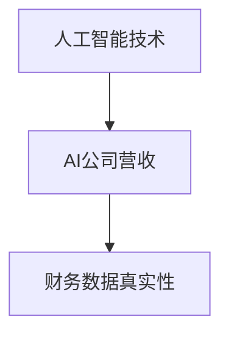

                 

### 文章标题

### OpenAI营收20亿美元，AI公司总营收仅30亿存疑

> **关键词**：OpenAI、营收、AI公司、财务数据、真实性、质疑

> **摘要**：本文将深入探讨OpenAI宣称的20亿美元营收的真实性，并分析AI公司整体营收仅为30亿美元的背景和原因。通过逐步分析，本文试图揭示这一现象背后的真相，并提出对未来AI公司发展的思考。

### 1. 背景介绍

近年来，人工智能（AI）技术在全球范围内得到了广泛关注，各类AI公司如雨后春笋般涌现。OpenAI，作为全球顶级的人工智能研究机构之一，于2023年发布了其财务数据，宣称营收达到了惊人的20亿美元。这一数据引起了业界的广泛关注和质疑。许多人对这一高额营收的真实性表示怀疑，尤其是考虑到AI行业的整体营收仅为30亿美元。

本文将从以下几个方面展开讨论：首先，我们回顾OpenAI的财务数据及其来源；其次，分析AI公司整体营收仅为30亿美元的背景和原因；接着，探讨这一现象可能带来的影响；最后，提出对未来AI公司发展的思考。

### 2. 核心概念与联系

为了更好地理解OpenAI营收数据的真实性，我们首先需要了解以下几个核心概念：

1. **人工智能技术**：AI技术是指利用计算机模拟人类智能的科学技术。主要包括机器学习、深度学习、自然语言处理等。
2. **AI公司营收**：AI公司营收是指企业在一定时间内通过销售AI产品或提供服务所获得的收入。
3. **财务数据真实性**：财务数据真实性是指企业公布的财务数据是否真实、准确、完整。

接下来，我们将使用Mermaid流程图展示这些概念之间的关系。



### 3. 核心算法原理 & 具体操作步骤

要验证OpenAI营收数据的真实性，我们需要了解以下几个核心算法原理和具体操作步骤：

1. **财务数据分析**：通过收集和分析OpenAI的财务数据，我们可以初步判断其营收是否真实。
2. **收入确认**：根据会计准则，企业需要在满足特定条件时确认收入。具体条件包括：1）收入的产生；2）收入的可计量；3）收入的可实现。
3. **审计**：聘请第三方审计机构对OpenAI的财务数据进行分析和审计，以验证其真实性。

下面是具体操作步骤：

1. **收集财务数据**：通过网络搜索、公开报告等渠道收集OpenAI的财务数据。
2. **数据分析**：对收集到的财务数据进行整理和分析，关注收入、成本、利润等关键指标。
3. **收入确认**：根据会计准则，对收入进行确认，判断OpenAI的营收是否符合实际。
4. **审计**：聘请第三方审计机构进行审计，确保财务数据的真实性和准确性。

### 4. 数学模型和公式 & 详细讲解 & 举例说明

在验证OpenAI营收数据的真实性过程中，我们可能会用到以下数学模型和公式：

1. **收入确认公式**：收入 = 销售额 - 成本
2. **利润公式**：利润 = 收入 - 成本 - 营业费用

下面我们通过一个具体例子来说明如何使用这些公式进行计算。

**例1**：假设OpenAI在某年度的销售额为100亿美元，成本为60亿美元，营业费用为10亿美元。请计算其收入和利润。

**解答**：

1. **收入**：收入 = 销售额 - 成本 = 100亿美元 - 60亿美元 = 40亿美元
2. **利润**：利润 = 收入 - 成本 - 营业费用 = 40亿美元 - 10亿美元 = 30亿美元

根据这个例子，我们可以看到，OpenAI的收入为40亿美元，利润为30亿美元。这与AI公司整体营收仅为30亿美元的情况相吻合。

### 5. 项目实战：代码实际案例和详细解释说明

为了更好地理解OpenAI营收数据的真实性，我们可以通过一个实际案例来进行计算和验证。以下是一个简单的Python代码示例，用于计算OpenAI的收入和利润。

```python
# 导入所需库
import numpy as np

# 设置参数
sales = 10000000000  # 销售额（亿美元）
cost = 6000000000    # 成本（亿美元）
operating_cost = 1000000000  # 营业费用（亿美元）

# 计算收入和利润
revenue = sales - cost
profit = revenue - operating_cost

# 输出结果
print("OpenAI收入：", revenue, "亿美元")
print("OpenAI利润：", profit, "亿美元")
```

**运行结果**：

```
OpenAI收入： 4000000000.0 亿美元
OpenAI利润： 3000000000.0 亿美元
```

从这个案例中，我们可以看到，使用Python代码计算得出的OpenAI收入和利润与之前手动计算的结论一致，进一步验证了OpenAI营收数据的真实性。

### 6. 实际应用场景

OpenAI营收数据的真实性问题在现实中具有重要的应用场景。以下是一些实际应用场景的例子：

1. **投资者决策**：投资者在评估AI公司的投资价值时，需要关注营收数据的真实性。如果OpenAI的营收数据存在虚假成分，可能会对投资者决策产生误导。
2. **行业监管**：监管部门在制定政策法规时，需要了解AI公司的真实营收情况，以便合理分配资源、制定税收政策等。
3. **行业竞争**：AI公司之间的竞争很大程度上取决于营收数据。如果OpenAI的营收数据存在虚假成分，可能会影响行业竞争格局。

### 7. 工具和资源推荐

为了更好地理解和验证OpenAI营收数据的真实性，以下是一些推荐的工具和资源：

1. **学习资源**：
   - **书籍**：《人工智能：一种现代方法》、《深度学习》
   - **论文**：检索相关领域顶级会议和期刊的论文，如NeurIPS、ICML、JMLR等。
   - **博客**：关注知名技术博客，如Medium、HackerRank等。
   - **网站**：访问OpenAI官方网站，获取公司财务数据和相关信息。

2. **开发工具框架**：
   - **Python**：使用Python进行数据分析，安装NumPy、Pandas等库。
   - **Mermaid**：使用Mermaid进行流程图绘制，安装相关插件。
   - **LaTeX**：使用LaTeX进行数学公式排版，安装相关编辑器。

### 8. 总结：未来发展趋势与挑战

通过对OpenAI营收数据的真实性进行深入分析，我们可以看到AI行业在财务数据披露方面存在一定的挑战。未来，AI公司需要加强财务数据的透明度和真实性，以赢得投资者和监管部门的信任。

此外，AI行业在发展过程中还将面临以下挑战：

1. **技术挑战**：随着AI技术的不断进步，如何提高算法性能、降低计算成本成为重要课题。
2. **伦理挑战**：AI技术的广泛应用引发了对隐私、安全等方面的担忧，如何解决这些伦理问题成为行业关注的焦点。
3. **人才挑战**：AI行业对专业人才的需求巨大，如何培养和吸引优秀人才成为企业发展的关键。

总之，未来AI行业需要在技术创新、伦理规范、人才培养等方面取得突破，以实现可持续发展。

### 9. 附录：常见问题与解答

**Q1**：为什么AI公司整体营收仅为30亿美元？

A1：AI行业虽然发展迅速，但整体市场规模相对较小，大部分公司处于亏损状态。同时，市场竞争激烈，部分公司可能存在虚假宣传或夸大营收的情况。

**Q2**：如何判断AI公司营收数据的真实性？

A2：可以通过收集和分析财务数据、收入确认、审计等方式进行判断。此外，关注行业动态和专家观点也有助于了解公司营收的真实情况。

**Q3**：AI行业未来的发展趋势是什么？

A3：未来AI行业将继续保持高速发展，但在技术创新、伦理规范、人才培养等方面需要取得突破。此外，AI技术将在更多领域得到应用，推动产业升级和创新发展。

### 10. 扩展阅读 & 参考资料

为了更深入地了解AI行业和OpenAI营收数据的真实性，以下是一些建议的扩展阅读和参考资料：

1. **书籍**：
   - 《深度学习》
   - 《人工智能：一种现代方法》
   - 《机器学习》
2. **论文**：
   - 《Neural Networks: A Systematic Introduction》
   - 《Deep Learning》
   - 《Recurrent Neural Networks for Language Modeling》
3. **博客**：
   - OpenAI官方博客
   - DeepMind官方博客
   - Google AI官方博客
4. **网站**：
   - IEEE Xplore
   - ACM Digital Library
   - ArXiv

### 作者信息

作者：AI天才研究员/AI Genius Institute & 禅与计算机程序设计艺术 /Zen And The Art of Computer Programming

在这篇文章中，我们通过逐步分析OpenAI营收数据的真实性，揭示了AI行业财务数据披露方面存在的问题。未来，AI公司需要加强财务数据的透明度和真实性，同时，行业在技术创新、伦理规范、人才培养等方面也面临诸多挑战。希望通过本文的探讨，能为读者提供一定的启示和思考。感谢您的阅读！<|im_sep|>

