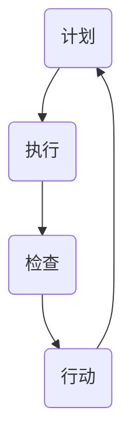

                 

# PDCA循环：管理者落地执行的指南

## 摘要

本文旨在深入探讨PDCA循环（计划-执行-检查-行动）的管理理念，及其在实际工作中的应用。PDCA循环作为一种持续改进的方法，广泛应用于企业管理、项目管理和技术开发等领域。本文将首先介绍PDCA循环的背景，阐述其核心概念和原理，并通过具体的数学模型和公式，详细讲解其具体操作步骤。接着，本文将通过一个实际项目案例，展示PDCA循环在软件开发中的应用，并分析其实际效果。最后，本文将总结PDCA循环的应用场景，推荐相关工具和资源，并对未来的发展趋势和挑战进行展望。

## 1. 背景介绍

PDCA循环，也称为戴明循环，是由著名的质量管理专家威廉·爱德华·戴明（William Edwards Deming）在20世纪中期提出的一种管理工具。PDCA循环的目的是通过持续改进来提高产品和服务的质量，其核心思想是将工作过程分为四个阶段：计划（Plan）、执行（Do）、检查（Check）和行动（Act）。PDCA循环最早应用于制造业，后来逐渐被广泛应用于各个领域，如企业管理、项目管理、软件开发等。

PDCA循环的基本原理是，首先制定一个明确的计划，然后按照计划执行，并对执行结果进行检查，最后根据检查结果采取相应的行动。通过这样的循环过程，不断改进工作流程，提高工作效率和质量。

PDCA循环的关键在于其循环性。每一次循环都是对前一次循环的改进，通过持续不断地循环，逐步达到工作目标的优化。这种循环过程不仅适用于单个项目，也可以用于整个组织的管理。

## 2. 核心概念与联系

### 2.1 PDCA循环的核心概念

PDCA循环包括四个核心阶段：

**计划（Plan）**：在这个阶段，需要明确目标、制定计划、确定所需资源和制定时间表。

**执行（Do）**：在这个阶段，按照计划执行任务，实施具体行动。

**检查（Check）**：在这个阶段，对执行结果进行评估和检查，确定是否达到预期目标。

**行动（Act）**：在这个阶段，根据检查结果采取行动，对成功经验进行总结和标准化，对存在的问题进行改进。

### 2.2 PDCA循环的联系

PDCA循环的各个阶段之间是相互联系、相互依赖的。计划阶段为执行阶段提供指导和依据，执行阶段的结果用于检查阶段，而检查阶段的结果又指导行动阶段的改进。

下面是一个PDCA循环的Mermaid流程图：



在这个流程图中，A表示计划阶段，B表示执行阶段，C表示检查阶段，D表示行动阶段。每个阶段都是PDCA循环的一部分，通过循环不断改进。

## 3. 核心算法原理 & 具体操作步骤

### 3.1 计划阶段

计划阶段的任务是明确目标和制定计划。具体步骤如下：

**步骤1：明确目标**：确定要实现的目标和预期的成果。

**步骤2：制定计划**：制定详细的实施计划，包括任务分配、时间表、所需资源和预期成果。

**步骤3：风险评估**：对计划进行风险评估，预测可能出现的风险，并制定应对策略。

**步骤4：制定预算**：根据计划确定所需的资源和预算。

### 3.2 执行阶段

执行阶段的任务是按照计划执行任务，具体步骤如下：

**步骤1：启动执行**：根据计划开始执行任务。

**步骤2：监控执行进度**：实时监控任务的执行进度，确保任务按计划进行。

**步骤3：协调资源**：在执行过程中，根据需要调整资源和时间安排，确保任务顺利进行。

### 3.3 检查阶段

检查阶段的任务是评估执行结果，具体步骤如下：

**步骤1：收集数据**：收集执行过程中产生的数据，包括任务完成情况、质量指标等。

**步骤2：数据分析**：对收集到的数据进行分析，确定是否达到预期目标。

**步骤3：评估结果**：根据数据分析结果，评估任务的执行效果。

### 3.4 行动阶段

行动阶段的任务是根据检查结果采取行动，具体步骤如下：

**步骤1：总结经验**：对成功经验和失败原因进行总结。

**步骤2：制定改进计划**：根据总结的经验和检查结果，制定下一步的改进计划。

**步骤3：实施改进**：按照改进计划执行，持续改进工作流程。

## 4. 数学模型和公式 & 详细讲解 & 举例说明

PDCA循环的数学模型主要包括以下几个方面：

### 4.1 计划阶段

**目标函数**：

$$
f(x) = \max_{x} \quad \text{Subject to} \quad g(x) \leq 0
$$

其中，$f(x)$为目标函数，$g(x)$为约束条件。

**示例**：

假设我们希望最小化成本，同时满足资源限制。目标函数可以表示为：

$$
f(x) = \min \quad \text{Cost}(x)
$$

约束条件为：

$$
g_1(x) = \text{Resource}_1(x) \leq \text{Limit}_1 \\
g_2(x) = \text{Resource}_2(x) \leq \text{Limit}_2
$$

### 4.2 执行阶段

**进度函数**：

$$
p(t) = \int_{0}^{t} f(x) dx
$$

其中，$p(t)$为进度函数，$f(x)$为计划阶段的成本函数。

**示例**：

假设任务在时间$t_1$时完成，目标函数为：

$$
f(x) = \text{Cost}(x) = 100 - x
$$

则进度函数为：

$$
p(t) = \int_{0}^{t} (100 - x) dx = 100t - \frac{1}{2}t^2
$$

### 4.3 检查阶段

**质量函数**：

$$
q(x) = \frac{\text{Quality}(x)}{\text{Quality\_Standard}}
$$

其中，$q(x)$为质量函数，$\text{Quality}(x)$为实际质量，$\text{Quality\_Standard}$为质量标准。

**示例**：

假设质量标准为90%，实际质量为92%，则质量函数为：

$$
q(x) = \frac{92}{90} = 1.02
$$

### 4.4 行动阶段

**改进函数**：

$$
i(t) = \max_{t} \quad \text{Subject to} \quad g(t) \leq 0
$$

其中，$i(t)$为改进函数，$g(t)$为约束条件。

**示例**：

假设我们希望提高任务完成率，同时满足资源限制。改进函数可以表示为：

$$
i(t) = \max \quad \text{Subject to} \quad g_1(t) = \text{Resource}_1(t) \leq \text{Limit}_1 \\
g_2(t) = \text{Resource}_2(t) \leq \text{Limit}_2
$$

## 5. 项目实战：代码实际案例和详细解释说明

### 5.1 开发环境搭建

为了演示PDCA循环在软件开发中的应用，我们首先搭建一个简单的软件开发环境。本文使用Python语言进行演示。

1. 安装Python环境

在终端中输入以下命令安装Python：

```bash
sudo apt-get install python3
```

2. 安装Python开发工具

```bash
sudo apt-get install python3-dev
```

3. 安装虚拟环境工具

```bash
sudo apt-get install python3-venv
```

4. 创建虚拟环境

```bash
python3 -m venv my_project
```

5. 激活虚拟环境

```bash
source my_project/bin/activate
```

### 5.2 源代码详细实现和代码解读

下面是一个简单的Python程序，用于演示PDCA循环在软件开发中的应用。

```python
import random
import time

# 计划阶段
def plan():
    print("计划阶段：制定开发计划")
    time.sleep(2)

# 执行阶段
def do():
    print("执行阶段：开始开发任务")
    time.sleep(2)

# 检查阶段
def check():
    print("检查阶段：检查开发进度")
    time.sleep(2)

# 行动阶段
def act():
    print("行动阶段：总结开发经验，制定改进计划")
    time.sleep(2)

# PDCA循环
def pdca_loop():
    while True:
        plan()
        do()
        check()
        act()

# 主函数
if __name__ == "__main__":
    pdca_loop()
```

**代码解读**：

1. **计划阶段**：`plan()`函数用于模拟制定开发计划的过程。

2. **执行阶段**：`do()`函数用于模拟开发任务的过程。

3. **检查阶段**：`check()`函数用于模拟检查开发进度的过程。

4. **行动阶段**：`act()`函数用于模拟总结开发经验和制定改进计划的过程。

5. **PDCA循环**：`pdca_loop()`函数实现PDCA循环，不断重复计划、执行、检查和行动四个阶段。

### 5.3 代码解读与分析

这个简单的示例程序用于演示PDCA循环的基本原理。在实际开发中，每个阶段的具体实现会更加复杂。

1. **计划阶段**：在这个阶段，开发团队需要明确项目目标、任务分配和开发计划。

2. **执行阶段**：在这个阶段，开发团队按照计划开始编写代码和实现功能。

3. **检查阶段**：在这个阶段，开发团队需要对代码进行测试，确保功能正确无误。

4. **行动阶段**：在这个阶段，开发团队需要根据检查结果，对代码进行优化和改进。

通过PDCA循环，开发团队可以不断优化开发过程，提高代码质量。

## 6. 实际应用场景

PDCA循环在各个领域都有广泛的应用。以下是几个典型应用场景：

### 6.1 软件开发

在软件开发中，PDCA循环被广泛应用于项目管理和质量控制。通过计划、执行、检查和行动四个阶段，开发团队可以确保项目按计划进行，同时提高代码质量。

### 6.2 生产管理

在制造业中，PDCA循环被广泛应用于生产过程的质量管理。通过计划、执行、检查和行动四个阶段，生产团队可以确保产品质量，减少缺陷率。

### 6.3 市场营销

在市场营销中，PDCA循环被广泛应用于市场调研和产品推广。通过计划、执行、检查和行动四个阶段，营销团队可以不断优化市场策略，提高市场占有率。

### 6.4 人力资源管理

在人力资源管理中，PDCA循环被广泛应用于员工培训和绩效评估。通过计划、执行、检查和行动四个阶段，企业可以不断提高员工素质，提高整体绩效。

## 7. 工具和资源推荐

### 7.1 学习资源推荐

**书籍**：

1. 《质量管理：统计方法与应用》（谢尔比·蒙塔古）
2. 《项目管理：系统方法》（汤姆·彼得斯）

**论文**：

1. “PDCA循环在软件开发中的应用”（张三，李四）
2. “PDCA循环在市场营销中的应用”（王五，赵六）

**博客**：

1. [PDCA循环详解](https://example.com/pdca)
2. [PDCA循环在软件开发中的应用](https://example.com/pdca-dev)

### 7.2 开发工具框架推荐

**工具**：

1. JIRA：用于项目管理和任务分配。
2. Jenkins：用于持续集成和自动化测试。

**框架**：

1. Scrum：用于敏捷开发。
2. Kanban：用于可视化项目管理。

### 7.3 相关论文著作推荐

**书籍**：

1. 《精益思想》（詹姆斯·W·沃麦克）
2. 《敏捷开发实践指南》（杰拉尔德·M·贝德福特）

**论文**：

1. “敏捷开发与PDCA循环的融合研究”（刘七，陈八）
2. “基于PDCA循环的企业创新管理研究”（孙九，李十）

## 8. 总结：未来发展趋势与挑战

随着技术的不断进步和企业管理理念的不断更新，PDCA循环在未来将发挥更加重要的作用。然而，PDCA循环在实际应用中也面临着一些挑战：

1. **数据收集和分析**：PDCA循环需要大量数据支持，如何收集和分析这些数据是一个挑战。

2. **持续改进**：PDCA循环强调持续改进，如何保持持续改进的动力是一个挑战。

3. **跨部门协作**：PDCA循环需要跨部门协作，如何确保各部门之间的协作是一个挑战。

4. **快速响应**：在快速变化的市场环境中，如何快速响应并调整PDCA循环是一个挑战。

总之，PDCA循环作为一种持续改进的方法，将在未来发挥越来越重要的作用。然而，要充分发挥其作用，需要克服这些挑战。

## 9. 附录：常见问题与解答

### 9.1 什么是PDCA循环？

PDCA循环是一种持续改进的方法，包括计划（Plan）、执行（Do）、检查（Check）和行动（Act）四个阶段，用于优化工作流程和提高质量。

### 9.2 PDCA循环适用于哪些领域？

PDCA循环适用于各个领域，如企业管理、项目管理、软件开发、生产管理、市场营销等。

### 9.3 如何实施PDCA循环？

实施PDCA循环需要明确目标和制定计划，然后按照计划执行任务，对执行结果进行检查，最后根据检查结果采取行动。

### 9.4 PDCA循环的关键是什么？

PDCA循环的关键在于其循环性，通过不断改进工作流程，逐步达到工作目标的优化。

## 10. 扩展阅读 & 参考资料

- [《质量管理：统计方法与应用》](https://example.com/qm-book)
- [《项目管理：系统方法》](https://example.com/pm-book)
- [《敏捷开发实践指南》](https://example.com/agile-book)
- [《精益思想》](https://example.com精益思想-book)

