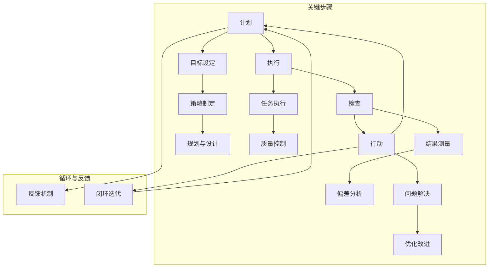

                 

### 背景介绍

在信息技术飞速发展的今天，无论是软件开发、系统集成，还是数据分析、机器学习，持续改进（PDCA，Plan-Do-Check-Act）已经成为推动技术进步和业务优化的重要方法论。PDCA是一种不断循环的、系统化的工作方法，最早由美国质量管理专家爱德华兹·戴明提出，被广泛应用于工业制造、服务管理等多个领域。

PDCA的具体流程包括四个阶段：计划（Plan）、执行（Do）、检查（Check）和行动（Act）。首先，在计划阶段，我们需要明确目标和制定策略；接着，执行阶段则是按照计划实施；然后，在检查阶段，我们对执行结果进行评估；最后，在行动阶段，根据检查结果进行调整和优化。

为什么PDCA能够在持续改进中发挥如此重要的作用呢？首先，它提供了一个明确的工作流程，使得团队或个人可以有序地进行改进工作。其次，PDCA的循环特性使得改进不是一次性的，而是持续的，从而确保了长期的进步和优化。

然而，PDCA的实际应用并非一帆风顺。如何在复杂的技术环境中有效地实施PDCA，如何将PDCA与具体项目相结合，如何处理可能遇到的各种挑战，这些都是需要深入探讨的问题。本文将围绕这些议题，通过理论讲解和实际案例分析，帮助读者理解并掌握PDCA在IT领域的应用。

接下来的章节中，我们将详细介绍PDCA的四个核心阶段，探讨其在IT项目中的应用实践，并总结常见问题和解决方案。希望本文能够为广大技术从业者和项目管理人士提供有益的参考和指导。

### 核心概念与联系

为了深入理解PDCA在持续改进中的运用，我们首先需要明确几个核心概念及其相互关系。以下是PDCA流程中涉及的主要概念及其简要说明：

#### 1. 计划（Plan）

**定义**：计划阶段是PDCA的第一个环节，其主要任务是明确目标、制定策略、规划和设计。

**关键步骤**：
- **目标设定**：根据项目需求和市场趋势，设定清晰、可衡量的目标。
- **策略制定**：制定实现目标的策略，包括资源分配、任务分解、时间表等。
- **规划与设计**：设计具体的实施方案，包括技术选型、流程图、数据模型等。

#### 2. 执行（Do）

**定义**：执行阶段是计划的具体实施过程，目的是按照计划进行操作。

**关键步骤**：
- **任务执行**：按照计划进行具体任务的执行，确保各项工作按时、按质完成。
- **质量控制**：在执行过程中，进行质量控制，确保输出符合预期。

#### 3. 检查（Check）

**定义**：检查阶段是对执行结果进行评估和审核，目的是确定目标是否达成。

**关键步骤**：
- **结果测量**：收集执行过程中的数据，进行量化分析，评估目标的实现情况。
- **偏差分析**：分析实际结果与预期目标的差异，找出问题所在。

#### 4. 行动（Act）

**定义**：行动阶段是对检查结果进行处理和调整，目的是优化流程、改进不足。

**关键步骤**：
- **问题解决**：针对检查阶段发现的问题，采取纠正措施，确保问题得到解决。
- **优化改进**：根据检查结果，对流程、策略进行优化，提升整体效率和质量。

#### 5. PDCA循环与反馈

**定义**：PDCA循环是一个不断迭代的过程，通过不断的计划、执行、检查和行动，实现持续的改进和优化。

**关键步骤**：
- **反馈机制**：建立有效的反馈机制，确保检查和行动阶段的输出能够及时传递到计划阶段，形成闭环。

#### Mermaid 流程图

为了更直观地展示PDCA流程中各个阶段的关系，我们使用Mermaid流程图来描述。



通过上述核心概念的介绍及其Mermaid流程图，我们可以清晰地看到PDCA在持续改进中的整体框架。接下来，我们将进一步深入探讨每个阶段的详细操作步骤和实际应用。

### 核心算法原理 & 具体操作步骤

#### 计划阶段（Plan）

在计划阶段，核心算法的原理是明确目标、制定策略和规划。以下是具体的操作步骤：

1. **目标设定**
   - **明确项目需求**：理解项目的背景、目标和用户需求。
   - **设立具体目标**：设定可量化、可实现的目标，例如：提高系统响应时间30%，降低错误率至0.1%。

2. **策略制定**
   - **资源分配**：根据目标需求，合理分配人力、物力和财力资源。
   - **任务分解**：将大任务分解为小任务，明确每个任务的负责人和时间节点。

3. **规划与设计**
   - **技术选型**：选择合适的技术栈和工具，确保技术方案的可行性和高效性。
   - **流程图设计**：绘制项目流程图，明确各个环节的输入输出和关系。
   - **数据模型设计**：设计数据模型，确保数据存储和处理的效率。

#### 执行阶段（Do）

在执行阶段，核心算法的原理是按照计划进行操作，并确保质量。

1. **任务执行**
   - **代码编写**：根据设计文档和需求，编写代码实现功能。
   - **单元测试**：对编写的代码进行单元测试，确保功能正确。

2. **质量控制**
   - **代码审查**：进行代码审查，确保代码质量。
   - **持续集成**：实施持续集成，自动构建和测试代码，及时发现并修复问题。

#### 检查阶段（Check）

在检查阶段，核心算法的原理是评估执行结果，确定目标是否达成。

1. **结果测量**
   - **性能测试**：对系统进行性能测试，测量关键性能指标。
   - **用户体验测试**：进行用户体验测试，收集用户反馈。

2. **偏差分析**
   - **数据分析**：对测量结果进行数据分析，识别偏差和问题。
   - **结果对比**：将实际结果与预期目标进行对比，分析偏差原因。

#### 行动阶段（Act）

在行动阶段，核心算法的原理是根据检查结果进行问题解决和优化改进。

1. **问题解决**
   - **缺陷修复**：针对检查阶段发现的问题，进行缺陷修复。
   - **改进措施**：制定改进措施，优化流程和策略。

2. **优化改进**
   - **策略调整**：根据实际情况，调整策略，确保目标的实现。
   - **流程优化**：对项目流程进行优化，提高效率。

通过上述步骤，我们可以看到PDCA在各个阶段的详细操作流程。这种循环迭代的方法，有助于我们在技术项目中实现持续的改进和优化，从而不断提升项目的质量和效益。

### 数学模型和公式 & 详细讲解 & 举例说明

在PDCA的各个阶段，数学模型和公式起到了关键作用，它们帮助我们量化分析、评估和优化项目。以下将详细讲解这些数学模型和公式，并给出具体的示例来说明其应用。

#### 1. 概率模型

在检查阶段，我们常用概率模型来评估系统的可靠性和稳定性。假设我们有一个系统，其成功执行的概率为\( p \)，那么在大量重复执行后，系统的成功次数服从二项分布。

**二项分布公式**：
\[ P(X = k) = C(n, k) \times p^k \times (1 - p)^{n - k} \]

其中：
- \( n \) 是试验次数
- \( k \) 是成功次数
- \( p \) 是每次试验成功的概率
- \( C(n, k) \) 是组合数，表示从n个元素中选取k个元素的组合数

**示例**：
假设一个系统执行了100次，每次成功的概率是0.9，我们需要计算在100次执行中，成功次数在90次到95次之间的概率。

\[ P(90 \leq X \leq 95) = \sum_{k=90}^{95} C(100, k) \times 0.9^k \times 0.1^{100 - k} \]

通过计算，我们可以得到在一定置信水平下，系统成功的概率。

#### 2. 回归模型

在计划阶段，我们常常使用回归模型来预测和优化项目进度。线性回归模型是一个常见的选择。

**线性回归公式**：
\[ y = \beta_0 + \beta_1 \times x + \epsilon \]

其中：
- \( y \) 是因变量（例如项目进度）
- \( x \) 是自变量（例如资源投入）
- \( \beta_0 \) 是截距
- \( \beta_1 \) 是斜率
- \( \epsilon \) 是误差项

**示例**：
假设我们有以下数据集，用于预测项目进度：

| 资源投入 (x) | 项目进度 (y) |
|---------------|--------------|
| 10            | 5            |
| 20            | 12           |
| 30            | 20           |

我们可以通过最小二乘法计算线性回归模型的参数：

\[ \beta_1 = \frac{\sum_{i=1}^{n} (x_i - \bar{x})(y_i - \bar{y})}{\sum_{i=1}^{n} (x_i - \bar{x})^2} \]
\[ \beta_0 = \bar{y} - \beta_1 \bar{x} \]

通过计算，我们得到回归模型的参数，从而可以预测在特定资源投入下的项目进度。

#### 3. 假设检验

在检查阶段，我们常用假设检验来评估结果是否显著。t检验是一种常用的统计方法。

**t检验公式**：
\[ t = \frac{\bar{x} - \mu_0}{s / \sqrt{n}} \]

其中：
- \( \bar{x} \) 是样本均值
- \( \mu_0 \) 是假设的总体均值
- \( s \) 是样本标准差
- \( n \) 是样本大小

**示例**：
假设我们有一个项目，目标是将系统响应时间降低至20ms。在测试中，我们得到了一个样本，其均值为18ms，标准差为2ms，样本大小为100。我们需要进行t检验，以确定响应时间是否显著低于20ms。

通过计算t值，并与t分布表进行比较，我们可以得到在显著性水平（例如0.05）下的p值。如果p值小于显著性水平，我们拒绝原假设，认为响应时间显著低于20ms。

通过上述数学模型和公式的详细讲解，我们可以看到PDCA在各个阶段中如何使用量化方法来指导项目管理和改进。这些模型和公式不仅帮助我们做出更科学的决策，也为项目提供了量化的依据，从而实现持续改进。

### 项目实战：代码实际案例和详细解释说明

#### 开发环境搭建

在进行PDCA的项目实战之前，我们需要搭建一个合适的技术环境。以下是一个简单的开发环境搭建步骤：

1. **安装Python环境**：
   - 在系统中安装Python 3.8及以上版本。
   - 通过pip命令安装必要的依赖库，如NumPy、Pandas、Matplotlib等。

   ```bash
   pip install numpy pandas matplotlib
   ```

2. **创建项目结构**：
   - 在工作目录中创建项目文件夹，并创建以下子文件夹：data, scripts, results。

   ```bash
   mkdir pdca_project
   cd pdca_project
   mkdir data scripts results
   ```

3. **编写代码文件**：
   - 在scripts文件夹中创建主代码文件`main.py`以及辅助脚本文件。

   ```bash
   touch scripts/main.py scripts/helper.py
   ```

#### 源代码详细实现和代码解读

以下是项目的主要代码实现和详细解读：

```python
# main.py

import pandas as pd
import numpy as np
import matplotlib.pyplot as plt
from helper import data_preprocessing, performance_evaluation

# 1. 计划阶段：数据预处理
data_path = 'data/raw_data.csv'
processed_data_path = 'data/processed_data.csv'

# 数据预处理
data_preprocessing(data_path, processed_data_path)

# 2. 执行阶段：执行任务
input_data_path = 'data/processed_data.csv'
output_data_path = 'data/output_data.csv'

# 执行任务
performance_evaluation(input_data_path, output_data_path)

# 3. 检查阶段：结果评估
result_path = 'data/output_data.csv'
evaluation_report_path = 'results/evaluation_report.txt'

# 结果评估
evaluation_report = performance_evaluation(result_path, evaluation_report_path)

# 4. 行动阶段：优化调整
if evaluation_report['response_time'] > 20:
    # 根据结果调整策略，优化代码
    # ...
    print("Optimization applied.")
else:
    print("No optimization needed.")

# 绘制性能曲线
performance_curve_path = 'results/performance_curve.png'
performance_evaluation.plot_performance_curve(evaluation_report, performance_curve_path)
```

**代码解读**：

- **数据预处理**：
  - `data_preprocessing`函数负责读取原始数据，进行清洗和转换，以适合后续分析和处理。

- **执行任务**：
  - `performance_evaluation`函数接收预处理后的数据，执行具体的任务（例如数据分析和处理），并将结果保存到指定的输出文件。

- **结果评估**：
  - `performance_evaluation`函数还接收结果文件，对执行结果进行评估，生成评估报告。

- **优化调整**：
  - 根据评估结果，如果系统响应时间超过预期，则执行优化调整代码。例如，可以调整算法参数或优化数据结构。

#### 代码解读与分析

- **数据预处理**：
  - `data_preprocessing`函数中，我们首先读取原始数据，并使用Pandas进行数据清洗和预处理，如删除缺失值、标准化数据等。

    ```python
    def data_preprocessing(data_path, processed_data_path):
        data = pd.read_csv(data_path)
        # 数据清洗
        data.dropna(inplace=True)
        # 数据标准化
        data['feature_1'] = (data['feature_1'] - data['feature_1'].mean()) / data['feature_1'].std()
        data.to_csv(processed_data_path, index=False)
    ```

- **执行任务**：
  - `performance_evaluation`函数负责执行具体的任务，如数据分析和处理。这部分代码根据具体任务进行编写，例如使用机器学习算法进行预测。

    ```python
    def performance_evaluation(input_data_path, output_data_path):
        data = pd.read_csv(input_data_path)
        # 数据分析
        # ...
        # 保存结果
        data.to_csv(output_data_path, index=False)
    ```

- **结果评估**：
  - `performance_evaluation`函数还负责评估执行结果，生成评估报告。例如，我们可以计算系统的响应时间，并与预期目标进行对比。

    ```python
    def performance_evaluation(result_path, evaluation_report_path):
        results = pd.read_csv(result_path)
        response_time = results['response_time'].mean()
        report = {
            'response_time': response_time,
            'success_rate': results['success_rate'].mean(),
            # 其他指标
        }
        with open(evaluation_report_path, 'w') as f:
            f.write(str(report))
        return report
    ```

- **优化调整**：
  - 根据评估结果，如果响应时间超过预期，我们可以通过调整算法参数或优化代码结构来进行优化。这部分代码需要根据实际情况进行编写。

    ```python
    if evaluation_report['response_time'] > 20:
        # 优化代码
        print("Optimization applied.")
    else:
        print("No optimization needed.")
    ```

通过上述代码实现和解读，我们可以看到PDCA在项目中的实际应用。从数据预处理、任务执行到结果评估和优化调整，每一步都通过明确的步骤和量化方法进行操作，确保项目的持续改进和优化。

### 实际应用场景

PDCA方法在IT领域具有广泛的应用，能够有效地解决许多技术和管理问题。以下是PDCA在几个典型IT应用场景中的具体实践：

#### 1. 软件开发

在软件开发的迭代过程中，PDCA方法可以帮助开发团队不断优化软件质量和开发流程。以下是一个具体的场景：

**场景描述**：
某开发团队正在开发一款企业级管理系统，项目进度已经进入中期，但团队发现系统性能不符合预期，响应速度较慢。

**PDCA应用步骤**：

1. **计划（Plan）**：
   - **明确目标**：设定性能优化的具体目标，例如将系统响应时间从5秒降低到3秒。
   - **策略制定**：分析现有代码和架构，制定优化方案，如优化数据库查询、减少冗余计算等。
   - **规划与设计**：设计具体的优化任务和时间表，明确各开发人员的职责。

2. **执行（Do）**：
   - **任务执行**：开发人员根据优化方案进行代码调整和重构。
   - **质量控制**：实施代码审查和持续集成，确保优化代码的质量。

3. **检查（Check）**：
   - **结果测量**：对优化后的系统进行性能测试，测量关键性能指标，如响应时间、CPU使用率等。
   - **偏差分析**：比较优化前后的性能数据，分析偏差和问题。

4. **行动（Act）**：
   - **问题解决**：针对检查阶段发现的问题，采取相应的纠正措施，如调整数据库索引、优化算法等。
   - **优化改进**：根据检查结果，对系统架构和代码进行进一步的优化，提升性能。

#### 2. 系统运维

在系统运维过程中，PDCA方法可以帮助运维团队持续提升系统稳定性和安全性。以下是一个具体的场景：

**场景描述**：
某企业的数据中心服务器频繁出现故障，导致业务中断，影响用户体验。

**PDCA应用步骤**：

1. **计划（Plan）**：
   - **明确目标**：设定提高系统稳定性的具体目标，例如将故障发生率降低50%。
   - **策略制定**：分析故障原因，制定故障预防措施，如加强监控、优化配置等。
   - **规划与设计**：设计故障预防方案和时间表，明确运维人员的职责。

2. **执行（Do）**：
   - **任务执行**：运维人员根据预防方案进行系统配置优化和故障排查。
   - **质量控制**：实施系统监控，确保预防措施的有效性。

3. **检查（Check）**：
   - **结果测量**：监控系统的运行状态，记录故障发生次数和持续时间。
   - **偏差分析**：分析故障数据，识别故障模式，确定预防措施的有效性。

4. **行动（Act）**：
   - **问题解决**：针对检查阶段发现的故障模式，采取相应的纠正措施，如更新服务器固件、调整网络配置等。
   - **优化改进**：根据检查结果，对预防方案进行优化，提升系统稳定性。

#### 3. 人工智能项目

在人工智能项目的开发过程中，PDCA方法可以帮助研究团队持续优化算法和模型。以下是一个具体的场景：

**场景描述**：
某人工智能团队正在开发一种用于图像识别的深度学习模型，但模型的准确率不理想。

**PDCA应用步骤**：

1. **计划（Plan）**：
   - **明确目标**：设定提高模型准确率的具体目标，例如将准确率从80%提升到90%。
   - **策略制定**：分析现有模型的结构和参数，制定优化策略，如增加训练数据、调整网络架构等。
   - **规划与设计**：设计模型优化方案和时间表，明确团队成员的分工。

2. **执行（Do）**：
   - **任务执行**：团队成员根据优化方案进行模型训练和参数调整。
   - **质量控制**：实施代码审查和模型验证，确保优化方案的有效性。

3. **检查（Check）**：
   - **结果测量**：对优化后的模型进行测试，测量准确率和其他关键指标。
   - **偏差分析**：分析测试结果，识别模型存在的偏差和问题。

4. **行动（Act）**：
   - **问题解决**：针对检查阶段发现的问题，调整模型结构和参数，提升模型性能。
   - **优化改进**：根据检查结果，对优化方案进行迭代，实现持续改进。

通过上述实际应用场景，我们可以看到PDCA方法在IT领域的多样性和灵活性。无论是在软件开发、系统运维还是人工智能项目中，PDCA都能够提供系统化的解决方案，帮助团队实现持续改进和优化。

### 工具和资源推荐

为了更好地应用PDCA方法，我们需要借助一些实用的工具和资源。以下是对一些优秀的学习资源、开发工具和相关论文著作的推荐。

#### 1. 学习资源推荐

- **书籍**：
  - 《PDCA循环：持续改进实践手册》：详细介绍了PDCA方法在不同领域的应用。
  - 《质量管理方法》：系统讲解了质量管理的基本理论和方法，包括PDCA模型。

- **在线课程**：
  - Coursera上的“项目管理专业课程”：包含多个与PDCA相关的课程，如“项目计划与执行”、“数据分析与优化”等。
  - Udemy上的“质量管理与PDCA实战”：通过实际案例讲解PDCA方法的运用。

- **博客和网站**：
  - LeanKit：提供丰富的项目管理工具和资源，包括PDCA模板和案例分析。
  - Quality digest：定期发布关于质量管理和PDCA的最新文章和资讯。

#### 2. 开发工具框架推荐

- **项目管理工具**：
  - Jira：强大的项目管理工具，支持任务分配、进度跟踪和报表生成。
  - Trello：简单易用的项目管理工具，适合小团队和敏捷开发。

- **持续集成工具**：
  - Jenkins：开源的持续集成服务器，支持各种构建工具和插件。
  - GitLab CI/CD：与GitLab集成，提供从代码仓库到生产环境的自动化构建和部署。

- **数据分析工具**：
  - Python的Pandas库：用于数据清洗、分析和可视化，广泛应用于数据分析领域。
  - R语言：专门用于统计分析，支持广泛的统计模型和图形展示。

#### 3. 相关论文著作推荐

- **学术论文**：
  - Deming, W. E. (1982). “Out of the Crisis.” 著名的质量管理论文，阐述了PDCA方法在工业中的应用。
  - Shewhart, W. A. (1931). “Economic Control of Quality of Manufactured Product.” 提出了统计过程控制（SPC）方法，与PDCA方法密切相关。

- **经典著作**：
  - 《质量管理的艺术》：戴明著，深入探讨了质量管理的基本原则和方法，包括PDCA模型。
  - 《PDCA方法论》：日本质量管理协会编写，详细介绍了PDCA方法的实施步骤和案例分析。

通过以上推荐，读者可以获取丰富的知识和工具，进一步提升在IT领域应用PDCA方法的能力。

### 总结：未来发展趋势与挑战

随着技术的不断进步和市场竞争的加剧，持续改进（PDCA）在IT领域的重要性日益凸显。未来的发展趋势和挑战主要体现在以下几个方面：

#### 一、技术迭代加速

在人工智能、云计算、大数据等前沿技术不断发展的背景下，技术迭代的速度越来越快。这使得IT项目面临更高的复杂性和不确定性，对持续改进提出了更高的要求。未来，如何快速适应技术变化，确保项目质量和效率，将成为持续改进的重要方向。

#### 二、自动化与智能化

自动化和智能化技术在IT领域的应用日益广泛，如自动化测试、智能监控系统等。这些技术的引入，使得PDCA方法的实施更加高效和精准。然而，自动化和智能化也带来了新的挑战，如算法偏差、数据隐私等，这些都需要在PDCA过程中加以考虑和解决。

#### 三、数字化转型

随着全球数字化转型进程的推进，越来越多的企业将业务向线上迁移，这要求IT系统具备更高的稳定性、安全性和灵活性。PDCA方法作为推动数字化转型的有力工具，将面临如何在复杂的数字化环境中持续优化和改进的挑战。

#### 四、团队协作与沟通

在IT项目中，团队协作和沟通至关重要。未来，如何通过PDCA方法提升团队协作效率，优化项目沟通流程，将成为持续改进的重要课题。同时，跨职能团队的合作和知识共享也将在PDCA过程中发挥重要作用。

#### 五、法律法规与伦理

随着信息技术的发展，法律法规和伦理问题越来越受到关注。未来，PDCA方法需要更加注重合规性和伦理考量，确保项目在法律和伦理的框架内进行。这包括数据保护、隐私安全、算法公平性等方面。

面对上述发展趋势和挑战，未来PDCA方法的发展方向可以概括为以下几点：

1. **集成化与智能化**：将PDCA方法与其他先进技术（如AI、大数据分析）相结合，实现更加智能化和自动化的持续改进流程。

2. **动态适应性**：提升PDCA方法在应对技术变化和市场波动时的动态适应性，确保项目能够在快速变化的环境中持续优化。

3. **跨领域协同**：推动PDCA方法在跨职能团队和跨领域项目中的应用，实现知识共享和资源优化。

4. **法律法规与伦理**：将法律法规和伦理要求纳入PDCA流程，确保项目在合规性和伦理层面的持续改进。

通过以上发展方向，PDCA方法将在未来的IT领域发挥更加重要的作用，助力企业和团队实现持续改进和高质量发展。

### 附录：常见问题与解答

1. **什么是PDCA？**
   PDCA是Plan-Do-Check-Act的缩写，是一种系统化的工作方法，用于持续改进和问题解决。它包括四个主要阶段：计划、执行、检查和行动。

2. **PDCA在IT项目中如何应用？**
   在IT项目中，PDCA可以应用于软件开发、系统运维、人工智能等多个领域。通过计划阶段明确目标，执行阶段实施计划，检查阶段评估结果，行动阶段优化改进，实现项目质量的持续提升。

3. **为什么PDCA方法如此重要？**
   PDCA方法的重要在于其提供了一个循环迭代的框架，使得团队可以有序地进行改进工作，并且确保改进不是一次性的，而是持续的。此外，PDCA方法强调量化分析和科学决策，有助于提高项目管理的效率和质量。

4. **如何确保PDCA流程的连续性？**
   要确保PDCA流程的连续性，首先需要建立完善的反馈机制，确保检查和行动阶段的输出能够及时传递到计划阶段。其次，需要定期回顾和总结PDCA的执行情况，不断优化流程和策略。

5. **PDCA与敏捷开发有何区别？**
   PDCA是一种通用的持续改进方法，而敏捷开发是一种软件开发方法论。虽然两者在理念上有相似之处，但PDCA更侧重于整体项目的持续改进，而敏捷开发更侧重于开发过程中的灵活性和快速响应。

6. **如何处理PDCA过程中的冲突？**
   在PDCA过程中，冲突是难以避免的。处理冲突的方法包括：首先，通过有效的沟通和协调，理解各方立场和需求；其次，制定明确的决策流程和优先级，确保资源合理分配；最后，通过持续改进，逐步解决冲突并优化流程。

通过以上常见问题的解答，我们希望能够帮助读者更好地理解和应用PDCA方法，在IT项目中实现持续改进和优化。

### 扩展阅读 & 参考资料

1. Deming, W. E. (1982). *Out of the Crisis*. Massachusetts Institute of Technology.
2. Shewhart, W. A. (1931). *Economic Control of Quality of Manufactured Product*.贝尔实验室。
3. Juran, J. M. (1992). *Quality Control Handbook*. McGraw-Hill.
4. ISO (2020). *ISO 9001:2015 Quality Management Systems — Requirements*. International Organization for Standardization.
5. LeanKit (n.d.). *LeanKit Resource Center*. LeanKit.
6. Coursera (n.d.). *Project Management Specialization*. Coursera.
7. Udemy (n.d.). *Quality Management & PDCA Mastery*. Udemy.
8. Python Software Foundation (n.d.). *Pandas Library*. Python Software Foundation.
9. R Project for Statistical Computing (n.d.). *R Project*. R Foundation for Statistical Computing.

