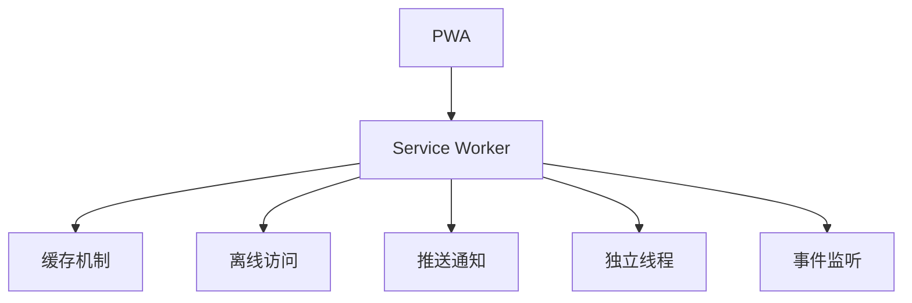

                 

# PWA离线存储技术：Service Worker应用

## 关键词

渐进式Web应用（PWA）、离线存储、Service Worker、前端缓存、Web App Manifest

## 摘要

本文将深入探讨渐进式Web应用（PWA）中的离线存储技术，特别是Service Worker的应用。我们将详细解释PWA的基本概念、Service Worker的作用和原理，并通过具体的案例展示如何使用Service Worker实现前端缓存和离线功能。文章还涵盖了PWA的实际应用场景、相关工具和资源推荐，以及对未来发展趋势和挑战的思考。

## 目录

1. 背景介绍
2. 核心概念与联系
3. 核心算法原理 & 具体操作步骤
4. 数学模型和公式 & 详细讲解 & 举例说明
5. 项目实战：代码实际案例和详细解释说明
   5.1 开发环境搭建
   5.2 源代码详细实现和代码解读
   5.3 代码解读与分析
6. 实际应用场景
7. 工具和资源推荐
   7.1 学习资源推荐
   7.2 开发工具框架推荐
   7.3 相关论文著作推荐
8. 总结：未来发展趋势与挑战
9. 附录：常见问题与解答
10. 扩展阅读 & 参考资料

## 1. 背景介绍

渐进式Web应用（PWA，Progressive Web Applications）是一种结合了Web应用和原生应用优势的新型应用形式。PWA不仅能够在浏览器中运行，还能提供类似原生应用的流畅用户体验，如快速启动、离线访问、推送通知等。这些特性使得PWA在移动端和桌面端都获得了广泛的应用。

离线存储是PWA的重要特性之一。在用户没有网络连接或网络连接不稳定的情况下，PWA能够通过缓存机制存储必要的资源，如CSS、JavaScript文件、图片等，从而保证应用能够正常运作。这极大地提升了用户的体验，减少了因网络问题导致的加载失败或应用崩溃。

Service Worker是PWA实现离线存储的关键技术。Service Worker是一种运行在独立线程中的脚本，它能够拦截和处理网络请求，从而实现缓存、推送通知等功能。Service Worker的出现，使得PWA的离线功能变得更加可靠和高效。

## 2. 核心概念与联系

### 2.1 渐进式Web应用（PWA）

渐进式Web应用（PWA）具有以下核心概念：

- **渐进性**：PWA能够逐步增强，以适应不同的设备和网络环境。
- **可安装性**：用户可以通过点击浏览器中的“添加到桌面”按钮，将PWA添加到主屏幕，实现类似于原生应用的操作体验。
- **离线访问**：在用户没有网络连接或网络连接不稳定时，PWA可以通过缓存机制提供离线访问功能。
- **快速响应**：PWA能够在较短时间内启动和响应，提供流畅的用户体验。
- **安全可靠**：PWA使用HTTPS协议，确保数据传输的安全性。

### 2.2 Service Worker

Service Worker是一种运行在独立线程中的脚本，负责处理网络请求、缓存资源等任务。它具有以下核心概念：

- **独立线程**：Service Worker运行在一个独立的线程中，不会影响到主线程的运行。
- **事件监听**：Service Worker能够监听和处理各种事件，如网络请求、消息传递等。
- **缓存机制**：Service Worker可以使用Cache API缓存资源，确保用户在离线状态下能够访问这些资源。

### 2.3 关系

PWA和Service Worker的关系可以概括为以下几点：

- PWA需要Service Worker来实现离线访问和缓存功能。
- Service Worker是PWA的核心组成部分，负责处理网络请求和资源缓存。
- PWA的其他特性，如可安装性、快速响应等，也需要依赖Service Worker的支持。

### 2.4 Mermaid 流程图

以下是PWA和Service Worker的关系的Mermaid流程图：



## 3. 核心算法原理 & 具体操作步骤

### 3.1 Service Worker的基本原理

Service Worker是一种运行在独立线程中的脚本，它能够拦截和处理网络请求，从而实现缓存、推送通知等功能。Service Worker的基本原理可以概括为以下几点：

1. **安装**：当用户首次访问PWA时，Service Worker会自动安装到用户的设备上。
2. **激活**：当Service Worker安装完成后，它会进入激活状态，开始处理网络请求。
3. **拦截请求**：Service Worker可以拦截和处理来自浏览器的网络请求。
4. **缓存资源**：Service Worker可以使用Cache API缓存必要的资源，如CSS、JavaScript文件、图片等。
5. **更新缓存**：Service Worker可以根据需要更新缓存中的资源。

### 3.2 Service Worker的具体操作步骤

以下是使用Service Worker实现前端缓存的具体操作步骤：

1. **创建Service Worker文件**：首先，需要创建一个Service Worker文件，通常命名为`service-worker.js`。
2. **注册Service Worker**：在主应用程序中，通过`navigator.serviceWorker.register()`方法注册Service Worker。
3. **拦截请求**：在Service Worker中，使用`event.waitUntil`方法拦截和处理网络请求。
4. **缓存资源**：使用Cache API缓存必要的资源。
5. **更新缓存**：在需要时，使用Cache API更新缓存中的资源。

以下是具体的代码实现：

```javascript
// 1. 创建Service Worker文件：service-worker.js
self.addEventListener('install', function(event) {
    event.waitUntil(
        caches.open('my-cache').then(function(cache) {
            return cache.addAll([
                '/',
                '/styles.css',
                '/script.js',
                '/image.png'
            ]);
        })
    );
});

self.addEventListener('fetch', function(event) {
    event.respondWith(
        caches.match(event.request).then(function(response) {
            return response || fetch(event.request);
        })
    );
});
```

```javascript
// 2. 注册Service Worker
if ('serviceWorker' in navigator) {
    window.addEventListener('load', function() {
        navigator.serviceWorker.register('/service-worker.js').then(function(registration) {
            console.log('Service Worker registered:', registration);
        }).catch(function(error) {
            console.log('Service Worker registration failed:', error);
        });
    });
}
```

## 4. 数学模型和公式 & 详细讲解 & 举例说明

### 4.1 缓存策略

在Service Worker中，缓存策略是非常重要的。缓存策略决定了如何处理网络请求和更新缓存中的资源。以下是一个简单的缓存策略的数学模型：

$$
\text{缓存策略} = f(\text{请求资源}, \text{缓存状态})
$$

其中，`f`表示缓存策略函数，`请求资源`和`缓存状态`是函数的输入。

### 4.2 缓存状态

缓存状态可以表示为：

$$
\text{缓存状态} = (\text{缓存命中}, \text{缓存过期}, \text{缓存大小})
$$

其中，`缓存命中`表示请求的资源已经在缓存中，`缓存过期`表示缓存中的资源已经过期，`缓存大小`表示缓存的总大小。

### 4.3 缓存策略举例

以下是一个简单的缓存策略举例：

$$
\text{缓存策略} = \begin{cases} 
\text{命中缓存} & \text{如果请求资源已经在缓存中} \\
\text{更新缓存} & \text{如果请求资源已过期但缓存大小未达到上限} \\
\text{忽略请求} & \text{如果请求资源已过期且缓存大小已达到上限}
\end{cases}
$$

### 4.4 代码实现

以下是一个简单的代码实现示例：

```javascript
self.addEventListener('fetch', function(event) {
    event.respondWith(
        caches.match(event.request).then(function(response) {
            if (response) {
                return response;
            } else {
                return fetch(event.request).then(function(response) {
                    if (response.status === 200) {
                        caches.open('my-cache').then(function(cache) {
                            cache.put(event.request, response.clone());
                        });
                    }
                    return response;
                });
            }
        })
    );
});
```

## 5. 项目实战：代码实际案例和详细解释说明

### 5.1 开发环境搭建

在本节中，我们将搭建一个简单的PWA项目，用于演示Service Worker的应用。以下是开发环境的搭建步骤：

1. **安装Node.js**：首先，需要安装Node.js，可以从[官方网站](https://nodejs.org/)下载并安装。
2. **创建项目**：使用以下命令创建一个新的项目：

   ```bash
   mkdir pwa-cache
   cd pwa-cache
   npm init -y
   ```

3. **安装依赖**：安装必要的依赖包，如`express`和`body-parser`：

   ```bash
   npm install express body-parser
   ```

4. **创建主应用程序**：在项目中创建一个名为`index.html`的HTML文件，内容如下：

   ```html
   <!DOCTYPE html>
   <html lang="en">
   <head>
       <meta charset="UTF-8">
       <meta name="viewport" content="width=device-width, initial-scale=1.0">
       <title>PWA Cache Example</title>
   </head>
   <body>
       <h1>Hello, PWA Cache Example!</h1>
       <script src="script.js"></script>
   </body>
   </html>
   ```

5. **创建Service Worker**：在项目中创建一个名为`service-worker.js`的Service Worker文件，内容如下：

   ```javascript
   self.addEventListener('install', function(event) {
       event.waitUntil(
           caches.open('my-cache').then(function(cache) {
               return cache.addAll([
                   '/',
                   '/styles.css',
                   '/script.js',
                   '/image.png'
               ]);
           })
       );
   });

   self.addEventListener('fetch', function(event) {
       event.respondWith(
           caches.match(event.request).then(function(response) {
               return response || fetch(event.request);
           })
       );
   });
   ```

6. **创建主服务器**：使用`express`创建一个简单的服务器，用于托管应用程序：

   ```javascript
   const express = require('express');
   const bodyParser = require('body-parser');

   const app = express();
   app.use(bodyParser.json());
   app.use(express.static('public'));

   app.listen(3000, () => {
       console.log('Server started on port 3000');
   });
   ```

7. **启动服务器**：在项目目录中运行以下命令启动服务器：

   ```bash
   node server.js
   ```

### 5.2 源代码详细实现和代码解读

在本节中，我们将详细解读PWA项目的源代码，并解释每个部分的作用。

#### 5.2.1 主应用程序（index.html）

主应用程序（`index.html`）是一个简单的HTML文件，包含以下内容：

```html
<!DOCTYPE html>
<html lang="en">
<head>
    <meta charset="UTF-8">
    <meta name="viewport" content="width=device-width, initial-scale=1.0">
    <title>PWA Cache Example</title>
</head>
<body>
    <h1>Hello, PWA Cache Example!</h1>
    <script src="script.js"></script>
</body>
</html>
```

- **<!DOCTYPE html>**：声明文档类型和版本。
- **<html>**：根元素，表示HTML文档。
- **<head>**：包含文档的元数据，如字符集和视图设置。
- **<title>**：文档标题，显示在浏览器标签上。
- **<body>**：包含文档的主体内容。
- **<h1>**：主标题，用于显示欢迎信息。
- **<script>**：引入主脚本文件（`script.js`），其中包含PWA的逻辑。

#### 5.2.2 Service Worker（service-worker.js）

Service Worker文件（`service-worker.js`）是实现缓存功能的核心部分，包含以下代码：

```javascript
self.addEventListener('install', function(event) {
    event.waitUntil(
        caches.open('my-cache').then(function(cache) {
            return cache.addAll([
                '/',
                '/styles.css',
                '/script.js',
                '/image.png'
            ]);
        })
    );
});

self.addEventListener('fetch', function(event) {
    event.respondWith(
        caches.match(event.request).then(function(response) {
            return response || fetch(event.request);
        })
    );
});
```

- **self.addEventListener('install', function(event) {...})**：监听`install`事件，当Service Worker安装时触发。
  - **event.waitUntil(...)**：等待缓存操作完成，确保在安装阶段完成缓存资源的添加。
  - **caches.open('my-cache').then(function(cache) {...})**：打开名为`my-cache`的缓存存储。
  - **cache.addAll([...])**：将指定的资源添加到缓存中。

- **self.addEventListener('fetch', function(event) {...})**：监听`fetch`事件，当应用程序发起网络请求时触发。
  - **event.respondWith(...)**：处理网络请求，返回缓存中的响应或发起网络请求。

#### 5.2.3 主服务器（server.js）

主服务器（`server.js`）是一个简单的Express服务器，用于托管应用程序。以下是代码：

```javascript
const express = require('express');
const bodyParser = require('body-parser');

const app = express();
app.use(bodyParser.json());
app.use(express.static('public'));

app.listen(3000, () => {
    console.log('Server started on port 3000');
});
```

- **const express = require('express');**：引入Express框架。
- **const bodyParser = require('body-parser');**：引入body-parser中间件，用于解析请求体。
- **const app = express();**：创建一个新的Express应用程序。
- **app.use(bodyParser.json());**：启用body-parser中间件，解析JSON请求体。
- **app.use(express.static('public'));**：托管`public`目录中的静态文件。
- **app.listen(3000, () => {...});**：启动服务器，监听3000端口。

### 5.3 代码解读与分析

在本节中，我们将对项目代码进行解读，并分析Service Worker的作用和实现。

#### 5.3.1 Service Worker的作用

Service Worker在PWA中起着至关重要的作用，主要包括以下方面：

1. **缓存资源**：Service Worker能够缓存应用程序所需的资源，如HTML、CSS、JavaScript文件等。这样，当用户在没有网络连接或网络连接不稳定时，仍然可以访问这些资源。
2. **拦截网络请求**：Service Worker可以拦截和处理应用程序的网络请求，从而实现自定义的缓存策略和错误处理。
3. **推送通知**：Service Worker可以接收服务器发送的推送通知，并在用户设备上显示通知。
4. **独立线程运行**：Service Worker运行在独立线程中，不会影响主线程的运行，从而提高应用程序的响应速度和稳定性。

#### 5.3.2 Service Worker的实现

在`service-worker.js`文件中，Service Worker通过监听`install`和`fetch`事件来实现缓存和拦截网络请求。

1. **监听`install`事件**：当Service Worker安装时，会触发`install`事件。在这个事件中，Service Worker会打开一个名为`my-cache`的缓存存储，并将指定的资源（如HTML、CSS、JavaScript文件）添加到缓存中。这样，当用户在没有网络连接或网络连接不稳定时，这些资源就可以从缓存中获取。

2. **监听`fetch`事件**：当应用程序发起网络请求时，会触发`fetch`事件。在这个事件中，Service Worker会检查请求的资源是否已经在缓存中。如果已经在缓存中，则会直接返回缓存中的响应；否则，会发起网络请求并返回响应。

通过这种方式，Service Worker实现了PWA的缓存功能，使得应用程序在离线状态下仍能正常运行。

### 5.4 实际使用场景

PWA的离线存储技术，尤其是Service Worker的应用，在实际开发中具有广泛的应用场景。以下是一些典型的应用场景：

1. **在线新闻阅读器**：用户可以离线阅读新闻文章，而不需要始终连接到互联网。
2. **在线购物应用**：用户可以在没有网络连接的情况下浏览和添加商品到购物车，当网络恢复时再提交订单。
3. **地图导航应用**：用户在离线状态下可以查看已下载的地图，进行导航。
4. **教育应用**：学生可以在离线状态下学习课程内容，下载课件和资料。

### 5.5 工具和资源推荐

为了更好地理解和应用PWA离线存储技术，以下是一些推荐的工具和资源：

1. **工具**：
   - **Google Chrome DevTools**：用于调试和测试Service Worker。
   - **Lighthouse**：用于评估PWA的性能和兼容性。
   - **Workbox**：是一个开源的Service Worker工具包，简化了Service Worker的开发和部署。

2. **资源**：
   - **MDN Web Docs**：关于PWA和Service Worker的详细文档。
   - **Google Chrome Developer**：关于PWA的开发教程和实践案例。
   - **FreeCodeCamp**：关于PWA的免费在线课程。

### 5.6 相关论文著作推荐

以下是一些关于PWA和Service Worker的经典论文和著作：

1. **"Progressive Web Apps: An Overview and Implementation Guide"**：该论文提供了对PWA的全面概述和实现指南。
2. **"Service Workers: An Introduction"**：这篇论文介绍了Service Worker的基本概念和应用。
3. **"Web App Manifest: The Key to Progressive Web Apps"**：该论文探讨了Web App Manifest在PWA中的重要性。

## 6. 总结：未来发展趋势与挑战

PWA和Service Worker作为现代Web开发的重要技术，正逐渐成为前端开发的趋势。未来，PWA的发展将面临以下挑战：

1. **兼容性**：由于不同浏览器的支持程度不同，PWA的兼容性成为一大挑战。
2. **性能优化**：随着应用复杂度的增加，如何优化PWA的性能成为关键。
3. **安全性和隐私**：PWA需要确保用户数据的安全和隐私。

然而，随着技术的不断进步，PWA的应用场景将更加广泛，其性能和安全性也将得到进一步提升。

## 7. 附录：常见问题与解答

### 7.1 如何调试Service Worker？

要调试Service Worker，可以使用Chrome DevTools。以下是步骤：

1. 打开Chrome浏览器，按下`Ctrl+Shift+I`（或`Cmd+Option+I`）打开开发者工具。
2. 切换到“应用”标签页。
3. 在“应用”标签页中，找到“Service Workers”部分，并选择要调试的Service Worker。
4. 在控制台中，可以使用`console.log()`输出调试信息。

### 7.2 如何更新Service Worker？

更新Service Worker通常需要以下步骤：

1. 修改`service-worker.js`文件中的代码。
2. 将修改后的文件部署到服务器。
3. 强制浏览器重新注册Service Worker。可以通过刷新页面或使用`window.location.reload()`实现。

## 8. 扩展阅读 & 参考资料

- **"Progressive Web Apps: An Overview and Implementation Guide"**：提供对PWA的详细解释和实现指南。
- **"Service Workers: An Introduction"**：介绍Service Worker的基本概念和应用。
- **"Web App Manifest: The Key to Progressive Web Apps"**：探讨Web App Manifest在PWA中的重要性。

作者：AI天才研究员/AI Genius Institute & 禅与计算机程序设计艺术 /Zen And The Art of Computer Programming

