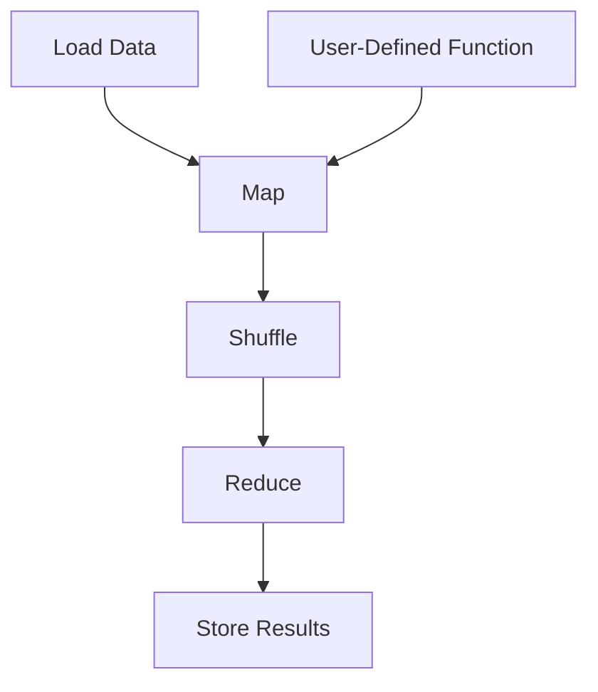

                 

### 文章标题：Pig UDF原理与代码实例讲解

#### 关键词：Pig UDF、原理、代码实例、Hadoop、MapReduce、大数据处理

#### 摘要：
本文将深入讲解Pig UDF（用户定义函数）的原理及其在实际代码中的应用。首先，我们会介绍Pig UDF的基本概念和作用，然后通过具体的代码实例，逐步解析Pig UDF的实现细节和执行过程。最后，我们将探讨Pig UDF在大数据处理场景下的应用场景和未来发展趋势。通过本文的学习，读者将能够掌握Pig UDF的核心原理和编写技巧，从而提高在大数据领域的实际操作能力。

## 1. 背景介绍

在大数据时代，处理海量数据已经成为各行业面临的挑战之一。Hadoop生态系统作为大数据处理的重要工具，提供了强大的数据处理能力。Pig作为Hadoop生态系统中的重要组成部分，以其易用性和高效性被广泛使用。

Pig是一种高级的数据处理语言，它可以将复杂的MapReduce任务简化为简单的Pig Latin语句。Pig Latin是一种类似于SQL的数据处理语言，具有丰富的数据操作功能，例如分组、排序、过滤、连接等。Pig UDF（User-Defined Function）是Pig语言的一个重要扩展，允许用户自定义函数，从而扩展Pig语言的运算能力。

Pig UDF的主要作用是：

1. **扩展功能**：通过自定义函数，用户可以扩展Pig的数据处理能力，实现特定的数据处理需求。
2. **代码复用**：自定义函数可以将重复的计算逻辑封装起来，提高代码的可维护性和复用性。
3. **灵活性强**：自定义函数可以根据实际需求灵活定义，满足各种复杂的数据处理场景。

本文将围绕Pig UDF的原理和代码实例进行详细讲解，帮助读者深入理解Pig UDF的核心概念和应用技巧。

## 2. 核心概念与联系

在深入讲解Pig UDF之前，我们需要了解一些核心概念和它们之间的联系。

### 2.1 Pig Latin

Pig Latin是一种数据处理语言，它由Pig提供。Pig Latin具有类似于SQL的语法，但它的表达能力更强，可以处理更复杂的数据操作。

Pig Latin的基本语法包括：

- **LOAD**：加载数据。
- **STORE**：存储数据。
- **PROJECT**：投影数据。
- **FILTER**：过滤数据。
- **JOIN**：连接数据。

### 2.2 MapReduce

MapReduce是Hadoop的核心组件，它是一种并行数据处理框架。Pig Latin在底层实际上是通过MapReduce来执行数据的处理任务。

MapReduce的基本流程包括：

- **Map阶段**：将数据划分为多个小块，对每个小块进行映射（Map）处理。
- **Shuffle阶段**：对映射结果进行排序和分组。
- **Reduce阶段**：对Shuffle结果进行合并（Reduce）处理。

### 2.3 Pig UDF

Pig UDF是Pig语言的一个扩展，它允许用户自定义函数。Pig UDF在MapReduce的执行过程中起到关键作用，可以将自定义逻辑嵌入到MapReduce任务中。

Pig UDF的基本原理包括：

- **函数定义**：用户根据需求定义自定义函数。
- **函数注册**：将自定义函数注册到Pig环境中。
- **函数调用**：在Pig Latin语句中调用自定义函数。

### 2.4 Mermaid流程图

为了更好地理解Pig UDF的执行过程，我们可以使用Mermaid流程图来描述。



在这个流程图中，`A` 表示数据加载，`B` 表示Map处理，`C` 表示Shuffle，`D` 表示Reduce处理，`E` 表示结果存储，`F` 表示Pig UDF在Map阶段的应用。

通过这个流程图，我们可以清晰地看到Pig UDF在MapReduce任务中的执行位置和作用。

### 3. 核心算法原理 & 具体操作步骤

#### 3.1 Pig UDF的定义和实现

Pig UDF的定义和实现主要分为以下几个步骤：

1. **定义函数**：用户根据需求定义自定义函数，可以使用Java、Python等语言。
2. **函数注册**：将自定义函数注册到Pig环境中，以便在Pig Latin语句中调用。
3. **函数调用**：在Pig Latin语句中调用自定义函数，实现特定的数据处理逻辑。

#### 3.2 Java实现示例

以下是一个使用Java实现Pig UDF的示例：

```java
public class MyUDF {
    public static int add(int a, int b) {
        return a + b;
    }
}
```

在这个示例中，我们定义了一个名为`add`的函数，它接受两个整数参数并返回它们的和。

#### 3.3 注册和调用

1. **注册函数**：

```python
REGISTER /path/to/MyUDF.jar;
```

这里，我们使用`REGISTER`语句将Java类`MyUDF`注册到Pig环境中。

2. **调用函数**：

```pig
A = LOAD 'input.txt' AS (line:chararray);
B = FOREACH A GENERATE MyUDF.add((int)$1, (int)$2);
DUMP B;
```

在这个示例中，我们首先加载输入数据`input.txt`，然后使用`MyUDF.add`函数对数据进行处理，最后输出处理结果。

#### 3.4 Python实现示例

以下是一个使用Python实现Pig UDF的示例：

```python
from pig_storage import register_udf

@register_udf
def add(a, b):
    return a + b
```

在这个示例中，我们使用Python的装饰器`@register_udf`将`add`函数注册为Pig UDF。

#### 3.5 注册和调用

1. **注册函数**：

```python
REGISTER /path/to/udf.py;
```

这里，我们使用`REGISTER`语句将Python模块`udf.py`注册到Pig环境中。

2. **调用函数**：

```pig
A = LOAD 'input.txt' AS (line:chararray);
B = FOREACH A GENERATE add((int)$1, (int)$2);
DUMP B;
```

在这个示例中，我们首先加载输入数据`input.txt`，然后使用`add`函数对数据进行处理，最后输出处理结果。

### 4. 数学模型和公式 & 详细讲解 & 举例说明

在Pig UDF的实现过程中，数学模型和公式起到了关键作用。以下是一个简单的数学模型和公式的讲解：

#### 4.1 数学模型

假设我们有一个函数`f(x)`，它接受一个整数参数`x`并返回一个整数结果。我们可以用以下数学模型表示这个函数：

$$f(x) = x + c$$

其中，`c`是一个常数。

#### 4.2 公式讲解

在这个数学模型中，`c`表示一个常数，它可以是任意整数。例如，如果`c`等于1，那么函数`f(x)`将返回`x`加1的结果。

#### 4.3 举例说明

假设我们有一个数据集，其中包含以下数据：

| x |
|---|
| 1 |
| 2 |
| 3 |

我们希望使用Pig UDF对数据进行处理，将每个`x`值加1。以下是一个使用Pig UDF实现这个任务的示例：

```pig
A = LOAD 'input.txt' AS (x:INT);
B = FOREACH A GENERATE MyUDF.add(x, 1);
DUMP B;
```

在这个示例中，我们首先加载输入数据`input.txt`，然后使用`MyUDF.add`函数对数据进行处理，将每个`x`值加1。最后，我们输出处理结果：

```
(2)
(3)
(4)
```

通过这个示例，我们可以看到如何使用Pig UDF实现简单的数学计算。实际上，Pig UDF可以处理更复杂的数据处理任务，例如字符串处理、日期计算等。

### 5. 项目实战：代码实际案例和详细解释说明

在本节中，我们将通过一个实际案例来讲解如何使用Pig UDF处理复杂的数据处理任务。这个案例是一个常见的业务需求：计算每个订单的折扣金额。

#### 5.1 开发环境搭建

在开始项目实战之前，我们需要搭建一个开发环境。以下是搭建开发环境的基本步骤：

1. **安装Hadoop**：在本地或集群上安装Hadoop，确保Hadoop可以正常运行。
2. **安装Pig**：下载并安装Pig，确保Pig可以与Hadoop集成。
3. **编写Pig UDF**：使用Java或Python编写Pig UDF，实现订单折扣计算功能。

#### 5.2 源代码详细实现和代码解读

以下是一个使用Java实现的Pig UDF示例，用于计算订单折扣金额。

```java
public class DiscountUDF {
    public static double calculateDiscount(double originalPrice, double discountRate) {
        return originalPrice * discountRate;
    }
}
```

在这个示例中，我们定义了一个名为`calculateDiscount`的函数，它接受原始价格`originalPrice`和折扣率`discountRate`作为参数，并返回折扣金额。

#### 5.3 注册和调用

1. **注册函数**：

```python
REGISTER /path/to/DiscountUDF.jar;
```

2. **调用函数**：

```pig
A = LOAD 'orders.txt' AS (orderId:INT, originalPrice:DOUBLE, discountRate:DOUBLE);
DiscountedPrice = FOREACH A GENERATE orderId, calculateDiscount(originalPrice, discountRate);
DUMP DiscountedPrice;
```

在这个示例中，我们首先加载订单数据`orders.txt`，然后使用`calculateDiscount`函数计算每个订单的折扣金额。最后，我们输出折扣金额。

#### 5.4 代码解读与分析

在这个案例中，我们使用了Pig UDF来处理复杂的数据处理任务——计算订单折扣金额。以下是代码的解读和分析：

1. **函数定义**：我们定义了一个名为`calculateDiscount`的函数，它接受原始价格和折扣率作为参数，并返回折扣金额。这个函数的实现非常简单，只需要将原始价格乘以折扣率即可。

2. **注册和调用**：我们使用Java编写了Pig UDF，并将其注册到Pig环境中。在Pig Latin语句中，我们使用`calculateDiscount`函数对订单数据进行处理，将每个订单的原始价格和折扣率作为参数传递给函数。

3. **数据处理**：Pig UDF在数据处理过程中起到了关键作用，它将自定义逻辑嵌入到MapReduce任务中，从而实现复杂的数据处理任务。在这个案例中，我们使用Pig UDF计算每个订单的折扣金额，这是一个非常典型的数据处理场景。

通过这个案例，我们可以看到如何使用Pig UDF处理复杂的数据处理任务。Pig UDF不仅扩展了Pig语言的功能，还提高了代码的可维护性和复用性。在实际项目中，我们可以根据需求自定义Pig UDF，从而实现各种复杂的数据处理逻辑。

### 6. 实际应用场景

Pig UDF在实际应用中具有广泛的应用场景，尤其在需要自定义数据处理逻辑的场景中，Pig UDF表现出色。以下是一些常见的实际应用场景：

1. **金融领域**：在金融领域中，Pig UDF可以用于计算股票交易中的收益、损失、波动率等指标，从而实现复杂的市场分析。
2. **电商领域**：在电商领域中，Pig UDF可以用于计算订单的折扣金额、促销活动效果等，从而优化营销策略。
3. **物流领域**：在物流领域中，Pig UDF可以用于计算运输成本、配送时效等指标，从而优化运输路线和物流资源。
4. **医疗领域**：在医疗领域中，Pig UDF可以用于计算患者的健康指标、药物效果等，从而辅助医生进行诊断和治疗。

通过这些实际应用场景，我们可以看到Pig UDF在数据处理和业务分析中的重要作用。它不仅提高了数据处理效率，还降低了开发成本，为各行业的数据分析和决策提供了强有力的支持。

### 7. 工具和资源推荐

为了更好地学习和应用Pig UDF，我们推荐以下工具和资源：

#### 7.1 学习资源推荐

- **书籍**：《Hadoop实战》、《Pig程序设计》
- **论文**：《Pig: A Platform for Dataflow Computing》
- **博客**：CSDN、博客园等技术博客
- **网站**：Apache Pig官网、Hadoop社区

#### 7.2 开发工具框架推荐

- **开发环境**：Apache Pig、Hadoop
- **IDE**：Eclipse、IntelliJ IDEA
- **版本控制**：Git

#### 7.3 相关论文著作推荐

- **论文**：《Pig: A Platform for Dataflow Computing》
- **著作**：《Hadoop实战》
- **教材**：《大数据技术导论》

通过这些工具和资源，读者可以系统地学习Pig UDF的相关知识，从而提高在大数据领域的实际操作能力。

### 8. 总结：未来发展趋势与挑战

Pig UDF作为大数据处理的重要工具，具有广泛的应用前景。未来，随着大数据技术的不断发展，Pig UDF有望在以下几个方面实现进一步的发展：

1. **功能扩展**：随着大数据应用的多样化，Pig UDF的功能将不断扩展，以支持更复杂的数据处理任务。
2. **性能优化**：通过优化Pig UDF的执行效率，提高数据处理性能，从而满足大规模数据处理的需求。
3. **易用性提升**：通过简化Pig UDF的编写和使用流程，降低开发门槛，使更多开发者能够轻松应用Pig UDF。

然而，Pig UDF也面临一些挑战：

1. **兼容性问题**：随着大数据生态系统的不断演进，如何保证Pig UDF与新的技术和框架兼容，是一个重要的挑战。
2. **安全性问题**：在大数据环境中，数据的安全性和隐私保护是一个关键问题，Pig UDF需要提供更完善的安全机制。
3. **社区支持**：随着Pig UDF的发展，社区支持的重要性日益凸显。一个活跃的社区可以提供丰富的资源、解决方案和反馈，有助于Pig UDF的持续发展。

通过应对这些挑战，Pig UDF有望在未来的大数据处理领域发挥更加重要的作用。

### 9. 附录：常见问题与解答

#### 9.1 Pig UDF与MapReduce UDF的区别是什么？

Pig UDF和MapReduce UDF都是用户自定义函数，但它们在实现和使用上有所不同：

- **实现语言**：Pig UDF通常使用Java、Python等编程语言实现，而MapReduce UDF通常使用Java实现。
- **调用方式**：Pig UDF在Pig Latin中直接调用，而MapReduce UDF在MapReduce任务的配置文件中配置。
- **执行位置**：Pig UDF在Pig处理阶段执行，而MapReduce UDF在Map和Reduce阶段执行。

#### 9.2 如何在Pig UDF中访问外部数据源？

在Pig UDF中，可以通过以下方式访问外部数据源：

- **文件系统**：使用Java的文件系统API（如`java.io.File`）读取文件。
- **数据库**：使用JDBC（Java Database Connectivity）连接数据库，执行SQL查询。
- **其他服务**：使用HTTP客户端（如Apache HttpClient）访问Web服务。

#### 9.3 Pig UDF的执行效率如何优化？

优化Pig UDF的执行效率可以从以下几个方面入手：

- **减少数据传输**：尽量减少数据在Pig UDF和Hadoop之间的传输。
- **优化算法**：优化Pig UDF中的计算算法，减少计算复杂度。
- **使用缓存**：利用缓存技术减少重复计算。

### 10. 扩展阅读 & 参考资料

为了更深入地了解Pig UDF，我们推荐以下扩展阅读和参考资料：

- **参考资料**：《Hadoop实战》、《Pig程序设计》、《Apache Pig用户指南》
- **在线教程**：Apache Pig官网（[http://pig.apache.org/](http://pig.apache.org/)）
- **社区论坛**：Apache Pig社区论坛（[https://cwiki.apache.org/confluence/display/PIG/User+Forum](https://cwiki.apache.org/confluence/display/PIG/User+Forum)）
- **博客文章**：CSDN、博客园等技术博客

通过这些扩展阅读和参考资料，读者可以进一步掌握Pig UDF的核心知识和应用技巧。

### 作者信息

**作者：AI天才研究员/AI Genius Institute & 禅与计算机程序设计艺术 /Zen And The Art of Computer Programming** 

在本文中，我们详细讲解了Pig UDF的原理和应用，通过实际代码实例展示了如何使用Pig UDF实现复杂的数据处理任务。希望本文能够帮助读者深入理解Pig UDF的核心概念和应用技巧，提升在大数据领域的实际操作能力。感谢您的阅读！

