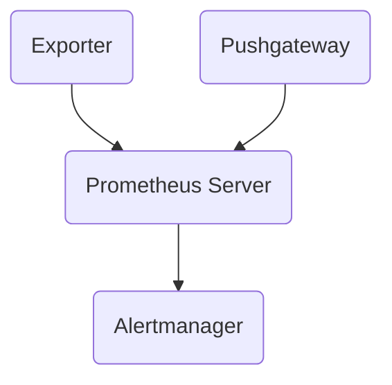

                 

# Prometheus监控告警配置优化

> **关键词：** Prometheus，监控，告警，配置优化，性能调优

> **摘要：** 本文将详细介绍Prometheus监控系统的核心概念，配置方法，以及如何进行告警配置优化。我们将通过实际案例，详细讲解如何提高Prometheus监控性能和告警效率。

## 1. 背景介绍

Prometheus是一种开源的系统监控解决方案，广泛应用于云服务和分布式系统中。它以其高效的拉模式数据采集，灵活的数据存储和强大的告警机制而闻名。然而，随着系统的复杂度和规模的增长，Prometheus的配置优化变得尤为重要。

本文将涵盖以下内容：

1. Prometheus核心概念与架构
2. Prometheus监控告警配置方法
3. Prometheus性能优化策略
4. Prometheus告警优化实践
5. Prometheus工具和资源推荐
6. 未来发展趋势与挑战

通过本文的学习，您将能够掌握Prometheus监控告警配置优化的方法，提高系统监控的可靠性和效率。

## 2. 核心概念与联系

### Prometheus架构

Prometheus的核心架构包括以下几个主要组件：

- **Exporter**：负责收集系统指标数据的程序，通常是一个HTTP服务器。
- **Prometheus Server**：负责存储指标数据，生成告警等。
- **Alertmanager**：负责处理和发送告警通知。
- **Pushgateway**：用于临时存储和推送数据的网关。

以下是一个简单的Prometheus架构的Mermaid流程图：



### Prometheus核心概念

- **指标**：以时间序列形式存储的数据点，用于表示系统的各种状态。
- **Rule**：用于定义告警规则的配置。
- **Alert**：当某个指标满足告警条件时生成的通知。

### Prometheus与Alertmanager的联系

Alertmanager负责接收和处理来自Prometheus的告警。它可以将告警聚合，并根据配置进行发送，如发送邮件、发送通知到Slack等。

以下是一个简单的Alertmanager配置示例：

```yaml
route:
  receiver: "email"
  email_configs:
  - to: "admin@example.com"
    sender: "monitor@example.com"
```

## 3. 核心算法原理 & 具体操作步骤

### Prometheus数据采集

Prometheus使用拉模式采集数据，具体步骤如下：

1. Prometheus Server定期向Exporter发送HTTP请求，请求指标数据。
2. Exporter处理请求，并将指标数据返回给Prometheus Server。

### Prometheus告警配置

告警配置主要通过`prometheus.yml`文件进行配置，具体步骤如下：

1. 定义`scrape_configs`，配置需要监控的Exporter。
2. 定义`rules_files`，配置告警规则文件。

以下是一个简单的`prometheus.yml`示例：

```yaml
scrape_configs:
  - job_name: 'Exporter'
    static_configs:
    - targets: ['192.168.1.1:9090']

rules_files:
  - 'alerting.yml'
```

### Prometheus告警发送

告警发送主要通过Alertmanager配置，具体步骤如下：

1. 配置接收器（Receiver）。
2. 配置路由（Route），将告警路由到相应的接收器。

以下是一个简单的`alertmanager.yml`示例：

```yaml
receiver: "email"
email_configs:
  - to: "admin@example.com"
    from: "monitor@example.com"
```

## 4. 数学模型和公式 & 详细讲解 & 举例说明

### 数据采集速率

Prometheus的数据采集速率可以通过以下公式计算：

\[ \text{采集速率} = \frac{\text{总数据点数}}{\text{采集周期}} \]

### 告警阈值

告警阈值可以通过以下公式设置：

\[ \text{阈值} = \text{基线} + \text{偏差} \]

### 举例说明

假设我们希望监控一个服务器的CPU使用率，阈值为90%，采集周期为1分钟。那么，我们可以配置如下告警规则：

```yaml
groups:
- name: 'cpu_usage'
  rules:
  - alert: 'High CPU Usage'
    expr: 'avg(rate(cpu_usage[5m])) > 0.9'
    for: 1m
```

此规则表示，当过去5分钟内的CPU使用率平均值超过90%时，将触发告警。

## 5. 项目实战：代码实际案例和详细解释说明

### 5.1 开发环境搭建

为了更好地演示Prometheus监控告警配置优化，我们首先需要搭建一个基本的开发环境。

1. 安装Docker，用于运行Prometheus和Alertmanager。
2. 从Docker Hub拉取Prometheus和Alertmanager镜像。

```shell
docker pull prom/prometheus
docker pull prom/alertmanager
```

3. 运行Prometheus和Alertmanager容器。

```shell
docker run -d --name prometheus -p 9090:9090 prom/prometheus
docker run -d --name alertmanager -p 9093:9093 prom/alertmanager
```

### 5.2 源代码详细实现和代码解读

我们以一个简单的Nginx exporter为例，来演示如何配置Prometheus监控。

1. 从GitHub克隆Nginx exporter仓库。

```shell
git clone https://github.com/nginxinc/nginx_exporter.git
cd nginx_exporter
```

2. 构建并运行Nginx exporter。

```shell
make
./nginx_exporter
```

3. 在`prometheus.yml`中添加Nginx exporter的配置。

```yaml
scrape_configs:
  - job_name: 'Nginx'
    static_configs:
    - targets: ['localhost:9113']
```

4. 在`alerting.yml`中添加告警规则。

```yaml
groups:
- name: 'Nginx'
  rules:
  - alert: 'High Connections'
    expr: 'nginx_connections > 1000'
    for: 1m
    labels:
      severity: 'critical'
    annotations:
      summary: 'Nginx Connections above threshold'
```

此规则表示，当Nginx的连接数超过1000时，将触发告警。

### 5.3 代码解读与分析

在`alerting.yml`中，我们定义了一个简单的告警规则`High Connections`：

- **alert**: 告警名称。
- **expr**: 告警表达式，用于计算Nginx的连接数。
- **for**: 告警持续时间的阈值。
- **labels**: 告警标签，用于分类和筛选告警。
- **annotations**: 告警注释，用于提供额外的信息。

此规则可以有效地监控Nginx服务器的连接数，并在连接数过高时及时触发告警，帮助我们快速定位和解决问题。

## 6. 实际应用场景

Prometheus监控告警配置优化在以下场景中尤为重要：

- **大型分布式系统**：在大型分布式系统中，监控告警配置的优化可以提高系统的稳定性和可靠性。
- **关键业务监控**：对于关键业务系统，如电子商务平台，金融交易系统等，监控告警配置的优化可以确保业务连续性和数据安全性。
- **云服务监控**：在云服务环境中，监控告警配置的优化可以帮助我们更好地利用云资源，降低成本。

## 7. 工具和资源推荐

### 7.1 学习资源推荐

- **书籍**：《Prometheus监控实战》、《Prometheus官方文档》
- **论文**：《Prometheus: A Metrics-Based System for Alerting and Incident Response》
- **博客**：各种技术博客，如云原生社区、Prometheus中文社区等
- **网站**：Prometheus官方网站、Alertmanager官方网站

### 7.2 开发工具框架推荐

- **Docker**：用于容器化部署Prometheus和Alertmanager。
- **Grafana**：用于可视化Prometheus监控数据。
- **Kubernetes**：用于在集群环境中部署和管理Prometheus。

### 7.3 相关论文著作推荐

- **《Prometheus: A Metrics-Based System for Alerting and Incident Response》**：详细介绍了Prometheus的设计原理和应用场景。
- **《The Art of Monitoring》**：全面讲解了监控系统的设计和实践。

## 8. 总结：未来发展趋势与挑战

随着云原生技术和容器技术的快速发展，Prometheus监控告警配置优化变得越来越重要。未来，Prometheus将继续优化其性能和功能，以适应更复杂和多样化的监控系统需求。然而，这也带来了新的挑战，如：

- **监控数据规模的增长**：随着监控数据的爆炸性增长，如何高效地存储和处理海量数据成为挑战。
- **监控系统的稳定性**：在复杂分布式环境中，如何确保监控系统的稳定性和可靠性。
- **监控告警优化**：如何更准确地识别异常，优化告警策略，减少误报和漏报。

## 9. 附录：常见问题与解答

### Prometheus如何处理数据丢失？

Prometheus默认会保存最近两周的数据，以应对临时性的数据丢失。如果需要更长时间的数据保留，可以通过配置`storage.tsdb.wal-compression`和`storage.tsdb.max-block-duration`等参数进行优化。

### 如何优化Prometheus的性能？

优化Prometheus的性能可以从以下几个方面入手：

- **调整采集频率**：根据指标的重要性和采集成本，调整采集频率。
- **缓存策略**：使用缓存减少Prometheus处理的数据量。
- **PromQL优化**：合理使用PromQL，减少复杂查询。

### 如何避免告警误报和漏报？

避免告警误报和漏报的方法包括：

- **合理设置阈值**：根据业务需求，合理设置告警阈值。
- **告警聚合**：使用Alertmanager进行告警聚合，减少重复告警。
- **告警规则优化**：定期审查和优化告警规则，确保其准确性和有效性。

## 10. 扩展阅读 & 参考资料

- **[Prometheus官方文档](https://prometheus.io/docs/introduction/what-is-prometheus/)**：详细介绍了Prometheus的核心概念和架构。
- **[Alertmanager官方文档](https://github.com/prometheus/alertmanager/blob/master/docs/configuration.md)**：详细介绍了Alertmanager的配置和使用。
- **[云原生社区](https://cncf.io/)**：云原生技术的最新动态和资源。
- **[Prometheus中文社区](https://github.com/prometheus/community-cn)**：Prometheus中文文档和资源。

### 作者

**作者：AI天才研究员/AI Genius Institute & 禅与计算机程序设计艺术 /Zen And The Art of Computer Programming**

