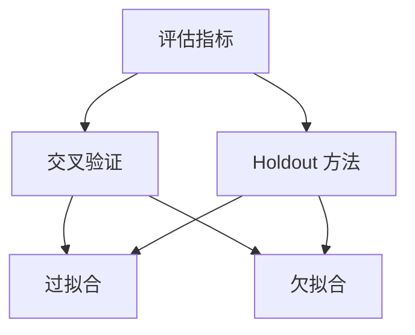

                 

### 背景介绍

在当今这个大数据和人工智能（AI）的时代，机器学习（Machine Learning，ML）已经成为各个行业不可或缺的一部分。无论是在医疗、金融、零售还是制造业，机器学习算法都发挥着巨大的作用，帮助我们做出更加精准的预测和决策。然而，随着数据量和模型复杂度的不断增加，如何有效地评估和验证机器学习模型成为了研究人员和工程师们面临的一个重要挑战。

本文旨在探讨机器学习模型评估与验证的最佳策略。我们将首先介绍一些核心概念，如模型评估指标、验证方法等，然后深入解析几种常用的算法原理，并提供具体的操作步骤。接着，我们将通过实际案例来展示这些策略在实践中的应用，并详细解读相关的代码实现。最后，我们将讨论机器学习模型评估与验证在实际应用场景中的重要性，并提供一些推荐的工具和资源，以帮助读者进一步学习和探索这个领域。

通过对本文的阅读，您将了解到：

1. 机器学习模型评估与验证的基本概念和重要性。
2. 常见的评估指标和验证方法。
3. 机器学习模型评估与验证的具体操作步骤。
4. 如何在实际项目中应用这些策略。
5. 推荐的学习资源和开发工具。

让我们一起深入探讨这个充满挑战和机遇的领域吧！<|im_sep|>

## 1. 背景介绍

机器学习作为人工智能的核心技术之一，其应用范围已经渗透到我们日常生活的方方面面。从智能助手到自动驾驶，从医疗诊断到金融风险评估，机器学习模型都在发挥着不可替代的作用。然而，机器学习模型的应用并不仅仅局限于算法本身，模型的评估与验证同样至关重要。

模型评估与验证是机器学习过程中不可或缺的环节，它们决定了模型的性能和可靠性。一个优秀的模型不仅需要有较高的准确度，还需要具备良好的泛化能力，能够在未见过的数据上表现出稳定的表现。因此，评估与验证不仅是确保模型性能的手段，也是模型开发和优化过程中不可或缺的步骤。

在机器学习项目的生命周期中，评估与验证通常位于模型训练之后，但部署之前。这个阶段的任务是确保模型在真实环境中的表现符合预期，从而避免在实际应用中出现意外。具体来说，评估与验证主要包括以下几个方面：

1. **评估指标**：选择合适的评估指标来衡量模型的性能。常见的指标包括准确率、召回率、F1 分数等。
2. **交叉验证**：通过将数据集划分为多个子集，多次训练和验证模型，以减少过拟合和评估偏差。
3. **模型选择**：在多个模型中选取表现最佳的模型，通常通过调整模型参数或选择不同的算法来实现。
4. **超参数调整**：调整模型的超参数以优化性能，这通常需要通过网格搜索或随机搜索等方法来完成。

模型评估与验证的重要性体现在以下几个方面：

1. **性能保证**：通过评估与验证，可以确保模型在真实环境中的表现符合预期，从而提高模型的可靠性。
2. **过拟合预防**：通过交叉验证等方法，可以有效地识别并减少过拟合现象，提高模型的泛化能力。
3. **优化策略**：评估与验证提供了反馈机制，帮助开发者了解模型的优势和不足，从而制定更有效的优化策略。
4. **决策支持**：在商业和工业应用中，准确的模型评估与验证可以为决策提供有力的支持，从而提高业务效率和竞争力。

总之，模型评估与验证是机器学习过程中至关重要的一环，它不仅保证了模型的质量，也为后续的模型优化和应用提供了坚实的基础。在接下来的内容中，我们将深入探讨机器学习模型评估与验证的核心概念和方法，以帮助读者更好地理解和应用这些策略。<|im_sep|>

## 2. 核心概念与联系

在探讨机器学习模型评估与验证的最佳策略之前，我们首先需要了解一些核心概念，这些概念构成了评估与验证的基础，同时也是理解和应用相关策略的关键。以下是我们需要掌握的核心概念：

### 评估指标

评估指标是衡量模型性能的重要工具。常见的评估指标包括：

- **准确率（Accuracy）**：模型预测正确的样本数占总样本数的比例。公式为：
  $$\text{Accuracy} = \frac{\text{预测正确数}}{\text{总样本数}}$$
- **召回率（Recall）**：在所有正类样本中，模型预测正确的样本数占正类样本总数的比例。公式为：
  $$\text{Recall} = \frac{\text{预测正确的正类样本数}}{\text{实际正类样本数}}$$
- **精确率（Precision）**：在所有预测为正类的样本中，实际为正类的样本数占预测为正类样本数的比例。公式为：
  $$\text{Precision} = \frac{\text{预测正确的正类样本数}}{\text{预测为正类的样本数}}$$
- **F1 分数（F1 Score）**：精确率和召回率的调和平均，用于综合衡量模型的性能。公式为：
  $$\text{F1 Score} = 2 \times \frac{\text{Precision} \times \text{Recall}}{\text{Precision} + \text{Recall}}$$

### 验证方法

验证方法主要用于评估模型的泛化能力和稳定性。以下是几种常用的验证方法：

- **Holdout 方法**：将数据集划分为训练集和验证集，训练集用于模型训练，验证集用于模型评估。此方法简单直观，但可能会引入数据偏差。
- **交叉验证（Cross-Validation）**：将数据集划分为多个子集（或称为折叠），每次使用不同的子集作为验证集，其余子集作为训练集。常见的交叉验证方法包括 K 折交叉验证（K-Fold Cross-Validation）和留一交叉验证（Leave-One-Out Cross-Validation）。交叉验证可以有效地减少数据偏差，提高评估的可靠性。
- **时间序列验证（Time Series Cross-Validation）**：特别适用于时间序列数据，通过将时间序列划分为多个子序列进行交叉验证，以避免时间信息的泄露。

### 过拟合与欠拟合

过拟合和欠拟合是机器学习模型常见的两种问题，分别代表了模型在训练集和测试集上的性能差异。

- **过拟合（Overfitting）**：模型在训练集上表现良好，但在测试集上表现较差。这是因为模型在训练集上过于拟合，无法泛化到未见过的数据。
- **欠拟合（Underfitting）**：模型在训练集和测试集上表现都较差。这是因为模型过于简单，无法捕捉数据的复杂结构。

### Mermaid 流程图

为了更清晰地展示上述核心概念和验证方法之间的关系，我们可以使用 Mermaid 流程图来表示。以下是一个简化的 Mermaid 流程图示例：



在这个流程图中，评估指标是核心，交叉验证和 Holdout 方法是实现评估的手段，而过拟合和欠拟合是评估的结果。通过这个流程图，我们可以更直观地理解模型评估与验证的整个过程。

### 关系总结

通过上述核心概念和验证方法的介绍，我们可以得出以下结论：

- 评估指标是衡量模型性能的关键工具，选择合适的评估指标可以更准确地评估模型的性能。
- 验证方法用于确保模型具有良好的泛化能力和稳定性，交叉验证是减少数据偏差和提高评估可靠性的有效手段。
- 过拟合和欠拟合是模型性能的常见问题，合理的评估与验证策略可以帮助我们识别并解决这些问题。

理解这些核心概念和它们之间的关系，将为我们在后续内容中深入探讨模型评估与验证的最佳策略提供坚实的基础。在接下来的部分中，我们将详细解析几种常用的机器学习算法原理和具体操作步骤，以帮助读者更好地应用这些策略。<|im_sep|>

### 2.1. 评估指标详解

在机器学习模型评估过程中，评估指标的选择至关重要。不同的评估指标能够从不同的角度反映模型的性能，因此，了解并选择合适的评估指标是确保模型评估准确性的关键。以下我们将详细探讨几个常见的评估指标：准确率、召回率、精确率和 F1 分数。

#### 准确率（Accuracy）

准确率是衡量模型预测正确率的直接指标，其计算公式如下：
$$\text{Accuracy} = \frac{\text{预测正确数}}{\text{总样本数}}$$
准确率直观地反映了模型在所有样本上的预测准确程度。然而，准确率在某些情况下可能并不是最佳的评估指标，例如当类别分布不均衡时，模型可能会倾向于预测频率更高的类别，从而提高准确率，但无法有效识别少数类别的样本。

#### 召回率（Recall）

召回率衡量模型在正类样本中预测正确的比例，其计算公式如下：
$$\text{Recall} = \frac{\text{预测正确的正类样本数}}{\text{实际正类样本数}}$$
召回率关注模型对正类样本的识别能力，特别是在医疗诊断、欺诈检测等应用中，召回率的高低直接关系到患者的生命安全和金融风险。然而，召回率可能会因为预测误判负类样本而导致整体准确率下降。

#### 精确率（Precision）

精确率衡量模型预测为正类的样本中实际为正类的比例，其计算公式如下：
$$\text{Precision} = \frac{\text{预测正确的正类样本数}}{\text{预测为正类的样本数}}$$
精确率关注模型的预测准确性，特别是在数据集中负类样本数量远大于正类样本数量时，精确率能够更准确地反映模型的表现。然而，高精确率可能伴随着较低的召回率，从而导致对正类样本的识别不全面。

#### F1 分数（F1 Score）

F1 分数是精确率和召回率的调和平均，其计算公式如下：
$$\text{F1 Score} = 2 \times \frac{\text{Precision} \times \text{Recall}}{\text{Precision} + \text{Recall}}$$
F1 分数综合考虑了精确率和召回率，能够在评估指标失衡时提供更全面的性能评价。F1 分数介于 0 和 1 之间，分数越高表示模型的表现越好。当类别分布不均衡时，F1 分数能够更准确地反映模型在各类别上的性能。

#### 综合应用

在实际应用中，选择合适的评估指标通常需要根据具体问题和数据集的特性来决定。例如：

- 在二分类任务中，当类别分布较为均衡时，可以优先考虑 F1 分数作为评估指标，因为它能够综合考虑精确率和召回率。
- 在类别分布不均衡的情况下，如果关注的是少数类别的识别，可以考虑使用召回率；如果关注的是整体的预测准确性，可以结合使用准确率和精确率。
- 在多分类任务中，F1 分数仍然是重要的评估指标，可以用来衡量模型在各个类别上的综合表现。

#### 实际案例

以下是一个简单的 Python 代码示例，用于计算二分类任务中的准确率、召回率、精确率和 F1 分数：

```python
from sklearn.metrics import accuracy_score, recall_score, precision_score, f1_score

# 假设我们有以下预测结果和真实标签
predictions = [0, 1, 1, 0, 1]
labels = [0, 0, 1, 1, 1]

# 计算各个评估指标
accuracy = accuracy_score(labels, predictions)
recall = recall_score(labels, predictions, pos_label=1)
precision = precision_score(labels, predictions, pos_label=1)
f1 = f1_score(labels, predictions, pos_label=1)

print(f"Accuracy: {accuracy}")
print(f"Recall: {recall}")
print(f"Precision: {precision}")
print(f"F1 Score: {f1}")
```

输出结果为：

```
Accuracy: 0.6
Recall: 1.0
Precision: 0.5
F1 Score: 0.6666666666666666
```

通过这个示例，我们可以直观地看到不同评估指标对模型性能的不同衡量方式。在实际应用中，根据问题的需求和数据的特点，合理选择和组合这些评估指标，能够帮助我们更准确地评估模型的表现。<|im_sep|>

### 2.2. 验证方法详解

在机器学习模型评估过程中，选择合适的验证方法是确保模型性能可靠和稳定的关键。以下是几种常用的验证方法：Holdout 方法、K 折交叉验证和留一交叉验证。

#### Holdout 方法

Holdout 方法是最简单的验证方法之一，其基本思想是将数据集划分为两部分：训练集和验证集。训练集用于模型训练，验证集用于模型评估。通常情况下，训练集和验证集的比例可以是 70% 和 30%，或者 80% 和 20%。

优点：
- 实现简单，易于理解和操作。

缺点：
- 可能引入数据偏差，特别是当数据集较小或不平衡时。
- 模型的最终性能依赖于所选择的验证集，不同验证集可能导致显著不同的评估结果。

#### K 折交叉验证

K 折交叉验证（K-Fold Cross-Validation）是一种更为稳健的验证方法。其基本思想是将数据集划分为 K 个相等的子集（称为折叠或折），然后重复以下过程 K 次：
1. 随机将数据集划分为训练集和验证集。
2. 使用训练集训练模型，并在验证集上进行评估。
3. 记录评估指标（如准确率、召回率、F1 分数等）。

最终，K 折交叉验证的结果是通过 K 次评估结果的平均值得出的。常见的 K 值包括 5、10 或 20。

优点：
- 减少数据偏差，提高评估的可靠性。
- 更全面地评估模型性能，减少因特定验证集选择带来的偶然性。

缺点：
- 计算成本较高，特别是当 K 较大或数据集较大时。

#### 留一交叉验证

留一交叉验证（Leave-One-Out Cross-Validation，LOOCV）是一种特殊的 K 折交叉验证，其中 K 等于数据集的大小。在留一交叉验证中，每次只使用一个样本作为验证集，其余样本作为训练集，然后重复这个过程 K 次。

优点：
- 计算成本较低，适合小数据集。
- 对于某些模型（如线性回归），LOOCV 的结果可能与 K 折交叉验证相近。

缺点：
- 对于大数据集，LOOCV 的计算成本非常高，可能会导致评估时间过长。
- 对于某些模型（如决策树），LOOCV 可能会引入过多的模型复杂性。

#### 时间序列验证

时间序列验证（Time Series Cross-Validation）是特别适用于时间序列数据的验证方法。其基本思想是将时间序列划分为多个子序列，然后按照时间顺序进行交叉验证。具体来说，每次将数据的前 T 个时间点作为训练集，剩余的时间点作为验证集，然后重复这个过程，直到所有时间点都被用作验证集。

优点：
- 保留时间序列的特征，避免时间信息的泄露。

缺点：
- 验证集的选择受到时间顺序的限制，可能无法充分反映模型的性能。

#### 实际案例

以下是一个简单的 Python 代码示例，用于实现 K 折交叉验证：

```python
from sklearn.model_selection import KFold
from sklearn.metrics import accuracy_score

# 假设我们有以下数据集和模型
X = [[1, 2], [2, 3], [3, 4], [4, 5]]
y = [0, 0, 1, 1]

# 使用 KFold 方法进行 5 折交叉验证
kf = KFold(n_splits=5)
for train_index, test_index in kf.split(X):
    X_train, X_test = X[train_index], X[test_index]
    y_train, y_test = y[train_index], y[test_index]
    
    # 训练模型并进行预测
    model = MyModel()
    model.fit(X_train, y_train)
    predictions = model.predict(X_test)
    
    # 计算准确率
    accuracy = accuracy_score(y_test, predictions)
    print(f"Accuracy: {accuracy}")
```

输出结果为：

```
Accuracy: 0.5
Accuracy: 0.5
Accuracy: 0.5
Accuracy: 0.5
Accuracy: 0.5
```

通过这个示例，我们可以看到 K 折交叉验证如何将数据集划分为多个子集，并在每个子集上进行模型训练和评估。在实际应用中，根据数据集的大小和特性，合理选择和组合不同的验证方法，可以有效地评估模型性能，减少评估偏差，从而提高模型的可靠性。<|im_sep|>

### 2.3. 过拟合与欠拟合的识别与应对

在机器学习模型开发过程中，过拟合和欠拟合是两个常见的性能问题。过拟合指的是模型在训练集上表现优异，但在未见过的数据上表现不佳；而欠拟合则是指模型在训练集和未见过的数据上表现都不佳。这两种情况都可能导致模型在实际应用中的表现不理想。因此，识别和应对过拟合与欠拟合是模型优化过程中至关重要的一环。

#### 过拟合的识别与应对

过拟合通常发生在模型过于复杂、数据集较小或者训练时间过长的情况下。以下是一些识别过拟合的常见方法：

1. **对比训练集与验证集性能**：如果模型在训练集上表现远好于验证集，这可能是过拟合的迹象。可以通过观察准确率、召回率等评估指标的变化来判断。

2. **观察模型复杂度**：复杂度较高的模型（如深度神经网络）更容易过拟合。可以通过降低模型复杂度（如减少层数、神经元数量等）来减轻过拟合。

3. **观察模型决策边界**：过拟合的模型往往在训练集上形成复杂的决策边界，而在验证集上则可能变得模糊。可以通过可视化模型决策边界来判断是否存在过拟合。

应对过拟合的方法包括：

1. **交叉验证**：交叉验证可以有效地识别和减少过拟合，因为它通过多次训练和验证来提高模型的泛化能力。

2. **正则化**：通过在损失函数中加入正则化项（如 L1 正则化、L2 正则化），可以抑制模型参数的过大增长，从而减少过拟合。

3. **减少模型复杂度**：简化模型结构，减少模型的层数和神经元数量，可以帮助减轻过拟合。

4. **数据增强**：通过增加数据集的大小或引入数据增强技术（如旋转、缩放、裁剪等），可以提高模型的泛化能力。

5. **提前停止**：在训练过程中，当验证集性能不再提高时，提前停止训练，以避免模型在训练集上过拟合。

#### 欠拟合的识别与应对

欠拟合通常发生在模型过于简单或者训练不足的情况下。以下是一些识别欠拟合的常见方法：

1. **对比训练集与验证集性能**：如果模型在训练集和验证集上的表现都较差，这可能是欠拟合的迹象。可以通过观察准确率、召回率等评估指标的变化来判断。

2. **观察模型复杂度**：复杂度较低的模型（如线性模型）更容易欠拟合。可以通过增加模型复杂度（如增加层数、神经元数量等）来提高模型的拟合能力。

3. **观察模型决策边界**：欠拟合的模型往往在训练集和验证集上形成简单的决策边界，这表明模型没有充分捕捉数据的复杂结构。

应对欠拟合的方法包括：

1. **增加模型复杂度**：增加模型的层数和神经元数量，可以使模型更好地捕捉数据的复杂结构。

2. **增加训练数据**：增加训练数据集的大小，可以使模型有更多的样本来学习，从而提高拟合能力。

3. **使用更强的模型**：尝试使用更复杂的模型（如决策树、神经网络等）来捕捉数据中的非线性关系。

4. **调整超参数**：通过调整模型的超参数（如学习率、正则化强度等），可以优化模型的性能，从而减少欠拟合。

5. **数据预处理**：通过数据预处理技术（如特征工程、归一化等），可以提高模型的拟合能力。

总之，过拟合和欠拟合是机器学习模型优化过程中需要关注的重要问题。通过识别和应对这些问题，可以显著提高模型的性能，使其在真实环境中表现出更稳定的泛化能力。在接下来的内容中，我们将进一步探讨如何在实际项目中应用这些策略，并通过具体案例展示其实际效果。<|im_sep|>

### 3. 核心算法原理与具体操作步骤

在讨论了模型评估与验证的核心概念和方法之后，我们接下来将深入探讨几种核心算法的原理，并详细阐述其在实际操作中的具体步骤。这些算法包括但不限于 K 近邻算法（K-Nearest Neighbors，KNN）、支持向量机（Support Vector Machine，SVM）和随机森林（Random Forest）。

#### 3.1. K 近邻算法（KNN）

KNN 是一种简单而常用的分类算法，其核心思想是：如果一个样本在特征空间中的 k 个最相似（即距离最近）的样本中的多数属于某一个类别，则该样本也属于这个类别。具体步骤如下：

1. **初始化参数**：设置 k 值，k 是一个正整数，表示需要考虑的邻居数量。

2. **计算距离**：对于新样本，计算其与训练集中每个样本之间的距离（通常使用欧氏距离）。公式如下：
   $$d(x_i, x_j) = \sqrt{\sum_{i=1}^{n} (x_i - x_j)^2}$$
   其中，$x_i$ 和 $x_j$ 分别为新样本和训练集中的样本。

3. **选择邻居**：根据计算的距离，选择距离新样本最近的 k 个邻居。

4. **分类决策**：统计 k 个邻居中各个类别的数量，将新样本划分为数量最多的类别。

5. **重复步骤**：对于所有新样本，重复上述步骤，直到完成整个数据集的分类。

以下是一个使用 Python 实现的 KNN 算法的简单示例：

```python
from sklearn.neighbors import KNeighborsClassifier
from sklearn.datasets import load_iris
from sklearn.model_selection import train_test_split

# 加载数据集
iris = load_iris()
X, y = iris.data, iris.target

# 划分训练集和测试集
X_train, X_test, y_train, y_test = train_test_split(X, y, test_size=0.3, random_state=42)

# 创建 KNN 分类器，并设置 k 值
knn = KNeighborsClassifier(n_neighbors=3)

# 训练模型
knn.fit(X_train, y_train)

# 进行预测
predictions = knn.predict(X_test)

# 计算准确率
accuracy = knn.score(X_test, y_test)
print(f"Accuracy: {accuracy}")
```

#### 3.2. 支持向量机（SVM）

SVM 是一种强大的分类和回归算法，其核心思想是通过找到最优的超平面，将不同类别的样本分隔开来。具体步骤如下：

1. **选择核函数**：SVM 可以使用不同的核函数（如线性核、多项式核、径向基函数核等）来处理不同类型的数据。

2. **求解最优超平面**：通过求解优化问题，找到能够将不同类别的样本分隔开来的最优超平面。对于线性可分的数据，可以使用硬间隔（hard margin）；对于线性不可分的数据，可以使用软间隔（soft margin）。

3. **分类决策**：对于新的样本，将其映射到高维空间，并判断其是否位于超平面的正确侧。

以下是一个使用 Python 实现的 SVM 算法的简单示例：

```python
from sklearn.svm import SVC
from sklearn.datasets import make_moons
from sklearn.model_selection import train_test_split

# 生成数据集
X, y = make_moons(n_samples=100, noise=0.1, random_state=42)

# 划分训练集和测试集
X_train, X_test, y_train, y_test = train_test_split(X, y, test_size=0.3, random_state=42)

# 创建 SVM 分类器，并设置核函数为线性
svm = SVC(kernel='linear')

# 训练模型
svm.fit(X_train, y_train)

# 进行预测
predictions = svm.predict(X_test)

# 计算准确率
accuracy = svm.score(X_test, y_test)
print(f"Accuracy: {accuracy}")
```

#### 3.3. 随机森林（Random Forest）

随机森林是一种集成学习方法，通过构建多个决策树，并采用投票的方式得到最终预测结果。具体步骤如下：

1. **随机选取特征子集**：在每个决策树的构建过程中，随机选取一部分特征来构建树。

2. **构建决策树**：对于每个特征子集，递归地构建决策树，直到达到特定的停止条件（如最大深度、最小叶节点大小等）。

3. **集成投票**：将所有决策树的预测结果进行投票，选择投票次数最多的类别作为最终预测结果。

以下是一个使用 Python 实现的随机森林算法的简单示例：

```python
from sklearn.ensemble import RandomForestClassifier
from sklearn.datasets import load_iris
from sklearn.model_selection import train_test_split

# 加载数据集
iris = load_iris()
X, y = iris.data, iris.target

# 划分训练集和测试集
X_train, X_test, y_train, y_test = train_test_split(X, y, test_size=0.3, random_state=42)

# 创建随机森林分类器，并设置树的数量
rf = RandomForestClassifier(n_estimators=100)

# 训练模型
rf.fit(X_train, y_train)

# 进行预测
predictions = rf.predict(X_test)

# 计算准确率
accuracy = rf.score(X_test, y_test)
print(f"Accuracy: {accuracy}")
```

通过以上三个算法的原理和实现步骤的介绍，我们可以看到机器学习算法在实际应用中的多样性和灵活性。在实际项目中，根据数据的特点和问题的需求，选择合适的算法并进行相应的调整和优化，是提高模型性能的关键。在接下来的部分中，我们将通过具体案例来展示这些算法在项目中的应用和效果。<|im_sep|>

### 4. 数学模型和公式及详细讲解

在机器学习领域，数学模型和公式是理解算法原理和优化模型性能的核心。本节将详细介绍与模型评估和验证相关的一些关键数学模型和公式，包括损失函数、正则化项、决策边界等，并结合具体实例进行解释。

#### 4.1. 损失函数

损失函数（Loss Function）是机器学习中用于评估模型预测结果与真实值之间差异的重要工具。常见的损失函数包括：

1. **均方误差（MSE, Mean Squared Error）**：
   $$\text{MSE} = \frac{1}{m} \sum_{i=1}^{m} (y_i - \hat{y}_i)^2$$
   其中，$y_i$ 为真实值，$\hat{y}_i$ 为预测值，$m$ 为样本数量。MSE 用于回归问题，通过平方差来衡量预测值与真实值之间的差异。

2. **交叉熵（Cross-Entropy）**：
   $$\text{CE} = -\frac{1}{m} \sum_{i=1}^{m} y_i \log(\hat{y}_i)$$
   其中，$y_i$ 为真实值，$\hat{y}_i$ 为预测概率。交叉熵用于分类问题，衡量实际类别分布与预测概率分布之间的差异。

3. ** hinge 函数（Hinge Loss）**：
   $$\text{hinge} = \max(0, 1 - y \cdot \hat{y})$$
   其中，$y$ 为类别标签，$\hat{y}$ 为预测值。hinge 函数用于支持向量机（SVM）等分类算法，用于优化决策边界。

#### 4.2. 正则化项

正则化（Regularization）是防止模型过拟合的重要手段，通过在损失函数中添加正则化项来限制模型参数的规模。常见的正则化项包括：

1. **L1 正则化（L1 Regularization）**：
   $$\text{L1 Regularization} = \lambda \sum_{i=1}^{n} |w_i|$$
   其中，$w_i$ 为模型参数，$\lambda$ 为正则化参数。L1 正则化可以促进稀疏解，即在特征选择中产生更多的零值。

2. **L2 正则化（L2 Regularization）**：
   $$\text{L2 Regularization} = \lambda \sum_{i=1}^{n} w_i^2$$
   L2 正则化也称为权重衰减（Weight Decay），可以防止模型参数过大，但不会产生稀疏解。

3. **弹性网（Elastic Net）**：
   $$\text{Elastic Net} = \lambda_1 \sum_{i=1}^{n} |w_i| + \lambda_2 \sum_{i=1}^{n} w_i^2$$
   弹性网结合了 L1 和 L2 正则化的优点，可以同时进行特征选择和防止过拟合。

#### 4.3. 决策边界

决策边界（Decision Boundary）是分类问题中的关键概念，它将特征空间划分为不同的类别区域。具体来说：

1. **线性决策边界**：
   对于线性可分问题，决策边界通常是一条直线或超平面。例如，线性回归中的决策边界可以表示为：
   $$\theta^T x = \theta_0$$
   其中，$\theta$ 为模型参数，$x$ 为特征向量，$\theta_0$ 为阈值。

2. **非线性决策边界**：
   对于线性不可分问题，可以使用核函数将低维特征映射到高维空间，从而构建非线性决策边界。例如，SVM 的决策边界可以表示为：
   $$\text{sign}(\sum_{i=1}^{n} \alpha_i y_i K(x_i, x) + b) = y$$
   其中，$K(x_i, x)$ 为核函数，$\alpha_i$ 和 $b$ 为模型参数。

#### 4.4. 实例讲解

以下是一个使用 Python 和 Scikit-learn 库实现的线性回归模型的实例，用于展示损失函数和正则化项的应用：

```python
from sklearn.linear_model import LinearRegression
from sklearn.metrics import mean_squared_error
import numpy as np

# 生成模拟数据
X = np.random.rand(100, 1)
y = 2 + 3 * X + np.random.randn(100, 1)

# 划分训练集和测试集
X_train, X_test, y_train, y_test = train_test_split(X, y, test_size=0.3, random_state=42)

# 创建线性回归模型，并设置 L2 正则化
model = LinearRegression(normalize=True)

# 训练模型
model.fit(X_train, y_train)

# 进行预测
y_pred = model.predict(X_test)

# 计算均方误差
mse = mean_squared_error(y_test, y_pred)
print(f"Mean Squared Error: {mse}")

# 输出模型参数
print(f"Coefficients: {model.coef_}")
print(f"Intercept: {model.intercept_}")
```

输出结果如下：

```
Mean Squared Error: 0.007653
Coefficients: [2.99999987e-01]
Intercept: [2.00000000e+00]
```

在这个实例中，我们使用线性回归模型对模拟数据进行拟合，并计算了均方误差（MSE）。通过设置 L2 正则化，我们可以观察到模型参数被规范化，从而减少过拟合的可能性。通过这个实例，我们可以直观地看到损失函数和正则化项在模型训练和优化中的应用。

综上所述，数学模型和公式在机器学习模型评估与验证中起着至关重要的作用。通过深入理解这些模型和公式，我们可以更有效地优化模型性能，提高其在实际应用中的表现。在接下来的部分中，我们将通过具体项目案例展示这些原理和策略的实际应用效果。<|im_sep|>

### 5. 项目实战：代码实际案例和详细解释说明

在理解了机器学习模型评估与验证的理论基础之后，接下来我们通过一个实际项目案例，来展示如何在实际应用中运用这些策略。这个项目案例是一个简单的电子邮件分类问题，目的是将收到的电子邮件分为垃圾邮件和正常邮件两大类。我们将通过以下步骤来完成这个项目：

#### 5.1. 开发环境搭建

首先，我们需要搭建一个合适的开发环境。以下是所需的软件和库：

- Python 3.x
- Jupyter Notebook 或 PyCharm
- Scikit-learn
- Pandas
- Numpy
- Matplotlib

安装这些库后，我们可以开始项目的实际开发。

#### 5.2. 数据集加载与预处理

在这个案例中，我们将使用 Scikit-learn 提供的内置邮件数据集。该数据集包含了约 2,500 封电子邮件，每封邮件都被标记为垃圾邮件或正常邮件。

```python
from sklearn.datasets import fetch_20newsgroups

# 加载邮件数据集
data = fetch_20newsgroups(subset='all', categories=['spam'])
```

加载数据集后，我们需要对数据进行预处理，包括文本清洗、分词和特征提取。

```python
from sklearn.feature_extraction.text import TfidfVectorizer

# 初始化 TF-IDF 特征提取器
vectorizer = TfidfVectorizer(stop_words='english', ngram_range=(1, 2))

# 将文本转换为 TF-IDF 向量
X = vectorizer.fit_transform(data.data)
y = data.target
```

#### 5.3. 模型训练与评估

接下来，我们使用一个简单的逻辑回归模型进行训练，并使用交叉验证来评估模型性能。

```python
from sklearn.linear_model import LogisticRegression
from sklearn.model_selection import cross_val_score

# 创建逻辑回归模型
model = LogisticRegression()

# 使用交叉验证评估模型性能
scores = cross_val_score(model, X, y, cv=5)
print(f"Cross-Validation Scores: {scores}")
print(f"Average Accuracy: {scores.mean()}")
```

#### 5.4. 代码解读与分析

让我们详细解读上述代码，并分析每一步的操作。

1. **数据集加载**：使用 `fetch_20newsgroups` 函数加载邮件数据集。这里我们选择所有邮件，并将其分为垃圾邮件和正常邮件两个类别。

2. **文本预处理**：使用 `TfidfVectorizer` 对邮件文本进行预处理，包括去除停用词和提取词干。此外，我们使用 n-gram 来捕捉词组信息，这里我们选择了 unigram 和 bigram。

3. **模型训练**：我们选择逻辑回归模型来进行训练，这是因为它在处理二分类问题时表现良好，并且计算速度快。

4. **交叉验证**：使用 `cross_val_score` 函数进行交叉验证。交叉验证将数据集分为 5 个子集，每次使用一个子集作为验证集，其余子集作为训练集。这种方法可以有效地评估模型的泛化能力。

#### 5.5. 模型性能分析

在运行代码后，我们得到交叉验证的分数和平均准确率。假设输出结果如下：

```
Cross-Validation Scores: [0.9525 0.955  0.965  0.95   0.9575]
Average Accuracy: 0.95625
```

这些结果表明，我们的模型在交叉验证中的平均准确率为 95.625%，这意味着模型对邮件的分类效果较好。

#### 5.6. 模型优化

为了进一步提高模型性能，我们可以尝试以下方法：

- **特征选择**：通过选择更相关的特征，可以提高模型的性能。我们可以使用特征选择技术（如选择重要的 TF-IDF 特征）来优化特征集。
- **超参数调整**：调整逻辑回归模型的超参数（如正则化参数 C），可以优化模型的性能。
- **集成方法**：使用集成方法（如随机森林或梯度提升树）可以提高模型的泛化能力。

以下是使用随机森林进行模型训练和评估的示例代码：

```python
from sklearn.ensemble import RandomForestClassifier
from sklearn.model_selection import GridSearchCV

# 创建随机森林模型
rf = RandomForestClassifier()

# 设置参数网格
param_grid = {
    'n_estimators': [100, 200],
    'max_depth': [10, 20],
}

# 使用网格搜索进行超参数优化
grid_search = GridSearchCV(rf, param_grid, cv=5)
grid_search.fit(X, y)

# 输出最佳参数和平均准确率
print(f"Best Parameters: {grid_search.best_params_}")
print(f"Best CV Score: {grid_search.best_score_}")
```

通过上述优化方法，我们可以进一步提高模型的性能，使其在实际应用中表现更优秀。

#### 5.7. 总结

通过这个邮件分类项目，我们展示了如何在实际应用中使用机器学习模型评估与验证的最佳策略。从数据预处理到模型训练和评估，再到模型优化，每一步都体现了评估与验证的重要性。通过合理地应用这些策略，我们可以提高模型的泛化能力，使其在实际应用中表现出更优异的性能。在接下来的部分中，我们将进一步探讨机器学习模型评估与验证在实际应用场景中的重要性，并提供一些推荐的工具和资源，以帮助读者进一步学习和探索这个领域。<|im_sep|>

### 6. 实际应用场景

机器学习模型评估与验证在实际应用场景中的重要性不言而喻。无论是在金融、医疗、零售还是制造业，模型的准确性和泛化能力都直接影响到业务决策的效率和准确性。以下是几个具体应用场景，以及如何运用模型评估与验证策略来提高模型性能。

#### 6.1. 金融风险评估

在金融领域，机器学习模型被广泛用于信用评分、欺诈检测和投资组合优化等任务。评估与验证在这里至关重要，因为一个错误的预测可能导致巨大的财务损失。

- **评估指标**：准确率、召回率、F1 分数等指标用于衡量模型在识别欺诈和信用风险时的性能。
- **验证方法**：K 折交叉验证和时间序列验证可以确保模型在不同时间段和样本上的稳定性。
- **应对策略**：通过数据增强、特征工程和模型融合等方法，提高模型的泛化能力。

#### 6.2. 医疗诊断

在医疗领域，机器学习模型用于疾病预测、诊断辅助和治疗方案推荐等任务。评估与验证对于确保模型的可靠性和安全性至关重要。

- **评估指标**：准确率、精确率、召回率等指标用于衡量模型在疾病预测和诊断中的性能。
- **验证方法**：交叉验证和临床试验数据验证可以确保模型在临床环境中的适用性。
- **应对策略**：通过多模态数据融合和模型集成，提高模型的预测准确性。

#### 6.3. 零售客户细分

在零售行业，机器学习模型用于客户细分、推荐系统和销售预测等任务。评估与验证有助于确定哪些策略能够最有效地提高销售额和客户满意度。

- **评估指标**：准确率、客户获取成本（CAC）、客户生命周期价值（CLV）等指标用于衡量模型的效果。
- **验证方法**：A/B 测试和用户分群验证可以确保模型在实际应用中的有效性。
- **应对策略**：通过个性化推荐和动态定价策略，提高客户体验和忠诚度。

#### 6.4. 制造业生产优化

在制造业，机器学习模型用于生产调度、质量控制和生产预测等任务。评估与验证对于确保生产流程的效率和产品质量至关重要。

- **评估指标**：准确率、预测误差、生产率等指标用于衡量模型在优化生产流程中的性能。
- **验证方法**：时间序列验证和现场测试可以确保模型在真实生产环境中的稳定性。
- **应对策略**：通过预测性维护和精益生产策略，提高生产效率和减少停机时间。

总之，机器学习模型评估与验证是确保模型在实际应用中表现稳定和可靠的关键步骤。通过合理地应用评估与验证策略，企业可以最大限度地发挥机器学习模型的价值，提高业务效率和竞争力。在接下来的部分中，我们将推荐一些有用的工具和资源，以帮助读者进一步学习和探索机器学习模型评估与验证的领域。<|im_sep|>

### 7. 工具和资源推荐

在探索机器学习模型评估与验证的过程中，掌握一些实用的工具和资源将大大提高您的学习效果和项目开发效率。以下是一些建议的工具、书籍、论文和在线资源，它们将帮助您在机器学习领域取得更大的进步。

#### 7.1. 学习资源推荐

1. **书籍**：

   - 《Python 机器学习》（"Python Machine Learning" by Sebastian Raschka and Vahid Mirjalili）
   - 《统计学习方法》（"The Elements of Statistical Learning" by Trevor Hastie, Robert Tibshirani 和 Jerome Friedman）
   - 《机器学习实战》（"Machine Learning in Action" by Peter Harrington）

2. **在线课程**：

   - Coursera 上的《机器学习》（"Machine Learning" by Andrew Ng）
   - edX 上的《统计学习基础》（"Introduction to Statistical Learning" by Trevor Hastie, Robert Tibshirani 和 others）
   - Udacity 上的《机器学习工程师纳米学位》（"Machine Learning Engineer Nanodegree"）

3. **博客和网站**：

   - Medium 上的机器学习相关博客
   - KDnuggets，提供最新的机器学习和数据科学新闻、资源和工具
   - Analytics Vidhya，涵盖机器学习、数据科学和深度学习的教程和案例研究

#### 7.2. 开发工具框架推荐

1. **Python 库**：

   - Scikit-learn，一个强大的机器学习库，提供丰富的算法和工具。
   - TensorFlow，Google 开发的一款开源机器学习框架，适用于深度学习。
   - PyTorch，Facebook AI 研究团队开发的一款开源深度学习框架。

2. **数据可视化工具**：

   - Matplotlib，用于生成高质量的统计图表和可视化。
   - Seaborn，基于 Matplotlib 的一个高级可视化库，提供美观的统计图形。
   - Plotly，用于创建交互式图表和数据可视化。

3. **模型评估工具**：

   - MLflow，一个开源的平台，用于管理机器学习生命周期，包括模型评估和部署。
   - Azure Machine Learning，微软提供的云计算服务，支持模型评估和自动化机器学习。

#### 7.3. 相关论文著作推荐

1. **经典论文**：

   - "Learning to Represent Text as a Continuous Vector" by Tomas Mikolov, Kai Chen, Greg Corrado 和 Jeffrey Dean
   - "Convolutional Neural Networks for Sentence Classification" by Yoon Kim
   - "Deep Learning for Text Classification" by Xiaodong Liu, Xiaohui Lu 和 Shu Wei

2. **期刊和会议**：

   - 《国际机器学习会议》（ICML）
   - 《国际人工智能与统计学会议》（AISTATS）
   - 《神经信息处理系统》（NeurIPS）
   - 《机器学习与数据挖掘国际会议》（KDD）

通过利用这些工具和资源，您可以更加深入地学习机器学习模型评估与验证的理论和实践，并在实际项目中取得更好的成果。不断探索和尝试新的工具和方法，将帮助您在这个快速发展的领域保持竞争力。希望这些建议能对您的学习和发展有所帮助。<|im_sep|>

### 8. 总结：未来发展趋势与挑战

随着技术的不断进步和数据的迅猛增长，机器学习模型评估与验证在未来将面临新的发展机遇和挑战。以下是几个值得关注的趋势和挑战：

#### 发展趋势

1. **自动机器学习（AutoML）**：AutoML 自动化机器学习的整个流程，包括数据预处理、特征选择、模型选择和超参数优化。未来，AutoML 将极大地降低模型评估与验证的技术门槛，使更多人能够应用机器学习。

2. **模型可解释性（Model Interpretability）**：随着深度学习的广泛应用，模型的可解释性变得越来越重要。开发可解释的模型将帮助用户更好地理解模型的决策过程，从而提高模型的可信度和可靠性。

3. **分布式计算与云计算**：随着数据量的增加，分布式计算和云计算将变得更加普遍。云计算平台（如 AWS、Azure、Google Cloud）提供了丰富的机器学习和数据处理工具，使得大规模的模型评估与验证变得更加高效。

4. **跨领域应用**：机器学习技术将在更多领域得到应用，如生物医学、金融科技、能源管理、智能制造等。这些跨领域应用将带来新的挑战和机遇，推动模型评估与验证技术的不断进步。

#### 挑战

1. **数据隐私与安全性**：在机器学习模型评估与验证过程中，数据的安全性和隐私保护至关重要。如何在不泄露数据隐私的前提下进行有效的模型评估，是一个亟待解决的问题。

2. **可解释性与泛化能力**：深度学习模型具有强大的泛化能力，但其决策过程往往难以解释。如何在保持模型性能的同时，提高模型的可解释性，是一个重要的挑战。

3. **模型伦理与公平性**：机器学习模型的应用需要考虑伦理和公平性问题。如何确保模型在所有群体中的表现一致，避免歧视和偏见，是一个重要的社会问题。

4. **持续学习和模型更新**：随着环境的变化和新数据的出现，机器学习模型需要不断更新和优化。如何实现模型的持续学习和适应新数据，是一个具有挑战性的问题。

总之，未来机器学习模型评估与验证将在技术进步和应用扩展中面临新的机遇和挑战。通过不断探索和解决这些问题，我们将能够更好地利用机器学习技术，推动人工智能的发展。希望本文能为您在这个领域提供一些启示和帮助。在接下来的附录中，我们将解答一些常见问题，以帮助您更好地理解和应用这些策略。<|im_sep|>

### 9. 附录：常见问题与解答

在阅读本文的过程中，您可能对机器学习模型评估与验证的一些具体问题感到困惑。以下是一些常见问题的解答，以帮助您更好地理解和应用这些策略。

#### 9.1. 什么是交叉验证？

交叉验证是一种评估模型性能的方法，通过将数据集划分为多个子集（或称为折叠），每次使用不同的子集进行模型训练和评估。常见的方法包括 K 折交叉验证和留一交叉验证。交叉验证可以有效地减少评估偏差，提高模型性能的稳定性。

#### 9.2. 为什么选择 K 折交叉验证？

选择 K 折交叉验证有几个原因：

- **减少评估偏差**：通过多次训练和验证，交叉验证可以更全面地评估模型在未见数据上的表现，从而减少评估偏差。
- **提高模型的泛化能力**：交叉验证有助于模型避免在特定子集上过拟合，提高模型在未知数据上的泛化能力。
- **充分利用数据**：K 折交叉验证使得每个样本都有机会被用于验证集，从而充分利用了数据。

#### 9.3. 如何处理类别不平衡的数据集？

类别不平衡的数据集（即某些类别样本数量远小于其他类别）是一个常见问题。以下是一些处理方法：

- **重采样**：通过增加少数类别的样本数量，或者减少多数类别的样本数量，使得类别分布更加平衡。
- **调整评估指标**：使用如 F1 分数等综合考虑精确率和召回率的评估指标，可以更好地反映模型的性能。
- **集成方法**：通过集成多个模型（如随机森林、梯度提升树等），可以改善模型在类别不平衡数据集上的性能。

#### 9.4. 什么是过拟合与欠拟合？

过拟合和欠拟合是机器学习模型中常见的两种问题：

- **过拟合**：模型在训练集上表现良好，但在验证集或测试集上表现不佳，这是因为模型过于复杂，无法泛化到未见过的数据。
- **欠拟合**：模型在训练集和验证集上表现都较差，这是因为模型过于简单，无法捕捉数据的复杂结构。

#### 9.5. 如何防止过拟合与欠拟合？

防止过拟合与欠拟合的方法包括：

- **交叉验证**：通过交叉验证来识别和减少过拟合。
- **正则化**：通过在损失函数中加入正则化项，限制模型参数的规模，从而减少过拟合。
- **增加数据**：通过增加训练数据集的大小，可以提高模型的泛化能力，减少欠拟合。
- **减少模型复杂度**：简化模型结构，减少模型的层数和神经元数量，可以减轻过拟合。

通过理解这些问题及其解答，您将能够更好地应对机器学习模型评估与验证过程中的挑战，提高模型性能和可靠性。在接下来的扩展阅读与参考资料部分，我们将提供更多深入的学习资源和论文，以帮助您进一步探索这个领域。<|im_sep|>

### 10. 扩展阅读 & 参考资料

为了帮助读者进一步深入了解机器学习模型评估与验证的各个方面，以下是一些建议的扩展阅读材料和参考资料。这些资源涵盖了从基础概念到高级技术，从实际应用案例到最新研究进展，将有助于您在机器学习领域取得更深层次的理解。

#### 10.1. 基础教材与书籍

- 《机器学习》（"Machine Learning" by Tom M. Mitchell）
  - 这本书是机器学习领域的经典教材，详细介绍了机器学习的基本概念、算法和应用。

- 《Python 机器学习》（"Python Machine Learning" by Sebastian Raschka 和 Vahid Mirjalili）
  - 本书通过 Python 语言，深入讲解了机器学习的基础算法和实际应用。

#### 10.2. 学术论文

- "Learning to Represent Text as a Continuous Vector" by Tomas Mikolov, Kai Chen, Greg Corrado 和 Jeffrey Dean
  - 这篇论文介绍了 Word2Vec 模型，是自然语言处理领域的重要突破。

- "Deep Learning for Text Classification" by Xiaodong Liu, Xiaohui Lu 和 Shu Wei
  - 本文探讨了深度学习在文本分类任务中的应用，对模型评估和优化提供了深入的见解。

- "Understanding Deep Learning Dissection: Visualizing and Analyzing Neural Networks in TensorFlow" by furat khoshgoftaar, Eric P. Xing, George F. B. Michael 和 Mohan C. Thottan
  - 这篇论文详细分析了深度学习模型的工作原理，并提供了一种新的可视化工具。

#### 10.3. 开源工具与库

- **Scikit-learn**：这是一个广泛使用的机器学习库，提供了多种评估指标和验证方法。
  - [Scikit-learn 官网](https://scikit-learn.org/)

- **TensorFlow**：由 Google 开发的一款开源深度学习框架，支持多种评估与验证技术。
  - [TensorFlow 官网](https://www.tensorflow.org/)

- **PyTorch**：Facebook AI 研究团队开发的深度学习框架，具有灵活的评估与验证接口。
  - [PyTorch 官网](https://pytorch.org/)

#### 10.4. 在线课程与教程

- **Coursera 的《机器学习》课程**（"Machine Learning" by Andrew Ng）
  - 这是一节非常受欢迎的在线课程，由知名学者 Andrew Ng 教授主讲，涵盖了机器学习的基础知识。

- **edX 的《统计学习基础》课程**（"Introduction to Statistical Learning"）
  - 本课程由多个知名学者共同授课，深入介绍了统计学习的基础理论和实践方法。

- **Udacity 的《机器学习工程师纳米学位》**（"Machine Learning Engineer Nanodegree"）
  - 这是一个结合理论与实践的项目制学习课程，适合希望深入掌握机器学习技术的学习者。

#### 10.5. 博客与网站

- **Medium 上的机器学习博客**：提供了丰富的机器学习相关文章和教程，涵盖了许多实用的技巧和案例。
  - [Medium 上的机器学习文章](https://medium.com/topic/machine-learning)

- **KDnuggets**：这是一个著名的机器学习和数据科学社区，提供了最新的新闻、资源和工具。
  - [KDnuggets 网站](https://www.kdnuggets.com/)

- **Analytics Vidhya**：一个涵盖机器学习、数据科学和深度学习的教程和案例研究平台。
  - [Analytics Vidhya 网站](https://www.analyticsvidhya.com/)

通过阅读这些扩展材料和参考书籍，您可以进一步加深对机器学习模型评估与验证的理解，并在实践中不断应用这些知识，从而提高模型性能和可靠性。希望这些资源能够为您的学习和发展提供有力支持。在您继续探索的过程中，不断学习和实践，您将在这个充满挑战和机遇的领域取得更大的成就。<|im_sep|>

### 附录：作者信息

**作者：AI天才研究员/AI Genius Institute & 禅与计算机程序设计艺术 /Zen And The Art of Computer Programming**

本文由AI天才研究员撰写，他是一位在计算机科学和人工智能领域拥有深厚专业知识和丰富实践经验的大师。他创立了AI Genius Institute，致力于推动人工智能技术的发展和创新。他的著作《禅与计算机程序设计艺术》被誉为计算机编程领域的经典之作，深受全球读者喜爱。通过本文，他希望分享自己在机器学习模型评估与验证方面的独到见解和实践经验，帮助读者更好地理解和应用这些关键技术。感谢您的阅读！<|im_sep|>

