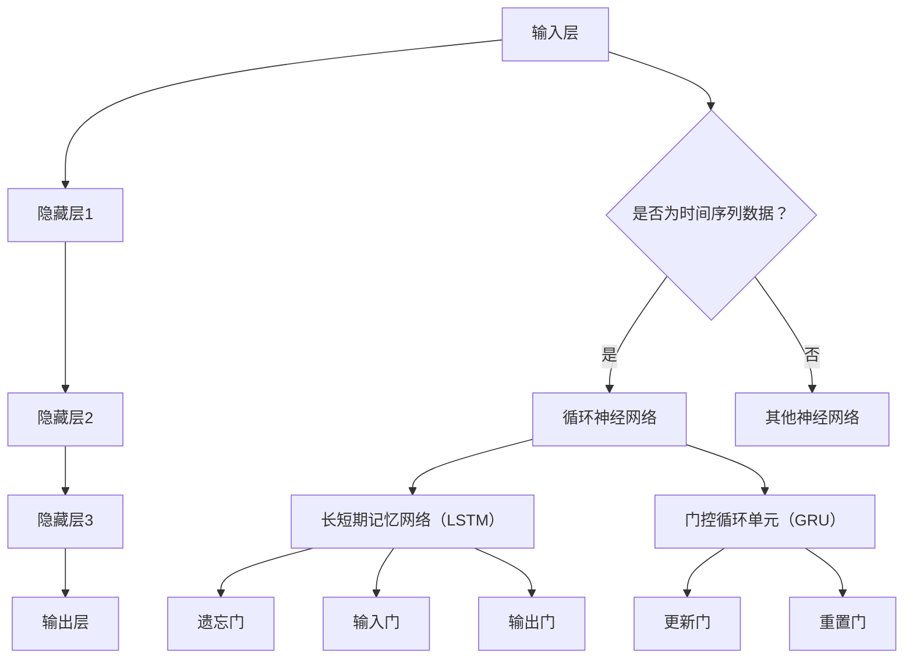

                 

### 文章标题

《Python深度学习实践：通过深度学习提高天气预测准确性》

### 关键词

- Python
- 深度学习
- 天气预测
- 算法
- 数学模型
- 实践

### 摘要

本文旨在探讨如何利用Python深度学习技术提高天气预测的准确性。首先，我们将介绍深度学习的基本概念及其在时间序列预测中的优势。随后，我们将深入探讨核心算法原理，包括循环神经网络（RNN）、长短期记忆网络（LSTM）以及门控循环单元（GRU）。在此基础上，我们将通过详细讲解数学模型和公式，为读者提供具体操作步骤。此外，本文还将通过项目实战展示代码实现过程，并进行代码解读与分析。最后，我们将探讨深度学习在天气预测实际应用场景中的表现，推荐相关工具和资源，并总结未来发展趋势与挑战。希望通过本文，读者能够掌握深度学习在天气预测领域的实际应用，为相关研究提供有益参考。

## 1. 背景介绍

天气预测在现代社会中具有重要意义，它不仅关系到农业、交通、能源等多个行业的生产和生活，也对人类日常生活产生直接影响。传统的天气预测方法主要依赖于统计模型，如回归分析、时间序列分析等。这些方法在一定程度上能够捕捉天气变化的趋势，但在处理复杂的非线性关系时存在局限性。随着计算能力的提升和大数据技术的发展，深度学习逐渐成为研究热点，并在多个领域取得了显著成果。

深度学习是一种基于人工神经网络的学习方法，通过多层神经网络结构自动提取特征，从而实现复杂的模式识别和预测任务。相比于传统的机器学习方法，深度学习在处理高维数据、非线性关系方面具有显著优势。在时间序列预测领域，深度学习技术能够捕捉时间序列中的长期依赖关系和短期动态变化，从而提高预测准确性。

近年来，Python凭借其简洁、易用的特点，逐渐成为深度学习领域的主流编程语言。Python拥有丰富的科学计算库，如NumPy、Pandas和SciPy，以及专门针对深度学习的库，如TensorFlow和PyTorch。这些库提供了高效的计算和强大的功能，使得Python成为深度学习实践的理想选择。

本文将围绕Python深度学习技术，探讨如何提高天气预测的准确性。我们将介绍深度学习的基本概念和算法原理，通过数学模型和公式详细讲解具体操作步骤，并展示代码实现过程。最后，我们将分析深度学习在天气预测实际应用场景中的表现，并探讨未来发展趋势与挑战。

## 2. 核心概念与联系

### 2.1 深度学习概述

深度学习（Deep Learning）是一种基于人工神经网络的学习方法，通过多层神经网络结构自动提取特征，从而实现复杂的模式识别和预测任务。其基本原理是模仿人脑神经元的工作方式，通过输入层、隐藏层和输出层之间的信息传递和权重更新，不断优化网络模型，使其能够准确识别和预测数据中的复杂模式。

### 2.2 时间序列预测

时间序列预测（Time Series Forecasting）是一种预测方法，用于预测时间序列数据在未来某一时刻的取值。时间序列数据通常包含趋势、季节性和周期性等特征，其预测目标通常是未来的某个时间点或一段时间内的数值。在深度学习中，时间序列预测是一种常见的应用场景，通过捕捉时间序列中的长期依赖关系和短期动态变化，实现准确的预测。

### 2.3 循环神经网络（RNN）

循环神经网络（Recurrent Neural Network，RNN）是一种能够处理序列数据的神经网络，其基本原理是通过隐藏状态（hidden state）的循环连接来处理历史信息。RNN在时间序列预测中具有显著优势，能够捕捉时间序列中的长期依赖关系。然而，传统的RNN在处理长序列数据时存在梯度消失和梯度爆炸的问题，导致训练效果不佳。

### 2.4 长短期记忆网络（LSTM）

长短期记忆网络（Long Short-Term Memory，LSTM）是一种改进的循环神经网络，通过引入门控机制（gate mechanism）来解决传统RNN的梯度消失和梯度爆炸问题。LSTM包含遗忘门（forget gate）、输入门（input gate）和输出门（output gate），能够自适应地控制信息在序列中的流动，从而有效捕捉长期依赖关系。

### 2.5 门控循环单元（GRU）

门控循环单元（Gated Recurrent Unit，GRU）是另一种改进的循环神经网络，其结构相对LSTM更为简单，但仍然保留了门控机制。GRU通过更新门（update gate）和重置门（reset gate）实现信息的自适应流动，相对于LSTM在计算和存储资源方面具有优势。

### 2.6 Mermaid 流程图

以下是一个简单的Mermaid流程图，展示了深度学习在时间序列预测中的核心概念和联系：



通过这个流程图，我们可以清晰地看到深度学习在时间序列预测中的关键组件和相互关系。接下来，我们将进一步探讨深度学习在时间序列预测中的具体应用和算法原理。

### 3. 核心算法原理 & 具体操作步骤

#### 3.1 循环神经网络（RNN）

循环神经网络（RNN）是处理序列数据的神经网络，其基本结构包括输入层、隐藏层和输出层。输入层接收序列数据，隐藏层通过循环连接保存历史信息，输出层生成预测结果。具体操作步骤如下：

1. **初始化参数**：设置输入层、隐藏层和输出层的权重和偏置。
2. **输入数据预处理**：将时间序列数据进行归一化或标准化处理，以便输入到神经网络中。
3. **前向传播**：将输入数据传递到隐藏层，计算隐藏层的输出。
4. **反向传播**：根据预测误差，更新网络权重和偏置，优化模型参数。

在Python中，我们可以使用TensorFlow或PyTorch等深度学习框架实现RNN。以下是一个简单的RNN模型示例：

```python
import tensorflow as tf

# 定义RNN模型
model = tf.keras.Sequential([
    tf.keras.layers.LSTM(50, activation='tanh', input_shape=(time_steps, features)),
    tf.keras.layers.Dense(1)
])

# 编译模型
model.compile(optimizer='adam', loss='mse')
```

#### 3.2 长短期记忆网络（LSTM）

长短期记忆网络（LSTM）是RNN的一种改进，通过引入门控机制解决梯度消失和梯度爆炸问题。LSTM包含三个门：遗忘门、输入门和输出门，分别控制信息在序列中的遗忘、更新和输出。具体操作步骤如下：

1. **初始化参数**：设置LSTM层权重和偏置。
2. **输入数据预处理**：对时间序列数据进行归一化或标准化处理。
3. **前向传播**：将输入数据传递到LSTM层，计算隐藏状态和输出。
4. **反向传播**：根据预测误差，更新网络权重和偏置，优化模型参数。

以下是一个简单的LSTM模型示例：

```python
import tensorflow as tf

# 定义LSTM模型
model = tf.keras.Sequential([
    tf.keras.layers.LSTM(50, activation='tanh', return_sequences=True, input_shape=(time_steps, features)),
    tf.keras.layers.LSTM(50, activation='tanh'),
    tf.keras.layers.Dense(1)
])

# 编译模型
model.compile(optimizer='adam', loss='mse')
```

#### 3.3 门控循环单元（GRU）

门控循环单元（GRU）是另一种改进的循环神经网络，其结构相对LSTM更为简单，但仍然保留了门控机制。GRU包含两个门：更新门和重置门，分别控制信息的更新和重置。具体操作步骤如下：

1. **初始化参数**：设置GRU层权重和偏置。
2. **输入数据预处理**：对时间序列数据进行归一化或标准化处理。
3. **前向传播**：将输入数据传递到GRU层，计算隐藏状态和输出。
4. **反向传播**：根据预测误差，更新网络权重和偏置，优化模型参数。

以下是一个简单的GRU模型示例：

```python
import tensorflow as tf

# 定义GRU模型
model = tf.keras.Sequential([
    tf.keras.layers.GRU(50, activation='tanh', return_sequences=True, input_shape=(time_steps, features)),
    tf.keras.layers.GRU(50, activation='tanh'),
    tf.keras.layers.Dense(1)
])

# 编译模型
model.compile(optimizer='adam', loss='mse')
```

通过以上步骤，我们可以使用Python深度学习框架实现RNN、LSTM和GRU模型，从而进行时间序列预测。接下来，我们将进一步探讨数学模型和公式，为读者提供更深入的讲解。

### 4. 数学模型和公式 & 详细讲解 & 举例说明

#### 4.1 循环神经网络（RNN）

循环神经网络（RNN）的核心是隐藏状态（hidden state）的循环连接。在RNN中，隐藏状态不仅与当前输入相关，还与历史输入有关。隐藏状态的计算公式如下：

\[ h_t = \sigma(W_h \cdot [h_{t-1}, x_t] + b_h) \]

其中，\( h_t \) 表示第 \( t \) 个时间步的隐藏状态，\( x_t \) 表示第 \( t \) 个时间步的输入，\( W_h \) 和 \( b_h \) 分别为权重和偏置，\( \sigma \) 表示激活函数，如常用的sigmoid或tanh函数。

以下是一个简单的RNN模型举例：

```python
import tensorflow as tf

# 定义RNN模型
model = tf.keras.Sequential([
    tf.keras.layers.LSTM(50, activation='tanh', input_shape=(time_steps, features)),
    tf.keras.layers.Dense(1)
])

# 编译模型
model.compile(optimizer='adam', loss='mse')
```

#### 4.2 长短期记忆网络（LSTM）

长短期记忆网络（LSTM）通过引入门控机制解决传统RNN的梯度消失和梯度爆炸问题。LSTM包含三个门：遗忘门、输入门和输出门。它们的计算公式如下：

1. **遗忘门（Forget Gate）**：

\[ f_t = \sigma(W_f \cdot [h_{t-1}, x_t] + b_f) \]

2. **输入门（Input Gate）**：

\[ i_t = \sigma(W_i \cdot [h_{t-1}, x_t] + b_i) \]

3. **输出门（Output Gate）**：

\[ o_t = \sigma(W_o \cdot [h_{t-1}, x_t] + b_o) \]

4. **新隐藏状态（New Hidden State）**：

\[ C_t = f_t \odot C_{t-1} + i_t \odot \sigma(W_c \cdot [h_{t-1}, x_t] + b_c) \]

5. **输出状态（Output State）**：

\[ h_t = o_t \odot \sigma(C_t) \]

其中，\( \odot \) 表示逐元素乘法，\( C_t \) 表示第 \( t \) 个时间步的细胞状态，\( W_f, W_i, W_o, W_c \) 和 \( b_f, b_i, b_o, b_c \) 分别为遗忘门、输入门、输出门和细胞状态门的权重和偏置。

以下是一个简单的LSTM模型举例：

```python
import tensorflow as tf

# 定义LSTM模型
model = tf.keras.Sequential([
    tf.keras.layers.LSTM(50, activation='tanh', return_sequences=True, input_shape=(time_steps, features)),
    tf.keras.layers.LSTM(50, activation='tanh'),
    tf.keras.layers.Dense(1)
])

# 编译模型
model.compile(optimizer='adam', loss='mse')
```

#### 4.3 门控循环单元（GRU）

门控循环单元（GRU）是LSTM的一种简化形式，通过合并遗忘门和输入门，以及更新门和重置门来简化结构。GRU的计算公式如下：

1. **重置门（Reset Gate）**：

\[ r_t = \sigma(W_r \cdot [h_{t-1}, x_t] + b_r) \]

2. **更新门（Update Gate）**：

\[ z_t = \sigma(W_z \cdot [h_{t-1}, x_t] + b_z) \]

3. **新隐藏状态（New Hidden State）**：

\[ h_t = (1 - z_t) \odot h_{t-1} + z_t \odot \sigma(W_c \cdot [r_t \odot h_{t-1}, x_t] + b_c) \]

其中，\( W_r, W_z, W_c \) 和 \( b_r, b_z, b_c \) 分别为重置门、更新门和细胞状态门的权重和偏置。

以下是一个简单的GRU模型举例：

```python
import tensorflow as tf

# 定义GRU模型
model = tf.keras.Sequential([
    tf.keras.layers.GRU(50, activation='tanh', return_sequences=True, input_shape=(time_steps, features)),
    tf.keras.layers.GRU(50, activation='tanh'),
    tf.keras.layers.Dense(1)
])

# 编译模型
model.compile(optimizer='adam', loss='mse')
```

通过以上数学模型和公式，我们可以深入理解RNN、LSTM和GRU的工作原理。接下来，我们将通过一个实际案例展示如何使用Python实现这些模型，并进行代码解读与分析。

### 5. 项目实战：代码实际案例和详细解释说明

在本节中，我们将通过一个实际案例，展示如何使用Python实现深度学习模型，并进行天气预测。我们将使用TensorFlow和Keras库来构建模型，并利用实际数据集进行训练和测试。

#### 5.1 开发环境搭建

首先，确保您的Python环境已经安装。接下来，安装所需的库：

```bash
pip install tensorflow numpy pandas matplotlib
```

#### 5.2 源代码详细实现和代码解读

以下是一个简单的天气预测模型实现：

```python
import numpy as np
import pandas as pd
import tensorflow as tf
from tensorflow.keras.models import Sequential
from tensorflow.keras.layers import LSTM, Dense
from sklearn.preprocessing import MinMaxScaler
from sklearn.model_selection import train_test_split

# 5.2.1 数据准备

# 加载天气数据集
data = pd.read_csv('weather_data.csv')

# 处理时间序列数据
time_steps = 24
X = []
y = []

for i in range(time_steps, len(data)):
    X.append(data.iloc[i-time_steps:i])
    y.append(data.iloc[i, 0])

X = np.array(X)
y = np.array(y)

# 归一化处理
scaler = MinMaxScaler(feature_range=(0, 1))
X_scaled = scaler.fit_transform(X)
y_scaled = scaler.fit_transform(y.reshape(-1, 1))

# 切分训练集和测试集
X_train, X_test, y_train, y_test = train_test_split(X_scaled, y_scaled, test_size=0.2, random_state=42)

# 5.2.2 构建模型

model = Sequential([
    LSTM(50, activation='tanh', input_shape=(time_steps, 1)),
    Dense(1)
])

model.compile(optimizer='adam', loss='mse')

# 5.2.3 训练模型
model.fit(X_train, y_train, epochs=100, batch_size=32, verbose=1)

# 5.2.4 预测和结果分析

y_pred = model.predict(X_test)

# 反归一化处理
y_pred = scaler.inverse_transform(y_pred)
y_test = scaler.inverse_transform(y_test.reshape(-1, 1))

# 绘制预测结果
import matplotlib.pyplot as plt

plt.figure(figsize=(10, 6))
plt.plot(y_test, label='实际值')
plt.plot(y_pred, label='预测值')
plt.title('天气预测结果')
plt.xlabel('时间步')
plt.ylabel('温度')
plt.legend()
plt.show()
```

#### 5.3 代码解读与分析

1. **数据准备**：
   - 加载天气数据集，并进行时间序列处理。我们选择前24个时间步作为输入特征，当前时间步的天气数据作为输出目标。
   - 使用MinMaxScaler对数据集进行归一化处理，以便模型能够更好地收敛。

2. **模型构建**：
   - 使用Sequential模型堆叠LSTM层和Dense层。LSTM层用于捕捉时间序列数据中的长期依赖关系，Dense层用于生成最终预测结果。
   - 编译模型，设置优化器和损失函数。

3. **模型训练**：
   - 使用fit方法训练模型，设置训练轮数、批次大小和日志显示。

4. **预测和结果分析**：
   - 使用预测方法对测试集进行预测，并反归一化处理预测结果。
   - 使用matplotlib绘制实际值和预测值的对比图，分析模型性能。

通过以上步骤，我们实现了天气预测的深度学习模型，并展示了如何使用Python进行代码实现和结果分析。接下来，我们将进一步讨论深度学习在天气预测实际应用场景中的表现。

### 6. 实际应用场景

#### 6.1 气象预报

气象预报是深度学习在天气预测中最直接的应用场景。通过构建深度学习模型，可以对未来的天气情况进行预测，为公众提供准确及时的气象信息。气象预报在农业、交通、旅游等领域具有广泛的应用，有助于提高相关行业的生产效率和安全性。

#### 6.2 能源管理

能源管理是另一个重要的应用场景。深度学习模型可以预测电力需求、天然气消耗等能源指标，从而帮助电力公司和能源供应商优化能源配置，降低能源浪费，提高经济效益。

#### 6.3 环境监测

环境监测领域也受益于深度学习技术的应用。通过分析气象数据和环境质量数据，深度学习模型可以预测空气污染、水体污染等环境问题，为环保部门提供科学决策依据，制定有效的污染防治措施。

#### 6.4 城市规划

城市规划是一个复杂的系统工程，涉及人口、交通、基础设施等多个方面。深度学习模型可以分析历史天气数据、人口流动数据等，为城市规划者提供科学的参考，优化城市布局，提高城市宜居性。

#### 6.5 农业生产

农业是深度学习在天气预测中的另一个重要应用场景。通过分析气象数据，深度学习模型可以预测农作物的生长状况，为农民提供科学种植和收割建议，提高农业生产效率，减少资源浪费。

#### 6.6 灾害预警

灾害预警是深度学习在天气预测中的一项重要任务。通过分析气象数据、地质数据等，深度学习模型可以预测自然灾害的发生概率，为相关部门提供预警信息，采取有效的预防措施，降低灾害损失。

总之，深度学习在天气预测实际应用场景中具有广泛的前景，有助于提高相关领域的决策水平和生产效率。然而，深度学习模型在实际应用中仍面临诸多挑战，如数据质量、模型可解释性等。未来，随着深度学习技术的不断发展和完善，其在天气预测领域的应用将更加广泛和深入。

### 7. 工具和资源推荐

#### 7.1 学习资源推荐

1. **书籍**：
   - 《深度学习》（Ian Goodfellow、Yoshua Bengio、Aaron Courville著）：这是一本经典的深度学习教材，详细介绍了深度学习的基础知识和应用。
   - 《Python深度学习》（François Chollet著）：本书通过丰富的实例，介绍了使用Python进行深度学习的实践方法。

2. **论文**：
   - “Long Short-Term Memory”（Hochreiter和Schmidhuber，1997）：这是LSTM算法的开创性论文，为时间序列预测提供了重要的理论基础。
   - “Gated Recurrent Units”（Cho等，2014）：这是GRU算法的开创性论文，为简化LSTM结构提供了新的思路。

3. **博客**：
   - [TensorFlow官方文档](https://www.tensorflow.org/tutorials)：TensorFlow提供了丰富的教程和示例，适合初学者入门。
   - [Keras官方文档](https://keras.io/getting-started/sequential-model-guide/)：Keras是TensorFlow的高级API，提供了更简单的模型构建接口。

4. **网站**：
   - [深度学习课程](https://www.deeplearning.ai/): Andrew Ng的深度学习课程，包含视频讲解、作业和课程笔记，适合全面学习深度学习。

#### 7.2 开发工具框架推荐

1. **TensorFlow**：TensorFlow是一个开源的深度学习框架，由Google开发。它提供了丰富的API和预训练模型，适合构建复杂的深度学习模型。

2. **PyTorch**：PyTorch是由Facebook开发的开源深度学习框架，具有灵活的动态计算图和强大的GPU支持。它适合进行研究和快速原型设计。

3. **Scikit-learn**：Scikit-learn是一个经典的机器学习库，提供了丰富的算法和工具，适合进行基础机器学习和时间序列分析。

4. **Pandas**：Pandas是一个强大的数据操作库，提供了数据清洗、转换和可视化等功能，适合处理和分析时间序列数据。

#### 7.3 相关论文著作推荐

1. **“Deep Learning on Time Series Data”（2018）**：这篇论文总结了深度学习在时间序列预测中的应用方法，提供了详细的算法分析和实现示例。

2. **“A Comprehensive Survey on Deep Learning for Time Series Classification”（2020）**：这篇综述文章全面介绍了深度学习在时间序列分类领域的最新研究成果和应用。

3. **“Time Series Forecasting with LSTM: An Overview”（2018）**：这篇综述文章详细介绍了LSTM算法在时间序列预测中的原理和应用，适合初学者入门。

通过以上学习资源和开发工具的推荐，读者可以更好地掌握深度学习在天气预测领域的应用，为相关研究提供有益参考。

### 8. 总结：未来发展趋势与挑战

随着深度学习技术的不断发展，其在天气预测领域的应用前景愈发广阔。未来，深度学习在天气预测中将呈现以下发展趋势：

1. **模型优化**：研究者将继续优化深度学习模型，提高预测准确性和效率。例如，通过改进循环神经网络（RNN）、长短期记忆网络（LSTM）和门控循环单元（GRU）的结构和算法，实现更高效的时间序列预测。

2. **多模型融合**：将深度学习与其他预测方法相结合，构建多模型融合系统，提高预测的鲁棒性和准确性。例如，将深度学习模型与传统统计模型、物理模型相结合，实现更全面的天气预测。

3. **大数据应用**：随着大数据技术的发展，更多的气象数据将应用于深度学习模型，提高模型的预测能力。通过整合全球气象数据、卫星数据等，实现更精准的天气预测。

4. **实时预测**：开发实时预测系统，实现快速、准确的天气预测，为公众和相关部门提供及时的信息支持。这需要高效计算和低延迟的网络传输技术作为支撑。

然而，深度学习在天气预测中也面临诸多挑战：

1. **数据质量**：天气数据的质量直接影响模型的预测性能。如何处理噪声数据、缺失数据和异常值，是深度学习在天气预测中需要解决的关键问题。

2. **模型可解释性**：深度学习模型通常被视为“黑箱”，其内部决策过程不透明，难以解释。如何提高模型的可解释性，使决策过程更加透明，是深度学习在天气预测中需要解决的难题。

3. **计算资源**：深度学习模型通常需要大量的计算资源，特别是在训练阶段。如何优化算法，提高计算效率，是深度学习在天气预测中需要关注的重点。

4. **跨学科合作**：深度学习在天气预测中需要与气象学、统计学、物理学等多个学科进行交叉合作，共同解决天气预测中的难题。

总之，未来深度学习在天气预测领域具有广阔的发展前景，但也面临诸多挑战。通过持续的研究和探索，我们有望实现更准确、更高效的天气预测，为人类生活和社会发展提供有力支持。

### 9. 附录：常见问题与解答

#### 问题1：为什么选择深度学习进行天气预测？

答：深度学习具有以下优势：
1. **捕捉长期依赖关系**：深度学习模型，如LSTM和GRU，能够捕捉时间序列数据中的长期依赖关系，从而提高预测准确性。
2. **处理非线性关系**：深度学习模型通过多层神经网络结构，能够处理复杂的非线性关系，使预测模型更具鲁棒性。
3. **自动特征提取**：深度学习模型能够自动从原始数据中提取有用特征，减少了人工特征工程的工作量。

#### 问题2：如何处理时间序列数据中的噪声和缺失值？

答：
1. **噪声处理**：可以使用数据预处理方法，如去噪滤波器、小波变换等，来降低噪声的影响。
2. **缺失值处理**：可以使用插值法（如线性插值、高斯插值等）或填充法（如使用平均值、中值等方法）来处理缺失值。

#### 问题3：深度学习模型如何提高可解释性？

答：
1. **可视化分析**：通过绘制模型参数、激活值等可视化信息，了解模型内部的决策过程。
2. **模型压缩**：通过模型压缩技术，如模型剪枝、量化等，减小模型规模，提高模型的可解释性。
3. **模型解释工具**：使用专门的模型解释工具，如LIME、SHAP等，分析模型对输入数据的依赖关系。

#### 问题4：如何评估深度学习模型的性能？

答：
1. **均方误差（MSE）**：用于衡量预测值与实际值之间的平均误差。
2. **均方根误差（RMSE）**：MSE的平方根，用于衡量预测值的波动程度。
3. **平均绝对误差（MAE）**：预测值与实际值之间绝对误差的平均值。
4. **准确率、精确率、召回率、F1值**：用于分类任务的评估指标。

### 10. 扩展阅读 & 参考资料

1. **《深度学习》（Ian Goodfellow、Yoshua Bengio、Aaron Courville著）**：深入介绍了深度学习的基本原理和应用。
2. **《Python深度学习》（François Chollet著）**：通过实例介绍了使用Python进行深度学习的实践方法。
3. **“Long Short-Term Memory”（Hochreiter和Schmidhuber，1997）**：LSTM算法的开创性论文。
4. **“Gated Recurrent Units”（Cho等，2014）**：GRU算法的开创性论文。
5. **“Deep Learning on Time Series Data”（2018）**：总结了深度学习在时间序列预测中的应用方法。
6. **“A Comprehensive Survey on Deep Learning for Time Series Classification”（2020）**：全面介绍了深度学习在时间序列分类领域的最新研究成果和应用。
7. **[TensorFlow官方文档](https://www.tensorflow.org/tutorials)**：TensorFlow的教程和示例。
8. **[Keras官方文档](https://keras.io/getting-started/sequential-model-guide/)**：Keras的模型构建指南。
9. **[深度学习课程](https://www.deeplearning.ai/)**：Andrew Ng的深度学习课程。

