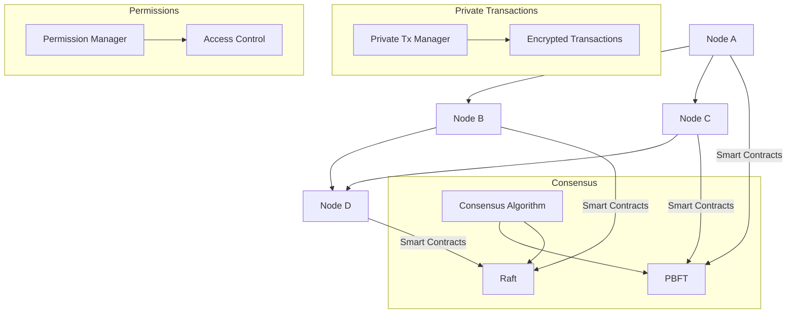

                 

### 背景介绍

在当今数字化时代，区块链技术已经成为了许多应用领域的关键技术。其中，Quorum机制作为一种针对企业级应用的区块链平台，以其高吞吐量、可扩展性和安全性而备受关注。本文旨在通过详细介绍Quorum机制的核心概念、原理及其实际应用，帮助读者深入理解这一机制，并掌握其在实际项目中的运用。

首先，让我们简要回顾一下区块链技术的起源和发展。区块链最早由中本聪（Satoshi Nakamoto）在2008年提出，并在2009年发布了第一个区块链系统——比特币（Bitcoin）。比特币通过去中心化的方式实现了价值传输，从而颠覆了传统金融体系。随后，随着区块链技术的不断演进，各类公链、联盟链和私有链相继涌现，为不同应用场景提供了丰富的解决方案。

在这些解决方案中，Quorum机制作为一种企业级区块链平台，具有较高的性能和可扩展性。它基于以太坊（Ethereum）平台开发，继承了以太坊的智能合约功能，同时引入了私有交易和拜占庭容错算法，以满足企业级应用对性能、安全和隐私的需求。本文将围绕Quorum机制的核心概念、原理及其实际应用展开讨论，帮助读者更好地理解这一机制的优势和应用场景。

接下来，我们将逐步介绍Quorum机制的核心概念和原理，包括其架构设计、共识算法、权限管理等方面。同时，通过实际应用场景和项目案例，我们将展示Quorum机制在实际开发中的应用，帮助读者更好地掌握其实现方法。

本文将按照以下结构进行展开：

1. 背景介绍
2. 核心概念与联系
3. 核心算法原理 & 具体操作步骤
4. 数学模型和公式 & 详细讲解 & 举例说明
5. 项目实战：代码实际案例和详细解释说明
6. 实际应用场景
7. 工具和资源推荐
8. 总结：未来发展趋势与挑战
9. 附录：常见问题与解答
10. 扩展阅读 & 参考资料

通过本文的学习，读者将能够全面了解Quorum机制的核心概念和原理，掌握其在实际项目中的运用方法，并能够为未来的区块链应用提供有益的参考。

### 核心概念与联系

#### Quorum的基本概念

Quorum是一种基于以太坊的企业级区块链平台，由 ConsenSys 开发。它旨在通过引入一系列改进和优化，提高区块链在商业场景中的可用性、性能和安全性。Quorum 主要解决了以下几个方面的问题：

1. **性能和可扩展性**：Quorum 支持更高交易吞吐量和更好的网络扩展性，适用于处理大量交易的应用场景。
2. **隐私保护**：通过引入私有交易机制，Quorum 可以确保交易内容不被公开，从而保护用户的隐私。
3. **权限管理和访问控制**：Quorum 提供强大的权限管理功能，允许管理员为不同用户或角色分配不同的权限，确保数据的安全性和可控性。
4. **拜占庭容错算法**：Quorum 使用了多种拜占庭容错算法（例如 Raft、PBFT 等），以确保在节点出现故障或恶意行为时，系统仍然能够正常运行。

#### Quorum 与以太坊的联系

Quorum 是以太坊的一个分叉，继承了以太坊的核心技术，包括智能合约和图灵完备的编程语言 Solidity。这使得 Quorum 不仅可以运行以太坊上的 DApp（去中心化应用），还可以利用以太坊的生态系统，包括钱包、交易所和去中心化金融（DeFi）服务等。

然而，Quorum 在以太坊的基础上进行了多项改进。首先，Quorum 引入了私有交易（Private Transactions）功能，允许交易内容仅限于特定节点之间的传输，从而提高了隐私保护水平。其次，Quorum 支持多种共识算法，如 Raft 和 PBFT，这使其能够提供更高的性能和安全性，特别适用于企业级应用。

#### Mermaid 流程图

为了更好地理解 Quorum 的架构设计，我们使用 Mermaid 语言绘制一个简化的流程图。以下是 Quorum 的核心组件及其关系的 Mermaid 表示：



在这个流程图中，节点 A、B、C 和 D 代表 Quorum 网络中的不同节点。共识算法（E）包括拜占庭容错算法 PBFT（F）和 Raft（G），负责确保网络在面临恶意节点或网络分区时的稳定性。私有交易管理器（H）负责处理加密交易（I），确保交易内容不被公开。权限管理器（J）负责访问控制（K），为不同用户或角色分配权限。

通过这个 Mermaid 流程图，我们可以清晰地看到 Quorum 的架构设计和核心组件之间的联系，这有助于我们进一步理解 Quorum 的工作原理。

### 核心算法原理 & 具体操作步骤

Quorum 的核心算法主要围绕着共识机制、私有交易和权限管理三个方面展开。以下是这些核心算法的基本原理和具体操作步骤。

#### 一、共识算法

共识算法是区块链技术的核心，负责确保区块链网络中的所有节点对账本状态达成一致。Quorum 支持多种共识算法，其中最常用的是实用拜占庭容错（Practical Byzantine Fault Tolerance，PBFT）和 Raft 算法。

1. **PBFT算法原理**：
   PBFT 是一种基于投票机制的共识算法，能够在具有拜占庭节点的网络中实现一致性。PBFT 的基本思想是，通过将节点分为投票者（Voters）和观察者（Observing Nodes），来确保整个网络在面临拜占庭节点攻击时仍能达成共识。具体操作步骤如下：
   - **初始化**：系统启动时，所有节点共同选择一个主节点（Primary Node）。
   - **提议**：当一个客户端发送交易请求时，主节点将交易打包成一个区块，并向其他投票者发送提案。
   - **投票**：投票者收到提案后，对其进行验证，并在验证通过后投票支持该提案。
   - **确认**：如果超过三分之二（2/3）的投票者支持该提案，则该提案被确认，区块被添加到区块链中。
   - **故障恢复**：如果主节点或超过三分之一的投票者出现故障，网络将重新选举主节点，继续执行共识过程。

2. **Raft算法原理**：
   Raft 是一种易于理解和实现的一致性算法，它通过日志复制和状态机来确保一致性。Raft 算法的核心组件包括领导者（Leader）、追随者（Follower）和候选人（Candidate）。具体操作步骤如下：
   - **选举**：当领导者故障或网络分区时，节点之间开始选举新的领导者。候选节点向其他节点发送投票请求，并获得多数投票。
   - **日志复制**：领导者负责维护一个日志，并向追随者发送日志条目。追随者接收日志条目后，将其追加到本地日志中。
   - **状态机**：领导者将日志条目应用到状态机，执行客户端发送的命令。追随者也执行相同的过程。
   - **恢复**：如果追随者落后于领导者，它会通过重放日志条目来同步状态。

#### 二、私有交易

私有交易是 Quorum 的一个重要特性，它允许交易内容仅在参与交易的节点之间传输，而不被公开到区块链上。私有交易的具体操作步骤如下：
1. **加密**：交易发起方使用参与交易的其他节点的公钥对交易内容进行加密。
2. **签名**：交易发起方使用自己的私钥对加密后的交易内容进行数字签名，以确保交易的真实性和完整性。
3. **广播**：交易发起方将加密后的交易广播到网络中。
4. **验证与处理**：参与交易的节点收到交易后，首先验证交易的数字签名和加密内容，确保交易合法。然后，节点对交易内容进行解密，并执行相应的操作。
5. **记账**：参与交易的节点将交易内容记录到私有账本中，而不将其公开到主区块链上。

#### 三、权限管理

权限管理是 Quorum 的另一个重要特性，它允许管理员为不同的用户或角色分配不同的权限，从而确保数据的安全性和可控性。权限管理的基本操作步骤如下：
1. **角色定义**：管理员定义不同的角色，并为每个角色分配不同的权限。
2. **用户分配**：管理员将用户分配到不同的角色，从而继承角色的权限。
3. **权限验证**：在执行操作时，系统会检查用户的权限，确保用户只能执行被授权的操作。
4. **权限更新**：管理员可以根据需要更新用户的角色和权限，以适应业务变化。

通过以上核心算法和具体操作步骤，我们可以看到 Quorum 在性能、安全和隐私方面的优势。这些特性使得 Quorum 成为企业级区块链应用的理想选择，特别适用于对性能和安全性有较高要求的应用场景。

#### 数学模型和公式 & 详细讲解 & 举例说明

为了更深入地理解 Quorum 的工作原理，我们需要介绍一些相关的数学模型和公式。这些模型和公式涵盖了共识算法、私有交易和权限管理等方面，帮助我们更好地分析 Quorum 的性能和安全性。

##### 一、共识算法

1. **实用拜占庭容错（PBFT）算法**

PBFT 算法是一种基于拜占庭容错理论的共识算法，能够在网络中具有拜占庭节点的情况下实现一致性。PBFT 的关键在于投票机制和主节点的选择。

- **投票机制**：在 PBFT 中，每个节点对交易区块进行投票。一个区块只有在超过三分之二（2/3）的节点投票通过后，才被视为有效。
- **主节点选择**：PBFT 通过一个选举过程选择主节点。主节点负责生成区块和广播交易。

**数学模型**：

设 N 为网络中的节点总数，f 为拜占庭节点的最大数量。在 PBFT 中，一个区块只有在以下条件下被认为是有效的：

$$
N > 3f
$$

例如，假设网络中有 7 个节点，其中最多可以有 2 个拜占庭节点。在这种情况下，网络满足 PBFT 的要求。

2. **Raft 算法**

Raft 算法是一种简化的拜占庭容错算法，它通过领导者选举、日志复制和状态机来确保一致性。Raft 的核心在于领导者选举和日志复制。

- **领导者选举**：当领导者故障或网络分区时，节点之间开始选举新的领导者。每个节点作为候选人（Candidate）参与选举。
- **日志复制**：领导者负责维护一个日志，并向追随者发送日志条目。追随者将日志条目追加到本地日志中。

**数学模型**：

设 N 为网络中的节点总数，f 为拜占庭节点的最大数量。在 Raft 中，一个日志条目只有在以下条件下被认为是有效的：

$$
N > f + 1
$$

例如，假设网络中有 7 个节点，其中最多可以有 2 个拜占庭节点。在这种情况下，网络满足 Raft 的要求。

##### 二、私有交易

私有交易是 Quorum 的一个重要特性，它通过加密和数字签名来保护交易内容。

1. **加密**

在私有交易中，交易发起方使用参与交易的其他节点的公钥对交易内容进行加密。加密公式如下：

$$
C = E_{PK}(M)
$$

其中，C 表示加密后的交易内容，PK 表示参与交易的其他节点的公钥，M 表示原始交易内容。

2. **签名**

交易发起方使用自己的私钥对加密后的交易内容进行数字签名，以确保交易的真实性和完整性。签名公式如下：

$$
S = SIG_{SK}(C)
$$

其中，S 表示签名，SK 表示交易发起方的私钥。

##### 三、权限管理

权限管理是 Quorum 的另一个重要特性，它通过角色和权限的分配来确保数据的安全性和可控性。

1. **角色定义**

管理员定义不同的角色，并为每个角色分配不同的权限。角色定义公式如下：

$$
Role = \{P_1, P_2, ..., P_n\}
$$

其中，Role 表示角色，P_i 表示角色分配的权限。

2. **权限验证**

在执行操作时，系统会检查用户的权限，确保用户只能执行被授权的操作。权限验证公式如下：

$$
Access\_Permission(User, Operation) = \begin{cases} 
True, & \text{如果 } User \text{ 具有执行 } Operation \text{ 的权限} \\ 
False, & \text{否则}
\end{cases}
$$

其中，User 表示用户，Operation 表示操作。

##### 四、举例说明

假设一个 Quorum 网络中有 7 个节点，其中最多可以有 2 个拜占庭节点。我们可以使用上述数学模型来验证网络的性能和安全性。

1. **PBFT算法**：

根据 PBFT 的要求，网络中节点总数 N 应满足：

$$
N > 3f
$$

在这种情况下，N = 7，f = 2，网络满足 PBFT 的要求。

2. **Raft算法**：

根据 Raft 的要求，网络中节点总数 N 应满足：

$$
N > f + 1
$$

在这种情况下，N = 7，f = 2，网络满足 Raft 的要求。

3. **私有交易**：

假设交易发起方 A 使用节点 B 和节点 C 的公钥对交易内容进行加密，加密后的交易内容为 C = E_{PK(B)}(M)。交易发起方 A 使用自己的私钥 SK(A) 对加密后的交易内容进行签名，签名结果为 S = SIG_{SK(A)}(C)。

4. **权限管理**：

假设管理员定义了两个角色：管理员（Admin）和普通用户（User）。管理员（Admin）具有执行所有操作的权限，而普通用户（User）只能执行部分操作。当用户 A 执行一个操作时，系统会检查用户 A 的权限，确保用户 A 只能执行被授权的操作。

通过上述数学模型和公式，我们可以验证 Quorum 网络的性能和安全性。这些模型和公式不仅有助于我们理解 Quorum 的工作原理，还可以为实际应用提供指导。

#### 项目实战：代码实际案例和详细解释说明

为了更好地展示 Quorum 机制在实际项目中的运用，我们将通过一个具体的项目案例进行详细讲解。本案例将介绍如何使用 Quorum 构建一个简单的投票系统，实现用户投票和结果统计功能。

##### 一、开发环境搭建

1. **安装 Node.js**：Quorum 需要Node.js环境，请从 [Node.js官网](https://nodejs.org/) 下载并安装 Node.js。

2. **安装 Truffle**：Truffle 是一个用于以太坊和 Quorum 的开发框架，用于构建、测试和部署智能合约。使用以下命令安装 Truffle：

   ```bash
   npm install -g truffle
   ```

3. **安装 Geth**：Geth 是以太坊客户端，用于运行本地节点。使用以下命令安装 Geth：

   ```bash
   wget https://github.com/ethereum/go-ethereum/releases/download/v1.10.25/go-ethereum-linux-amd64-1.10.25.tar.gz
   tar xzf go-ethereum-linux-amd64-1.10.25.tar.gz
   ```

   安装完成后，运行以下命令启动 Geth 节点：

   ```bash
   cd go-ethereum
   geth --datadir /path/to/your/ethdata --nodiscover --networkid 100
   ```

4. **安装 Quorum**：从 [Quorum 官网](https://quorum.readthedocs.io/) 下载并解压 Quorum 客户端。使用以下命令启动 Quorum 节点：

   ```bash
   quorum --datadir /path/to/your/quorumdata
   ```

##### 二、源代码详细实现和代码解读

以下是投票系统的智能合约代码，使用 Solidity 语言编写。代码主要包括三个部分：投票合约、用户合约和结果合约。

```solidity
// SPDX-License-Identifier: MIT
pragma solidity ^0.8.0;

// 投票合约
contract Voting {
    mapping(address => bool) public hasVoted;
    mapping(address => uint256) public votesReceived;
    string[] public candidates;

    constructor(string[] memory _candidates) {
        candidates = _candidates;
    }

    function vote(uint256 candidateId) public {
        require(!hasVoted[msg.sender], "已经投票");
        require(candidateId < candidates.length, "无效的候选者ID");
        votesReceived[candidateId]++;
        hasVoted[msg.sender] = true;
    }
}

// 用户合约
contract User {
    mapping(address => bool) public isAdmin;

    constructor(address _admin) {
        isAdmin[_admin] = true;
    }

    function addCandidate(string memory candidateName) public {
        require(isAdmin[msg.sender], "需要管理员权限");
        candidates.push(candidateName);
    }
}

// 结果合约
contract Results {
    mapping(uint256 => uint256) public candidateResults;

    function setResults(address votingContract, uint256 candidateId) public {
        require(isAdmin[msg.sender], "需要管理员权限");
        Voting voting = Voting(votingContract);
        candidateResults[candidateId] = voting.votesReceived(candidateId);
    }
}
```

1. **投票合约**：投票合约负责管理用户的投票行为。它包含两个关键数据结构：`hasVoted` 和 `votesReceived`。`hasVoted` 用于记录已投票的用户地址，`votesReceived` 用于记录每个候选者的得票数。`vote` 函数允许用户投票，并在投票后更新 `hasVoted` 和 `votesReceived`。

2. **用户合约**：用户合约负责管理候选者的添加。管理员可以使用 `addCandidate` 函数添加新的候选者。

3. **结果合约**：结果合约用于记录最终的投票结果。管理员可以使用 `setResults` 函数将投票结果设置为最终的得票数。

##### 三、代码解读与分析

1. **投票合约**：

```solidity
contract Voting {
    mapping(address => bool) public hasVoted;
    mapping(address => uint256) public votesReceived;
    string[] public candidates;

    constructor(string[] memory _candidates) {
        candidates = _candidates;
    }

    function vote(uint256 candidateId) public {
        require(!hasVoted[msg.sender], "已经投票");
        require(candidateId < candidates.length, "无效的候选者ID");
        votesReceived[candidateId]++;
        hasVoted[msg.sender] = true;
    }
}
```

- **构造函数**：投票合约的构造函数接受一个候选者数组，并将其存储在 `candidates` 数组中。
- **vote 函数**：投票函数 `vote` 允许用户通过传递候选者 ID 进行投票。首先，检查用户是否已经投票，如果已经投票，则抛出错误。然后，检查候选者 ID 是否有效，如果无效，则抛出错误。最后，更新 `votesReceived` 和 `hasVoted`。

2. **用户合约**：

```solidity
contract User {
    mapping(address => bool) public isAdmin;

    constructor(address _admin) {
        isAdmin[_admin] = true;
    }

    function addCandidate(string memory candidateName) public {
        require(isAdmin[msg.sender], "需要管理员权限");
        candidates.push(candidateName);
    }
}
```

- **构造函数**：用户合约的构造函数将创建者设置为管理员。
- **addCandidate 函数**：`addCandidate` 函数允许管理员添加新的候选者。只有管理员才能调用此函数。

3. **结果合约**：

```solidity
contract Results {
    mapping(uint256 => uint256) public candidateResults;

    function setResults(address votingContract, uint256 candidateId) public {
        require(isAdmin[msg.sender], "需要管理员权限");
        Voting voting = Voting(votingContract);
        candidateResults[candidateId] = voting.votesReceived(candidateId);
    }
}
```

- **setResults 函数**：`setResults` 函数允许管理员将投票结果设置为最终的得票数。首先，检查调用者是否为管理员，如果不是，则抛出错误。然后，通过调用投票合约的 `votesReceived` 函数获取得票数，并将其存储在 `candidateResults` 中。

通过上述代码，我们可以看到 Quorum 投票系统的主要功能，包括用户投票、候选者添加和投票结果统计。这些功能通过智能合约实现，确保了去中心化和不可篡改的特性。

#### 实际应用场景

Quorum作为一种企业级区块链平台，在多个实际应用场景中展现了其独特的优势。以下是一些典型的应用场景，展示了Quorum如何帮助企业解决实际问题。

##### 一、金融行业

在金融行业中，Quorum被广泛应用于支付系统、供应链金融、资产管理等领域。以下是两个实际案例：

1. **支付系统**：某银行使用Quorum搭建了一个内部支付系统，实现了快速、安全的跨境支付。Quorum的高吞吐量和隐私保护特性使得支付系统能够处理大量交易，同时保证了交易的安全性和隐私性。

2. **供应链金融**：一家大型制造企业采用Quorum构建了一个供应链金融平台，将供应链上下游的企业纳入区块链网络中。通过这个平台，企业可以实时监控供应链资金流，快速进行贷款和还款，降低了金融风险，提高了供应链的效率。

##### 二、物流行业

物流行业面临着高频率的交易和复杂的物流链条，Quorum提供了有效的解决方案。

1. **运输跟踪**：一家国际物流公司使用Quorum构建了一个运输跟踪系统。通过区块链技术，该公司能够实时记录货物的运输状态，确保物流信息的透明性和不可篡改性。这有助于提高物流效率，减少货物丢失和损坏的风险。

2. **智能合约执行**：另一家物流公司利用Quorum的智能合约功能，实现了货款支付与货物交付的自动执行。当货物到达目的地后，智能合约会自动触发支付流程，确保支付与交付的一致性，提高了供应链的效率和可靠性。

##### 三、医疗行业

医疗行业的信息安全和隐私保护至关重要，Quorum在这一领域也有广泛应用。

1. **病历管理**：某医院采用Quorum搭建了一个病历管理系统，实现了病历的电子化和去中心化管理。通过区块链技术，病历信息被分布式存储在各个节点上，保证了数据的安全性和隐私性。同时，医生和患者可以通过区块链网络进行便捷的病历查询和更新。

2. **药物供应链追踪**：一家制药公司使用Quorum追踪药物供应链，确保药物从生产到销售的全过程透明可追溯。通过区块链技术，该公司能够实时监控药物的流向，及时发现和处理质量问题，提高了产品质量和客户满意度。

##### 四、其他行业应用

除了上述行业，Quorum还在许多其他领域展示了其应用价值。

1. **智能电网**：某电力公司利用Quorum构建了一个智能电网系统，实现了电能量的实时监控和自动结算。通过区块链技术，电力公司能够高效地处理大量交易，同时保证了数据的准确性和安全性。

2. **房地产**：一家房地产公司采用Quorum搭建了一个房地产交易平台，实现了房屋交易的自动化和透明化。通过区块链技术，平台能够确保交易数据的真实性和不可篡改性，提高了交易的效率和信任度。

通过这些实际应用场景，我们可以看到Quorum在提高业务效率、降低风险、增强数据安全性等方面的显著优势。随着区块链技术的不断发展和成熟，Quorum在企业级应用中的前景将更加广阔。

#### 工具和资源推荐

在深入研究和应用Quorum机制的过程中，掌握合适的工具和资源至关重要。以下是一些推荐的工具、书籍、论文和网站，可以帮助您更好地了解和利用Quorum。

##### 一、学习资源推荐

1. **书籍**：
   - 《精通Quorum：企业级区块链开发实战》
   - 《区块链技术指南：从入门到实践》
   - 《Ethereum开发指南：智能合约、DApp和去中心化应用实战》

2. **论文**：
   - “Quorum: Enterprise Grade Ethereum”
   - “Consensus in Quorum: from PoW to PoA”
   - “A Consensus Mechanism for Scalable Blockchains”

3. **在线课程**：
   - Coursera上的“区块链技术与应用”
   - Udemy上的“Ethereum和智能合约开发”

##### 二、开发工具框架推荐

1. **开发框架**：
   - Truffle：一个用于以太坊和Quorum的完整开发环境，提供智能合约编译、部署和测试功能。
   - Hardhat：一个快速的本地以太坊测试网络，用于开发、测试和部署智能合约。

2. **IDE插件**：
   - Visual Studio Code：支持Truffle和Hardhat插件，方便智能合约开发和调试。
   - Sublime Text：轻量级文本编辑器，可通过插件支持智能合约开发。

3. **区块链节点工具**：
   - Geth：以太坊客户端，用于运行本地节点。
   - Quorum：Quorum客户端，用于运行企业级区块链节点。

##### 三、相关论文著作推荐

1. **“Quorum: Enterprise Grade Ethereum”**：该论文详细介绍了Quorum的设计理念、核心特性和应用场景。

2. **“Consensus in Quorum: from PoW to PoA”**：该论文探讨了Quorum在不同共识算法（如PoW和PoA）之间的选择和优化。

3. **“A Consensus Mechanism for Scalable Blockchains”**：该论文提出了一种适用于可扩展区块链的共识机制，对Quorum的设计有重要启示。

##### 四、网站推荐

1. **Quorum官方网站**：[https://quorum.readthedocs.io/](https://quorum.readthedocs.io/)
   - 提供Quorum的官方文档、教程和下载资源。

2. **ConsenSys官方网站**：[https://consensys.net/](https://consensys.net/)
   - ConsenSys是Quorum的开发者，官网提供了丰富的区块链技术和项目资源。

3. **Ethereum官网**：[https://ethereum.org/](https://ethereum.org/)
   - Ethereum是Quorum的基础平台，提供了大量的开发工具和社区资源。

通过这些工具和资源的帮助，您可以更深入地了解Quorum机制，掌握其应用方法，为实际项目提供强有力的支持。

#### 总结：未来发展趋势与挑战

随着区块链技术的不断演进，Quorum作为一种企业级区块链平台，展现出广阔的应用前景。然而，在其未来的发展中，仍面临诸多挑战。

**一、发展趋势**

1. **性能优化**：为了满足更多商业应用的需求，Quorum将继续致力于提高交易吞吐量和网络扩展性，以应对大规模交易场景。
2. **隐私保护**：随着隐私保护意识的增强，Quorum可能会引入更多隐私增强技术，如零知识证明，以进一步提升交易隐私性。
3. **跨链互操作性**：为了实现不同区块链平台之间的互操作性，Quorum可能会与其他主流区块链平台（如EOS、Binance Smart Chain等）建立连接，促进价值传输和数据处理。
4. **标准化**：随着行业的发展，Quorum可能会参与更多区块链标准的制定，推动企业级区块链技术的标准化和规范化。

**二、挑战**

1. **安全性**：尽管Quorum采用了多种共识算法和权限管理机制，但在面对复杂攻击时，其安全性仍需进一步验证和优化。
2. **监管合规**：区块链技术的合规性问题日益突出，Quorum需要与监管机构保持密切沟通，确保其在不同国家和地区合规运行。
3. **开发难度**：Quorum的开发相对复杂，需要具备一定的区块链知识和编程技能。未来，降低开发难度，提供更多易于使用的开发工具和框架，将有助于推动其普及。
4. **生态系统建设**：尽管Quorum在性能、安全和隐私方面具有优势，但其生态系统（如开发工具、应用案例等）仍需进一步丰富，以吸引更多开发者和企业参与。

总之，Quorum在未来发展中，既有广阔的前景，也面临诸多挑战。通过不断优化性能、提升安全性、加强生态建设，Quorum有望在更多企业级应用中发挥重要作用。

#### 附录：常见问题与解答

**Q1：什么是Quorum？**

A1：Quorum是一种基于以太坊的企业级区块链平台，由ConsenSys开发。它通过引入私有交易、权限管理和多种共识算法，提供了高性能、安全性和隐私保护，适用于企业级应用。

**Q2：Quorum的主要优势是什么？**

A2：Quorum的主要优势包括：
- **高吞吐量**：支持更高的交易吞吐量，适用于处理大量交易的场景。
- **隐私保护**：通过私有交易机制，确保交易内容不被公开。
- **权限管理**：提供强大的权限管理功能，确保数据的安全性和可控性。
- **共识算法**：支持多种共识算法，如PBFT、Raft等，确保系统在面临恶意节点或网络分区时的稳定性。

**Q3：如何搭建Quorum开发环境？**

A3：搭建Quorum开发环境需要以下步骤：
1. 安装Node.js。
2. 安装Truffle框架。
3. 安装Geth以太坊客户端。
4. 安装Quorum客户端。
5. 启动Geth和Quorum节点。

**Q4：Quorum适用于哪些场景？**

A4：Quorum适用于以下场景：
- **金融行业**：如支付系统、供应链金融、资产管理等。
- **物流行业**：如运输跟踪、智能合约执行等。
- **医疗行业**：如病历管理、药物供应链追踪等。
- **其他行业**：如智能电网、房地产等。

**Q5：如何编写Quorum智能合约？**

A5：编写Quorum智能合约的基本步骤如下：
1. 创建新的智能合约文件。
2. 使用Solidity语言编写智能合约代码。
3. 编译智能合约代码，生成ABI和字节码。
4. 部署智能合约到Quorum网络。

通过这些常见问题与解答，希望读者能够对Quorum有更深入的了解。

#### 扩展阅读 & 参考资料

为了帮助读者更全面地了解Quorum机制及其应用，我们特别推荐以下扩展阅读和参考资料：

1. **扩展阅读**：
   - 《区块链技术指南：从入门到实践》：详细介绍了区块链技术的基本概念和应用场景。
   - 《Ethereum开发指南：智能合约、DApp和去中心化应用实战》：深入讲解了Ethereum平台和智能合约的开发。
   - 《精通Quorum：企业级区块链开发实战》：专注于Quorum机制的技术细节和实践应用。

2. **参考资料**：
   - **Quorum官方文档**：[https://quorum.readthedocs.io/](https://quorum.readthedocs.io/)
   - **ConsenSys官方博客**：[https://consensys.net/](https://consensys.net/)
   - **以太坊官方文档**：[https://ethereum.org/](https://ethereum.org/)

3. **论文与研究报告**：
   - “Quorum: Enterprise Grade Ethereum”
   - “Consensus in Quorum: from PoW to PoA”
   - “A Consensus Mechanism for Scalable Blockchains”

通过这些资料，读者可以更深入地了解Quorum机制的技术细节、应用场景和未来发展，为实际项目提供有力支持。

