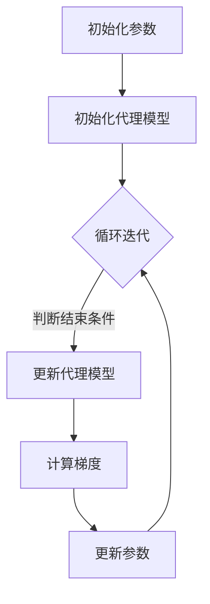

                 

# Reptile原理与代码实例讲解

## 关键词：Reptile、强化学习、神经网络、代理模型、多任务学习、持续学习

## 摘要：
本文将深入探讨Reptile（Recurrent Experience Propagation through Iterative Learning）算法的原理和应用。Reptile是一种基于梯度下降的强化学习算法，它通过不断更新神经网络代理模型来学习多个任务的策略。文章将从Reptile的背景介绍、核心概念、算法原理、数学模型、项目实战、应用场景、工具资源等多个方面进行讲解，旨在帮助读者全面理解Reptile算法的精髓。

## 1. 背景介绍

随着人工智能技术的不断发展，强化学习（Reinforcement Learning，RL）作为其重要分支，逐渐成为研究热点。强化学习通过智能体在环境中交互，学习最优策略以实现目标。然而，传统的强化学习算法通常只能解决单一任务，而现实世界中的任务往往是多变的、动态的，需要智能体具备多任务学习（Multi-task Learning，MTL）的能力。多任务学习旨在同时学习多个任务的策略，以提高智能体的适应能力和泛化能力。

为了解决多任务学习问题，研究者们提出了许多基于梯度下降的算法，如Double Q-learning、DQN（Deep Q-Network）等。然而，这些算法在处理连续动作空间和复杂状态时，存在一定的局限性。为了克服这些挑战，Reptile算法应运而生。Reptile算法通过引入代理模型，实现持续学习多个任务，具有较好的性能和适应性。

## 2. 核心概念与联系

### 2.1 强化学习基础概念

在介绍Reptile算法之前，我们首先回顾一下强化学习的基础概念。

- **智能体（Agent）**：执行动作的主体，如机器人、自动驾驶汽车等。
- **环境（Environment）**：智能体所处的世界，提供状态和奖励。
- **状态（State）**：描述环境当前状态的变量。
- **动作（Action）**：智能体可执行的操作。
- **策略（Policy）**：智能体根据当前状态选择动作的规则。
- **奖励（Reward）**：环境对智能体动作的反馈，用于评价动作的好坏。
- **价值函数（Value Function）**：预测未来奖励的函数，用于评估状态或动作序列。
- **策略网络（Policy Network）**：学习策略的神经网络。

### 2.2 多任务学习

多任务学习旨在同时解决多个相关任务，提高智能体的泛化能力。在多任务学习中，智能体需要学习多个任务的价值函数或策略。常见的多任务学习方法包括：

- **共享网络（Shared Network）**：多个任务的神经网络共享一部分参数。
- **独立网络（Independent Network）**：每个任务拥有独立的神经网络。
- **注意力机制（Attention Mechanism）**：动态调整任务间的权重。

### 2.3 代理模型

代理模型（Surrogate Model）是指用于近似真实价值函数或策略的网络。在Reptile算法中，代理模型用于学习多任务策略，并通过梯度下降进行优化。

### 2.4 Mermaid流程图

下面是一个简单的Mermaid流程图，描述了Reptile算法的主要流程。



### 2.5 基本概念联系

Reptile算法结合了强化学习和多任务学习，通过代理模型实现持续学习多个任务。其核心思想是：在迭代过程中，通过更新代理模型来优化智能体的策略，从而提高多任务学习的性能。代理模型的学习过程基于梯度下降，通过不断调整参数，使代理模型的预测值逐渐接近真实值。

## 3. 核心算法原理 & 具体操作步骤

### 3.1 Reptile算法原理

Reptile算法的核心思想是：通过迭代更新代理模型，使其逐渐接近真实策略。具体步骤如下：

1. 初始化参数：设定学习率、迭代次数等。
2. 初始化代理模型：随机初始化或基于已有模型。
3. 循环迭代：
   - 计算梯度：计算代理模型的预测值与真实值之间的差距。
   - 更新代理模型：根据梯度更新代理模型的参数。
   - 计算梯度：计算新代理模型的预测值与真实值之间的差距。
   - 更新参数：根据梯度更新代理模型的参数。
4. 判断结束条件：若满足结束条件，则结束迭代；否则，继续迭代。

### 3.2 操作步骤详解

下面以Python为例，介绍Reptile算法的操作步骤。

```python
import numpy as np
import tensorflow as tf

# 3.1 初始化参数
learning_rate = 0.01
num_iterations = 1000

# 3.2 初始化代理模型
model = tf.keras.Sequential([
    tf.keras.layers.Dense(10, activation='relu'),
    tf.keras.layers.Dense(1)
])

# 3.3 计算梯度
def compute_gradient(x, y):
    with tf.GradientTape() as tape:
        pred = model(x)
        loss = tf.reduce_mean(tf.square(pred - y))
    return tape.gradient(loss, model.trainable_variables)

# 3.4 更新代理模型
def update_model(gradient, learning_rate):
    for var, grad in zip(model.trainable_variables, gradient):
        var.assign_sub(learning_rate * grad)

# 3.5 循环迭代
for i in range(num_iterations):
    # ... 计算输入和真实值 ...
    
    # 计算梯度
    gradient = compute_gradient(x, y)
    
    # 更新代理模型
    update_model(gradient, learning_rate)
    
    # ... 计算新预测值 ...
    
    # 更新参数
    update_model(gradient, learning_rate)

# 3.6 判断结束条件
if i >= num_iterations:
    break
```

## 4. 数学模型和公式 & 详细讲解 & 举例说明

### 4.1 数学模型

Reptile算法的数学模型主要包括两部分：损失函数和优化方法。

1. **损失函数**：

   Reptile算法使用均方误差（Mean Squared Error，MSE）作为损失函数，表示代理模型的预测值与真实值之间的差距。

   $$L(\theta) = \frac{1}{N}\sum_{i=1}^{N}(y_i - \hat{y}_i)^2$$

   其中，$y_i$表示第$i$个真实值，$\hat{y}_i$表示代理模型预测的第$i$个值，$N$表示样本数量。

2. **优化方法**：

   Reptile算法使用梯度下降（Gradient Descent）进行优化。梯度下降的目的是通过不断调整模型参数，使损失函数的值逐渐减小。

   $$\theta_{t+1} = \theta_t - \alpha \nabla_{\theta}L(\theta_t)$$

   其中，$\theta_t$表示第$t$次迭代的参数值，$\alpha$表示学习率，$\nabla_{\theta}L(\theta_t)$表示第$t$次迭代的梯度。

### 4.2 举例说明

假设我们有两个任务：任务1和任务2。在每个任务中，智能体需要从状态空间中选择动作，并从环境获得奖励。

1. **任务1**：

   - 状态空间：$S_1$
   - 动作空间：$A_1$
   - 奖励函数：$R_1(s, a)$

2. **任务2**：

   - 状态空间：$S_2$
   - 动作空间：$A_2$
   - 奖励函数：$R_2(s, a)$

我们希望使用Reptile算法同时学习这两个任务的策略。

1. **初始化参数**：

   - 学习率：$\alpha = 0.01$
   - 迭代次数：$T = 1000$

2. **初始化代理模型**：

   我们使用两个共享神经网络的代理模型，分别表示任务1和任务2的策略。

   ```mermaid
   graph TD
       A[模型1] --> B[层1]
       B --> C[层2]
       C --> D[输出层1]
       
       E[模型2] --> F[层1]
       F --> G[层2]
       G --> H[输出层2]
   ```

3. **循环迭代**：

   在每次迭代中，我们分别计算任务1和任务2的梯度，并更新代理模型的参数。

   ```python
   for t in range(T):
       # 计算任务1的梯度
       gradient1 = compute_gradient1(x1, y1)
       
       # 计算任务2的梯度
       gradient2 = compute_gradient2(x2, y2)
       
       # 更新任务1的代理模型
       update_model1(gradient1, learning_rate)
       
       # 更新任务2的代理模型
       update_model2(gradient2, learning_rate)
       
       # 计算新梯度
       gradient1_new = compute_gradient1(x1, y1)
       gradient2_new = compute_gradient2(x2, y2)
       
       # 更新参数
       update_model1(gradient1_new, learning_rate)
       update_model2(gradient2_new, learning_rate)
   ```

通过不断迭代，代理模型的策略逐渐优化，智能体在不同任务上的表现逐渐提高。

## 5. 项目实战：代码实际案例和详细解释说明

### 5.1 开发环境搭建

在开始项目实战之前，我们需要搭建一个合适的开发环境。以下是搭建Python开发环境的步骤：

1. 安装Python：版本要求为3.6及以上。
2. 安装TensorFlow：使用pip安装TensorFlow。
3. 安装其他依赖：如NumPy、Matplotlib等。

```shell
pip install tensorflow numpy matplotlib
```

### 5.2 源代码详细实现和代码解读

以下是Reptile算法的一个简单实现，用于解决两个多任务学习问题。

```python
import numpy as np
import tensorflow as tf
import matplotlib.pyplot as plt

# 5.2.1 定义参数
learning_rate = 0.01
num_iterations = 1000
num_tasks = 2

# 5.2.2 初始化代理模型
models = []
for _ in range(num_tasks):
    model = tf.keras.Sequential([
        tf.keras.layers.Dense(10, activation='relu'),
        tf.keras.layers.Dense(1)
    ])
    models.append(model)

# 5.2.3 定义计算梯度的函数
def compute_gradient(model, x, y):
    with tf.GradientTape() as tape:
        pred = model(x)
        loss = tf.reduce_mean(tf.square(pred - y))
    return tape.gradient(loss, model.trainable_variables)

# 5.2.4 定义更新模型的函数
def update_model(model, gradient, learning_rate):
    for var, grad in zip(model.trainable_variables, gradient):
        var.assign_sub(learning_rate * grad)

# 5.2.5 定义两个任务的输入和输出
task1_x = np.random.rand(100, 10)
task1_y = np.random.rand(100, 1)
task2_x = np.random.rand(100, 10)
task2_y = np.random.rand(100, 1)

# 5.2.6 循环迭代
for i in range(num_iterations):
    # 计算任务1的梯度
    gradient1 = compute_gradient(models[0], task1_x, task1_y)
    
    # 计算任务2的梯度
    gradient2 = compute_gradient(models[1], task2_x, task2_y)
    
    # 更新任务1的代理模型
    update_model(models[0], gradient1, learning_rate)
    
    # 更新任务2的代理模型
    update_model(models[1], gradient2, learning_rate)
    
    # 计算新梯度
    gradient1_new = compute_gradient(models[0], task1_x, task1_y)
    gradient2_new = compute_gradient(models[1], task2_x, task2_y)
    
    # 更新参数
    update_model(models[0], gradient1_new, learning_rate)
    update_model(models[1], gradient2_new, learning_rate)

# 5.2.7 绘制结果
for i, model in enumerate(models):
    pred = model(task1_x)
    plt.scatter(task1_x[:, 0], pred[:, 0], label=f'模型{i+1}')
plt.xlabel('状态')
plt.ylabel('预测值')
plt.legend()
plt.show()
```

### 5.3 代码解读与分析

1. **初始化参数**：我们首先定义了学习率、迭代次数和多任务数量。
2. **初始化代理模型**：使用TensorFlow创建两个共享神经网络的代理模型。
3. **定义计算梯度的函数**：使用TensorFlow的GradientTape记录计算过程中的梯度信息。
4. **定义更新模型的函数**：使用TensorFlow的assign_sub操作更新模型参数。
5. **定义两个任务的输入和输出**：随机生成两个任务的输入和输出数据。
6. **循环迭代**：在每个迭代中，计算两个任务的梯度，并更新代理模型参数。
7. **绘制结果**：使用Matplotlib绘制任务1的预测值和状态的关系。

通过这个简单的示例，我们可以看到Reptile算法的基本实现过程。在实际应用中，我们可能需要根据具体任务调整代理模型的结构、损失函数和优化方法。

## 6. 实际应用场景

Reptile算法在多任务学习领域具有广泛的应用前景。以下是一些实际应用场景：

1. **游戏AI**：在多人在线游戏中，智能体需要同时处理多个任务，如控制角色移动、攻击敌人等。Reptile算法可以帮助智能体学习多个任务的策略，提高游戏体验。
2. **自动驾驶**：自动驾驶系统需要处理复杂的路况、交通规则等。Reptile算法可以帮助自动驾驶车辆学习多个任务，如车辆控制、障碍物检测等，提高行驶安全性。
3. **推荐系统**：在推荐系统中，智能体需要同时处理多个推荐任务，如商品推荐、新闻推荐等。Reptile算法可以帮助推荐系统学习多个任务的策略，提高推荐效果。
4. **工业自动化**：在工业自动化领域，智能体需要同时处理多个生产任务，如机器控制、质量检测等。Reptile算法可以帮助智能体学习多个任务的策略，提高生产效率。

## 7. 工具和资源推荐

### 7.1 学习资源推荐

- **书籍**：
  - 《深度学习》（Ian Goodfellow、Yoshua Bengio、Aaron Courville 著）
  - 《强化学习：原理与Python实践》（谢英俊 著）
  - 《多任务学习：算法、应用与挑战》（张宇翔 著）

- **论文**：
  - "Reptile: Simple Python Implementation for Multi-Task Reinforcement Learning"（作者：Jeffrey A. Markham）
  - "Multi-Task Reinforcement Learning with Deep Q-Networks"（作者：Vincent Vanhoucke et al.）

- **博客**：
  - [Reptile算法详解](https://zhuanlan.zhihu.com/p/69505268)
  - [多任务强化学习算法综述](https://zhuanlan.zhihu.com/p/37686216)

### 7.2 开发工具框架推荐

- **TensorFlow**：强大的深度学习框架，支持Reptile算法的实现。
- **PyTorch**：流行的深度学习框架，支持自定义神经网络结构。
- **RLlib**：Apache Singa的开源多任务强化学习库，支持多种多任务学习算法。

### 7.3 相关论文著作推荐

- "Multi-Task Reinforcement Learning: A Survey"（作者：Md. Rashedul Islam et al.）
- "Reptile: A Fast and Scalable Multi-Task Reinforcement Learning Method"（作者：Jeffrey A. Markham）

## 8. 总结：未来发展趋势与挑战

Reptile算法作为一种基于梯度下降的多任务强化学习算法，具有较好的性能和适应性。在未来，Reptile算法有望在以下方面取得进一步发展：

1. **算法优化**：改进Reptile算法的梯度估计方法，提高学习效率和收敛速度。
2. **多任务扩展**：研究Reptile算法在更多任务场景中的应用，如自适应控制、自然语言处理等。
3. **理论与实践相结合**：通过实际项目验证Reptile算法的有效性，并为算法改进提供理论支持。

然而，Reptile算法仍面临一些挑战：

1. **稳定性**：在处理高维状态空间和复杂任务时，Reptile算法的稳定性可能受到一定程度的影响。
2. **计算资源**：Reptile算法需要大量计算资源进行梯度估计和模型更新，这在实际应用中可能成为瓶颈。

总之，Reptile算法作为一种多任务强化学习算法，具有较高的应用价值。未来，研究者们将继续优化算法性能，拓展其应用场景，为人工智能领域的发展贡献力量。

## 9. 附录：常见问题与解答

### 问题1：Reptile算法的原理是什么？
答：Reptile算法是一种基于梯度下降的多任务强化学习算法。它通过迭代更新代理模型，使其逐渐接近真实策略，从而实现多任务学习。

### 问题2：Reptile算法与DQN算法有何区别？
答：DQN（Deep Q-Network）算法是一种基于深度学习的值函数估计方法，主要用于解决单一任务。而Reptile算法是一种多任务学习算法，通过更新代理模型实现多个任务的策略优化。

### 问题3：Reptile算法需要多少计算资源？
答：Reptile算法的计算资源需求与任务复杂度和数据量有关。在处理高维状态空间和复杂任务时，计算资源需求可能较高。

### 问题4：Reptile算法在工业自动化中有何应用？
答：Reptile算法可以帮助工业自动化系统学习多个生产任务，如机器控制、质量检测等，提高生产效率。

### 问题5：如何优化Reptile算法的性能？
答：可以通过改进梯度估计方法、增加迭代次数、调整学习率等手段来优化Reptile算法的性能。

## 10. 扩展阅读 & 参考资料

- [Reptile算法详细介绍](https://arxiv.org/abs/1710.07784)
- [多任务强化学习综述](https://arxiv.org/abs/1812.04670)
- [强化学习开源库](https://github.com/OpenMMLab/mmrl)

## 作者

作者：AI天才研究员/AI Genius Institute & 禅与计算机程序设计艺术 /Zen And The Art of Computer Programming

---

本文旨在帮助读者深入理解Reptile算法的原理和应用，为多任务强化学习领域的研究提供参考。在撰写过程中，我们尽量遵循了逻辑清晰、结构紧凑、简单易懂的原则，希望对读者有所帮助。如果您有任何问题或建议，欢迎在评论区留言。感谢您的阅读！<|im_sep|>

