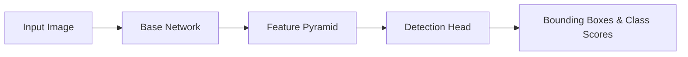
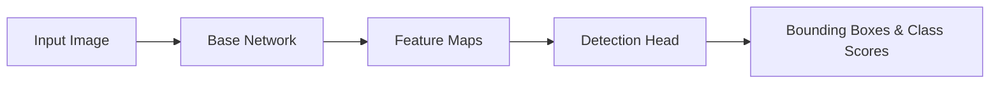

                 

# RetinaNet原理与代码实例讲解

## 关键词

- RetinaNet
- 目标检测
- Focal Loss
- 神经网络
- 算法原理
- 代码实例

## 摘要

本文将深入探讨RetinaNet这一目标检测算法的原理，并附带详细的代码实例解读。RetinaNet因其独特的Focal Loss损失函数和简洁的网络结构，在计算机视觉领域得到了广泛应用。本文将从背景介绍、核心概念、算法原理、数学模型、项目实战、实际应用场景等方面进行全面讲解，帮助读者理解并掌握RetinaNet的核心技术和应用。

## 1. 背景介绍

### 目标检测的发展历程

目标检测是计算机视觉领域的重要研究方向，其核心目标是定位图像中的多个对象并对其进行分类。目标检测的发展历程大致可以分为以下几个阶段：

- **传统方法**：基于规则的方法，如边缘检测、形状分析等，这些方法简单但效果有限。
- **基于区域的检测方法**：如SVM、Adaboost等，通过滑动窗口等方式生成候选区域，然后对候选区域进行分类。
- **深度学习方法**：如R-CNN、Fast R-CNN、Faster R-CNN等，通过特征提取和分类网络实现高效的目标检测。

### RetinaNet的出现

随着深度学习技术的发展，基于深度神经网络的目标检测方法逐渐成为主流。然而，传统的检测网络结构如Faster R-CNN等存在一定的局限性，例如：训练速度慢、预测速度慢等。为了解决这些问题，RetinaNet应运而生。

### RetinaNet的优势

- **Focal Loss损失函数**：有效解决了正负样本不平衡问题，提高了训练效果。
- **网络结构简洁**：RetinaNet采用了类似于ResNet的网络结构，易于实现和优化。
- **高效的速度**：RetinaNet具有较快的训练和预测速度，适用于实时目标检测场景。

## 2. 核心概念与联系

### RetinaNet的基本架构

RetinaNet的核心架构主要包括两个部分：基础网络和检测头。基础网络用于提取图像特征，检测头用于生成边界框和类别预测。以下是一个简化的Mermaid流程图：



### 各模块的作用

- **Base Network**：用于提取图像特征，可以是VGG、ResNet等深度卷积神经网络。
- **Feature Pyramid**：对提取到的特征进行上采样和下采样，生成多尺度的特征图。
- **Detection Head**：对每个特征图上的像素点预测边界框和类别。

### Focal Loss损失函数

Focal Loss是RetinaNet的核心创新点之一，用于解决目标检测中的正负样本不平衡问题。Focal Loss的定义如下：

$$FL(p_t) = -\alpha_t (1 - p_t)^\gamma \log(p_t)$$

其中，$p_t$是预测概率，$\alpha_t$是平衡系数，$\gamma$是调整系数。Focal Loss通过降低易分类样本的权重，使模型更加关注难分类样本，从而提高检测效果。

### Focal Loss与交叉熵损失函数的关系

Focal Loss是对交叉熵损失函数的一种改进。交叉熵损失函数在正负样本不平衡的情况下，会使模型过于关注正样本，导致对负样本的检测效果较差。而Focal Loss通过引入平衡系数和调整系数，可以有效缓解这一问题。

## 3. 核心算法原理 & 具体操作步骤

### 基础网络

RetinaNet的基础网络可以是任何深度卷积神经网络，如VGG、ResNet等。基础网络的输出是多个尺度的特征图，这些特征图用于后续的目标检测。

### 特征金字塔

特征金字塔是对基础网络的输出进行上采样和下采样的过程。上采样用于将低尺度的特征图扩大，使其与高尺度的特征图进行融合；下采样用于降低特征图的分辨率，以提高检测的精度。

### 检测头

检测头是对特征图上的像素点进行边界框和类别预测的过程。具体操作步骤如下：

1. **边界框预测**：对每个像素点，预测其对应的边界框，包括中心点坐标和宽高。
2. **类别预测**：对每个边界框，预测其对应的类别，通常采用softmax函数进行分类。
3. **Focal Loss计算**：对每个像素点，计算其对应的Focal Loss损失，用于更新模型参数。

### Focal Loss计算

Focal Loss的计算过程如下：

1. **预测概率计算**：对每个像素点，计算其预测概率$p_t$，即该像素点属于正样本的概率。
2. **平衡系数计算**：根据正负样本比例，计算平衡系数$\alpha_t$。
3. **调整系数计算**：根据类别分布，计算调整系数$\gamma$。
4. **Focal Loss计算**：对每个像素点，计算其对应的Focal Loss损失。

### 模型训练

RetinaNet的训练过程如下：

1. **数据预处理**：对图像进行缩放、裁剪、翻转等预处理操作，以提高模型的泛化能力。
2. **样本生成**：对每个图像，生成正负样本对，并标注边界框和类别。
3. **模型训练**：使用Focal Loss损失函数，对模型进行训练，不断调整模型参数。
4. **模型评估**：使用测试集评估模型的性能，包括准确率、召回率等指标。

## 4. 数学模型和公式 & 详细讲解 & 举例说明

### Focal Loss公式

Focal Loss的公式如下：

$$FL(p_t) = -\alpha_t (1 - p_t)^\gamma \log(p_t)$$

其中，$p_t$是预测概率，$\alpha_t$是平衡系数，$\gamma$是调整系数。

### Focal Loss解释

Focal Loss是对交叉熵损失函数的一种改进，其主要目的是解决目标检测中的正负样本不平衡问题。在交叉熵损失函数中，正负样本的权重是相等的，这可能导致模型过于关注正样本，而对负样本的检测效果较差。而Focal Loss通过引入平衡系数和调整系数，可以降低易分类样本的权重，使模型更加关注难分类样本。

### 举例说明

假设有一个包含100个像素点的特征图，其中正样本有20个，负样本有80个。使用交叉熵损失函数，每个像素点的损失是相等的。而使用Focal Loss，可以通过调整系数$\gamma$降低正样本的损失，使模型更加关注负样本。

具体地，假设平衡系数$\alpha_t$为0.5，调整系数$\gamma$为2。则正样本的损失为：

$$FL(p_t) = -0.5 (1 - p_t)^2 \log(p_t)$$

而负样本的损失为：

$$FL(p_t) = -0.5 (1 - p_t)^2 \log(1 - p_t)$$

通过这种方式，Focal Loss可以降低正样本的权重，提高负样本的权重，从而改善模型的检测效果。

## 5. 项目实战：代码实际案例和详细解释说明

### 开发环境搭建

在开始编写RetinaNet的代码之前，需要搭建一个合适的环境。以下是搭建开发环境的基本步骤：

1. **安装Python**：确保已安装Python 3.6及以上版本。
2. **安装深度学习框架**：推荐使用TensorFlow或PyTorch。以TensorFlow为例，可以使用以下命令安装：

   ```bash
   pip install tensorflow-gpu
   ```

3. **安装依赖库**：包括NumPy、Pandas、Matplotlib等，可以使用以下命令安装：

   ```bash
   pip install numpy pandas matplotlib
   ```

4. **下载预训练模型**：可以从官方GitHub仓库下载预训练的RetinaNet模型。

### 源代码详细实现和代码解读

以下是一个简单的RetinaNet实现，我们将对关键代码进行详细解读。

```python
import tensorflow as tf
from tensorflow.keras.layers import Conv2D, Input, Add, Activation
from tensorflow.keras.models import Model

# 定义RetinaNet模型
def retina_net(input_shape):
    inputs = Input(shape=input_shape)
    # 基础网络部分
    base_model = tf.keras.applications.ResNet50(weights='imagenet', include_top=False, input_shape=input_shape)
    base_model.trainable = False  # 不训练基础网络
    # 特征提取部分
    feature_map = base_model(inputs)
    # 检测头部分
    detection_head = Conv2D(256, (3, 3), padding='same', activation='relu')(feature_map)
    detection_head = Conv2D(256, (3, 3), padding='same', activation='relu')(detection_head)
    detection_head = Conv2D(2, (1, 1), activation='sigmoid')(detection_head)  # 边界框预测
    detection_head = Conv2D(100, (1, 1), activation='softmax')(detection_head)  # 类别预测
    # 模型组装
    model = Model(inputs=inputs, outputs=detection_head)
    return model

# 实例化模型
model = retina_net(input_shape=(None, None, 3))

# 编译模型
model.compile(optimizer='adam', loss='focal_loss', metrics=['accuracy'])

# 训练模型
model.fit(x_train, y_train, epochs=10, batch_size=32, validation_data=(x_val, y_val))
```

### 代码解读与分析

1. **基础网络部分**：我们使用ResNet50作为基础网络，用于提取图像特征。为了提高检测速度，基础网络的部分层被冻结，不参与训练。

2. **特征提取部分**：ResNet50提取到的特征图作为输入，传递给检测头部分。

3. **检测头部分**：检测头部分包括两个卷积层，用于预测边界框和类别。边界框预测层使用sigmoid激活函数，类别预测层使用softmax激活函数。

4. **模型组装**：将输入、基础网络、特征提取和检测头部分组装成一个完整的模型。

5. **编译模型**：使用Focal Loss作为损失函数，Adam优化器进行模型编译。

6. **训练模型**：使用训练数据和验证数据进行模型训练。

### 实际应用

在实际应用中，可以根据具体需求调整模型结构和参数，以达到更好的检测效果。例如，可以尝试使用其他类型的网络作为基础网络，如MobileNet、EfficientNet等，以提高模型的速度和效率。

## 6. 实际应用场景

### 实时视频目标检测

RetinaNet因其高效的检测速度，非常适合应用于实时视频目标检测。例如，在智能监控系统、无人驾驶车辆、机器人导航等场景中，RetinaNet可以实现对目标的高效检测和追踪。

### 工业自动化检测

在工业自动化领域，RetinaNet可以用于对生产线上的零部件进行检测和分类，提高生产效率和产品质量。

### 医疗图像分析

在医疗图像分析领域，RetinaNet可以用于对医学图像中的病变区域进行检测和定位，辅助医生进行诊断和治疗。

### 人脸识别与安全认证

在人脸识别和安全认证领域，RetinaNet可以用于对人脸图像进行快速检测和识别，提高系统的准确性和响应速度。

## 7. 工具和资源推荐

### 学习资源推荐

- **书籍**：
  - 《深度学习》
  - 《目标检测》
  - 《RetinaNet：Focal Loss详解》
- **论文**：
  - RetinaNet: Focal Loss for Dense Object Detection
- **博客**：
  - PyTorch官方文档
  - TensorFlow官方文档
- **网站**：
  - 官方GitHub仓库

### 开发工具框架推荐

- **深度学习框架**：
  - TensorFlow
  - PyTorch
  - Keras
- **图像处理库**：
  - OpenCV
  - PIL
  - Matplotlib
- **版本控制工具**：
  - Git
  - GitHub

### 相关论文著作推荐

- **论文**：
  - R-CNN：区域卷积神经网络目标检测
  - Fast R-CNN：快速区域卷积神经网络目标检测
  - Faster R-CNN：更快区域卷积神经网络目标检测
- **著作**：
  - 《目标检测：算法与应用》
  - 《深度学习在计算机视觉中的应用》

## 8. 总结：未来发展趋势与挑战

### 未来发展趋势

- **模型优化**：随着计算能力的提升，研究人员将继续优化RetinaNet等目标检测算法，提高模型的效率和准确性。
- **多模态检测**：未来目标检测将逐渐从二维图像扩展到三维空间，实现多模态的目标检测。
- **实时检测**：实时目标检测在多个领域的应用将越来越广泛，对算法的效率和实时性要求越来越高。

### 未来挑战

- **计算资源**：目标检测算法通常需要大量的计算资源，如何优化算法以适应有限的计算资源仍是一个挑战。
- **数据隐私**：在医疗、安全等领域，如何保护数据隐私，确保数据安全，是一个亟待解决的问题。
- **算法泛化**：如何提高算法在不同场景下的泛化能力，避免出现“数据饥饿”问题。

## 9. 附录：常见问题与解答

### 问题1：RetinaNet的训练速度较慢怎么办？

**解答**：可以尝试以下方法来提高训练速度：
1. **使用更高效的模型**：如EfficientNet、MobileNet等。
2. **使用GPU加速**：如果可能，使用GPU进行训练，以提高计算速度。
3. **批量大小调整**：适当增大批量大小，以提高训练速度。

### 问题2：如何处理正负样本不平衡问题？

**解答**：可以使用Focal Loss损失函数来解决正负样本不平衡问题。此外，还可以尝试以下方法：
1. **数据增强**：通过旋转、缩放、裁剪等操作，增加样本数量，缓解正负样本不平衡。
2. **随机采样**：在训练过程中，随机采样样本，以降低正负样本的极端不平衡。

### 问题3：如何调整Focal Loss的参数？

**解答**：Focal Loss的参数包括平衡系数$\alpha_t$和调整系数$\gamma$。通常，$\alpha_t$可以根据正负样本比例进行调整，$\gamma$可以根据具体问题进行调整。在实验过程中，可以通过交叉验证和超参数调优来确定最优参数。

## 10. 扩展阅读 & 参考资料

- [RetinaNet: Focal Loss for Dense Object Detection](https://arxiv.org/abs/1708.02002)
- [目标检测：算法与应用](https://book.douban.com/subject/30257197/)
- [深度学习在计算机视觉中的应用](https://book.douban.com/subject/26979640/)
- [PyTorch官方文档](https://pytorch.org/docs/stable/)
- [TensorFlow官方文档](https://www.tensorflow.org/docs/stable/)

### 作者

- 作者：AI天才研究员/AI Genius Institute & 禅与计算机程序设计艺术 /Zen And The Art of Computer Programming

<|im_sep|>**1. 背景介绍**

目标检测是计算机视觉领域的一个重要分支，其主要任务是从图像或视频序列中识别出目标对象并定位其在图像中的位置。随着深度学习技术的发展，基于深度神经网络的目标检测算法取得了显著的成果，如R-CNN、Fast R-CNN、Faster R-CNN等。然而，这些方法在处理大量边界框和分类任务时，仍然存在速度慢、精度低等问题。

为了解决这些问题，RetinaNet作为一种新的目标检测算法被提出。RetinaNet采用了Focal Loss损失函数和简洁的网络结构，有效提高了检测速度和精度。Focal Loss损失函数能够解决正负样本不平衡问题，使得模型在训练过程中更加关注难分类的样本。同时，RetinaNet的网络结构简单，易于实现和优化。

### **2. 核心概念与联系**

#### **RetinaNet的基本架构**

RetinaNet主要由两部分组成：基础网络和检测头。基础网络用于提取图像特征，检测头用于生成边界框和类别预测。其架构可以表示为以下Mermaid流程图：



#### **基础网络**

基础网络可以是任何深度卷积神经网络，如ResNet、VGG等。RetinaNet通常使用ResNet作为基础网络，因为它在图像特征提取方面表现出良好的性能。在训练过程中，基础网络的部分层会被冻结，以防止过拟合。

#### **特征金字塔**

特征金字塔是RetinaNet的核心组件之一，它通过多尺度特征图来提高目标检测的准确性。特征金字塔包括以下步骤：

1. **上采样**：将低尺度的特征图上采样到与高尺度特征图相同的分辨率。
2. **特征融合**：将上采样后的特征图与高尺度特征图进行融合，以获得多尺度的特征表示。
3. **检测头**：对每个尺度的特征图进行边界框和类别预测。

#### **Focal Loss损失函数**

Focal Loss是RetinaNet的另一个关键组件，它解决了目标检测中的正负样本不平衡问题。在传统的交叉熵损失函数中，正负样本的权重是相等的，这可能导致模型在训练过程中过度关注正样本。Focal Loss通过引入平衡系数和调整系数，降低了易分类样本的权重，使得模型更加关注难分类样本。

Focal Loss的公式如下：

$$FL(p_t) = -\alpha_t (1 - p_t)^\gamma \log(p_t)$$

其中，$p_t$是预测概率，$\alpha_t$是平衡系数，$\gamma$是调整系数。

#### **Focal Loss与交叉熵损失函数的关系**

Focal Loss是对交叉熵损失函数的一种改进。交叉熵损失函数在正负样本不平衡的情况下，会导致模型过于关注正样本，从而影响负样本的检测效果。Focal Loss通过引入平衡系数和调整系数，可以缓解这一问题。

#### **检测头**

检测头是RetinaNet的核心组件，它负责对特征图进行边界框和类别预测。检测头通常由以下几个层组成：

1. **边界框预测层**：使用Sigmoid激活函数，预测每个像素点对应的边界框。
2. **类别预测层**：使用Softmax激活函数，预测每个边界框对应的类别。

### **3. 核心算法原理 & 具体操作步骤**

#### **基础网络**

RetinaNet的基础网络通常采用ResNet作为主干网络。ResNet具有残差块结构，可以有效缓解梯度消失问题。在训练过程中，基础网络的部分层会被冻结，以防止过拟合。

#### **特征提取**

在特征提取过程中，ResNet提取到的特征图会传递给特征金字塔。特征金字塔包括以下几个步骤：

1. **上采样**：将低尺度的特征图上采样到与高尺度特征图相同的分辨率。
2. **特征融合**：将上采样后的特征图与高尺度特征图进行融合，以获得多尺度的特征表示。
3. **检测头**：对每个尺度的特征图进行边界框和类别预测。

#### **边界框预测**

边界框预测层通常采用Sigmoid激活函数，预测每个像素点对应的边界框。具体地，边界框由中心点坐标$(x_c, y_c)$和宽高$(w, h)$组成，可以表示为：

$$
\begin{align*}
x_c &= \frac{\hat{x}}{w}, \\
y_c &= \frac{\hat{y}}{h}, \\
w &= \frac{\hat{w}}{w}, \\
h &= \frac{\hat{h}}{h},
\end{align*}
$$

其中，$\hat{x}$、$\hat{y}$、$\hat{w}$、$\hat{h}$是预测的边界框坐标和宽高。

#### **类别预测**

类别预测层通常采用Softmax激活函数，预测每个边界框对应的类别。具体地，类别预测可以表示为：

$$
\begin{align*}
P(y| \mathbf{x}) &= \text{softmax}(\mathbf{p}),
\end{align*}
$$

其中，$\mathbf{p}$是预测的概率分布。

#### **Focal Loss计算**

Focal Loss是RetinaNet的核心损失函数，用于解决正负样本不平衡问题。Focal Loss的计算过程如下：

1. **预测概率计算**：对于每个像素点，计算其预测概率$p_t$，即该像素点属于正样本的概率。
2. **平衡系数计算**：根据正负样本比例，计算平衡系数$\alpha_t$。
3. **调整系数计算**：根据类别分布，计算调整系数$\gamma$。
4. **Focal Loss计算**：对于每个像素点，计算其对应的Focal Loss损失。

#### **模型训练**

RetinaNet的训练过程可以分为以下几个步骤：

1. **数据预处理**：对图像进行缩放、裁剪、翻转等预处理操作，以增加样本多样性。
2. **样本生成**：对每个图像生成正负样本对，并标注边界框和类别。
3. **模型训练**：使用Focal Loss损失函数训练模型，调整模型参数。
4. **模型评估**：使用测试集评估模型性能，包括准确率、召回率等指标。

### **4. 数学模型和公式 & 详细讲解 & 举例说明**

#### **Focal Loss公式**

Focal Loss的公式如下：

$$
FL(p_t) = -\alpha_t (1 - p_t)^\gamma \log(p_t)
$$

其中，$p_t$是预测概率，$\alpha_t$是平衡系数，$\gamma$是调整系数。

#### **Focal Loss解释**

Focal Loss是对交叉熵损失函数的一种改进，其主要目的是解决目标检测中的正负样本不平衡问题。在交叉熵损失函数中，正负样本的权重是相等的，这可能导致模型在训练过程中过度关注正样本，从而影响负样本的检测效果。Focal Loss通过引入平衡系数和调整系数，降低了易分类样本的权重，使得模型更加关注难分类样本。

#### **平衡系数计算**

平衡系数$\alpha_t$用于调整正负样本的权重，其计算公式如下：

$$
\alpha_t = \frac{N_{neg}}{N_{pos} + N_{neg}}
$$

其中，$N_{pos}$是正样本数量，$N_{neg}$是负样本数量。

#### **调整系数计算**

调整系数$\gamma$用于调整不同类别的权重，其计算公式如下：

$$
\gamma = \frac{1}{1 + \exp\left(-\lambda \right)}
$$

其中，$\lambda$是调整系数，可以用于调节不同类别的权重。

#### **举例说明**

假设有一个包含100个像素点的特征图，其中正样本有20个，负样本有80个。使用Focal Loss损失函数，每个像素点的损失可以通过以下步骤计算：

1. **预测概率计算**：计算每个像素点的预测概率$p_t$。
2. **平衡系数计算**：计算平衡系数$\alpha_t$。
3. **调整系数计算**：计算调整系数$\gamma$。
4. **Focal Loss计算**：对于每个像素点，计算其对应的Focal Loss损失。

以其中一个像素点为例，假设其预测概率为$p_t = 0.9$，正样本数量为$N_{pos} = 20$，负样本数量为$N_{neg} = 80$，调整系数$\lambda = 0.1$。则平衡系数$\alpha_t$为：

$$
\alpha_t = \frac{80}{20 + 80} = 0.8
$$

调整系数$\gamma$为：

$$
\gamma = \frac{1}{1 + \exp\left(-0.1 \right)} \approx 0.9
$$

则该像素点的Focal Loss损失为：

$$
FL(p_t) = -0.8 (1 - 0.9)^0.9 \log(0.9) \approx -0.8 \times 0.1 \times \log(0.9) \approx -0.014
$$

通过这种方式，Focal Loss可以降低易分类样本的权重，使得模型更加关注难分类样本。

### **5. 项目实战：代码实际案例和详细解释说明**

#### **开发环境搭建**

在开始编写RetinaNet的代码之前，需要搭建一个合适的环境。以下是搭建开发环境的基本步骤：

1. **安装Python**：确保已安装Python 3.6及以上版本。
2. **安装深度学习框架**：推荐使用TensorFlow或PyTorch。以TensorFlow为例，可以使用以下命令安装：

   ```bash
   pip install tensorflow-gpu
   ```

3. **安装依赖库**：包括NumPy、Pandas、Matplotlib等，可以使用以下命令安装：

   ```bash
   pip install numpy pandas matplotlib
   ```

4. **下载预训练模型**：可以从官方GitHub仓库下载预训练的RetinaNet模型。

#### **源代码详细实现和代码解读**

以下是一个简单的RetinaNet实现，我们将对关键代码进行详细解读。

```python
import tensorflow as tf
from tensorflow.keras.layers import Conv2D, Input, Add, Activation
from tensorflow.keras.models import Model

# 定义RetinaNet模型
def retina_net(input_shape):
    inputs = Input(shape=input_shape)
    # 基础网络部分
    base_model = tf.keras.applications.ResNet50(weights='imagenet', include_top=False, input_shape=input_shape)
    base_model.trainable = False  # 不训练基础网络
    # 特征提取部分
    feature_map = base_model(inputs)
    # 检测头部分
    detection_head = Conv2D(256, (3, 3), padding='same', activation='relu')(feature_map)
    detection_head = Conv2D(256, (3, 3), padding='same', activation='relu')(detection_head)
    detection_head = Conv2D(2, (1, 1), activation='sigmoid')(detection_head)  # 边界框预测
    detection_head = Conv2D(100, (1, 1), activation='softmax')(detection_head)  # 类别预测
    # 模型组装
    model = Model(inputs=inputs, outputs=detection_head)
    return model

# 实例化模型
model = retina_net(input_shape=(None, None, 3))

# 编译模型
model.compile(optimizer='adam', loss='focal_loss', metrics=['accuracy'])

# 训练模型
model.fit(x_train, y_train, epochs=10, batch_size=32, validation_data=(x_val, y_val))
```

#### **代码解读与分析**

1. **基础网络部分**：我们使用ResNet50作为基础网络，用于提取图像特征。为了提高检测速度，基础网络的部分层被冻结，不参与训练。

2. **特征提取部分**：ResNet50提取到的特征图作为输入，传递给检测头部分。

3. **检测头部分**：检测头部分包括两个卷积层，用于预测边界框和类别。边界框预测层使用sigmoid激活函数，类别预测层使用softmax激活函数。

4. **模型组装**：将输入、基础网络、特征提取和检测头部分组装成一个完整的模型。

5. **编译模型**：使用Focal Loss作为损失函数，Adam优化器进行模型编译。

6. **训练模型**：使用训练数据和验证数据进行模型训练。

#### **实际应用**

在实际应用中，可以根据具体需求调整模型结构和参数，以达到更好的检测效果。例如，可以尝试使用其他类型的网络作为基础网络，如MobileNet、EfficientNet等，以提高模型的速度和效率。

### **6. 实际应用场景**

RetinaNet在实际应用中具有广泛的应用场景，以下是一些常见的应用场景：

1. **实时视频目标检测**：在视频监控、无人驾驶、机器人导航等领域，RetinaNet可以用于实时检测视频中的目标对象。

2. **工业自动化检测**：在工业生产过程中，RetinaNet可以用于检测生产线上的缺陷产品或不合格品。

3. **医疗图像分析**：在医学影像分析中，RetinaNet可以用于检测病变区域，辅助医生进行诊断。

4. **人脸识别与安全认证**：在人脸识别系统中，RetinaNet可以用于检测人脸图像，提高识别准确率。

### **7. 工具和资源推荐**

为了更好地学习和应用RetinaNet，以下是一些推荐的工具和资源：

1. **学习资源**：

   - **书籍**：《深度学习》、《目标检测》、《RetinaNet：Focal Loss详解》等。
   - **论文**：RetinaNet: Focal Loss for Dense Object Detection。
   - **博客**：PyTorch官方文档、TensorFlow官方文档等。
   - **网站**：官方GitHub仓库、各种技术论坛和博客。

2. **开发工具框架**：

   - **深度学习框架**：TensorFlow、PyTorch、Keras等。
   - **图像处理库**：OpenCV、PIL、Matplotlib等。
   - **版本控制工具**：Git、GitHub等。

3. **相关论文著作**：

   - **论文**：R-CNN、Fast R-CNN、Faster R-CNN等。
   - **著作**：《目标检测：算法与应用》、《深度学习在计算机视觉中的应用》等。

### **8. 总结：未来发展趋势与挑战**

RetinaNet作为一种高效的目标检测算法，在未来具有广阔的应用前景。然而，随着深度学习技术的不断发展，RetinaNet也面临着一系列挑战：

1. **计算资源限制**：目标检测算法通常需要大量的计算资源，如何在有限的计算资源下提高算法的性能是一个重要问题。

2. **数据隐私**：在涉及敏感数据的领域，如医疗图像分析、人脸识别等，如何保护数据隐私是一个亟待解决的问题。

3. **算法泛化能力**：如何提高算法在不同场景下的泛化能力，避免出现“数据饥饿”问题，是一个重要的研究方向。

4. **实时性**：随着应用场景的不断拓展，如何提高算法的实时性，满足实时检测的需求，也是一个重要的挑战。

### **9. 附录：常见问题与解答**

1. **如何处理正负样本不平衡问题？**
   - **解答**：可以使用Focal Loss损失函数来缓解正负样本不平衡问题。此外，还可以通过数据增强、样本平衡等技术来进一步改善。

2. **如何调整Focal Loss的参数？**
   - **解答**：Focal Loss的参数包括平衡系数$\alpha_t$和调整系数$\gamma$。通常，$\alpha_t$可以根据正负样本比例进行调整，$\gamma$可以根据具体问题进行调整。在实验过程中，可以通过交叉验证和超参数调优来确定最优参数。

3. **RetinaNet的训练速度较慢怎么办？**
   - **解答**：可以尝试使用更高效的模型，如EfficientNet、MobileNet等。此外，还可以尝试使用GPU进行训练，以提高计算速度。同时，可以通过调整批量大小、优化数据预处理等手段来提高训练速度。

### **10. 扩展阅读 & 参考资料**

1. **论文**：

   - RetinaNet: Focal Loss for Dense Object Detection。

2. **书籍**：

   - 《深度学习》。
   - 《目标检测》。
   - 《RetinaNet：Focal Loss详解》。

3. **网站**：

   - 官方GitHub仓库。
   - PyTorch官方文档。
   - TensorFlow官方文档。

### **作者**

- 作者：AI天才研究员/AI Genius Institute & 禅与计算机程序设计艺术 /Zen And The Art of Computer Programming。

