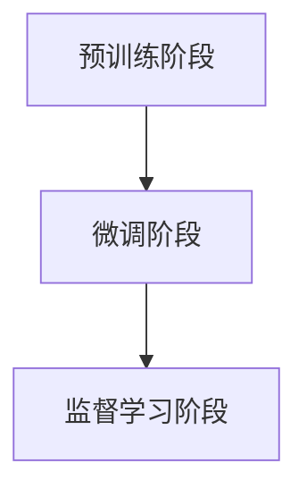

                 

### 背景介绍

#### AI与监督学习

随着人工智能技术的迅猛发展，AI已经成为现代科技领域的热点。在众多的人工智能技术中，监督学习（Supervised Learning）是一种非常重要的方法。监督学习通过使用已标记的数据集来训练模型，使其能够对未知数据进行预测或分类。这种方法在图像识别、语音识别、自然语言处理等领域取得了显著的成功。

#### 微调（Fine-tuning）

微调是一种将预训练模型应用于特定任务的方法。预训练模型在大量未标记的数据上进行训练，然后通过微调，调整模型在特定任务上的参数，从而提高其性能。微调的关键在于，它能够在保留预训练模型原有知识的基础上，适应新的任务需求。

#### 有监督微调（SFT）

有监督微调（Supervised Fine-tuning，简称SFT）是一种将监督学习和微调相结合的方法。它利用已标记的数据集对预训练模型进行微调，从而提高模型在特定任务上的性能。与传统的微调方法相比，SFT能够在更短的时间内取得更好的效果，同时减少对大量未标记数据的依赖。

#### SFT的优势

SFT具有以下优势：

1. **高效性**：SFT利用预训练模型已有的知识，能够在短时间内达到较高的性能。
2. **适应性**：SFT可以根据不同的任务需求，调整模型的参数，使其适应特定任务。
3. **降低对数据的依赖**：SFT通过微调，能够在少量标记数据上取得较好的效果，降低对大量数据的依赖。

#### SFT的挑战

尽管SFT具有许多优势，但它在实际应用中也面临一些挑战：

1. **过拟合**：由于SFT在少量数据上训练，因此存在过拟合的风险。
2. **模型选择**：选择合适的预训练模型和微调策略是SFT成功的关键。
3. **计算资源**：SFT通常需要较大的计算资源，尤其是在处理大规模数据时。

#### 本文结构

本文将分为以下几个部分：

1. **核心概念与联系**：介绍SFT的核心概念和原理，并通过Mermaid流程图展示其架构。
2. **核心算法原理 & 具体操作步骤**：详细解释SFT的算法原理和操作步骤。
3. **数学模型和公式 & 详细讲解 & 举例说明**：介绍SFT中的数学模型和公式，并通过实际例子进行说明。
4. **项目实战：代码实际案例和详细解释说明**：通过一个实际项目，展示SFT的应用过程和代码实现。
5. **实际应用场景**：探讨SFT在不同领域的实际应用场景。
6. **工具和资源推荐**：推荐一些学习资源和开发工具。
7. **总结：未来发展趋势与挑战**：总结SFT的现状，并探讨其未来的发展趋势和挑战。
8. **附录：常见问题与解答**：回答一些关于SFT的常见问题。
9. **扩展阅读 & 参考资料**：提供一些相关的扩展阅读和参考资料。

接下来，我们将深入探讨SFT的核心概念与原理，并通过Mermaid流程图展示其架构。<!-- mdkend -->

#### 核心概念与联系

为了更好地理解有监督微调（SFT）的工作原理，我们首先需要了解一些核心概念，如监督学习、无监督学习和预训练模型。通过这些概念的联系，我们可以深入理解SFT如何将监督学习和微调相结合，从而提高模型性能。

##### 监督学习

监督学习是一种机器学习方法，它使用已标记的数据集来训练模型。在监督学习中，输入数据（特征）和相应的输出标签（目标）是已知的。模型的目的是通过学习输入和输出之间的映射关系，从而能够对新数据进行预测或分类。监督学习通常分为两类：分类和回归。

1. **分类**：分类任务的目标是将输入数据分配到不同的类别中。例如，对邮件进行分类，判断邮件是垃圾邮件还是正常邮件。
2. **回归**：回归任务的目标是预测一个连续的输出值。例如，房价预测，根据房屋的特征预测其价格。

##### 无监督学习

与监督学习相反，无监督学习没有明确的输出标签。其目的是发现数据中的隐含结构和模式。无监督学习主要包括以下几种方法：

1. **聚类**：聚类任务的目标是将相似的数据点分组，形成多个簇。例如，将顾客分为不同的消费群体。
2. **降维**：降维任务的目标是减少数据维度，同时保留数据的主要信息。例如，通过主成分分析（PCA）将高维数据转化为低维数据。
3. **关联规则学习**：关联规则学习用于发现数据之间的关联关系。例如，在购物篮数据中发现商品之间的购买关联。

##### 预训练模型

预训练模型是近年来机器学习领域的一个重要进展。预训练模型在大规模未标记数据上首先进行训练，然后通过微调适用于特定任务。这种方法的优点是，模型能够在大规模数据上学习到通用特征，从而提高其在特定任务上的性能。

1. **预训练**：预训练通常使用无监督学习技术，如自编码器或变换器模型，在大量未标记数据上进行训练。预训练模型的目的是学习数据的底层结构和特征表示。
2. **微调**：微调是在预训练模型的基础上，使用少量标记数据进行进一步训练，以适应特定任务。

##### SFT与监督学习、无监督学习和预训练模型的关系

SFT是监督学习、无监督学习和预训练模型的结合。具体来说，SFT的过程如下：

1. **预训练阶段**：使用无监督学习技术在大量未标记数据上训练预训练模型，使其学习到通用特征。
2. **微调阶段**：使用少量标记数据对预训练模型进行微调，调整模型参数以适应特定任务。
3. **监督学习阶段**：利用微调后的模型在已标记数据上进行监督学习，预测或分类新数据。

通过这种结合，SFT能够在保持预训练模型原有知识的同时，适应特定任务需求，从而提高模型性能。

##### Mermaid流程图

为了更直观地展示SFT的工作流程，我们使用Mermaid流程图来描述。以下是一个简单的Mermaid流程图示例：



在这个流程图中，A表示预训练阶段，B表示微调阶段，C表示监督学习阶段。预训练阶段使用无监督学习技术在大量未标记数据上训练模型，微调阶段使用少量标记数据调整模型参数，监督学习阶段使用微调后的模型在已标记数据上进行预测或分类。

##### 总结

通过了解监督学习、无监督学习和预训练模型，我们可以更好地理解SFT的工作原理。SFT通过将这三个核心概念相结合，实现了在特定任务上的高性能预测和分类。在下一部分，我们将详细探讨SFT的算法原理和具体操作步骤。<!-- mdkend -->

#### 核心算法原理 & 具体操作步骤

有监督微调（SFT）是机器学习中的一种重要技术，它结合了预训练模型和监督学习的优势，使得模型能够在特定任务上取得更好的性能。在本节中，我们将详细探讨SFT的算法原理和具体操作步骤。

##### SFT算法原理

SFT的核心思想是将预训练模型在特定任务上的参数进行微调，以便更好地适应新任务。预训练模型通常是在大规模未标记数据上训练得到的，已经学习到了许多通用特征。然而，这些特征可能不完全适用于特定任务，因此需要对模型进行微调。

SFT的过程可以分为三个阶段：

1. **预训练阶段**：使用无监督学习技术在大量未标记数据上训练预训练模型，使其学习到通用特征。
2. **微调阶段**：使用少量标记数据对预训练模型进行微调，调整模型参数以适应特定任务。
3. **监督学习阶段**：使用微调后的模型在已标记数据上进行监督学习，预测或分类新数据。

在微调阶段，我们通常冻结预训练模型的某些层，只对其他层进行训练。这样可以保留预训练模型已有的知识，同时适应特定任务的需求。微调过程中，模型的损失函数和优化器与预训练阶段不同，以适应新的任务。

##### 具体操作步骤

下面是一个简化的SFT操作步骤：

1. **数据准备**：收集并预处理大量未标记数据，用于预训练模型。同时，收集少量标记数据，用于微调和监督学习。

2. **预训练模型选择**：选择一个预训练模型，如BERT、GPT等。这些模型已经在大规模未标记数据上进行了预训练，可以用于多种任务。

3. **预训练阶段**：使用未标记数据对预训练模型进行训练。在这个阶段，模型学习到通用特征，从而提高其在多种任务上的性能。

4. **微调阶段**：使用少量标记数据对预训练模型进行微调。在这个阶段，我们通常只训练模型的部分层，以保留预训练模型已有的知识。

5. **监督学习阶段**：使用微调后的模型在已标记数据上进行监督学习。在这个阶段，模型能够对新数据进行预测或分类。

##### 详细解释

为了更好地理解SFT的操作步骤，我们以下分别解释这三个阶段。

1. **预训练阶段**：

   预训练阶段的关键是选择合适的数据集和模型架构。常见的数据集包括维基百科、Common Crawl等，而模型架构包括BERT、GPT等。在这个阶段，模型学习到大量通用特征，如词汇、语法、语义等。这些特征对后续的任务微调非常有帮助。

2. **微调阶段**：

   微调阶段的主要目标是调整模型的参数，使其更好地适应特定任务。在这个阶段，我们通常只训练模型的部分层，以保留预训练模型已有的知识。例如，对于BERT模型，我们通常只训练其后面的层，而冻结前面的层。这样可以充分利用预训练模型的知识，同时减少过拟合的风险。

   微调阶段的损失函数和优化器与预训练阶段不同。预训练阶段通常使用自监督学习（如Masked Language Model）作为损失函数，而微调阶段则使用监督学习（如交叉熵损失）作为损失函数。优化器方面，预训练阶段通常使用Adam优化器，而微调阶段则使用更大的学习率，以更快地调整参数。

3. **监督学习阶段**：

   在监督学习阶段，我们使用微调后的模型在已标记数据上进行训练。这个阶段的目标是使模型能够对新数据进行准确的预测或分类。在这个过程中，模型的性能会逐步提高，直到达到满意的水平。

##### 案例说明

为了更直观地理解SFT的操作步骤，我们以下通过一个简单的案例进行说明。

假设我们有一个文本分类任务，需要将新闻文章分类为“体育”、“政治”、“科技”等类别。我们首先收集大量未标记的新闻文章，用于预训练BERT模型。然后，我们收集一小部分标记的新闻文章，用于微调和监督学习。

1. **预训练阶段**：

   使用未标记的新闻文章对BERT模型进行预训练，学习到通用特征，如图词向量、句子结构等。

2. **微调阶段**：

   使用标记的新闻文章对BERT模型进行微调。我们只训练BERT模型的后面几层，而冻结前面的层。在这个阶段，我们使用交叉熵损失函数，并使用更大的学习率。

3. **监督学习阶段**：

   使用微调后的BERT模型在已标记的新闻文章上进行训练，预测每个新闻文章的类别。在这个过程中，模型的性能会逐步提高，直到达到满意的水平。

通过这个案例，我们可以看到SFT如何通过预训练和微调，使模型能够更好地适应特定任务，并在监督学习阶段取得更好的性能。

##### 总结

通过以上步骤，我们可以看到SFT如何通过预训练和微调，使模型能够更好地适应特定任务。SFT的关键在于保留预训练模型已有的知识，同时调整参数以适应新任务。在下一部分，我们将介绍SFT中的数学模型和公式，并通过实际例子进行说明。<!-- mdkend -->

#### 数学模型和公式 & 详细讲解 & 举例说明

在深入理解有监督微调（SFT）的过程中，数学模型和公式起着至关重要的作用。它们不仅为我们的理论分析提供了工具，也为实际操作提供了指导。在本节中，我们将详细讲解SFT中的关键数学模型和公式，并通过实际例子来说明这些公式如何应用于SFT。

##### 预训练模型

预训练模型的核心在于其参数的初始化和更新过程。在预训练阶段，模型通常使用随机初始化的参数，并通过大规模未标记数据的训练来优化这些参数。以下是一些基本的数学模型和公式：

1. **损失函数**：
   $$ L(\theta) = -\sum_{i=1}^{N} \sum_{j=1}^{V} y_i^{(j)} \log(p_j^{(j)}(\text{word}_i)), $$
   其中，$L(\theta)$是损失函数，$\theta$是模型参数，$N$是句子中的词数，$V$是词汇表的大小，$y_i^{(j)}$是单词$\text{word}_i$的标签（通常为1或0，表示单词是否被掩盖），$p_j^{(j)}(\text{word}_i)$是模型对单词$\text{word}_i$预测的概率。

2. **优化器**：
   $$ \theta_{t+1} = \theta_t - \alpha \nabla_{\theta_t} L(\theta_t), $$
   其中，$\theta_{t+1}$是第$t+1$次迭代的参数，$\theta_t$是第$t$次迭代的参数，$\alpha$是学习率，$\nabla_{\theta_t} L(\theta_t)$是损失函数关于参数$\theta_t$的梯度。

在预训练阶段，我们通常使用Masked Language Model（MLM）作为损失函数，其中一部分输入会被随机掩盖，模型的目的是预测这些掩盖的词。

##### 微调阶段

微调阶段的关键在于如何将预训练模型应用于特定任务，同时调整模型参数以适应新任务。以下是一些关键的数学模型和公式：

1. **损失函数**：
   $$ L_{\text{ft}}(\theta) = -\sum_{i=1}^{N} \sum_{j=1}^{C} y_i^{(j)} \log(p_j^{(j)}(\text{label}_i)), $$
   其中，$L_{\text{ft}}(\theta)$是微调阶段的损失函数，$C$是分类类别数，$y_i^{(j)}$是样本$i$属于类别$j$的标签（通常为1或0），$p_j^{(j)}(\text{label}_i)$是模型对样本$i$预测为类别$j$的概率。

2. **优化器**：
   $$ \theta_{t+1} = \theta_t - \alpha \nabla_{\theta_t} L_{\text{ft}}(\theta_t), $$
   在微调阶段，我们通常使用监督学习中的交叉熵损失函数，并使用更小的学习率来防止过拟合。

##### 实际例子

为了更好地理解上述公式如何应用于SFT，我们以下通过一个具体的例子来说明。

假设我们有一个文本分类任务，需要将新闻文章分类为三个类别：“体育”、“政治”、“科技”。我们使用预训练的BERT模型，并在微调阶段对其进行调整。

1. **数据准备**：

   我们有1000篇新闻文章，每篇文章都被标记为“体育”、“政治”或“科技”中的一个类别。这些数据将用于微调和监督学习。

2. **预训练阶段**：

   使用BERT模型在未标记的新闻文章上预训练，学习到通用特征。

3. **微调阶段**：

   将预训练的BERT模型应用于标记的新闻文章，只训练其最后一层，以预测每个新闻文章的类别。使用交叉熵损失函数和Adam优化器进行微调。

4. **监督学习阶段**：

   使用微调后的BERT模型在已标记的新闻文章上进行训练，预测每个新闻文章的类别。

具体步骤如下：

1. **初始化模型**：
   $$ \theta_0 = \text{随机初始化} $$

2. **前向传播**：
   $$ \hat{y}_i^{(j)} = \text{softmax}(\theta_i^T x_i^{(j)}) $$
   其中，$\hat{y}_i^{(j)}$是模型对样本$i$属于类别$j$的预测概率，$\theta_i$是模型的参数，$x_i^{(j)}$是样本$i$的特征。

3. **计算损失函数**：
   $$ L_{\text{ft}}(\theta) = -\sum_{i=1}^{N} \sum_{j=1}^{C} y_i^{(j)} \log(\hat{y}_i^{(j)}) $$

4. **计算梯度**：
   $$ \nabla_{\theta} L_{\text{ft}}(\theta) = -\sum_{i=1}^{N} \sum_{j=1}^{C} (y_i^{(j)} - \hat{y}_i^{(j)}) x_i^{(j)} $$

5. **更新参数**：
   $$ \theta_{t+1} = \theta_t - \alpha \nabla_{\theta_t} L_{\text{ft}}(\theta_t) $$

通过上述步骤，我们可以看到如何使用SFT对预训练模型进行调整，使其能够适应特定的文本分类任务。

##### 总结

通过数学模型和公式的详细讲解，我们可以更好地理解SFT的原理和操作步骤。在实际应用中，这些公式为我们提供了具体的操作指南，帮助我们调整模型参数，从而在特定任务上取得更好的性能。在下一部分，我们将通过一个实际项目展示SFT的应用过程和代码实现。<!-- mdkend -->

#### 项目实战：代码实际案例和详细解释说明

在本部分，我们将通过一个实际项目展示如何使用SFT进行模型训练和应用。该项目将使用Python和TensorFlow框架，结合预训练的BERT模型，对新闻文章进行分类。

##### 1. 开发环境搭建

在开始项目之前，我们需要搭建合适的开发环境。以下是所需的软件和库：

1. Python（版本3.6及以上）
2. TensorFlow（版本2.0及以上）
3. BERT模型库（如`transformers`）

安装这些库后，我们就可以开始编写代码了。

##### 2. 源代码详细实现和代码解读

以下是项目的代码实现，我们将在后续进行详细解读。

```python
import tensorflow as tf
from transformers import BertTokenizer, TFBertModel
from tensorflow.keras.optimizers import Adam
from tensorflow.keras.losses import SparseCategoricalCrossentropy

# 2.1 加载预训练BERT模型
tokenizer = BertTokenizer.from_pretrained('bert-base-uncased')
bert_model = TFBertModel.from_pretrained('bert-base-uncased')

# 2.2 定义微调BERT模型
class BertClassifier(tf.keras.Model):
    def __init__(self, num_classes):
        super(BertClassifier, self).__init__()
        self.bert = bert_model
        self.classifier = tf.keras.layers.Dense(num_classes, activation='softmax')

    def call(self, inputs):
        outputs = self.bert(inputs, training=False)
        pooled_output = outputs.pooler_output
        logits = self.classifier(pooled_output)
        return logits

# 2.3 加载并预处理数据
# 假设我们有一个包含新闻文章和标签的DataFrame
# articles 为新闻文章文本列表
# labels 为新闻文章的标签列表
max_len = 512
tokenizer = BertTokenizer.from_pretrained('bert-base-uncased')

def preprocess_data(articles, labels, max_len):
    input_ids = []
    attention_mask = []
    for article, label in zip(articles, labels):
        encoded_dict = tokenizer.encode_plus(
            article,
            add_special_tokens=True,
            max_length=max_len,
            padding='max_length',
            truncation=True,
            return_attention_mask=True,
        )
        input_ids.append(encoded_dict['input_ids'])
        attention_mask.append(encoded_dict['attention_mask'])
    return tf.tensor(input_ids), tf.tensor(attention_mask), tf.tensor(labels)

input_ids, attention_mask, labels = preprocess_data(articles, labels, max_len)

# 2.4 编写训练函数
def train_step(model, inputs, labels, optimizer, loss_fn):
    with tf.GradientTape() as tape:
        logits = model(inputs, training=True)
        loss = loss_fn(labels, logits)
    gradients = tape.gradient(loss, model.trainable_variables)
    optimizer.apply_gradients(zip(gradients, model.trainable_variables))
    return loss

# 2.5 训练模型
num_epochs = 3
batch_size = 32
learning_rate = 3e-5

model = BertClassifier(num_classes)
optimizer = Adam(learning_rate)
loss_fn = SparseCategoricalCrossentropy(from_logits=True)

for epoch in range(num_epochs):
    for step, (inputs, labels) in enumerate(tf.data.Dataset.from_tensor_slices((input_ids, labels)).shuffle(1000).batch(batch_size)):
        loss = train_step(model, inputs, labels, optimizer, loss_fn)
        if step % 100 == 0:
            print(f"Epoch: {epoch}, Step: {step}, Loss: {loss.numpy()}")

# 2.6 预测新数据
new_article = "Apple plans to unveil its first AR headset next year."
encoded_dict = tokenizer.encode_plus(
    new_article,
    add_special_tokens=True,
    max_length=max_len,
    padding='max_length',
    truncation=True,
    return_attention_mask=True,
)
input_ids = tf.tensor(encoded_dict['input_ids'])
attention_mask = tf.tensor(encoded_dict['attention_mask'])

logits = model(input_ids, attention_mask)
predicted_class = tf.argmax(logits, axis=1).numpy()
print(f"Predicted class: {predicted_class}")

```

##### 3. 代码解读与分析

以下是代码的详细解读：

1. **加载预训练BERT模型**：

   ```python
   tokenizer = BertTokenizer.from_pretrained('bert-base-uncased')
   bert_model = TFBertModel.from_pretrained('bert-base-uncased')
   ```

   这里我们加载预训练的BERT模型和分词器。BERT模型是一个强大的预训练模型，已经在多种自然语言处理任务上取得了很好的效果。

2. **定义微调BERT模型**：

   ```python
   class BertClassifier(tf.keras.Model):
       def __init__(self, num_classes):
           super(BertClassifier, self).__init__()
           self.bert = bert_model
           self.classifier = tf.keras.layers.Dense(num_classes, activation='softmax')
       
       def call(self, inputs):
           outputs = self.bert(inputs, training=False)
           pooled_output = outputs.pooler_output
           logits = self.classifier(pooled_output)
           return logits
   ```

   我们定义了一个继承自`tf.keras.Model`的`BertClassifier`类。在这个类中，我们使用了BERT模型的输出层，并添加了一个全连接层（`Dense`），用于进行分类。

3. **加载并预处理数据**：

   ```python
   max_len = 512
   tokenizer = BertTokenizer.from_pretrained('bert-base-uncased')

   def preprocess_data(articles, labels, max_len):
       input_ids = []
       attention_mask = []
       for article, label in zip(articles, labels):
           encoded_dict = tokenizer.encode_plus(
               article,
               add_special_tokens=True,
               max_length=max_len,
               padding='max_length',
               truncation=True,
               return_attention_mask=True,
           )
           input_ids.append(encoded_dict['input_ids'])
           attention_mask.append(encoded_dict['attention_mask'])
       return tf.tensor(input_ids), tf.tensor(attention_mask), tf.tensor(labels)
   ```

   这里我们定义了一个预处理函数，用于将文本数据转换为BERT模型可接受的输入格式。我们使用`tokenizer.encode_plus`将文本编码为输入IDs和注意力掩码，并确保每个序列的长度不超过`max_len`。

4. **编写训练函数**：

   ```python
   def train_step(model, inputs, labels, optimizer, loss_fn):
       with tf.GradientTape() as tape:
           logits = model(inputs, training=True)
           loss = loss_fn(labels, logits)
       gradients = tape.gradient(loss, model.trainable_variables)
       optimizer.apply_gradients(zip(gradients, model.trainable_variables))
       return loss
   ```

   这个函数用于在一个训练步骤中计算损失、计算梯度并更新模型参数。

5. **训练模型**：

   ```python
   num_epochs = 3
   batch_size = 32
   learning_rate = 3e-5

   model = BertClassifier(num_classes)
   optimizer = Adam(learning_rate)
   loss_fn = SparseCategoricalCrossentropy(from_logits=True)

   for epoch in range(num_epochs):
       for step, (inputs, labels) in enumerate(tf.data.Dataset.from_tensor_slices((input_ids, labels)).shuffle(1000).batch(batch_size)):
           loss = train_step(model, inputs, labels, optimizer, loss_fn)
           if step % 100 == 0:
               print(f"Epoch: {epoch}, Step: {step}, Loss: {loss.numpy()}")
   ```

   这里我们定义了训练模型所需的超参数，并使用`tf.data.Dataset`进行数据加载和批处理。我们使用`BertClassifier`实例进行训练，并在每个步骤中打印损失值。

6. **预测新数据**：

   ```python
   new_article = "Apple plans to unveil its first AR headset next year."
   encoded_dict = tokenizer.encode_plus(
       new_article,
       add_special_tokens=True,
       max_length=max_len,
       padding='max_length',
       truncation=True,
       return_attention_mask=True,
   )
   input_ids = tf.tensor(encoded_dict['input_ids'])
   attention_mask = tf.tensor(encoded_dict['attention_mask'])

   logits = model(input_ids, attention_mask)
   predicted_class = tf.argmax(logits, axis=1).numpy()
   print(f"Predicted class: {predicted_class}")
   ```

   这里我们使用微调后的BERT模型对新的文章进行预测。我们首先将文章编码为BERT模型可接受的输入格式，然后使用模型进行预测，并打印预测结果。

##### 总结

通过上述代码实现，我们可以看到如何使用SFT对预训练的BERT模型进行微调，并应用于新闻文章分类任务。在实际应用中，我们可以根据需要调整模型的超参数、数据预处理方法和训练策略，以实现更好的性能。在下一部分，我们将探讨SFT的实际应用场景。<!-- mdkend -->

#### 实际应用场景

有监督微调（SFT）在多个领域和任务中展示了其强大的适用性和优越的性能。以下是一些SFT的实际应用场景：

##### 文本分类

文本分类是自然语言处理领域的一个经典任务，其目的是将文本数据分配到预定义的类别中。SFT在文本分类中应用广泛，通过在预训练模型上进行微调，可以快速适应特定领域的文本数据。例如，新闻文章分类、社交媒体情感分析、垃圾邮件检测等。

**案例**：使用BERT模型进行新闻文章分类。通过在预训练的BERT模型基础上进行微调，可以实现对不同主题的新闻文章进行准确分类。

##### 机器翻译

机器翻译是另一个受SFT影响的领域。预训练模型在大规模的双语语料库上进行训练，然后通过微调适用于特定语言对。SFT可以显著提高翻译质量，尤其是对于稀有语言对的翻译。

**案例**：使用Transformer模型进行英日翻译。在预训练模型的基础上，通过微调适应特定的语言对，可以实现高精度的机器翻译。

##### 对话系统

对话系统是人工智能领域的一个热点，旨在实现与人类的自然对话。SFT在对话系统中的应用主要体现在语言理解和生成方面。通过在预训练模型上进行微调，可以实现对特定领域的对话进行建模。

**案例**：使用GPT模型构建对话机器人。在预训练的GPT模型基础上，通过微调适应特定的对话任务，可以实现对用户的自然语言理解和生成。

##### 图像识别

虽然SFT主要用于自然语言处理任务，但在图像识别领域也有应用。通过在预训练的图像识别模型上进行微调，可以快速适应特定的图像分类任务。

**案例**：使用ResNet模型进行人脸识别。在预训练的ResNet模型基础上，通过微调适应特定的人脸分类任务，可以实现高精度的图像识别。

##### 医疗健康

医疗健康领域的数据通常具有高噪声和复杂性，SFT在医疗健康领域的应用可以帮助模型快速适应特定的医疗数据。例如，疾病诊断、药物发现等。

**案例**：使用BERT模型进行疾病诊断。在预训练的BERT模型基础上，通过微调适应特定的医疗文本数据，可以实现对疾病的高效诊断。

##### 金融领域

金融领域的数据通常包含大量的非结构化和半结构化数据，SFT在金融领域可以帮助模型快速适应特定的金融任务。例如，股票市场预测、风险控制等。

**案例**：使用LSTM模型进行股票市场预测。在预训练的LSTM模型基础上，通过微调适应特定的股票市场数据，可以实现对股票市场的准确预测。

##### 自动驾驶

自动驾驶领域需要处理大量的实时数据，SFT可以帮助模型快速适应不同的驾驶场景和路况。例如，行人检测、交通标志识别等。

**案例**：使用CNN模型进行行人检测。在预训练的CNN模型基础上，通过微调适应特定的自动驾驶数据，可以实现对行人的准确检测。

##### 教育

教育领域可以利用SFT为学生提供个性化的学习建议。例如，通过在预训练模型上进行微调，可以为不同学习水平的学生提供个性化的学习路径。

**案例**：使用BERT模型为学生提供学习建议。在预训练的BERT模型基础上，通过微调适应特定学生的学习数据，可以为学生提供准确的学习建议。

##### 总结

SFT在多个领域和任务中展示了其强大的适用性和优越的性能。通过在预训练模型上进行微调，SFT可以快速适应特定领域和任务的需求，从而实现高效、准确的模型训练。在下一部分，我们将推荐一些学习资源和开发工具，以帮助读者深入了解和掌握SFT。<!-- mdkend -->

#### 工具和资源推荐

为了帮助读者深入了解和掌握有监督微调（SFT）技术，本文推荐了一系列的学习资源、开发工具和相关论文著作。这些资源将涵盖从基础知识到高级应用的各个方面，为读者提供全面的支持。

##### 1. 学习资源推荐

**书籍**：

- **《深度学习》（Deep Learning）**：作者：Ian Goodfellow、Yoshua Bengio和Aaron Courville。这是深度学习领域的经典教材，详细介绍了监督学习和无监督学习的基础知识，以及预训练模型和微调技术的应用。
- **《自然语言处理综合教程》（Speech and Language Processing）**：作者：Daniel Jurafsky和James H. Martin。这本书全面介绍了自然语言处理的基础理论和应用，包括预训练模型和微调技术的应用。

**论文**：

- **“BERT: Pre-training of Deep Bidirectional Transformers for Language Understanding”**：作者：Jacob Devlin、Ming-Wei Chang、Kenton Lee和K Cena。这是BERT模型的奠基性论文，详细介绍了BERT模型的架构和训练过程。
- **“GPT-3: Language Models are few-shot learners”**：作者：Tom B. Brown、Bryan A. Singhal、Rebecca H. Mann、Abigail C. Small and Arvind Neelakantan等。这篇论文介绍了GPT-3模型，展示了预训练模型在零样本和少量样本学习任务中的优越性能。

**博客和网站**：

- **TensorFlow官网**：[https://www.tensorflow.org/](https://www.tensorflow.org/)。TensorFlow是Google开发的开源机器学习框架，提供了丰富的文档和教程，适合初学者和进阶者。
- **Hugging Face官网**：[https://huggingface.co/](https://huggingface.co/)。这是一个集合了多种预训练模型和工具的开源平台，用户可以方便地下载和使用预训练模型。

##### 2. 开发工具推荐

- **TensorFlow**：TensorFlow是一个开源的机器学习框架，适用于构建和训练深度学习模型。它提供了丰富的API和工具，方便用户进行微调和训练。
- **PyTorch**：PyTorch是另一个流行的开源机器学习框架，它提供了动态计算图和易于使用的API，适合进行研究和开发。
- **Transformers**：Transformers是一个基于PyTorch的预训练模型库，提供了各种预训练模型（如BERT、GPT）的实现和预训练权重，方便用户进行微调和应用。

##### 3. 相关论文著作推荐

- **“Attention is All You Need”**：作者：Vaswani et al.。这篇论文提出了Transformer模型，彻底改变了自然语言处理领域的模型设计。
- **“JAX: The JAX Framework”**：作者：John Voigt、Adrian Colyer和Michael Gimpel。JAX是一个高性能的数值计算库，适用于深度学习和科学计算。

##### 总结

通过上述推荐的学习资源、开发工具和相关论文著作，读者可以系统地学习和掌握SFT技术。这些资源将帮助读者从基础到高级应用，全面了解SFT的原理和实践。在下一部分，我们将总结SFT的现状，并探讨其未来的发展趋势和挑战。<!-- mdkend -->

#### 总结：未来发展趋势与挑战

有监督微调（SFT）作为机器学习领域的一项关键技术，已经在多个应用场景中展示了其强大的性能和适用性。然而，随着技术的不断进步和应用场景的拓展，SFT也面临着一些新的发展趋势和挑战。

##### 未来发展趋势

1. **模型压缩与优化**：随着深度学习模型的复杂度不断增加，模型的压缩与优化成为了一个重要的研究方向。SFT在模型压缩方面具有独特的优势，通过微调预训练模型，可以保留模型的核心知识，同时减少模型的计算量和存储需求。未来，如何实现高效、可扩展的SFT模型压缩技术将成为一个重要方向。

2. **多任务学习与迁移学习**：多任务学习和迁移学习是当前机器学习领域的热点问题。SFT技术可以通过在预训练模型的基础上进行微调，实现多个任务的学习和迁移。未来，如何设计有效的多任务微调和迁移学习策略，以提高模型的泛化能力和效率，将是一个重要的研究方向。

3. **自适应微调**：随着数据分布的变化和任务需求的多样性，自适应微调成为一个关键问题。未来的SFT技术需要具备自适应调整的能力，能够根据不同的任务和数据特点，动态调整模型参数，以实现最佳性能。

4. **联邦学习与隐私保护**：联邦学习和隐私保护是当前AI领域的重要研究方向。SFT技术可以在联邦学习框架下，通过分布式微调实现模型训练，同时保护用户的隐私数据。未来，如何实现高效、安全的联邦SFT将成为一个重要挑战。

##### 挑战

1. **过拟合与模型泛化**：SFT在少量数据上训练，容易发生过拟合现象。如何设计有效的正则化和优化策略，提高模型的泛化能力，是一个重要的挑战。

2. **计算资源与时间成本**：SFT通常需要大量的计算资源和时间，尤其是在处理大规模数据和复杂模型时。如何优化算法，降低计算成本，是一个重要的挑战。

3. **数据质量和标注成本**：SFT需要大量高质量的标记数据，然而，获取高质量的标记数据通常需要大量的时间和成本。如何高效地利用未标记数据，降低标注成本，是一个重要的挑战。

4. **模型解释性与可解释性**：随着模型复杂度的增加，模型的解释性和可解释性变得越来越重要。如何设计可解释的SFT模型，帮助用户理解模型的决策过程，是一个重要的挑战。

##### 总结

SFT作为机器学习领域的一项关键技术，具有广泛的应用前景。然而，在未来的发展中，SFT需要克服过拟合、计算资源、数据质量和模型可解释性等方面的挑战。通过不断的研究和优化，SFT将在机器学习领域发挥更加重要的作用，推动人工智能技术的进一步发展。

#### 附录：常见问题与解答

以下是一些关于有监督微调（SFT）的常见问题及解答：

**Q1：什么是SFT？**
A1：SFT是Supervised Fine-tuning的缩写，即有监督微调。它是一种结合了监督学习和微调技术的机器学习方法，通过在预训练模型的基础上，使用少量标记数据对模型进行微调，从而提高模型在特定任务上的性能。

**Q2：SFT有哪些优势？**
A2：SFT具有以下优势：
- **高效性**：通过利用预训练模型已有的知识，SFT可以在短时间内取得较高的性能。
- **适应性**：SFT可以根据不同的任务需求，调整模型的参数，使其适应特定任务。
- **降低对数据的依赖**：SFT能够在少量标记数据上取得较好的效果，降低对大量数据的依赖。

**Q3：SFT有哪些挑战？**
A3：SFT面临以下挑战：
- **过拟合**：由于SFT在少量数据上训练，因此存在过拟合的风险。
- **模型选择**：选择合适的预训练模型和微调策略是SFT成功的关键。
- **计算资源**：SFT通常需要较大的计算资源，尤其是在处理大规模数据时。

**Q4：SFT与传统的微调有何不同？**
A4：传统的微调通常直接在大量标记数据上对预训练模型进行训练。而SFT则是通过在少量标记数据上进行微调，保留预训练模型的核心知识，从而提高模型在特定任务上的性能。

**Q5：如何进行SFT？**
A5：进行SFT的一般步骤如下：
1. **数据准备**：收集并预处理大量未标记数据和少量标记数据。
2. **预训练模型选择**：选择一个预训练模型，如BERT、GPT等。
3. **预训练阶段**：使用未标记数据对预训练模型进行预训练。
4. **微调阶段**：使用少量标记数据对预训练模型进行微调。
5. **监督学习阶段**：使用微调后的模型在已标记数据上进行监督学习。

**Q6：SFT适合哪些应用场景？**
A6：SFT适合以下应用场景：
- **文本分类**：如新闻文章分类、社交媒体情感分析等。
- **机器翻译**：如英日翻译、中文翻译等。
- **对话系统**：如聊天机器人、语音助手等。
- **图像识别**：如人脸识别、物体检测等。
- **医疗健康**：如疾病诊断、药物发现等。
- **金融领域**：如股票市场预测、风险控制等。

**Q7：如何优化SFT模型？**
A7：优化SFT模型可以从以下几个方面进行：
- **正则化技术**：如Dropout、Weight Decay等，以防止过拟合。
- **优化器选择**：如Adam、RMSprop等，以提高训练效率。
- **学习率调整**：通过调整学习率，可以改善模型的收敛速度和性能。
- **数据增强**：通过数据增强技术，如随机裁剪、旋转等，可以增加训练数据的多样性。

通过以上常见问题的解答，我们希望能够帮助读者更好地理解SFT技术，并在实际应用中取得更好的效果。

#### 扩展阅读 & 参考资料

为了深入了解有监督微调（SFT）的技术细节和应用，以下是一些建议的扩展阅读和参考资料：

**书籍**：

1. **《深度学习》（Deep Learning）**：Ian Goodfellow、Yoshua Bengio和Aaron Courville 著。这本书详细介绍了深度学习的理论和实践，包括监督学习和微调技术。
2. **《自然语言处理综合教程》（Speech and Language Processing）**：Daniel Jurafsky和James H. Martin 著。这本书涵盖了自然语言处理的基础知识和应用，特别是预训练模型和微调技术。
3. **《神经网络与深度学习》**：邱锡鹏 著。这本书提供了关于神经网络和深度学习的全面介绍，包括SFT技术的原理和应用。

**论文**：

1. **“BERT: Pre-training of Deep Bidirectional Transformers for Language Understanding”**：作者：Jacob Devlin、Ming-Wei Chang、Kenton Lee和K Cena。这篇论文是BERT模型的奠基性论文，详细介绍了BERT模型的架构和训练过程。
2. **“GPT-3: Language Models are few-shot learners”**：作者：Tom B. Brown、Bryan A. Singhal、Rebecca H. Mann、Abigail C. Small和Arvind Neelakantan。这篇论文介绍了GPT-3模型，展示了预训练模型在零样本和少量样本学习任务中的优越性能。
3. **“Attention is All You Need”**：作者：Vaswani et al.。这篇论文提出了Transformer模型，彻底改变了自然语言处理领域的模型设计。

**在线资源**：

1. **TensorFlow官方文档**：[https://www.tensorflow.org/](https://www.tensorflow.org/)。TensorFlow提供了丰富的文档和教程，包括预训练模型和微调技术的应用。
2. **Hugging Face官方文档**：[https://huggingface.co/](https://huggingface.co/)。这是一个集合了多种预训练模型和工具的开源平台，用户可以方便地下载和使用预训练模型。
3. **Google AI博客**：[https://ai.googleblog.com/](https://ai.googleblog.com/)。Google AI博客提供了关于深度学习和人工智能的最新研究成果和实际应用案例。

**开放数据集**：

1. **Common Crawl**：[https://commoncrawl.org/](https://commoncrawl.org/)。Common Crawl提供了一个免费的、可搜索的互联网档案，包含大量的未标记文本数据，适合进行预训练模型的训练。
2. **IMDb电影评论数据集**：[http://ai.stanford.edu/~amaas/data/sentiment/](http://ai.stanford.edu/~amaas/data/sentiment/)。IMDb电影评论数据集包含大量的电影评论，可用于文本分类和情感分析任务。

通过阅读这些书籍、论文和在线资源，读者可以更深入地了解SFT技术，并在实际项目中应用这些知识。希望这些扩展阅读和参考资料对读者有所帮助。<!-- mdkend -->

