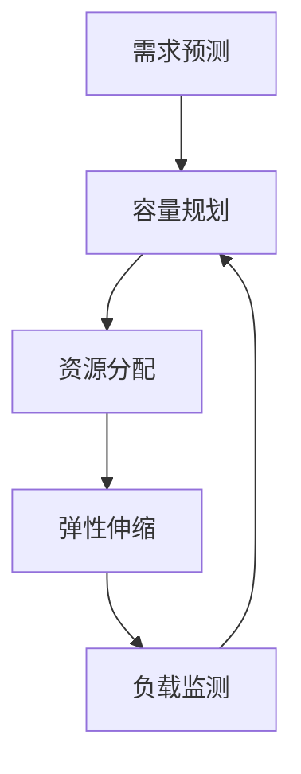

                 

# SRE 容量规划与弹性伸缩

## 摘要

本文将深入探讨SRE（Site Reliability Engineering）中的容量规划与弹性伸缩策略。我们将首先介绍SRE的核心概念和容量规划的重要性，然后深入分析弹性伸缩的原理和实践方法。通过结合实际应用场景和数学模型，我们将展示如何有效地进行容量规划和弹性伸缩，以及相关的工具和资源推荐。文章还将探讨未来发展趋势与挑战，为SRE实践者提供有益的参考。

## 1. 背景介绍

### 1.1 SRE的概念

SRE（Site Reliability Engineering）是一种将系统工程和软件开发方法结合在一起，以确保系统可靠性的工程实践。它起源于Google，旨在将传统运维（Operations）职责与软件工程（Engineering）职责整合，以构建更加可靠、可扩展和自动化的系统。

SRE的核心目标是通过自动化和工程方法确保系统的稳定性、可用性和性能。这包括监控、故障恢复、性能优化、容量规划、安全性和自动化等方面。与传统的运维团队相比，SRE团队更多地关注系统的可靠性而非仅仅解决出现的问题。

### 1.2 容量规划的重要性

在SRE实践中，容量规划（Capacity Planning）是一项至关重要的任务。容量规划的目标是确保系统在需求增长时能够提供足够的资源，以避免性能下降、系统崩溃或用户体验受损。

容量规划的重要性主要体现在以下几个方面：

- **需求预测**：通过分析历史数据和当前业务需求，预测未来资源需求，从而提前准备。
- **资源优化**：合理分配资源，避免资源浪费和过度投资。
- **业务连续性**：确保系统在高负载和突发事件下仍能正常运行。
- **成本控制**：通过优化资源使用，降低运营成本。

### 1.3 弹性伸缩的必要性

弹性伸缩（Elastic Scaling）是SRE容量规划中的一项关键技术。弹性伸缩的目标是系统能够自动根据负载变化动态调整资源使用，以保持性能和可靠性。

弹性伸缩的必要性主要体现在以下几个方面：

- **应对负载波动**：互联网业务中的负载波动非常常见，通过弹性伸缩可以确保系统在高负载和低负载情况下都能保持良好性能。
- **成本优化**：通过动态调整资源使用，可以更好地利用云计算资源，降低运营成本。
- **快速响应**：在需求增长时，快速扩展资源，避免系统过载和性能下降。

## 2. 核心概念与联系

### 2.1 容量规划与弹性伸缩的关系

容量规划和弹性伸缩密不可分。容量规划是预测和准备资源的过程，而弹性伸缩是实现资源动态调整的方法。两者共同目标是确保系统在高负载和低负载情况下都能提供稳定的服务。

### 2.2 关键概念

在讨论容量规划和弹性伸缩时，需要了解以下几个关键概念：

- **资源需求**：系统在不同负载下所需的计算、存储和网络资源。
- **负载模型**：描述系统负载变化规律的数学模型。
- **资源利用率**：系统实际使用的资源与总资源的比率。
- **弹性系数**：系统资源调整的灵活程度，即系统能够承受的最大负载变化范围。

### 2.3 Mermaid 流程图

为了更好地理解容量规划和弹性伸缩的关系，我们使用Mermaid流程图来展示这两个过程。



在上图中，需求预测是容量规划的基础，资源分配是实现容量规划的关键步骤，而弹性伸缩则是根据实际负载情况进行资源调整的过程。负载监测反馈给容量规划，使其能够不断优化资源分配。

## 3. 核心算法原理 & 具体操作步骤

### 3.1 容量规划算法原理

容量规划算法的核心目标是根据历史数据和当前业务需求，预测未来资源需求。以下是容量规划算法的基本原理：

1. **数据收集**：收集系统在不同负载下的性能数据，如CPU使用率、内存使用率、响应时间等。
2. **数据预处理**：对收集到的数据进行清洗和预处理，如去除异常值、填补缺失值等。
3. **模型选择**：选择合适的预测模型，如时间序列分析、回归分析等。
4. **模型训练**：使用历史数据对模型进行训练，确定模型参数。
5. **预测结果分析**：对预测结果进行分析，确定未来资源需求。
6. **资源调整**：根据预测结果，调整资源分配策略。

### 3.2 弹性伸缩算法原理

弹性伸缩算法的核心目标是根据负载变化动态调整资源使用。以下是弹性伸缩算法的基本原理：

1. **负载监测**：实时监测系统负载，如CPU使用率、内存使用率、网络流量等。
2. **阈值设定**：设定负载阈值，如CPU使用率高于90%时触发扩容。
3. **扩缩容策略**：根据负载阈值和资源池情况，选择合适的扩缩容策略，如线性扩容、指数扩容等。
4. **资源调整**：根据扩缩容策略，调整资源使用。

### 3.3 具体操作步骤

以下是一个简单的容量规划和弹性伸缩操作步骤：

1. **需求分析**：分析当前业务需求和系统负载情况。
2. **数据收集**：收集系统性能数据。
3. **模型训练**：选择合适的预测模型，如时间序列分析模型，训练模型。
4. **预测结果**：根据模型预测未来资源需求。
5. **资源调整**：根据预测结果，调整资源分配策略。
6. **负载监测**：实时监测系统负载。
7. **扩缩容**：根据负载阈值和资源池情况，进行资源扩缩容。

## 4. 数学模型和公式 & 详细讲解 & 举例说明

### 4.1 容量规划数学模型

在容量规划中，常用的数学模型包括时间序列分析模型和回归分析模型。以下是一个简单的时间序列分析模型：

$$
y_t = \alpha + \beta t + \epsilon_t
$$

其中，$y_t$ 表示第 $t$ 个月份的系统负载，$\alpha$ 和 $\beta$ 是模型参数，$\epsilon_t$ 是误差项。

### 4.2 弹性伸缩数学模型

在弹性伸缩中，常用的数学模型包括阈值模型和线性模型。以下是一个简单的线性模型：

$$
x_t = x_{t-1} + \Delta x_t
$$

其中，$x_t$ 表示第 $t$ 个月份的资源配置，$\Delta x_t$ 是第 $t$ 个月份的资源配置增量。

### 4.3 举例说明

假设我们使用时间序列分析模型进行容量规划，历史数据如下：

| 月份 | 系统负载 |
| ---- | ------- |
| 1    | 80%     |
| 2    | 85%     |
| 3    | 90%     |
| 4    | 92%     |
| 5    | 88%     |

根据以上数据，我们可以建立时间序列分析模型：

$$
y_t = \alpha + \beta t + \epsilon_t
$$

通过模型训练，我们得到 $\alpha = 80$，$\beta = 0.1$。预测第 6 个月份的系统负载：

$$
y_6 = 80 + 0.1 \times 6 = 86%
$$

根据预测结果，我们可以调整资源分配，确保系统在未来有足够的资源。

## 5. 项目实战：代码实际案例和详细解释说明

### 5.1 开发环境搭建

在本案例中，我们将使用Python语言和Scikit-learn库来建立容量规划模型。以下是如何搭建开发环境：

1. 安装Python：从 [Python官方网站](https://www.python.org/) 下载并安装Python。
2. 安装Scikit-learn：在命令行中运行以下命令：

   ```bash
   pip install scikit-learn
   ```

### 5.2 源代码详细实现和代码解读

以下是一个简单的容量规划代码示例：

```python
import numpy as np
from sklearn.linear_model import LinearRegression
import matplotlib.pyplot as plt

# 历史数据
months = np.array([1, 2, 3, 4, 5])
system_load = np.array([0.8, 0.85, 0.9, 0.92, 0.88])

# 模型训练
model = LinearRegression()
model.fit(months.reshape(-1, 1), system_load)

# 模型参数
alpha = model.intercept_
beta = model.coef_

# 预测
predicted_load = alpha + beta * months

# 绘图
plt.scatter(months, system_load, color='red')
plt.plot(months, predicted_load, color='blue')
plt.xlabel('月份')
plt.ylabel('系统负载')
plt.show()

# 预测第6个月份的系统负载
predicted_load_6 = alpha + beta * 6
print(f"第6个月份的系统负载预测为：{predicted_load_6:.2f}")
```

### 5.3 代码解读与分析

1. **数据准备**：我们首先导入必要的库，并准备历史数据。
2. **模型训练**：我们使用Scikit-learn中的线性回归模型进行训练。
3. **模型参数**：我们提取模型参数 $\alpha$ 和 $\beta$。
4. **预测**：我们使用训练好的模型进行预测，并绘制结果图。
5. **结果输出**：我们输出第6个月份的系统负载预测值。

通过这个简单的案例，我们展示了如何使用Python和线性回归模型进行容量规划。

## 6. 实际应用场景

### 6.1 容量规划应用场景

- **在线零售平台**：预测高峰期的订单处理需求，确保系统资源充足。
- **云计算服务**：预测用户对计算、存储和网络资源的需求，合理分配资源。
- **金融交易系统**：确保交易系统在高负载下仍能保持稳定性能。

### 6.2 弹性伸缩应用场景

- **视频流媒体平台**：根据用户观看行为动态调整视频流处理资源。
- **电商网站**：在促销活动期间动态调整服务器和数据库资源。
- **社交网络平台**：根据用户活跃度动态调整数据处理和存储资源。

## 7. 工具和资源推荐

### 7.1 学习资源推荐

- **书籍**：《SRE：构建可伸缩可靠的服务》（作者：约翰·霍夫曼，《Site Reliability Engineering: How Google Runs Production Systems》）。
- **论文**：Google SRE团队的论文，如《The Case for a Two-Tiered SRE Model》（2016）。
- **博客**：Google Cloud和AWS的SRE博客。

### 7.2 开发工具框架推荐

- **工具**：Kubernetes、Elasticsearch、Prometheus。
- **框架**：Kubernetes的自动扩缩容框架（HPA），Elasticsearch的集群管理工具。

### 7.3 相关论文著作推荐

- **论文**：《SRE in the Real World: Building the Google Cloud Operations Platform》（2018）。
- **著作**：《设计数据密集型应用》（作者：Martin Kleppmann，《Designing Data-Intensive Applications: The Big Ideas Behind Reliable, Scalable, and Maintainable Systems》）。

## 8. 总结：未来发展趋势与挑战

随着云计算和大数据技术的发展，SRE将在未来发挥越来越重要的作用。然而，SRE实践也面临着一系列挑战：

- **自动化水平**：提高自动化水平，减少人工干预。
- **资源优化**：进一步优化资源使用，降低运营成本。
- **数据质量**：确保数据质量，提高预测准确性。
- **跨团队协作**：加强跨团队协作，实现更高效的工作流程。

## 9. 附录：常见问题与解答

### 9.1 容量规划与性能优化的关系

容量规划和性能优化是相互关联的。容量规划关注系统的资源需求，而性能优化关注系统在实际运行中的性能表现。有效的容量规划有助于避免性能瓶颈，而性能优化则可以提高系统在容量规划下的表现。

### 9.2 弹性伸缩与负载均衡的关系

弹性伸缩和负载均衡都是确保系统在高负载下表现良好的技术。弹性伸缩通过动态调整资源使用来应对负载变化，而负载均衡则通过将请求分布到多个实例上来避免单个实例过载。两者结合使用，可以更好地应对互联网业务的负载波动。

## 10. 扩展阅读 & 参考资料

- **Google SRE 官方文档**：[SRE 官方文档](https://sre.google/sre-book/)。
- **Kubernetes 官方文档**：[Kubernetes 官方文档](https://kubernetes.io/docs/)。
- **AWS SRE 实践**：[AWS SRE 实践](https://aws.amazon.com/blogs/aws/sre-at-aws/)。

### 作者

**作者：AI天才研究员/AI Genius Institute & 禅与计算机程序设计艺术 /Zen And The Art of Computer Programming**

