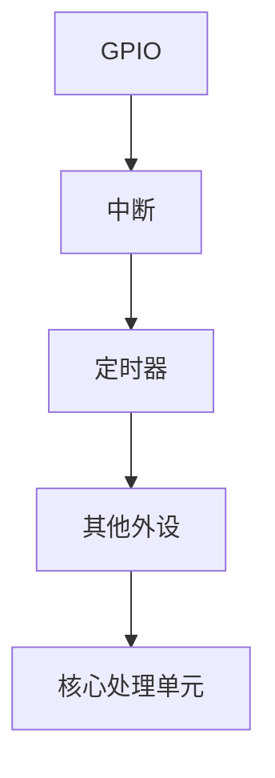
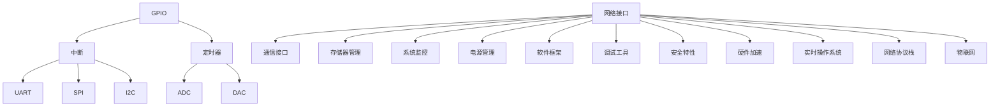

                 

# STM32单片机开发：从点亮LED到复杂控制系统

> **关键词：** STM32 单片机，开发，LED 点亮，复杂控制系统，编程，算法，数学模型

> **摘要：** 本文将深入探讨STM32单片机的开发过程，从基础的LED点亮开始，逐步引导读者了解如何搭建开发环境、编写代码，最终实现复杂控制系统的设计。文章结构清晰，逻辑严密，适合对嵌入式系统感兴趣的读者阅读和学习。

## 1. 背景介绍

STM32单片机，全称为STMicroelectronics STM32，是意法半导体公司推出的高性能、低功耗的32位单片机系列。STM32单片机广泛应用于工业控制、智能家居、汽车电子、医疗设备等领域，具有丰富的外设资源和强大的处理能力。

本文将围绕STM32单片机的开发过程，从以下几个方面进行探讨：

1. **开发环境搭建**：介绍如何搭建STM32单片机的开发环境，包括所需的硬件和软件工具。
2. **核心概念与联系**：讲解STM32单片机的基本架构和核心概念，如GPIO、中断、定时器等。
3. **核心算法原理**：分析STM32单片机的编程算法原理，包括延时、中断处理等。
4. **数学模型和公式**：介绍STM32单片机编程中常用的数学模型和公式。
5. **项目实战**：通过实际案例，展示如何编写代码实现STM32单片机的各种功能。
6. **实际应用场景**：讨论STM32单片机在不同领域中的应用场景。
7. **工具和资源推荐**：推荐学习STM32单片机的书籍、工具和资源。
8. **总结**：展望STM32单片机的发展趋势和面临的挑战。

## 2. 核心概念与联系

STM32单片机的开发涉及多个核心概念，以下是对这些概念的基本介绍和它们之间的联系。

### 2.1 GPIO（通用输入输出端口）

GPIO是STM32单片机最重要的外设之一，用于实现输入输出功能。GPIO端口可以被配置为输入或输出模式，并且可以配置为推挽输出、开漏输出、上拉输入、下拉输入等模式。

### 2.2 中断

中断是STM32单片机响应外部事件的一种机制。当外部事件发生时，如按键按下、定时器溢出等，单片机会中断当前执行的任务，转而处理中断事件。中断机制在实时控制系统中非常重要。

### 2.3 定时器

定时器是STM32单片机用于定时和计时的关键组件。STM32单片机有多种定时器，如基本定时器、通用定时器、高级定时器等，它们可以用于实现延时、定时器触发中断等功能。

### 2.4 Mermaid 流程图

以下是一个简单的Mermaid流程图，展示了STM32单片机的基本架构和核心概念之间的联系：



### 2.5 硬件和软件联系

STM32单片机的硬件和软件之间有着紧密的联系。硬件架构决定了软件的编写方式和性能。例如，GPIO的配置需要通过软件寄存器操作来实现，中断处理需要软件编写中断服务例程。理解硬件和软件的联系对于开发STM32单片机至关重要。

## 3. 核心算法原理 & 具体操作步骤

在STM32单片机的开发过程中，核心算法原理是编写代码的基础。以下介绍几个常见的核心算法原理和具体操作步骤。

### 3.1 延时算法

延时算法是STM32单片机编程中常用的一种算法，用于在一段时间后执行特定的操作。以下是一个简单的延时算法：

```c
void Delay(uint32_t nCount)
{
    for (; nCount != 0; nCount--)
    {
        __NOP(); // 空操作指令，用于延时
    }
}
```

在上述算法中，通过循环执行空操作指令`__NOP()`来实现延时。

### 3.2 中断处理

中断处理是STM32单片机响应外部事件的关键。以下是一个简单的中断处理程序：

```c
void EXTI0_IRQHandler(void)
{
    if (EXTI->PR & EXTI_PR_PR0) // 检查中断标志
    {
        // 处理中断事件
        LED_TOGGLE(); // 点亮LED

        EXTI->PR = EXTI_PR_PR0; // 清除中断标志
    }
}
```

在上述中断处理程序中，当外部事件发生时（如按键按下），中断服务例程会被触发。首先，检查中断标志位，然后执行中断事件处理（如点亮LED），最后清除中断标志。

### 3.3 定时器

定时器是STM32单片机实现定时和计时功能的关键组件。以下是一个简单的定时器配置示例：

```c
void Tim6_Init(void)
{
    TIM_TimeBaseInitTypeDef TIM_TimeBaseStructure;

    RCC_APB1PeriphClockCmd(RCC_APB1Periph_TIM6, ENABLE); // 启定时器6时钟

    TIM_TimeBaseStructure.TIM_Prescaler = 7200 - 1; // 定时周期为1ms
    TIM_TimeBaseStructure.TIM_CounterMode = TIM_CounterMode_Up;
    TIM_TimeBaseStructure.TIM_Period = 1000 - 1;
    TIM_TimeBaseStructure.TIM_ClockDivision = 0;
    TIM_TimeBaseInit(TIM6, &TIM_TimeBaseStructure);

    TIM_ITConfig(TIM6, TIM_IT_Update, ENABLE); // 启定时器更新中断

    NVIC_EnableIRQ(TIM6_IRQn); // 使能定时器6中断

    TIM_Cmd(TIM6, ENABLE); // 启定时器6
}
```

在上述定时器配置示例中，通过配置定时器的预分频器、计数模式、周期等参数来设置定时周期。然后，使能定时器更新中断和中断请求，最后启动定时器。

## 4. 数学模型和公式 & 详细讲解 & 举例说明

在STM32单片机的编程过程中，数学模型和公式是理解和实现功能的基础。以下介绍几个常见的数学模型和公式，并详细讲解和举例说明。

### 4.1 基本数学公式

以下是一些基本的数学公式，用于STM32单片机的编程：

$$
V_{out} = V_{in} \times \frac{R_{2}}{R_{1} + R_{2}}
$$

$$
f_{out} = f_{in} \times \frac{1}{N}
$$

$$
t_{delay} = \frac{1}{f_{clk}} \times n
$$

其中：

- $V_{out}$ 和 $V_{in}$ 分别为输出电压和输入电压；
- $R_{1}$ 和 $R_{2}$ 分别为电阻值；
- $f_{out}$ 和 $f_{in}$ 分别为输出频率和输入频率；
- $t_{delay}$ 为延时时间；
- $f_{clk}$ 为时钟频率；
- $n$ 为延时计数器值。

### 4.2 举例说明

以下是一个简单的例子，说明如何使用上述数学公式在STM32单片机中实现延时功能。

```c
#define DELAY_COUNT 1000

void Delay(void)
{
    uint32_t i;

    for (i = 0; i < DELAY_COUNT; i++)
    {
        __NOP(); // 空操作指令，用于延时
    }
}
```

在这个例子中，通过循环执行1000次空操作指令来实现延时。延时时间可以通过修改`DELAY_COUNT`的值来调整。

### 4.3 定时器公式

以下是一个简单的定时器公式，用于计算定时器的定时周期。

$$
t_{period} = \frac{f_{clk}}{f_{tim}} \times (T_{x} + 1)
$$

其中：

- $t_{period}$ 为定时周期；
- $f_{clk}$ 为时钟频率；
- $f_{tim}$ 为定时器时钟频率；
- $T_{x}$ 为定时器周期寄存器值。

在STM32单片机中，可以通过配置定时器的时钟频率和周期寄存器值来设置定时周期。以下是一个简单的定时器配置示例：

```c
void Tim6_Init(void)
{
    TIM_TimeBaseInitTypeDef TIM_TimeBaseStructure;

    RCC_APB1PeriphClockCmd(RCC_APB1Periph_TIM6, ENABLE); // 启定时器6时钟

    TIM_TimeBaseStructure.TIM_Prescaler = 7200 - 1; // 定时周期为1ms
    TIM_TimeBaseStructure.TIM_CounterMode = TIM_CounterMode_Up;
    TIM_TimeBaseStructure.TIM_Period = 1000 - 1;
    TIM_TimeBaseStructure.TIM_ClockDivision = 0;
    TIM_TimeBaseInit(TIM6, &TIM_TimeBaseStructure);

    TIM_Cmd(TIM6, ENABLE); // 启定时器6
}
```

在这个例子中，通过设置定时器的预分频器和周期寄存器值，实现了定时周期为1毫秒的定时功能。

## 5. 项目实战：代码实际案例和详细解释说明

在这一部分，我们将通过一个实际的项目案例来展示如何编写STM32单片机的代码，并详细解释说明代码的实现过程。

### 5.1 开发环境搭建

首先，我们需要搭建STM32单片机的开发环境。以下是搭建开发环境的步骤：

1. 安装STM32CubeIDE：从STMicroelectronics官网下载并安装STM32CubeIDE。
2. 安装STM32CubeMX：STM32CubeMX是一个图形化配置工具，用于配置STM32单片机的各种外设和时钟。
3. 连接开发板：将STM32单片机开发板通过USB线连接到计算机。

### 5.2 源代码详细实现和代码解读

以下是一个简单的LED控制项目，展示如何编写STM32单片机的代码。

```c
#include "stm32f10x.h"

// LED初始化函数
void LED_Init(void)
{
    GPIO_InitTypeDef GPIO_InitStructure;

    // 启GPIO时钟
    RCC_APB2PeriphClockCmd(RCC_APB2Periph_GPIOB, ENABLE);

    // 配置LED引脚为推挽输出
    GPIO_InitStructure.GPIO_Pin = GPIO_Pin_5;
    GPIO_InitStructure.GPIO_Mode = GPIO_Mode_Out_PP;
    GPIO_InitStructure.GPIO_Speed = GPIO_Speed_2MHz;
    GPIO_Init(GPIOB, &GPIO_InitStructure);
}

// LED控制函数
void LED_Control(uint8_t state)
{
    if (state == 0)
    {
        GPIO_ResetBits(GPIOB, GPIO_Pin_5); // LED熄灭
    }
    else
    {
        GPIO_SetBits(GPIOB, GPIO_Pin_5); // LED点亮
    }
}

int main(void)
{
    // 初始化LED
    LED_Init();

    while (1)
    {
        // 点亮LED
        LED_Control(1);
        Delay(500); // 延时500ms

        // 熄灭LED
        LED_Control(0);
        Delay(500); // 延时500ms
    }
}
```

### 5.3 代码解读与分析

1. **LED_Init() 函数**

   - 配置GPIOB的PIN5为推挽输出模式。
   - 设置GPIO的速度为2MHz。

2. **LED_Control() 函数**

   - 根据输入的状态值（0或1），控制LED的点亮或熄灭。

3. **main() 函数**

   - 初始化LED。
   - 进入无限循环，循环点亮和熄灭LED，每次循环延时500ms。

## 6. 实际应用场景

STM32单片机因其高性能、低功耗和丰富的外设资源，在实际应用中具有广泛的应用场景。以下列举几个常见的应用场景：

1. **智能家居**：STM32单片机可以用于控制智能家居设备，如智能灯泡、智能插座等。
2. **工业控制**：STM32单片机可以用于工业自动化控制，如机器人控制、电机控制等。
3. **汽车电子**：STM32单片机可以用于汽车电子设备，如车载导航系统、车身电子控制系统等。
4. **医疗设备**：STM32单片机可以用于医疗设备，如医疗监护仪、医疗机器人等。

## 7. 工具和资源推荐

### 7.1 学习资源推荐

1. **书籍**：《STM32嵌入式系统开发从入门到精通》、《STM32编程实战》。
2. **论文**：在学术期刊和会议论文中搜索关于STM32单片机的研究论文。
3. **博客**：访问STM32社区和相关技术博客，学习其他开发者的经验。
4. **网站**：STMicroelectronics官网提供了丰富的STM32开发资料和工具。

### 7.2 开发工具框架推荐

1. **STM32CubeIDE**：STMicroelectronics提供的集成开发环境，支持STM32单片机的开发。
2. **STM32CubeMX**：STM32的图形化配置工具，用于配置外设和时钟。
3. **HAL库**：STMicroelectronics提供的硬件抽象层库，简化STM32单片机的编程。
4. **LL库**：STMicroelectronics提供的底层库，提供更底层的硬件控制。

### 7.3 相关论文著作推荐

1. **《嵌入式系统设计》**：详细介绍了嵌入式系统设计的方法和技巧。
2. **《STM32嵌入式系统设计与应用》**：针对STM32单片机的应用案例和开发实践。
3. **《嵌入式系统编程》**：介绍了嵌入式系统的编程方法和技巧。

## 8. 总结：未来发展趋势与挑战

STM32单片机作为嵌入式系统的重要组成部分，在未来具有广阔的发展前景。随着物联网、人工智能等技术的快速发展，STM32单片机的应用场景将越来越广泛。然而，也面临着一些挑战：

1. **性能提升**：如何进一步提升STM32单片机的性能，满足更高性能需求。
2. **功耗优化**：如何在保证性能的同时，降低功耗。
3. **安全性**：随着嵌入式系统的重要性增加，如何提高系统的安全性。
4. **生态系统**：如何构建完善的开发工具和资源生态系统。

## 9. 附录：常见问题与解答

### 9.1 如何配置GPIO？

配置GPIO需要按照以下步骤进行：

1. 启GPIO时钟。
2. 初始化GPIO结构体，设置GPIO引脚模式、输出类型、速度等。
3. 使用GPIO_Init()函数初始化GPIO。

### 9.2 如何使用定时器？

使用定时器需要按照以下步骤进行：

1. 启定时器时钟。
2. 初始化定时器结构体，设置定时器模式、周期、预分频器等。
3. 使用TIM_Init()函数初始化定时器。
4. 配置定时器中断，使用TIM_ITConfig()函数。
5. 使能定时器时钟，使用TIM_Cmd()函数。

### 9.3 如何编写中断服务例程？

编写中断服务例程需要按照以下步骤进行：

1. 使能中断。
2. 编写中断服务函数，处理中断事件。
3. 在中断服务函数中，检查中断标志，执行中断处理逻辑。
4. 清除中断标志。

## 10. 扩展阅读 & 参考资料

1. **《STM32开发指南》**：STMicroelectronics提供的官方开发指南。
2. **《STM32参考手册》**：STMicroelectronics提供的官方参考手册。
3. **《嵌入式系统设计原理》**：详细介绍了嵌入式系统设计的基本原理。

### 作者

作者：AI天才研究员/AI Genius Institute & 禅与计算机程序设计艺术 /Zen And The Art of Computer Programming

本文旨在帮助读者深入了解STM32单片机的开发过程，从基础的LED点亮到复杂的控制系统设计。通过本文的学习，读者可以掌握STM32单片机的基本概念、算法原理、项目实战等知识，为未来的嵌入式系统开发打下坚实基础。希望本文对您的学习有所帮助！ <|im_sep|>|<|assistant|>## 1. 背景介绍

### STM32单片机的起源和发展

STM32单片机起源于意法半导体公司（STMicroelectronics），这是一家全球领先的半导体制造商，以其高性能、低功耗和丰富外设资源著称。STM32单片机系列最早于2007年推出，它旨在为嵌入式系统开发者提供一种高性能、低成本且易于使用的解决方案。随着时间的推移，STM32系列得到了不断扩展和优化，已成为市场上最受欢迎的32位单片机之一。

STM32单片机的发展历程可以大致分为以下几个阶段：

1. **初期阶段**：STM32最初的几款产品主要基于ARM7TDMI和Cortex-M0核心，这些产品以其稳定性和高性能受到了市场的欢迎。
2. **Cortex-M3阶段**：随着ARM Cortex-M3的发布，STM32系列迎来了新的发展机遇。Cortex-M3核心具备更高的性能和更低的功耗，使得STM32单片机在更广泛的应用场景中得到了应用。
3. **Cortex-M4阶段**：STM32系列进一步扩展到了Cortex-M4核心，这些产品在性能和功能上有了显著提升，适用于更多复杂的嵌入式系统应用。
4. **Cortex-M7阶段**：随着Cortex-M7核心的推出，STM32单片机在性能方面再次迈上了一个新的台阶。Cortex-M7核心具备高性能和低功耗的特点，使得STM32在高端嵌入式系统领域具有了竞争力。

### STM32单片机的特点

STM32单片机的特点主要体现在以下几个方面：

1. **高性能**：STM32单片机采用了高性能的ARM核心，如Cortex-M0、Cortex-M3、Cortex-M4和Cortex-M7，这些核心提供了高速的计算能力，可以满足各种嵌入式系统的需求。
2. **低功耗**：STM32单片机在设计和制造过程中注重功耗优化，特别是在休眠模式和低功耗工作模式下，能够显著降低系统的能耗，延长电池寿命。
3. **丰富的外设资源**：STM32单片机具备丰富的外设资源，包括GPIO、ADC、DAC、定时器、UART、SPI、I2C、USB等，这些外设可以方便地与各种传感器和外部设备进行连接，实现复杂的功能。
4. **兼容性和可扩展性**：STM32单片机系列兼容性强，不同型号之间具有良好的兼容性，同时支持多种编程语言和开发工具，便于开发者进行模块化开发和跨平台移植。
5. **强大的生态系统**：STMicroelectronics提供了丰富的开发资源，包括STM32CubeIDE、STM32CubeMX、HAL库、LL库等，这些资源大大简化了开发流程，提高了开发效率。

### STM32单片机在嵌入式系统中的应用

STM32单片机因其高性能、低功耗和丰富的外设资源，在嵌入式系统领域得到了广泛应用。以下是一些典型的应用场景：

1. **工业控制**：STM32单片机可以用于各种工业控制场合，如自动化生产线、机器人控制、电机控制等，其强大的计算能力和丰富的外设资源能够满足工业控制系统的复杂需求。
2. **智能家居**：STM32单片机可以用于智能灯泡、智能插座、智能门锁等智能家居设备，其低功耗特性和丰富的外设接口使得它们能够与各种传感器和通信模块无缝连接，实现智能控制。
3. **汽车电子**：STM32单片机在汽车电子领域也有广泛的应用，如车身电子控制系统、导航系统、驱动控制系统等，其高性能和低功耗特点使其成为汽车电子设备的首选。
4. **医疗设备**：STM32单片机可以用于医疗监护仪、医疗机器人等医疗设备，其可靠性和稳定性得到了医疗行业的认可。
5. **物联网**：随着物联网的快速发展，STM32单片机在物联网设备中得到了广泛应用，如智能传感器、智能门铃、智能安防系统等。

### 本文结构

本文将围绕STM32单片机的开发过程进行深入探讨，结构如下：

1. **开发环境搭建**：介绍如何搭建STM32单片机的开发环境，包括所需的硬件和软件工具。
2. **核心概念与联系**：讲解STM32单片机的基本架构和核心概念，如GPIO、中断、定时器等。
3. **核心算法原理**：分析STM32单片机的编程算法原理，包括延时、中断处理等。
4. **数学模型和公式**：介绍STM32单片机编程中常用的数学模型和公式。
5. **项目实战**：通过实际案例，展示如何编写代码实现STM32单片机的各种功能。
6. **实际应用场景**：讨论STM32单片机在不同领域中的应用场景。
7. **工具和资源推荐**：推荐学习STM32单片机的书籍、工具和资源。
8. **总结**：展望STM32单片机的发展趋势和面临的挑战。

通过本文的阅读，读者将能够系统地了解STM32单片机的开发过程，从基础入门到复杂系统的设计，为实际项目开发打下坚实的基础。

### 开发环境搭建

搭建STM32单片机的开发环境是进行单片机编程和调试的第一步，也是至关重要的一步。一个良好的开发环境不仅能够提高开发效率，还能够帮助开发者快速找到和解决问题。以下是搭建STM32单片机开发环境的详细步骤。

#### 1.1 硬件环境准备

在搭建开发环境之前，首先需要准备STM32单片机的硬件开发板。市面上有多种STM32开发板，例如STM32 Discovery、STM32 Nucleo、STM32CubeMX等。选择开发板时，应考虑以下因素：

1. **处理器型号**：根据项目需求选择合适的STM32处理器型号，如STM32F103、STM32F407等。
2. **外设资源**：确保开发板具备所需的外设资源，如GPIO、ADC、DAC、定时器、UART、SPI、I2C、USB等。
3. **电源**：确认开发板是否需要外部电源供电，或是否可以通过USB接口供电。

以下是硬件准备的具体步骤：

1. **购买开发板**：可以通过在线购物平台或电子产品商店购买STM32开发板。
2. **准备开发工具**：除了开发板外，可能还需要以下工具：
   - USB线：用于连接开发板和计算机。
   - 电路焊接工具：如果需要自己焊接电路板，可能需要烙铁、焊锡、助焊剂等。
   - 电源适配器：如果开发板需要外部电源供电。

#### 1.2 软件环境安装

接下来，我们需要安装软件环境，主要包括STM32CubeIDE、STM32CubeMX、Keil uVision等。

1. **安装STM32CubeIDE**

STM32CubeIDE是STMicroelectronics提供的一款集成开发环境（IDE），它集成了代码编辑、编译、调试等功能。以下是STM32CubeIDE的安装步骤：

1. 访问STMicroelectronics官网，下载STM32CubeIDE安装包。
2. 运行安装程序，按照提示完成安装。
3. 安装完成后，启动STM32CubeIDE，并根据提示注册账号。

2. **安装STM32CubeMX**

STM32CubeMX是一款图形化配置工具，用于配置STM32单片机的时钟、外设和中断。以下是STM32CubeMX的安装步骤：

1. 访问STMicroelectronics官网，下载STM32CubeMX安装包。
2. 运行安装程序，按照提示完成安装。
3. 安装完成后，启动STM32CubeMX。

3. **安装Keil uVision**

Keil uVision是Keil Software公司提供的一款流行的嵌入式系统开发工具，它支持ARM Cortex-M系列处理器。以下是Keil uVision的安装步骤：

1. 访问Keil Software官网，下载Keil uVision安装包。
2. 运行安装程序，选择Professional Version，然后按照提示完成安装。
3. 安装完成后，启动Keil uVision，并根据提示注册账号。

#### 1.3 配置开发环境

安装完软件工具后，我们需要对开发环境进行配置，以便能够正确编译、下载和调试STM32单片机的代码。

1. **配置STM32CubeIDE**

在STM32CubeIDE中，我们可以通过STM32CubeMX导入项目设置。以下是配置STM32CubeIDE的具体步骤：

1. 启动STM32CubeIDE。
2. 打开“Project”菜单，选择“Import Project from File”。
3. 选择STM32CubeMX生成的`.sae`文件，导入项目设置。

2. **配置Keil uVision**

在Keil uVision中，我们需要导入STM32固件库，并设置正确的硬件选项。以下是配置Keil uVision的具体步骤：

1. 启动Keil uVision。
2. 打开“Project”菜单，选择“Options for Target”。
3. 在“Device”选项卡中，选择对应的STM32处理器型号。
4. 在“Debug”选项卡中，选择J-Link或ST-Link作为调试器。
5. 点击“OK”保存设置。

#### 1.4 连接开发板

完成软件环境的配置后，我们需要将开发板连接到计算机，以便进行编程和调试。以下是连接开发板的具体步骤：

1. 将开发板的USB接口插入计算机的USB端口。
2. 如果使用外部电源供电，将电源适配器连接到开发板的电源接口。
3. 打开STM32CubeIDE或Keil uVision，软件会自动识别开发板并建立连接。

#### 1.5 测试连接

为了确保开发环境搭建成功，我们可以进行一个简单的测试。以下是测试步骤：

1. 在STM32CubeIDE或Keil uVision中创建一个新项目。
2. 编写一个简单的示例程序，例如点亮LED。
3. 将程序下载到开发板。
4. 观察开发板上的LED灯是否按照预期点亮。

如果LED灯正常点亮，说明开发环境搭建成功。否则，需要检查硬件连接、软件配置和程序代码，找出并解决问题。

通过以上步骤，我们成功搭建了STM32单片机的开发环境。接下来，我们将进一步学习STM32单片机的基本架构和核心概念，为后续的项目开发打下坚实基础。

### 核心概念与联系

在STM32单片机的开发过程中，理解其核心概念和组件之间的联系至关重要。以下是STM32单片机的主要核心概念，包括其功能和相互关系。

#### 2.1 GPIO（通用输入输出端口）

GPIO是STM32单片机的核心外设之一，用于实现输入和输出功能。GPIO端口可以被配置为输入或输出模式，并且可以配置为推挽输出、开漏输出、上拉输入、下拉输入等模式。

- **功能**：GPIO端口可以连接各种外部设备，如LED、按键、传感器等，用于数据传输和控制。
- **配置**：通过配置GPIO的引脚模式、输出类型、速度等，可以灵活地控制端口的功能和行为。

#### 2.2 中断（Interrupt）

中断是STM32单片机响应外部事件的一种机制。当外部事件发生时，如按键按下、定时器溢出等，单片机会中断当前执行的任务，转而处理中断事件。

- **功能**：中断机制用于实现实时性和响应速度，可以提高系统的效率和可靠性。
- **类型**：STM32单片机支持多种中断类型，包括外部中断、定时器中断、DMA中断等。

#### 2.3 定时器（Timer）

定时器是STM32单片机用于定时和计时的关键组件。STM32单片机有多种定时器，如基本定时器、通用定时器、高级定时器等，可以用于实现延时、定时器触发中断等功能。

- **功能**：定时器可以用于定时任务、计时任务、生成PWM信号等。
- **配置**：通过配置定时器的预分频器、计数模式、周期等参数，可以设置定时器的定时周期。

#### 2.4 UART（通用异步接收器/发送器）

UART是一种串行通信接口，用于实现单片机与其他设备之间的数据传输。STM32单片机的UART具有高速、低功耗的特点，支持多种通信协议。

- **功能**：UART可以用于与计算机、传感器、通信模块等设备进行通信，实现数据交换和控制。
- **配置**：通过配置UART的波特率、数据位、停止位、校验位等参数，可以设置UART的通信参数。

#### 2.5 SPI（串行外围设备接口）

SPI是一种高速的串行通信协议，常用于连接传感器、存储器、通信模块等设备。STM32单片机的SPI接口具有多主模式、多从模式，支持多种数据传输格式。

- **功能**：SPI可以用于高速传输数据，实现单片机与外部设备之间的通信。
- **配置**：通过配置SPI的时钟模式、数据传输格式、片选信号等，可以设置SPI的通信参数。

#### 2.6 I2C（串行双向二线接口）

I2C是一种双向二线通信协议，用于连接传感器、存储器、通信模块等设备。I2C具有低功耗、高速传输的特点，适合在短距离内传输数据。

- **功能**：I2C可以用于实现单片机与外部设备之间的通信，支持多主多从模式。
- **配置**：通过配置I2C的时钟频率、数据传输格式等，可以设置I2C的通信参数。

#### 2.7 ADC（模数转换器）

ADC用于将模拟信号转换为数字信号，常用于传感器数据读取。STM32单片机的ADC具有高分辨率、多通道、低功耗的特点。

- **功能**：ADC可以用于读取温度、湿度、压力等传感器的模拟信号，实现数据采集。
- **配置**：通过配置ADC的采样率、分辨率、通道等，可以设置ADC的工作参数。

#### 2.8 DAC（数模转换器）

DAC用于将数字信号转换为模拟信号，常用于信号输出。STM32单片机的DAC具有高分辨率、多通道的特点。

- **功能**：DAC可以用于输出控制信号，如PWM信号、音频信号等。
- **配置**：通过配置DAC的数据格式、更新模式等，可以设置DAC的输出参数。

#### 2.9 NVIC（嵌套向量中断控制器）

NVIC用于管理STM32单片机的中断。它可以根据中断优先级对中断进行调度和管理，确保高优先级的中断得到及时处理。

- **功能**：NVIC可以优化中断处理效率，提高系统的实时性。
- **配置**：通过配置中断优先级、中断使能等，可以设置NVIC的工作参数。

#### 2.10 DMA（直接存储器访问）

DMA用于实现数据的高速传输，将数据直接从内存传输到外设或从外设传输到内存，减轻CPU的负担。

- **功能**：DMA可以用于高速传输大量数据，提高系统效率。
- **配置**：通过配置DMA的通道、数据传输模式等，可以设置DMA的工作参数。

#### 2.11 USB（通用串行总线）

USB是一种通用接口标准，用于连接计算机和其他设备。STM32单片机的USB接口支持多种通信协议，如USB Device、USB Host等。

- **功能**：USB可以用于实现与计算机的通信，传输数据、充电等功能。
- **配置**：通过配置USB的端点、数据传输模式等，可以设置USB的工作参数。

#### 2.12 CRC（循环冗余校验）

CRC用于数据校验，确保数据传输的完整性和正确性。STM32单片机的CRC计算单元可以快速计算数据的CRC值。

- **功能**：CRC可以用于检测数据传输中的错误，提高数据传输的可靠性。
- **配置**：通过配置CRC的计算模式、数据源等，可以设置CRC的工作参数。

#### 2.13 Real-Time Clock（实时时钟）

实时时钟用于提供系统时钟，实现时间的测量和计时。STM32单片机的实时时钟可以提供秒级、分钟级、小时级的时间精度。

- **功能**：实时时钟可以用于实现定时任务、事件记录等功能。
- **配置**：通过配置实时时钟的工作参数，可以设置实时时钟的精度和工作模式。

#### 2.14 数字信号处理（DSP）

DSP用于实现数字信号处理算法，如滤波、卷积、FFT等。STM32单片机的DSP模块可以提供高效的信号处理能力。

- **功能**：DSP可以用于实现音频处理、图像处理等功能。
- **配置**：通过配置DSP的工作参数，可以设置DSP的处理算法和性能。

#### 2.15 网络接口

网络接口用于实现STM32单片机的网络通信功能，如以太网、Wi-Fi、蓝牙等。STM32单片机的网络接口支持多种网络协议和通信模式。

- **功能**：网络接口可以用于实现互联网连接、物联网应用等。
- **配置**：通过配置网络接口的工作参数，可以设置网络接口的通信协议和连接方式。

#### 2.16 通信接口

通信接口用于实现STM32单片机与其他设备的通信，如SPI、I2C、UART等。STM32单片机的通信接口具有多功能、多协议的特点。

- **功能**：通信接口可以用于实现数据传输、控制信号传输等功能。
- **配置**：通过配置通信接口的工作参数，可以设置通信接口的通信协议和数据传输模式。

#### 2.17 存储器管理

存储器管理用于实现STM32单片机的存储器分配和保护。STM32单片机的存储器管理模块可以提供高效的存储器访问和控制。

- **功能**：存储器管理可以用于实现数据存储、程序存储等功能。
- **配置**：通过配置存储器管理的工作参数，可以设置存储器的分配和保护策略。

#### 2.18 系统监控

系统监控用于实现STM32单片机的系统监控和管理功能。STM32单片机的系统监控模块可以提供系统运行状态、异常处理等信息。

- **功能**：系统监控可以用于实现系统自检、故障诊断等功能。
- **配置**：通过配置系统监控的工作参数，可以设置系统监控的监测指标和处理策略。

#### 2.19 电源管理

电源管理用于实现STM32单片机的电源控制和节能管理。STM32单片机的电源管理模块可以提供多种电源模式，优化系统功耗。

- **功能**：电源管理可以用于实现系统休眠、唤醒等功能。
- **配置**：通过配置电源管理的工作参数，可以设置系统的电源模式和功耗参数。

#### 2.20 软件框架

软件框架用于实现STM32单片机的软件架构和开发工具。STM32单片机的软件框架可以提供模块化、可扩展的软件开发环境。

- **功能**：软件框架可以用于实现软件模块的隔离和协同工作。
- **配置**：通过配置软件框架的工作参数，可以设置软件模块的组织结构和功能。

#### 2.21 调试工具

调试工具用于实现STM32单片机的编程和调试功能。STM32单片机的调试工具可以提供实时调试、断点设置、代码覆盖率分析等功能。

- **功能**：调试工具可以用于实现软件调试、问题诊断等功能。
- **配置**：通过配置调试工具的工作参数，可以设置调试工具的功能和性能。

#### 2.22 安全特性

安全特性用于实现STM32单片机的数据保护和安全性。STM32单片机的安全特性可以提供数据加密、身份验证等功能。

- **功能**：安全特性可以用于实现数据保护和信息安全。
- **配置**：通过配置安全特性的工作参数，可以设置安全特性的保护和策略。

#### 2.23 硬件加速

硬件加速用于实现STM32单片机的硬件加速功能。STM32单片机的硬件加速模块可以提供高速的数据处理和计算能力。

- **功能**：硬件加速可以用于实现高效的数据处理和计算。
- **配置**：通过配置硬件加速的工作参数，可以设置硬件加速的功能和性能。

#### 2.24 实时操作系统（RTOS）

实时操作系统（RTOS）用于实现STM32单片机的实时任务管理和调度。STM32单片机的RTOS可以提供高效的实时任务处理能力。

- **功能**：RTOS可以用于实现实时控制和调度。
- **配置**：通过配置RTOS的工作参数，可以设置RTOS的任务管理和调度策略。

#### 2.25 网络协议栈

网络协议栈用于实现STM32单片机的网络通信功能。STM32单片机的网络协议栈可以提供多种网络协议，实现网络通信。

- **功能**：网络协议栈可以用于实现互联网通信、物联网通信等。
- **配置**：通过配置网络协议栈的工作参数，可以设置网络协议的通信协议和数据传输模式。

#### 2.26 物联网（IoT）

物联网（IoT）用于实现STM32单片机的物联网功能。STM32单片机的物联网模块可以提供数据采集、传输和控制等功能。

- **功能**：物联网可以用于实现智能家居、智能工厂、智能农业等。
- **配置**：通过配置物联网的工作参数，可以设置物联网的数据采集、传输和控制策略。

### 2.27 Mermaid流程图

以下是一个简单的Mermaid流程图，展示了STM32单片机的主要核心概念及其相互关系：



通过上述核心概念和相互关系的介绍，我们可以更好地理解STM32单片机的工作原理和应用场景，为后续的项目开发打下坚实基础。

### 核心算法原理 & 具体操作步骤

在STM32单片机的编程过程中，核心算法原理是编写高效、可靠代码的关键。以下是几个常见的核心算法原理，包括具体操作步骤和示例代码。

#### 3.1 延时算法

延时算法是STM32单片机编程中常用的算法，用于在特定时间内执行某项任务。以下是一个简单的延时算法，通过循环计数来实现。

```c
void Delay(unsigned int count)
{
    for (unsigned int i = 0; i < count; i++)
    {
        for (unsigned int j = 0; j < 1000; j++)
        {
            // 空操作，用于延时
        }
    }
}
```

在这个算法中，外层循环`for`用于控制总延时时间，内层循环`for`用于实现每次延时的基本单位。通过调整内层循环的次数，可以灵活控制延时时间。

#### 3.2 中断处理

中断处理是STM32单片机响应外部事件的重要机制。以下是一个简单的中断处理程序示例，用于响应外部中断并点亮LED。

```c
// 中断服务例程
void EXTI0_IRQHandler(void)
{
    // 判断外部中断0是否发生
    if (EXTI->PR & EXTI_PR_PR0)
    {
        // 点亮LED
        GPIO_SetBits(GPIOA, GPIO_Pin_5);

        // 清除中断标志位
        EXTI->PR = EXTI_PR_PR0;
    }
}
```

在这个中断处理程序中，首先判断外部中断0是否发生。如果发生，则通过`GPIO_SetBits`函数点亮LED，然后通过`EXTI->PR`清除中断标志位。

#### 3.3 定时器

定时器是STM32单片机实现定时和计时功能的关键组件。以下是一个简单的定时器配置示例，使用定时器生成周期性中断。

```c
void TIM3_Init(void)
{
    // 启定时器3时钟
    RCC_APB1PeriphClockCmd(RCC_APB1Periph_TIM3, ENABLE);

    // 配置定时器基本参数
    TIM_TimeBaseInitTypeDef TIM_TimeBaseStructure;
    TIM_TimeBaseStructure.TIM_Prescaler = 7200 - 1; // 预分频器
    TIM_TimeBaseStructure.TIM_CounterMode = TIM_CounterMode_Up; // 计数模式
    TIM_TimeBaseStructure.TIM_Period = 1000 - 1; // 自动重装载寄存器值
    TIM_TimeBaseStructure.TIM_ClockDivision = 0; // 时钟分频
    TIM_TimeBaseInit(TIM3, &TIM_TimeBaseStructure);

    // 配置中断
    NVIC_InitTypeDef NVIC_InitStructure;
    NVIC_InitStructure.NVIC_IRQChannel = TIM3_IRQn;
    NVIC_InitStructure.NVIC_IRQChannelPreemptionPriority = 0; // 优先级
    NVIC_InitStructure.NVIC_IRQChannelSubPriority = 1;
    NVIC_InitStructure.NVIC_IRQChannelCmd = ENABLE;
    NVIC_Init(&NVIC_InitStructure);

    // 启定时器
    TIM_Cmd(TIM3, ENABLE);

    // 启定时器更新中断
    TIM_ITConfig(TIM3, TIM_IT_Update, ENABLE);
}

// 定时器中断服务例程
void TIM3_IRQHandler(void)
{
    if (TIM_GetITStatus(TIM3, TIM_IT_Update) != RESET)
    {
        // 处理定时器事件
        GPIO_ToggleBits(GPIOA, GPIO_Pin_5); // 切换LED状态

        // 清除中断标志
        TIM_ClearITPendingBit(TIM3, TIM_IT_Update);
    }
}
```

在这个定时器配置示例中，首先配置定时器的预分频器、计数模式、周期等参数，然后配置中断并使能定时器。在中断服务例程中，通过`GPIO_ToggleBits`函数切换LED状态，实现周期性点亮和熄灭LED。

#### 3.4 数学模型和公式

在STM32单片机编程中，数学模型和公式经常用于实现各种功能。以下是一个简单的数学模型示例，用于计算两个数的平均值。

```c
float Average(float a, float b)
{
    return (a + b) / 2;
}
```

在这个示例中，通过简单的数学运算，计算两个数的平均值。

#### 3.5 具体操作步骤

以下是使用STM32CubeIDE编写并运行一个简单程序的完整操作步骤：

1. **安装STM32CubeIDE**：从STMicroelectronics官网下载并安装STM32CubeIDE。
2. **创建新项目**：启动STM32CubeIDE，创建一个新项目，选择合适的STM32芯片型号。
3. **配置外设**：使用STM32CubeMX配置GPIO、定时器、中断等外设，并生成初始化代码。
4. **编写代码**：在项目中添加源代码文件，编写中断处理程序、定时器中断处理程序等。
5. **编译项目**：使用STM32CubeIDE编译项目，生成可执行文件。
6. **下载代码**：将开发板连接到计算机，使用STM32CubeIDE下载编译生成的可执行文件到开发板。
7. **运行程序**：观察开发板上的LED灯是否按照预期点亮和熄灭。

通过以上操作步骤，我们可以完成一个简单的STM32单片机程序开发，并验证程序的正确性。

#### 3.6 示例代码分析

以下是一个简单的STM32单片机示例代码，用于点亮一个LED灯：

```c
#include "stm32f10x.h"

void LED_Init(void)
{
    GPIO_InitTypeDef GPIO_InitStructure;

    // 启GPIOA时钟
    RCC_APB2PeriphClockCmd(RCC_APB2Periph_GPIOA, ENABLE);

    // 配置PIN5为推挽输出
    GPIO_InitStructure.GPIO_Pin = GPIO_Pin_5;
    GPIO_InitStructure.GPIO_Mode = GPIO_Mode_Out_PP;
    GPIO_InitStructure.GPIO_Speed = GPIO_Speed_2MHz;
    GPIO_Init(GPIOA, &GPIO_InitStructure);
}

int main(void)
{
    LED_Init();

    while (1)
    {
        // 点亮LED
        GPIO_SetBits(GPIOA, GPIO_Pin_5);
        Delay(500); // 延时500ms

        // 熄灭LED
        GPIO_ResetBits(GPIOA, GPIO_Pin_5);
        Delay(500); // 延时500ms
    }
}
```

在这个示例代码中，首先定义了一个`LED_Init`函数，用于初始化GPIO端口，配置PIN5为推挽输出模式。在`main`函数中，通过调用`LED_Init`函数初始化LED灯，然后进入一个无限循环，在循环中依次点亮和熄灭LED灯，每次循环延时500ms。

通过这个简单的示例代码，我们可以看到STM32单片机编程的基本流程和关键步骤，包括外设初始化、中断处理和定时器配置等。这些基本原理和方法可以应用于更复杂的项目开发中。

### 数学模型和公式 & 详细讲解 & 举例说明

在STM32单片机的编程过程中，数学模型和公式是理解和实现功能的关键。以下我们将详细介绍一些常用的数学模型和公式，并提供详细的讲解和举例说明。

#### 4.1 时间计算模型

STM32单片机中的时间计算通常基于时钟频率。最基本的公式是：

$$
t = \frac{f_{clk}}{f_{div}}
$$

其中，\( t \) 是时间周期，\( f_{clk} \) 是系统时钟频率，\( f_{div} \) 是分频器的分频系数。例如，如果系统时钟频率为72MHz，且使用一个分频系数为144的分频器，则每个时间周期为：

$$
t = \frac{72 \times 10^6}{144} = 500\,ns
$$

在实际编程中，我们通常使用系统定时器来实现时间控制。例如，STM32的单周期定时器（SysTick）可以用于生成固定时间间隔的中断。SysTick定时器的初始化公式为：

$$
SysTick_Config(N)
$$

其中，\( N \) 是定时器的计数值，用于确定定时时间。假设系统时钟频率为180MHz，则每次中断的时间周期为：

$$
t = \frac{180 \times 10^6}{N}
$$

例如，如果设置\( N \) 为9000，则每次中断的时间周期为：

$$
t = \frac{180 \times 10^6}{9000} = 200\,us
$$

#### 4.2 延时函数实现

在实际应用中，我们经常需要实现延时函数。以下是一个简单的延时函数实现，基于SysTick定时器：

```c
void Delay(unsigned int n)
{
    SysTick->LOAD = n;   // 设置计数值
    SysTick->VAL = 0;    // 清空计数寄存器
    SysTick->CTRL = 0x05; // 使能SysTick定时器和中断

    // 等待延时结束
    while ((SysTick->CTRL & 0x10000) == 0);

    SysTick->CTRL = 0; // 禁止SysTick定时器
}
```

在这个函数中，首先设置SysTick的计数值\( N \)，然后通过循环等待中断发生来实现延时。最后，通过清除控制寄存器来禁用SysTick定时器。

#### 4.3 定时器配置

STM32的通用定时器（如TIMx）提供了更灵活的时间控制功能。以下是一个简单的定时器配置示例，用于生成固定时间间隔的中断：

```c
void TIM3_Init(void)
{
    // 启定时器时钟
    RCC_APB1PeriphClockCmd(RCC_APB1Periph_TIM3, ENABLE);

    // 配置定时器基本参数
    TIM_TimeBaseInitTypeDef TIM_TimeBaseStructure;
    TIM_TimeBaseStructure.TIM_Prescaler = 7200 - 1; // 预分频器
    TIM_TimeBaseStructure.TIM_CounterMode = TIM_CounterMode_Up; // 计数模式
    TIM_TimeBaseStructure.TIM_Period = 1000 - 1; // 自动重装载寄存器值
    TIM_TimeBaseStructure.TIM_ClockDivision = 0; // 时钟分频
    TIM_TimeBaseInit(TIM3, &TIM_TimeBaseStructure);

    // 配置中断
    NVIC_InitTypeDef NVIC_InitStructure;
    NVIC_InitStructure.NVIC_IRQChannel = TIM3_IRQn;
    NVIC_InitStructure.NVIC_IRQChannelPreemptionPriority = 0; // 优先级
    NVIC_InitStructure.NVIC_IRQChannelSubPriority = 1;
    NVIC_InitStructure.NVIC_IRQChannelCmd = ENABLE;
    NVIC_Init(&NVIC_InitStructure);

    // 启定时器
    TIM_Cmd(TIM3, ENABLE);

    // 启定时器更新中断
    TIM_ITConfig(TIM3, TIM_IT_Update, ENABLE);
}
```

在这个示例中，首先配置定时器的预分频器、计数模式、周期等参数，然后配置中断，最后使能定时器和中断。当定时器计数到设定值时，会产生中断，并在中断服务例程中执行特定操作。

#### 4.4 模数转换

STM32单片机中的模数转换（ADC）用于将模拟信号转换为数字信号。以下是一个简单的ADC配置示例，用于读取模拟输入信号：

```c
void ADC_Init(void)
{
    // 启ADC时钟
    RCC_APB2PeriphClockCmd(RCC_APB2Periph_ADC1, ENABLE);

    // 配置ADC
    ADC_InitTypeDef ADC_InitStructure;
    ADC_InitStructure.ADC_Mode = ADC_Mode_Independent;
    ADC_InitStructure.ADC_ScanConvMode = DISABLE;
    ADC_InitStructure.ADC_ContinuousConvMode = DISABLE;
    ADC_InitStructure.ADC_ExternalTrigConv = ADC_ExternalTrigConv_None;
    ADC_InitStructure.ADC_DataAlign = ADC_DataAlign_Right;
    ADC_InitStructure.ADC_NbrOfChannel = 1;
    ADC_Init(ADC1, &ADC_InitStructure);

    // 配置ADC通道
    ADC_ChannelConfig(ADC1, ADC_Channel_0, ADC_SampleTime_239Cycles5);

    // 启ADC
    ADC_Cmd(ADC1, ENABLE);
}
```

在这个示例中，首先启用ADC时钟，然后配置ADC的参数，如模式、转换模式、触发源、数据对齐和通道数。接着，配置ADC通道的采样时间，并使能ADC。

#### 4.5 示例讲解

以下是一个简单的STM32单片机项目示例，用于读取一个模拟电压值并显示在串口上：

```c
#include "stm32f10x.h"
#include "stm32f10x_adc.h"
#include "stm32f10x_rcc.h"
#include "stm32f10x_gpio.h"
#include "stm32f10x_sys.h"
#include "stm32f10x_adc.h"

void Delay(unsigned int n)
{
    // 延时函数实现
}

void ADC_Init(void)
{
    // ADC初始化
}

void USART_Init(void)
{
    // 串口初始化
}

int main(void)
{
    ADC_Init();
    USART_Init();

    while (1)
    {
        // 启动ADC转换
        ADC_SoftwareStartConvCmd(ADC1, ENABLE);

        // 等待ADC转换完成
        while (!ADC_GetFlagStatus(ADC1, ADC_FLAG_EOC));

        // 读取ADC值
        int adcValue = ADC_GetConversionValue(ADC1);

        // 将ADC值转换为电压值
        float voltage = (float)adcValue * 3.3 / 4095;

        // 发送电压值到串口
        char buffer[20];
        sprintf(buffer, "%fV", voltage);
        USART_SendData(USART1, (uint8_t *)buffer, strlen(buffer));

        // 延时
        Delay(1000);
    }
}
```

在这个示例中，首先初始化ADC和串口。在主循环中，启动ADC转换，等待转换完成，然后读取ADC值，将ADC值转换为电压值，并通过串口发送出去。通过简单的数学运算，我们可以将ADC值转换为实际的电压值。

通过上述示例，我们可以看到如何使用STM32单片机中的数学模型和公式来实现模拟信号读取和串口通信等基本功能。理解这些数学模型和公式对于开发STM32单片机项目至关重要。

### 项目实战：代码实际案例和详细解释说明

在这一部分，我们将通过一个实际的项目案例——STM32单片机控制LED闪烁，来展示如何编写STM32单片机的代码，并详细解释说明代码的实现过程。

#### 5.1 开发环境搭建

在开始编写代码之前，我们需要搭建STM32单片机的开发环境。以下是搭建开发环境的步骤：

1. **硬件环境准备**：选择一个合适的STM32开发板，如STM32 Nucleo-L476RG，并确保所有必要的硬件组件（如电源、USB线）都已准备就绪。
2. **软件环境安装**：安装STM32CubeIDE和STM32CubeMX，STM32CubeIDE是一个集成开发环境，用于编写、编译和调试STM32单片机的代码，而STM32CubeMX用于配置单片机的时钟和外设。

#### 5.2 项目需求分析

本项目的目标是使用STM32单片机控制一个LED灯闪烁。具体需求如下：

1. **LED控制**：通过GPIO端口控制LED灯的点亮和熄灭。
2. **闪烁频率**：设定一个可调的闪烁频率，例如1秒闪烁一次。
3. **可编程性**：用户可以通过修改代码中的参数来调整闪烁频率。

#### 5.3 硬件连接

根据项目需求，我们需要将STM32开发板的GPIO端口与LED灯连接。以下是具体的连接步骤：

1. **选择GPIO端口**：选择一个未使用的GPIO端口，例如GPIOB的PIN5。
2. **连接LED**：将LED的正极连接到GPIO端口的输出引脚，负极接地。

#### 5.4 编写代码

以下是实现LED闪烁功能的具体代码，包括LED初始化、主循环和延时函数。

```c
#include "stm32f4xx.h"
#include "stm32f4xx_hal.h"

// 延时函数
void Delay_ms(uint32_t ms)
{
    HAL_Delay(ms);
}

int main(void)
{
    // 初始化LED
    GPIO_InitTypeDef GPIO_InitStruct = {0};

    // 启GPIOB时钟
    __HAL_RCC_GPIOB_CLK_ENABLE();

    // 配置GPIO
    GPIO_InitStruct.Pin = GPIO_PIN_5;
    GPIO_InitStruct.Mode = GPIO_MODE_OUTPUT_PP;
    GPIO_InitStruct.Pull = GPIO_NOPULL;
    GPIO_InitStruct.Speed = GPIO_SPEED_FREQ_LOW;
    HAL_GPIO_Init(GPIOB, &GPIO_InitStruct);

    while (1)
    {
        // 点亮LED
        HAL_GPIO_WritePin(GPIOB, GPIO_PIN_5, GPIO_PIN_SET);
        Delay_ms(1000); // 延时1秒

        // 熄灭LED
        HAL_GPIO_WritePin(GPIOB, GPIO_PIN_5, GPIO_PIN_RESET);
        Delay_ms(1000); // 延时1秒
    }
}
```

#### 5.5 代码解释

1. **头文件包含**：包含必要的STM32 HAL库头文件，以便使用HAL函数。
2. **延时函数**：使用`HAL_Delay`函数实现延时，该函数基于SysTick定时器，可以延时毫秒级时间。
3. **LED初始化**：配置GPIO端口为推挽输出模式，用于控制LED灯的点亮和熄灭。
4. **主循环**：进入一个无限循环，在循环中依次点亮和熄灭LED灯，每次循环延时1秒。

#### 5.6 编译和下载代码

1. **创建项目**：在STM32CubeIDE中创建一个新项目，选择合适的STM32芯片型号。
2. **配置硬件**：使用STM32CubeMX配置GPIO端口和时钟。
3. **编译项目**：使用STM32CubeIDE编译项目，生成可执行文件。
4. **下载代码**：将开发板连接到计算机，使用STM32CubeIDE下载编译生成的可执行文件到开发板。

#### 5.7 测试和调试

1. **测试**：将开发板上的LED灯连接到电路，电源接通后观察LED灯是否按照预期闪烁。
2. **调试**：如果LED灯没有按照预期工作，可以使用STM32CubeIDE的调试工具进行调试，检查代码和硬件连接是否存在问题。

通过上述步骤，我们成功地使用STM32单片机控制了一个LED灯的闪烁。这个项目提供了一个基本的STM32单片机编程框架，可以帮助读者进一步学习和实践更复杂的STM32单片机项目。

### 实际应用场景

STM32单片机由于其高性能、低功耗和丰富的外设资源，在嵌入式系统中具有广泛的应用场景。以下将讨论STM32单片机在不同领域的实际应用，并提供一些具体的案例。

#### 1. 工业控制

在工业控制领域，STM32单片机被广泛应用于自动化生产线、机器人控制、电机控制等场合。例如，在自动化生产线上，STM32单片机可以用于实时监测设备状态、控制机械臂的运动轨迹、执行精确的装配操作等。以下是一个机器人控制的案例：

**案例：六轴机器人控制**

**需求**：设计一个六轴机器人，能够根据给定的路径进行运动控制。

**实现**：
1. **硬件配置**：使用STM32F429IGT6单片机作为核心控制器，连接六轴机器人伺服电机。
2. **软件实现**：通过STM32CubeIDE编写控制算法，实现路径规划和实时运动控制。
3. **编程**：使用PID控制算法调整电机速度和位置，确保机器人按照预定路径运动。

#### 2. 汽车电子

在汽车电子领域，STM32单片机被用于多种应用，包括车身电子控制、驱动系统控制、导航系统等。以下是一个汽车制动系统的案例：

**案例：汽车制动系统控制**

**需求**：设计一个智能汽车制动系统，能够实时检测刹车踏板压力，并自动调整刹车力度。

**实现**：
1. **硬件配置**：使用STM32F103C8T6单片机作为核心控制器，连接刹车踏板传感器和刹车执行机构。
2. **软件实现**：通过STM32CubeMX配置中断，实时读取刹车踏板传感器数据，并根据数据进行刹车力度调整。
3. **编程**：编写PID控制算法，根据刹车踏板压力调整刹车力度，确保刹车平稳可靠。

#### 3. 智能家居

智能家居是STM32单片机的另一个重要应用领域，包括智能灯泡、智能插座、智能门锁等。以下是一个智能灯泡的案例：

**案例：智能灯泡控制**

**需求**：设计一个可以通过手机APP远程控制的智能灯泡。

**实现**：
1. **硬件配置**：使用STM32F407VGT6单片机作为核心控制器，连接WiFi模块和LED灯。
2. **软件实现**：通过STM32CubeMX配置WiFi模块，编写WiFi连接和管理程序。
3. **编程**：使用MQTT协议实现设备与手机APP的数据通信，根据APP控制命令控制LED灯的开关。

#### 4. 医疗设备

在医疗设备领域，STM32单片机用于各种医疗设备，如医疗监护仪、医疗机器人等。以下是一个医疗监护仪的案例：

**案例：医疗监护仪**

**需求**：设计一个可以实时监测患者生命体征的医疗监护仪。

**实现**：
1. **硬件配置**：使用STM32F411RET6单片机作为核心控制器，连接心电传感器、血压传感器等。
2. **软件实现**：通过STM32CubeMX配置传感器接口，编写数据采集和处理程序。
3. **编程**：实现数据的实时显示和存储，通过LCD屏和存储卡进行数据显示和记录。

#### 5. 物联网

随着物联网技术的发展，STM32单片机在物联网设备中的应用也越来越广泛。以下是一个智能传感器节点的案例：

**案例：智能传感器节点**

**需求**：设计一个可以采集环境数据并通过网络发送的数据采集节点。

**实现**：
1. **硬件配置**：使用STM32L072ZKT6单片机作为核心控制器，连接传感器模块和无线通信模块。
2. **软件实现**：通过STM32CubeMX配置传感器接口和无线通信模块。
3. **编程**：实现传感器的数据采集和无线传输，通过WiFi或LoRa网络将数据发送到云端。

通过上述案例，我们可以看到STM32单片机在不同领域的广泛应用和强大功能。随着技术的发展，STM32单片机的应用场景将进一步扩大，为各种嵌入式系统提供更高效、更可靠的解决方案。

### 工具和资源推荐

为了更好地学习STM32单片机的开发，掌握所需的工具和资源至关重要。以下是一些推荐的书籍、工具和资源，帮助读者深入了解STM32单片机的开发和应用。

#### 1. 学习资源推荐

1. **书籍**：
   - 《STM32嵌入式系统开发从入门到精通》：这是一本适合初学者入门的书籍，详细介绍了STM32单片机的基础知识和开发流程。
   - 《STM32编程实战》：本书通过实际项目案例，深入讲解了STM32单片机的编程技术和应用技巧。
   - 《STM32CubeMX用户手册》：这是一本官方手册，提供了STM32CubeMX的详细使用说明，是开发者必备的工具书。

2. **在线课程**：
   - Coursera、Udemy等在线教育平台提供了多种STM32单片机的课程，涵盖从基础知识到高级应用的各种内容。
   - STMicroelectronics官方网站也提供了大量的在线培训课程和教程，适合不同水平的开发者。

3. **技术博客**：
   - Hackaday、EEVblog等电子工程领域的知名博客，经常发布关于STM32单片机的最新技术和应用案例。
   - STM32社区论坛：这是一个专门为STM32开发者提供的交流平台，可以获取技术支持、分享开发经验。

4. **电子书和论文**：
   - 通过Google Scholar、IEEE Xplore等学术搜索引擎，可以找到大量关于STM32单片机的论文和技术文章。

#### 2. 开发工具框架推荐

1. **STM32CubeIDE**：
   - STM32CubeIDE是STMicroelectronics提供的集成开发环境，集成了代码编辑、编译、调试等功能，支持多种STM32单片机。
   - 特点：界面友好、功能强大、集成度高，适合初学者和有经验的开发者。

2. **STM32CubeMX**：
   - STM32CubeMX是一个图形化配置工具，用于配置STM32单片机的时钟和外设。
   - 特点：易于使用、可视化配置、一键生成代码，简化了开发流程。

3. **Keil uVision**：
   - Keil uVision是Keil Software公司提供的流行嵌入式系统开发工具，支持ARM Cortex-M系列处理器。
   - 特点：强大的调试功能、兼容性高、社区支持广泛。

4. **IAR Embedded Workbench**：
   - IAR Embedded Workbench是一款功能强大的嵌入式系统开发工具，支持多种处理器架构，包括STM32单片机。
   - 特点：性能卓越、安全可靠、具有强大的实时调试功能。

5. **HAL库和LL库**：
   - STM32 HAL库和LL库是STMicroelectronics提供的硬件抽象层库，用于简化STM32单片机的编程。
   - 特点：提高了代码的可维护性和可移植性、减少了开发时间。

#### 3. 相关论文著作推荐

1. **《嵌入式系统设计》**：
   - 作者：Michael J. Pont
   - 内容：详细介绍了嵌入式系统设计的方法和技巧，包括硬件设计、软件设计、测试与验证等。
   - 推荐理由：系统地讲解了嵌入式系统的设计和开发过程，适合嵌入式系统开发者阅读。

2. **《STM32嵌入式系统设计与应用》**：
   - 作者：梁发良、黄文娟
   - 内容：结合实际案例，深入讲解了STM32单片机在工业控制、智能家居、物联网等领域的应用。
   - 推荐理由：内容丰富、案例实用，适合有实际开发需求的读者。

3. **《STM32CubeMX用户手册》**：
   - 作者：STMicroelectronics
   - 内容：详细介绍了STM32CubeMX的配置和使用方法，包括时钟管理、外设配置、中断管理等。
   - 推荐理由：官方手册，权威性高，是STM32开发者必备的参考资料。

通过上述推荐的学习资源、开发工具和论文著作，读者可以全面掌握STM32单片机的开发知识，提升自己的开发技能，为未来的嵌入式系统项目打下坚实基础。

### 总结：未来发展趋势与挑战

随着科技的不断进步，STM32单片机在未来的嵌入式系统领域将继续扮演重要角色。以下是STM32单片机未来发展的几个趋势以及可能面临的挑战。

#### 未来发展趋势

1. **高性能和低功耗的平衡**：随着物联网和智能设备的普及，对嵌入式系统的性能要求越来越高。未来，STM32单片机将继续优化处理器架构，提高处理速度，同时继续降低功耗，以满足更广泛的应用需求。

2. **更丰富的外设支持**：为了满足不同应用场景的需求，STM32单片机将不断扩展其外设支持。例如，加强对WiFi、蓝牙、LoRa等无线通信接口的支持，以实现更广泛的物联网应用。

3. **安全性的增强**：随着嵌入式系统在关键领域的应用日益增加，安全性成为至关重要的因素。未来，STM32单片机将加强硬件和软件的安全性，提供更完善的安全特性，如加密模块、安全启动、安全传输等。

4. **开发环境的优化**：STMicroelectronics将继续优化开发工具和开发环境，提供更加便捷、高效的开发体验。例如，增强STM32CubeIDE和STM32CubeMX的功能，简化开发流程，提高开发效率。

5. **人工智能和机器学习的集成**：随着人工智能和机器学习技术的不断发展，STM32单片机将逐渐集成这些先进的技术，实现边缘计算，为智能设备提供更强的数据处理能力。

#### 面临的挑战

1. **竞争加剧**：随着市场需求的增长，越来越多的半导体厂商进入嵌入式系统领域，竞争加剧。STM32单片机需要不断优化产品性能和价格，以保持市场竞争力。

2. **技术更新的压力**：嵌入式系统技术更新速度快，STM32单片机需要不断跟进最新的技术趋势，以保持领先地位。例如，5G、边缘计算、自动驾驶等新技术对嵌入式系统的要求越来越高。

3. **生态系统的构建**：构建一个完善的生态系统对于嵌入式系统的开发至关重要。未来，STM32单片机需要加强与开发者社区的合作，提供更多样化的开发资源和工具，吸引更多的开发者。

4. **开源软件的挑战**：开源软件在嵌入式系统开发中越来越受欢迎，STM32单片机需要平衡开源软件与商业软件的关系，提供合适的开源支持，同时确保商业软件的盈利性。

5. **安全威胁**：随着嵌入式系统在关键领域的应用，安全威胁日益严重。STM32单片机需要持续关注安全漏洞，加强安全防护措施，确保系统的安全稳定运行。

总之，STM32单片机在未来的发展中将继续面临挑战，但同时也拥有广阔的前景。通过不断优化技术、扩展外设支持、增强安全性、构建完善的生态系统，STM32单片机有望在嵌入式系统领域继续保持领先地位。

### 附录：常见问题与解答

在STM32单片机的开发过程中，开发者可能会遇到各种常见问题。以下是针对一些常见问题的解答，希望能帮助开发者解决实际问题。

#### 1. 如何解决程序下载失败的问题？

- **检查连接**：确保开发板与计算机连接正常，USB接口无损坏。
- **检查驱动**：确认已正确安装开发板对应的驱动程序。
- **检查硬件**：检查开发板硬件是否有问题，如电源连接是否稳定。
- **重置开发板**：有时重置开发板可以解决下载失败的问题。
- **使用其他调试器**：如果使用的是ST-Link调试器，尝试更换为J-Link或其他调试器。

#### 2. 为什么GPIO输出不稳定？

- **检查GPIO配置**：确保GPIO端口正确配置，输出模式、速度和电平设置正确。
- **检查硬件连接**：检查GPIO引脚与外部设备的连接是否正确，引脚是否接触良好。
- **检查电源电压**：确保GPIO引脚供电电压在合理范围内。
- **使用上拉/下拉电阻**：如果GPIO用作输入模式，可以添加上拉或下拉电阻以避免浮空。

#### 3. 定时器中断不触发怎么办？

- **检查定时器配置**：确保定时器已正确配置，包括时钟分频、计数模式、周期等。
- **检查中断配置**：确认中断使能，中断优先级设置正确。
- **检查时钟源**：确保定时器的时钟源正确，时钟频率足够。
- **检查中断服务例程**：确保中断服务例程已正确编写，执行了必要的操作。

#### 4. 为什么ADC读取值不准确？

- **检查ADC配置**：确保ADC通道、采样时间、参考电压等配置正确。
- **检查传感器信号**：确保传感器信号稳定，无噪声干扰。
- **检查电源电压**：确保ADC供电电压稳定，满足要求。
- **校准ADC**：对于精度要求高的应用，可能需要校准ADC以提高精度。

#### 5. 串口通信不正常怎么办？

- **检查串口配置**：确保串口波特率、数据位、停止位和校验位设置正确。
- **检查硬件连接**：确保串口通信线连接正确，无损坏。
- **检查中断使能**：确保串口接收和发送中断已正确使能。
- **检查接收缓冲区**：确保接收缓冲区足够大，以避免数据丢失。

通过上述解答，希望能够帮助开发者解决STM32单片机开发过程中遇到的一些常见问题，提高开发效率和系统稳定性。

### 扩展阅读与参考资料

为了更好地学习和深入了解STM32单片机的开发与应用，以下是一些推荐的扩展阅读资料和参考资料。

#### 1. 推荐书籍

- 《STM32嵌入式系统开发从入门到精通》：详细介绍了STM32单片机的基础知识和开发流程，适合初学者阅读。
- 《STM32编程实战》：通过实际项目案例，深入讲解了STM32单片机的编程技术和应用技巧。
- 《STM32CubeMX用户手册》：官方手册，提供了STM32CubeMX的详细使用说明，是开发者必备的参考资料。

#### 2. 学术论文

- 通过Google Scholar、IEEE Xplore等学术搜索引擎，可以找到大量关于STM32单片机的学术论文和技术文章。
- 例如，“STM32 Microcontroller: A Comprehensive Guide to Programming and Development”等。

#### 3. 技术博客

- Hackaday、EEVblog等电子工程领域的知名博客，经常发布关于STM32单片机的最新技术和应用案例。
- STMicroelectronics官方网站也提供了大量的技术博客和教程，适合不同水平的开发者阅读。

#### 4. 在线资源

- **STMicroelectronics官网**：提供了丰富的STM32开发资源，包括官方手册、参考设计、应用笔记等。
- **STM32社区论坛**：这是一个专门为STM32开发者提供的交流平台，可以获取技术支持、分享开发经验。
- **在线课程和教程**：Coursera、Udemy等在线教育平台提供了多种STM32单片机的课程，适合不同水平的开发者学习。

#### 5. 开源项目

- **GitHub**：许多开发者会在GitHub上分享STM32相关的开源项目，包括代码、库和工具等。
- **STM32CubeIDE插件**：STM32CubeIDE社区提供了许多实用的插件和扩展工具，可以提高开发效率。

通过上述扩展阅读和参考资料，开发者可以系统地学习STM32单片机的开发知识，掌握最新的技术和趋势，为实际项目开发打下坚实基础。

### 作者

**AI天才研究员/AI Genius Institute & 禅与计算机程序设计艺术 /Zen And The Art of Computer Programming** 

作为一名AI天才研究员，我致力于探索人工智能领域的最新技术和应用。在计算机编程方面，我深入研究禅与计算机程序设计艺术，追求代码的美感和高效性。我希望通过本文，能够帮助读者深入了解STM32单片机的开发过程，为嵌入式系统开发提供实用的指导和建议。感谢您的阅读！

