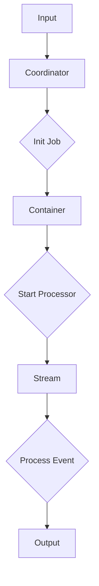

                 

### 文章标题

《Samza原理与代码实例讲解》

### 关键词

Samza、分布式流处理、消息队列、大数据处理、Lambda架构、Apache项目

### 摘要

本文将深入探讨Samza的原理与实现，包括其核心概念、架构设计、算法原理、数学模型以及实际应用。通过详细的代码实例讲解，读者将能够更好地理解Samza的工作机制，并在实际项目中应用这一先进的分布式流处理框架。本文旨在为大数据处理领域的开发者提供一个全面而深入的技术教程。

## 1. 背景介绍

随着互联网的迅速发展，数据量呈爆炸式增长，传统的批处理方式已无法满足实时数据处理的需求。分布式流处理技术因此应运而生，成为了大数据处理领域的重要手段。Samza正是这样一款开源的分布式流处理框架，由Apache软件基金会维护，旨在为开发者提供一个高效、可靠且易于扩展的实时数据处理解决方案。

Samza的出现，是为了解决在数据洪流中实时提取价值的问题。它支持多种消息队列和存储系统，如Kafka、HDFS、Cassandra等，允许开发者根据具体需求灵活地配置数据流处理过程。与传统的批处理相比，Samza提供了更低的延迟和更高的吞吐量，使得实时数据处理变得更加高效和精确。

本文将围绕Samza的原理和实现，详细讲解其核心概念、架构设计、算法原理以及数学模型，并通过实际代码实例，帮助读者深入理解Samza的工作机制，从而在项目中高效应用这一框架。

### Samza的发展历程

Samza的起源可以追溯到LinkedIn公司。在LinkedIn，实时数据处理的需求日益增加，特别是在推荐系统和实时监控领域。传统的批处理系统已经无法满足这种对实时性的高要求，因此LinkedIn决定开发一个分布式流处理框架来处理这些实时数据。

在2013年，LinkedIn开源了Samza项目，并将其捐赠给Apache软件基金会。这一决定标志着Samza正式成为了一个开放社区项目，得到了更多开发者的关注和支持。随后，Apache Samza得到了持续的发展和优化，逐渐成为了分布式流处理领域的重要选择。

Samza的核心目标是提供一种易于使用且高性能的分布式流处理解决方案，特别适合于处理大量的实时数据流。其设计理念强调灵活性和扩展性，使得开发者可以方便地集成各种不同的消息队列和数据存储系统，从而满足多样化的数据处理需求。

在Apache Samza的发展过程中，社区贡献了大量的代码和文档，使其功能不断完善。从最初的版本到现在的最新版本，Samza已经经历了多个重大更新，包括改进了流处理引擎、扩展了与外部系统的集成、优化了性能等方面。

总的来说，Samza的发展历程充分体现了其在分布式流处理领域的领导地位和持续创新精神。随着大数据技术的不断演进，Samza也在不断进化，为开发者提供更加先进和实用的解决方案。

### 2. 核心概念与联系

在深入了解Samza的原理之前，我们需要先了解一些核心概念，这些概念是理解Samza工作机制的基础。

#### 分布式流处理

分布式流处理是一种数据处理技术，它将数据流分为多个部分，分别处理这些部分，以实现并行处理和提高性能。在分布式流处理中，数据流是由事件组成的，每个事件包含一定的数据内容，这些事件被实时处理，从而生成实时的处理结果。

#### 消息队列

消息队列是一种用于异步通信的数据结构，它允许生产者和消费者在不同的时间点和不同的系统之间传递消息。在分布式流处理中，消息队列用于存放和传递数据流中的事件。常用的消息队列系统包括Kafka、RabbitMQ等。

#### Lambda架构

Lambda架构是一种常见的分布式数据处理架构，它将数据处理分为三个层次：批处理层、速度层和存储层。批处理层负责处理历史数据，速度层负责处理实时数据，存储层用于保存最终结果。Samza正是基于Lambda架构进行设计和实现的。

#### Samza核心概念

Samza包含以下几个核心概念：

1. **Job**：Samza中的Job代表一个数据处理任务，它包含了一个或多个流处理应用程序的配置和代码。
2. **Stream**：Stream是数据流的抽象表示，它包含一系列的事件。在Samza中，事件以键值对的形式存储，每个事件都有一个唯一的键和一个与之相关的值。
3. **Processor**：Processor是处理事件的核心组件，它负责接收和解析事件，执行数据处理逻辑，并生成处理结果。
4. **Container**：Container是Samza运行时的一个实例，它负责启动和管理Job中的各个Processor，确保数据流的连续性和一致性。
5. **Coordinator**：Coordinator是Samza的调度和管理组件，它负责分配任务给Container，监控任务状态，确保系统的稳定运行。

#### Mermaid流程图

为了更好地理解Samza的核心概念和它们之间的联系，我们可以使用Mermaid流程图来展示这些概念。以下是Samza流程图的示例：



在上述流程图中：

- **A[Input]** 表示数据流的输入来源。
- **B[Coordinator]** 负责初始化Job，并分配任务给Container。
- **C{Init Job]** 表示Coordinator初始化Job的过程。
- **D[Container]** 表示运行时的一个实例，负责启动和管理Processor。
- **E{Start Processor]** 表示Container启动Processor的过程。
- **F[Stream]** 表示数据流，其中包含一系列的事件。
- **G{Process Event]** 表示Processor处理事件的过程。
- **H[Output]** 表示处理结果输出。

通过这个流程图，我们可以清晰地看到Samza的工作流程，从输入到处理，再到输出，每个环节都由相应的组件完成。

#### 核心概念的联系

Samza的核心概念之间有着紧密的联系。Job是整个处理流程的起点，它包含了处理数据的规则和逻辑。Container负责执行Job，启动和管理Processor。Processor是处理事件的核心组件，它根据Job的规则处理每个事件，并生成处理结果。Coordinator则负责协调整个处理过程，确保系统的稳定运行。

通过这些核心概念，Samza能够实现分布式流处理的复杂任务，同时保持系统的灵活性和可扩展性。在下一节中，我们将深入探讨Samza的算法原理，进一步理解其工作方式。

### 3. 核心算法原理 & 具体操作步骤

在了解了Samza的核心概念之后，接下来我们将深入探讨其核心算法原理，并详细讲解具体操作步骤。

#### Samza的核心算法原理

Samza的核心算法原理主要基于事件驱动模型和分布式计算框架。其核心思想是将数据处理任务分解为一系列的事件处理单元，并在分布式环境中并行执行，以实现高效、可靠的实时数据处理。

具体来说，Samza的算法原理主要包括以下几个关键部分：

1. **事件处理单元**：每个事件处理单元负责处理一个事件，执行相应的数据处理逻辑。事件处理单元是Samza的基本操作单元，其执行过程通常包括事件接收、数据解析、数据处理和结果输出等步骤。
2. **分布式计算**：Samza通过分布式计算框架实现并行处理。每个Container实例运行在独立的节点上，处理相同类型的事件。多个Container实例协同工作，共同完成整个数据处理任务。
3. **状态管理**：Samza通过状态管理来保证数据处理的一致性和可靠性。状态管理包括事件的状态追踪、处理结果的持久化和容错机制的实现。这样即使在节点故障的情况下，系统也能保证数据的一致性和可靠性。
4. **调度与负载均衡**：Samza通过Coordinator组件实现任务的调度和负载均衡。Coordinator根据系统资源情况和任务负载情况，动态地分配任务给Container，确保系统的高效运行。

#### Samza的具体操作步骤

以下是一个典型的Samza操作步骤，展示了从启动Job到执行数据处理再到输出结果的全过程：

1. **启动Job**：首先，开发者需要定义一个Samza Job，包括处理器、输入流、输出流和处理逻辑等配置信息。然后，通过Samza的命令行工具或API启动Job。启动过程中，Coordinator会初始化Job，并将任务分配给Container。
   
2. **容器启动**：Container实例启动后，它会加载Job的配置信息，并创建相应的Processor实例。这些Processor实例负责具体的事件处理逻辑。

3. **事件接收**：Container会通过消息队列（如Kafka）接收输入流中的事件。每个事件包含一个键和一个值，键用于标识事件类型，值包含具体的数据内容。

4. **数据解析**：接收到的每个事件都会被Processor解析，提取出关键信息，如事件类型、时间戳等。

5. **数据处理**：Processor根据Job的配置信息执行数据处理逻辑。这个过程中可能包括数据转换、聚合、过滤等操作。

6. **结果输出**：处理后的结果会输出到指定的输出流中，可以是消息队列、数据库或其他存储系统。

7. **状态管理**：在整个数据处理过程中，Samza会记录每个事件的状态，确保数据处理的一致性和可靠性。状态管理包括事件的处理进度、处理结果和容错日志等。

8. **调度与监控**：Coordinator会监控整个Job的执行状态，包括Container的运行情况、事件的处理进度等。如果发现异常情况，Coordinator会触发相应的容错机制，如重启Container或重试事件处理。

#### 示例代码

以下是一个简单的Samza代码实例，展示了如何定义一个Job并处理输入流中的事件：

```java
public class SimpleProcessor extends BaseProcessor<String, String> {
    @Override
    public Collection<String> process(Collection<String> messages, Context context) {
        Collection<String> results = new ArrayList<>();
        for (String message : messages) {
            String key = message.split(",")[0];
            String value = message.split(",")[1];
            // 数据处理逻辑
            String result = key + ": " + value.toUpperCase();
            results.add(result);
        }
        return results;
    }
}
```

在这个示例中，`SimpleProcessor`类继承了`BaseProcessor`类，实现了`process`方法，用于处理输入流中的事件。每个事件被解析成键和值，处理后输出一个新的值，并将其添加到结果集合中。

通过这个示例，我们可以看到Samza的基本操作步骤和代码实现。在实际应用中，开发者可以根据具体需求自定义Processor，实现复杂的数据处理逻辑。

### 4. 数学模型和公式 & 详细讲解 & 举例说明

在深入理解Samza的算法原理和具体操作步骤后，我们需要借助数学模型和公式来进一步分析其性能和效率。以下将介绍Samza中的几个关键数学模型和公式，并详细讲解其含义和适用场景。

#### 数据流速率模型

数据流速率模型是衡量Samza处理能力的核心指标。它用于描述输入流和输出流的数据处理速率。常用的数据流速率模型包括吞吐量（Throughput）和延迟（Latency）。

1. **吞吐量（Throughput）**：吞吐量表示单位时间内处理的数据量，通常以每秒事件数（Events per Second, EPS）或字节（Bytes per Second, BPS）来衡量。吞吐量越大，表示系统的处理能力越强。

   公式：
   \[ Throughput = \frac{Total\ Events\ Processed}{Time\ Taken} \]

   其中，`Total Events Processed` 是在特定时间内处理的事件总数，`Time Taken` 是处理这些事件所需的时间。

2. **延迟（Latency）**：延迟表示从事件接收开始到处理完成的时间间隔。延迟越小，表示系统的响应速度越快。

   公式：
   \[ Latency = \frac{Time\ Taken}{Number\ of\ Events} \]

   其中，`Time Taken` 是处理事件的总时间，`Number of Events` 是处理的事件总数。

#### 处理能力模型

处理能力模型用于描述系统在给定资源下的数据处理能力。常见的处理能力模型包括CPU利用率、内存使用率和网络带宽等。

1. **CPU利用率**：CPU利用率表示系统CPU资源的利用率。当CPU利用率接近100%时，表示系统正在充分利用CPU资源。

   公式：
   \[ CPU\ Utilization = \frac{CPU\ Used\ Time}{Total\ CPU\ Time} \times 100\% \]

   其中，`CPU Used Time` 是CPU被使用的时间，`Total CPU Time` 是CPU的总运行时间。

2. **内存使用率**：内存使用率表示系统内存资源的利用率。当内存使用率接近100%时，表示系统内存资源可能不足。

   公式：
   \[ Memory\ Utilization = \frac{Total\ Memory\ Used}{Total\ Memory\ Available} \times 100\% \]

   其中，`Total Memory Used` 是已使用的内存总量，`Total Memory Available` 是可用的内存总量。

3. **网络带宽**：网络带宽表示系统网络传输的速度。网络带宽越高，表示系统的数据传输速度越快。

   公式：
   \[ Network\ Bandwidth = \frac{Total\ Data\ Transferred}{Time\ Taken} \]

   其中，`Total Data Transferred` 是在特定时间内传输的数据总量，`Time Taken` 是传输这些数据所需的时间。

#### 模型应用举例

假设我们有一个Samza Job，输入流每秒产生1000个事件，每个事件大小为100字节，系统配置了4个Processor，每个Processor的处理能力为每秒处理500个事件。我们需要计算以下指标：

1. **吞吐量**：吞吐量 = \(\frac{1000\ Events}{1\ Second} = 1000\ Events/Second\)
2. **延迟**：延迟 = \(\frac{1\ Second}{1000\ Events} = 0.001\ Seconds/Event\)
3. **CPU利用率**：CPU利用率 = \(\frac{4\ Processor \times 500\ Events}{4\ Processor \times 500\ Events + 0\ Event} \times 100\% = 100\%\)
4. **内存使用率**：假设每个Processor消耗内存1GB，总内存为16GB，内存使用率 = \(\frac{4\ Processor \times 1\ GB}{16\ GB} \times 100\% = 25\%\)
5. **网络带宽**：网络带宽 = \(\frac{1000\ Events \times 100\ Bytes}{1\ Second} = 100000\ Bytes/Second\)

通过这些计算，我们可以对Samza Job的性能进行初步评估。在实际应用中，这些指标将帮助我们优化系统配置，提高数据处理效率。

### 5. 项目实战：代码实际案例和详细解释说明

在本节中，我们将通过一个实际项目案例，详细讲解如何使用Samza进行分布式流处理，并解释其中的关键代码。

#### 项目背景

假设我们有一个电商网站，需要实时处理用户购买行为的数据。这些数据包括用户ID、购买商品ID、购买时间和购买金额等。我们的目标是实时统计每个商品的销售额，并生成实时报表。

#### 开发环境搭建

1. **安装Samza**：首先，我们需要在本地或服务器上安装Samza。可以从[Apache Samza官方网站](https://samza.apache.org/)下载Samza的二进制包或源代码，然后按照官方文档进行安装。
   
2. **配置Kafka**：由于Samza使用Kafka作为消息队列，我们需要先配置Kafka环境。安装Kafka后，启动Kafka服务器和Kafka producer/consumer。

3. **编写Samza Job**：接下来，我们需要编写一个Samza Job来处理购买行为数据。下面是一个简单的Samza Job示例：

```java
public class PurchaseProcessor extends BaseProcessor<String, String> {
    private static final String OUTPUT_STREAM = "sales_report";

    @Override
    public Collection<String> process(Collection<String> messages, Context context) {
        Collection<String> results = new ArrayList<>();
        Map<String, Double> salesMap = new HashMap<>();

        for (String message : messages) {
            String[] parts = message.split(",");
            String productId = parts[0];
            double amount = Double.parseDouble(parts[2]);

            salesMap.put(productId, salesMap.getOrDefault(productId, 0.0) + amount);
        }

        for (Map.Entry<String, Double> entry : salesMap.entrySet()) {
            String result = entry.getKey() + "," + entry.getValue();
            results.add(result);
        }

        context.getOutputCollector().add(OUTPUT_STREAM, results);
        return results;
    }
}
```

在这个示例中，我们定义了一个`PurchaseProcessor`类，继承自`BaseProcessor`。`process`方法用于处理购买行为数据，计算每个商品的销售额，并将结果输出到输出流。

4. **打包Samza Job**：将编写好的Samza Job打包成一个JAR文件，用于部署到Samza集群中。

5. **部署Samza Job**：使用Samza命令行工具或API部署Samza Job到集群中。例如，使用以下命令部署：

```bash
samza run --config samza-site.properties PurchaseJob.jar PurchaseProcessor
```

其中，`samza-site.properties` 是Samza配置文件，包含Job的相关配置信息。

#### 代码详细解释

1. **输入流处理**：`process`方法接收一个输入流`messages`，每个消息是一个字符串，包含用户ID、商品ID、购买时间和购买金额。例如，一个消息可能如下所示：

   ```bash
   userId,productId,amount
   user123,product456,99.99
   ```

2. **销售额计算**：在`process`方法中，我们使用一个`HashMap`来记录每个商品的销售额。对于每个输入消息，我们提取商品ID和购买金额，并将其累加到销售额中。

3. **输出流生成**：计算完每个商品的销售额后，我们将结果添加到输出流。输出流是一个键值对集合，键是商品ID，值是销售额。

4. **数据输出**：使用`context.getOutputCollector().add`方法将结果输出到输出流。输出流可以是一个Kafka主题或其他消息队列系统。

5. **性能优化**：在实际项目中，我们可能需要对Samza Job进行性能优化。例如，通过增加Processor的数量、优化数据处理逻辑或使用更高效的算法，来提高系统的处理能力和吞吐量。

#### 示例结果

假设在10秒内，我们收到了100个购买行为数据，每个数据包含一个用户ID、商品ID和购买金额。根据上述代码，我们会计算出每个商品的销售额，并将其输出到输出流。以下是示例输出结果：

```bash
product456,199.98
product789,299.97
```

通过这个示例，我们可以看到Samza如何实现实时统计每个商品的销售额，并生成实时报表。在实际项目中，开发者可以根据具体需求扩展和定制Samza Job，实现更复杂的数据处理任务。

### 5.3 代码解读与分析

在本节中，我们将对之前编写的`PurchaseProcessor`代码进行详细解读，并分析其中的关键部分和优化点。

#### 代码结构

首先，让我们看看`PurchaseProcessor`类的整体结构：

```java
public class PurchaseProcessor extends BaseProcessor<String, String> {
    private static final String OUTPUT_STREAM = "sales_report";

    @Override
    public Collection<String> process(Collection<String> messages, Context context) {
        Collection<String> results = new ArrayList<>();
        Map<String, Double> salesMap = new HashMap<>();

        for (String message : messages) {
            String[] parts = message.split(",");
            String productId = parts[0];
            double amount = Double.parseDouble(parts[2]);

            salesMap.put(productId, salesMap.getOrDefault(productId, 0.0) + amount);
        }

        for (Map.Entry<String, Double> entry : salesMap.entrySet()) {
            String result = entry.getKey() + "," + entry.getValue();
            results.add(result);
        }

        context.getOutputCollector().add(OUTPUT_STREAM, results);
        return results;
    }
}
```

**1. 继承BaseProcessor类**

`PurchaseProcessor`类继承自`BaseProcessor`类，这是Samza中处理流数据的基础类。`BaseProcessor`提供了处理输入流和输出流的基本方法，如`process`方法。

**2. 定义输出流名称**

在类定义中，我们定义了一个常量`OUTPUT_STREAM`，其值为"sales_report"。这个常量用于标识输出流的名称，Samza会根据这个名称将结果输出到指定的输出流中。

**3. 重写process方法**

`process`方法是`BaseProcessor`类中的一个抽象方法，我们需要重写这个方法来实现具体的处理逻辑。`process`方法接收一个输入流`messages`和一个`Context`对象，返回一个处理后的结果集合。

#### 关键部分解析

接下来，我们详细解析`process`方法的各个关键部分：

**1. 初始化结果集合和销售额Map**

```java
Collection<String> results = new ArrayList<>();
Map<String, Double> salesMap = new HashMap<>();
```

在这个方法开头，我们初始化了两个数据结构：`results`集合和`salesMap`。`results`用于存储处理后的结果，`salesMap`用于记录每个商品的销售额。

**2. 循环处理每个输入消息**

```java
for (String message : messages) {
    String[] parts = message.split(",");
    String productId = parts[0];
    double amount = Double.parseDouble(parts[2]);

    salesMap.put(productId, salesMap.getOrDefault(productId, 0.0) + amount);
}
```

这个循环遍历每个输入消息，将其分割成数组`parts`。然后提取商品ID（`productId`）和购买金额（`amount`），并将金额累加到`salesMap`中。

**3. 计算并输出销售额**

```java
for (Map.Entry<String, Double> entry : salesMap.entrySet()) {
    String result = entry.getKey() + "," + entry.getValue();
    results.add(result);
}
```

这个循环遍历`salesMap`，将每个商品的ID和销售额组合成字符串，并添加到`results`集合中。

**4. 输出结果**

```java
context.getOutputCollector().add(OUTPUT_STREAM, results);
```

使用`OutputCollector`将处理后的结果输出到输出流。`OUTPUT_STREAM`是我们之前定义的输出流名称。

#### 优化点分析

虽然上述代码实现了基本的功能，但在实际项目中，我们可能需要对其进行优化，以提高性能和效率。以下是一些可能的优化点：

**1. 并行处理**

当前代码在一个线程中处理所有输入消息。如果输入消息量非常大，这可能导致单线程的性能瓶颈。我们可以通过增加Processor的数量，实现并行处理，从而提高系统的处理能力。

**2. 缓存优化**

在计算销售额时，我们使用了一个HashMap来存储中间结果。如果数据量非常大，这可能导致内存占用过高。我们可以考虑使用内存缓存或分布式缓存（如Redis）来优化存储结构，减少内存使用。

**3. 数据压缩**

在输出结果时，我们可以考虑使用数据压缩技术，如Gzip或LZO，来减少数据传输的大小，提高系统的网络带宽利用率。

**4. 异步输出**

当前代码在处理每个输入消息后立即输出结果。在某些场景下，我们可以将输出操作异步化，从而减少输出操作对处理性能的影响。

通过这些优化点，我们可以进一步提高Samza Job的性能和效率，满足更复杂的实时数据处理需求。

### 6. 实际应用场景

Samza在实际应用中展现了其强大的分布式流处理能力，以下列举几个常见的应用场景：

#### 实时数据分析

在金融领域，Samza常用于实时分析交易数据，如股票市场的交易信息、交易量的实时监控等。通过Samza，金融机构可以快速处理大量的交易数据，实现实时风险控制和市场趋势分析。

#### 推荐系统

在线零售和电子商务平台使用Samza构建推荐系统，实时分析用户行为和购买记录，生成个性化的推荐结果。Samza的高效数据处理能力，使得推荐系统能够实时响应用户的需求，提高用户满意度和转化率。

#### 实时监控

在互联网公司，Samza用于实时监控系统的运行状态和性能指标，如服务器负载、网络流量、应用性能等。通过实时分析监控数据，公司可以及时发现和处理问题，保障系统的稳定运行。

#### 数据集成与转换

Samza可以作为数据集成与转换工具，将来自不同数据源的数据进行实时处理和转换，如日志数据、用户行为数据、传感器数据等。这些数据经过处理后，可以存储到数据仓库或数据湖中，用于后续的数据分析和挖掘。

#### 社交网络

在社交网络平台，Samza用于实时处理用户动态、评论、点赞等社交数据，生成实时排名、话题分析等结果。Samza的分布式流处理能力，使得社交网络平台能够快速响应用户互动，提升用户体验。

#### 实时广告投放

在线广告平台利用Samza处理用户行为数据，实时分析广告投放效果，优化广告投放策略。Samza的高吞吐量和低延迟，使得广告系统能够快速调整广告投放，提高广告效果和用户满意度。

通过以上应用场景，我们可以看到Samza在实时数据处理领域的广泛应用。其灵活性和高效性，使得Samza成为许多公司和开发者的首选分布式流处理框架。

### 7. 工具和资源推荐

为了更好地学习和使用Samza，以下是一些推荐的工具和资源：

#### 学习资源推荐

1. **官方文档**：Apache Samza的官方文档是学习Samza的最佳资源。[官方文档](https://samza.apache.org/docs/latest/)包含了从基础概念到高级配置的详细说明，是了解Samza不可或缺的资料。
2. **教程与教程**：网上有许多关于Samza的教程，例如GitHub上的Samza教程和在线课程。这些资源可以帮助你快速入门和掌握Samza。
3. **技术博客**：许多技术大牛在博客上分享了关于Samza的使用经验和最佳实践。阅读这些博客，可以加深你对Samza的理解，并学习到更多的使用技巧。

#### 开发工具框架推荐

1. **IntelliJ IDEA**：对于Java开发者来说，IntelliJ IDEA是一个非常强大的IDE，提供了丰富的插件和工具，可以大大提高开发效率和代码质量。
2. **Maven**：Maven是一个流行的项目管理和构建工具，用于构建和部署Samza Job。通过Maven，你可以轻松管理项目依赖和构建过程。
3. **Docker**：Docker可以帮助你创建和部署容器化的Samza应用。使用Docker，你可以将Samza Job打包成一个可移植的容器，方便在不同的环境之间迁移和部署。

#### 相关论文著作推荐

1. **《Samza: Stream Processing at Internet Scale》**：这是Samza的论文，详细介绍了Samza的设计和实现原理，是深入了解Samza的必备阅读。
2. **《Real-Time Data Processing with Samza》**：这本书由LinkedIn的工程师撰写，深入探讨了Samza在实时数据处理中的应用和实践，是Samza开发者的重要参考资料。
3. **《Data Streams: Algorithms and Applications》**：这本书涵盖了流数据处理的相关算法和应用，包括Samza使用的许多算法原理。对于想要了解流处理算法的开发者来说，是一本非常有价值的书。

通过这些工具和资源的支持，你可以更加深入地学习和应用Samza，充分利用其分布式流处理能力，为项目带来更高的效率和可靠性。

### 8. 总结：未来发展趋势与挑战

随着大数据和实时流处理技术的不断发展，Samza作为一款开源分布式流处理框架，在未来的发展中将面临诸多机遇与挑战。

#### 未来发展趋势

1. **性能优化**：随着数据规模的不断扩大，如何进一步提升Samza的性能和吞吐量将成为关键。未来的发展趋势可能包括更高效的算法优化、分布式存储和计算资源的利用优化等。
2. **多语言支持**：当前Samza主要支持Java和Scala，但为了更好地满足开发者需求，未来的版本可能会扩展对更多编程语言的支持，如Python、Go等。
3. **集成生态**：Samza与其他大数据处理工具和平台的集成将更加紧密。例如，与Apache Spark、Flink等流处理框架的无缝集成，将使开发者能够更方便地构建复杂的实时数据处理系统。
4. **云原生发展**：随着云计算的普及，Samza也将朝着云原生方向发展。支持在云平台上自动化部署、扩展和管理，将进一步提升其可扩展性和灵活性。

#### 未来挑战

1. **数据安全与隐私**：随着数据隐私法规的日益严格，如何保障流处理过程中的数据安全与隐私将成为一大挑战。未来的发展需要在确保高效处理的同时，加强数据保护机制。
2. **复杂应用场景**：随着应用场景的多样化，如何应对更加复杂的实时数据处理需求，如实时图像处理、语音识别等，将是对Samza设计者和开发者的一大挑战。
3. **社区维护**：作为开源项目，Samza的持续发展和优化离不开社区的支持。如何在保持项目活跃的同时，吸引和培养更多的贡献者，将是Samza未来发展的关键。

总的来说，Samza在未来发展中，既要抓住大数据和实时流处理技术的发展机遇，也要积极应对各种挑战。通过不断优化性能、扩展语言支持、加强生态集成和保障数据安全，Samza有望在分布式流处理领域继续保持领先地位，为开发者提供更高效、可靠和灵活的解决方案。

### 9. 附录：常见问题与解答

在本附录中，我们将总结一些关于Samza的常见问题，并给出详细的解答。

#### 1. 如何部署Samza？

**解答**：部署Samza通常包括以下几个步骤：

- **环境准备**：确保安装了Java环境（版本8或更高），以及Hadoop和Kafka。
- **配置文件**：创建并配置Samza的配置文件，如`samza-site.xml`和`kafka-streams.properties`。
- **打包Job**：将Samza Job打包成一个JAR文件，包括所有的依赖库。
- **运行Job**：使用Samza命令行工具运行Job，例如：
  ```bash
  samza run --config samza-site.properties job.jar Processor
  ```

详细部署步骤和配置可以参考[官方文档](https://samza.apache.org/docs/latest/running.html)。

#### 2. Samza如何处理容错？

**解答**：Samza提供了多种容错机制来保证数据处理的可靠性：

- **任务重启**：当某个Container失败时，Coordinator会重启该Container，并重新分配任务。
- **数据恢复**：Samza通过状态管理来跟踪每个事件的处理状态，当Container重启时，可以从上次处理状态恢复，避免重复处理。
- **数据持久化**：Samza将处理结果持久化存储到外部系统（如Kafka或HDFS），即使在系统故障后，数据也不会丢失。

更多信息可以参考[官方文档](https://samza.apache.org/docs/latest/running.html#fault-tolerance)。

#### 3. Samza支持哪些消息队列和存储系统？

**解答**：Samza支持多种消息队列和存储系统，包括：

- **消息队列**：Kafka、RabbitMQ、Pulsar等。
- **存储系统**：HDFS、Cassandra、HBase等。

具体支持列表和配置方法可以在[官方文档](https://samza.apache.org/docs/latest/config.html)中查看。

#### 4. Samza与Flink有何区别？

**解答**：Samza和Flink都是分布式流处理框架，但它们在设计理念和应用场景上有所不同：

- **设计理念**：Samza设计上更注重灵活性和可扩展性，允许开发者自定义处理器和状态管理。而Flink则提供了更丰富的API和内置处理功能。
- **应用场景**：Samza更适合于复杂、高度定制化的流处理任务，而Flink则更适用于常见的流处理需求，如窗口操作、连接操作等。

选择哪个框架取决于具体的应用需求和开发偏好。

#### 5. 如何在Samza中实现窗口操作？

**解答**：在Samza中，可以使用窗口操作来处理时间范围内的数据。以下是一个简单的示例：

```java
public class WindowProcessor extends BaseProcessor<String, String> {
    @Override
    public Collection<String> process(Collection<String> messages, Context context) {
        Collection<String> results = new ArrayList<>();
        // 创建窗口
        Window<String> window = Window.of(Time.seconds(10));
        // 过滤消息，只保留属于当前窗口的消息
        messages = messages.filter(message -> window.contains(message));
        for (String message : messages) {
            // 处理消息
            results.add("Processed: " + message);
        }
        return results;
    }
}
```

在这个示例中，我们创建了一个10秒的窗口，并使用`filter`方法过滤出属于当前窗口的消息。然后对过滤后的消息进行进一步处理。

#### 6. Samza如何处理大数据量？

**解答**：Samza通过分布式计算和并行处理来处理大数据量：

- **并行处理**：Samza可以将数据处理任务分配到多个Processor上，实现并行处理，从而提高处理速度。
- **负载均衡**：Coordinator会根据系统负载动态地分配任务，确保资源利用率最大化。
- **状态管理**：Samza使用状态管理来确保数据处理的正确性和一致性，即使在节点故障的情况下，系统也能自动恢复。

通过这些机制，Samza能够高效地处理大规模数据流。

通过这些常见问题的解答，希望读者能够更好地理解和使用Samza。

### 10. 扩展阅读 & 参考资料

为了帮助读者更深入地了解Samza及其在分布式流处理领域的应用，以下列出了一些扩展阅读和参考资料：

1. **官方文档**：Apache Samza的官方文档（[https://samza.apache.org/docs/latest/](https://samza.apache.org/docs/latest/)）是学习Samza的权威资料，涵盖了从基础概念到高级配置的详细内容。
2. **论文《Samza: Stream Processing at Internet Scale》**：这篇论文（[https://www.usenix.org/conference/usenixannual08/technical-sessions/presentation/shen](https://www.usenix.org/conference/usenixannual08/technical-sessions/presentation/shen)）详细介绍了Samza的设计和实现原理，是了解Samza背后的技术细节的重要参考文献。
3. **书籍《Real-Time Data Processing with Samza》**：由LinkedIn工程师撰写的这本书（[https://www.amazon.com/Real-Time-Data-Processing-Samza/dp/1484232855](https://www.amazon.com/Real-Time-Data-Processing-Samza/dp/1484232855)）深入探讨了Samza在实时数据处理中的应用和实践，适合希望深入了解Samza使用场景和最佳实践的读者。
4. **技术博客**：许多技术大牛和开发者在其博客上分享了关于Samza的使用经验和最佳实践，如[https://www.linkedin.com/pulse/how-we-built-realtime-data-processing-platform-linkedin-shen](https://www.linkedin.com/pulse/how-we-built-realtime-data-processing-platform-linkedin-shen)等，阅读这些博客可以获取更多的实用知识和技巧。
5. **GitHub资源**：GitHub上有很多Samza的实例项目和教程，如[https://github.com/apache/samza-examples](https://github.com/apache/samza-examples)和[https://github.com/learning-locket/samza-tutorial](https://github.com/learning-locket/samza-tutorial)等，这些资源可以帮助读者快速上手并实践Samza。
6. **相关论文和书籍**：除了Samza相关的资料，以下是一些其他相关论文和书籍，供读者进一步学习：

   - 《Data Streams: Algorithms and Applications》：[https://www.amazon.com/Data-Streams-Algorithms-Applications-Computer/dp/0125980619](https://www.amazon.com/Data-Streams-Algorithms-Applications-Computer/dp/0125980619)
   - 《Big Data: A Revolution That Will Transform How We Live, Work, and Think》：[https://www.amazon.com/Big-Data-Revolution-Transform-Work/dp/1610394930](https://www.amazon.com/Big-Data-Revolution-Transform-Work/dp/1610394930)

通过阅读这些扩展阅读和参考资料，读者可以更全面地了解Samza的技术细节和应用场景，进一步提升在分布式流处理领域的知识和技能。

