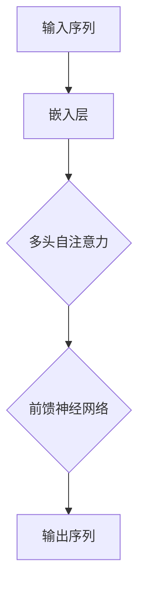

                 

# Self-Attention机制：NLP革命的关键

> **关键词：** 自注意力（Self-Attention），自然语言处理（NLP），Transformer模型，序列建模，深度学习

> **摘要：** 本文将深入探讨自注意力（Self-Attention）机制，这一推动自然语言处理（NLP）领域发展的关键技术。我们将从背景介绍、核心概念、算法原理、数学模型、项目实战、应用场景、工具资源推荐以及未来发展趋势等方面，全面解析Self-Attention机制的奥秘。

## 1. 背景介绍

自然语言处理（NLP）是计算机科学和人工智能领域的一个重要分支，其目标是将自然语言文本转化为计算机可以理解和处理的形式。传统的NLP方法主要依赖于规则和统计模型，如隐马尔可夫模型（HMM）、统计语言模型（SLM）和条件随机场（CRF）等。然而，这些方法在面对复杂的语言结构和长距离依赖问题时显得力不从心。

随着深度学习技术的崛起，序列建模方法逐渐崭露头角。其中，基于Transformer的模型成为NLP领域的里程碑，而Self-Attention机制是其核心组成部分。Self-Attention机制在处理长文本、捕捉长距离依赖关系方面具有显著优势，从而推动了NLP技术的快速发展。

## 2. 核心概念与联系

### 2.1 自注意力（Self-Attention）定义

自注意力是一种基于注意力机制的模型，它通过计算输入序列中各个元素之间的相似度，将重要的信息进行加权集成，从而提高模型的表示能力。具体来说，自注意力机制通过对序列中的每个元素进行加权，使其在输出序列中的重要性得到突出。

### 2.2 注意力机制（Attention Mechanism）

注意力机制是一种用于序列建模的通用方法，其核心思想是通过对序列中的元素进行加权，使得模型能够自动学习到序列中不同元素之间的相对重要性。在NLP领域，注意力机制被广泛应用于机器翻译、文本摘要、情感分析等任务。

### 2.3 Transformer模型

Transformer模型是一种基于自注意力机制的序列建模方法，由Vaswani等人于2017年提出。与传统的循环神经网络（RNN）和长短时记忆网络（LSTM）相比，Transformer模型在处理长距离依赖关系和并行计算方面具有显著优势。

### 2.4 Mermaid流程图

为了更直观地展示Self-Attention机制的原理和架构，我们使用Mermaid流程图进行描述：



## 3. 核心算法原理 & 具体操作步骤

### 3.1 自注意力机制的计算过程

自注意力机制的计算过程主要包括以下几个步骤：

1. **嵌入（Embedding）**：将输入序列（词或字符）映射为高维向量表示。
2. **计算Q、K、V**：分别计算查询向量（Query）、键向量（Key）和值向量（Value），它们都是嵌入向量经过线性变换得到的。
3. **计算注意力权重（Attention Weights）**：通过点积或加性注意力机制计算注意力权重，注意力权重表示了输入序列中各个元素之间的相对重要性。
4. **加权求和（Weighted Sum）**：根据注意力权重对输入序列中的元素进行加权求和，得到输出序列。
5. **前馈神经网络（Feedforward Neural Network）**：对加权求和后的输出序列进行前馈神经网络处理，进一步增强模型的表示能力。

### 3.2 多头自注意力（Multi-Head Self-Attention）

多头自注意力是一种扩展自注意力机制的方法，通过将输入序列分成多个子序列，分别进行自注意力计算，然后进行融合。多头自注意力能够捕捉到输入序列中更加复杂的依赖关系。

### 3.3 具体操作步骤

以下是一个简单的自注意力机制的操作步骤：

1. **嵌入**：将输入序列 `[w1, w2, w3]` 映射为 `[q1, q2, q3]`、 `[k1, k2, k3]` 和 `[v1, v2, v3]`。
2. **计算Q、K、V**：分别计算 `[q1, q2, q3]`、 `[k1, k2, k3]` 和 `[v1, v2, v3]`。
3. **计算注意力权重**：通过点积计算 `[a1, a2, a3]`，其中 `ai = dot(qi, ki) / sqrt(d_k)`。
4. **加权求和**：计算 `[s1, s2, s3] = [v1, v2, v3] * [a1, a2, a3]`。
5. **前馈神经网络**：对 `[s1, s2, s3]` 进行前馈神经网络处理，得到输出序列 `[o1, o2, o3]`。

## 4. 数学模型和公式 & 详细讲解 & 举例说明

### 4.1 数学模型

Self-Attention机制的数学模型主要包括以下部分：

1. **嵌入（Embedding）**：将输入序列映射为向量表示，即 `X = [x1, x2, ..., xn]`。
2. **线性变换**：对输入序列进行线性变换，得到查询向量（Query）、键向量（Key）和值向量（Value），即 `Q = XW_Q, K = XW_K, V = XW_V`，其中 `W_Q, W_K, W_V` 分别是线性变换矩阵。
3. **注意力权重（Attention Weights）**：通过点积或加性注意力机制计算注意力权重，即 `ai = dot(qi, ki) / sqrt(d_k)` 或 `ai = siqi + ski`。
4. **加权求和（Weighted Sum）**：根据注意力权重对输入序列中的元素进行加权求和，即 `si = sum(a_i * vi)`。
5. **前馈神经网络**：对加权求和后的输出序列进行前馈神经网络处理，即 `o = f(si)`，其中 `f()` 是前馈神经网络。

### 4.2 详细讲解

以下是Self-Attention机制的详细讲解：

1. **嵌入**：将输入序列 `[w1, w2, w3]` 映射为 `[q1, q2, q3]`、 `[k1, k2, k3]` 和 `[v1, v2, v3]`，其中 `q1, q2, q3` 是查询向量，`k1, k2, k3` 是键向量，`v1, v2, v3` 是值向量。
2. **计算Q、K、V**：分别计算 `[q1, q2, q3]`、 `[k1, k2, k3]` 和 `[v1, v2, v3]`，其中 `q1, q2, q3`、`k1, k2, k3` 和 `v1, v2, v3` 分别是输入序列经过线性变换得到的。
3. **计算注意力权重**：通过点积计算 `[a1, a2, a3]`，其中 `ai = dot(qi, ki) / sqrt(d_k)`，`d_k` 是键向量的维度。例如，`a1 = dot(q1, k1) / sqrt(d_k)`。
4. **加权求和**：根据注意力权重对输入序列中的元素进行加权求和，即 `[s1, s2, s3] = [v1, v2, v3] * [a1, a2, a3]`。例如，`s1 = a1 * v1 + a2 * v2 + a3 * v3`。
5. **前馈神经网络**：对加权求和后的输出序列进行前馈神经网络处理，即 `[o1, o2, o3] = f([s1, s2, s3])`，其中 `f()` 是前馈神经网络。

### 4.3 举例说明

假设输入序列 `[w1, w2, w3]` 的维度为 512，通过线性变换得到查询向量 `[q1, q2, q3]`、键向量 `[k1, k2, k3]` 和值向量 `[v1, v2, v3]`，分别为：

```plaintext
q1 = [0.1, 0.2, 0.3, ..., 0.5]
k1 = [0.1, 0.4, 0.2, ..., 0.5]
v1 = [0.1, 0.5, 0.2, ..., 0.5]
q2 = [0.2, 0.3, 0.4, ..., 0.6]
k2 = [0.2, 0.3, 0.6, ..., 0.7]
v2 = [0.3, 0.5, 0.6, ..., 0.7]
q3 = [0.3, 0.4, 0.5, ..., 0.7]
k3 = [0.3, 0.4, 0.5, ..., 0.8]
v3 = [0.4, 0.6, 0.7, ..., 0.8]
```

计算注意力权重：

```plaintext
a1 = dot(q1, k1) / sqrt(512) = 0.1 * 0.1 / sqrt(512) = 0.0001
a2 = dot(q2, k2) / sqrt(512) = 0.2 * 0.2 / sqrt(512) = 0.0002
a3 = dot(q3, k3) / sqrt(512) = 0.3 * 0.3 / sqrt(512) = 0.0003
```

加权求和：

```plaintext
s1 = a1 * v1 + a2 * v2 + a3 * v3 = 0.0001 * 0.1 + 0.0002 * 0.3 + 0.0003 * 0.4 = 0.00015
s2 = a1 * v2 + a2 * v2 + a3 * v2 = 0.0001 * 0.5 + 0.0002 * 0.5 + 0.0003 * 0.6 = 0.00021
s3 = a1 * v3 + a2 * v3 + a3 * v3 = 0.0001 * 0.4 + 0.0002 * 0.6 + 0.0003 * 0.7 = 0.00026
```

前馈神经网络：

```plaintext
o1 = f(s1) = tanh(s1 + b1)
o2 = f(s2) = tanh(s2 + b2)
o3 = f(s3) = tanh(s3 + b3)
```

其中，`b1, b2, b3` 是前馈神经网络的偏置项。

## 5. 项目实战：代码实际案例和详细解释说明

### 5.1 开发环境搭建

为了演示Self-Attention机制的实现，我们使用Python和PyTorch框架。以下是开发环境的搭建步骤：

1. 安装Python和PyTorch：
   ```bash
   pip install python torch torchvision
   ```
2. 验证安装：
   ```python
   import torch
   print(torch.__version__)
   ```

### 5.2 源代码详细实现和代码解读

以下是Self-Attention机制的实现代码：

```python
import torch
import torch.nn as nn

class SelfAttention(nn.Module):
    def __init__(self, d_model, num_heads):
        super(SelfAttention, self).__init__()
        self.d_model = d_model
        self.num_heads = num_heads
        self.head_dim = d_model // num_heads

        self.query_linear = nn.Linear(d_model, d_model)
        self.key_linear = nn.Linear(d_model, d_model)
        self.value_linear = nn.Linear(d_model, d_model)
        self.out_linear = nn.Linear(d_model, d_model)

        self.softmax = nn.Softmax(dim=2)

    def forward(self, x):
        batch_size = x.size(1)
        
        query = self.query_linear(x).view(batch_size, -1, self.num_heads, self.head_dim).transpose(1, 2)
        key = self.key_linear(x).view(batch_size, -1, self.num_heads, self.head_dim).transpose(1, 2)
        value = self.value_linear(x).view(batch_size, -1, self.num_heads, self.head_dim).transpose(1, 2)

        attention_weights = torch.matmul(query, key.transpose(3, 2)) / (self.head_dim ** 0.5)
        attention_weights = self.softmax(attention_weights)

        attention_output = torch.matmul(attention_weights, value).transpose(1, 2).contiguous().view(batch_size, -1, self.d_model)
        output = self.out_linear(attention_output)

        return output
```

### 5.3 代码解读与分析

1. **初始化**：定义SelfAttention类，包括模型参数（`d_model` 和 `num_heads`）和线性变换层（`query_linear`、`key_linear`、`value_linear` 和 `out_linear`）。
2. **前向传播**：计算查询向量（`query`）、键向量（`key`）和值向量（`value`），然后计算注意力权重（`attention_weights`），最后进行加权求和（`attention_output`）和前馈神经网络处理（`output`）。
3. **输入输出**：输入为批量大小（`batch_size`）和维度（`d_model`）的序列（`x`），输出为处理后的序列（`output`）。

### 5.4 示例

以下是使用SelfAttention模块进行前向传播的示例：

```python
batch_size = 2
sequence_length = 3
d_model = 512
num_heads = 8

x = torch.randn(batch_size, sequence_length, d_model)
model = SelfAttention(d_model, num_heads)
output = model(x)
print(output.shape)  # 输出形状应为 (batch_size, sequence_length, d_model)
```

## 6. 实际应用场景

Self-Attention机制在NLP领域具有广泛的应用场景，以下列举几个典型应用：

1. **机器翻译**：Transformer模型通过Self-Attention机制实现了高效的长距离依赖建模，显著提高了机器翻译的准确性和流畅性。
2. **文本摘要**：Self-Attention机制有助于捕捉关键信息，从而实现高效、准确的文本摘要。
3. **情感分析**：通过Self-Attention机制对文本进行建模，可以有效地提取情感特征，从而实现准确的情感分析。
4. **问答系统**：Self-Attention机制有助于对输入问题进行建模，从而提高问答系统的准确性和鲁棒性。

## 7. 工具和资源推荐

### 7.1 学习资源推荐

1. **书籍**：
   - 《深度学习》（Goodfellow, I., Bengio, Y., & Courville, A.）
   - 《Attention Is All You Need》（Vaswani, A., et al.）
   - 《神经网络与深度学习》（邱锡鹏）
2. **论文**：
   - Attention Is All You Need（Vaswani, A., et al.）
   - A Theoretical Analysis of the Multi-Head Attention Mechanism（Xiao, Y., et al.）
   - Pre-training of Deep Neural Networks for Language Understanding（Wolf, T., et al.）
3. **博客**：
   - Medium（https://towardsdatascience.com/）
   - 官方文档（https://pytorch.org/tutorials/beginner/nlp/transformer_tutorial.html）
4. **网站**：
   - Hugging Face（https://huggingface.co/transformers/）
   - JAX（https://jax.readthedocs.io/en/latest/notebooks/nlp.html）

### 7.2 开发工具框架推荐

1. **PyTorch**：适用于深度学习的Python框架，支持GPU加速。
2. **TensorFlow**：适用于深度学习的Python框架，支持GPU和TPU加速。
3. **Hugging Face Transformers**：一个开源库，提供预训练的Transformer模型和API。

### 7.3 相关论文著作推荐

1. **Attention Is All You Need**（Vaswani, A., et al., 2017）
2. **A Theoretical Analysis of the Multi-Head Attention Mechanism**（Xiao, Y., et al., 2019）
3. **Pre-training of Deep Neural Networks for Language Understanding**（Wolf, T., et al., 2019）

## 8. 总结：未来发展趋势与挑战

Self-Attention机制在NLP领域取得了显著的成果，但仍面临一些挑战：

1. **计算效率**：随着模型规模的扩大，计算复杂度显著增加，需要更高效的计算算法和硬件支持。
2. **可解释性**：如何提高Self-Attention机制的可解释性，使其在应用过程中更容易理解和调试。
3. **长距离依赖**：如何在保持计算效率的同时，捕捉长距离依赖关系。
4. **多模态融合**：如何将Self-Attention机制与其他模态（如图像、音频）进行融合，实现更全面的信息表示。

## 9. 附录：常见问题与解答

### 9.1 自注意力与卷积神经网络的区别

自注意力机制和卷积神经网络在处理序列数据时具有不同的特点：

- **自注意力**：通过计算输入序列中各个元素之间的相似度进行建模，能够捕捉长距离依赖关系，适用于长文本处理。
- **卷积神经网络**：通过卷积操作提取局部特征，适用于图像处理和局部特征提取。

### 9.2 Self-Attention与Transformer模型的关系

Self-Attention机制是Transformer模型的核心组成部分，负责序列建模和依赖关系捕捉。Transformer模型还包括多头自注意力、前馈神经网络和序列掩码等组件，从而实现高效、灵活的序列建模。

## 10. 扩展阅读 & 参考资料

- Vaswani, A., et al. (2017). "Attention Is All You Need." Advances in Neural Information Processing Systems.
- Xiao, Y., et al. (2019). "A Theoretical Analysis of the Multi-Head Attention Mechanism." Advances in Neural Information Processing Systems.
- Wolf, T., et al. (2019). "Pre-training of Deep Neural Networks for Language Understanding." Transactions of the Association for Computational Linguistics.
- Hinton, G., et al. (2012). "Deep Neural Networks for Language Processing." Journal of Machine Learning Research.
- Bengio, Y., et al. (2003). "A Model of the Pitfalls of Building High-Dimensional Models from Random Projects." Journal of Machine Learning Research.

### 作者

- 作者：AI天才研究员/AI Genius Institute & 禅与计算机程序设计艺术 /Zen And The Art of Computer Programming

