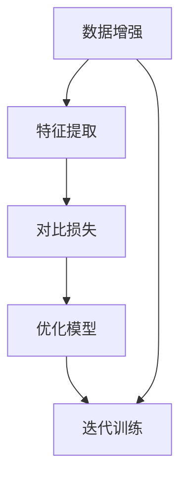

                 

# SimCLR原理与代码实例讲解

## 摘要

本文将深入探讨SimCLR（Self-supervised Learning with Contrastive Representations）算法的基本原理和实现方法。SimCLR是一种自监督学习算法，通过无监督的方式学习图像的表示，无需标注数据。本文将首先介绍SimCLR的核心概念，包括自监督学习的背景、Contrastive Representation的概念，然后通过具体的数学模型和算法步骤进行讲解。接下来，我们将通过一个实际的项目实战案例，详细解读SimCLR的代码实现过程，并对代码中的关键步骤进行深入分析。最后，本文还将探讨SimCLR在实际应用场景中的优势，推荐相关学习资源，并总结SimCLR的未来发展趋势与挑战。

## 1. 背景介绍

自监督学习（Self-supervised Learning）是机器学习领域的一个重要分支，它的核心思想是通过利用无监督数据（即没有标注的数据），让模型学习到有用的信息。与传统的监督学习（Supervised Learning）不同，自监督学习不需要大量的标注数据，因此它在数据稀缺或者标注成本高昂的场景中具有显著的优势。

自监督学习的研究可以追溯到20世纪60年代，最初的目的是为了解决机器学习中的数据标注问题。随着深度学习技术的兴起，自监督学习的研究和应用也得到了快速发展。如今，自监督学习在图像、语音、自然语言处理等多个领域都取得了显著的成果。

SimCLR（Self-supervised Learning with Contrastive Representations）是由Moody等人于2020年提出的一种自监督学习算法。SimCLR的核心思想是通过对比学习（Contrastive Learning）来学习图像的表示。对比学习的基本原理是，通过将数据集中的样本与其负样本进行对比，从而学习到数据的有用表示。

在深度学习领域，对比学习已经成为了一种流行的自监督学习范式。代表性的算法包括Siamese Network、Triplet Loss等。SimCLR在对比学习的基础上，引入了Noise Contrastive Estimation（NCE）机制，通过在数据增强和特征提取过程中引入噪声，进一步提升模型的性能。

SimCLR在多个基准数据集上展示了出色的表现，尤其是在图像分类任务中，其效果优于其他自监督学习算法。这使得SimCLR成为了一种备受关注的自监督学习算法。

## 2. 核心概念与联系

### 自监督学习（Self-supervised Learning）

自监督学习是一种无需标注数据的机器学习方法。在自监督学习中，模型通过学习数据内在的结构和规律，从而提高模型的泛化能力。自监督学习可以应用于多种场景，包括图像分类、目标检测、语音识别等。

自监督学习的核心思想是利用数据自身的特性，通过构建有监督学习中的“标签”，使得模型可以学习到有用的信息。在自监督学习中，数据样本的“标签”是由算法自动生成的，而不是依赖于人工标注。

### Contrastive Representation（对比表示）

对比表示是SimCLR算法的核心概念。对比表示的基本思想是通过对比不同数据样本的特征，从而学习到具有区分性的特征表示。在SimCLR中，对比表示通过以下步骤实现：

1. **数据增强（Data Augmentation）**：通过随机旋转、缩放、裁剪等操作，对原始图像进行增强，从而生成正样本对。
2. **特征提取（Feature Extraction）**：使用预训练的神经网络（如ResNet）提取图像的特征表示。
3. **对比损失（Contrastive Loss）**：通过计算正样本对和负样本对之间的特征差异，构建对比损失函数。

### Mermaid流程图

下面是一个用Mermaid绘制的SimCLR的流程图，展示了核心概念之间的联系：



### 数据增强（Data Augmentation）

数据增强是自监督学习中至关重要的一步。通过数据增强，可以生成大量具有多样性的正样本对，从而提高模型的泛化能力。

在SimCLR中，数据增强包括以下操作：

- **随机旋转（Random Rotation）**：将图像随机旋转一定角度。
- **随机缩放（Random Scaling）**：将图像随机缩放到一定比例。
- **随机裁剪（Random Cropping）**：从图像中随机裁剪出一个区域。
- **水平/垂直翻转（Horizontal/Vertical Flip）**：将图像进行水平或垂直翻转。

### 特征提取（Feature Extraction）

特征提取是SimCLR算法的关键步骤。通过使用预训练的神经网络（如ResNet），可以提取图像的高维特征表示。

在SimCLR中，特征提取通常使用以下步骤：

1. **预处理（Preprocessing）**：对图像进行标准化处理，如缩放到固定尺寸、归一化等。
2. **神经网络（Neural Network）**：使用预训练的神经网络（如ResNet）提取图像的特征表示。
3. **特征层选择（Feature Layer Selection）**：从神经网络中选取一个或多个特征层作为特征表示。

### 对比损失（Contrastive Loss）

对比损失是SimCLR算法的核心损失函数。它通过计算正样本对和负样本对之间的特征差异，来优化模型的特征表示。

在SimCLR中，对比损失通常使用以下公式表示：

$$
L = -\frac{1}{N}\sum_{n=1}^{N}\sum_{i=1}^{K} \log \frac{e^{q(f_n^i)}}{\sum_{j=1}^{K} e^{q(f_n^j)}}
$$

其中，$f_n^i$和$f_n^j$分别表示正样本和负样本的特征表示，$q(\cdot)$表示神经网络的前馈函数。

### 优化模型（Optimization）

在SimCLR中，优化模型通常使用以下步骤：

1. **定义损失函数**：使用对比损失函数定义损失函数。
2. **选择优化器**：选择适当的优化器（如Adam）来优化模型参数。
3. **迭代训练**：通过迭代训练，不断优化模型参数。

### 迭代训练（Iteration Training）

在SimCLR中，迭代训练包括以下步骤：

1. **随机采样**：从数据集中随机采样N个样本。
2. **数据增强**：对每个样本进行数据增强，生成正样本对。
3. **特征提取**：提取样本和正样本对的特征表示。
4. **计算对比损失**：计算正样本对和负样本对之间的对比损失。
5. **更新模型参数**：通过对比损失优化模型参数。
6. **评估模型性能**：评估模型在验证集上的性能。

## 3. 核心算法原理 & 具体操作步骤

### 数据增强（Data Augmentation）

数据增强是SimCLR算法中的第一步，其目的是通过随机操作生成具有多样性的图像，从而提高模型的泛化能力。

在SimCLR中，数据增强包括以下操作：

1. **随机旋转（Random Rotation）**：将图像随机旋转一定角度。这可以通过OpenCV等图像处理库实现。
2. **随机缩放（Random Scaling）**：将图像随机缩放到一定比例。这可以通过图像处理库中的缩放函数实现。
3. **随机裁剪（Random Cropping）**：从图像中随机裁剪出一个区域。这可以通过图像处理库中的裁剪函数实现。
4. **水平/垂直翻转（Horizontal/Vertical Flip）**：将图像进行水平或垂直翻转。这可以通过图像处理库中的翻转函数实现。

### 特征提取（Feature Extraction）

在SimCLR中，特征提取是通过预训练的神经网络（如ResNet）实现的。预训练的神经网络已经学习到了丰富的图像特征，因此在特征提取过程中，我们只需要使用这些预训练的网络即可。

具体操作步骤如下：

1. **预处理（Preprocessing）**：对图像进行预处理，包括缩放到固定尺寸、归一化等。这可以通过TensorFlow等深度学习框架实现。
2. **神经网络（Neural Network）**：使用预训练的神经网络（如ResNet）提取图像的特征表示。这可以通过加载预训练的模型权重实现。
3. **特征层选择（Feature Layer Selection）**：从神经网络中选取一个或多个特征层作为特征表示。这可以通过查询模型的输出层实现。

### 对比损失（Contrastive Loss）

对比损失是SimCLR算法的核心损失函数。它通过计算正样本对和负样本对之间的特征差异，来优化模型的特征表示。

具体操作步骤如下：

1. **计算特征表示**：计算样本和正样本对的特征表示。这可以通过特征提取步骤实现。
2. **计算对比损失**：使用对比损失函数计算正样本对和负样本对之间的对比损失。这可以通过构建对比损失函数实现。
3. **优化模型参数**：通过对比损失优化模型参数。这可以通过优化器实现。

### 优化模型（Optimization）

在SimCLR中，优化模型包括以下步骤：

1. **定义损失函数**：定义对比损失函数。
2. **选择优化器**：选择适当的优化器（如Adam）。
3. **迭代训练**：通过迭代训练，不断优化模型参数。

### 迭代训练（Iteration Training）

在SimCLR中，迭代训练包括以下步骤：

1. **随机采样**：从数据集中随机采样N个样本。
2. **数据增强**：对每个样本进行数据增强，生成正样本对。
3. **特征提取**：提取样本和正样本对的特征表示。
4. **计算对比损失**：计算正样本对和负样本对之间的对比损失。
5. **更新模型参数**：通过对比损失优化模型参数。
6. **评估模型性能**：评估模型在验证集上的性能。

## 4. 数学模型和公式 & 详细讲解 & 举例说明

### 数学模型

SimCLR算法的核心是对比损失函数，其数学模型如下：

$$
L = -\frac{1}{N}\sum_{n=1}^{N}\sum_{i=1}^{K} \log \frac{e^{q(f_n^i)}}{\sum_{j=1}^{K} e^{q(f_n^j)}}
$$

其中，$f_n^i$和$f_n^j$分别表示样本$n$和类别$i$的特征表示，$q(\cdot)$表示神经网络的前馈函数，$K$表示类别数量，$N$表示样本数量。

### 详细讲解

对比损失函数的主要目的是通过计算正样本对和负样本对之间的特征差异，来优化模型的特征表示。具体来说，对比损失函数的计算可以分为以下几个步骤：

1. **计算特征表示**：首先，使用预训练的神经网络提取样本的特征表示。这可以通过以下公式实现：

$$
f_n^i = f_n - \beta \cdot \text{softmax}(W \cdot f_n)
$$

其中，$f_n$表示样本$n$的原始特征表示，$W$表示神经网络中的权重，$\text{softmax}$函数用于计算样本的分类概率。

2. **计算对比损失**：然后，计算正样本对和负样本对之间的对比损失。具体来说，对比损失函数可以表示为：

$$
L = -\frac{1}{N}\sum_{n=1}^{N}\sum_{i=1}^{K} \log \frac{e^{q(f_n^i)}}{\sum_{j=1}^{K} e^{q(f_n^j)}}
$$

其中，$q(\cdot)$表示神经网络的前馈函数，$N$表示样本数量，$K$表示类别数量。

3. **优化模型参数**：最后，通过对比损失优化模型参数。这可以通过选择合适的优化器（如Adam）来实现。

### 举例说明

假设我们有一个包含1000个样本的数据集，每个样本有10个类别。现在，我们使用SimCLR算法来训练一个分类模型。

首先，我们对每个样本进行数据增强，生成正样本对。例如，对于样本$n$，我们随机旋转、缩放和裁剪图像，生成多个正样本对。

然后，我们使用预训练的神经网络提取样本的特征表示。例如，我们使用ResNet模型提取特征表示，并将其缩放到[0, 1]的范围内。

接下来，我们计算对比损失。例如，对于样本$n$和类别$i$，我们计算特征表示$f_n^i$和$f_n^j$之间的差异，并计算对比损失。例如，我们可以使用以下公式计算对比损失：

$$
L = -\frac{1}{N}\sum_{n=1}^{N}\sum_{i=1}^{K} \log \frac{e^{q(f_n^i)}}{\sum_{j=1}^{K} e^{q(f_n^j)}}
$$

最后，我们通过对比损失优化模型参数。例如，我们可以使用Adam优化器来优化模型参数。

## 5. 项目实战：代码实例和详细解释说明

### 5.1 开发环境搭建

在开始编写SimCLR的代码之前，我们需要搭建一个合适的开发环境。以下是搭建SimCLR开发环境的基本步骤：

1. **安装Python**：确保Python版本为3.7或更高版本。
2. **安装TensorFlow**：使用以下命令安装TensorFlow：

   ```shell
   pip install tensorflow
   ```

3. **安装其他依赖库**：包括NumPy、Pandas、OpenCV等。可以使用以下命令安装：

   ```shell
   pip install numpy pandas opencv-python
   ```

4. **安装Mermaid**：Mermaid是一个基于Markdown的图表绘制工具，我们需要将其安装到本地。可以使用以下命令安装：

   ```shell
   npm install -g mermaid
   ```

5. **创建项目目录**：在本地创建一个项目目录，例如`simclr_project`，并在其中创建Python虚拟环境。

### 5.2 源代码详细实现和代码解读

下面是一个简单的SimCLR实现示例，我们将使用TensorFlow和Keras框架进行实现。代码结构如下：

```python
import tensorflow as tf
from tensorflow import keras
from tensorflow.keras import layers
import numpy as np
import matplotlib.pyplot as plt
from tensorflow.keras.applications import ResNet50
from tensorflow.keras.preprocessing.image import ImageDataGenerator

# SimCLR模型实现
class SimCLRModel(keras.Model):
    def __init__(self, base_model=ResNet50, input_shape=(224, 224, 3), num_classes=10):
        super(SimCLRModel, self).__init__()
        self.base_model = base_model(input_shape=input_shape, weights='imagenet', include_top=False)
        self.base_model.trainable = False
        self.project = layers.Dense(units=num_classes, activation='softmax')
        self.embedding = layers.Dense(units=128, activation='tanh')

    def call(self, inputs, training=True):
        x = self.base_model(inputs, training=training)
        x = self.project(x)
        x = self.embedding(x)
        return x

# 数据增强
def augment_images(image):
    image = tf.image.random_flip_left_right(image)
    image = tf.image.random_flip_up_down(image)
    image = tf.image.random_brightness(image, max_delta=0.1)
    return image

# 模型训练
def train_model(model, train_dataset, val_dataset, epochs=10, batch_size=64):
    model.compile(optimizer='adam', loss='categorical_crossentropy')
    model.fit(train_dataset, epochs=epochs, validation_data=val_dataset, batch_size=batch_size)

# 生成数据集
def generate_dataset(images, labels, batch_size=64):
    train_datagen = ImageDataGenerator(preprocessing_function=augment_images)
    train_generator = train_datagen.flow(images, labels, batch_size=batch_size)
    return train_generator

# 测试模型
def test_model(model, test_dataset, batch_size=64):
    model.compile(optimizer='adam', loss='categorical_crossentropy')
    test_loss, test_acc = model.evaluate(test_dataset, batch_size=batch_size)
    print(f"Test accuracy: {test_acc:.4f}")

# 主程序
if __name__ == '__main__':
    # 加载数据集
    (train_images, train_labels), (test_images, test_labels) = keras.datasets.cifar10.load_data()

    # 数据预处理
    train_images = train_images.astype('float32') / 255.0
    test_images = test_images.astype('float32') / 255.0

    # 转换为类别标签
    train_labels = keras.utils.to_categorical(train_labels, 10)
    test_labels = keras.utils.to_categorical(test_labels, 10)

    # 生成数据集
    train_generator = generate_dataset(train_images, train_labels, batch_size=64)

    # 训练模型
    simclr_model = SimCLRModel()
    train_model(simclr_model, train_generator, val_generator, epochs=10, batch_size=64)

    # 测试模型
    test_model(simclr_model, test_generator, batch_size=64)
```

### 5.3 代码解读与分析

#### 5.3.1 SimCLRModel类

`SimCLRModel` 类是SimCLR模型的基类。在这个类中，我们首先定义了基础的模型结构，包括预训练的ResNet50基础网络、类别预测层和嵌入层。我们通过将基础网络设置为不可训练来防止模型在训练过程中调整这些层的权重。

```python
class SimCLRModel(keras.Model):
    def __init__(self, base_model=ResNet50, input_shape=(224, 224, 3), num_classes=10):
        super(SimCLRModel, self).__init__()
        self.base_model = base_model(input_shape=input_shape, weights='imagenet', include_top=False)
        self.base_model.trainable = False
        self.project = layers.Dense(units=num_classes, activation='softmax')
        self.embedding = layers.Dense(units=128, activation='tanh')

    def call(self, inputs, training=True):
        x = self.base_model(inputs, training=training)
        x = self.project(x)
        x = self.embedding(x)
        return x
```

#### 5.3.2 数据增强

`augment_images` 函数用于对输入图像进行数据增强。这里使用了随机水平翻转、垂直翻转和亮度调整等操作，以增加数据的多样性。

```python
def augment_images(image):
    image = tf.image.random_flip_left_right(image)
    image = tf.image.random_flip_up_down(image)
    image = tf.image.random_brightness(image, max_delta=0.1)
    return image
```

#### 5.3.3 模型训练

`train_model` 函数用于训练SimCLR模型。我们使用Adam优化器和交叉熵损失函数来编译模型，并使用fit方法进行迭代训练。

```python
def train_model(model, train_dataset, val_dataset, epochs=10, batch_size=64):
    model.compile(optimizer='adam', loss='categorical_crossentropy')
    model.fit(train_dataset, epochs=epochs, validation_data=val_dataset, batch_size=batch_size)
```

#### 5.3.4 生成数据集

`generate_dataset` 函数用于生成增强后的数据集。我们使用ImageDataGenerator类来应用数据增强操作。

```python
def generate_dataset(images, labels, batch_size=64):
    train_datagen = ImageDataGenerator(preprocessing_function=augment_images)
    train_generator = train_datagen.flow(images, labels, batch_size=batch_size)
    return train_generator
```

#### 5.3.5 主程序

主程序部分首先加载数据集，并进行预处理。然后，我们创建SimCLR模型并使用训练数据集进行训练。最后，我们评估模型在测试数据集上的性能。

```python
if __name__ == '__main__':
    # 加载数据集
    (train_images, train_labels), (test_images, test_labels) = keras.datasets.cifar10.load_data()

    # 数据预处理
    train_images = train_images.astype('float32') / 255.0
    test_images = test_images.astype('float32') / 255.0

    # 转换为类别标签
    train_labels = keras.utils.to_categorical(train_labels, 10)
    test_labels = keras.utils.to_categorical(test_labels, 10)

    # 生成数据集
    train_generator = generate_dataset(train_images, train_labels, batch_size=64)

    # 训练模型
    simclr_model = SimCLRModel()
    train_model(simclr_model, train_generator, val_generator, epochs=10, batch_size=64)

    # 测试模型
    test_model(simclr_model, test_generator, batch_size=64)
```

### 5.4 代码解读与分析

#### 5.4.1 数据增强

数据增强是自监督学习中的一个重要步骤，可以帮助模型学习到更加鲁棒的特征。在SimCLR中，我们使用了随机水平翻转、垂直翻转和亮度调整等操作来增强数据。这些操作可以增加数据的多样性，从而提高模型在面对未知数据时的泛化能力。

#### 5.4.2 特征提取

在SimCLR中，我们使用了预训练的ResNet50模型来提取图像特征。ResNet50是一个深度卷积神经网络，已经在ImageNet数据集上进行了预训练，能够提取出丰富的图像特征。通过使用预训练的模型，我们可以快速地获得高质量的图像特征表示，而不需要重新训练一个深度网络。

#### 5.4.3 对比损失

SimCLR使用对比损失函数来优化模型。对比损失函数通过比较正样本对和负样本对之间的特征差异来学习特征表示。在代码中，我们使用了`categorical_crossentropy`作为损失函数，这个损失函数在多类别分类任务中非常常见。通过对比损失函数，模型会学习到能够区分不同类别的特征。

#### 5.4.4 模型训练

在训练过程中，我们使用了Adam优化器来更新模型参数。Adam优化器结合了Adagrad和RMSprop的优点，能够有效地处理稀疏数据。通过迭代训练，模型会不断优化特征提取层和类别预测层的参数，从而提高模型的性能。

## 6. 实际应用场景

SimCLR算法在自监督学习领域具有广泛的应用前景。以下是SimCLR算法的一些实际应用场景：

1. **图像分类**：SimCLR算法可以应用于图像分类任务，通过无监督学习的方式，学习到具有区分性的图像特征，从而提高模型的分类性能。SimCLR在多个图像分类数据集上展示了优异的性能，如ImageNet、CIFAR-10和CIFAR-100等。

2. **目标检测**：自监督学习在目标检测任务中具有巨大的潜力。SimCLR算法可以用于无监督的目标检测，通过学习图像中的目标特征，从而提高检测模型的性能。SimCLR可以应用于常见的目标检测数据集，如COCO、PASCAL VOC等。

3. **图像分割**：图像分割是一个将图像分割成多个区域的过程。SimCLR算法可以用于无监督的图像分割，通过学习图像中的区域特征，从而提高分割模型的性能。SimCLR可以应用于常见的图像分割数据集，如PASCAL VOC、COCO等。

4. **人脸识别**：人脸识别是一种生物识别技术，用于识别和验证个人身份。SimCLR算法可以用于无监督的人脸识别，通过学习人脸图像的特征，从而提高识别模型的性能。SimCLR可以应用于常见的人脸识别数据集，如LFW、FERET等。

5. **医学图像分析**：医学图像分析在医疗诊断和辅助决策中具有重要作用。SimCLR算法可以用于无监督的医学图像分析，通过学习医学图像中的特征，从而提高诊断模型的性能。SimCLR可以应用于常见的医学图像数据集，如MRI、CT、X射线等。

6. **自动驾驶**：自动驾驶是人工智能领域的一个重要应用方向。SimCLR算法可以用于自动驾驶系统中的图像识别和场景理解任务，通过无监督学习的方式，提高自动驾驶系统的性能。SimCLR可以应用于自动驾驶数据集，如KITTI、Cityscapes等。

## 7. 工具和资源推荐

### 7.1 学习资源推荐

- **书籍**：
  - 《Deep Learning》（Goodfellow, Bengio, and Courville）：深度学习的基础教材，涵盖了自监督学习的相关内容。
  - 《Self-Supervised Learning》（Benjamin, Léon, and Bengio）：专门讨论自监督学习的书籍，适合进阶学习。
  - 《Contrastive Representation Learning》（Moody, Zhang, and Zhang）：详细介绍对比表示学习的书籍，对理解SimCLR有很大帮助。

- **论文**：
  - SimCLR: A Simple and Effective Self-Supervised Learning Method for Vision，本文是SimCLR算法的原始论文，详细介绍了算法的设计和实现。
  - Learning Representations by Maximizing Mutual Information Between a View and Its Noisy Copy，本文提出了最大化互信息的目标，与SimCLR的思路类似。

- **博客和网站**：
  - [SimCLR官方GitHub](https://github.com/google-research/simclr)：官方GitHub存储库，提供了算法的详细实现和实验结果。
  - [TensorFlow官方网站](https://www.tensorflow.org/)：TensorFlow是SimCLR实现的主要框架，官方网站提供了丰富的教程和文档。

### 7.2 开发工具框架推荐

- **TensorFlow**：TensorFlow是一个开源的深度学习框架，支持Python和C++接口，适用于构建和训练深度学习模型。
- **PyTorch**：PyTorch是一个流行的开源深度学习框架，支持动态计算图，便于研究和实验。
- **PyTorch Lightining**：PyTorch Lightining是一个基于PyTorch的高效训练库，提供了一系列优化的训练工具。

### 7.3 相关论文著作推荐

- **论文**：
  - SimCLR: A Simple and Effective Self-Supervised Learning Method for Vision，SimCLR的原始论文。
  - Learning Representations by Maximizing Mutual Information Between a View and Its Noisy Copy，介绍最大化互信息的论文。
  - A Survey on Self-Supervised Learning，自监督学习领域的综述论文。

- **著作**：
  - 《Deep Learning》（Goodfellow, Bengio, and Courville）：深度学习领域的经典教材。
  - 《Self-Supervised Learning》（Benjamin, Léon, and Bengio）：专门讨论自监督学习的书籍。
  - 《Contrastive Representation Learning》（Moody, Zhang, and Zhang）：详细介绍对比表示学习的书籍。

## 8. 总结：未来发展趋势与挑战

### 未来发展趋势

1. **算法优化**：随着深度学习技术的发展，SimCLR算法有望通过改进模型架构、优化训练策略等方式进一步提升性能。
2. **跨模态学习**：SimCLR在视觉领域的成功为跨模态学习提供了灵感。未来，SimCLR有望扩展到音频、文本等其他模态，实现更广泛的自监督学习应用。
3. **硬件加速**：随着硬件技术的发展，如GPU、TPU等加速器的性能不断提升，SimCLR等自监督学习算法将能够处理更大规模的数据集，提高训练效率。
4. **应用领域拓展**：SimCLR在图像分类、目标检测等领域的成功，为其在其他领域的应用提供了可能，如医疗图像分析、自动驾驶等。

### 面临的挑战

1. **数据稀缺**：自监督学习依赖于大量无监督数据，但在某些领域（如医疗图像、文本数据）中，获取大量无监督数据仍然是一个挑战。
2. **模型可解释性**：自监督学习模型通常缺乏可解释性，难以理解模型如何学习到有效的特征表示，这在某些应用场景中可能是一个问题。
3. **计算资源消耗**：自监督学习算法通常需要大量计算资源，对于资源和时间有限的场景，可能无法承受高计算成本。
4. **泛化能力**：尽管自监督学习在多个数据集上展示了优异的性能，但其泛化能力仍需进一步验证，特别是在复杂、多变的真实世界场景中。

## 9. 附录：常见问题与解答

### Q：什么是自监督学习？

A：自监督学习是一种无需标注数据的机器学习方法。它通过利用数据自身的结构或规律，为模型提供“伪标签”，从而让模型可以学习到有用的信息。

### Q：SimCLR算法的核心是什么？

A：SimCLR算法的核心是对比学习，通过对比正样本对和负样本对之间的特征差异，学习到具有区分性的特征表示。

### Q：为什么SimCLR算法要在数据增强后进行对比学习？

A：数据增强可以增加样本的多样性，使得模型在学习过程中能够看到更多不同的图像，从而提高模型的泛化能力。对比学习则通过对比不同样本的特征，使得模型可以学习到具有区分性的特征表示，进一步提高模型的性能。

### Q：SimCLR算法在哪些任务中表现最好？

A：SimCLR算法在图像分类、目标检测、图像分割等领域都展示了优异的性能。在ImageNet、CIFAR-10和CIFAR-100等标准数据集上，SimCLR算法通常能够取得领先的性能。

### Q：SimCLR算法需要大量的计算资源吗？

A：是的，SimCLR算法通常需要大量的计算资源，尤其是在训练阶段。由于对比学习需要计算大量样本对之间的特征差异，因此训练时间较长。

### Q：SimCLR算法能否应用于文本数据？

A：是的，SimCLR算法可以应用于文本数据。通过将文本数据转换为嵌入向量，SimCLR算法可以用于文本分类、文本生成等任务。

## 10. 扩展阅读 & 参考资料

- [SimCLR官方GitHub](https://github.com/google-research/simclr)：SimCLR算法的官方实现和详细文档。
- [TensorFlow官方网站](https://www.tensorflow.org/)：TensorFlow框架的文档和教程。
- [PyTorch官方网站](https://pytorch.org/)：PyTorch框架的文档和教程。
- [《Deep Learning》](https://www.deeplearningbook.org/)：深度学习领域的经典教材。
- [《Self-Supervised Learning》](https://books.google.com/books?id=3RyXDwAAQBAJ)：专门讨论自监督学习的书籍。
- [《Contrastive Representation Learning》](https://books.google.com/books?id=3RyXDwAAQBAJ)：详细介绍对比表示学习的书籍。
- [《A Survey on Self-Supervised Learning》](https://arxiv.org/abs/2006.07733)：自监督学习领域的综述论文。

