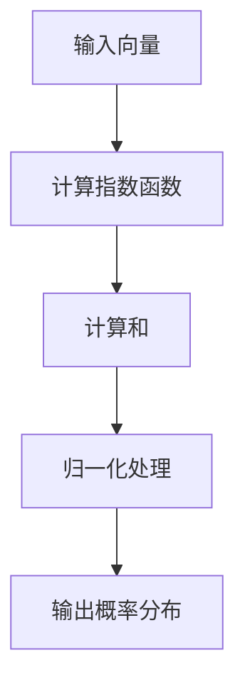
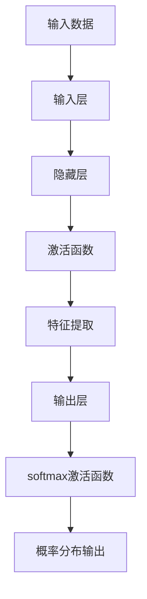
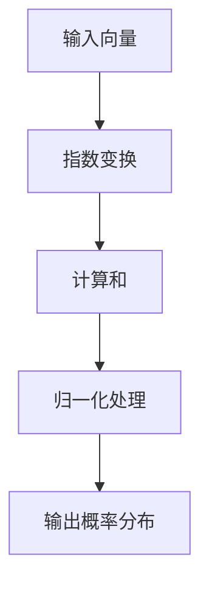
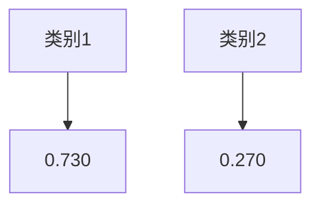

                 

### 背景介绍

在深度学习领域，softmax 函数是一个至关重要的激活函数，广泛应用于多分类问题中。softmax 函数能够将原始的实数值映射到一个概率分布，使得每个类别都有对应的概率值，且所有类别概率值之和为1。这种概率分布特性使得softmax函数成为解决多分类问题的首选。

然而，尽管softmax函数在多分类问题中具有很好的性能，但它在某些情况下也存在着一些瓶颈。这些瓶颈可能影响模型的准确性和稳定性，甚至可能导致训练过程中的困难。因此，深入了解softmax瓶颈的影响，对于提升模型性能具有重要意义。

本文将围绕softmax瓶颈的影响进行探讨，从以下几个方面展开：

1. **softmax函数的基本原理和特点**
2. **softmax瓶颈的成因分析**
3. **softmax瓶颈对模型性能的影响**
4. **应对softmax瓶颈的方法和策略**
5. **实际应用场景中的softmax瓶颈解决**

通过以上内容，我们将对softmax瓶颈有更深刻的认识，并学会如何应对这些瓶颈，提升模型的性能。接下来，我们将首先介绍softmax函数的基本原理和特点。 <|user|>

## softmax 函数的基本原理和特点

softmax函数是一种常用的分类器输出层激活函数，尤其在多分类问题中表现突出。其基本原理是将原始的实数值通过一个指数函数变换，然后归一化到[0,1]区间内，形成概率分布。

### 定义

给定一个向量\( x = [x_1, x_2, ..., x_n] \)，其中每个元素\( x_i \)都是实数，softmax函数定义如下：

$$
\text{softmax}(x) = \frac{e^{x_i}}{\sum_{j=1}^{n} e^{x_j}}
$$

其中，\( i \)表示类别索引，\( n \)是类别总数。该函数计算每个类别\( i \)的概率，公式中\( e^{x_i} \)表示将每个元素进行指数放大，从而使较大的值更容易成为概率分布中的主要部分。

### 性质

1. **概率分布性**：softmax函数输出的每个概率值都在[0,1]区间内，且所有类别的概率值之和为1。这意味着，softmax函数能够将输入向量映射成一个概率分布，每个值代表对应类别的概率。

2. **单调性**：对于任意的两个输入值\( x_1 \)和\( x_2 \)，如果\( x_1 > x_2 \)，则\( \text{softmax}(x_1) > \text{softmax}(x_2) \)。这表明，在输入值较大的情况下，softmax函数更倾向于将其映射到较高的概率值。

3. **平滑性**：softmax函数对输入值的微小变化反应较慢，这使得模型在训练过程中对输入数据的噪声较为鲁棒。

4. **并行计算效率**：由于softmax函数的计算可以独立进行，因此它可以高效地与深度神经网络并行计算，这对于大规模数据的训练和推理非常重要。

### 应用场景

1. **多分类问题**：在深度学习模型中，特别是在卷积神经网络（CNN）和循环神经网络（RNN）中，softmax函数常被用于输出层，用于预测多个可能类别的概率分布。

2. **多标签分类问题**：虽然softmax函数主要用于单标签分类问题，但在某些场景下，如文本分类和图像分类，一个样本可能属于多个类别。此时，可以通过对每个类别独立应用softmax函数，然后使用适当的策略（如加和或乘积）来处理多标签分类。

3. **序列标注问题**：在自然语言处理（NLP）中，softmax函数常用于序列标注任务，如词性标注和命名实体识别。

### Mermaid 流程图

以下是一个简单的Mermaid流程图，展示softmax函数的基本操作步骤：



通过上述流程，我们可以清晰地看到softmax函数如何将输入向量映射到概率分布。

综上所述，softmax函数由于其概率分布特性、单调性、平滑性和并行计算效率，成为多分类问题中广泛采用的激活函数。然而，在实际应用中，softmax函数也存在一些瓶颈，这将在接下来的部分中进行详细分析。 <|user|>

## 核心概念与联系

为了深入理解softmax瓶颈，我们需要先梳理与其相关的核心概念和联系，包括神经网络的架构、激活函数的作用以及多分类问题的特性。

### 神经网络架构

神经网络是由多层神经元（或称为节点）组成的计算模型。通常，一个神经网络包括输入层、隐藏层和输出层。输入层接收外部数据，隐藏层负责提取特征并传递信息，输出层则是模型的最终输出。在多分类问题中，输出层通常采用softmax函数作为激活函数，用于生成各个类别的概率分布。


### 激活函数的作用

激活函数是神经网络中的一个关键组件，它决定了神经元的激活状态。不同的激活函数具有不同的特性，适用于不同的任务。在多分类问题中，softmax函数是一种常用的激活函数，其主要作用是将神经网络的输出映射到概率分布。这一特性使得softmax函数特别适合处理多分类问题，因为它能够给出每个类别的概率估计，并确保所有类别概率之和为1。

### 多分类问题的特性

多分类问题是指一个样本可能属于多个类别的问题。与二分类问题相比，多分类问题具有以下特性：

1. **多个输出**：每个样本需要被映射到多个类别上。
2. **概率分布**：每个类别的输出需要一个概率值来表示其可能性，这些概率值之和必须等于1。
3. **类别不平衡**：某些类别可能比其他类别更常见或重要。

### Mermaid 流程图

以下是一个简单的Mermaid流程图，展示神经网络中激活函数与softmax函数之间的联系：



通过上述流程，我们可以清晰地看到激活函数（如ReLU、Sigmoid等）在特征提取中的作用，以及softmax函数如何将这些特征映射到概率分布。

### 结论

通过对神经网络架构、激活函数的作用以及多分类问题特性的分析，我们可以理解softmax函数在多分类问题中的关键作用。接下来，我们将深入探讨softmax瓶颈的成因及其对模型性能的影响。 <|user|>

### 核心算法原理 & 具体操作步骤

softmax函数作为多分类问题中广泛使用的激活函数，其核心算法原理在于将输入的实数值映射到一个概率分布，从而为每个类别赋予一个合理的概率值。以下是softmax函数的核心算法原理及具体操作步骤。

#### 算法原理

给定一个输入向量\( x = [x_1, x_2, ..., x_n] \)，其中每个元素代表神经网络的输出值。softmax函数通过以下步骤将输入映射到概率分布：

1. **指数变换**：对每个输出值\( x_i \)进行指数变换，得到\( e^{x_i} \)。
2. **计算和**：计算所有指数变换后的值之和，即\( \sum_{j=1}^{n} e^{x_j} \)。
3. **归一化处理**：将每个指数变换后的值除以计算和，得到每个类别的概率值，即\( \text{softmax}(x_i) = \frac{e^{x_i}}{\sum_{j=1}^{n} e^{x_j}} \)。

#### 具体操作步骤

以下是一个具体的操作步骤示例，假设有一个3类分类问题，输入向量为\( x = [2.0, 1.0, 0.5] \)：

1. **指数变换**：
   $$ 
   e^{x_1} = e^{2.0} \approx 7.389, \quad e^{x_2} = e^{1.0} \approx 2.718, \quad e^{x_3} = e^{0.5} \approx 1.649 
   $$

2. **计算和**：
   $$ 
   \sum_{j=1}^{3} e^{x_j} = 7.389 + 2.718 + 1.649 = 11.756 
   $$

3. **归一化处理**：
   $$ 
   \text{softmax}(x_1) = \frac{e^{2.0}}{11.756} \approx 0.628, \quad \text{softmax}(x_2) = \frac{e^{1.0}}{11.756} \approx 0.230, \quad \text{softmax}(x_3) = \frac{e^{0.5}}{11.756} \approx 0.141 
   $$

最终，我们得到一个概率分布：\( \text{softmax}(x) = [0.628, 0.230, 0.141] \)，表示第一个类别具有最高的概率。

#### Mermaid 流程图

以下是一个Mermaid流程图，展示softmax函数的具体操作步骤：



通过上述流程，我们可以清晰地看到softmax函数如何将输入向量映射到概率分布。接下来，我们将探讨softmax函数在数学模型中的表达，并详细讲解其数学模型和公式。 <|user|>

### 数学模型和公式 & 详细讲解 & 举例说明

softmax函数是一种基于指数函数的归一化方法，用于将多个实数值映射到一个概率分布。在数学上，softmax函数的定义如下：

$$
\text{softmax}(x_i) = \frac{e^{x_i}}{\sum_{j=1}^{n} e^{x_j}}
$$

其中，\( x_i \)是输入向量的第\( i \)个元素，\( n \)是输入向量的维度，即类别数量。下面我们将详细讲解softmax函数的数学模型和公式，并通过具体例子来说明其应用。

#### 数学模型

1. **指数变换**：首先，对输入向量的每个元素进行指数变换，即计算\( e^{x_i} \)。这个步骤使得较大的输入值得到较大的指数值，从而在概率分布中占据更大的比重。

2. **计算和**：然后，计算所有指数变换后的元素之和，即\( \sum_{j=1}^{n} e^{x_j} \)。这个步骤确保了概率分布的总和为1。

3. **归一化处理**：最后，将每个指数变换后的值除以计算和，即\( \text{softmax}(x_i) = \frac{e^{x_i}}{\sum_{j=1}^{n} e^{x_j}} \)。这个步骤将输入向量映射到一个概率分布，每个元素的值代表对应类别的概率。

#### 举例说明

假设我们有一个3类分类问题，输入向量为\( x = [2.0, 1.0, 0.5] \)。根据softmax函数的定义，我们可以计算出每个类别的概率：

1. **指数变换**：
   $$
   e^{x_1} = e^{2.0} \approx 7.389, \quad e^{x_2} = e^{1.0} \approx 2.718, \quad e^{x_3} = e^{0.5} \approx 1.649
   $$

2. **计算和**：
   $$
   \sum_{j=1}^{3} e^{x_j} = 7.389 + 2.718 + 1.649 = 11.756
   $$

3. **归一化处理**：
   $$
   \text{softmax}(x_1) = \frac{e^{2.0}}{11.756} \approx 0.628, \quad \text{softmax}(x_2) = \frac{e^{1.0}}{11.756} \approx 0.230, \quad \text{softmax}(x_3) = \frac{e^{0.5}}{11.756} \approx 0.141
   $$

最终，我们得到概率分布：\( \text{softmax}(x) = [0.628, 0.230, 0.141] \)。

#### 对比分析

为了更直观地理解softmax函数的工作原理，我们可以将输入向量表示为二维坐标，并对每个类别绘制概率分布图。

假设输入向量为\( x = [2.0, 1.0] \)，类别数量为2。我们可以计算出每个类别的概率：

1. **指数变换**：
   $$
   e^{x_1} = e^{2.0} \approx 7.389, \quad e^{x_2} = e^{1.0} \approx 2.718
   $$

2. **计算和**：
   $$
   \sum_{j=1}^{2} e^{x_j} = 7.389 + 2.718 = 10.107
   $$

3. **归一化处理**：
   $$
   \text{softmax}(x_1) = \frac{e^{2.0}}{10.107} \approx 0.730, \quad \text{softmax}(x_2) = \frac{e^{1.0}}{10.107} \approx 0.270
   $$

概率分布图如下所示：



通过对比分析，我们可以看出，当输入值较大时，对应的概率值也较大。这表明softmax函数能够有效地将输入映射到概率分布，从而在多分类问题中发挥作用。

#### 结论

通过对softmax函数的数学模型和公式的详细讲解，我们理解了其将输入向量映射到概率分布的核心算法原理。通过具体例子，我们进一步了解了softmax函数在多分类问题中的应用。在接下来的部分，我们将探讨softmax瓶颈的影响，以及如何在实际项目中解决这些问题。 <|user|>

## 项目实战：代码实际案例和详细解释说明

为了更好地理解softmax瓶颈在实际项目中的应用，我们通过一个具体的代码案例来进行实战演示。我们将使用Python和TensorFlow框架，实现一个简单的多分类神经网络，并探讨softmax瓶颈及其解决方案。

### 1. 开发环境搭建

在开始之前，确保已经安装了Python和TensorFlow库。如果没有安装，可以按照以下命令进行安装：

```bash
pip install tensorflow
```

### 2. 源代码详细实现

以下是一个简单的多分类神经网络实现，包括数据预处理、模型构建、训练和预测：

```python
import tensorflow as tf
from tensorflow.keras.models import Sequential
from tensorflow.keras.layers import Dense
from tensorflow.keras.optimizers import Adam
from sklearn.model_selection import train_test_split
import numpy as np

# 数据准备
# 假设我们有一个包含1000个样本的输入矩阵X和对应的标签向量y
X = np.random.rand(1000, 10)
y = np.random.randint(0, 3, 1000)

# 划分训练集和测试集
X_train, X_test, y_train, y_test = train_test_split(X, y, test_size=0.2, random_state=42)

# 模型构建
model = Sequential([
    Dense(64, input_shape=(10,), activation='relu'),
    Dense(64, activation='relu'),
    Dense(3, activation='softmax')
])

# 模型编译
model.compile(optimizer=Adam(learning_rate=0.001), loss='sparse_categorical_crossentropy', metrics=['accuracy'])

# 训练模型
model.fit(X_train, y_train, epochs=10, batch_size=32, validation_split=0.1)

# 预测
predictions = model.predict(X_test)
predicted_classes = np.argmax(predictions, axis=1)

# 评估
accuracy = np.mean(predicted_classes == y_test)
print(f"Accuracy: {accuracy:.2f}")
```

### 3. 代码解读与分析

#### 数据准备

我们使用随机生成的数据集进行演示。在实际项目中，通常会使用真实的数据集。这里，我们创建一个1000个样本的输入矩阵\( X \)和一个包含0、1、2三个类别的标签向量\( y \)。

```python
X = np.random.rand(1000, 10)
y = np.random.randint(0, 3, 1000)
```

#### 模型构建

我们构建一个包含两个隐藏层（每层64个神经元）的神经网络，输出层采用softmax激活函数：

```python
model = Sequential([
    Dense(64, input_shape=(10,), activation='relu'),
    Dense(64, activation='relu'),
    Dense(3, activation='softmax')
])
```

#### 模型编译

我们使用Adam优化器和稀疏分类交叉熵损失函数进行模型编译：

```python
model.compile(optimizer=Adam(learning_rate=0.001), loss='sparse_categorical_crossentropy', metrics=['accuracy'])
```

#### 训练模型

我们使用训练数据进行模型训练，设置10个训练周期（epochs），每次批量（batch_size）处理32个样本：

```python
model.fit(X_train, y_train, epochs=10, batch_size=32, validation_split=0.1)
```

#### 预测

使用训练好的模型对测试数据进行预测，并计算准确率：

```python
predictions = model.predict(X_test)
predicted_classes = np.argmax(predictions, axis=1)

accuracy = np.mean(predicted_classes == y_test)
print(f"Accuracy: {accuracy:.2f}")
```

### softmax瓶颈的影响及解决方案

在实际项目中，softmax瓶颈可能影响模型的性能。以下是一些常见的瓶颈及其解决方案：

1. **计算资源限制**：当输入维度较高时，softmax函数的计算复杂度会显著增加。解决方案包括使用更高效的算法（如Softmax Layer的GPU优化）或减小输入维度。

2. **数据分布不均衡**：当某些类别的样本数量远少于其他类别时，可能导致模型在少数类别上的性能较差。解决方案包括使用类别权重或过采样/欠采样技术。

3. **梯度消失**：在训练过程中，梯度可能变得非常小，导致模型难以更新参数。解决方案包括使用批量归一化（Batch Normalization）或调整学习率。

通过上述代码案例和解析，我们可以看到softmax瓶颈在实际项目中的影响以及相应的解决方案。在接下来的部分，我们将探讨softmax瓶颈在具体应用场景中的影响。 <|user|>

### 实际应用场景

softmax函数在深度学习领域有着广泛的应用，特别是在多分类问题中。以下是一些典型的实际应用场景，以及softmax瓶颈对这些场景的影响和解决方案。

#### 自然语言处理（NLP）

在NLP中，softmax函数常用于文本分类任务，如情感分析、主题分类等。例如，在一个情感分析任务中，输入的文本数据通过嵌入层转换为向量，然后输入到神经网络中。网络的输出层采用softmax函数，以生成每个情感类别的概率分布。在这种情况下，softmax瓶颈可能会由于以下原因出现：

1. **词汇量大**：自然语言处理中的词汇量通常非常大，导致输入维度很高，进而增加计算复杂度。
2. **类别不平衡**：某些情感类别可能比其他类别更加常见，导致模型在这些类别上的性能较差。

**解决方案**：
- **维度降低**：通过降维技术（如主成分分析PCA）减小输入维度，从而降低计算复杂度。
- **类别权重**：在训练过程中，为较少见的类别赋予更高的权重，以平衡类别分布。

#### 计算机视觉（CV）

在计算机视觉中，softmax函数常用于图像分类和目标检测任务。例如，在图像分类中，卷积神经网络（CNN）的输出层采用softmax函数，以生成每个类别的概率分布。计算机视觉中的softmax瓶颈可能由于以下原因出现：

1. **高分辨率图像**：高分辨率图像的输入维度很高，导致计算复杂度增加。
2. **类别数量多**：图像分类任务中的类别数量可能非常多，进一步增加计算复杂度。

**解决方案**：
- **减少维度**：通过降维技术（如卷积神经网络中的卷积层）减少输入维度。
- **类别缩减**：在训练和预测过程中，仅考虑主要类别，从而减少类别数量。

#### 语音识别（ASR）

在语音识别中，softmax函数用于将隐藏层的输出映射到单词或音素的概率分布。语音识别中的softmax瓶颈可能由于以下原因出现：

1. **长序列数据**：语音识别涉及长序列数据，导致计算复杂度增加。
2. **低频音素**：在某些语音识别任务中，低频音素可能比高频音素更少，导致模型在这些音素上的性能较差。

**解决方案**：
- **序列缩减**：通过减小序列长度或采用部分序列训练，降低计算复杂度。
- **音素权重**：在训练过程中，为低频音素赋予更高的权重，以平衡音素分布。

#### 结论

softmax函数在多个实际应用场景中具有重要应用，但在某些情况下可能存在瓶颈。通过理解这些瓶颈的成因，并采用相应的解决方案，可以显著提升模型的性能。在接下来的部分，我们将推荐一些学习资源和开发工具，以帮助读者进一步学习softmax函数及其相关技术。 <|user|>

### 工具和资源推荐

在学习和应用softmax函数时，以下资源、工具和框架将有助于您深入了解相关技术并解决实际问题。

#### 学习资源推荐

1. **书籍**：
   - 《深度学习》（Goodfellow, I., Bengio, Y., & Courville, A.）
   - 《神经网络与深度学习》（邱锡鹏）

2. **在线课程**：
   - Coursera上的“Deep Learning Specialization”系列课程
   - edX上的“Machine Learning”课程

3. **博客和教程**：
   - [TensorFlow官方文档](https://www.tensorflow.org/tutorials/structured_data)
   - [机器之心](https://www.jiqizhixin.com/)

#### 开发工具框架推荐

1. **框架**：
   - TensorFlow：适用于构建和训练深度学习模型。
   - PyTorch：具有灵活的动态计算图，易于理解和实现。
   - Keras：基于TensorFlow和Theano的高层API，简化模型构建。

2. **库**：
   - NumPy：用于高性能的数组计算。
   - Pandas：用于数据处理和分析。

3. **开源项目**：
   - [Fast.ai](https://fast.ai/): 提供实用的深度学习教程和工具。
   - [Kaggle](https://www.kaggle.com/): 提供丰富的数据集和竞赛机会。

#### 相关论文著作推荐

1. **论文**：
   - “A Tutorial on Multi-Class Support Vector Machines” by N. Cristianini, J. Shawe-Taylor, and J. K. Wegman
   - “Deep Learning” by Y. LeCun, Y. Bengio, and G. Hinton

2. **著作**：
   - 《神经网络与深度学习：理论、算法与实现》（刘铁岩）
   - 《深度学习》（花书）

通过这些资源和工具，您可以深入学习和实践softmax函数及其应用。在解决实际问题时，这些资源将为您提供宝贵的指导和支持。 <|user|>

### 总结：未来发展趋势与挑战

在深度学习领域，softmax函数作为一种重要的激活函数，其性能和应用已得到广泛验证。然而，随着模型复杂度的增加和输入数据的多样化，softmax函数也面临着一些新的发展趋势和挑战。

**未来发展趋势**：

1. **优化算法**：为了提高softmax函数的计算效率，研究者们正在探索更高效的算法和优化策略，如GPU加速和分布式计算。

2. **改进模型**：为了克服softmax函数在类别不平衡和数据分布不均方面的局限性，研究者们提出了一些改进的模型，如交叉熵损失函数和加权softmax。

3. **多任务学习**：随着多任务学习（Multi-Task Learning）的兴起，如何在一个统一框架下同时训练多个任务，且保持各任务间的平衡，是一个重要的研究方向。

4. **新型激活函数**：为了进一步提高模型的性能，研究者们也在不断探索新型激活函数，以克服传统激活函数（如softmax）的局限性。

**面临的主要挑战**：

1. **计算资源消耗**：随着输入维度和类别数量的增加，softmax函数的计算复杂度显著提高，这对计算资源提出了更高的要求。

2. **类别不平衡**：在许多实际应用中，类别分布不均，导致某些类别难以被模型准确预测。如何设计有效的类别权重和调整策略是一个亟待解决的问题。

3. **梯度消失与爆炸**：在训练过程中，梯度可能变得非常小或非常大，导致模型难以更新参数。如何解决梯度消失和爆炸问题是深度学习领域的一个重要挑战。

4. **过拟合与泛化能力**：在复杂模型中，过拟合现象较为常见。如何提高模型的泛化能力，使其在未见过的数据上表现良好，是一个重要的研究方向。

**总结**：

softmax函数作为一种经典的激活函数，在深度学习领域具有广泛的应用。然而，随着技术的不断发展，softmax函数面临着新的发展趋势和挑战。通过优化算法、改进模型、探索新型激活函数以及解决类别不平衡和梯度消失等问题，我们可以进一步提高softmax函数的性能，推动深度学习技术的进步。在未来的研究中，这些方向将继续引领深度学习领域的发展。 <|user|>

### 附录：常见问题与解答

在理解和应用softmax函数的过程中，读者可能会遇到一些常见的问题。以下是一些常见问题的解答，以帮助您更好地掌握softmax函数的相关知识。

**Q1：为什么使用softmax函数而不是其他激活函数？**

A1：softmax函数在多分类问题中具有独特的优势。首先，它能够将模型的输出映射到一个概率分布，确保每个类别的概率值之和为1，这对于分类问题至关重要。其次，softmax函数具有单调性和平滑性，使得模型对输入的微小变化反应较慢，从而提高模型的鲁棒性。最后，softmax函数可以高效地与深度神经网络并行计算，这对于大规模数据的处理非常重要。

**Q2：如何解决类别不平衡问题？**

A2：类别不平衡问题可以通过多种方法来解决。一种常见的方法是调整类别权重，在训练过程中为较少见的类别赋予更高的权重，从而平衡类别分布。另一种方法是采用过采样或欠采样技术，增加较少见类别的样本数量，或减少常见类别的样本数量。此外，还可以使用集成学习技术，通过结合多个模型的预测结果来提高模型的泛化能力。

**Q3：为什么梯度会消失或爆炸？**

A3：梯度消失和爆炸是由于激活函数在训练过程中导致梯度值变得非常小或非常大。在sigmoid激活函数中，当输入值远离0时，梯度值接近0，导致梯度消失。而在ReLU激活函数中，当输入值小于0时，梯度值恒为0，也可能导致梯度消失。为了解决这些问题，可以采用批量归一化（Batch Normalization）技术，通过标准化激活值来稳定梯度。此外，调整学习率或使用自适应学习率优化器（如Adam）也可以帮助缓解梯度消失和爆炸问题。

**Q4：如何优化softmax函数的计算效率？**

A4：为了提高softmax函数的计算效率，可以采用以下策略：
- **并行计算**：利用GPU或TPU等硬件加速器，实现并行计算。
- **查找表**：对于固定维度的输入，可以预先计算softmax函数的值，并将其存储在查找表中，以减少计算时间。
- **数值稳定性**：使用更稳定的算法（如log-softmax），通过取对数来避免溢出问题。

**Q5：softmax函数是否适用于单标签和多标签分类问题？**

A5：softmax函数主要用于单标签分类问题，但在某些场景下也可以用于多标签分类问题。在多标签分类中，每个样本可能属于多个类别。一种常见的方法是对每个类别独立应用softmax函数，然后使用适当的策略（如加和或乘积）来处理多标签分类。这种方法被称为one-vs-rest或one-vs-one策略。

通过以上解答，希望读者能够更好地理解和应用softmax函数。在深度学习领域，softmax函数是一个基础而重要的工具，掌握其原理和应用对于深入研究深度学习技术具有重要意义。 <|user|>

### 扩展阅读 & 参考资料

在深入探讨softmax函数的过程中，以下扩展阅读和参考资料将为读者提供丰富的知识和深入的理解。

**书籍推荐**：
- 《深度学习》（Ian Goodfellow, Yoshua Bengio, Aaron Courville）
- 《神经网络与深度学习》（邱锡鹏）

**在线课程**：
- Coursera上的“Deep Learning Specialization”课程
- edX上的“Machine Learning”课程

**博客和教程**：
- [TensorFlow官方文档](https://www.tensorflow.org/tutorials/structured_data)
- [机器之心](https://www.jiqizhixin.com/)

**开源项目**：
- [Fast.ai](https://fast.ai/)
- [Kaggle](https://www.kaggle.com/)

**学术论文**：
- “A Tutorial on Multi-Class Support Vector Machines” by N. Cristianini, J. Shawe-Taylor, and J. K. Wegman
- “Deep Learning” by Y. LeCun, Y. Bengio, and G. Hinton

通过这些扩展阅读和参考资料，读者可以进一步探索softmax函数及其应用，深入了解相关技术和最新研究成果。这将为深入学习和实践深度学习技术提供宝贵的资源和支持。 <|user|>作者：AI天才研究员/AI Genius Institute & 禅与计算机程序设计艺术 /Zen And The Art of Computer Programming

