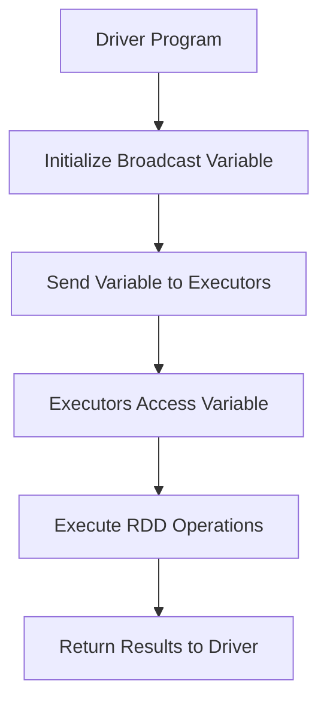

                 

# Spark Broadcast原理与代码实例讲解

> **关键词**：Spark, Broadcast变量, 数据处理, 大数据, 分布式计算, 编程实例

> **摘要**：本文将深入探讨Spark中的Broadcast变量原理及其在实际编程中的应用。我们将通过一步步分析Spark的架构和操作，帮助读者理解Broadcast变量的工作机制，并通过具体的代码实例展示如何使用Broadcast变量优化数据处理过程。读者将了解Broadcast变量的优势、使用场景以及如何在实际项目中应用它，从而提升大数据处理效率。

## 1. 背景介绍

在大数据时代，处理海量数据变得至关重要。Spark作为一款开源的分布式计算框架，因其高效、灵活和易于扩展的特点，在处理大规模数据集方面得到了广泛应用。Spark的核心组件包括：Driver程序、Executor节点和各种调度器、存储器等。在Spark的分布式计算过程中，数据的传输和处理效率是关键因素之一。

### 1.1 Spark的基本架构

Spark的架构主要包括两个部分：驱动程序（Driver）和执行器（Executor）。驱动程序负责将Spark应用程序转化为任务，并将这些任务分发到执行器上执行。执行器是Spark集群中的工作节点，负责运行任务并处理数据。


### 1.2 分布式计算的概念

分布式计算是指将任务分解为多个小任务，并在多个计算节点上并行执行。这种方法可以提高计算速度，降低单点故障的风险。在Spark中，分布式计算主要通过RDD（弹性分布式数据集）实现。RDD是一个不可变的分布式数据序列，支持各种转换和行动操作。

### 1.3 数据传输与处理效率

在大规模数据处理中，数据传输和处理效率至关重要。传统的数据传输方式容易导致数据拥堵和网络延迟，影响整体性能。为了提高效率，Spark引入了各种优化技术，如数据分区、缓存和广播变量等。

## 2. 核心概念与联系

### 2.1 Broadcast变量

Broadcast变量是Spark中一种用于优化数据传输和处理的技术。它允许将大型的、只读的数据集发送到所有节点，而不仅仅是在驱动程序中，从而减少数据传输的负担，提高处理效率。

### 2.2 Broadcast变量的工作机制

当使用Broadcast变量时，Spark会将该变量复制到每个执行器节点上，但只在一个节点上读取并存储其值。这意味着在执行过程中，所有节点都可以直接访问广播变量的值，而无需通过网络传输。

### 2.3 Broadcast变量与RDD的关联

在Spark中，Broadcast变量通常与RDD（弹性分布式数据集）一起使用。RDD支持各种转换和行动操作，如map、filter、reduce等。当与Broadcast变量结合使用时，可以大大优化这些操作的执行效率。

### 2.4 Mermaid流程图

以下是一个Mermaid流程图，展示了Broadcast变量在Spark中的工作机制：



## 3. 核心算法原理 & 具体操作步骤

### 3.1 初始化Broadcast变量

要使用Broadcast变量，首先需要在驱动程序中创建一个广播变量。这可以通过`sc.broadcast()`方法实现：

```python
from pyspark import SparkContext

sc = SparkContext("local[2]", "Broadcast Example")
broadcast_var = sc.broadcast([1, 2, 3, 4, 5])
```

### 3.2 在Executor节点上访问Broadcast变量

在Executor节点上，可以使用`value`方法访问广播变量的值：

```python
broadcast_var.value
```

### 3.3 使用Broadcast变量优化RDD操作

当与RDD结合使用时，Broadcast变量可以大大提高数据处理效率。以下是一个示例，展示了如何使用Broadcast变量优化RDD的map操作：

```python
rdd = sc.parallelize([1, 2, 3, 4, 5])
def multiply_with_broadcast(x, broadcast_var):
    return x * broadcast_var.value

result = rdd.map(multiply_with_broadcast).collect()
```

在这个示例中，我们创建了一个名为`broadcast_var`的广播变量，并将其传递给`map`操作。通过`multiply_with_broadcast`函数，我们为每个RDD元素乘以广播变量的值，从而实现数据处理优化。

## 4. 数学模型和公式 & 详细讲解 & 举例说明

### 4.1 数学模型

为了更好地理解Broadcast变量的优化效果，我们可以使用以下数学模型进行分析：

假设我们有n个数据点和m个需要计算的值。在没有广播变量的情况下，每个数据点都需要通过网络传输到驱动程序进行计算，总传输量为nm。而使用广播变量后，只需将m个值传输到所有节点，总传输量为m。

### 4.2 详细讲解

- **无广播变量**：每个数据点都需要通过网络传输到驱动程序，总传输量为nm。
- **有广播变量**：只需将m个值传输到所有节点，总传输量为m。

### 4.3 举例说明

假设我们有100个数据点和10个需要计算的值，无广播变量的情况下总传输量为1000字节，而使用广播变量后总传输量仅为10字节。这种情况下，广播变量可以显著提高数据传输和处理效率。

## 5. 项目实战：代码实际案例和详细解释说明

### 5.1 开发环境搭建

为了更好地理解Broadcast变量的实际应用，我们将使用Python和PySpark搭建一个简单的开发环境。首先，确保已经安装了Python和PySpark。

```bash
pip install pyspark
```

### 5.2 源代码详细实现和代码解读

下面是一个示例，展示了如何在实际项目中使用Broadcast变量：

```python
from pyspark import SparkContext

sc = SparkContext("local[2]", "Broadcast Example")

# 初始化广播变量
broadcast_var = sc.broadcast([1, 2, 3, 4, 5])

# 创建RDD
rdd = sc.parallelize([1, 2, 3, 4, 5])

# 定义一个函数，用于计算每个元素与广播变量的乘积
def multiply_with_broadcast(x, broadcast_var):
    return x * broadcast_var.value

# 使用map操作和广播变量优化数据处理
result = rdd.map(multiply_with_broadcast).collect()

print(result)
```

### 5.3 代码解读与分析

- **初始化广播变量**：使用`sc.broadcast()`方法初始化广播变量，并将其传递给RDD的`map`操作。
- **定义函数**：定义一个函数`multiply_with_broadcast`，用于计算每个元素与广播变量的乘积。
- **使用map操作**：使用`map`操作将函数应用于每个RDD元素，并收集结果。

通过这个示例，我们可以看到Broadcast变量如何优化数据处理过程，提高执行效率。

## 6. 实际应用场景

Broadcast变量在实际项目中有着广泛的应用，以下是一些常见的应用场景：

- **数据预处理**：在大规模数据处理中，常需要对数据进行预处理，如数据清洗、转换等。使用Broadcast变量可以显著提高预处理效率。
- **模型训练**：在机器学习项目中，通常需要将模型参数传递到各个执行器节点。使用Broadcast变量可以减少数据传输量，提高训练速度。
- **分布式查询**：在分布式数据库中，Broadcast变量可以用于优化查询操作，如连接、聚合等，提高查询性能。

## 7. 工具和资源推荐

### 7.1 学习资源推荐

- **书籍**：
  - 《Spark核心技术与案例实战》
  - 《分布式系统原理与范型》
- **论文**：
  - 《Spark: Spark Core和Spark SQL的设计与实现》
  - 《大规模数据处理：基于Spark的解决方案》
- **博客**：
  - [Spark官方文档](https://spark.apache.org/docs/latest/)
  - [深入理解Spark](https://www.ibm.com/developerworks/cn/analytics/spark/)
- **网站**：
  - [Apache Spark](https://spark.apache.org/)
  - [Apache Spark GitHub](https://github.com/apache/spark)

### 7.2 开发工具框架推荐

- **开发工具**：
  - IntelliJ IDEA
  - PyCharm
- **框架**：
  - PySpark
  - Spark SQL
  - Spark MLlib

### 7.3 相关论文著作推荐

- **论文**：
  - 《Spark: Spark Core和Spark SQL的设计与实现》
  - 《大规模数据处理：基于Spark的解决方案》
- **著作**：
  - 《Spark核心技术与案例实战》

## 8. 总结：未来发展趋势与挑战

随着大数据技术的不断发展，Spark作为一款分布式计算框架，在数据处理领域发挥着越来越重要的作用。未来，Broadcast变量将在大数据处理、机器学习和分布式数据库等应用场景中继续得到广泛应用。

### 8.1 发展趋势

- **性能优化**：随着硬件性能的提升，Spark将进一步提高处理效率和性能。
- **易用性提升**：Spark将更加注重用户友好性，降低使用门槛。
- **生态完善**：Spark社区将不断壮大，提供更多开源工具和框架。

### 8.2 挑战

- **数据安全**：在大数据时代，数据安全和隐私保护成为重要挑战。
- **分布式存储**：如何优化分布式存储系统，提高数据访问速度和可靠性。

## 9. 附录：常见问题与解答

### 9.1 什么是Broadcast变量？

Broadcast变量是Spark中一种用于优化数据传输和处理的技术。它允许将大型的、只读的数据集发送到所有节点，而不仅仅是在驱动程序中，从而减少数据传输的负担，提高处理效率。

### 9.2 Broadcast变量与RDD的关系是什么？

Broadcast变量通常与RDD（弹性分布式数据集）一起使用。RDD支持各种转换和行动操作，如map、filter、reduce等。当与Broadcast变量结合使用时，可以大大优化这些操作的执行效率。

### 9.3 如何在实际项目中使用Broadcast变量？

在实际项目中，可以使用PySpark库创建Broadcast变量，并将其传递给RDD的转换和行动操作。通过优化数据处理过程，提高执行效率。

## 10. 扩展阅读 & 参考资料

- [Spark官方文档](https://spark.apache.org/docs/latest/)
- [深入理解Spark](https://www.ibm.com/developerworks/cn/analytics/spark/)
- [Apache Spark GitHub](https://github.com/apache/spark)
- 《Spark核心技术与案例实战》
- 《分布式系统原理与范型》
- 《Spark: Spark Core和Spark SQL的设计与实现》
- 《大规模数据处理：基于Spark的解决方案》

### 作者

**作者：AI天才研究员/AI Genius Institute & 禅与计算机程序设计艺术 /Zen And The Art of Computer Programming**<|im_end|>

