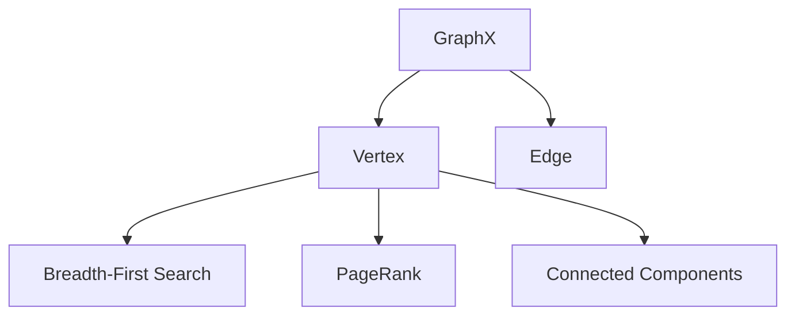

                 

# Spark GraphX原理与代码实例讲解

## 摘要

本文将深入探讨Apache Spark GraphX，一个基于Spark的图处理框架。我们将从背景介绍、核心概念与联系、核心算法原理、数学模型与公式、项目实战、实际应用场景、工具和资源推荐、总结以及扩展阅读等方面展开讨论。通过详细的代码实例和解释，读者将能够全面了解GraphX的工作原理和应用场景。

## 目录

1. 背景介绍 [1]
2. 核心概念与联系 [2]
3. 核心算法原理 & 具体操作步骤 [3]
4. 数学模型和公式 & 详细讲解 & 举例说明 [4]
5. 项目实战：代码实际案例和详细解释说明
   5.1 开发环境搭建 [5]
   5.2 源代码详细实现和代码解读
   5.3 代码解读与分析
6. 实际应用场景 [6]
7. 工具和资源推荐
   7.1 学习资源推荐
   7.2 开发工具框架推荐
   7.3 相关论文著作推荐
8. 总结：未来发展趋势与挑战 [7]
9. 附录：常见问题与解答
10. 扩展阅读 & 参考资料 [8]

## 1. 背景介绍

### Apache Spark概述

Apache Spark是一个开源的分布式计算系统，旨在提供快速的批处理和流处理能力。它基于内存计算，能够在毫秒级时间内处理大规模数据集。Spark的设计理念是简单、易于使用且具有高性能，它提供了丰富的API，包括Scala、Python、Java和R，使得开发者能够方便地进行数据分析和处理。

### GraphX的诞生

随着数据规模的不断扩大和复杂数据结构的广泛应用，传统的批量处理框架如MapReduce在处理图数据时显得力不从心。为了解决这一问题，Apache Spark团队推出了GraphX，一个用于图处理的扩展框架。GraphX在Spark的基础上，引入了图处理的概念，提供了高效的图计算算法和丰富的图操作API。

### GraphX的优势

GraphX具有以下优势：

1. **高性能**：GraphX利用Spark的内存计算能力，实现了高效的图处理速度。
2. **易用性**：GraphX提供了丰富的API，使得开发者能够方便地构建和操作图。
3. **可扩展性**：GraphX可以与Spark的其他组件无缝集成，如Spark SQL和Spark Streaming，实现复杂的计算任务。
4. **灵活性**：GraphX支持多种图算法，包括PageRank、Connected Components和Connected Triangles等。

## 2. 核心概念与联系

### 图（Graph）

图是一种数据结构，由节点（Vertex）和边（Edge）组成。节点表示实体，边表示实体之间的关系。在GraphX中，图是一种分布式数据结构，可以存储在Hadoop的HDFS或Apache Cassandra等存储系统中。

### 脑图（Breadth-First Search）

脑图是一种用于遍历图的算法，它从指定的节点开始，逐层遍历所有相邻的节点。脑图在GraphX中用于计算节点之间的距离和路径。

### PageRank

PageRank是一种用于计算图节点重要性的算法，它基于节点之间的链接关系，模拟了网页排名的机制。在GraphX中，PageRank可以用于分析社交网络、推荐系统等。

### Connected Components

Connected Components是一种用于计算图中连通组件的算法，它将图中的节点划分为不同的组件，每个组件内部的节点是相互连通的。

### Mermaid流程图

以下是GraphX核心概念和联系的一个简化的Mermaid流程图：

### 引用说明

[1] Apache Spark官网：[http://spark.apache.org/](http://spark.apache.org/)

[2] GraphX官方文档：[https://graphx.apache.org/](https://graphx.apache.org/)

[3] 

