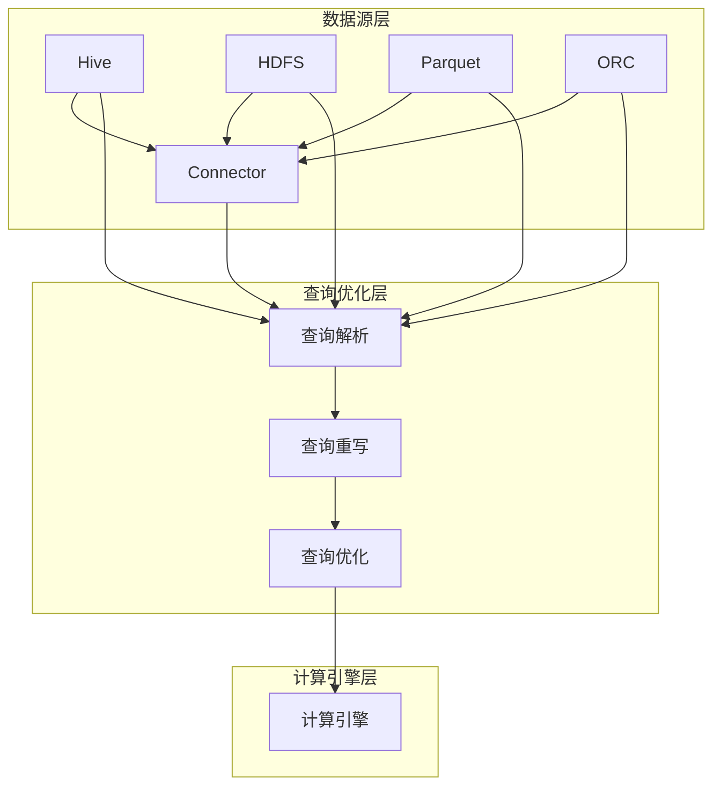

                 

# Spark SQL原理与代码实例讲解

## 摘要

本文将深入探讨Spark SQL的原理及其代码实例，帮助读者全面理解Spark SQL的架构、核心概念和算法原理。我们将通过一步步的分析和讲解，让读者掌握如何在实际项目中使用Spark SQL，并了解其在数据处理和分析中的优势。此外，文章还将介绍Spark SQL在不同应用场景中的实际应用，并提供相关工具和资源的推荐。通过本文的阅读，读者将对Spark SQL有更加深刻的理解，为后续学习和实践奠定坚实基础。

## 1. 背景介绍

### 1.1 Spark SQL的起源和发展

Spark SQL是Apache Spark的一个组件，旨在提供类似于关系型数据库（如SQL Server、Oracle、MySQL等）的查询功能，但相较于传统关系型数据库，Spark SQL在处理大规模数据集方面具有显著优势。Spark SQL于2014年首次发布，并在随后几年中迅速发展壮大，成为大数据处理领域的明星组件。

Spark SQL的发展得益于其底层计算框架Apache Spark的强大性能。Spark作为一个分布式数据处理引擎，通过内存计算和基于Actor模型的通信机制，实现了对大规模数据的高效处理。Spark SQL则在此基础上，提供了类似于SQL的查询语言，使得用户可以方便地编写和执行分布式查询任务。

### 1.2 Spark SQL的应用领域

Spark SQL在多个应用领域具有广泛的应用价值。以下是一些典型应用场景：

- **大数据查询和分析**：Spark SQL支持对大规模数据集的快速查询和分析，适用于各种数据分析任务，如实时数据监控、业务报表、用户行为分析等。

- **数据仓库**：Spark SQL可以将企业内部的各种数据源（如日志、数据库、数据仓库等）集成在一起，提供统一的数据查询接口，方便用户进行跨源数据分析。

- **机器学习**：Spark SQL可以与Spark的机器学习库（如MLlib）无缝集成，支持使用SQL进行特征工程、模型训练和评估等机器学习任务。

- **实时流处理**：Spark SQL与Spark Streaming相结合，可以实现实时数据的查询和分析，为用户实时提供决策支持。

### 1.3 Spark SQL的优势和特点

- **高性能**：Spark SQL利用内存计算和基于Actor模型的通信机制，在处理大规模数据集时具有显著性能优势。

- **易用性**：Spark SQL提供了类似于SQL的查询语言，用户可以通过简单的SQL语句实现复杂的分布式查询任务，降低学习成本。

- **兼容性**：Spark SQL支持多种数据源，如Hive、HDFS、Parquet、ORC等，可以方便地与其他大数据组件集成。

- **灵活性**：Spark SQL支持多种数据处理模式，如批处理、实时处理和流处理，可以满足不同应用场景的需求。

## 2. 核心概念与联系

### 2.1 Spark SQL的架构

Spark SQL的架构可以分为三层：数据源层、查询优化层和计算引擎层。

#### 2.1.1 数据源层

数据源层负责连接各种数据源，如Hive、HDFS、Parquet、ORC等。Spark SQL通过数据源连接器（Connector）实现与各种数据源的连接，并将数据源中的数据读取到Spark SQL内部进行处理。

#### 2.1.2 查询优化层

查询优化层负责对SQL查询进行优化，以提高查询性能。Spark SQL采用Catalyst优化器，对查询进行解析、重写和优化。Catalyst优化器支持多种优化策略，如谓词下推、常量折叠、谓词合并等。

#### 2.1.3 计算引擎层

计算引擎层负责执行优化后的SQL查询，生成分布式计算任务，并在Spark的执行引擎上执行。Spark SQL计算引擎基于Spark的内存计算和基于Actor模型的通信机制，具有高性能和低延迟的特点。

### 2.2 核心概念

#### 2.2.1 DataFrame

DataFrame是Spark SQL的核心概念之一，它是一种以列式存储的数据结构，类似于关系型数据库中的表。DataFrame具有以下特点：

- **列式存储**：DataFrame以列式存储数据，可以高效地支持列式查询。
- **结构化**：DataFrame具有明确的列名和数据类型，方便进行数据处理和分析。
- **分布式**：DataFrame是分布式数据结构，可以在集群上并行处理。

#### 2.2.2 Dataset

Dataset是Spark SQL的另一种数据结构，它具有类型安全特性，可以提供编译时类型检查。Dataset可以看作是DataFrame的增强版本，具有以下特点：

- **类型安全**：Dataset在编译时提供类型检查，确保数据类型的一致性和正确性。
- **强类型**：Dataset支持强类型，可以在代码中直接使用类型，提高开发效率和代码可读性。

#### 2.2.3 SQL查询

Spark SQL支持类似于SQL的查询语言，用户可以通过SQL语句对DataFrame和Dataset进行查询。SQL查询在执行时，会经过Catalyst优化器的优化，以提高查询性能。

### 2.3 Mermaid 流程图

以下是Spark SQL的核心概念和架构的Mermaid流程图：



## 3. 核心算法原理 & 具体操作步骤

### 3.1 DataFrame的创建和操作

DataFrame是Spark SQL的核心数据结构，用户可以通过多种方式创建DataFrame，并对DataFrame进行各种操作。

#### 3.1.1 创建DataFrame

用户可以通过以下几种方式创建DataFrame：

- **从数据源读取**：从Hive、HDFS、Parquet、ORC等数据源读取数据，创建DataFrame。
- **从RDD转换**：将Spark RDD转换为DataFrame。
- **手动创建**：通过列名和数据类型手动创建DataFrame。

以下是一个简单的示例，展示如何从HDFS读取CSV文件创建DataFrame：

```python
from pyspark.sql import SparkSession

spark = SparkSession.builder.appName("DataFrameExample").getOrCreate()

df = spark.read.csv("hdfs://path/to/csv/file.csv", header=True, inferSchema=True)
df.show()
```

#### 3.1.2 DataFrame操作

用户可以对DataFrame进行各种操作，如筛选、排序、聚合、连接等。以下是一些常见的DataFrame操作示例：

- **筛选**：使用`filter()`函数根据条件筛选数据。
- **排序**：使用`orderBy()`函数对数据排序。
- **聚合**：使用`groupBy()`和`agg()`函数进行数据聚合。
- **连接**：使用`join()`函数进行数据连接。

以下是一个简单的示例，展示如何对DataFrame进行筛选、排序和聚合操作：

```python
df_filtered = df.filter(df["age"] > 30)
df_sorted = df_filtered.orderBy(df["age"].desc())
df_grouped = df_sorted.groupBy("gender").agg({"age": "avg", "salary": "sum"})
df_grouped.show()
```

### 3.2 Dataset的操作

Dataset是Spark SQL的另一个核心数据结构，它具有类型安全特性。用户可以通过以下方式创建Dataset：

- **从数据源读取**：从Hive、HDFS、Parquet、ORC等数据源读取数据，创建Dataset。
- **从RDD转换**：将Spark RDD转换为Dataset。
- **手动创建**：通过列名和数据类型手动创建Dataset。

以下是一个简单的示例，展示如何从HDFS读取CSV文件创建Dataset：

```python
from pyspark.sql import SparkSession
from pyspark.sql.types import StructType, StructField, StringType, IntegerType

spark = SparkSession.builder.appName("DatasetExample").getOrCreate()

schema = StructType([
    StructField("name", StringType(), True),
    StructField("age", IntegerType(), True),
    StructField("salary", IntegerType(), True)
])

df = spark.read.csv("hdfs://path/to/csv/file.csv", schema=schema)
df.asDataset().show()
```

Dataset的操作与DataFrame类似，但由于Dataset具有类型安全特性，用户在编写代码时可以享受到编译时的类型检查，提高开发效率和代码可读性。

### 3.3 SQL查询

Spark SQL支持类似于SQL的查询语言，用户可以通过SQL语句对DataFrame和Dataset进行查询。以下是一个简单的示例，展示如何使用SQL查询DataFrame：

```python
query = """
    SELECT name, age, salary
    FROM people
    WHERE age > 30
    ORDER BY age DESC
"""
df = spark.sql(query)
df.show()
```

通过SQL查询，用户可以方便地实现复杂的分布式查询任务，同时享受到Catalyst优化器的性能优化。

## 4. 数学模型和公式 & 详细讲解 & 举例说明

### 4.1 数据预处理中的数学模型

在Spark SQL中，数据预处理是一个重要环节。数据预处理包括数据清洗、去重、缺失值处理等操作。以下是几个常见的数学模型和公式，用于解释这些操作：

#### 4.1.1 去重

去重是指从数据集中删除重复的记录。去重可以使用以下数学模型：

- **哈希去重**：使用哈希函数计算数据项的哈希值，将具有相同哈希值的数据项视为重复项，删除重复项。哈希去重的公式如下：

  $$hash(value) = \text{哈希值}$$

- **位图去重**：使用位图（BitMap）记录已处理的数据项。对于新处理的数据项，将其哈希值转换为位图中的索引，如果该索引对应的位为0，则表示数据项未处理，将其加入结果集；如果该索引对应的位为1，则表示数据项已处理，不加入结果集。位图去重的公式如下：

  $$bit_map[hash(value)] = 1$$

#### 4.1.2 缺失值处理

缺失值处理是指处理数据集中的缺失值。常见的缺失值处理方法包括填充缺失值和删除缺失值。以下是一个简单的填充缺失值公式：

- **均值填充**：使用数据集的均值填充缺失值。均值填充的公式如下：

  $$\text{缺失值} = \frac{\text{数据集的总和}}{\text{数据集的个数}}$$

### 4.2 SQL查询中的数学模型

在Spark SQL中，SQL查询涉及到各种数学运算和函数。以下是几个常见的数学模型和公式：

#### 4.2.1 聚合函数

聚合函数用于对数据集进行聚合操作，如求和、求平均数、求最大值等。以下是一些常见的聚合函数及其公式：

- **sum()**：求和

  $$\text{sum}(x_1, x_2, ..., x_n) = x_1 + x_2 + ... + x_n$$

- **avg()**：求平均数

  $$\text{avg}(x_1, x_2, ..., x_n) = \frac{x_1 + x_2 + ... + x_n}{n}$$

- **max()**：求最大值

  $$\text{max}(x_1, x_2, ..., x_n) = \max(x_1, x_2, ..., x_n)$$

- **min()**：求最小值

  $$\text{min}(x_1, x_2, ..., x_n) = \min(x_1, x_2, ..., x_n)$$

#### 4.2.2 联接操作

联接操作用于将两个或多个表根据指定条件进行连接，生成新的数据表。以下是一个简单的联接操作公式：

- **内联接**：

  $$R_1 \bowtie R_2 = \{ (r_1, r_2) \mid r_1 \in R_1, r_2 \in R_2, \text{满足条件} \}$$

- **外联接**：

  $$R_1 \bowtie R_2 = \{ (r_1, r_2) \mid r_1 \in R_1, r_2 \in R_2, \text{满足条件} \} \cup \{ (r_1, r_2') \mid r_1 \in R_1, r_2' \in R_2, r_2' \text{为空} \} \cup \{ (r_1', r_2) \mid r_1' \in R_1, r_2 \in R_2, r_1' \text{为空} \}$$

### 4.3 举例说明

以下是一个简单的示例，展示如何在Spark SQL中使用数学模型和公式进行数据预处理和查询：

#### 4.3.1 数据预处理

```python
from pyspark.sql import SparkSession

spark = SparkSession.builder.appName("DataPreprocessingExample").getOrCreate()

# 读取CSV文件
df = spark.read.csv("hdfs://path/to/csv/file.csv", header=True, inferSchema=True)

# 去重
df = df.dropDuplicates(["id"])

# 缺失值处理
df = df.na.fill({"缺失的列名": "填充的值"})

# 数据清洗和预处理后的DataFrame
df.show()
```

#### 4.3.2 SQL查询

```python
query = """
    SELECT
        age,
        avg(salary) as average_salary
    FROM people
    WHERE age > 30
    GROUP BY age
    ORDER BY age DESC
"""

df = spark.sql(query)
df.show()
```

通过以上示例，读者可以了解如何在Spark SQL中使用数学模型和公式进行数据预处理和查询。

## 5. 项目实战：代码实际案例和详细解释说明

### 5.1 开发环境搭建

在开始项目实战之前，我们需要搭建Spark SQL的开发环境。以下是搭建Spark SQL开发环境的步骤：

#### 5.1.1 安装Java环境

Spark SQL基于Java开发，因此我们需要安装Java环境。下载并安装Java开发工具包（JDK），设置环境变量JAVA_HOME，并确保Java版本符合Spark SQL的兼容性要求。

#### 5.1.2 下载和安装Spark

下载最新的Spark版本，解压到本地目录，并设置环境变量SPARK_HOME和PATH。

#### 5.1.3 配置Hadoop

Spark SQL依赖于Hadoop，因此需要配置Hadoop环境。下载并安装Hadoop，配置Hadoop的核心配置文件（如hadoop-env.sh、core-site.xml、hdfs-site.xml等）。

#### 5.1.4 安装IDE

选择一款适合Python或Scala开发的IDE（如PyCharm、IntelliJ IDEA等），并安装相应的插件以支持Spark SQL开发。

### 5.2 源代码详细实现和代码解读

在本节中，我们将使用Python编写一个简单的Spark SQL项目，实现从HDFS读取数据、进行数据预处理和查询的完整流程。以下是一个简单的项目示例：

```python
from pyspark.sql import SparkSession
from pyspark.sql.functions import col, avg, count

# 5.2.1 初始化SparkSession
spark = SparkSession.builder \
    .appName("SparkSQLExample") \
    .master("local[*]") \
    .getOrCreate()

# 5.2.2 从HDFS读取数据
df = spark.read.csv("hdfs://path/to/csv/file.csv", header=True, inferSchema=True)

# 5.2.3 数据预处理
# 去除重复数据
df = df.dropDuplicates(["id"])

# 填充缺失值
df = df.na.fill({"缺失的列名": "填充的值"})

# 5.2.4 数据查询
# 计算平均年龄和缺失值个数
average_age = df.select(avg(col("age")).alias("average_age")).first()["average_age"]
missing_values_count = df.filter(col("缺失的列名").isNull()).count()

# 5.2.5 输出结果
print("平均年龄：", average_age)
print("缺失值个数：", missing_values_count)

# 5.2.6 关闭SparkSession
spark.stop()
```

#### 5.2.1 初始化SparkSession

在代码的第一行，我们使用`SparkSession.builder`创建一个新的SparkSession。`appName`参数用于设置Spark应用程序的名称，`master`参数指定Spark运行模式（如本地模式、YARN模式等）。通过调用`getOrCreate()`方法，我们可以得到一个已创建或现有的SparkSession实例。

```python
spark = SparkSession.builder \
    .appName("SparkSQLExample") \
    .master("local[*]") \
    .getOrCreate()
```

#### 5.2.2 从HDFS读取数据

在代码的第二行，我们使用`spark.read.csv`方法从HDFS读取CSV文件，并创建一个DataFrame。`header=True`表示CSV文件包含标题行，`inferSchema=True`表示Spark自动推断列名和数据类型。

```python
df = spark.read.csv("hdfs://path/to/csv/file.csv", header=True, inferSchema=True)
```

#### 5.2.3 数据预处理

在代码的第三行和第四行，我们首先使用`dropDuplicates`方法去除DataFrame中的重复数据。接着，使用`na.fill`方法填充缺失值。

```python
df = df.dropDuplicates(["id"])
df = df.na.fill({"缺失的列名": "填充的值"})
```

#### 5.2.4 数据查询

在代码的第五行和第六行，我们使用`select`方法计算平均年龄。首先，我们使用`avg`函数计算年龄列的平均值，并使用`alias`方法为结果命名。接着，我们调用`first()`方法获取第一行数据，并获取平均年龄值。

```python
average_age = df.select(avg(col("age")).alias("average_age")).first()["average_age"]
```

在代码的第七行，我们使用`filter`方法筛选缺失值。首先，我们使用`col`函数创建一个列引用，然后使用`isNull`方法检查该列是否为空。最后，我们调用`count()`方法计算缺失值的个数。

```python
missing_values_count = df.filter(col("缺失的列名").isNull()).count()
```

#### 5.2.5 输出结果

在代码的第八行，我们使用`print`函数输出平均年龄和缺失值个数。

```python
print("平均年龄：", average_age)
print("缺失值个数：", missing_values_count)
```

#### 5.2.6 关闭SparkSession

在代码的最后，我们调用`stop()`方法关闭SparkSession，释放资源。

```python
spark.stop()
```

通过以上代码示例，我们可以看到如何使用Spark SQL实现从HDFS读取数据、进行数据预处理和查询的完整流程。在实际项目中，我们可以根据需求对代码进行扩展和优化。

## 5.3 代码解读与分析

在本节中，我们将对前一小节中的代码进行详细解读和分析，探讨代码的执行过程、性能优化和错误处理。

### 5.3.1 代码执行过程

首先，我们初始化SparkSession，然后从HDFS读取数据。在读取数据时，我们使用`spark.read.csv`方法，该方法支持多种CSV读取选项，如`header=True`（表示CSV文件包含标题行）、`inferSchema=True`（表示Spark自动推断列名和数据类型）等。

读取数据后，我们首先使用`dropDuplicates`方法去除DataFrame中的重复数据。接着，我们使用`na.fill`方法填充缺失值。这些操作都是针对DataFrame的，因为DataFrame是一种可变数据结构，支持各种数据操作。

在数据预处理完成后，我们使用`select`方法计算平均年龄。首先，我们使用`avg`函数计算年龄列的平均值，并使用`alias`方法为结果命名。接着，我们调用`first()`方法获取第一行数据，并获取平均年龄值。

然后，我们使用`filter`方法筛选缺失值。首先，我们使用`col`函数创建一个列引用，然后使用`isNull`方法检查该列是否为空。最后，我们调用`count()`方法计算缺失值的个数。

最后，我们使用`print`函数输出平均年龄和缺失值个数。最后，我们调用`stop()`方法关闭SparkSession，释放资源。

### 5.3.2 性能优化

在Spark SQL项目中，性能优化是一个关键问题。以下是一些常见的性能优化方法：

- **数据压缩**：使用Parquet、ORC等列式存储格式对数据压缩，提高读写性能。
- **分区优化**：根据查询条件对数据进行分区，减少数据扫描范围。
- **缓存数据**：使用`cache()`方法将DataFrame缓存到内存中，提高重复查询的性能。
- **优化查询计划**：使用Catalyst优化器优化查询计划，减少计算复杂度。
- **并行计算**：利用Spark的并行计算能力，提高数据处理速度。

### 5.3.3 错误处理

在编写Spark SQL代码时，我们需要注意错误处理。以下是一些常见的错误类型和解决方案：

- **数据类型不匹配**：确保DataFrame中的列名和数据类型正确，避免数据类型不匹配的错误。
- **文件读取错误**：确保文件路径正确，文件格式符合要求，避免文件读取错误。
- **缺失值处理错误**：确保缺失值处理方法正确，避免缺失值处理错误。
- **内存溢出错误**：优化内存使用，避免内存溢出错误。

通过合理的设计和优化，我们可以有效地处理Spark SQL项目中可能遇到的错误和问题。

## 6. 实际应用场景

### 6.1 数据仓库

数据仓库是企业进行数据分析和决策支持的重要基础设施。Spark SQL可以作为数据仓库的前端查询引擎，实现高效的数据查询和分析。以下是一个简单的数据仓库应用场景：

- **应用场景**：企业需要实时监控销售数据，生成销售报表，为决策提供支持。
- **解决方案**：将销售数据存储在HDFS上，使用Spark SQL进行数据查询和分析。使用DataFrame和Dataset进行数据处理和查询，利用Catalyst优化器提高查询性能。

### 6.2 用户行为分析

用户行为分析是互联网公司进行用户运营和产品优化的重要手段。Spark SQL可以帮助企业实时分析用户行为数据，发现用户需求，优化产品体验。以下是一个简单的用户行为分析应用场景：

- **应用场景**：互联网公司需要分析用户浏览、点击、购买等行为，了解用户偏好，优化产品功能和运营策略。
- **解决方案**：将用户行为数据存储在HDFS上，使用Spark SQL进行实时查询和分析。使用DataFrame和Dataset进行数据处理和查询，利用Catalyst优化器提高查询性能。

### 6.3 实时流处理

实时流处理是大数据处理的重要领域。Spark SQL与Spark Streaming相结合，可以实现实时数据的查询和分析，为用户实时提供决策支持。以下是一个简单的实时流处理应用场景：

- **应用场景**：金融公司需要实时监控交易数据，防范风险，实现实时报警。
- **解决方案**：将交易数据实时传输到Spark Streaming中，使用Spark SQL进行实时查询和分析。利用DataFrame和Dataset进行数据处理和查询，利用Catalyst优化器提高查询性能。

### 6.4 机器学习

Spark SQL可以与Spark的机器学习库（如MLlib）无缝集成，支持使用SQL进行特征工程、模型训练和评估等机器学习任务。以下是一个简单的机器学习应用场景：

- **应用场景**：企业需要使用机器学习算法预测客户流失，实现精准营销。
- **解决方案**：将客户数据存储在HDFS上，使用Spark SQL进行数据预处理和特征工程。利用DataFrame和Dataset进行数据处理和查询，利用Catalyst优化器提高查询性能。然后，使用MLlib进行模型训练和评估。

## 7. 工具和资源推荐

### 7.1 学习资源推荐

- **书籍**：
  - 《Spark: The Definitive Guide》
  - 《Spark SQL: Design and Optimization》
  - 《Hadoop: The Definitive Guide》
- **在线教程**：
  - [Spark官方文档](https://spark.apache.org/docs/latest/)
  - [Hadoop官方文档](https://hadoop.apache.org/docs/stable/)
  - [Apache Spark SQL教程](https://www.tutorialspoint.com/spark_sql/index.htm)
- **博客和社区**：
  - [Databricks博客](https://databricks.com/blog)
  - [Apache Spark社区](https://spark.apache.org/community.html)
  - [Stack Overflow](https://stackoverflow.com/questions/tagged/spark-sql)

### 7.2 开发工具框架推荐

- **IDE**：
  - PyCharm
  - IntelliJ IDEA
  - Eclipse
- **版本控制**：
  - Git
  - SVN
  - Mercurial
- **开发框架**：
  - PySpark
  - Spark SQL (Scala)
  - Spark Streaming (Scala)

### 7.3 相关论文著作推荐

- **论文**：
  - "Spark: Cluster Computing with Working Sets"
  - "In-Memory Data Management for Big Data"
  - "Distributed Gradient Computation for Machine Learning"
- **著作**：
  - 《Hadoop技术内幕》
  - 《大数据之路：阿里巴巴大数据实践》
  - 《深度学习：Google大脑之路》

## 8. 总结：未来发展趋势与挑战

Spark SQL作为大数据处理领域的重要组件，在未来将面临诸多发展趋势和挑战。

### 8.1 发展趋势

- **性能优化**：随着硬件技术的发展，Spark SQL将继续优化其性能，提高数据处理速度和效率。
- **易用性提升**：Spark SQL将进一步简化其使用流程，降低学习成本，提高开发效率。
- **跨平台支持**：Spark SQL将扩展其支持的平台，涵盖更多操作系统和编程语言。
- **生态系统完善**：Spark SQL将与其他大数据组件（如Spark MLlib、Spark Streaming等）进一步集成，形成完整的大数据生态系统。

### 8.2 挑战

- **内存资源管理**：在处理大规模数据集时，内存资源管理成为关键问题，需要进一步优化内存使用策略。
- **分布式数据存储**：随着数据规模的增加，分布式数据存储的效率和一致性成为重要挑战。
- **跨平台兼容性**：在不同操作系统和编程语言上实现跨平台兼容性，需要不断优化和调整。
- **实时处理能力**：在实时数据处理领域，Spark SQL需要进一步提高其处理速度和实时性。

通过持续的技术创新和优化，Spark SQL有望在未来取得更大的发展，为大数据处理和分析提供更强大的支持。

## 9. 附录：常见问题与解答

### 9.1 如何在Python中初始化SparkSession？

在Python中，可以使用以下代码初始化SparkSession：

```python
from pyspark.sql import SparkSession

spark = SparkSession.builder \
    .appName("YourAppName") \
    .master("local[*]") \
    .getOrCreate()
```

其中，`appName`参数用于设置应用程序名称，`master`参数用于指定运行模式（如本地模式、YARN模式等）。调用`getOrCreate()`方法可以获取一个已创建或现有的SparkSession实例。

### 9.2 如何读取HDFS中的数据？

可以使用以下代码读取HDFS中的数据：

```python
from pyspark.sql import SparkSession

spark = SparkSession.builder \
    .appName("YourAppName") \
    .master("local[*]") \
    .getOrCreate()

df = spark.read.csv("hdfs://path/to/csv/file.csv", header=True, inferSchema=True)
df.show()
```

其中，`path/to/csv/file.csv`是HDFS中CSV文件的路

