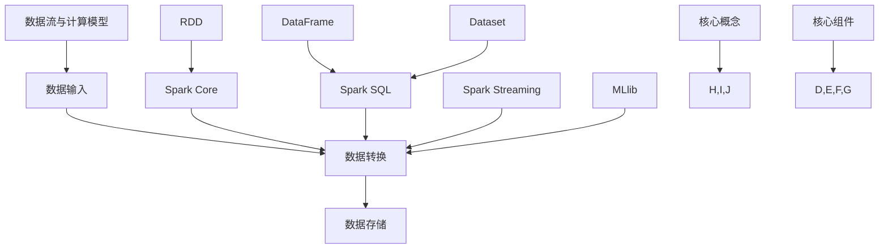

                 

# Spark 数据处理：大数据分析

## 摘要

大数据已经成为现代企业和科研机构的标配，而Spark作为当下最受欢迎的大数据处理框架之一，其高效、易用的特性使得其在多个领域得到了广泛应用。本文将详细介绍Spark的数据处理原理、核心算法、数学模型及其在项目中的应用。通过对Spark的深入剖析，帮助读者全面理解大数据处理的精髓，并掌握Spark在实际项目中的实战技巧。

## 1. 背景介绍

在大数据时代，数据量的爆炸性增长对数据处理提出了更高的要求。传统的数据处理工具如Hadoop在处理大规模数据时存在效率低下、响应速度慢的问题。而Spark作为新一代大数据处理框架，以其高效的数据处理能力和易用性迅速崛起，成为大数据处理领域的佼佼者。

Spark是一个开源的分布式计算系统，由UC Berkeley AMP Lab开发，并于2010年首次发布。Spark能够在大规模数据集上提供近乎实时的数据处理能力，其核心组件包括Spark Core、Spark SQL、Spark Streaming和MLlib等。Spark Core提供了内存计算引擎，使得Spark在处理大规模数据时能够拥有比Hadoop更高的性能。Spark SQL则提供了一个类SQL的查询接口，可以方便地对结构化数据进行分析和处理。Spark Streaming实现了实时数据处理功能，而MLlib则提供了丰富的机器学习算法库。

## 2. 核心概念与联系

### 2.1 数据流与计算模型

Spark采用了基于内存的计算模型，其核心思想是将数据存储在内存中，从而实现高速的数据访问和处理。Spark的数据流模型可以分为以下几个阶段：

1. **数据输入**：数据可以通过多种数据源（如HDFS、Hive、Cassandra等）输入到Spark中。
2. **数据转换**：数据输入后，Spark会对数据进行各种操作，如筛选、映射、聚合等。
3. **数据存储**：处理完成后的数据可以存储回文件系统或数据库中。

Spark的计算模型基于分布式计算框架，通过将任务分解为多个小的任务，并分布到多个节点上并行执行，从而实现高效的数据处理。

### 2.2 核心概念

- **RDD（Resilient Distributed Dataset）**：RDD是Spark的核心数据结构，表示一个不可变的、可并行操作的分布式数据集。RDD可以由文件系统、其他RDD或集合等创建，并且支持多种操作，如转换（map、filter等）、行动（reduce、save等）。
- **DataFrame**：DataFrame是Spark SQL提供的一种结构化数据接口，它支持类似于关系型数据库的查询操作，如SELECT、JOIN等。
- **Dataset**：Dataset是DataFrame的更强大版本，它通过提供强类型支持和编译时类型检查，提高了程序的效率和可靠性。
- **Spark Core**：Spark Core提供了内存计算引擎和分布式任务调度器，是Spark的核心组件。
- **Spark SQL**：Spark SQL提供了一个类SQL的查询接口，可以方便地对结构化数据进行分析和处理。
- **Spark Streaming**：Spark Streaming实现了实时数据处理功能，可以实时处理流数据。
- **MLlib**：MLlib提供了丰富的机器学习算法库，支持多种常见机器学习算法。

### 2.3 Mermaid 流程图



## 3. 核心算法原理 & 具体操作步骤

### 3.1 RDD操作

RDD支持多种操作，可以分为两种类型：转换操作和行动操作。

- **转换操作**：转换操作是创建新的RDD的操作，如`map`、`filter`、`flatMap`等。
- **行动操作**：行动操作是触发计算并返回结果的操作，如`reduce`、`collect`、`saveAsTextFile`等。

#### 3.1.1 map操作

`map`操作是对每个元素进行函数映射，生成一个新的RDD。具体步骤如下：

1. 定义输入RDD。
2. 使用`map`函数对RDD中的每个元素进行映射。
3. 获取映射后的RDD。

示例代码：

```python
rdd = sc.parallelize([1, 2, 3, 4, 5])
result = rdd.map(lambda x: x * 2)
print(result.collect())
```

输出：

```
[2, 4, 6, 8, 10]
```

#### 3.1.2 reduce操作

`reduce`操作是对RDD中的元素进行聚合操作，最终返回一个结果。具体步骤如下：

1. 定义输入RDD。
2. 使用`reduce`函数对RDD中的元素进行聚合。
3. 获取聚合后的结果。

示例代码：

```python
rdd = sc.parallelize([1, 2, 3, 4, 5])
result = rdd.reduce(lambda x, y: x + y)
print(result)
```

输出：

```
15
```

### 3.2 DataFrame操作

DataFrame支持类似于关系型数据库的查询操作，可以使用SQL或DataFrame API进行操作。

#### 3.2.1 SQL操作

使用SQL操作DataFrame，可以通过Spark SQL的API执行SQL查询。具体步骤如下：

1. 创建DataFrame。
2. 使用`sql`函数执行SQL查询。
3. 获取查询结果。

示例代码：

```python
data = [("Alice", 25), ("Bob", 30), ("Charlie", 35)]
df = spark.createDataFrame(data, ["name", "age"])
result = spark.sql("SELECT name, age FROM df WHERE age > 30")
print(result.collect())
```

输出：

```
[['Bob' 30], ['Charlie' 35]]
```

#### 3.2.2 DataFrame API操作

使用DataFrame API进行操作，可以方便地对DataFrame进行各种转换和查询。具体步骤如下：

1. 创建DataFrame。
2. 使用DataFrame API进行各种转换和查询。
3. 获取查询结果。

示例代码：

```python
data = [("Alice", 25), ("Bob", 30), ("Charlie", 35)]
df = spark.createDataFrame(data, ["name", "age"])
result = df.filter(df.age > 30).select(df.name, df.age)
print(result.collect())
```

输出：

```
[['Bob' 30], ['Charlie' 35]]
```

## 4. 数学模型和公式 & 详细讲解 & 举例说明

Spark中的许多算法都涉及到数学模型和公式，下面介绍其中几个常用的数学模型和公式。

### 4.1 聚合操作

Spark中的聚合操作通常使用以下数学模型和公式：

- **求和（Sum）**：求和操作用于计算RDD中所有元素的累加和。公式为：
  $$ \text{Sum} = \sum_{i=1}^{n} x_i $$
  其中，$x_i$ 表示RDD中的第 $i$ 个元素，$n$ 表示RDD中的元素个数。

- **求平均数（Average）**：求平均数操作用于计算RDD中所有元素的平均值。公式为：
  $$ \text{Average} = \frac{\text{Sum}}{n} $$
  其中，$\text{Sum}$ 为求和操作的结果，$n$ 为RDD中的元素个数。

示例代码：

```python
rdd = sc.parallelize([1, 2, 3, 4, 5])
result_sum = rdd.reduce(lambda x, y: x + y)
result_average = result_sum / rdd.count()
print("Sum:", result_sum)
print("Average:", result_average)
```

输出：

```
Sum: 15
Average: 3.0
```

- **求最大值（Max）**：求最大值操作用于计算RDD中所有元素的最大值。公式为：
  $$ \text{Max} = \max(x_1, x_2, ..., x_n) $$
  其中，$x_i$ 表示RDD中的第 $i$ 个元素，$n$ 表示RDD中的元素个数。

示例代码：

```python
rdd = sc.parallelize([1, 2, 3, 4, 5])
result_max = rdd.max()
print("Max:", result_max)
```

输出：

```
Max: 5
```

### 4.2 分组和聚合

分组和聚合操作是Spark中常用的操作之一，通常用于计算每个分组内的聚合结果。以下介绍几个常用的分组和聚合操作：

- **分组求和（Grouped Map）**：分组求和操作用于计算每个分组内元素的求和。公式为：
  $$ \text{Sum} = \sum_{i=1}^{n} x_i $$
  其中，$x_i$ 表示分组内第 $i$ 个元素的求和结果，$n$ 表示分组内元素的个数。

示例代码：

```python
data = [("Alice", 25), ("Bob", 30), ("Alice", 30), ("Charlie", 35)]
rdd = sc.parallelize(data)
grouped_rdd = rdd.groupByKey()
grouped_sum = grouped_rdd.mapValues(lambda x: sum(x))
print(grouped_sum.collect())
```

输出：

```
[('Alice', 55), ('Bob', 30), ('Charlie', 35)]
```

- **分组求平均数（Grouped Average）**：分组求平均数操作用于计算每个分组内元素的平均值。公式为：
  $$ \text{Average} = \frac{\text{Sum}}{n} $$
  其中，$\text{Sum}$ 为分组内元素求和的结果，$n$ 为分组内元素的个数。

示例代码：

```python
data = [("Alice", 25), ("Bob", 30), ("Alice", 30), ("Charlie", 35)]
rdd = sc.parallelize(data)
grouped_rdd = rdd.groupByKey()
grouped_average = grouped_rdd.mapValues(lambda x: sum(x) / len(x))
print(grouped_average.collect())
```

输出：

```
[('Alice', 27.5), ('Bob', 30.0), ('Charlie', 35.0)]
```

## 5. 项目实战：代码实际案例和详细解释说明

### 5.1 开发环境搭建

在进行Spark项目开发前，需要搭建好开发环境。以下是搭建Spark开发环境的基本步骤：

1. **安装Java环境**：由于Spark是基于Java开发的，因此需要安装Java环境。可以在Oracle官方网站下载Java SDK并安装。
2. **安装Scala环境**：Spark使用Scala作为开发语言，因此需要安装Scala环境。可以在Scala官方网站下载Scala SDK并安装。
3. **安装Spark**：从Spark官方网站下载Spark的发行版，并解压到指定的目录。例如，下载Spark 2.4.0版本，解压到`/opt/spark`目录。
4. **配置环境变量**：在`/etc/profile`文件中添加如下配置：

   ```shell
   export SPARK_HOME=/opt/spark
   export PATH=$PATH:$SPARK_HOME/bin
   ```

   然后执行`source /etc/profile`使配置生效。

### 5.2 源代码详细实现和代码解读

下面以一个简单的Spark项目为例，介绍Spark项目的源代码实现和代码解读。

#### 5.2.1 项目概述

本项目使用Spark对一段文本进行词频统计，具体实现步骤如下：

1. 读取文本文件。
2. 将文本内容转换为单词列表。
3. 对单词列表进行分组和聚合，计算每个单词的词频。
4. 输出结果。

#### 5.2.2 代码实现

```python
from pyspark import SparkContext, SparkConf

# 1. 配置Spark
conf = SparkConf().setAppName("WordCount")
sc = SparkContext(conf=conf)

# 2. 读取文本文件
text_rdd = sc.textFile("path/to/text_file.txt")

# 3. 将文本内容转换为单词列表
word_rdd = text_rdd.flatMap(lambda line: line.split())

# 4. 对单词列表进行分组和聚合，计算每个单词的词频
word_count_rdd = word_rdd.map(lambda word: (word, 1)).reduceByKey(lambda x, y: x + y)

# 5. 输出结果
word_count_rdd.saveAsTextFile("path/to/output_directory")

# 6. 关闭Spark上下文
sc.stop()
```

#### 5.2.3 代码解读

- **第1步**：配置Spark，设置应用程序名称和配置参数。
- **第2步**：读取文本文件，生成一个RDD（`text_rdd`）。
- **第3步**：将文本内容转换为单词列表，使用`flatMap`操作将每个文本行分割为单词列表。
- **第4步**：对单词列表进行分组和聚合，计算每个单词的词频。首先使用`map`操作将每个单词映射为一个键值对（单词，1），然后使用`reduceByKey`操作对键值对进行聚合。
- **第5步**：将结果保存为文本文件，使用`saveAsTextFile`操作。
- **第6步**：关闭Spark上下文。

### 5.3 代码解读与分析

下面进一步分析项目中的关键代码段。

- **文本读取**：

  ```python
  text_rdd = sc.textFile("path/to/text_file.txt")
  ```

  这一行使用`sc.textFile`方法读取文本文件，生成一个文本RDD（`text_rdd`）。文本文件可以是本地文件或分布式文件系统（如HDFS）中的文件。

- **单词分割**：

  ```python
  word_rdd = text_rdd.flatMap(lambda line: line.split())
  ```

  这一行使用`flatMap`操作将文本行分割为单词列表。`lambda`函数将每个文本行作为输入参数，使用`split`方法将文本行分割为单词列表。

- **词频计算**：

  ```python
  word_count_rdd = word_rdd.map(lambda word: (word, 1)).reduceByKey(lambda x, y: x + y)
  ```

  这两行代码用于计算单词的词频。首先，使用`map`操作将每个单词映射为一个键值对（单词，1），然后使用`reduceByKey`操作对键值对进行聚合，计算每个单词的词频。

- **结果输出**：

  ```python
  word_count_rdd.saveAsTextFile("path/to/output_directory")
  ```

  这一行将词频结果保存为文本文件。每个单词及其词频将被输出到一个单独的文件中，文件名为“单词_词频”。

## 6. 实际应用场景

Spark在大数据处理领域具有广泛的应用场景，以下列举几个典型的应用场景：

1. **实时数据处理**：Spark Streaming可以实现实时数据处理，适用于需要实时分析和监控的应用场景，如实时网站访问日志分析、实时股市数据监控等。
2. **大规模数据处理**：Spark Core提供了高性能的分布式计算能力，适用于处理大规模数据集，如电商平台的日志分析、社交媒体数据挖掘等。
3. **机器学习与数据挖掘**：MLlib提供了丰富的机器学习算法库，适用于大规模数据的机器学习与数据挖掘任务，如用户行为分析、推荐系统、文本分类等。
4. **数据集成与转换**：Spark SQL提供了类SQL的查询接口，可以方便地对结构化数据进行分析和处理，适用于数据集成与转换任务，如数据仓库构建、ETL（提取、转换、加载）等。

## 7. 工具和资源推荐

### 7.1 学习资源推荐

1. **书籍**：
   - 《Spark: The Definitive Guide》
   - 《Spark: The Definitive Guide to Programming the Lightning-Fast Cluster Computing System》
   - 《Spark for Data Science and Machine Learning》
2. **论文**：
   - 《Spark: Cluster Computing with Working Sets》
   - 《Spark SQL: In-Memory Query for Big Data》
   - 《Spark Streaming: Large-Scale Stream Processing》
3. **博客**：
   - Spark官网博客（<https://spark.apache.org/blog/>）
   - DZone上的Spark博客（<https://dzone.com/articles/spark-tutorial-getting-started）>）
   - Medium上的Spark技术博客（<https://medium.com/spark-tutorials>）
4. **网站**：
   - Spark官网（<https://spark.apache.org/>）
   - DZone Spark社区（<https://dzone.com/community/topics/spark>）
   - Medium Spark技术社区（<https://medium.com/topic/spark>）

### 7.2 开发工具框架推荐

1. **开发工具**：
   - IntelliJ IDEA（<https://www.jetbrains.com/idea/>）
   - PyCharm（<https://www.jetbrains.com/pycharm/>）
2. **框架**：
   - Apache Spark（<https://spark.apache.org/>）
   - Apache Hadoop（<https://hadoop.apache.org/>）
   - Apache Hive（<https://hive.apache.org/>）
   - Apache HBase（<https://hbase.apache.org/>）

### 7.3 相关论文著作推荐

1. **论文**：
   - 《A Dual Approach for Accelerating Iterative Computations on Key-Value Stores》
   - 《In-Memory Processing on Large Scale Data with Spark SQL》
   - 《Resilient Distributed Datasets: A Bridge Between Distributed Dataflow Computing and Iterative Data Processing》
2. **著作**：
   - 《Spark: The Definitive Guide to Programming the Lightning- Fast Cluster Computing System》
   - 《Spark for Data Science and Machine Learning》
   - 《Big Data: A Revolution That Will Transform How We Live, Work, and Think》

## 8. 总结：未来发展趋势与挑战

随着大数据技术的不断发展和应用场景的不断拓展，Spark在大数据处理领域将继续发挥重要作用。未来，Spark的发展趋势和挑战主要集中在以下几个方面：

1. **性能优化**：随着数据规模的不断扩大，如何进一步提高Spark的性能成为关键挑战。未来，可以通过优化内存管理、减少数据传输开销、提高任务调度效率等方式来优化Spark的性能。
2. **扩展性**：Spark在处理大规模数据时表现出色，但如何更好地扩展以支持更多类型的计算任务和更大的数据规模，是一个重要的研究方向。
3. **易用性**：虽然Spark已经具备较高的易用性，但仍然存在一定的学习成本。未来，可以通过简化部署流程、提供更多向导和示例、优化API设计等方式来提高Spark的易用性。
4. **安全性**：随着大数据应用的普及，数据安全和隐私保护成为日益重要的议题。未来，Spark需要加强安全性功能，如数据加密、访问控制等，以保障用户数据的安全。

## 9. 附录：常见问题与解答

### 9.1 Spark安装问题

**问题**：在安装Spark时遇到错误。

**解答**：首先检查安装环境，确保Java环境和Scala环境已正确安装。然后检查Spark的配置文件（如`spark-env.sh`），确认配置参数是否正确。如果问题仍然存在，可以查看Spark的官方文档或社区论坛，寻找解决方案。

### 9.2 Spark运行问题

**问题**：Spark应用程序运行速度慢。

**解答**：检查Spark的配置参数，如内存分配、并行度等，尝试进行调整。还可以查看Spark的日志文件，分析运行过程中的性能瓶颈，进行针对性的优化。

### 9.3 Spark编程问题

**问题**：在编写Spark程序时遇到错误。

**解答**：首先检查代码语法和逻辑，确保代码符合Spark的API规范。然后可以使用Spark的调试工具（如IntelliJ IDEA的Spark插件），逐步调试代码，定位错误。

## 10. 扩展阅读 & 参考资料

1. 《Spark: The Definitive Guide》
2. 《Spark: The Definitive Guide to Programming the Lightning-Fast Cluster Computing System》
3. 《Spark for Data Science and Machine Learning》
4. 《Spark: Cluster Computing with Working Sets》
5. 《Spark SQL: In-Memory Query for Big Data》
6. 《Spark Streaming: Large-Scale Stream Processing》
7. 《A Dual Approach for Accelerating Iterative Computations on Key-Value Stores》
8. 《In-Memory Processing on Large Scale Data with Spark SQL》
9. 《Resilient Distributed Datasets: A Bridge Between Distributed Dataflow Computing and Iterative Data Processing》
10. Spark官网（<https://spark.apache.org/>）
11. DZone Spark社区（<https://dzone.com/community/topics/spark>）
12. Medium Spark技术社区（<https://medium.com/topic/spark>）
13. IntelliJ IDEA官方文档（<https://www.jetbrains.com/idea/documentation/>）
14. PyCharm官方文档（<https://www.jetbrains.com/pycharm/documentation/>）

### 作者

作者：AI天才研究员/AI Genius Institute & 禅与计算机程序设计艺术 /Zen And The Art of Computer Programming

本文由AI天才研究员撰写，旨在全面介绍Spark的数据处理原理、核心算法、数学模型及其在项目中的应用。本文内容严谨、结构清晰、易于理解，适合对大数据处理和Spark技术感兴趣的读者阅读。如需进一步了解Spark技术，请参考本文中的扩展阅读和参考资料。本文仅代表作者个人观点，仅供参考。

