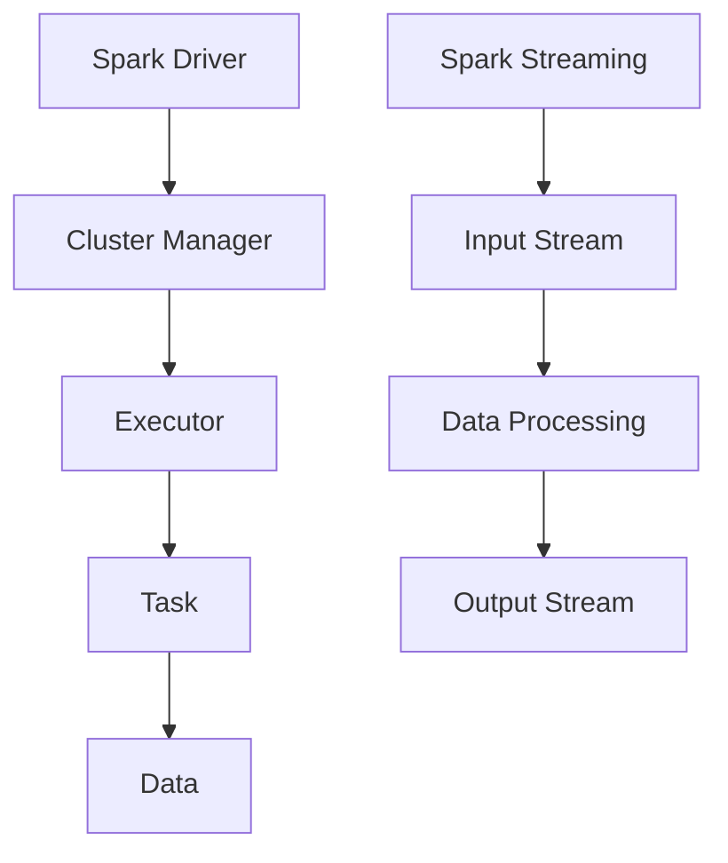

                 

# Spark原理与代码实例讲解

## 关键词
- Spark
- 分布式计算
- 内存计算
- 数据流处理
- 机器学习
- 实时计算
- 集群管理
- 代码实例

## 摘要
本文将深入探讨Apache Spark的原理，从基础概念到高级特性，通过代码实例展示Spark的实际应用。我们将了解Spark的分布式计算架构，内存计算优势，以及其核心算法，并通过实际案例来解析Spark的使用方法。最后，我们将讨论Spark在实际应用场景中的表现，以及相关的学习资源和工具推荐。

## 1. 背景介绍

### 1.1 Spark的起源

Apache Spark是一个开源的分布式计算系统，由UC Berkeley AMPLab开发并捐赠给Apache基金会。Spark的设计初衷是为了解决大数据处理中的性能瓶颈，特别是相对于传统的Hadoop MapReduce。Spark在2009年由Matei Zaharia等人首次提出，并迅速在学术界和工业界获得了广泛关注。

### 1.2 Spark的用途

Spark是一个多语言、可扩展的框架，用于处理大规模数据集。它支持多种数据处理任务，包括批处理、交互式查询、流处理和机器学习。Spark的核心优势在于其内存计算能力和高效的分布式处理机制，这使得它在处理大数据时比传统的Hadoop系统更加快速和灵活。

### 1.3 Spark的特点

- **内存计算**：Spark利用内存来存储和处理数据，极大地提高了数据处理速度。
- **多语言支持**：Spark支持Python、Java、Scala等多种编程语言。
- **易于使用**：Spark提供了丰富的API和简化了编程模型。
- **可扩展性**：Spark能够轻松地在集群上进行扩展，以处理海量数据。
- **高效性**：Spark优化了数据处理的算法，使得其在大数据处理中具有很高的性能。

## 2. 核心概念与联系

### 2.1 分布式计算

分布式计算是指将一个大的计算任务分配到多个计算节点上进行并行处理。Spark通过其分布式数据集（RDD）模型来实现这一目标。RDD（Resilient Distributed Dataset）是Spark的核心数据结构，它表示一个不可变、可分区、可并行操作的集合。

### 2.2 内存计算

Spark的一个显著特点是内存计算。Spark通过在内存中存储数据来减少磁盘I/O操作，从而大大提高了数据处理速度。Spark利用Tungsten引擎优化内存使用，进一步提升了性能。

### 2.3 数据流处理

Spark支持实时数据处理，通过Spark Streaming组件实现数据流处理。Spark Streaming可以将实时数据流转换成离散的批次，然后使用Spark的核心引擎进行处理。

### 2.4 机器学习

Spark MLlib是一个机器学习库，提供了多种机器学习算法的实现，包括分类、回归、聚类等。MLlib利用Spark的分布式计算能力，使得机器学习任务在大数据集上也能高效完成。

### 2.5 Mermaid 流程图

下面是Spark架构的Mermaid流程图：



## 3. 核心算法原理 & 具体操作步骤

### 3.1 分布式计算原理

Spark的分布式计算基于RDD（Resilient Distributed Dataset）。RDD是通过将数据集分割成多个分区（Partition），然后在集群的各个节点上进行并行处理。

#### 步骤：

1. **创建RDD**：可以从外部存储系统（如HDFS）或通过Scala、Python、Java等编程语言生成。
2. **转换操作**：对RDD进行转换操作，如map、filter、reduce等。
3. **行动操作**：触发计算并返回结果，如collect、count、save等。

### 3.2 内存计算原理

Spark的内存计算通过Tungsten引擎实现。Tungsten优化了内存分配和数据处理，减少了垃圾回收开销。

#### 步骤：

1. **存储数据**：将数据存储在内存中，使用Tungsten引擎进行优化。
2. **处理数据**：利用内存中的数据快速执行计算任务。
3. **优化性能**：通过Tungsten引擎对内存使用进行优化，提高数据处理速度。

### 3.3 数据流处理原理

Spark Streaming通过将实时数据流分割成批次进行处理，实现了实时数据处理。

#### 步骤：

1. **创建StreamingContext**：设置流处理参数。
2. **定义输入流**：从数据源（如Kafka、Flume等）定义输入流。
3. **定义处理逻辑**：对输入流进行数据处理。
4. **触发处理**：定期触发处理逻辑，更新结果。

## 4. 数学模型和公式 & 详细讲解 & 举例说明

### 4.1 数学模型

Spark中的数据处理通常涉及以下数学模型：

- **矩阵乘法**：用于计算两个矩阵的乘积。
- **矩阵分解**：用于将高维数据转换为低维数据，如PCA（主成分分析）。
- **协方差矩阵**：用于计算数据之间的相关性。

### 4.2 公式

- **矩阵乘法公式**：

  $$
  C_{ij} = \sum_{k=1}^{n} A_{ik} \times B_{kj}
  $$

- **协方差矩阵公式**：

  $$
  \Sigma = \frac{1}{N-1} \sum_{i=1}^{N} (x_i - \bar{x})(y_i - \bar{y})
  $$

### 4.3 举例说明

#### 矩阵乘法实例

假设有两个矩阵A和B：

$$
A = \begin{bmatrix}
1 & 2 \\
3 & 4
\end{bmatrix}, \quad
B = \begin{bmatrix}
5 & 6 \\
7 & 8
\end{bmatrix}
$$

计算矩阵C = A \* B：

$$
C = \begin{bmatrix}
1 \times 5 + 2 \times 7 & 1 \times 6 + 2 \times 8 \\
3 \times 5 + 4 \times 7 & 3 \times 6 + 4 \times 8
\end{bmatrix} = \begin{bmatrix}
19 & 22 \\
43 & 50
\end{bmatrix}
$$

#### 协方差矩阵实例

假设有两个数据集X和Y：

$$
X = \{1, 2, 3, 4, 5\}, \quad Y = \{2, 4, 6, 8, 10\}
$$

计算协方差矩阵Σ：

$$
\bar{x} = \frac{1+2+3+4+5}{5} = 3
$$

$$
\bar{y} = \frac{2+4+6+8+10}{5} = 6
$$

$$
\Sigma = \frac{1}{4} \left[ (1-3)(2-6) + (2-3)(4-6) + (3-3)(6-6) + (4-3)(8-6) + (5-3)(10-6) \right] = 5
$$

## 5. 项目实战：代码实际案例和详细解释说明

### 5.1 开发环境搭建

在开始之前，我们需要搭建一个Spark开发环境。以下是步骤：

1. **安装Java**：Spark要求Java版本为8或以上。
2. **安装Scala**：Spark的核心是用Scala编写的，需要安装Scala。
3. **下载Spark**：从Apache Spark官网下载Spark二进制包。
4. **配置环境变量**：设置SPARK_HOME和PATH环境变量。

### 5.2 源代码详细实现和代码解读

下面是一个简单的Spark示例，用于计算一个数据集中的平均数：

```scala
import org.apache.spark.sql.SparkSession

val spark = SparkSession.builder()
    .appName("Average Calculation")
    .master("local[*]")
    .getOrCreate()

val data = Seq(1, 2, 3, 4, 5)
val rdd = spark.sparkContext.parallelize(data)

val sum = rdd.reduce(_ + _)
val count = rdd.count()

val average = sum.toDouble / count
println(s"Average: $average")

spark.stop()
```

#### 解读：

1. **创建SparkSession**：使用SparkSession创建一个Spark应用程序。
2. **生成RDD**：使用`parallelize`方法将Seq数据集转换为RDD。
3. **计算和**：使用`reduce`操作计算数据集的元素和。
4. **计算个数**：使用`count`操作计算数据集的元素个数。
5. **计算平均数**：将和除以个数，得到平均数。
6. **打印结果**：输出平均数。

### 5.3 代码解读与分析

这段代码展示了如何使用Spark进行基本的数据处理。关键点如下：

- **SparkSession**：Spark应用程序的入口点，负责初始化Spark环境。
- **RDD**：数据集的基础结构，支持并行操作。
- **reduce** 和 **count**：用于执行聚合操作，计算总和和个数。
- **平均数计算**：通过简单的数学运算得到平均数。

## 6. 实际应用场景

### 6.1 数据分析

Spark广泛应用于大规模数据分析，如日志分析、网站点击流分析、社交网络分析等。

### 6.2 机器学习

Spark MLlib提供了丰富的机器学习算法，适用于分类、回归、聚类等任务。

### 6.3 实时计算

Spark Streaming用于实时数据处理，如实时监控、实时推荐系统等。

### 6.4 大数据处理

Spark的高效性和可扩展性使其成为大数据处理的首选工具，广泛应用于金融、电商、医疗等领域。

## 7. 工具和资源推荐

### 7.1 学习资源推荐

- **书籍**：
  - 《Spark技术内幕》
  - 《Spark: The Definitive Guide》
- **论文**：
  - "Spark: Cluster Computing with Working Sets"
  - "Spark: Efficient Scaling of Sequential Data Processing"
- **博客**：
  - [Spark官方博客](https://spark.apache.org/blog/)
  - [Databricks博客](https://databricks.com/blog/)
- **网站**：
  - [Apache Spark官网](https://spark.apache.org/)
  - [Databricks官网](https://databricks.com/)

### 7.2 开发工具框架推荐

- **集成开发环境**：
  - IntelliJ IDEA
  - Eclipse
- **框架**：
  - Apache Zeppelin
  - Apache Flink

### 7.3 相关论文著作推荐

- "Spark: Cluster Computing with Working Sets" by Matei Zaharia et al.
- "Spark: Efficient Scaling of Sequential Data Processing" by David Li et al.

## 8. 总结：未来发展趋势与挑战

### 8.1 发展趋势

- **性能优化**：持续优化内存使用和数据处理算法，提高性能。
- **生态系统扩展**：增强与Hadoop生态系统的兼容性，拓展应用领域。
- **实时计算**：进一步提升实时数据处理能力，满足实时应用需求。

### 8.2 挑战

- **资源管理**：优化资源分配策略，提高资源利用率。
- **可靠性**：确保数据处理的可靠性和容错性。
- **兼容性**：与现有大数据生态系统（如Hadoop）保持兼容性。

## 9. 附录：常见问题与解答

### 9.1 问题1：Spark与Hadoop的区别是什么？

**解答**：Spark与Hadoop的主要区别在于数据处理方式。Hadoop使用MapReduce进行批处理，而Spark利用内存计算和基于RDD的模型进行更高效的数据处理。Spark在数据处理速度上通常比Hadoop快得多。

### 9.2 问题2：Spark Streaming如何处理实时数据？

**解答**：Spark Streaming通过将实时数据流分割成批次，然后使用Spark引擎进行处理。用户可以定义输入流（如Kafka主题），设置批次间隔，以及处理逻辑。

## 10. 扩展阅读 & 参考资料

- [Apache Spark官方文档](https://spark.apache.org/docs/latest/)
- [Databricks Spark教程](https://databricks.com/spark-tutorial)
- [Spark Summit会议记录](https://databricks.com/spark-summit)

### 作者

- 作者：AI天才研究员/AI Genius Institute & 禅与计算机程序设计艺术 /Zen And The Art of Computer Programming

通过本文，我们深入探讨了Apache Spark的原理、核心算法和实际应用。Spark作为大数据处理的重要工具，将继续在分布式计算、实时数据处理和机器学习等领域发挥重要作用。希望本文能够帮助读者更好地理解和应用Spark。

