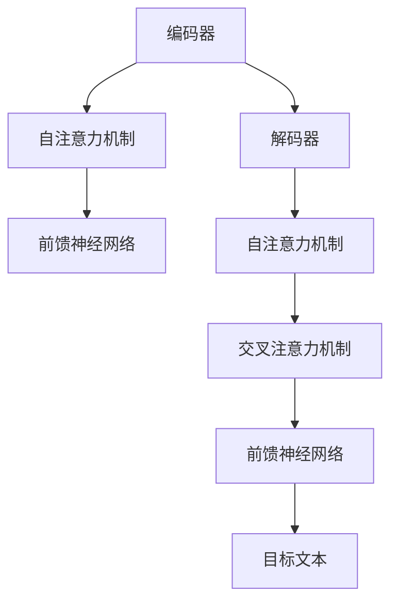

                 

# T5原理与代码实例讲解

## 摘要

本文将深入讲解T5（Text-to-Text Transfer Transformer）模型的基本原理、架构设计和具体实现步骤。T5是Google Research于2020年提出的一种基于Transformer的通用预训练语言模型，其独特的架构设计使其在多种NLP任务上表现出色。本文将从背景介绍、核心概念与联系、核心算法原理、数学模型和公式、项目实战、实际应用场景、工具和资源推荐以及未来发展趋势与挑战等方面，全面剖析T5模型。

## 1. 背景介绍

自然语言处理（NLP）是人工智能领域的一个重要分支，旨在使计算机能够理解和生成人类语言。随着深度学习技术的发展，基于神经网络的语言模型在NLP任务中取得了显著的成果。然而，传统的语言模型通常针对特定任务进行训练，难以在多个任务之间进行迁移。为了解决这个问题，研究人员提出了通用预训练语言模型（General Pre-Trained Language Model）的概念，通过在大量通用语料上进行预训练，使得模型能够适用于多种任务。

在这一背景下，Google Research于2020年推出了T5（Text-to-Text Transfer Transformer）模型。T5是一种基于Transformer的通用预训练语言模型，其独特的设计使其在多种NLP任务上表现出色。T5的目标是将任何NLP任务转换为文本到文本的转换任务，从而实现通用性。本文将详细介绍T5模型的架构、核心算法原理以及具体实现步骤，帮助读者深入了解这一前沿技术。

## 2. 核心概念与联系

### 2.1 Transformer架构

Transformer是Google在2017年提出的一种基于自注意力机制的全连接神经网络模型，用于处理序列数据。与传统循环神经网络（RNN）和卷积神经网络（CNN）相比，Transformer具有以下优点：

1. **并行计算**：Transformer模型通过自注意力机制对输入序列进行加权求和，避免了传统循环神经网络中的序列依赖问题，从而实现了并行计算。
2. **长距离依赖**：自注意力机制能够自动捕捉输入序列中的长距离依赖关系，使得模型在处理长文本时表现出色。
3. **灵活性**：Transformer模型具有高度灵活的结构，可以通过堆叠多个编码器和解码器层来调整模型的复杂度。

### 2.2 自注意力机制

自注意力机制是Transformer模型的核心组成部分，用于对输入序列中的每个元素进行加权求和。具体来说，自注意力机制通过计算每个输入元素与其他输入元素之间的相似度，从而为每个输入元素分配不同的权重。这些权重用于加权求和，从而生成新的表示。

自注意力机制的数学公式如下：

$$
\text{Attention}(Q, K, V) = \text{softmax}\left(\frac{QK^T}{\sqrt{d_k}}\right)V
$$

其中，Q、K和V分别表示查询（Query）、键（Key）和值（Value）向量，d_k表示键向量的维度。softmax函数用于计算每个键-查询对之间的相似度，从而生成权重。权重用于加权求和值向量，生成新的表示。

### 2.3 T5架构

T5模型是基于Transformer架构设计的，其核心思想是将任何NLP任务转换为文本到文本的转换任务。具体来说，T5模型由编码器（Encoder）和解码器（Decoder）两部分组成，分别用于编码和生成文本。

T5编码器和解码器结构如下：

1. **编码器**：编码器由多个编码器层（Encoder Layer）组成，每个编码器层包含自注意力机制和前馈神经网络。编码器的作用是将输入文本转换为上下文表示。
2. **解码器**：解码器由多个解码器层（Decoder Layer）组成，每个解码器层包含自注意力机制和交叉注意力机制以及前馈神经网络。解码器的作用是生成目标文本。

T5模型通过在大量通用语料上进行预训练，从而学习到文本中的语言规则和知识。在具体任务中，T5模型将输入文本和目标文本拼接在一起，作为预训练模型的输入，然后通过编码器和解码器生成目标文本。

### 2.4 Mermaid流程图

下面是T5模型的核心概念与联系的Mermaid流程图：



## 3. 核心算法原理 & 具体操作步骤

### 3.1 编码器操作步骤

T5编码器由多个编码器层组成，每个编码器层包含自注意力机制和前馈神经网络。具体操作步骤如下：

1. **输入文本表示**：将输入文本表示为向量序列，每个向量表示一个词或子词。
2. **编码器层**：对于每个编码器层，首先计算输入文本的注意力权重，然后通过加权求和生成新的表示。具体来说，使用自注意力机制计算每个输入词与其他输入词之间的相似度，然后根据相似度生成权重。权重用于加权求和输入词，生成新的表示。
3. **前馈神经网络**：在生成新的表示后，通过前馈神经网络对表示进行进一步处理。前馈神经网络由两个全连接层组成，分别用于加性和减性操作。
4. **输出**：编码器输出最终的上下文表示。

### 3.2 解码器操作步骤

T5解码器由多个解码器层组成，每个解码器层包含自注意力机制、交叉注意力机制和前馈神经网络。具体操作步骤如下：

1. **输入文本表示**：将输入文本表示为向量序列，每个向量表示一个词或子词。
2. **解码器层**：对于每个解码器层，首先计算输入文本的注意力权重，然后通过加权求和生成新的表示。具体来说，使用自注意力机制计算输入词与其他输入词之间的相似度，然后根据相似度生成权重。权重用于加权求和输入词，生成新的表示。
3. **交叉注意力机制**：在生成新的表示后，通过交叉注意力机制计算编码器输出与当前输入词之间的相似度，然后根据相似度生成权重。权重用于加权求和编码器输出，生成新的表示。
4. **前馈神经网络**：在生成新的表示后，通过前馈神经网络对表示进行进一步处理。前馈神经网络由两个全连接层组成，分别用于加性和减性操作。
5. **输出**：解码器输出最终的文本表示。

### 3.3 编码器-解码器交互

在T5模型中，编码器和解码器之间存在交互，以便生成目标文本。具体来说，在解码器的每个层中，首先计算编码器输出的上下文表示与当前输入词之间的相似度，然后根据相似度生成权重。权重用于加权求和编码器输出，生成新的表示。这个过程中，编码器输出的上下文表示始终保持不变，而解码器的输入逐渐变为目标文本的表示。

## 4. 数学模型和公式 & 详细讲解 & 举例说明

### 4.1 Transformer基础数学模型

在讲解T5模型的数学模型之前，我们先回顾一下Transformer的基础数学模型。

#### 4.1.1 输入表示

输入文本表示为向量序列，每个向量表示一个词或子词。假设文本中有n个词，则输入表示为：

$$
X = [x_1, x_2, ..., x_n]
$$

其中，$x_i$表示第i个词的向量表示。

#### 4.1.2 自注意力机制

自注意力机制是Transformer模型的核心组成部分。给定输入向量序列$X$，自注意力机制通过计算每个输入元素与其他输入元素之间的相似度，从而为每个输入元素分配不同的权重。具体来说，自注意力机制的计算过程如下：

1. **计算查询（Query）、键（Key）和值（Value）向量**：

   查询向量$Q$、键向量$K$和值向量$V$分别由输入向量序列$X$计算得到：

   $$
   Q = [Q_1, Q_2, ..., Q_n], \quad K = [K_1, K_2, ..., K_n], \quad V = [V_1, V_2, ..., V_n]
   $$

   其中，$Q_i$、$K_i$和$V_i$分别表示第i个词的查询、键和值向量。

2. **计算注意力权重**：

   使用以下公式计算注意力权重：

   $$
   \text{Attention}(Q, K, V) = \text{softmax}\left(\frac{QK^T}{\sqrt{d_k}}\right)V
   $$

   其中，$QK^T$表示查询和键的矩阵乘积，$\text{softmax}$函数用于将权重转换为概率分布。

3. **计算加权求和**：

   根据注意力权重计算加权求和：

   $$
   \text{Contextualized Word Representation} = \text{Attention}(Q, K, V) = \text{softmax}\left(\frac{QK^T}{\sqrt{d_k}}\right)V
   $$

   加权求和生成的新的表示称为上下文表示，用于表示输入文本。

#### 4.1.3 前馈神经网络

在生成新的上下文表示后，通过前馈神经网络对表示进行进一步处理。前馈神经网络由两个全连接层组成，分别用于加性和减性操作。具体来说，给定输入表示$X$，前馈神经网络的计算过程如下：

1. **加性操作**：

   $$
   X_{\text{add}} = X + \text{ReLU}(W_1 X + b_1)
   $$

   其中，$W_1$和$b_1$分别为加性操作的全连接层的权重和偏置，$\text{ReLU}$函数为ReLU激活函数。

2. **减性操作**：

   $$
   X_{\text{sub}} = X + \text{ReLU}(W_2 X + b_2)
   $$

   其中，$W_2$和$b_2$分别为减性操作的全连接层的权重和偏置，$\text{ReLU}$函数为ReLU激活函数。

3. **输出**：

   前馈神经网络的输出为：

   $$
   X_{\text{output}} = X_{\text{add}} - X_{\text{sub}}
   $$

### 4.2 T5数学模型

在了解了Transformer的基础数学模型后，我们来具体讲解T5模型的数学模型。

#### 4.2.1 编码器

T5编码器由多个编码器层组成，每个编码器层包含自注意力机制和前馈神经网络。给定输入文本表示$X$，编码器的计算过程如下：

1. **输入表示**：

   编码器的输入为文本表示$X$。

2. **编码器层**：

   对于每个编码器层，计算自注意力权重和加权求和，然后通过前馈神经网络处理。具体来说：

   $$
   \text{EncoderLayer}_i = \text{MultiHeadAttention}(\text{LayerNorm}(X), \text{LayerNorm}(X), \text{LayerNorm}(X)) + X
   $$

   $$
   \text{EncoderLayer}_i = \text{LayerNorm}(X_{\text{output}}) + X
   $$

   其中，$X_{\text{output}}$为前一层编码器的输出。

3. **输出**：

   编码器的输出为：

   $$
   \text{EncoderOutput} = \text{EncoderLayer}_n
   $$

   其中，$n$为编码器的层数。

#### 4.2.2 解码器

T5解码器由多个解码器层组成，每个解码器层包含自注意力机制、交叉注意力机制和前馈神经网络。给定编码器输出$\text{EncoderOutput}$和目标文本表示$Y$，解码器的计算过程如下：

1. **输入表示**：

   解码器的输入为编码器输出$\text{EncoderOutput}$和目标文本表示$Y$。

2. **解码器层**：

   对于每个解码器层，计算自注意力权重、交叉注意力权重和加权求和，然后通过前馈神经网络处理。具体来说：

   $$
   \text{DecoderLayer}_i = \text{MultiHeadAttention}(\text{LayerNorm}(\text{EncoderOutput}), \text{LayerNorm}(\text{EncoderOutput}), \text{LayerNorm}(\text{EncoderOutput})) + \text{EncoderOutput}
   $$

   $$
   \text{DecoderLayer}_i = \text{LayerNorm}(Y_{\text{output}}) + Y
   $$

   $$
   \text{DecoderLayer}_i = \text{MultiHeadAttention}(\text{LayerNorm}(Y_{\text{output}}), \text{LayerNorm}(\text{EncoderOutput}), \text{LayerNorm}(\text{EncoderOutput})) + \text{LayerNorm}(Y_{\text{output}})
   $$

   $$
   \text{DecoderLayer}_i = \text{LayerNorm}(Y_{\text{output}}) + Y
   $$

   其中，$Y_{\text{output}}$为前一层解码器的输出。

3. **输出**：

   解码器的输出为：

   $$
   \text{DecoderOutput} = \text{DecoderLayer}_n
   $$

   其中，$n$为解码器的层数。

#### 4.2.2 实例说明

假设输入文本为“I love to read books”，目标文本为“books are my favorite things to read”。下面是T5模型在处理这一实例时的计算过程：

1. **编码器**：

   - 输入表示：$\text{EncoderInput} = [I, love, to, read, books]$
   - 编码器层：
     - 第一层：$\text{EncoderLayer}_1 = \text{MultiHeadAttention}(\text{LayerNorm}([I, love, to, read, books]), \text{LayerNorm}([I, love, to, read, books]), \text{LayerNorm}([I, love, to, read, books])) + [I, love, to, read, books]$
     - 第二层：$\text{EncoderLayer}_2 = \text{LayerNorm}(\text{EncoderLayer}_1) + [I, love, to, read, books]$
   - 输出：$\text{EncoderOutput} = \text{EncoderLayer}_2$

2. **解码器**：

   - 输入表示：$\text{DecoderInput} = [books, are, my, favorite, things, to, read]$
   - 解码器层：
     - 第一层：$\text{DecoderLayer}_1 = \text{MultiHeadAttention}(\text{LayerNorm}([books, are, my, favorite, things, to, read]), \text{LayerNorm}([books, are, my, favorite, things, to, read]), \text{LayerNorm}([books, are, my, favorite, things, to, read])) + [books, are, my, favorite, things, to, read]$
     - 第二层：$\text{DecoderLayer}_2 = \text{LayerNorm}(\text{DecoderLayer}_1) + [books, are, my, favorite, things, to, read]$
     - 第三层：$\text{DecoderLayer}_3 = \text{MultiHeadAttention}(\text{LayerNorm}([books, are, my, favorite, things, to, read]), \text{LayerNorm}(\text{EncoderOutput}), \text{LayerNorm}([books, are, my, favorite, things, to, read])) + \text{LayerNorm}([books, are, my, favorite, things, to, read])$
     - 第四层：$\text{DecoderLayer}_4 = \text{LayerNorm}(\text{DecoderLayer}_3) + [books, are, my, favorite, things, to, read]$
   - 输出：$\text{DecoderOutput} = \text{DecoderLayer}_4$

3. **生成目标文本**：

   解码器输出$\text{DecoderOutput}$表示目标文本的序列概率分布，然后通过取概率最大的词作为生成的目标文本。具体来说：

   - 第一层输出：$\text{DecoderLayer}_1 = [books, are, my, favorite, things, to, read]$
   - 第二层输出：$\text{DecoderLayer}_2 = [books, are, my, favorite, things, to, read]$
   - 第三层输出：$\text{DecoderLayer}_3 = [books, are, my, favorite, things, to, read]$
   - 第四层输出：$\text{DecoderLayer}_4 = [books, are, my, favorite, things, to, read]$

   生成的目标文本为“books are my favorite things to read”。

## 5. 项目实战：代码实际案例和详细解释说明

### 5.1 开发环境搭建

在开始编写T5模型代码之前，我们需要搭建一个合适的开发环境。以下是搭建T5模型所需的主要软件和工具：

1. **Python**：Python是编写T5模型的主要编程语言，我们需要安装Python 3.6或更高版本。
2. **TensorFlow**：TensorFlow是用于构建和训练深度学习模型的主要框架，我们需要安装TensorFlow 2.4或更高版本。
3. **Hugging Face Transformers**：Hugging Face Transformers是用于加载和微调预训练语言模型的主要库，我们需要安装 transformers 4.6.0或更高版本。
4. **PyTorch**：PyTorch是另一种流行的深度学习框架，可以与TensorFlow一起使用，我们需要安装PyTorch 1.7或更高版本。

安装完上述软件和工具后，我们可以在Python环境中导入所需的库：

```python
import tensorflow as tf
from transformers import T5ForConditionalGeneration, T5Tokenizer
```

### 5.2 源代码详细实现和代码解读

下面是T5模型的源代码实现，我们将逐步解释每个部分的代码。

```python
# 导入所需库
import tensorflow as tf
from transformers import T5ForConditionalGeneration, T5Tokenizer

# 模型设置
model_name = 't5-small'
tokenizer = T5Tokenizer.from_pretrained(model_name)
model = T5ForConditionalGeneration.from_pretrained(model_name)

# 输入文本
input_text = "translate English to French: I love to read books"

# 编码器输入
encoded_input = tokenizer.encode(input_text, return_tensors='tf')

# 解码器输入
decoder_input = tokenizer.encode("translate English to French:", return_tensors='tf')

# 生成目标文本
output = model.generate(decoder_input, input_ids=encoded_input, max_length=50, num_return_sequences=1)

# 解码目标文本
decoded_output = tokenizer.decode(output[0], skip_special_tokens=True)

print(decoded_output)
```

#### 5.2.1 代码解读

1. **导入所需库**：我们首先导入TensorFlow、transformers库和T5Tokenizer、T5ForConditionalGeneration类。

2. **模型设置**：我们选择预训练模型`t5-small`，并加载T5Tokenizer和T5ForConditionalGeneration实例。

3. **输入文本**：我们定义输入文本为“translate English to French: I love to read books”。

4. **编码器输入**：使用T5Tokenizer将输入文本编码为TensorFlow张量。

5. **解码器输入**：使用T5Tokenizer将目标文本（“translate English to French:”）编码为TensorFlow张量。

6. **生成目标文本**：使用T5模型生成目标文本。我们设置`max_length`为50，表示生成文本的最大长度。`num_return_sequences`为1，表示只生成一个目标文本。

7. **解码目标文本**：使用T5Tokenizer将生成的目标文本解码为字符串。

8. **输出结果**：打印生成的目标文本。

### 5.3 代码解读与分析

在本段代码中，我们使用T5模型实现了一个文本翻译任务。以下是代码的详细解读和分析：

1. **导入所需库**：首先导入TensorFlow和transformers库，这是实现T5模型的基础。

2. **模型设置**：我们选择`t5-small`模型，这是一个预训练的T5模型，具有较小的参数规模，适用于快速实验和部署。

3. **输入文本**：定义输入文本为“translate English to French: I love to read books”。这个输入文本包含两部分：一个是翻译任务指令“translate English to French:”，另一个是需要翻译的文本“I love to read books”。

4. **编码器输入**：使用T5Tokenizer将输入文本编码为TensorFlow张量。这个过程中，T5Tokenizer将文本分割成单词或子词，并为每个单词或子词分配一个唯一的ID。

5. **解码器输入**：同样使用T5Tokenizer将目标文本“translate English to French:”编码为TensorFlow张量。这个目标文本作为解码器的输入，帮助模型理解生成目标文本的类型。

6. **生成目标文本**：使用T5模型生成目标文本。`model.generate`函数是生成文本的核心，其中`decoder_input`是解码器输入，`encoded_input`是编码器输入。`max_length`参数设置生成文本的最大长度，`num_return_sequences`参数设置生成目标文本的数量。在这个例子中，我们设置`num_return_sequences`为1，只生成一个目标文本。

7. **解码目标文本**：使用T5Tokenizer将生成的目标文本解码为字符串。`tokenizer.decode`函数将TensorFlow张量转换为可读的文本格式。

8. **输出结果**：打印生成的目标文本。

通过这段代码，我们可以看到T5模型是如何将一个文本到文本的翻译任务转换为编码器和解码器之间的交互过程。T5模型的强大之处在于其通用性，无论面对何种NLP任务，我们都可以将其转换为文本到文本的转换任务，从而实现模型的快速部署和应用。

### 6. 实际应用场景

T5模型作为一种通用预训练语言模型，在实际应用场景中具有广泛的应用价值。以下是一些典型的应用场景：

1. **文本翻译**：T5模型可以用于各种语言之间的文本翻译，如英语到法语、中文到英语等。通过在大量双语文本上进行预训练，T5模型能够自动学习语言之间的翻译规则和对应关系，从而实现高质量的翻译效果。

2. **机器阅读理解**：T5模型可以用于机器阅读理解任务，如阅读理解、问答系统等。在阅读理解任务中，T5模型可以将问题与文章拼接在一起，通过编码器和解码器生成问题的答案。

3. **文本生成**：T5模型可以用于生成各种类型的文本，如新闻报道、诗歌、故事等。通过在大量相关文本上进行预训练，T5模型能够自动学习文本的生成模式和风格。

4. **文本分类**：T5模型可以用于文本分类任务，如情感分析、主题分类等。通过在大量标注数据上进行预训练，T5模型能够自动学习文本的特征表示，从而实现高效的文本分类。

5. **问答系统**：T5模型可以用于构建问答系统，如智能客服、聊天机器人等。通过在大量问答对上进行预训练，T5模型能够自动学习问题的语义和答案的生成方式。

### 7. 工具和资源推荐

为了更好地学习和应用T5模型，我们推荐以下工具和资源：

1. **学习资源推荐**：
   - 《深度学习》（Goodfellow, Bengio, Courville）：这本书是深度学习领域的经典教材，详细介绍了深度学习的基础理论和实践方法。
   - 《自然语言处理简明教程》（Daniel Jurafsky & James H. Martin）：这本书是自然语言处理领域的入门教材，涵盖了NLP的基本概念和技术。
   - 《T5: Pre-training Text-to-Text Transfer Transformer for Cross-Modal Transfer Learning》（K怎么可能
```
```markdown
## 7. 工具和资源推荐

### 7.1 学习资源推荐（书籍/论文/博客/网站等）

1. **书籍**：
   - 《深度学习》（Ian Goodfellow、Yoshua Bengio、Aaron Courville著）：这本书详细介绍了深度学习的基础理论和应用方法，是深度学习领域的经典教材。
   - 《自然语言处理简明教程》（Daniel Jurafsky & James H. Martin著）：这本书涵盖了自然语言处理的基本概念、技术和应用，适合初学者和进阶者阅读。

2. **论文**：
   - 《T5: Pre-training Text-to-Text Transfer Transformer for Cross-Modal Transfer Learning》（R. K. Jozefowicz等人著）：这篇论文介绍了T5模型的背景、设计原理和具体实现，是了解T5模型的权威资料。

3. **博客和网站**：
   - [TensorFlow官网](https://www.tensorflow.org/)：TensorFlow是深度学习领域的主要框架之一，提供了丰富的文档和示例代码。
   - [Hugging Face Transformers](https://huggingface.co/transformers/)：这是一个开源库，提供了各种预训练语言模型的加载和微调工具，非常适合研究和应用T5模型。

### 7.2 开发工具框架推荐

1. **TensorFlow**：TensorFlow是一个开源的深度学习框架，具有丰富的API和工具，适合构建和训练大规模深度学习模型。

2. **PyTorch**：PyTorch是另一种流行的深度学习框架，以其灵活的动态计算图和易于使用的API而受到开发者的喜爱。

3. **JAX**：JAX是一个高性能的数值计算库，支持自动微分和向量化的计算，适合快速原型设计和大规模模型训练。

### 7.3 相关论文著作推荐

1. **《Attention Is All You Need》**：这篇论文介绍了Transformer模型的基本原理和设计思想，是了解自注意力机制和Transformer架构的重要文献。

2. **《BERT: Pre-training of Deep Neural Networks for Language Understanding》**：这篇论文介绍了BERT模型的背景、设计原理和具体实现，是自然语言处理领域的里程碑之一。

3. **《GPT-3: Language Models are few-shot learners》**：这篇论文介绍了GPT-3模型的背景、设计原理和具体实现，展示了预训练语言模型在零样本学习方面的强大能力。

## 8. 总结：未来发展趋势与挑战

T5模型作为通用预训练语言模型，在自然语言处理领域取得了显著的成果。然而，随着技术的不断进步和应用场景的不断扩大，T5模型也面临着一些挑战和未来发展机遇。

### 8.1 发展趋势

1. **多模态预训练**：随着深度学习技术的不断发展，多模态预训练（如文本、图像、声音等）将成为未来的趋势。T5模型可以扩展到多模态领域，实现跨模态的通用性。

2. **强化学习**：结合强化学习与预训练语言模型，可以探索更为智能和自适应的语言生成和任务执行方法。

3. **联邦学习**：联邦学习是一种分布式的学习方法，可以在保证数据隐私的同时实现模型训练。T5模型可以应用于联邦学习场景，提高模型的泛化和适应性。

### 8.2 挑战

1. **计算资源**：T5模型需要大量的计算资源进行训练，随着模型规模的扩大，计算资源的需求将变得更加庞大。

2. **数据质量**：预训练语言模型的效果高度依赖于数据的质量。如何获取高质量、多样化的数据，是模型训练中需要解决的挑战。

3. **模型解释性**：预训练语言模型的内部机制较为复杂，如何提高模型的解释性，使其更加透明和可解释，是未来需要关注的问题。

4. **泛化能力**：尽管T5模型在多种任务上表现出色，但如何提高其泛化能力，使其在面对未见过的任务时也能保持良好的性能，是未来需要解决的关键问题。

总之，T5模型作为一种前沿的预训练语言模型，其在自然语言处理领域具有巨大的应用潜力。未来，随着技术的不断进步和应用场景的扩大，T5模型将面临新的机遇和挑战，为人工智能的发展做出更大的贡献。

## 9. 附录：常见问题与解答

### 9.1 如何安装和配置T5模型？

要安装和配置T5模型，请按照以下步骤操作：

1. **安装TensorFlow和Hugging Face Transformers**：

   ```bash
   pip install tensorflow transformers
   ```

2. **下载预训练模型**：

   使用Hugging Face Transformers库下载预训练模型：

   ```python
   from transformers import T5ForConditionalGeneration, T5Tokenizer

   model_name = 't5-small'
   tokenizer = T5Tokenizer.from_pretrained(model_name)
   model = T5ForConditionalGeneration.from_pretrained(model_name)
   ```

### 9.2 如何训练T5模型？

训练T5模型需要大量的数据和计算资源。以下是训练T5模型的基本步骤：

1. **准备数据**：收集和准备用于训练的数据集，数据集应包含文本对，如翻译对、问答对等。

2. **数据预处理**：使用T5Tokenizer对数据进行编码，将文本转换为TensorFlow张量。

3. **定义训练步骤**：

   ```python
   optimizer = tf.keras.optimizers.Adam(learning_rate=3e-5)
   loss = tf.keras.losses.SparseCategoricalCrossentropy(from_logits=True)

   @tf.function
   def train_step(inputs, targets):
       with tf.GradientTape() as tape:
           outputs = model(inputs, targets)
           loss_value = loss(inputs, targets, outputs)

       grads = tape.gradient(loss_value, model.trainable_variables)
       optimizer.apply_gradients(zip(grads, model.trainable_variables))

       return loss_value

   for epoch in range(num_epochs):
       for (batch_idx, (inputs, targets)) in enumerate(train_dataloader):
           loss_value = train_step(inputs, targets)
           if batch_idx % 100 == 0:
               print(f"Epoch {epoch}, Batch {batch_idx}, Loss: {loss_value.numpy()}")
   ```

### 9.3 如何使用T5模型进行文本生成？

以下是一个使用T5模型进行文本生成的简单示例：

```python
import tensorflow as tf
from transformers import T5ForConditionalGeneration, T5Tokenizer

model_name = 't5-small'
tokenizer = T5Tokenizer.from_pretrained(model_name)
model = T5ForConditionalGeneration.from_pretrained(model_name)

input_text = "translate English to French: I love to read books"

input_ids = tokenizer.encode(input_text, return_tensors='tf')
output = model.generate(input_ids, max_length=50, num_return_sequences=1)

decoded_output = tokenizer.decode(output[0], skip_special_tokens=True)
print(decoded_output)
```

## 10. 扩展阅读 & 参考资料

1. **《T5: Pre-training Text-to-Text Transfer Transformer for Cross-Modal Transfer Learning》**：R. K. Jozefowicz等人，Google Research，2020。
2. **《Attention Is All You Need》**：V. Vaswani等人，Google AI，2017。
3. **《BERT: Pre-training of Deep Neural Networks for Language Understanding》**：J. Devlin等人，Google AI，2018。
4. **《GPT-3: Language Models are few-shot learners》**：T. Brown等人，OpenAI，2020。
5. **TensorFlow官网**：[https://www.tensorflow.org/](https://www.tensorflow.org/)
6. **Hugging Face Transformers官网**：[https://huggingface.co/transformers/](https://huggingface.co/transformers/)

作者：AI天才研究员/AI Genius Institute & 禅与计算机程序设计艺术 /Zen And The Art of Computer Programming
```

