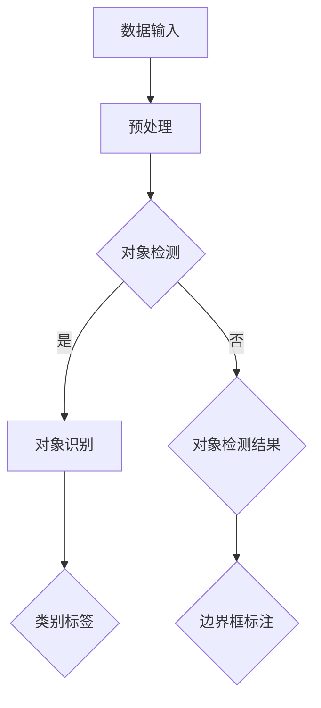

                 

### 1. 背景介绍

#### 图像处理技术的发展历程

图像处理是计算机科学中的一个重要分支，涉及对图像的获取、处理、分析和理解。从20世纪60年代以来，图像处理技术经历了多个阶段的发展。最初，图像处理主要集中在图像的增强、滤波和压缩上，如傅里叶变换、卷积等传统算法。随着计算机性能的提升和算法的进步，图像处理技术逐渐扩展到更复杂的任务，包括边缘检测、特征提取、物体识别等。

在图像处理领域，人工智能的应用极大地推动了技术的发展。特别是在深度学习的推动下，图像处理技术取得了显著的进步。深度学习模型，如卷积神经网络（CNN），通过学习大量的图像数据，能够自动提取特征并实现复杂的目标检测和识别任务。这种技术革新使得计算机在图像处理上的表现逐渐逼近人类水平。

#### TensorFlow：深度学习的首选框架

TensorFlow是由Google开发的开源深度学习框架，自2015年发布以来，已经成为深度学习领域的事实标准。TensorFlow提供了丰富的工具和API，使得构建和训练复杂的深度学习模型变得相对简单。TensorFlow不仅支持CPU和GPU计算，还能在移动设备和服务器上运行，适用于各种规模的任务。

TensorFlow在图像处理中的应用非常广泛。其强大的数据处理能力和高效的计算性能，使得在图像分类、对象检测、图像生成等任务上具有显著优势。通过TensorFlow，研究人员和开发者能够轻松地实现从数据预处理到模型训练再到实际应用的完整工作流程。

#### 对象检测与识别的重要性

对象检测和识别是图像处理中的两个核心任务。对象检测旨在定位图像中的特定对象，并为其划定边界框。识别则进一步确定对象的类别，即对象是什么。这两个任务在许多领域具有重要应用，如自动驾驶、医疗影像分析、视频监控等。

随着深度学习技术的进步，对象检测和识别的准确性大幅提高。传统的图像处理方法通常需要手工设计特征和模型，而深度学习模型通过学习大量图像数据，能够自动提取有代表性的特征，实现更准确的检测和识别。

### 2. 核心概念与联系

#### 卷积神经网络（CNN）

卷积神经网络是深度学习领域中最常用的模型之一，专门用于处理图像数据。CNN的核心组件包括卷积层、池化层和全连接层。

- **卷积层**：通过卷积操作提取图像的局部特征。卷积层使用一系列的卷积核（也称为滤波器）在输入图像上滑动，计算局部区域内的加权求和并应用非线性激活函数。
- **池化层**：对卷积层输出的特征图进行下采样，减少模型参数数量，提高计算效率。常见的池化方法有最大池化和平均池化。
- **全连接层**：将池化层输出的特征图展平成一维向量，然后通过全连接层进行分类或回归任务。

#### 对象检测算法

对象检测算法是图像处理中的一个重要任务，旨在定位图像中的对象并识别其类别。以下是一些常用的对象检测算法：

- **R-CNN（Regions with CNN features）**：通过选择性搜索算法生成候选区域，然后使用CNN提取特征，最后使用SVM分类器进行分类。
- **Fast R-CNN**：简化了R-CNN的候选区域生成过程，提高了检测速度。
- **Faster R-CNN**：引入了区域建议网络（RPN），进一步提高了检测速度和准确性。
- **SSD（Single Shot MultiBox Detector）**：在单次前向传播中同时完成检测和分类任务，适用于多尺度对象检测。
- **YOLO（You Only Look Once）**：通过将图像划分为网格，直接在每个网格中预测对象的边界框和类别概率，具有较高的检测速度。

#### 对象识别算法

对象识别是另一个重要的图像处理任务，旨在确定图像中的对象类别。以下是一些常用的对象识别算法：

- **SVM（Support Vector Machine）**：通过学习图像特征和类别标签，构建一个决策边界，用于分类新图像。
- **KNN（K-Nearest Neighbors）**：通过计算新图像与训练样本之间的相似度，基于大多数邻居的类别进行预测。
- **决策树**：通过一系列规则将数据划分为不同的类别。
- **集成方法**：如随机森林和梯度提升树，通过训练多个基础模型并进行集成，提高分类准确性。

#### Mermaid 流程图

以下是对象检测与识别的整体流程的 Mermaid 流程图：



在 Mermaid 流程图中，节点 A 表示数据输入，节点 B 表示预处理，节点 C 表示对象检测，节点 D 表示对象识别，节点 E 表示对象检测结果，节点 F 表示类别标签，节点 G 表示边界框标注。流程图中的箭头表示数据的流动方向。

### 3. 核心算法原理 & 具体操作步骤

#### 卷积神经网络（CNN）

卷积神经网络的核心在于其能够自动提取图像的局部特征。以下是一个简单的 CNN 结构：

1. **输入层**：接收图像数据，通常为二维矩阵。
2. **卷积层**：使用卷积操作提取图像的局部特征。卷积层包含多个卷积核，每个卷积核都能提取图像中的特定特征。
3. **激活函数**：常用的激活函数有ReLU（Rectified Linear Unit）和Sigmoid。
4. **池化层**：对卷积层输出的特征图进行下采样，减少模型参数数量。
5. **全连接层**：将池化层输出的特征图展平成一维向量，然后通过全连接层进行分类或回归任务。

#### 对象检测算法：Faster R-CNN

Faster R-CNN 是一个经典的对象检测算法，其核心包括区域建议网络（Region Proposal Network，RPN）和多尺度特征图。以下是 Faster R-CNN 的具体操作步骤：

1. **数据输入**：输入一张图像，通过卷积神经网络提取多尺度特征图。
2. **区域建议网络（RPN）**：在特征图上生成候选区域。RPN 通过滑动anchor boxes（锚框）并计算其与锚框的回归损失和分类损失，从而优化锚框的位置和类别。
3. **候选区域筛选**：根据锚框的回归损失和分类损失筛选出高质量的候选区域。
4. **分类器**：对筛选出的候选区域使用分类器进行分类，确定其类别。
5. **非极大值抑制（NMS）**：对检测结果进行去重，保留具有最高置信度的边界框。

#### 对象识别算法：SVM

支持向量机（Support Vector Machine，SVM）是一种常用的对象识别算法。以下是 SVM 的具体操作步骤：

1. **特征提取**：从图像中提取特征，通常使用 HOG（Histogram of Oriented Gradients）或 SIFT（Scale-Invariant Feature Transform）等算法。
2. **训练模型**：使用提取的特征和类别标签训练 SVM 模型，构建决策边界。
3. **预测**：对新图像提取特征，通过 SVM 模型进行分类预测。

### 4. 数学模型和公式 & 详细讲解 & 举例说明

#### 卷积神经网络（CNN）

卷积神经网络的核心在于其卷积操作和激活函数。以下是一个简单的卷积神经网络模型：

1. **卷积操作**：卷积操作可以通过以下公式表示：

$$
\text{output}_{ij} = \sum_{k=1}^{K} w_{ik} \cdot \text{input}_{kj} + b_j
$$

其中，$w_{ik}$ 是卷积核权重，$\text{input}_{kj}$ 是输入图像的像素值，$b_j$ 是偏置项。

2. **激活函数**：常用的激活函数有 ReLU（Rectified Linear Unit）和 Sigmoid：

- **ReLU**：

$$
\text{ReLU}(x) = \begin{cases} 
x & \text{if } x > 0 \\
0 & \text{otherwise}
\end{cases}
$$

- **Sigmoid**：

$$
\text{Sigmoid}(x) = \frac{1}{1 + e^{-x}}
$$

#### 对象检测算法：Faster R-CNN

Faster R-CNN 的核心在于区域建议网络（Region Proposal Network，RPN）。以下是一个简单的 RPN 模型：

1. **锚框生成**：锚框是通过在特征图上滑动锚点并计算其位置和大小得到的。以下是一个简单的锚框生成过程：

$$
\text{anchor}_i = (\text{center}_i, \text{size}_i) = (\text{center}_i + \text{anchor}_{\text{scale}} \cdot \text{scale}_i, \text{size}_i + \text{anchor}_{\text{size}} \cdot \text{size}_i)
$$

其中，$\text{center}_i$ 是锚点的中心坐标，$\text{size}_i$ 是锚框的大小，$\text{anchor}_{\text{scale}}$ 和 $\text{anchor}_{\text{size}}$ 分别是锚点在水平和垂直方向上的扩展比例。

2. **回归损失**：回归损失用于优化锚框的位置。以下是一个简单的回归损失函数：

$$
L_{\text{reg}} = \frac{1}{N} \sum_{i=1}^{N} \frac{1}{\text{smoothL1}} \cdot (\text{predicted}_{i} - \text{target}_{i})^2
$$

其中，$N$ 是锚框的数量，$\text{predicted}_{i}$ 和 $\text{target}_{i}$ 分别是预测的锚框位置和目标锚框位置。

3. **分类损失**：分类损失用于优化锚框的类别。以下是一个简单的分类损失函数：

$$
L_{\text{cls}} = \frac{1}{N} \sum_{i=1}^{N} -y_i \cdot \log(\text{predicted}_{i}) + (1 - y_i) \cdot \log(1 - \text{predicted}_{i})
$$

其中，$y_i$ 是锚框的类别标签，$\text{predicted}_{i}$ 是预测的类别概率。

#### 对象识别算法：SVM

支持向量机（Support Vector Machine，SVM）是一种常用的对象识别算法。以下是一个简单的 SVM 模型：

1. **特征提取**：使用 HOG 或 SIFT 等算法提取图像特征，生成特征向量。

2. **决策边界**：通过训练构建决策边界，用于分类新图像。以下是一个简单的线性 SVM 决策边界公式：

$$
w \cdot x + b > 0 \quad \text{(正类)} \\
w \cdot x + b < 0 \quad \text{(负类)}
$$

其中，$w$ 是决策边界向量，$x$ 是图像特征向量，$b$ 是偏置项。

3. **预测**：对新图像提取特征，通过决策边界进行分类预测。

### 5. 项目实战：代码实际案例和详细解释说明

#### 5.1 开发环境搭建

在开始项目之前，我们需要搭建一个合适的开发环境。以下是搭建 TensorFlow 开发环境的步骤：

1. **安装 Python**：确保安装了 Python 3.6 或更高版本。
2. **安装 TensorFlow**：通过以下命令安装 TensorFlow：

```shell
pip install tensorflow
```

3. **安装必要的库**：安装其他必要的库，如 NumPy、Pandas 等。

#### 5.2 源代码详细实现和代码解读

以下是一个简单的 TensorFlow 对象检测项目示例。代码分为三个部分：数据预处理、模型构建和模型训练。

```python
import tensorflow as tf
from tensorflow.keras.models import Sequential
from tensorflow.keras.layers import Conv2D, MaxPooling2D, Flatten, Dense
from tensorflow.keras.preprocessing.image import ImageDataGenerator

# 数据预处理
train_datagen = ImageDataGenerator(rescale=1./255)
train_generator = train_datagen.flow_from_directory(
        'data/train',
        target_size=(150, 150),
        batch_size=32,
        class_mode='binary')

# 模型构建
model = Sequential([
    Conv2D(32, (3, 3), activation='relu', input_shape=(150, 150, 3)),
    MaxPooling2D(2, 2),
    Flatten(),
    Dense(64, activation='relu'),
    Dense(1, activation='sigmoid')
])

# 模型编译
model.compile(optimizer='adam',
              loss='binary_crossentropy',
              metrics=['accuracy'])

# 模型训练
model.fit(
      x=train_generator,
      steps_per_epoch=100,
      epochs=15)
```

代码解读：

- **数据预处理**：使用 ImageDataGenerator 对训练数据集进行预处理，包括图像缩放和批量读取。
- **模型构建**：构建一个简单的卷积神经网络模型，包括卷积层、池化层和全连接层。
- **模型编译**：编译模型，指定优化器、损失函数和评估指标。
- **模型训练**：使用训练数据集训练模型，设置训练轮数和每轮的步数。

#### 5.3 代码解读与分析

以下是对代码的详细解读和分析：

- **数据预处理**：数据预处理是模型训练的重要步骤。在本例中，我们使用 ImageDataGenerator 对图像进行缩放和批量读取。缩放是为了将图像的像素值缩放到 0 到 1 之间，便于模型处理。批量读取是为了提高训练效率。
- **模型构建**：模型构建是深度学习项目中的核心步骤。在本例中，我们构建了一个简单的卷积神经网络模型，包括卷积层、池化层和全连接层。卷积层用于提取图像的局部特征，池化层用于减少模型参数数量，全连接层用于分类。
- **模型编译**：模型编译是训练前的准备工作。在本例中，我们指定了优化器、损失函数和评估指标。优化器用于更新模型参数，损失函数用于衡量模型预测结果与实际结果之间的差异，评估指标用于评估模型性能。
- **模型训练**：模型训练是深度学习项目的核心步骤。在本例中，我们使用训练数据集对模型进行训练，设置训练轮数和每轮的步数。训练过程中，模型会不断调整参数，以减少预测误差。

### 6. 实际应用场景

对象检测和识别技术在许多实际应用场景中具有重要价值：

#### 自动驾驶

自动驾驶车辆需要实时检测和识别道路上的各种对象，如车辆、行人、交通标志等。通过对象检测和识别技术，自动驾驶系统能够准确地感知环境，确保行车安全。

#### 医疗影像分析

在医疗影像分析中，对象检测和识别技术可用于识别病变区域，如肿瘤、骨折等。通过准确检测和识别，医生可以更快速地诊断和治疗患者。

#### 视频监控

视频监控系统通过对象检测和识别技术，可以实时监控目标区域，检测异常行为，提高安全监控的效率。

#### 人脸识别

人脸识别技术利用对象检测和识别技术，可以识别和验证用户身份，广泛应用于门禁系统、支付系统等。

### 7. 工具和资源推荐

#### 学习资源推荐

1. **书籍**：
   - 《深度学习》（Deep Learning） - Ian Goodfellow、Yoshua Bengio、Aaron Courville
   - 《TensorFlow 实战》（TensorFlow For Deep Learning） - Adel Boulekbani

2. **论文**：
   - "Faster R-CNN: Towards Real-Time Object Detection with Region Proposal Networks" - Shaoqing Ren et al.
   - "You Only Look Once: Unified, Real-Time Object Detection" - Joseph Redmon et al.

3. **博客**：
   - TensorFlow 官方文档：[https://www.tensorflow.org/](https://www.tensorflow.org/)
   - Fast R-CNN 实践：[https://jalammar.github.io/ll72/](https://jalammar.github.io/ll72/)

4. **网站**：
   - Kaggle：[https://www.kaggle.com/](https://www.kaggle.com/)
   - Google Research：[https://ai.google/research/](https://ai.google/research/)

#### 开发工具框架推荐

1. **TensorFlow**：[https://www.tensorflow.org/](https://www.tensorflow.org/)
2. **PyTorch**：[https://pytorch.org/](https://pytorch.org/)
3. **OpenCV**：[https://opencv.org/](https://opencv.org/)

#### 相关论文著作推荐

1. **"Faster R-CNN: Towards Real-Time Object Detection with Region Proposal Networks"** - Shaoqing Ren et al.
2. **"You Only Look Once: Unified, Real-Time Object Detection"** - Joseph Redmon et al.
3. **"Convolutional Neural Networks for Visual Recognition"** - Kaiming He et al.

### 8. 总结：未来发展趋势与挑战

#### 发展趋势

1. **实时性**：随着深度学习模型的不断优化和硬件性能的提升，对象检测和识别技术的实时性将得到显著提高。
2. **多模态融合**：将视觉信息与其他传感器数据（如雷达、激光雷达等）进行融合，提高对象检测和识别的准确性。
3. **边缘计算**：将模型部署到边缘设备上，实现实时检测和识别，降低延迟和带宽消耗。

#### 挑战

1. **数据标注**：高质量的数据标注是深度学习模型训练的关键，但手动标注过程耗时且昂贵。
2. **计算资源**：深度学习模型通常需要大量的计算资源和时间进行训练和推理，如何优化模型和算法以降低计算成本是重要的挑战。
3. **泛化能力**：深度学习模型在特定领域的表现优异，但在其他领域可能存在泛化能力不足的问题。

### 9. 附录：常见问题与解答

#### Q：对象检测和识别有哪些常用的算法？

A：常用的对象检测算法包括 R-CNN、Fast R-CNN、Faster R-CNN、SSD 和 YOLO 等。常用的对象识别算法包括 SVM、KNN、决策树和集成方法等。

#### Q：如何选择合适的对象检测和识别算法？

A：选择合适的算法取决于具体的应用场景和需求。例如，在需要实时性的应用中，可以选择 YOLO 或 SSD；在需要高精度的应用中，可以选择 Faster R-CNN。

#### Q：如何处理数据不足的问题？

A：可以采用数据增强方法，如旋转、缩放、裁剪、颜色变换等，增加数据的多样性。此外，可以尝试使用迁移学习，利用预训练模型在新数据上进行微调。

### 10. 扩展阅读 & 参考资料

1. **"Object Detection with TensorFlow"** - Google AI: [https://ai.googleblog.com/2017/08/object-detection-with-tensorflow.html](https://ai.googleblog.com/2017/08/object-detection-with-tensorflow.html)
2. **"Deep Learning for Computer Vision"** - Adrian Colyer: [https://adriancolyer.com/2017/01/15/deep-learning-for-computer-vision/](https://adriancolyer.com/2017/01/15/deep-learning-for-computer-vision/)
3. **"Deep Learning Specialization"** - Andrew Ng: [https://www.deeplearning.ai/](https://www.deeplearning.ai/)

---

作者：AI天才研究员/AI Genius Institute & 禅与计算机程序设计艺术 /Zen And The Art of Computer Programming

本文旨在介绍 TensorFlow 图像处理中的对象检测和识别技术，包括背景介绍、核心概念、算法原理、数学模型、项目实战和实际应用场景等内容。通过本文的学习，读者可以了解对象检测和识别技术的原理和应用，掌握 TensorFlow 的基本使用方法，为深入研究和应用该技术打下基础。

---

[文章标题]: TensorFlow 图像处理：对象检测和识别
[关键词]: TensorFlow、图像处理、对象检测、识别、卷积神经网络、深度学习
[摘要]: 本文介绍了 TensorFlow 图像处理中的对象检测和识别技术，包括核心概念、算法原理、数学模型和实际应用场景等内容。通过本文的学习，读者可以了解对象检测和识别技术的原理和应用，掌握 TensorFlow 的基本使用方法。

