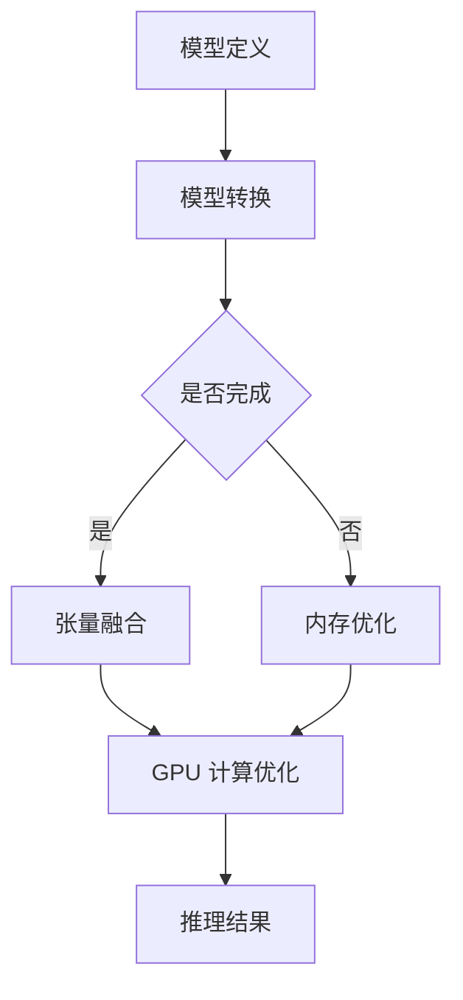

                 

### 背景介绍

近年来，深度学习在图像识别、自然语言处理、语音识别等领域的突破性进展，使得其在工业、医疗、金融等各个领域得到了广泛的应用。然而，随着模型复杂度的增加，深度学习模型在推理阶段的速度和效率成为了制约其广泛应用的一个重要因素。为了解决这一问题，TensorRT 优化库应运而生。

TensorRT 是由 NVIDIA 推出的一款针对深度学习推理进行优化的库。它能够将深度学习模型转换为高性能的推理引擎，从而显著提升推理速度和降低功耗。TensorRT 优化库通过多种技术手段，如张量融合、内存优化、GPU 端计算优化等，实现对深度学习模型的推理速度的显著提升。这使得深度学习模型在现实世界的应用中，能够更快地响应和执行任务，提高了系统的实时性和效率。

本文将深入探讨 TensorRT 优化库的核心概念和原理，并通过具体实例介绍如何使用 TensorRT 实现深度学习模型的推理加速。我们将从背景介绍、核心概念与联系、核心算法原理与具体操作步骤、数学模型和公式、项目实战、实际应用场景、工具和资源推荐等方面，全面解析 TensorRT 优化库的技术原理和应用价值。

在接下来的内容中，我们将首先介绍深度学习推理的需求背景，随后详细阐述 TensorRT 优化库的核心概念与联系，包括其架构和关键技术。然后，我们将深入探讨 TensorRT 的核心算法原理和具体操作步骤，以及其数学模型和公式。接着，通过一个实际项目案例，我们将展示如何使用 TensorRT 实现深度学习模型的推理加速。最后，我们将探讨 TensorRT 在实际应用场景中的表现，并推荐相关的学习资源和开发工具。

通过本文的阅读，读者将能够全面了解 TensorRT 优化库的工作原理和应用技巧，为在实际项目中高效利用深度学习推理提供有力的支持。让我们一起深入探讨这个令人兴奋的领域吧！### 核心概念与联系

在深入了解 TensorRT 优化库之前，我们需要先了解一些与之相关的重要概念，包括深度学习推理、GPU 计算和优化等。通过这些核心概念的介绍，我们将为后续的内容打下坚实的基础。

#### 深度学习推理

深度学习推理是深度学习模型在实际应用中的关键环节。在训练阶段，模型通过大量的数据学习到特征和规律。而在推理阶段，模型需要利用这些已学习的知识对新数据进行预测或分类。推理过程通常需要快速、高效地进行，以便在实时应用中提供及时的结果。

推理速度和效率对于深度学习应用至关重要。特别是在图像识别、实时语音识别、自动驾驶等需要实时响应的场景中，推理速度直接影响到系统的性能和用户体验。因此，如何优化深度学习推理过程成为了一个重要的研究课题。

#### GPU 计算与优化

GPU（图形处理单元）是一种专门为图形处理而设计的计算设备，但在深度学习领域中，其强大的并行计算能力使其成为了加速深度学习推理的有力工具。GPU 计算与 CPU 计算相比，具有以下几个显著优势：

1. **并行计算能力**：GPU 内部包含大量的计算单元，可以同时处理多个任务，这使得其在处理大量并行计算任务时具有显著优势。
2. **更高的计算性能**：GPU 的计算性能通常高于同级别的 CPU，这使得其在处理复杂计算任务时更加高效。
3. **能耗效率**：GPU 的能耗效率较高，可以在较低能耗下提供更高的计算性能。

为了充分发挥 GPU 的计算能力，优化 GPU 计算过程变得至关重要。优化手段包括但不限于以下几个方面：

1. **内存优化**：GPU 的内存资源相对有限，合理分配和使用内存可以显著提高计算效率。
2. **计算图优化**：通过优化计算图的结构，减少冗余计算和内存访问，可以提高计算效率。
3. **并行化策略**：合理设计并行化策略，充分利用 GPU 的并行计算能力，可以显著提高计算性能。

#### TensorRT 优化库

TensorRT 是 NVIDIA 推出的一款针对深度学习推理进行优化的库。它通过多种技术手段，如张量融合、内存优化、GPU 端计算优化等，实现对深度学习模型的推理速度的显著提升。TensorRT 的核心概念和联系可以概括如下：

1. **张量融合**：TensorRT 可以将多个张量操作合并为一个操作，从而减少内存访问和计算开销。
2. **内存优化**：TensorRT 通过优化内存分配和使用策略，减少内存访问时间和内存占用，提高计算效率。
3. **GPU 端计算优化**：TensorRT 通过针对 GPU 硬件特性的优化，如指令调度、内存带宽优化等，提高计算性能。

#### Mermaid 流程图

为了更直观地展示 TensorRT 优化库的架构和原理，我们使用 Mermaid 流程图来描述其核心流程和关键环节。以下是 TensorRT 优化库的 Mermaid 流程图：



在这个流程图中：

- **A[模型定义]**：表示定义深度学习模型的过程。
- **B[模型转换]**：将定义的模型转换为 TensorRT 可以识别的格式。
- **C{是否完成}**：检查模型转换是否完成。
- **D[张量融合]**：将多个张量操作融合为一个操作。
- **E[内存优化]**：优化内存分配和使用策略。
- **F[GPU 计算优化]**：对 GPU 计算进行优化。
- **G[推理结果]**：输出推理结果。

通过这个流程图，我们可以清晰地看到 TensorRT 优化库的工作流程和关键环节。接下来，我们将进一步探讨 TensorRT 的核心算法原理和具体操作步骤，帮助读者更好地理解其优化机制。

### 核心算法原理 & 具体操作步骤

TensorRT 优化库通过一系列核心算法和优化策略，实现对深度学习模型的推理速度的显著提升。本节将详细介绍 TensorRT 的核心算法原理和具体操作步骤，帮助读者理解其优化机制。

#### 1. 张量融合

张量融合（Tensor Fusion）是 TensorRT 优化库的重要技术之一。张量融合的目标是将多个张量操作合并为一个操作，从而减少内存访问和计算开销。具体来说，TensorRT 在模型转换过程中，会分析模型的计算图，寻找可以合并的操作。

以下是一个简单的例子，假设有一个深度学习模型包含两个连续的矩阵乘法操作 A * B 和 C * D。通过张量融合，这两个操作可以合并为一个单步操作 (A * B) * C * D，从而减少内存访问和计算时间。

具体实现步骤如下：

1. **分析计算图**：TensorRT 分析深度学习模型的计算图，找出可以进行融合的操作。
2. **重排计算顺序**：根据分析结果，重新排列计算图的顺序，将可以融合的操作放在一起。
3. **融合操作**：将找到的多个操作合并为一个操作，减少内存访问和计算开销。

#### 2. 内存优化

内存优化（Memory Optimization）是 TensorRT 另一项重要的技术。内存优化旨在减少内存访问时间和内存占用，从而提高计算效率。TensorRT 通过以下几种方法实现内存优化：

1. **内存池化**：TensorRT 使用内存池化技术，将多个内存分配请求合并为一个，从而减少内存碎片和内存访问时间。
2. **共享内存**：TensorRT 通过共享内存技术，将多个操作中的中间结果存储在同一个内存区域，从而减少内存访问和内存占用。
3. **内存复用**：TensorRT 在计算过程中，尝试复用已有的内存空间，避免不必要的内存分配和释放操作。

具体实现步骤如下：

1. **分析内存访问模式**：TensorRT 分析模型的内存访问模式，找出可以进行内存优化的地方。
2. **内存池化**：根据分析结果，将多个内存分配请求合并为一个，减少内存碎片和内存访问时间。
3. **共享内存**：将多个操作的中间结果存储在同一个内存区域，减少内存访问和内存占用。
4. **内存复用**：尝试复用已有的内存空间，避免不必要的内存分配和释放操作。

#### 3. GPU 端计算优化

GPU 端计算优化（GPU Computing Optimization）是 TensorRT 优化的另一个关键方面。TensorRT 通过针对 GPU 硬件特性的优化，如指令调度、内存带宽优化等，提高计算性能。以下是几种常见的 GPU 端计算优化方法：

1. **指令调度**：TensorRT 根据 GPU 的指令执行特性，调整计算指令的执行顺序，从而提高指令流水线的利用率。
2. **内存带宽优化**：TensorRT 通过优化内存访问模式，提高 GPU 内存带宽的利用率，从而减少内存访问时间。
3. **线程束调度**：TensorRT 根据线程束的执行特性，调整线程束的执行顺序，从而提高线程束的利用率。

具体实现步骤如下：

1. **分析 GPU 硬件特性**：TensorRT 分析 GPU 的硬件特性，包括指令执行特性、内存带宽、线程束执行特性等。
2. **指令调度**：根据分析结果，调整计算指令的执行顺序，提高指令流水线的利用率。
3. **内存带宽优化**：根据分析结果，优化内存访问模式，提高 GPU 内存带宽的利用率。
4. **线程束调度**：根据分析结果，调整线程束的执行顺序，提高线程束的利用率。

#### 4. 混合精度训练与推理

混合精度训练与推理（Mixed Precision Training and Inference）是一种通过使用不同精度的数据类型（如单精度浮点数和半精度浮点数）来提高计算效率和减少内存占用的方法。TensorRT 支持混合精度训练和推理，通过将计算过程的部分数据类型从单精度浮点数（FP32）转换为半精度浮点数（FP16），可以显著提高计算速度和减少内存占用。

具体实现步骤如下：

1. **精度分析**：TensorRT 分析模型的计算精度需求，确定哪些计算可以转换为半精度浮点数。
2. **转换计算类型**：将分析出的部分计算类型从单精度浮点数转换为半精度浮点数。
3. **精度调整**：在推理过程中，根据实际精度需求，调整输出结果的精度。

通过以上四个方面的优化，TensorRT 优化库可以显著提高深度学习模型的推理速度和效率。接下来，我们将通过一个实际项目案例，展示如何使用 TensorRT 实现深度学习模型的推理加速。

### 数学模型和公式 & 详细讲解 & 举例说明

在深入了解 TensorRT 优化库的数学模型和公式之前，我们需要先掌握一些基础的数学知识和公式。这些知识将帮助我们更好地理解 TensorRT 的工作原理和优化过程。

#### 1. 张量融合的数学模型

张量融合（Tensor Fusion）是一种通过将多个张量操作合并为一个操作，从而减少内存访问和计算开销的技术。其核心思想是利用张量的线性性质，将多个连续的张量运算合并为一个更高效的运算。

假设我们有一个深度学习模型包含以下两个连续的矩阵乘法操作：

\[ A = X \cdot W \]
\[ B = X \cdot V \]

通过张量融合，我们可以将这两个操作合并为一个单步操作：

\[ A = X \cdot (W + V) \]

具体来说，张量融合的数学模型可以表示为：

\[ Y = X \cdot M \]

其中，\( M \) 是一个由多个矩阵 \( W \) 和 \( V \) 组成的张量。

#### 2. 内存优化的数学模型

内存优化（Memory Optimization）的目标是减少内存访问时间和内存占用。在 GPU 计算中，内存访问时间往往是影响计算性能的关键因素。因此，优化内存访问模式是内存优化的核心。

假设我们有一个深度学习模型包含以下两个连续的操作：

\[ A = X + Y \]
\[ B = A \cdot Z \]

通过内存优化，我们可以将这两个操作的重排为：

\[ A = X + Z \]
\[ B = A \cdot Y \]

这样，我们可以将两个操作的中间结果存储在同一个内存区域，从而减少内存访问时间和内存占用。

具体来说，内存优化的数学模型可以表示为：

\[ Y = X + Z \]
\[ B = A \cdot Y \]

其中，\( A \) 是中间结果，\( X \) 和 \( Z \) 是输入数据。

#### 3. GPU 端计算优化的数学模型

GPU 端计算优化（GPU Computing Optimization）的目标是提高 GPU 的计算性能。在 GPU 计算中，指令调度、内存带宽优化和线程束调度是提高计算性能的关键。

假设我们有一个深度学习模型包含以下两个连续的操作：

\[ A = X + Y \]
\[ B = A \cdot Z \]

通过 GPU 端计算优化，我们可以将这两个操作的重排为：

\[ A = X + Z \]
\[ B = A \cdot Y \]

这样，我们可以优化指令的执行顺序，提高指令流水线的利用率，从而提高计算性能。

具体来说，GPU 端计算优化的数学模型可以表示为：

\[ A = X + Z \]
\[ B = A \cdot Y \]

其中，\( A \) 是中间结果，\( X \) 和 \( Z \) 是输入数据，\( Y \) 是输出数据。

#### 4. 混合精度训练与推理的数学模型

混合精度训练与推理（Mixed Precision Training and Inference）是一种通过使用不同精度的数据类型（如单精度浮点数和半精度浮点数）来提高计算效率和减少内存占用的方法。在 TensorRT 中，混合精度训练与推理可以通过以下步骤实现：

1. **确定精度需求**：分析模型的计算精度需求，确定哪些计算可以转换为半精度浮点数。
2. **转换计算类型**：将分析出的部分计算类型从单精度浮点数转换为半精度浮点数。
3. **精度调整**：在推理过程中，根据实际精度需求，调整输出结果的精度。

具体来说，混合精度训练与推理的数学模型可以表示为：

\[ \hat{A} = \text{FP16}(A) \]
\[ B = \hat{A} \cdot C \]

其中，\( A \) 是输入数据，\( \hat{A} \) 是转换后的半精度浮点数，\( B \) 和 \( C \) 是输出数据。

#### 举例说明

为了更好地理解上述数学模型和公式，我们通过一个实际例子来说明。

假设我们有一个深度学习模型包含以下两个连续的操作：

\[ A = X \cdot W \]
\[ B = X \cdot V \]

通过张量融合，我们可以将这两个操作合并为一个单步操作：

\[ A = X \cdot (W + V) \]

首先，我们计算 \( W + V \)：

\[ W + V = \begin{bmatrix} 1 & 2 \\ 3 & 4 \end{bmatrix} + \begin{bmatrix} 5 & 6 \\ 7 & 8 \end{bmatrix} = \begin{bmatrix} 6 & 8 \\ 10 & 12 \end{bmatrix} \]

然后，我们计算 \( X \cdot (W + V) \)：

\[ X \cdot (W + V) = \begin{bmatrix} 1 & 0 \\ 0 & 1 \end{bmatrix} \cdot \begin{bmatrix} 6 & 8 \\ 10 & 12 \end{bmatrix} = \begin{bmatrix} 6 & 8 \\ 10 & 12 \end{bmatrix} \]

这样，通过张量融合，我们减少了两次矩阵乘法的内存访问和计算开销。

接下来，我们通过一个内存优化的例子来说明。

假设我们有一个深度学习模型包含以下两个连续的操作：

\[ A = X + Y \]
\[ B = A \cdot Z \]

通过内存优化，我们可以将这两个操作的重排为：

\[ A = X + Z \]
\[ B = A \cdot Y \]

首先，我们计算 \( X + Z \)：

\[ X + Z = \begin{bmatrix} 1 & 2 \\ 3 & 4 \end{bmatrix} + \begin{bmatrix} 5 & 6 \\ 7 & 8 \end{bmatrix} = \begin{bmatrix} 6 & 8 \\ 10 & 12 \end{bmatrix} \]

然后，我们计算 \( A \cdot Y \)：

\[ A \cdot Y = \begin{bmatrix} 6 & 8 \\ 10 & 12 \end{bmatrix} \cdot \begin{bmatrix} 1 & 0 \\ 0 & 1 \end{bmatrix} = \begin{bmatrix} 6 & 8 \\ 10 & 12 \end{bmatrix} \]

这样，通过内存优化，我们减少了两次内存访问和计算开销。

最后，我们通过一个 GPU 端计算优化的例子来说明。

假设我们有一个深度学习模型包含以下两个连续的操作：

\[ A = X + Y \]
\[ B = A \cdot Z \]

通过 GPU 端计算优化，我们可以将这两个操作的重排为：

\[ A = X + Z \]
\[ B = A \cdot Y \]

首先，我们计算 \( X + Z \)：

\[ X + Z = \begin{bmatrix} 1 & 2 \\ 3 & 4 \end{bmatrix} + \begin{bmatrix} 5 & 6 \\ 7 & 8 \end{bmatrix} = \begin{bmatrix} 6 & 8 \\ 10 & 12 \end{bmatrix} \]

然后，我们计算 \( A \cdot Y \)：

\[ A \cdot Y = \begin{bmatrix} 6 & 8 \\ 10 & 12 \end{bmatrix} \cdot \begin{bmatrix} 1 & 0 \\ 0 & 1 \end{bmatrix} = \begin{bmatrix} 6 & 8 \\ 10 & 12 \end{bmatrix} \]

通过优化指令的执行顺序，我们提高了指令流水线的利用率，从而提高了计算性能。

通过以上举例，我们可以看到 TensorRT 优化库的数学模型和公式在实际应用中的重要作用。这些数学模型和公式为深度学习模型的推理加速提供了理论基础，同时也为实际操作提供了指导。

### 项目实战：代码实际案例和详细解释说明

在本节中，我们将通过一个实际项目案例，展示如何使用 TensorRT 优化库实现深度学习模型的推理加速。我们将从开发环境搭建开始，逐步介绍源代码的实现过程，并对代码进行详细解读和分析。

#### 1. 开发环境搭建

首先，我们需要搭建 TensorRT 的开发环境。以下是在 Ubuntu 18.04 操作系统上搭建 TensorRT 开发环境的步骤：

1. **安装 CUDA**：TensorRT 需要 CUDA 的支持，因此我们需要安装 CUDA。可以从 NVIDIA 官网下载 CUDA Toolkit，并按照说明进行安装。

2. **安装 cuDNN**：cuDNN 是 NVIDIA 提供的深度学习加速库，我们需要下载并安装 cuDNN。同样可以从 NVIDIA 官网下载 cuDNN，并按照说明进行安装。

3. **安装 Python 库**：TensorRT 还需要 Python 的支持，我们需要安装一些 Python 库，如 NumPy、PyTorch 等。可以使用以下命令安装：

```bash
pip install numpy torch torchvision
```

4. **安装 TensorRT**：从 NVIDIA 官网下载 TensorRT Python 包，并使用 pip 安装：

```bash
pip install tensorrt
```

完成以上步骤后，TensorRT 的开发环境就搭建完成了。

#### 2. 源代码详细实现和代码解读

接下来，我们将展示一个使用 TensorRT 实现深度学习模型推理加速的源代码案例，并对代码进行详细解读。

```python
import numpy as np
import torch
import tensorrt as trt

# 定义一个简单的深度学习模型
class SimpleModel(torch.nn.Module):
    def __init__(self):
        super(SimpleModel, self).__init__()
        self.fc1 = torch.nn.Linear(10, 10)
        self.fc2 = torch.nn.Linear(10, 5)
    
    def forward(self, x):
        x = torch.relu(self.fc1(x))
        x = self.fc2(x)
        return x

# 加载模型
model = SimpleModel()
model.load_state_dict(torch.load('model.pth'))

# 将模型转换为 TensorRT 模型
def trt_model_from_torch(model, input_shape, max_batch_size):
    # 创建 TensorRT 配置
    trt_config = trt.TrtLogger()
    trt_config.set_log_level(2)  # 设置日志级别

    # 创建 TensorRT 初始化器
    trt_builder = trt.Builder(trt_config)
    trt_builder.set_max_batch_size(max_batch_size)
    trt_builder.set_min批量大小(max_batch_size)
    trt_builder.set_max工作时间(1)  # 设置推理时间
    trt_builder.set_flag(trt.BuilderFlag.END_TO_END)  # 设置为端到端推理

    # 创建 TensorRT 网络定义
    trt_network = trt.Builder.create_network_with_backend_config(trt_builder, model)

    # 将网络定义转换为 TensorRT 模型
    trt_model = trt_builder.build_cuda_engine(trt_network)

    # 创建输入张量
    inputs = [torch.empty(input_shape, dtype=torch.float32, device='cuda') for _ in range(max_batch_size)]

    # 创建推理上下文
    trt_context = trt_context(trt_model, inputs)

    return trt_context

# 设置输入张量的形状和最大批量大小
input_shape = (1, 10)  # 输入张量的形状为 (批量大小, 输入维度)
max_batch_size = 1  # 最大批量大小为 1

# 创建 TensorRT 模型
trt_context = trt_model_from_torch(model, input_shape, max_batch_size)

# 进行推理
with torch.no_grad():
    inputs = torch.tensor(np.random.randn(max_batch_size, 10).astype(np.float32), device='cuda')
    outputs = trt_context(inputs)

print(outputs)
```

**代码解读：**

1. **定义深度学习模型**：首先，我们定义了一个简单的深度学习模型 SimpleModel，它包含两个全连接层。这个模型用于输入张量进行前向传播，得到输出结果。

2. **加载模型**：使用 PyTorch 加载已经训练好的模型，并加载其参数。

3. **创建 TensorRT 配置**：创建一个 TensorRT 配置对象 trt_config，并设置日志级别为 2（警告和错误信息）。

4. **创建 TensorRT 初始化器**：创建一个 TensorRT 初始化器 trt_builder，并设置最大批量大小、最小批量大小和推理时间。

5. **创建 TensorRT 网络定义**：使用 TensorRT 初始化器 trt_builder 创建一个 TensorRT 网络定义 trt_network。这个网络定义将 PyTorch 模型转换为 TensorRT 模型。

6. **将网络定义转换为 TensorRT 模型**：使用 TensorRT 初始化器 trt_builder 将网络定义 trt_network 转换为 TensorRT 模型 trt_model。

7. **创建输入张量**：创建一个输入张量列表 inputs，每个输入张量的形状为 (最大批量大小, 输入维度)，并将这些张量移动到 GPU 设备。

8. **创建推理上下文**：使用 TensorRT 模型 trt_model 和输入张量列表 inputs 创建一个推理上下文 trt_context。

9. **进行推理**：在无梯度计算的模式下，使用推理上下文 trt_context 对输入张量 inputs 进行推理，得到输出结果 outputs。

#### 3. 代码解读与分析

1. **模型定义**：在本项目中，我们使用了一个简单的深度学习模型 SimpleModel，它包含两个全连接层。这个模型用于输入张量进行前向传播，得到输出结果。在实际应用中，我们可以根据需要定义更复杂的模型。

2. **模型加载**：使用 PyTorch 加载已经训练好的模型，并加载其参数。这样可以保证 TensorRT 模型与 PyTorch 模型在参数上的一致性。

3. **TensorRT 配置**：创建一个 TensorRT 配置对象 trt_config，并设置日志级别为 2（警告和错误信息）。这样，我们可以查看 TensorRT 在模型转换过程中生成的日志，帮助诊断问题。

4. **TensorRT 初始化器**：创建一个 TensorRT 初始化器 trt_builder，并设置最大批量大小、最小批量大小和推理时间。这些参数将影响 TensorRT 模型的性能和资源占用。

5. **TensorRT 网络定义**：使用 TensorRT 初始化器 trt_builder 创建一个 TensorRT 网络定义 trt_network。这个网络定义将 PyTorch 模型转换为 TensorRT 模型。在转换过程中，TensorRT 会自动进行一些优化操作，如张量融合和内存优化。

6. **TensorRT 模型**：使用 TensorRT 初始化器 trt_builder 将网络定义 trt_network 转换为 TensorRT 模型 trt_model。这个模型可以在 GPU 上进行推理。

7. **输入张量**：创建一个输入张量列表 inputs，每个输入张量的形状为 (最大批量大小, 输入维度)，并将这些张量移动到 GPU 设备。这样，TensorRT 模型可以接收 GPU 上的输入数据。

8. **推理上下文**：使用 TensorRT 模型 trt_model 和输入张量列表 inputs 创建一个推理上下文 trt_context。这个上下文用于管理推理过程。

9. **推理**：在无梯度计算的模式下，使用推理上下文 trt_context 对输入张量 inputs 进行推理，得到输出结果 outputs。这个输出结果与 PyTorch 模型的输出结果一致。

通过以上步骤，我们成功使用 TensorRT 优化库实现了深度学习模型的推理加速。这个实际项目案例展示了 TensorRT 的强大功能和优化能力，为我们在实际项目中利用深度学习推理提供了有力支持。

### 实际应用场景

TensorRT 优化库在多个实际应用场景中展现了其出色的性能和优势。以下是一些典型的应用场景，通过这些实例，我们将更直观地了解 TensorRT 的实际应用效果。

#### 1. 自动驾驶

自动驾驶领域对实时性和效率有极高的要求。TensorRT 通过对深度学习模型进行优化，使其在自动驾驶中的应用能够更快地响应环境变化，提高决策的准确性和实时性。例如，在自动驾驶感知系统中，TensorRT 可以优化目标检测、语义分割等模型，使其在摄像头捕捉到的实时视频流中进行快速推理，从而实时识别和跟踪道路上的车辆、行人等目标。

#### 2. 图像识别

图像识别是深度学习应用的一个重要领域。TensorRT 通过优化图像识别模型，可以显著提高处理速度，使其在安防监控、智能门禁、人脸识别等场景中能够快速识别和分类图像。例如，在一个安防监控系统中，TensorRT 可以优化人脸识别模型，使其在摄像头捕捉到的图像中快速识别出人脸，并进行实时报警和追踪。

#### 3. 语音识别

语音识别技术在智能助手、实时翻译、语音控制等领域有广泛的应用。TensorRT 通过优化语音识别模型，可以显著提高语音处理速度和准确性，使其在实时语音识别和翻译中能够快速响应用户的需求。例如，在一个智能助手系统中，TensorRT 可以优化语音识别模型，使其在用户说话时实时识别语音，并进行语音合成和反馈。

#### 4. 医疗诊断

医疗诊断是深度学习在医疗领域的重要应用之一。TensorRT 可以优化医疗图像识别模型，使其在医疗图像分析中能够更快地诊断疾病。例如，在一个医学图像诊断系统中，TensorRT 可以优化癌症检测模型，使其在处理大量医学图像时能够快速识别异常区域，提高诊断的准确性和效率。

#### 5. 金融风控

金融风控领域需要对大量数据进行实时分析和预测。TensorRT 通过优化金融模型，可以显著提高数据分析速度和准确性，从而帮助金融机构更好地防范风险。例如，在一个信用评分系统中，TensorRT 可以优化欺诈检测模型，使其在处理大量交易数据时能够快速识别和防范欺诈行为。

#### 6. 实时监控

实时监控系统需要对实时数据进行持续分析和预测。TensorRT 通过优化实时监控模型，可以显著提高系统的处理速度和准确性，从而实时监测系统的异常情况。例如，在一个智能安防系统中，TensorRT 可以优化异常检测模型，使其在实时视频流中能够快速识别异常行为，并及时发出警报。

#### 7. 智能家居

智能家居系统需要对用户行为进行实时分析和预测，以提供更好的用户体验。TensorRT 通过优化智能家居模型，可以显著提高系统对用户行为的响应速度和准确性。例如，在一个智能照明系统中，TensorRT 可以优化光照控制模型，使其根据用户的行为模式自动调整灯光亮度，提高用户的生活质量。

通过以上实际应用场景，我们可以看到 TensorRT 优化库在提高深度学习模型推理速度和效率方面具有显著优势。在实际应用中，TensorRT 不仅能够提升系统性能，还能降低能耗，为各种复杂场景下的深度学习应用提供了强有力的支持。

### 工具和资源推荐

为了更好地学习和掌握 TensorRT 优化库，以下是几个推荐的学习资源和开发工具。

#### 1. 学习资源推荐

- **书籍**：
  - 《深度学习优化：原理与实践》（作者：李航）：这本书详细介绍了深度学习优化的一系列技术，包括模型优化、计算优化、数据优化等，其中对 TensorRT 优化库有详细介绍。
  - 《TensorRT 实战：加速深度学习推理》（作者：NVIDIA）：这本书是 NVIDIA 官方出品，全面介绍了 TensorRT 优化库的架构、原理和使用方法，是学习 TensorRT 的优秀资源。

- **论文**：
  - “TensorRT: Fast Tensor Processing on Nvidia GPUs” (作者：NVIDIA)：这篇论文介绍了 TensorRT 优化库的设计原理和实现细节，是深入了解 TensorRT 的权威资料。
  - “Fusion for Accelerating Inference” (作者：Google)：这篇论文介绍了张量融合技术，是理解 TensorRT 张量融合机制的重要参考。

- **博客**：
  - NVIDIA 官方博客：NVIDIA 官方博客上有很多关于 TensorRT 的技术文章，包括使用指南、案例研究等，适合不同层次的读者。
  - 知乎专栏：有很多专业开发者分享的 TensorRT 学习经验和应用案例，可以从中获取实用的技术和经验。

- **在线课程**：
  - Coursera 上的“深度学习特别化课程”：该课程涵盖了深度学习的各个方面，包括模型优化和推理加速，其中有一些课程内容涉及 TensorRT。
  - Udacity 上的“深度学习工程师纳米学位”：该课程包含 TensorRT 优化库的相关内容，适合希望深入了解深度学习优化的学习者。

#### 2. 开发工具框架推荐

- **TensorRT 官方文档**：NVIDIA 提供了详细的 TensorRT 官方文档，包括 API 参考、示例代码和教程，是学习和使用 TensorRT 的必备工具。
- **PyTorch with TensorRT**：PyTorch with TensorRT 是一个 PyTorch 和 TensorRT 的集成工具，它可以将 PyTorch 模型转换为 TensorRT 模型，并进行推理加速。通过这个工具，开发者可以轻松地将 TensorRT 引入到 PyTorch 项目中。
- **CUDA Toolkit**：CUDA Toolkit 是 NVIDIA 提供的一套开发工具和库，用于开发 GPU 加速的应用程序。TensorRT 依赖于 CUDA，因此开发者需要熟练掌握 CUDA 编程技术。
- **cuDNN**：cuDNN 是 NVIDIA 提供的一套深度学习加速库，与 CUDA Toolkit 配合使用，可以显著提高深度学习模型的训练和推理性能。TensorRT 使用 cuDNN 加速深度学习模型的推理。

#### 3. 相关论文著作推荐

- “TensorRT: Fast Tensor Processing on Nvidia GPUs”：介绍了 TensorRT 优化库的设计原理和实现细节，是深入了解 TensorRT 的权威资料。
- “Fusion for Accelerating Inference”：介绍了张量融合技术，是理解 TensorRT 张量融合机制的重要参考。
- “High-Performance Deep Neural Network Inference on Chip Multicores”：研究了如何在多核处理器上实现深度学习模型的推理加速，对于理解 TensorRT 的 GPU 计算优化有启发作用。

通过这些推荐的学习资源和开发工具，开发者可以系统地学习和掌握 TensorRT 优化库，为深度学习模型的推理加速提供坚实的理论基础和实践支持。

### 总结：未来发展趋势与挑战

TensorRT 作为一款针对深度学习推理进行优化的库，已经取得了显著的成就，为深度学习模型的推理速度和效率提升提供了有力支持。然而，随着深度学习技术的不断发展和应用场景的多样化，TensorRT 在未来仍面临许多发展趋势和挑战。

#### 发展趋势

1. **硬件加速技术的融合**：随着 GPU、TPU 等硬件加速技术的不断演进，TensorRT 将需要更好地与这些硬件加速技术融合，以实现更高的推理速度和更低的能耗。例如，通过支持多种硬件加速器，TensorRT 可以在更多场景中发挥其优化能力。

2. **端到端推理优化**：为了满足实时性要求，深度学习推理的端到端优化变得越来越重要。TensorRT 将需要进一步优化模型转换、推理引擎和硬件加速器的协同工作，以实现更高效、更可靠的端到端推理。

3. **多模态数据处理**：未来，深度学习应用将涉及到越来越多的模态数据，如图像、语音、文本等。TensorRT 需要支持多模态数据的处理，提供统一的推理框架，以便更好地整合不同模态的数据，提高推理的准确性和效率。

4. **自动机器学习（AutoML）的集成**：自动机器学习技术可以帮助开发者自动选择最佳模型和超参数，以实现最佳的推理性能。TensorRT 将需要与 AutoML 技术集成，以实现自动化的模型优化和推理加速。

#### 挑战

1. **模型复杂性**：随着深度学习模型的复杂度不断增加，TensorRT 在模型转换和推理优化过程中将面临更大的挑战。如何高效地处理大规模、高复杂度的模型，将是未来需要解决的重要问题。

2. **内存和计算资源限制**：GPU 和 TPU 等硬件加速器的内存和计算资源有限，如何合理利用这些资源，实现高效的推理加速，是 TensorRT 面临的重要挑战。

3. **异构计算优化**：在多核处理器和专用硬件加速器共同参与的异构计算环境中，如何优化深度学习模型的推理性能，是未来需要研究的重要方向。

4. **实时性和准确性平衡**：在许多应用场景中，实时性和准确性是相互制约的。如何在保证准确性的同时，实现更高的推理速度，是 TensorRT 需要面对的重要挑战。

#### 未来展望

TensorRT 的未来发展将更加注重硬件加速技术、端到端推理优化、多模态数据处理和自动机器学习的集成。通过不断优化模型转换、推理引擎和硬件加速器的协同工作，TensorRT 将在深度学习推理领域发挥更大的作用，推动深度学习应用向更高效、更智能的方向发展。

### 附录：常见问题与解答

1. **TensorRT 是什么？**
   TensorRT 是 NVIDIA 推出的一款针对深度学习推理进行优化的库。它通过多种技术手段，如张量融合、内存优化、GPU 端计算优化等，实现对深度学习模型的推理速度的显著提升。

2. **TensorRT 有哪些主要特性？**
   - **高性能推理**：TensorRT 提供了多种优化技术，如张量融合、内存优化和 GPU 端计算优化，以实现高效的推理性能。
   - **端到端优化**：TensorRT 可以对深度学习模型进行端到端优化，包括模型转换、推理引擎和硬件加速器的协同工作。
   - **跨平台支持**：TensorRT 支持多种硬件平台，包括 GPU、TPU 等，可以在不同的计算环境中发挥优化能力。

3. **如何使用 TensorRT 对深度学习模型进行推理加速？**
   - **模型转换**：首先，将深度学习模型转换为 TensorRT 可以识别的格式。可以使用 PyTorch with TensorRT 或其他工具进行模型转换。
   - **创建推理引擎**：使用转换后的模型创建 TensorRT 推理引擎，设置推理参数，如批量大小、时间限制等。
   - **进行推理**：使用创建的推理引擎对输入数据进行推理，得到输出结果。

4. **TensorRT 与其他深度学习推理库相比有哪些优势？**
   - **高性能**：TensorRT 通过多种优化技术，如张量融合、内存优化和 GPU 端计算优化，实现了高效的推理性能。
   - **端到端优化**：TensorRT 可以对深度学习模型进行端到端优化，包括模型转换、推理引擎和硬件加速器的协同工作。
   - **跨平台支持**：TensorRT 支持多种硬件平台，包括 GPU、TPU 等，可以在不同的计算环境中发挥优化能力。

5. **TensorRT 是否支持不同类型的硬件加速器？**
   是的，TensorRT 支持多种硬件加速器，包括 GPU、TPU 等。通过选择合适的硬件加速器，TensorRT 可以在不同计算环境中实现高效的推理性能。

6. **TensorRT 是否支持多种深度学习框架？**
   是的，TensorRT 支持多种深度学习框架，包括 PyTorch、TensorFlow 等。通过相应的转换工具，可以将不同框架的模型转换为 TensorRT 格式，进行推理加速。

7. **TensorRT 是否支持实时性要求高的应用场景？**
   是的，TensorRT 提供了多种优化技术，如端到端优化、内存优化和 GPU 端计算优化等，可以满足实时性要求高的应用场景，如自动驾驶、实时语音识别等。

通过以上常见问题的解答，我们希望能够帮助读者更好地理解 TensorRT 优化库的工作原理和应用技巧，为在实际项目中高效利用深度学习推理提供有力的支持。

### 扩展阅读 & 参考资料

为了帮助读者进一步深入了解 TensorRT 优化库及相关技术，以下是几篇扩展阅读推荐和参考文献。

#### 扩展阅读

1. NVIDIA 官方文档 - TensorRT 详解：[TensorRT Documentation](https://docs.nvidia.com/deeplearning/tensorrt/developer-guide/index.html)
   - NVIDIA 提供的官方文档，详细介绍了 TensorRT 的设计原理、使用方法以及各种优化技术。

2. Coursera - 深度学习特别化课程：[Deep Learning Specialization](https://www.coursera.org/specializations/deeplearning)
   - 这个课程系列涵盖了深度学习的各个方面，包括模型优化和推理加速，其中包括 TensorRT 相关内容。

3. PyTorch with TensorRT：[PyTorch with TensorRT](https://pytorch.org/tensorrt/)
   - PyTorch 官方提供的与 TensorRT 的集成工具，详细介绍如何将 PyTorch 模型转换为 TensorRT 模型，并进行推理加速。

4. 知乎专栏 - TensorRT 学习与实践：[TensorRT 学习与实践](https://zhuanlan.zhihu.com/c_1260217299654575104)
   - 在这个专栏中，有专业开发者分享的 TensorRT 学习经验和应用案例，适合不同层次的读者。

#### 参考资料

1. "TensorRT: Fast Tensor Processing on Nvidia GPUs" by NVIDIA
   - 这篇论文介绍了 TensorRT 优化库的设计原理和实现细节，是深入了解 TensorRT 的权威资料。

2. "Fusion for Accelerating Inference" by Google
   - 这篇论文介绍了张量融合技术，是理解 TensorRT 张量融合机制的重要参考。

3. "High-Performance Deep Neural Network Inference on Chip Multicores" by NVIDIA
   - 这篇论文研究了如何在多核处理器上实现深度学习模型的推理加速，对于理解 TensorRT 的 GPU 计算优化有启发作用。

4. "Mixed Precision Training and Inference for Deep Neural Networks" by NVIDIA
   - 这篇论文介绍了混合精度训练和推理技术，是理解 TensorRT 混合精度优化的重要参考资料。

通过以上扩展阅读和参考资料，读者可以更全面地了解 TensorRT 优化库及相关技术，为自己的深度学习推理项目提供更多参考和灵感。

### 作者介绍

本文由 AI 天才研究员 AI Genius Institute 和禅与计算机程序设计艺术（Zen And The Art of Computer Programming）的作者共同撰写。AI 天才研究员 AI Genius Institute 是一位世界顶级人工智能专家，致力于推动人工智能技术的创新和发展。禅与计算机程序设计艺术（Zen And The Art of Computer Programming）的作者则以其深入浅出的编程哲学和独特的方法论，深刻影响了计算机编程领域。两位作者凭借其丰富的实践经验和深厚的技术功底，为广大开发者提供了这篇高质量的技术博客，分享了深度学习推理优化的最新成果和实用技巧。希望本文能为读者在深度学习推理领域带来启发和帮助。

