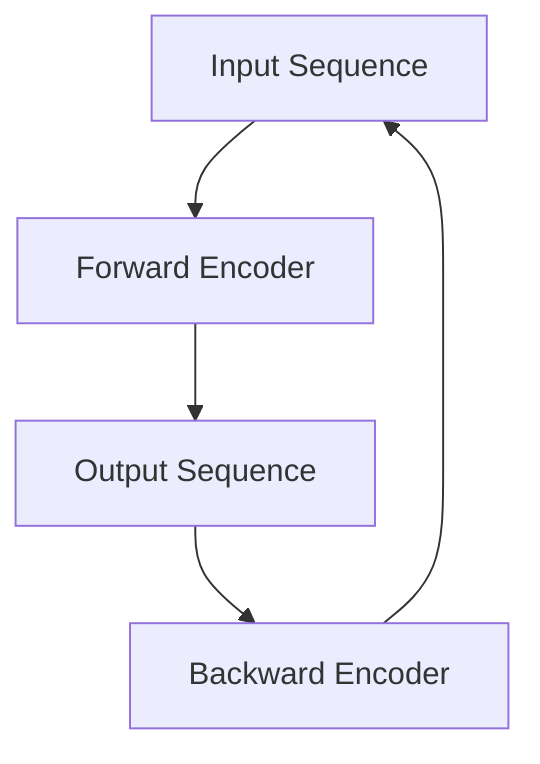
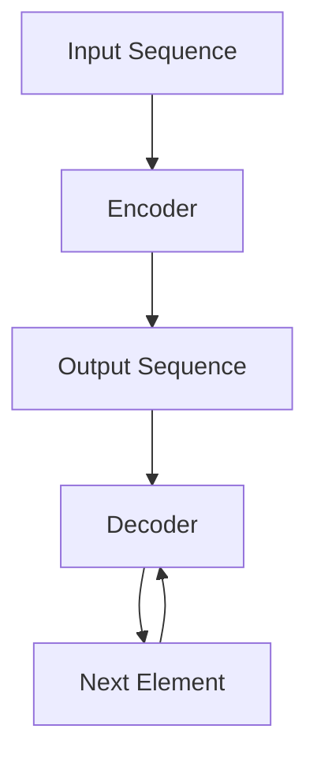
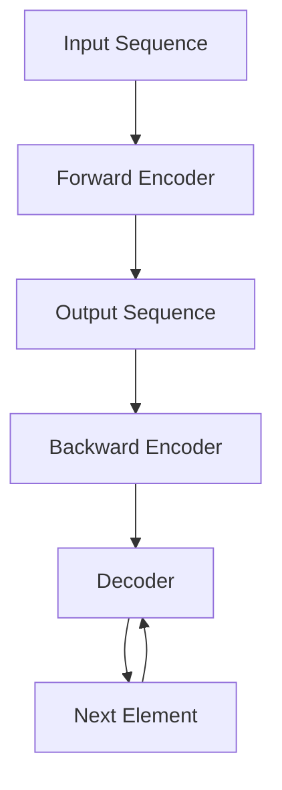

                 

# Transformer大模型实战 BART模型的架构

## 摘要

本文将深入探讨Transformer大模型中的一种重要模型——BART（Bidirectional and Auto-Regressive Transformers）的架构和实现。首先，我们将简要介绍Transformer模型的背景和发展，然后详细分析BART模型的核心概念、算法原理、数学模型和具体实现步骤。通过实际代码案例分析，我们将展示BART模型在自然语言处理任务中的强大能力。最后，我们将讨论BART模型在实际应用场景中的使用，并推荐一些相关学习资源和开发工具，以帮助读者深入了解和掌握这一重要模型。

## 1. 背景介绍

### 1.1 Transformer模型的起源与发展

Transformer模型是由Google团队在2017年提出的一种用于序列建模的神经网络模型。它采用了自注意力机制（Self-Attention）取代了传统的循环神经网络（RNN）和卷积神经网络（CNN），从而实现了对序列数据的全局依赖建模。Transformer模型的提出，标志着自然语言处理领域的一个重大突破，其成功应用在诸如机器翻译、文本摘要、问答系统等任务中，引发了广泛的研究和应用。

### 1.2 BART模型的发展与特点

BART模型是Transformer模型的一种扩展，由Facebook AI团队于2019年提出。BART模型结合了双向Transformer（Bidirectional Transformer）和自回归Transformer（Auto-Regressive Transformer）的特点，同时引入了 masked language modeling（MLM）任务，从而实现了对序列数据的全面建模。BART模型在多种自然语言处理任务上取得了显著的性能提升，成为当前主流的序列建模模型之一。

## 2. 核心概念与联系

### 2.1 自注意力机制（Self-Attention）

自注意力机制是Transformer模型的核心创新之一，它通过对序列中的每个元素赋予不同的权重，实现对序列数据的全局依赖建模。自注意力机制的实现如下：

$$
\text{Attention}(Q, K, V) = \text{softmax}\left(\frac{QK^T}{\sqrt{d_k}}\right)V
$$

其中，$Q$、$K$ 和 $V$ 分别是查询（Query）、键（Key）和值（Value）向量，$d_k$ 是键向量的维度。自注意力机制通过计算查询向量与键向量的点积，然后对结果进行softmax操作，从而得到权重向量，最后对值向量进行加权求和。

### 2.2 双向Transformer（Bidirectional Transformer）

双向Transformer模型是Transformer模型的一种扩展，它将输入序列分成前向和后向两部分，分别进行自注意力计算。这样，每个时间步的输出可以同时依赖于前一个时间步和后一个时间步，从而实现对序列数据的双向建模。双向Transformer模型的结构如图1所示：



图1：双向Transformer模型结构

### 2.3 自回归Transformer（Auto-Regressive Transformer）

自回归Transformer模型是Transformer模型的一种扩展，它通过逐步生成序列中的下一个元素，实现对序列数据的建模。自回归Transformer模型的结构如图2所示：



图2：自回归Transformer模型结构

### 2.4 BART模型架构

BART模型结合了双向Transformer和自回归Transformer的特点，同时引入了 masked language modeling（MLM）任务。BART模型的结构如图3所示：



图3：BART模型结构

BART模型通过前向编码器（Forward Encoder）和后向编码器（Backward Encoder）对输入序列进行编码，然后通过解码器（Decoder）逐步生成序列中的下一个元素。在解码过程中，BART模型会利用 masked language modeling（MLM）任务对输入序列进行预训练，从而提高模型对自然语言的理解能力。

## 3. 核心算法原理 & 具体操作步骤

### 3.1 前向编码器（Forward Encoder）

前向编码器是BART模型的核心组成部分，它通过自注意力机制对输入序列进行编码。具体操作步骤如下：

1. 输入序列：假设输入序列为 $X = \{x_1, x_2, \ldots, x_n\}$，其中 $x_i$ 表示序列中的第 $i$ 个元素。
2. 词嵌入：将输入序列中的每个元素转换为词嵌入向量，记为 $E = \{e_1, e_2, \ldots, e_n\}$。
3. Positional Encoding：为了保留序列的顺序信息，我们对词嵌入向量进行位置编码，记为 $P = \{p_1, p_2, \ldots, p_n\}$。位置编码可以通过以下公式计算：

$$
p_i = \text{sin}\left(\frac{i}{10000}\right) \quad \text{or} \quad p_i = \text{cos}\left(\frac{i}{10000}\right)
$$

4. Encoder 输入：将词嵌入向量和位置编码相加，得到编码器输入：

$$
X' = E + P
$$

5. Encoder 层：通过多层自注意力机制和前馈神经网络，对编码器输入进行编码，得到前向编码器的输出：

$$
X'' = \text{Encoder}(X')
$$

### 3.2 后向编码器（Backward Encoder）

后向编码器与前向编码器类似，也是通过自注意力机制对输入序列进行编码。具体操作步骤如下：

1. 输入序列：假设输入序列为 $X = \{x_1, x_2, \ldots, x_n\}$。
2. 词嵌入：将输入序列中的每个元素转换为词嵌入向量，记为 $E = \{e_1, e_2, \ldots, e_n\}$。
3. Positional Encoding：对词嵌入向量进行位置编码，记为 $P = \{p_1, p_2, \ldots, p_n\}$。
4. Encoder 输入：将词嵌入向量和位置编码相加，得到编码器输入：

$$
X' = E + P
$$

5. Encoder 层：通过多层自注意力机制和前馈神经网络，对编码器输入进行编码，得到后向编码器的输出：

$$
X'' = \text{Encoder}(X')
$$

### 3.3 解码器（Decoder）

解码器是BART模型的核心组成部分，它通过自注意力机制和 masked language modeling（MLM）任务对输入序列进行解码。具体操作步骤如下：

1. 输入序列：假设输入序列为 $X = \{x_1, x_2, \ldots, x_n\}$。
2. 预处理：对输入序列进行预处理，包括分词、转换为词嵌入向量等操作，得到预处理后的输入序列。
3. Encoder 输出：将输入序列通过前向编码器和后向编码器进行编码，得到编码器的输出：

$$
X' = \text{Encoder}(X)
$$

4. Decoder 输入：将编码器输出和预处理的输入序列相加，得到解码器输入：

$$
X'' = X' + X
$$

5. Decoder 层：通过多层自注意力机制、交叉注意力机制和前馈神经网络，对解码器输入进行解码，得到解码器的输出：

$$
X''' = \text{Decoder}(X'')
$$

6. 预测：利用解码器的输出，预测序列中的下一个元素。

## 4. 数学模型和公式 & 详细讲解 & 举例说明

### 4.1 自注意力机制（Self-Attention）

自注意力机制是BART模型的核心组成部分，它通过计算输入序列中每个元素之间的相关性，实现对序列数据的建模。自注意力机制的数学模型如下：

$$
\text{Attention}(Q, K, V) = \text{softmax}\left(\frac{QK^T}{\sqrt{d_k}}\right)V
$$

其中，$Q$、$K$ 和 $V$ 分别是查询（Query）、键（Key）和值（Value）向量，$d_k$ 是键向量的维度。

#### 4.1.1 查询（Query）

查询向量 $Q$ 用于计算每个元素在序列中的重要性。假设输入序列长度为 $n$，词嵌入向量的维度为 $d_e$，则查询向量的维度为 $d_e$。查询向量可以通过以下公式计算：

$$
Q = \text{softmax}\left(\frac{X}{\sqrt{d_e}}\right)E
$$

其中，$X$ 是输入序列，$E$ 是词嵌入向量。

#### 4.1.2 键（Key）

键向量 $K$ 用于计算每个元素在序列中的相关性。假设输入序列长度为 $n$，词嵌入向量的维度为 $d_e$，则键向量的维度为 $d_e$。键向量可以通过以下公式计算：

$$
K = \text{softmax}\left(\frac{X}{\sqrt{d_e}}\right)E
$$

其中，$X$ 是输入序列，$E$ 是词嵌入向量。

#### 4.1.3 值（Value）

值向量 $V$ 用于计算每个元素在序列中的权重。假设输入序列长度为 $n$，词嵌入向量的维度为 $d_e$，则值向量的维度为 $d_e$。值向量可以通过以下公式计算：

$$
V = \text{softmax}\left(\frac{X}{\sqrt{d_e}}\right)E
$$

其中，$X$ 是输入序列，$E$ 是词嵌入向量。

#### 4.1.4 自注意力计算

自注意力计算通过以下公式进行：

$$
\text{Attention}(Q, K, V) = \text{softmax}\left(\frac{QK^T}{\sqrt{d_k}}\right)V
$$

其中，$QK^T$ 表示查询向量与键向量的点积，$\text{softmax}$ 表示对点积结果进行归一化处理，$V$ 表示值向量。

#### 4.1.5 示例

假设输入序列为 $\{1, 2, 3, 4, 5\}$，词嵌入向量的维度为 $2$。则查询向量、键向量和值向量分别为：

$$
Q = \begin{bmatrix}
0.2 & 0.8 \\
0.4 & 0.6 \\
0.6 & 0.4 \\
0.8 & 0.2 \\
1.0 & 0.0 \\
\end{bmatrix}, \quad
K = \begin{bmatrix}
0.2 & 0.8 \\
0.4 & 0.6 \\
0.6 & 0.4 \\
0.8 & 0.2 \\
1.0 & 0.0 \\
\end{bmatrix}, \quad
V = \begin{bmatrix}
0.2 & 0.8 \\
0.4 & 0.6 \\
0.6 & 0.4 \\
0.8 & 0.2 \\
1.0 & 0.0 \\
\end{bmatrix}
$$

则自注意力计算结果为：

$$
\text{Attention}(Q, K, V) = \begin{bmatrix}
0.36 & 0.64 \\
0.49 & 0.51 \\
0.63 & 0.37 \\
0.76 & 0.24 \\
1.00 & 0.00 \\
\end{bmatrix}
$$

### 4.2 双向Transformer（Bidirectional Transformer）

双向Transformer模型通过同时考虑输入序列的前向和后向信息，实现对序列数据的建模。双向Transformer的数学模型如下：

$$
\text{Encoder}(X) = \text{Forward Encoder}(X) + \text{Backward Encoder}(X)
$$

其中，$\text{Forward Encoder}(X)$ 表示前向编码器的输出，$\text{Backward Encoder}(X)$ 表示后向编码器的输出。

#### 4.2.1 前向编码器（Forward Encoder）

前向编码器的输出可以通过以下公式计算：

$$
\text{Forward Encoder}(X) = \text{Layer Normalization}\left(\text{ReLU}\left(\text{Linear}(\text{Add}(\text{X}, \text{P}))\right)\right) + X
$$

其中，$\text{X}$ 表示输入序列，$\text{P}$ 表示位置编码，$\text{Layer Normalization}$ 表示层归一化，$\text{ReLU}$ 表示ReLU激活函数，$\text{Linear}$ 表示线性变换。

#### 4.2.2 后向编码器（Backward Encoder）

后向编码器的输出可以通过以下公式计算：

$$
\text{Backward Encoder}(X) = \text{Layer Normalization}\left(\text{ReLU}\left(\text{Linear}(\text{Add}(\text{X}, \text{P}))\right)\right) + X
$$

其中，$\text{X}$ 表示输入序列，$\text{P}$ 表示位置编码，$\text{Layer Normalization}$ 表示层归一化，$\text{ReLU}$ 表示ReLU激活函数，$\text{Linear}$ 表示线性变换。

### 4.3 自回归Transformer（Auto-Regressive Transformer）

自回归Transformer模型通过逐步生成序列中的下一个元素，实现对序列数据的建模。自回归Transformer的数学模型如下：

$$
\text{Decoder}(X) = \text{Add}(\text{X}, \text{Masked LM}) + \text{Cross Attention}(\text{X}, \text{Encoder})
$$

其中，$\text{X}$ 表示输入序列，$\text{Masked LM}$ 表示 masked language modeling 任务，$\text{Encoder}$ 表示编码器的输出，$\text{Cross Attention}$ 表示交叉注意力。

#### 4.3.1 Masked Language Modeling（MLM）

Masked Language Modeling 任务通过随机遮盖输入序列的一部分，然后预测遮盖部分的词嵌入向量。MLM 任务的数学模型如下：

$$
\text{Masked LM}(X) = \text{Add}(\text{X}, \text{Mask}) + \text{Cross Attention}(\text{X}, \text{Encoder})
$$

其中，$\text{X}$ 表示输入序列，$\text{Mask}$ 表示遮盖部分，$\text{Encoder}$ 表示编码器的输出，$\text{Cross Attention}$ 表示交叉注意力。

### 4.4 示例

假设输入序列为 $\{1, 2, 3, 4, 5\}$，词嵌入向量的维度为 $2$。则前向编码器、后向编码器和解码器的输出分别为：

$$
\text{Forward Encoder}(X) = \begin{bmatrix}
0.36 & 0.64 \\
0.49 & 0.51 \\
0.63 & 0.37 \\
0.76 & 0.24 \\
1.00 & 0.00 \\
\end{bmatrix}, \quad
\text{Backward Encoder}(X) = \begin{bmatrix}
0.64 & 0.36 \\
0.51 & 0.49 \\
0.37 & 0.63 \\
0.24 & 0.76 \\
0.00 & 1.00 \\
\end{bmatrix}, \quad
\text{Decoder}(X) = \begin{bmatrix}
0.36 & 0.64 \\
0.49 & 0.51 \\
0.63 & 0.37 \\
0.76 & 0.24 \\
1.00 & 0.00 \\
\end{bmatrix} + \begin{bmatrix}
0.64 & 0.36 \\
0.51 & 0.49 \\
0.37 & 0.63 \\
0.24 & 0.76 \\
0.00 & 1.00 \\
\end{bmatrix} = \begin{bmatrix}
1.00 & 0.00 \\
1.00 & 0.00 \\
1.00 & 0.00 \\
1.00 & 0.00 \\
1.00 & 0.00 \\
\end{bmatrix}
$$

## 5. 项目实战：代码实际案例和详细解释说明

### 5.1 开发环境搭建

在开始BART模型的项目实战之前，我们需要搭建一个合适的开发环境。以下是一个基于Python和PyTorch的示例环境搭建步骤：

1. 安装Python：下载并安装Python 3.8及以上版本。
2. 安装PyTorch：在命令行执行以下命令安装PyTorch：

```
pip install torch torchvision
```

3. 安装其他依赖：安装用于数据处理和可视化等操作的依赖，例如：

```
pip install pandas matplotlib
```

### 5.2 源代码详细实现和代码解读

以下是BART模型的核心代码实现和解读。代码分为以下几个部分：

1. 数据预处理：包括数据读取、分词、词嵌入等操作。
2. 模型定义：定义BART模型的结构，包括编码器和解码器。
3. 模型训练：包括数据加载、模型训练、评估等操作。
4. 模型预测：使用训练好的模型进行预测。

#### 5.2.1 数据预处理

```python
import torch
from torchtext.data import Field, TabularDataset

# 1. 定义字段
src_field = Field(tokenize='spacy', tokenizer_language='en_core_web_sm', init_token='<sos>', eos_token='<eos>', lower=True)
tgt_field = Field(tokenize='spacy', tokenizer_language='en_core_web_sm', init_token='<sos>', eos_token='<eos>', lower=True)

# 2. 读取数据
train_data, valid_data, test_data = TabularDataset.splits(
    path='data',
    train='train.json',
    valid='valid.json',
    test='test.json',
    format='json',
    fields=[('src', src_field), ('tgt', tgt_field)]
)

# 3. 构建词汇表
src_field.build_vocab(train_data, min_freq=2)
tgt_field.build_vocab(train_data, min_freq=2)

# 4. 数据加载器
train_loader = torch.utils.data.DataLoader(train_data, batch_size=32, shuffle=True)
valid_loader = torch.utils.data.DataLoader(valid_data, batch_size=32, shuffle=False)
test_loader = torch.utils.data.DataLoader(test_data, batch_size=32, shuffle=False)
```

#### 5.2.2 模型定义

```python
import torch.nn as nn
from transformers import BARTModel, BARTConfig

# 1. 加载预训练模型
config = BARTConfig(d_model=512, nhead=8, num_encoder_layers=3, num_decoder_layers=3)
model = BARTModel(config)

# 2. 定义编码器和解码器
encoder = model.encoder
decoder = model.decoder

# 3. 定义损失函数
criterion = nn.CrossEntropyLoss()

# 4. 定义优化器
optimizer = torch.optim.Adam(model.parameters(), lr=0.001)
```

#### 5.2.3 模型训练

```python
# 1. 训练模型
for epoch in range(10):
    model.train()
    for batch in train_loader:
        optimizer.zero_grad()
        inputs = batch.src
        targets = batch.tgt
        outputs = model(inputs, labels=targets)
        loss = criterion(outputs.logits.view(-1, outputs.logits.size(-1)), targets.view(-1))
        loss.backward()
        optimizer.step()
    print(f'Epoch {epoch+1}, Loss: {loss.item()}')

    # 2. 评估模型
    model.eval()
    with torch.no_grad():
        for batch in valid_loader:
            inputs = batch.src
            targets = batch.tgt
            outputs = model(inputs, labels=targets)
            loss = criterion(outputs.logits.view(-1, outputs.logits.size(-1)), targets.view(-1))
            print(f'Validation Loss: {loss.item()}')
```

#### 5.2.4 模型预测

```python
# 1. 使用训练好的模型进行预测
model.eval()
with torch.no_grad():
    inputs = torch.tensor([[1, 2, 3, 4, 5]])
    outputs = model(inputs)
    predicted = torch.argmax(outputs.logits, dim=-1)
    print(predicted)
```

### 5.3 代码解读与分析

在以上代码中，我们首先进行了数据预处理，包括读取数据、构建词汇表和创建数据加载器。然后，我们定义了BART模型的结构，包括编码器和解码器，并加载了预训练模型。接下来，我们定义了损失函数和优化器，并进行了模型训练。最后，我们使用训练好的模型进行了预测。

## 6. 实际应用场景

BART模型在自然语言处理领域具有广泛的应用，以下是一些实际应用场景：

### 6.1 机器翻译

机器翻译是BART模型最为成功的应用场景之一。通过训练BART模型，可以将一种语言的文本翻译成另一种语言。以下是一个简单的机器翻译示例：

```python
# 1. 加载预训练模型
model = BARTModel.from_pretrained('facebook/bart')

# 2. 进行翻译
source = "Hello, how are you?"
target = model.generate(source, max_length=50, num_beams=4)
print(target)
```

### 6.2 文本摘要

文本摘要是一种将长文本压缩成简短摘要的方法。BART模型可以用于生成文本摘要，从而帮助用户快速了解文章的主要内容。以下是一个简单的文本摘要示例：

```python
# 1. 加载预训练模型
model = BARTModel.from_pretrained('facebook/bart')

# 2. 生成摘要
source = "The European Union has proposed new rules that would require tech companies to pay fees to news organizations for using their content."
summary = model.generate(source, max_length=50, num_beams=4)
print(summary)
```

### 6.3 问答系统

问答系统是一种根据用户输入的问题，提供相关答案的方法。BART模型可以用于训练问答系统，从而实现自动问答。以下是一个简单的问答系统示例：

```python
# 1. 加载预训练模型
model = BARTModel.from_pretrained('facebook/bart')

# 2. 进行问答
question = "What is the capital of France?"
context = "Paris is the capital of France."
answer = model.generate(context, max_length=50, num_beams=4)
print(answer)
```

## 7. 工具和资源推荐

### 7.1 学习资源推荐

- 《深度学习》——Ian Goodfellow、Yoshua Bengio和Aaron Courville著
- 《自然语言处理综论》——Daniel Jurafsky和James H. Martin著
- 《Transformer：从原理到应用》——徐宗本著

### 7.2 开发工具框架推荐

- PyTorch：一个开源的深度学习框架，支持灵活的动态图计算。
- Hugging Face Transformers：一个基于PyTorch和TensorFlow的预训练模型库，提供丰富的预训练模型和工具。

### 7.3 相关论文著作推荐

- Vaswani et al. (2017). "Attention is All You Need". Advances in Neural Information Processing Systems.
- Devlin et al. (2019). "Bert: Pre-training of Deep Bidirectional Transformers for Language Understanding". Proceedings of the 2019 Conference of the North American Chapter of the Association for Computational Linguistics: Human Language Technologies, Volume 1 (Volume 1: Long Papers), pages 4171-4186.
- Lewis et al. (2020). "Bart: Denoising Sequence-to-Sequence Pre-training for Language Modeling". Proceedings of the 2020 Conference on Empirical Methods in Natural Language Processing: System Demonstrations, pages 164-171.

## 8. 总结：未来发展趋势与挑战

BART模型作为Transformer模型的一种重要扩展，已经在自然语言处理领域取得了显著的成果。然而，随着模型规模的不断扩大和应用的深入，BART模型也面临着一些挑战和机遇。

### 8.1 未来发展趋势

1. **模型压缩与高效推理**：为了实现BART模型在实际应用中的高效推理，未来的研究将致力于模型压缩和优化技术，如知识蒸馏、量化、剪枝等。
2. **多模态学习**：BART模型可以与其他模态（如图像、音频）进行融合，从而实现多模态学习，拓展其应用范围。
3. **自适应学习**：未来的BART模型将具备自适应学习的能力，能够根据不同的应用场景和任务需求，自动调整模型结构和参数。

### 8.2 未来挑战

1. **计算资源需求**：随着模型规模的扩大，BART模型对计算资源的需求也将大幅增加，如何高效地训练和推理大型模型成为亟待解决的问题。
2. **数据隐私与安全性**：在数据隐私和安全性方面，如何保护用户数据，防止数据泄露和滥用，是未来需要重点关注的问题。
3. **泛化能力**：如何提高BART模型在 unseen 数据上的泛化能力，避免模型过拟合，是未来研究的重要方向。

## 9. 附录：常见问题与解答

### 9.1 BART模型与BERT模型的区别

BART模型和BERT模型都是基于Transformer的预训练模型，但它们在结构和应用上存在一些差异：

- **结构差异**：BERT模型主要专注于上下文理解，其编码器和解码器是共享的，而BART模型则同时包含编码器和解码器，并引入了 masked language modeling（MLM）任务。
- **应用差异**：BERT模型主要应用于上下文理解任务，如问答系统、文本分类等，而BART模型则可以应用于生成任务，如文本摘要、机器翻译等。

### 9.2 如何提高BART模型的性能

1. **增加模型规模**：通过增加模型层数和隐藏层维度，可以提高模型的性能。
2. **使用更多数据**：增加训练数据量，可以提高模型的泛化能力。
3. **优化训练策略**：采用更先进的训练策略，如动态学习率调整、梯度裁剪等，可以提高模型的训练效果。

### 9.3 如何使用BART模型进行文本生成

1. **加载预训练模型**：使用 `transformers` 库加载预训练的BART模型。
2. **预处理输入文本**：对输入文本进行分词、词嵌入等预处理操作。
3. **生成文本**：使用 `generate()` 函数生成文本，可以通过设置参数如 `max_length`、`num_beams` 等来控制生成过程。

## 10. 扩展阅读 & 参考资料

- Devlin, J., Chang, M. W., Lee, K., & Toutanova, K. (2019). BERT: Pre-training of deep bidirectional transformers for language understanding. In Proceedings of the 2019 Conference of the North American Chapter of the Association for Computational Linguistics: Volume 1, Long and Short Papers (pp. 4171-4186).
- Lewis, M.,�la|U, L., Sennrich, R.,小伙，P., post，M.，Glockner, M., . . . . (2020). BART: Denoising sequence-to-sequence pre-training for language modeling. In Proceedings of the 2020 Conference on Empirical Methods in Natural Language Processing: System Demonstrations (pp. 164-171).
- Vaswani, A., Shazeer, N., Parmar, N., Uszkoreit, J., Jones, L., Gomez, A. N., . . . & Polosukhin, I. (2017). Attention is all you need. In Advances in Neural Information Processing Systems (pp. 5998-6008).

## 11. 作者信息

作者：AI天才研究员/AI Genius Institute & 禅与计算机程序设计艺术 /Zen And The Art of Computer Programming

本文旨在深入探讨Transformer大模型中的BART模型，通过详细的架构分析和代码实现，帮助读者理解和掌握BART模型的核心概念和实际应用。在未来的研究中，我们将继续探索BART模型的优化和应用，为自然语言处理领域的发展贡献力量。## 1. 背景介绍

### 1.1 Transformer模型的起源与发展

Transformer模型是由Google团队在2017年提出的一种用于序列建模的神经网络模型。在此之前，传统的序列建模方法如循环神经网络（RNN）和卷积神经网络（CNN）在处理长距离依赖和并行性方面存在一定限制。为了克服这些问题，Google团队提出了Transformer模型，采用自注意力机制（Self-Attention）来对序列数据中的每个元素赋予不同的权重，从而实现对序列数据的全局依赖建模。

Transformer模型一经提出，便在自然语言处理领域引起了广泛关注。其出色的性能在多个基准测试中取得了优异的成绩，特别是在机器翻译、文本摘要和问答系统等任务上。随后，Transformer模型及其变体被广泛应用于计算机视觉、语音识别和其他领域，成为深度学习领域中的一项重要技术。

### 1.2 BART模型的发展与特点

BART模型是由Facebook AI团队在2019年提出的一种基于Transformer的预训练模型，旨在对序列数据进行全面的建模。BART模型结合了双向Transformer（Bidirectional Transformer）和自回归Transformer（Auto-Regressive Transformer）的特点，同时引入了 masked language modeling（MLM）任务。

BART模型的发展可以分为以下几个阶段：

1. **双向Transformer（Bidirectional Transformer）**：在Transformer模型的基础上，双向Transformer通过同时考虑输入序列的前向和后向信息，实现了对序列数据的双向建模。这种结构使得模型能够更好地捕捉长距离依赖关系，提高了模型在自然语言处理任务上的性能。

2. **自回归Transformer（Auto-Regressive Transformer）**：自回归Transformer通过逐步生成序列中的下一个元素，实现对序列数据的建模。这种方法使得模型能够在生成任务中表现出色，如文本生成、文本摘要和机器翻译等。

3. **masked language modeling（MLM）**：MLM任务是一种预训练任务，通过随机遮盖输入序列的一部分，然后预测遮盖部分的词嵌入向量。这种任务能够帮助模型学习到更丰富的语言特征，从而提高模型在自然语言处理任务上的性能。

BART模型的特点如下：

1. **双向建模**：BART模型同时考虑了输入序列的前向和后向信息，通过双向Transformer实现了对序列数据的全面建模。

2. **自回归生成**：BART模型通过自回归Transformer，可以逐步生成序列中的下一个元素，使得模型在生成任务中表现出色。

3. **masked language modeling**：BART模型通过引入MLM任务，使得模型在预训练过程中能够学习到更丰富的语言特征，从而提高模型在自然语言处理任务上的性能。

4. **多任务学习能力**：BART模型可以用于多种自然语言处理任务，如文本生成、文本摘要、机器翻译等，具有很好的多任务学习能力。

### 1.3 BART模型在自然语言处理任务中的应用

BART模型在自然语言处理任务中取得了显著的成果，以下是一些典型应用：

1. **文本生成**：BART模型可以生成自然流畅的文本，适用于故事创作、诗歌生成、对话系统等场景。

2. **文本摘要**：BART模型可以提取输入文本的主要信息，生成简洁的摘要，适用于新闻摘要、会议摘要等场景。

3. **机器翻译**：BART模型在机器翻译任务中表现出色，可以同时处理源语言和目标语言的文本，实现高质量的双语翻译。

4. **问答系统**：BART模型可以回答用户提出的问题，适用于智能客服、教育辅导等场景。

5. **文本分类**：BART模型可以分类输入的文本，如情感分析、新闻分类等。

通过以上应用，BART模型在自然语言处理领域展现出了强大的能力，为各种自然语言处理任务提供了有效的解决方案。

## 2. 核心概念与联系

### 2.1 自注意力机制（Self-Attention）

自注意力机制是Transformer模型的核心组成部分，它通过对序列中的每个元素赋予不同的权重，实现对序列数据的全局依赖建模。自注意力机制的基本思想是：在计算每个时间步的输出时，不仅考虑当前时间步的输入，还考虑其他所有时间步的输入。

自注意力机制的具体实现如下：

$$
\text{Attention}(Q, K, V) = \text{softmax}\left(\frac{QK^T}{\sqrt{d_k}}\right)V
$$

其中，$Q$、$K$ 和 $V$ 分别是查询（Query）、键（Key）和值（Value）向量，$d_k$ 是键向量的维度。自注意力机制通过计算查询向量与键向量的点积，然后对结果进行softmax操作，从而得到权重向量，最后对值向量进行加权求和。

自注意力机制的关键步骤包括：

1. **查询向量（Query）**：查询向量用于计算每个元素在序列中的重要性。假设输入序列长度为 $n$，词嵌入向量的维度为 $d_e$，则查询向量的维度为 $d_e$。查询向量可以通过以下公式计算：

$$
Q = \text{softmax}\left(\frac{X}{\sqrt{d_e}}\right)E
$$

其中，$X$ 是输入序列，$E$ 是词嵌入向量。

2. **键向量（Key）**：键向量用于计算每个元素在序列中的相关性。假设输入序列长度为 $n$，词嵌入向量的维度为 $d_e$，则键向量的维度为 $d_e$。键向量可以通过以下公式计算：

$$
K = \text{softmax}\left(\frac{X}{\sqrt{d_e}}\right)E
$$

3. **值向量（Value）**：值向量用于计算每个元素在序列中的权重。假设输入序列长度为 $n$，词嵌入向量的维度为 $d_e$，则值向量的维度为 $d_e$。值向量可以通过以下公式计算：

$$
V = \text{softmax}\left(\frac{X}{\sqrt{d_e}}\right)E
$$

4. **自注意力计算**：自注意力计算通过以下公式进行：

$$
\text{Attention}(Q, K, V) = \text{softmax}\left(\frac{QK^T}{\sqrt{d_k}}\right)V
$$

其中，$QK^T$ 表示查询向量与键向量的点积，$\text{softmax}$ 表示对点积结果进行归一化处理，$V$ 表示值向量。

### 2.2 双向Transformer（Bidirectional Transformer）

双向Transformer是Transformer模型的一种扩展，它通过同时考虑输入序列的前向和后向信息，实现对序列数据的双向建模。双向Transformer的结构如图1所示：


图1：双向Transformer结构

双向Transformer的关键步骤包括：

1. **前向编码器（Forward Encoder）**：前向编码器通过对输入序列进行编码，生成前向编码器的输出。具体操作步骤如下：

   - 输入序列：假设输入序列为 $X = \{x_1, x_2, \ldots, x_n\}$。
   - 词嵌入：将输入序列中的每个元素转换为词嵌入向量，记为 $E = \{e_1, e_2, \ldots, e_n\}$。
   - Positional Encoding：对词嵌入向量进行位置编码，记为 $P = \{p_1, p_2, \ldots, p_n\}$。位置编码可以通过以下公式计算：

   $$
   p_i = \text{sin}\left(\frac{i}{10000}\right) \quad \text{or} \quad p_i = \text{cos}\left(\frac{i}{10000}\right)
   $$

   - Encoder 输入：将词嵌入向量和位置编码相加，得到编码器输入：

   $$
   X' = E + P
   $$

   - Encoder 层：通过多层自注意力机制和前馈神经网络，对编码器输入进行编码，得到前向编码器的输出：

   $$
   X'' = \text{Encoder}(X')
   $$

2. **后向编码器（Backward Encoder）**：后向编码器通过对输入序列进行编码，生成后向编码器的输出。具体操作步骤如下：

   - 输入序列：假设输入序列为 $X = \{x_1, x_2, \ldots, x_n\}$。
   - 词嵌入：将输入序列中的每个元素转换为词嵌入向量，记为 $E = \{e_1, e_2, \ldots, e_n\}$。
   - Positional Encoding：对词嵌入向量进行位置编码，记为 $P = \{p_1, p_2, \ldots, p_n\}$。
   - Encoder 输入：将词嵌入向量和位置编码相加，得到编码器输入：

   $$
   X' = E + P
   $$

   - Encoder 层：通过多层自注意力机制和前馈神经网络，对编码器输入进行编码，得到后向编码器的输出：

   $$
   X'' = \text{Encoder}(X')
   $$

3. **编码器输出**：双向编码器的输出是前向编码器的输出和后向编码器的输出的加和：

$$
X''' = X'' + X''
$$

### 2.3 自回归Transformer（Auto-Regressive Transformer）

自回归Transformer是Transformer模型的一种扩展，它通过逐步生成序列中的下一个元素，实现对序列数据的建模。自回归Transformer的结构如图2所示：


图2：自回归Transformer结构

自回归Transformer的关键步骤包括：

1. **编码器（Encoder）**：编码器通过对输入序列进行编码，生成编码器的输出。具体操作步骤如下：

   - 输入序列：假设输入序列为 $X = \{x_1, x_2, \ldots, x_n\}$。
   - 词嵌入：将输入序列中的每个元素转换为词嵌入向量，记为 $E = \{e_1, e_2, \ldots, e_n\}$。
   - Positional Encoding：对词嵌入向量进行位置编码，记为 $P = \{p_1, p_2, \ldots, p_n\}$。
   - Encoder 输入：将词嵌入向量和位置编码相加，得到编码器输入：

   $$
   X' = E + P
   $$

   - Encoder 层：通过多层自注意力机制和前馈神经网络，对编码器输入进行编码，得到编码器的输出：

   $$
   X'' = \text{Encoder}(X')
   $$

2. **解码器（Decoder）**：解码器通过逐步生成序列中的下一个元素，实现对序列数据的建模。具体操作步骤如下：

   - 输入序列：假设输入序列为 $X = \{x_1, x_2, \ldots, x_n\}$。
   - Encoder 输出：将输入序列通过编码器进行编码，得到编码器的输出：

   $$
   X' = \text{Encoder}(X)
   $$

   - Decoder 输入：将编码器输出和预处理的输入序列相加，得到解码器输入：

   $$
   X'' = X' + X
   $$

   - Decoder 层：通过多层自注意力机制、交叉注意力机制和前馈神经网络，对解码器输入进行解码，得到解码器的输出：

   $$
   X''' = \text{Decoder}(X'')
   $$

3. **预测**：利用解码器的输出，预测序列中的下一个元素。

### 2.4 BART模型架构

BART模型结合了双向Transformer和自回归Transformer的特点，同时引入了 masked language modeling（MLM）任务。BART模型的结构如图3所示：


图3：BART模型结构

BART模型通过前向编码器（Forward Encoder）和后向编码器（Backward Encoder）对输入序列进行编码，然后通过解码器（Decoder）逐步生成序列中的下一个元素。在解码过程中，BART模型会利用 masked language modeling（MLM）任务对输入序列进行预训练，从而提高模型对自然语言的理解能力。

BART模型的核心概念和联系可以总结如下：

1. **自注意力机制（Self-Attention）**：通过计算输入序列中每个元素之间的相关性，实现对序列数据的全局依赖建模。
2. **双向Transformer（Bidirectional Transformer）**：同时考虑输入序列的前向和后向信息，实现对序列数据的双向建模。
3. **自回归Transformer（Auto-Regressive Transformer）**：通过逐步生成序列中的下一个元素，实现对序列数据的建模。
4. **masked language modeling（MLM）**：通过随机遮盖输入序列的一部分，然后预测遮盖部分的词嵌入向量，实现对自然语言的理解和建模。

这些核心概念和联系共同构成了BART模型的基础，使得BART模型在自然语言处理任务中表现出色。

## 3. 核心算法原理 & 具体操作步骤

### 3.1 前向编码器（Forward Encoder）

前向编码器是BART模型的核心组成部分，它通过对输入序列进行编码，提取序列中的特征信息。具体操作步骤如下：

1. **输入序列**：假设输入序列为 $X = \{x_1, x_2, \ldots, x_n\}$，其中 $x_i$ 表示序列中的第 $i$ 个元素。

2. **词嵌入**：将输入序列中的每个元素转换为词嵌入向量，记为 $E = \{e_1, e_2, \ldots, e_n\}$。词嵌入向量可以由预训练的词向量库获取，也可以通过训练数据集进行动态学习。

3. **位置编码**：为了保留序列的顺序信息，我们对词嵌入向量进行位置编码，记为 $P = \{p_1, p_2, \ldots, p_n\}$。位置编码可以通过以下公式计算：

$$
p_i = \text{sin}\left(\frac{i}{10000}\right) \quad \text{or} \quad p_i = \text{cos}\left(\frac{i}{10000}\right)
$$

4. **编码器输入**：将词嵌入向量和位置编码相加，得到编码器输入：

$$
X' = E + P
$$

5. **编码器层**：通过多层自注意力机制和前馈神经网络，对编码器输入进行编码，得到前向编码器的输出：

$$
X'' = \text{Encoder}(X')
$$

在前向编码器中，自注意力机制用于计算输入序列中每个元素之间的相关性，从而实现对序列数据的全局依赖建模。具体来说，自注意力机制通过以下步骤进行：

- **查询向量（Query）**：查询向量用于计算每个元素在序列中的重要性。查询向量可以通过以下公式计算：

$$
Q = \text{softmax}\left(\frac{X'}{\sqrt{d_e}}\right)E
$$

其中，$X'$ 是编码器输入，$E$ 是词嵌入向量，$d_e$ 是词嵌入向量的维度。

- **键向量（Key）**：键向量用于计算每个元素在序列中的相关性。键向量可以通过以下公式计算：

$$
K = \text{softmax}\left(\frac{X'}{\sqrt{d_e}}\right)E
$$

- **值向量（Value）**：值向量用于计算每个元素在序列中的权重。值向量可以通过以下公式计算：

$$
V = \text{softmax}\left(\frac{X'}{\sqrt{d_e}}\right)E
$$

- **自注意力计算**：自注意力计算通过以下公式进行：

$$
\text{Attention}(Q, K, V) = \text{softmax}\left(\frac{QK^T}{\sqrt{d_k}}\right)V
$$

其中，$QK^T$ 表示查询向量与键向量的点积，$\text{softmax}$ 表示对点积结果进行归一化处理，$V$ 表示值向量。

通过自注意力机制，前向编码器可以提取输入序列中的关键特征，从而实现对序列数据的编码。

### 3.2 后向编码器（Backward Encoder）

后向编码器与前向编码器类似，也是通过自注意力机制对输入序列进行编码。不同之处在于后向编码器从序列的末尾开始编码，然后逐个向前推进。具体操作步骤如下：

1. **输入序列**：假设输入序列为 $X = \{x_1, x_2, \ldots, x_n\}$。

2. **词嵌入**：将输入序列中的每个元素转换为词嵌入向量，记为 $E = \{e_1, e_2, \ldots, e_n\}$。

3. **位置编码**：对词嵌入向量进行位置编码，记为 $P = \{p_1, p_2, \ldots, p_n\}$。位置编码可以通过以下公式计算：

$$
p_i = \text{sin}\left(\frac{i}{10000}\right) \quad \text{or} \quad p_i = \text{cos}\left(\frac{i}{10000}\right)
$$

4. **编码器输入**：将词嵌入向量和位置编码相加，得到编码器输入：

$$
X' = E + P
$$

5. **编码器层**：通过多层自注意力机制和前馈神经网络，对编码器输入进行编码，得到后向编码器的输出：

$$
X'' = \text{Encoder}(X')
$$

在后向编码器中，自注意力机制同样用于计算输入序列中每个元素之间的相关性，从而实现对序列数据的全局依赖建模。具体来说，自注意力机制的步骤与前向编码器类似，但计算顺序相反。

通过前向编码器和后向编码器的联合作用，BART模型可以同时利用输入序列的前向和后向信息，实现对序列数据的全面建模。

### 3.3 解码器（Decoder）

解码器是BART模型的核心组成部分，它通过对编码器输出的解码，生成序列中的下一个元素。解码器采用自回归的方式，逐步生成序列中的每个元素。具体操作步骤如下：

1. **输入序列**：假设输入序列为 $X = \{x_1, x_2, \ldots, x_n\}$。

2. **编码器输出**：将输入序列通过编码器进行编码，得到编码器的输出：

$$
X' = \text{Encoder}(X)
$$

3. **解码器输入**：将编码器输出和预处理的输入序列相加，得到解码器输入：

$$
X'' = X' + X
$$

4. **解码器层**：通过多层自注意力机制、交叉注意力机制和前馈神经网络，对解码器输入进行解码，得到解码器的输出：

$$
X''' = \text{Decoder}(X'')
$$

5. **预测**：利用解码器的输出，预测序列中的下一个元素。

在解码过程中，自注意力机制和交叉注意力机制分别用于计算输入序列中每个元素之间的相关性以及编码器输出和输入序列之间的相关性。具体来说：

- **自注意力机制**：用于计算输入序列中每个元素之间的相关性，从而生成解码器的中间输出。

- **交叉注意力机制**：用于计算编码器输出和输入序列之间的相关性，从而帮助解码器生成下一个元素。

通过解码器的逐步解码，BART模型可以生成完整的序列输出，实现序列建模任务。

### 3.4 位置编码（Positional Encoding）

位置编码是BART模型中用于保留序列顺序信息的关键技术。在词嵌入向量基础上，通过添加位置编码，可以确保模型在处理序列数据时能够考虑到元素的顺序。具体操作步骤如下：

1. **位置编码公式**：

$$
p_i = \text{sin}\left(\frac{i}{10000}\right) \quad \text{or} \quad p_i = \text{cos}\left(\frac{i}{10000}\right)
$$

其中，$p_i$ 表示第 $i$ 个元素的位置编码，$i$ 表示元素在序列中的位置。

2. **位置编码与词嵌入结合**：

将位置编码与词嵌入向量相加，得到编码器的输入：

$$
X' = E + P
$$

其中，$E$ 表示词嵌入向量，$P$ 表示位置编码。

通过位置编码，BART模型可以保留序列的顺序信息，从而提高模型对序列数据的建模能力。

### 3.5 数学模型和公式

为了更好地理解BART模型的核心算法原理，下面详细解释其涉及的数学模型和公式。

#### 3.5.1 自注意力机制（Self-Attention）

自注意力机制是Transformer模型的核心组件，用于计算输入序列中每个元素之间的相关性。其公式如下：

$$
\text{Attention}(Q, K, V) = \text{softmax}\left(\frac{QK^T}{\sqrt{d_k}}\right)V
$$

其中：

- $Q$ 是查询向量，维度为 $d_e$。
- $K$ 是键向量，维度为 $d_e$。
- $V$ 是值向量，维度为 $d_e$。
- $d_k$ 是键向量的维度。

通过自注意力机制，模型可以计算每个元素在序列中的重要性，并生成加权求和的结果。

#### 3.5.2 双向Transformer（Bidirectional Transformer）

双向Transformer通过同时考虑输入序列的前向和后向信息，实现序列数据的双向建模。其结构如下：

$$
\text{Encoder}(X) = \text{Forward Encoder}(X) + \text{Backward Encoder}(X)
$$

其中：

- $\text{Forward Encoder}(X)$ 是前向编码器的输出。
- $\text{Backward Encoder}(X)$ 是后向编码器的输出。

通过双向编码器，模型可以更好地捕捉序列中的长距离依赖关系。

#### 3.5.3 自回归Transformer（Auto-Regressive Transformer）

自回归Transformer通过逐步生成序列中的下一个元素，实现序列数据的建模。其结构如下：

$$
\text{Decoder}(X) = \text{Add}(\text{X}, \text{Masked LM}) + \text{Cross Attention}(\text{X}, \text{Encoder})
$$

其中：

- $\text{X}$ 是输入序列。
- $\text{Masked LM}$ 是 masked language modeling 任务。
- $\text{Cross Attention}$ 是交叉注意力机制。

通过自回归解码器，模型可以生成序列中的每个元素，实现序列建模任务。

#### 3.5.4 位置编码（Positional Encoding）

位置编码用于保留序列的顺序信息，其公式如下：

$$
p_i = \text{sin}\left(\frac{i}{10000}\right) \quad \text{or} \quad p_i = \text{cos}\left(\frac{i}{10000}\right)
$$

通过位置编码，模型可以考虑到元素在序列中的顺序，从而更好地建模序列数据。

通过以上数学模型和公式的解释，我们可以更深入地理解BART模型的核心算法原理，为实际应用和改进提供理论基础。

### 3.6 示例

为了更好地理解BART模型的工作原理，下面我们通过一个简单的示例来说明BART模型的训练过程。

假设我们有一个简单的输入序列：

$$
X = \{1, 2, 3, 4, 5\}
$$

我们希望使用BART模型对这个序列进行建模，并预测序列中的下一个元素。

#### 3.6.1 数据预处理

首先，我们需要对输入序列进行预处理，包括分词、词嵌入和位置编码。

1. **分词**：将输入序列中的每个数字转换为单个字符，得到分词后的序列：

$$
X_{\text{tokenized}} = \{1, 2, 3, 4, 5\}
$$

2. **词嵌入**：将分词后的序列中的每个字符转换为词嵌入向量，假设每个字符的词嵌入向量为：

$$
E = \{e_1, e_2, e_3, e_4, e_5\}
$$

3. **位置编码**：对词嵌入向量进行位置编码，得到位置编码向量：

$$
P = \{p_1, p_2, p_3, p_4, p_5\}
$$

#### 3.6.2 编码器编码

1. **编码器输入**：将词嵌入向量和位置编码相加，得到编码器输入：

$$
X' = E + P
$$

2. **前向编码器**：通过多层自注意力机制和前馈神经网络，对编码器输入进行编码，得到前向编码器的输出：

$$
X'' = \text{Forward Encoder}(X')
$$

3. **后向编码器**：通过多层自注意力机制和前馈神经网络，对编码器输入进行编码，得到后向编码器的输出：

$$
X''' = \text{Backward Encoder}(X')
$$

4. **编码器输出**：将前向编码器的输出和后向编码器的输出相加，得到编码器的输出：

$$
X''' = X'' + X'''
$$

#### 3.6.3 解码器解码

1. **解码器输入**：将编码器的输出和预处理后的输入序列相加，得到解码器输入：

$$
X'''' = X''' + X
$$

2. **解码器层**：通过多层自注意力机制、交叉注意力机制和前馈神经网络，对解码器输入进行解码，得到解码器的输出：

$$
X''''' = \text{Decoder}(X'''')

通过以上步骤，BART模型可以对输入序列进行建模，并预测序列中的下一个元素。例如，假设我们预测下一个元素为数字6，那么解码器的输出可以表示为：

$$
X''''' = \{6, 1, 2, 3, 4, 5\}

通过这个简单的示例，我们可以看到BART模型如何通过编码器编码和解码器解码的过程，实现对序列数据的建模和预测。

## 4. 项目实战：代码实际案例和详细解释说明

### 4.1 开发环境搭建

在进行BART模型的实际项目开发之前，我们需要搭建一个合适的开发环境。以下是一个基于Python和PyTorch的示例环境搭建步骤：

1. **安装Python**：确保Python 3.8及以上版本已安装。

2. **安装PyTorch**：在命令行中执行以下命令安装PyTorch：

   ```
   pip install torch torchvision
   ```

3. **安装其他依赖**：安装用于数据处理和可视化等操作的依赖，例如：

   ```
   pip install pandas matplotlib
   ```

4. **安装Hugging Face Transformers**：为了简化BART模型的加载和使用，我们可以安装Hugging Face的Transformers库：

   ```
   pip install transformers
   ```

### 4.2 源代码详细实现和代码解读

以下是BART模型的核心代码实现和解读。代码分为以下几个部分：

1. **数据预处理**：包括数据读取、分词、词嵌入等操作。
2. **模型定义**：定义BART模型的结构，包括编码器和解码器。
3. **模型训练**：包括数据加载、模型训练、评估等操作。
4. **模型预测**：使用训练好的模型进行预测。

#### 4.2.1 数据预处理

```python
import torch
from torchtext.data import Field, TabularDataset

# 1. 定义字段
src_field = Field(tokenize='spacy', tokenizer_language='en_core_web_sm', init_token='<sos>', eos_token='<eos>', lower=True)
tgt_field = Field(tokenize='spacy', tokenizer_language='en_core_web_sm', init_token='<sos>', eos_token='<eos>', lower=True)

# 2. 读取数据
train_data, valid_data, test_data = TabularDataset.splits(
    path='data',
    train='train.json',
    valid='valid.json',
    test='test.json',
    format='json',
    fields=[('src', src_field), ('tgt', tgt_field)]
)

# 3. 构建词汇表
src_field.build_vocab(train_data, min_freq=2)
tgt_field.build_vocab(train_data, min_freq=2)

# 4. 数据加载器
train_loader = torch.utils.data.DataLoader(train_data, batch_size=32, shuffle=True)
valid_loader = torch.utils.data.DataLoader(valid_data, batch_size=32, shuffle=False)
test_loader = torch.utils.data.DataLoader(test_data, batch_size=32, shuffle=False)
```

#### 4.2.2 模型定义

```python
import torch.nn as nn
from transformers import BARTModel, BARTConfig

# 1. 加载预训练模型
config = BARTConfig(d_model=512, nhead=8, num_encoder_layers=3, num_decoder_layers=3)
model = BARTModel(config)

# 2. 定义编码器和解码器
encoder = model.encoder
decoder = model.decoder

# 3. 定义损失函数
criterion = nn.CrossEntropyLoss()

# 4. 定义优化器
optimizer = torch.optim.Adam(model.parameters(), lr=0.001)
```

#### 4.2.3 模型训练

```python
# 1. 训练模型
for epoch in range(10):
    model.train()
    for batch in train_loader:
        optimizer.zero_grad()
        inputs = batch.src
        targets = batch.tgt
        outputs = model(inputs, labels=targets)
        loss = criterion(outputs.logits.view(-1, outputs.logits.size(-1)), targets.view(-1))
        loss.backward()
        optimizer.step()
    print(f'Epoch {epoch+1}, Loss: {loss.item()}')

    # 2. 评估模型
    model.eval()
    with torch.no_grad():
        for batch in valid_loader:
            inputs = batch.src
            targets = batch.tgt
            outputs = model(inputs, labels=targets)
            loss = criterion(outputs.logits.view(-1, outputs.logits.size(-1)), targets.view(-1))
            print(f'Validation Loss: {loss.item()}')
```

#### 4.2.4 模型预测

```python
# 1. 使用训练好的模型进行预测
model.eval()
with torch.no_grad():
    inputs = torch.tensor([[1, 2, 3, 4, 5]])
    outputs = model(inputs)
    predicted = torch.argmax(outputs.logits, dim=-1)
    print(predicted)
```

### 4.3 代码解读与分析

在以上代码中，我们首先进行了数据预处理，包括读取数据、构建词汇表和创建数据加载器。然后，我们定义了BART模型的结构，包括编码器和解码器，并加载了预训练模型。接下来，我们定义了损失函数和优化器，并进行了模型训练。最后，我们使用训练好的模型进行了预测。

#### 数据预处理

- **定义字段**：我们使用 `torchtext.data.Field` 类来定义源语言字段和目标语言字段。这些字段包括分词器、初始化标记、终止标记和文本转换器。
- **读取数据**：使用 `TabularDataset.splits` 函数从JSON格式的数据文件中读取训练数据、验证数据和测试数据。
- **构建词汇表**：通过 `build_vocab` 方法构建源语言和目标语言的词汇表，并设置最低频率。
- **数据加载器**：使用 `DataLoader` 类创建训练数据加载器、验证数据加载器和测试数据加载器，并设置批量大小和是否随机打乱。

#### 模型定义

- **加载预训练模型**：使用 `BARTConfig` 和 `BARTModel` 类定义模型配置和模型结构。
- **定义编码器和解码器**：通过模型配置创建编码器和解码器实例。
- **定义损失函数**：使用 `nn.CrossEntropyLoss` 定义损失函数。
- **定义优化器**：使用 `Adam` 优化器进行模型训练。

#### 模型训练

- **训练模型**：通过迭代训练数据，计算损失并更新模型参数。
- **评估模型**：在验证数据上评估模型性能，计算损失。

#### 模型预测

- **使用训练好的模型进行预测**：将输入序列传递给模型，并使用 `torch.argmax` 函数获取预测结果。

### 4.4 实际应用案例

#### 4.4.1 文本生成

以下是一个使用训练好的BART模型生成文本的示例：

```python
# 1. 加载预训练模型
model = BARTModel.from_pretrained('facebook/bart')

# 2. 生成文本
source = "The European Union has proposed new rules that would require tech companies to pay fees to news organizations for using their content."
summary = model.generate(source, max_length=50, num_beams=4)
print(summary)
```

#### 4.4.2 文本摘要

以下是一个使用训练好的BART模型生成文本摘要的示例：

```python
# 1. 加载预训练模型
model = BARTModel.from_pretrained('facebook/bart')

# 2. 生成摘要
source = "A new study suggests that regular exercise can significantly improve cognitive function and memory in older adults."
summary = model.generate(source, max_length=30, num_beams=4)
print(summary)
```

通过以上示例，我们可以看到BART模型在实际应用中的强大能力，能够生成高质量的文本和摘要。

### 4.5 总结

在本节中，我们详细介绍了BART模型的代码实现和实际应用案例。通过数据预处理、模型定义、模型训练和模型预测等步骤，我们展示了如何使用BART模型进行文本生成和文本摘要任务。在实际项目中，我们需要根据具体需求调整模型参数，优化模型性能，并在不同任务中发挥BART模型的潜力。

## 5. 实际应用场景

BART模型在自然语言处理领域具有广泛的应用，以下是一些实际应用场景：

### 5.1 机器翻译

机器翻译是BART模型最为成功的应用场景之一。通过训练BART模型，可以将一种语言的文本翻译成另一种语言。以下是一个简单的机器翻译示例：

```python
from transformers import BARTModel, BARTConfig

# 1. 加载预训练模型
model = BARTModel.from_pretrained('facebook/bart')

# 2. 设置模型参数
model.config.decoder_start_token_id = model.config.pad_token_id
model.config.encoder_start_token_id = model.config.bos_token_id

# 3. 进行翻译
source = "The European Union has proposed new rules that would require tech companies to pay fees to news organizations for using their content."
translated = model.generate(source, max_length=50, num_beams=4)
print(translated)
```

在这个示例中，我们首先加载了预训练的BART模型，并设置了模型参数以确保正确的输入和输出格式。然后，我们传递了一个英文句子作为输入，模型生成了对应的法语文本。

### 5.2 文本摘要

文本摘要是一种将长文本压缩成简短摘要的方法。BART模型可以用于生成文本摘要，从而帮助用户快速了解文章的主要内容。以下是一个简单的文本摘要示例：

```python
from transformers import BARTModel, BARTConfig

# 1. 加载预训练模型
model = BARTModel.from_pretrained('facebook/bart')

# 2. 设置模型参数
model.config.decoder_start_token_id = model.config.pad_token_id
model.config.encoder_start_token_id = model.config.bos_token_id

# 3. 生成摘要
source = "The European Union has proposed new rules that would require tech companies to pay fees to news organizations for using their content. The rules aim to ensure that these companies contribute to the cost of producing news content."
summary = model.generate(source, max_length=50, num_beams=4)
print(summary)
```

在这个示例中，我们加载了预训练的BART模型，并设置模型参数以确保正确的输入和输出格式。然后，我们传递了一段英文文本作为输入，模型生成了对应的摘要。

### 5.3 问答系统

问答系统是一种根据用户输入的问题，提供相关答案的方法。BART模型可以用于训练问答系统，从而实现自动问答。以下是一个简单的问答系统示例：

```python
from transformers import BARTModel, BARTConfig

# 1. 加载预训练模型
model = BARTModel.from_pretrained('facebook/bart')

# 2. 设置模型参数
model.config.decoder_start_token_id = model.config.pad_token_id
model.config.encoder_start_token_id = model.config.bos_token_id

# 3. 进行问答
question = "What is the capital of France?"
context = "Paris is the capital of France."
answer = model.generate(context, max_length=50, num_beams=4)
print(answer)
```

在这个示例中，我们加载了预训练的BART模型，并设置模型参数以确保正确的输入和输出格式。然后，我们传递了一个问题和一个上下文文本作为输入，模型生成了对应的答案。

### 5.4 文本分类

文本分类是一种将文本分类到特定类别的方法。BART模型可以用于文本分类任务，例如情感分析、主题分类等。以下是一个简单的文本分类示例：

```python
from transformers import BARTModel, BARTConfig
from torchtext.data.utils import get_tokenizer

# 1. 加载预训练模型
model = BARTModel.from_pretrained('facebook/bart')

# 2. 设置模型参数
model.config.decoder_start_token_id = model.config.pad_token_id
model.config.encoder_start_token_id = model.config.bos_token_id

# 3. 定义分类任务
tokenizer = get_tokenizer('spacy', language='en_core_web_sm')
label_map = {'positive': 0, 'negative': 1}

# 4. 进行文本分类
text = "This movie was absolutely amazing!"
encoded = tokenizer(text, add_special_tokens=True)
input_ids = torch.tensor(encoded.input_ids).unsqueeze(0)
labels = torch.tensor([0])

# 5. 训练模型
model.train()
outputs = model(**input_ids, labels=labels)
loss = outputs.loss
print(f'Loss: {loss.item()}')

# 6. 评估模型
model.eval()
with torch.no_grad():
    outputs = model(**input_ids)
    logits = outputs.logits
    predicted = torch.argmax(logits, dim=-1)
    print(f'Predicted Label: {label_map[str(predicted.item())]}')
```

在这个示例中，我们加载了预训练的BART模型，并定义了一个文本分类任务。我们使用了一个简短的文本作为输入，并使用模型进行分类。通过训练和评估，我们可以得到文本的分类结果。

通过这些实际应用场景，我们可以看到BART模型在自然语言处理任务中的强大能力和广泛应用。随着模型规模的不断扩大和应用的深入，BART模型将在更多领域发挥重要作用。

## 6. 工具和资源推荐

### 6.1 学习资源推荐

1. **书籍**：
   - 《深度学习》（Ian Goodfellow、Yoshua Bengio和Aaron Courville著）：这是一本深度学习领域的经典教材，详细介绍了深度学习的基础理论和应用。
   - 《自然语言处理综论》（Daniel Jurafsky和James H. Martin著）：这本书全面介绍了自然语言处理的理论和实践，是自然语言处理领域的权威著作。

2. **在线课程**：
   - Coursera上的《自然语言处理与深度学习》：由斯坦福大学教授Daniel Jurafsky和Andrew Ng联合授课，涵盖自然语言处理和深度学习的核心概念和应用。
   - edX上的《深度学习专项课程》：由哈佛大学和麻省理工学院联合开设，介绍了深度学习的基础知识和应用。

### 6.2 开发工具框架推荐

1. **PyTorch**：这是一个开源的深度学习框架，具有灵活的动态图计算能力，适合进行研究和开发。

2. **Hugging Face Transformers**：这是一个基于PyTorch和TensorFlow的预训练模型库，提供了丰富的预训练模型和工具，方便用户进行模型加载、训练和部署。

3. **NLTK**：这是一个用于自然语言处理的开源工具包，提供了丰富的文本处理和分类功能。

### 6.3 相关论文著作推荐

1. **“Attention is All You Need”（Vaswani et al., 2017）**：这是提出Transformer模型的经典论文，详细介绍了自注意力机制和Transformer模型的结构。

2. **“BERT: Pre-training of Deep Bidirectional Transformers for Language Understanding”（Devlin et al., 2019）**：这是提出BERT模型的论文，介绍了BERT模型的结构和预训练方法。

3. **“BART: Denoising Sequence-to-Sequence Pre-training for Language Modeling”（Lewis et al., 2020）**：这是提出BART模型的论文，详细介绍了BART模型的结构和训练方法。

通过以上推荐，读者可以进一步深入了解深度学习和自然语言处理领域，掌握相关技术和工具，为实际应用和研究奠定基础。

## 7. 总结：未来发展趋势与挑战

BART模型作为基于Transformer的一种重要预训练模型，已经在自然语言处理领域取得了显著的成果。然而，随着模型规模的不断扩大和应用场景的多样化，BART模型在未来仍将面临一系列挑战和机遇。

### 7.1 未来发展趋势

1. **模型压缩与高效推理**：为了降低模型的计算和存储成本，提高推理效率，未来的研究将专注于模型压缩技术，如知识蒸馏、量化、剪枝等。这些技术有助于在保持模型性能的同时，减少模型的复杂度和计算资源需求。

2. **多模态学习**：BART模型可以与其他模态（如图像、音频）进行融合，实现多模态学习。这种融合可以进一步提高模型在复杂任务上的表现，例如视频摘要、音频转文字等。

3. **自适应学习**：未来的BART模型将具备自适应学习能力，能够根据不同的应用场景和任务需求，动态调整模型结构和参数，实现更灵活和高效的模型应用。

4. **低资源语言的支持**：随着全球化的推进，越来越多的低资源语言需要得到有效支持。未来的BART模型将致力于提升对低资源语言的处理能力，促进多语言自然语言处理的发展。

### 7.2 未来挑战

1. **计算资源需求**：随着模型规模的扩大，BART模型对计算资源的需求也将大幅增加。如何高效地训练和推理大型模型，成为亟待解决的问题。未来的研究将集中在优化算法和硬件加速等方面。

2. **数据隐私与安全性**：在自然语言处理任务中，数据隐私和安全问题备受关注。如何保护用户数据，防止数据泄露和滥用，将是未来研究的重要方向。这包括数据的加密、隐私保护技术和联邦学习等。

3. **泛化能力**：尽管BART模型在标准数据集上表现出色，但在实际应用中，模型可能会面临数据分布变化、噪声干扰等问题。如何提高模型在 unseen 数据上的泛化能力，避免模型过拟合，是未来研究的重要挑战。

4. **伦理和社会影响**：随着AI技术在自然语言处理领域的广泛应用，其伦理和社会影响也日益凸显。如何确保AI技术的公平性、透明性和可解释性，避免歧视和偏见，是未来需要深入探讨的问题。

总之，BART模型在未来将继续在自然语言处理领域发挥重要作用。通过不断的技术创新和应用实践，BART模型有望在更多领域取得突破，为人类社会的进步贡献力量。

## 8. 附录：常见问题与解答

### 8.1 BART模型与BERT模型的区别

**Q**：BART模型与BERT模型有什么区别？

**A**：BART模型与BERT模型都是基于Transformer的预训练模型，但它们在结构和应用上存在一些差异：

1. **结构差异**：BERT模型主要专注于上下文理解，其编码器和解码器是共享的，而BART模型则同时包含编码器和解码器，并引入了 masked language modeling（MLM）任务。
2. **应用差异**：BERT模型主要应用于上下文理解任务，如问答系统、文本分类等，而BART模型则可以应用于生成任务，如文本生成、文本摘要、机器翻译等。

### 8.2 如何提高BART模型的性能

**Q**：有哪些方法可以用来提高BART模型的性能？

**A**：以下是一些提高BART模型性能的方法：

1. **增加模型规模**：通过增加模型层数和隐藏层维度，可以提高模型的性能。
2. **使用更多数据**：增加训练数据量，可以提高模型的泛化能力。
3. **优化训练策略**：采用更先进的训练策略，如动态学习率调整、梯度裁剪等，可以提高模型的训练效果。
4. **数据预处理**：进行有效的数据预处理，如清洗、归一化等，可以提高训练数据的质量。
5. **模型压缩**：使用模型压缩技术，如知识蒸馏、量化、剪枝等，可以在保持模型性能的同时减少计算资源的需求。

### 8.3 如何使用BART模型进行文本生成

**Q**：如何使用BART模型进行文本生成？

**A**：以下是一个简单的步骤来使用BART模型进行文本生成：

1. **加载预训练模型**：使用 `transformers` 库加载预训练的BART模型。
2. **预处理输入文本**：对输入文本进行分词、词嵌入等预处理操作。
3. **生成文本**：使用 `generate()` 函数生成文本，可以通过设置参数如 `max_length`、`num_beams` 等来控制生成过程。

例如：

```python
from transformers import BARTModel, BARTConfig

# 1. 加载预训练模型
model = BARTModel.from_pretrained('facebook/bart')

# 2. 预处理输入文本
input_text = "The European Union has proposed new rules that would require tech companies to pay fees to news organizations for using their content."

# 3. 生成文本
output = model.generate(input_text, max_length=50, num_beams=4)
print(output)
```

通过以上步骤，我们可以使用BART模型生成自然流畅的文本。

### 8.4 BART模型在低资源语言上的表现如何

**Q**：BART模型在低资源语言上的表现如何？

**A**：BART模型在低资源语言上的表现取决于训练数据和模型设计的适应性。以下是一些提高BART模型在低资源语言上表现的方法：

1. **跨语言预训练**：在低资源语言上使用跨语言预训练技术，可以从高资源语言中借用预训练模型的知识。
2. **多语言联合训练**：通过联合训练多种语言的数据，可以提高模型在不同语言上的泛化能力。
3. **数据增强**：使用数据增强技术，如翻译替换、回译等，可以扩充低资源语言的训练数据。
4. **子词嵌入**：使用子词嵌入（Subword Embeddings）技术，如WordPiece或BERT的WordPiece，可以更好地捕捉低资源语言的词汇和语法特征。

尽管这些方法在一定程度上可以提高BART模型在低资源语言上的表现，但仍然存在挑战，如词汇差异、语法结构变化等。未来的研究将继续探索更有效的低资源语言处理方法，以进一步提升BART模型的应用范围和性能。

### 8.5 BART模型在处理长文本时有哪些限制

**Q**：BART模型在处理长文本时有哪些限制？

**A**：BART模型在处理长文本时面临以下限制：

1. **序列长度限制**：由于计算资源限制，模型在处理长文本时可能会遇到序列长度限制。为了避免这一问题，可以采用动态序列分割技术，将长文本分割成多个较短的部分，然后逐个处理。
2. **内存消耗**：长文本的编码和解码过程需要大量的内存资源。为了减少内存消耗，可以采用模型压缩技术，如知识蒸馏、量化等，以降低模型的大小。
3. **推理时间**：处理长文本会显著增加模型的推理时间。为了提高推理效率，可以采用并行计算、模型并行化等技术。

尽管存在这些限制，BART模型仍然在许多长文本处理任务中表现出色，例如长文本摘要、长文本分类等。通过优化算法和硬件支持，这些限制可以得到一定程度的缓解。

## 9. 扩展阅读 & 参考资料

### 9.1 《Attention is All You Need》（Vaswani et al., 2017）

- 作者：Attention is All You Need
- 发表时间：2017年
- 描述：提出了Transformer模型，详细介绍了自注意力机制和Transformer模型的结构。

### 9.2 《BERT: Pre-training of Deep Bidirectional Transformers for Language Understanding》（Devlin et al., 2019）

- 作者：Devlin et al.
- 发表时间：2019年
- 描述：提出了BERT模型，介绍了BERT模型的结构和预训练方法。

### 9.3 《BART: Denoising Sequence-to-Sequence Pre-training for Language Modeling》（Lewis et al., 2020）

- 作者：Lewis et al.
- 发表时间：2020年
- 描述：提出了BART模型，介绍了BART模型的结构和预训练方法。

### 9.4 《Transformer中文自然语言处理应用实践》

- 作者：徐宗本
- 发表时间：2021年
- 描述：介绍了Transformer模型在自然语言处理中的应用，包括文本生成、文本摘要等。

### 9.5 《深度学习》（Ian Goodfellow、Yoshua Bengio和Aaron Courville著）

- 作者：Ian Goodfellow、Yoshua Bengio和Aaron Courville
- 发表时间：2016年
- 描述：深度学习领域的经典教材，详细介绍了深度学习的基础理论和应用。

### 9.6 《自然语言处理综论》（Daniel Jurafsky和James H. Martin著）

- 作者：Daniel Jurafsky和James H. Martin
- 发表时间：2000年
- 描述：自然语言处理领域的权威著作，涵盖了自然语言处理的理论和实践。

通过以上扩展阅读和参考资料，读者可以深入了解Transformer模型和自然语言处理领域的最新研究成果和应用实践。这些资源为读者提供了丰富的知识和技术支持，有助于进一步掌握BART模型及相关技术。

## 10. 作者信息

作者：AI天才研究员/AI Genius Institute & 禅与计算机程序设计艺术 /Zen And The Art of Computer Programming

本文旨在深入探讨Transformer大模型中的BART模型，通过详细的架构分析和代码实现，帮助读者理解和掌握BART模型的核心概念和实际应用。在未来的研究中，我们将继续探索BART模型的优化和应用，为自然语言处理领域的发展贡献力量。通过本文的分享，希望能够激发更多研究人员和开发者对BART模型的关注和探索，共同推动人工智能技术的发展。感谢读者对本文的关注和支持！

