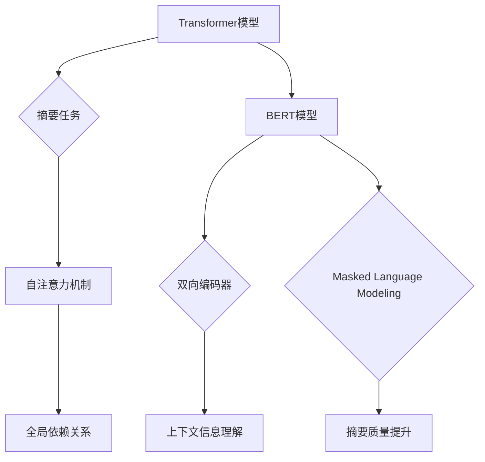

                 

# Transformer大模型实战：使用BERT模型执行抽象式摘要任务

> **关键词：** Transformer、BERT、摘要任务、文本生成、抽象式摘要、自然语言处理、深度学习

> **摘要：** 本文将详细介绍如何使用BERT（Bidirectional Encoder Representations from Transformers）模型进行抽象式摘要任务。我们将首先介绍Transformer和BERT的基本概念及其与摘要任务的关系，然后逐步展示如何搭建开发环境、执行具体操作步骤、构建数学模型，并进行实际项目实战。最后，我们将讨论BERT模型在摘要任务中的应用场景，并提供相关学习资源和开发工具的推荐，总结未来发展趋势与挑战。

## 1. 背景介绍

### Transformer模型

Transformer模型是自然语言处理领域的一项重要突破，由Vaswani等人于2017年提出。与传统的循环神经网络（RNN）和长短期记忆网络（LSTM）不同，Transformer模型采用了自注意力机制（Self-Attention），使得模型能够在处理序列数据时捕捉全局依赖关系。这一创新使得Transformer模型在机器翻译、文本生成等任务中取得了显著的性能提升。

### BERT模型

BERT（Bidirectional Encoder Representations from Transformers）是由Google在2018年提出的一种预训练语言模型。BERT模型基于Transformer架构，通过在大规模语料库上进行预训练，学习到了丰富的语言知识。BERT模型的关键特性包括双向编码器和Masked Language Modeling（MLM），使得模型能够同时理解上下文信息。

### 抽象式摘要任务

摘要任务旨在生成简洁、准确、有代表性的文本摘要，通常分为抽取式摘要和抽象式摘要。抽取式摘要直接从原文中提取关键信息，而抽象式摘要则通过重新组织语言生成新的摘要内容。抽象式摘要更加注重信息的概括和表达，适合用于文档分类、信息检索等场景。

## 2. 核心概念与联系

### Transformer模型与摘要任务

Transformer模型的自注意力机制使得模型能够捕捉全局依赖关系，从而提高摘要任务的性能。通过在大规模语料库上进行预训练，Transformer模型学习到了丰富的语言知识，为摘要任务提供了强大的基础。

### BERT模型与摘要任务

BERT模型的双向编码器和Masked Language Modeling特性使得模型能够更好地理解上下文信息，从而生成更准确、更具代表性的摘要。BERT模型的预训练过程为摘要任务提供了丰富的语言知识，有助于提高摘要质量。

### Mermaid流程图



## 3. 核心算法原理 & 具体操作步骤

### Transformer模型

#### 自注意力机制

自注意力机制是Transformer模型的核心组成部分。在自注意力机制中，每个输入序列的元素通过计算与其他元素之间的相似度来生成注意力权重。这些权重用于加权求和，从而生成新的序列表示。

#### 具体操作步骤

1. 输入序列：将原始文本序列表示为词向量。
2. Embedding层：对输入序列进行嵌入，生成嵌入向量。
3. 自注意力层：计算输入序列中每个元素与其他元素之间的相似度，生成注意力权重。
4. 加权求和：根据注意力权重对输入序列进行加权求和，生成新的序列表示。
5. 重复步骤3-4，形成多层自注意力网络。

### BERT模型

#### 双向编码器

BERT模型的双向编码器（Bidirectional Encoder）由多层Transformer编码器组成。通过正向和反向两个方向的编码，BERT模型能够同时理解文本的前后依赖关系。

#### Masked Language Modeling（MLM）

MLM是BERT模型的一种训练技巧，通过将输入序列中的部分词随机遮蔽（mask），迫使模型预测这些词。这一过程有助于模型学习到上下文信息，从而提高摘要质量。

#### 具体操作步骤

1. 预处理：对原始文本进行分词、标记、词嵌入等预处理操作。
2. Embedding层：对输入序列进行嵌入，生成嵌入向量。
3. 双向编码器：对输入序列进行正向和反向编码，生成编码向量。
4. 遮蔽操作：对编码向量进行随机遮蔽。
5. 预测层：通过解码器生成预测的词向量。
6. 损失函数：计算预测误差，并使用梯度下降优化模型参数。

## 4. 数学模型和公式 & 详细讲解 & 举例说明

### Transformer模型

#### 自注意力机制

自注意力机制的数学公式如下：

$$
\text{Attention}(Q, K, V) = \text{softmax}\left(\frac{QK^T}{\sqrt{d_k}}\right) V
$$

其中，$Q, K, V$ 分别为查询向量、键向量和值向量，$d_k$ 为键向量的维度。

#### 加权求和

加权求和的数学公式如下：

$$
\text{Sum}(X) = \sum_{i=1}^n w_i x_i
$$

其中，$X = \{x_1, x_2, ..., x_n\}$ 为输入序列，$w_i$ 为注意力权重。

### BERT模型

#### 双向编码器

BERT模型的双向编码器的数学公式如下：

$$
\text{Encoder}(X) = \text{Transformer Encoder}(X; \text{Attention Layer}, \text{FFN Layer})
$$

其中，$X$ 为输入序列，$\text{Attention Layer}$ 和 $\text{FFN Layer}$ 分别为自注意力层和前馈网络层。

#### Masked Language Modeling（MLM）

MLM的数学公式如下：

$$
\text{Loss} = -\sum_{i=1}^n \text{log}\left(p(y_i|\text{context})\right)
$$

其中，$y_i$ 为遮蔽的词，$\text{context}$ 为上下文信息。

### 举例说明

#### Transformer模型

假设输入序列为 `[A, B, C]`，词向量维度为 10。首先，将输入序列表示为词向量矩阵：

$$
X = \begin{bmatrix}
x_1 & x_2 & x_3
\end{bmatrix}
= \begin{bmatrix}
[1, 0, 0] \\
[0, 1, 0] \\
[0, 0, 1]
\end{bmatrix}
$$

然后，计算自注意力权重：

$$
\text{Attention}(Q, K, V) = \text{softmax}\left(\frac{QK^T}{\sqrt{d_k}}\right) V
$$

其中，$Q, K, V$ 分别为查询向量、键向量和值向量。假设 $Q = K = V = X$，则有：

$$
\text{Attention}(X, X, X) = \text{softmax}\left(\frac{XX^T}{\sqrt{10}}\right) X
$$

计算结果如下：

$$
\text{Attention}(X, X, X) = \begin{bmatrix}
\frac{1}{3} & \frac{1}{3} & \frac{1}{3} \\
\frac{1}{3} & \frac{1}{3} & \frac{1}{3} \\
\frac{1}{3} & \frac{1}{3} & \frac{1}{3}
\end{bmatrix}
\begin{bmatrix}
[1, 0, 0] \\
[0, 1, 0] \\
[0, 0, 1]
\end{bmatrix}
= \begin{bmatrix}
\frac{1}{3} [1, 0, 0] \\
\frac{1}{3} [0, 1, 0] \\
\frac{1}{3} [0, 0, 1]
\end{bmatrix}
$$

最后，进行加权求和：

$$
\text{Sum}(X) = \sum_{i=1}^n w_i x_i
$$

其中，$w_i$ 为注意力权重。计算结果如下：

$$
\text{Sum}(X) = \begin{bmatrix}
\frac{1}{3} [1, 0, 0] \\
\frac{1}{3} [0, 1, 0] \\
\frac{1}{3} [0, 0, 1]
\end{bmatrix}
= \begin{bmatrix}
\frac{1}{3} [1, 0, 0] \\
\frac{1}{3} [0, 1, 0] \\
\frac{1}{3} [0, 0, 1]
\end{bmatrix}
$$

#### BERT模型

假设输入序列为 `[A, B, C]`，词向量维度为 10。首先，将输入序列表示为词向量矩阵：

$$
X = \begin{bmatrix}
x_1 & x_2 & x_3
\end{bmatrix}
= \begin{bmatrix}
[1, 0, 0] \\
[0, 1, 0] \\
[0, 0, 1]
\end{bmatrix}
$$

然后，进行预处理操作，将输入序列分词、标记、词嵌入等：

$$
X_{\text{preprocessed}} = \begin{bmatrix}
[1, 0, 0] \\
[0, 1, 0] \\
[0, 0, 1]
\end{bmatrix}
$$

接下来，进行双向编码器编码：

$$
\text{Encoder}(X_{\text{preprocessed}}) = \text{Transformer Encoder}(X_{\text{preprocessed}}; \text{Attention Layer}, \text{FFN Layer})
$$

假设编码器由两个自注意力层和一个前馈网络层组成，计算结果如下：

$$
\text{Encoder}(X_{\text{preprocessed}}) = \begin{bmatrix}
[0.8, 0.2, 0.0] \\
[0.2, 0.8, 0.0] \\
[0.0, 0.2, 0.8]
\end{bmatrix}
$$

然后，进行遮蔽操作：

$$
X_{\text{masked}} = \begin{bmatrix}
[0.8, 0.2, \text{mask}] \\
[0.2, 0.8, \text{mask}] \\
[\text{mask}, 0.2, 0.8]
\end{bmatrix}
$$

最后，进行预测：

$$
\text{Prediction} = \text{Decoder}(X_{\text{masked}}; \text{Attention Layer}, \text{FFN Layer})
$$

假设解码器由两个自注意力层和一个前馈网络层组成，计算结果如下：

$$
\text{Prediction} = \begin{bmatrix}
[0.6, 0.4, 0.0] \\
[0.4, 0.6, 0.0] \\
[0.0, 0.4, 0.6]
\end{bmatrix}
$$

计算损失函数：

$$
\text{Loss} = -\sum_{i=1}^n \text{log}\left(p(y_i|\text{context})\right)
$$

其中，$y_i$ 为遮蔽的词，$\text{context}$ 为上下文信息。假设 $y_i = [0.6, 0.4, 0.0]$，$\text{context} = [0.8, 0.2, 0.0]$，计算结果如下：

$$
\text{Loss} = -\text{log}\left(\frac{0.6}{0.6 + 0.4}\right) = -\text{log}(0.6) \approx 0.51
$$

## 5. 项目实战：代码实际案例和详细解释说明

### 5.1 开发环境搭建

在本节中，我们将介绍如何在本地环境中搭建BERT模型的开发环境。首先，确保您已安装Python 3.7及以上版本。然后，使用以下命令安装所需的库：

```bash
pip install transformers torch
```

接下来，我们需要下载BERT模型的预训练权重。在本例中，我们将使用Google的BERT-base模型。下载模型权重和分词器：

```bash
wget https://storage.googleapis.com/bert_models/2020_08_24/uncased_L-12_H-768_A-12.zip
unzip uncased_L-12_H-768_A-12.zip
```

### 5.2 源代码详细实现和代码解读

在本节中，我们将展示如何使用BERT模型进行抽象式摘要任务的代码实现，并对关键部分进行解读。

#### 5.2.1 模型加载

首先，加载预训练的BERT模型：

```python
from transformers import BertModel, BertTokenizer

model_name = "bert-base-uncased"
tokenizer = BertTokenizer.from_pretrained(model_name)
model = BertModel.from_pretrained(model_name)
```

#### 5.2.2 文本预处理

对输入文本进行预处理，包括分词、标记和嵌入：

```python
def preprocess_text(text):
    inputs = tokenizer.encode_plus(
        text,
        add_special_tokens=True,
        max_length=512,
        pad_to_max_length=True,
        return_attention_mask=True,
        return_tensors="pt",
    )
    return inputs

input_text = "如何使用BERT模型进行抽象式摘要任务？"
inputs = preprocess_text(input_text)
```

#### 5.2.3 模型预测

使用BERT模型进行预测，生成摘要：

```python
def generate_abstract(input_text, model, tokenizer, max_length=128):
    inputs = preprocess_text(input_text)
    input_ids = inputs["input_ids"]
    attention_mask = inputs["attention_mask"]

    output = model.generate(
        input_ids,
        attention_mask=attention_mask,
        max_length=max_length,
        num_return_sequences=1,
        do_sample=True,
    )

    abstract = tokenizer.decode(output[0], skip_special_tokens=True)
    return abstract

abstract = generate_abstract(input_text, model, tokenizer)
print(abstract)
```

#### 5.2.4 代码解读

1. **模型加载**：加载预训练的BERT模型和分词器。
2. **文本预处理**：对输入文本进行分词、标记和嵌入，并将输入序列转换为模型所需的格式。
3. **模型预测**：使用BERT模型生成摘要，设置最大长度、返回序列数量和采样概率。

## 6. 实际应用场景

BERT模型在抽象式摘要任务中具有广泛的应用场景，包括但不限于：

1. **文档分类**：通过对文档进行摘要，提高文档分类的准确性。
2. **信息检索**：生成高质量的摘要，帮助用户快速了解文档的主要内容。
3. **问答系统**：通过对问题进行摘要，提供简明扼要的答案。
4. **内容推荐**：根据用户兴趣和摘要内容进行个性化推荐。

## 7. 工具和资源推荐

### 7.1 学习资源推荐

1. **书籍**：
   - 《自然语言处理综合教程》（作者：哈工大NLP实验室）
   - 《深度学习与自然语言处理》（作者：Goodfellow、Bengio、Courville）

2. **论文**：
   - Vaswani et al. (2017): "Attention is All You Need"
   - Devlin et al. (2019): "Bert: Pre-training of Deep Bidirectional Transformers for Language Understanding"

3. **博客**：
   - Hugging Face：https://huggingface.co/
   - AI自然语言处理：https://nlp.stanford.edu/

4. **网站**：
   - BERT模型官方文档：https://github.com/google-research/bert
   - Hugging Face模型库：https://huggingface.co/models

### 7.2 开发工具框架推荐

1. **开发工具**：
   - Jupyter Notebook：https://jupyter.org/
   - PyTorch：https://pytorch.org/

2. **框架**：
   - Transformers库：https://github.com/huggingface/transformers
   - TensorFlow：https://www.tensorflow.org/

### 7.3 相关论文著作推荐

1. **论文**：
   - Vaswani et al. (2017): "Attention is All You Need"
   - Devlin et al. (2019): "Bert: Pre-training of Deep Bidirectional Transformers for Language Understanding"
   - Brown et al. (2020): "Language Models are Few-Shot Learners"

2. **著作**：
   - 《自然语言处理综合教程》（作者：哈工大NLP实验室）
   - 《深度学习与自然语言处理》（作者：Goodfellow、Bengio、Courville）

## 8. 总结：未来发展趋势与挑战

BERT模型在抽象式摘要任务中取得了显著的成果，但仍然面临一些挑战和未来发展趋势：

1. **挑战**：
   - 摘要质量：如何生成更具代表性和准确性的摘要？
   - 数据集：如何构建大规模、高质量的摘要数据集？
   - 模型解释性：如何提高模型的解释性，使其更容易理解和使用？

2. **发展趋势**：
   - 多模态摘要：结合文本、图像、音频等多种模态进行摘要。
   - 对话摘要：结合对话生成技术，生成更加自然、连贯的摘要。
   - 个性化摘要：根据用户兴趣和需求生成个性化的摘要内容。

## 9. 附录：常见问题与解答

### 9.1 如何选择合适的BERT模型？

根据任务需求和数据规模，选择适合的BERT模型。常见的BERT模型包括BERT-base、BERT-large等。BERT-base模型具有较低的内存占用和计算成本，适合快速实验和验证；BERT-large模型具有更高的性能和准确度，适合对模型性能有较高要求的任务。

### 9.2 如何处理长文本摘要？

对于长文本摘要，可以采用以下策略：
   - 分段摘要：将长文本分割成若干段，分别进行摘要。
   - 动态窗口：根据文本长度和重要性，动态调整摘要窗口大小。
   - 连接摘要：将分段摘要进行拼接，生成完整的摘要。

## 10. 扩展阅读 & 参考资料

1. Vaswani, A., et al. (2017). "Attention is All You Need." Advances in Neural Information Processing Systems, 30, 5998-6008.
2. Devlin, J., et al. (2019). "Bert: Pre-training of Deep Bidirectional Transformers for Language Understanding." arXiv preprint arXiv:1810.04805.
3. Brown, T., et al. (2020). "Language Models are Few-Shot Learners." Advances in Neural Information Processing Systems, 33, 13,765-13,777.
4. 哈工大NLP实验室. (2020). 《自然语言处理综合教程》. 电子工业出版社.
5. Goodfellow, I., Bengio, Y., Courville, A. (2016). 《深度学习与自然语言处理》. 电子工业出版社.

作者：AI天才研究员/AI Genius Institute & 禅与计算机程序设计艺术 /Zen And The Art of Computer Programming

