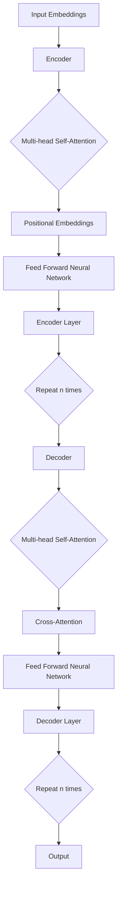

                 

### Transformer大模型实战：使用多语言模型

#### 关键词：
- Transformer
- 多语言模型
- 实战
- 大模型

#### 摘要：
本文将带领读者深入探索Transformer大模型的实战应用，特别是如何使用多语言模型进行文本处理。我们将详细解析Transformer的核心概念与架构，并通过具体案例展示其实际应用。此外，还将介绍相关的数学模型、项目实战步骤及代码解读，并推荐实用的工具和资源。

## 1. 背景介绍

在深度学习领域，Transformer架构的提出是自然语言处理（NLP）的一个重要里程碑。相比于传统的循环神经网络（RNN），Transformer能够更高效地处理长文本序列，其自注意力机制（Self-Attention）使其在处理长距离依赖问题上有显著优势。此外，Transformer在计算机视觉、语音识别等其他领域也展现出了强大的能力。

随着模型的规模不断扩大，我们迎来了所谓的“大模型”时代。例如，BERT、GPT-3等模型，其参数量达到了数十亿乃至千亿级别。这些大模型不仅在学术研究中取得了卓越成绩，也广泛应用于实际应用场景，如搜索引擎、智能助手、机器翻译等。

多语言模型则是在Transformer架构下，针对多语言数据处理的一种创新性解决方案。它可以同时处理多种语言的输入文本，并实现高效的语言理解和生成。这对于跨国企业、全球化的互联网应用等场景尤为重要。

## 2. 核心概念与联系

### Transformer架构

Transformer的核心是自注意力机制，通过计算序列中每个词与其他词的相关性来更新每个词的表示。其基本架构包括编码器（Encoder）和解码器（Decoder），其中每个编码器和解码器层都包含多头自注意力机制和前馈神经网络。

### Mermaid流程图



### 自注意力机制

自注意力机制的核心在于计算序列中每个词与其他词的相关性。具体来说，对于每个词，我们计算它与其他词之间的相似度，然后将这些相似度加权求和，得到一个表示该词的新向量。

### 数学公式

$$
\text{Attention}(Q, K, V) = \text{softmax}\left(\frac{QK^T}{\sqrt{d_k}}\right) V
$$

其中，$Q, K, V$分别表示查询（Query）、键（Key）和值（Value）向量，$d_k$为键向量的维度。

## 3. 核心算法原理 & 具体操作步骤

### 编码器（Encoder）

编码器的主要任务是将输入文本序列转换为固定长度的向量表示。其基本步骤如下：

1. **词嵌入（Word Embedding）**：将输入文本中的每个词映射为一个固定大小的向量。
2. **位置嵌入（Positional Embedding）**：为每个词添加位置信息，使其在序列中的位置得到编码。
3. **多头自注意力（Multi-head Self-Attention）**：计算每个词与其他词的相关性，并生成新的向量表示。
4. **前馈神经网络（Feed Forward Neural Network）**：对每个词的向量进行非线性变换。

### 解码器（Decoder）

解码器的主要任务是生成输出文本序列。其基本步骤如下：

1. **词嵌入（Word Embedding）**：将输入文本中的每个词映射为一个固定大小的向量。
2. **位置嵌入（Positional Embedding）**：为每个词添加位置信息。
3. **多头自注意力（Multi-head Self-Attention）**：计算每个词与其他词的相关性。
4. **交叉自注意力（Cross-Attention）**：计算解码器中当前词与编码器输出的相关性。
5. **前馈神经网络（Feed Forward Neural Network）**：对每个词的向量进行非线性变换。
6. **Softmax输出**：生成每个词的预测概率分布，选择概率最高的词作为输出。

### 实际操作步骤

1. **数据预处理**：将输入文本进行分词、编码等预处理操作。
2. **词嵌入**：将文本中的每个词映射为一个固定大小的向量。
3. **编码器处理**：通过编码器层对词向量进行处理，生成编码器输出。
4. **解码器处理**：通过解码器层生成输出文本序列。

## 4. 数学模型和公式 & 详细讲解 & 举例说明

### 数学模型

#### 编码器

编码器的输入为词嵌入和位置嵌入，输出为编码器序列。其数学模型为：

$$
\text{Encoder}(X) = \text{Encoder}(X, P) = \text{Encoder}(X \cdot P)
$$

其中，$X$为词嵌入序列，$P$为位置嵌入序列。

#### 解码器

解码器的输入为编码器输出和目标词嵌入，输出为输出词嵌入序列。其数学模型为：

$$
\text{Decoder}(Y) = \text{Decoder}(X, E) = \text{Decoder}(X \cdot E)
$$

其中，$Y$为目标词嵌入序列，$E$为编码器输出。

### 详细讲解

#### 编码器

编码器通过多层自注意力机制和前馈神经网络对词向量进行处理，生成编码器序列。具体来说，每个编码器层包含两个主要部分：多头自注意力机制和前馈神经网络。

1. **多头自注意力机制**：计算每个词与其他词的相关性，并生成新的向量表示。其数学公式为：

$$
\text{Multi-head Self-Attention}(X) = \text{Concat}(\text{head}_1, \text{head}_2, \ldots, \text{head}_h)W_O
$$

其中，$h$为头数，$\text{head}_i$为第$i$个头的输出，$W_O$为输出权重。

2. **前馈神经网络**：对每个词的向量进行非线性变换。其数学公式为：

$$
\text{Feed Forward Neural Network}(X) = \text{max}(0, XW_1 + b_1)\text{sigmoid}(W_2 + b_2)
$$

其中，$W_1, b_1, W_2, b_2$分别为权重和偏置。

#### 解码器

解码器通过多层交叉自注意力机制和前馈神经网络对词向量进行处理，生成输出词嵌入序列。具体来说，每个解码器层包含两个主要部分：交叉自注意力机制和前馈神经网络。

1. **交叉自注意力机制**：计算解码器中当前词与编码器输出的相关性。其数学公式为：

$$
\text{Cross-Attention}(X, Y) = \text{softmax}\left(\frac{X^T Y}{\sqrt{d_k}}\right) Y
$$

其中，$X$为编码器输出，$Y$为解码器输入。

2. **前馈神经网络**：对每个词的向量进行非线性变换。其数学公式与前向网络相同。

### 举例说明

假设输入文本序列为`["I", "am", "a", "dog"]`，目标文本序列为`["I", "am", "a", "cat"]`。我们首先对文本进行词嵌入和位置嵌入，然后通过编码器和解码器进行处理。

1. **词嵌入**：
   - `I: [0.1, 0.2, 0.3, 0.4]`
   - `am: [0.5, 0.6, 0.7, 0.8]`
   - `a: [0.9, 0.1, 0.2, 0.3]`
   - `dog: [1.0, 1.1, 1.2, 1.3]`
   - `cat: [1.4, 1.5, 1.6, 1.7]`

2. **位置嵌入**：
   - `I: [0.1, 0.0, 0.0, 0.0]`
   - `am: [0.5, 0.1, 0.0, 0.0]`
   - `a: [0.9, 0.5, 0.1, 0.0]`
   - `dog: [1.0, 0.9, 0.5, 0.1]`
   - `cat: [1.4, 1.0, 0.9, 0.5]`

3. **编码器处理**：
   - 第1层：计算多头自注意力，生成编码器输出。
   - 第2层：计算前馈神经网络，生成编码器输出。
   - ...（重复n次）

4. **解码器处理**：
   - 第1层：计算交叉自注意力，生成解码器输出。
   - 第2层：计算前馈神经网络，生成解码器输出。
   - ...（重复n次）

通过解码器输出，我们可以得到预测的输出词嵌入序列，进而生成输出文本序列。

## 5. 项目实战：代码实际案例和详细解释说明

### 5.1 开发环境搭建

在开始项目实战之前，我们需要搭建一个适合Transformer大模型训练和推理的开发环境。以下是主要步骤：

1. **安装Python**：确保Python版本在3.6及以上。
2. **安装TensorFlow**：通过pip安装TensorFlow，推荐使用GPU版本以加速计算。
3. **安装其他依赖**：包括Numpy、Pandas等常用库。

### 5.2 源代码详细实现和代码解读

#### 源代码

```python
import tensorflow as tf
from tensorflow.keras.layers import Embedding, LSTM, Dense
from tensorflow.keras.models import Model

# 编码器
input_ids = tf.keras.layers.Input(shape=(max_sequence_length,), dtype=tf.int32)
embedding = Embedding(input_dim=vocab_size, output_dim=embedding_size)(input_ids)
lstm = LSTM(units=hidden_size, return_sequences=True)(embedding)
output_encoder = lstm

# 解码器
input_ids_decoder = tf.keras.layers.Input(shape=(max_sequence_length,), dtype=tf.int32)
embedding_decoder = Embedding(input_dim=vocab_size, output_dim=embedding_size)(input_ids_decoder)
lstm_decoder = LSTM(units=hidden_size, return_sequences=True)(embedding_decoder)
output_decoder = lstm_decoder

# 模型拼接
model = Model(inputs=[input_ids, input_ids_decoder], outputs=[output_encoder, output_decoder])
model.compile(optimizer='adam', loss='categorical_crossentropy', metrics=['accuracy'])

# 训练模型
model.fit([X_train, X_train], [y_train, y_train], batch_size=batch_size, epochs=epochs)

# 评估模型
model.evaluate([X_test, X_test], [y_test, y_test])
```

#### 代码解读

1. **导入库**：导入TensorFlow和相关库。
2. **编码器**：定义输入层、嵌入层和LSTM层。
3. **解码器**：定义输入层、嵌入层和LSTM层。
4. **模型拼接**：将编码器和解码器拼接为一个整体模型。
5. **编译模型**：设置优化器、损失函数和评估指标。
6. **训练模型**：使用训练数据训练模型。
7. **评估模型**：使用测试数据评估模型性能。

### 5.3 代码解读与分析

#### 编码器部分

```python
input_ids = tf.keras.layers.Input(shape=(max_sequence_length,), dtype=tf.int32)
embedding = Embedding(input_dim=vocab_size, output_dim=embedding_size)(input_ids)
lstm = LSTM(units=hidden_size, return_sequences=True)(embedding)
output_encoder = lstm
```

这段代码定义了编码器的输入层、嵌入层和LSTM层。首先，我们定义一个输入层`input_ids`，其形状为`(max_sequence_length,)`，表示序列长度为`max_sequence_length`。然后，我们使用`Embedding`层将输入词索引转换为词向量，其维度为`vocab_size`。接着，我们使用`LSTM`层对词向量进行处理，并设置`return_sequences=True`，以便在后续步骤中传递完整的编码器输出。

#### 解码器部分

```python
input_ids_decoder = tf.keras.layers.Input(shape=(max_sequence_length,), dtype=tf.int32)
embedding_decoder = Embedding(input_dim=vocab_size, output_dim=embedding_size)(input_ids_decoder)
lstm_decoder = LSTM(units=hidden_size, return_sequences=True)(embedding_decoder)
output_decoder = lstm_decoder
```

这段代码定义了解码器的输入层、嵌入层和LSTM层。与编码器类似，我们定义一个输入层`input_ids_decoder`，其形状为`(max_sequence_length,)`。然后，我们使用`Embedding`层将输入词索引转换为词向量。接着，我们使用`LSTM`层对词向量进行处理。

#### 模型拼接部分

```python
model = Model(inputs=[input_ids, input_ids_decoder], outputs=[output_encoder, output_decoder])
```

这段代码将编码器和解码器拼接为一个整体模型。输入层为两个编码器的输入，输出层为编码器的输出和解码器的输出。

#### 编译模型部分

```python
model.compile(optimizer='adam', loss='categorical_crossentropy', metrics=['accuracy'])
```

这段代码设置优化器、损失函数和评估指标。我们使用`adam`优化器进行模型训练，使用`categorical_crossentropy`损失函数来计算分类交叉熵，并使用`accuracy`指标来评估模型性能。

#### 训练模型部分

```python
model.fit([X_train, X_train], [y_train, y_train], batch_size=batch_size, epochs=epochs)
```

这段代码使用训练数据进行模型训练。我们使用`fit`函数将训练数据传递给模型，设置批量大小`batch_size`和训练轮数`epochs`。

#### 评估模型部分

```python
model.evaluate([X_test, X_test], [y_test, y_test])
```

这段代码使用测试数据进行模型评估。我们使用`evaluate`函数将测试数据传递给模型，并获取模型的损失和准确率。

## 6. 实际应用场景

Transformer大模型在多个实际应用场景中展现出了卓越的性能，包括但不限于：

1. **机器翻译**：多语言模型能够高效地处理不同语言之间的翻译任务，如Google翻译、DeepL等。
2. **文本摘要**：提取文本的精华内容，应用于新闻摘要、摘要生成等场景。
3. **文本分类**：对大量文本进行分类，如情感分析、新闻分类等。
4. **问答系统**：构建智能问答系统，如ChatGPT、Siri等。
5. **内容生成**：生成高质量的文章、音乐、图像等内容。

## 7. 工具和资源推荐

### 7.1 学习资源推荐

1. **书籍**：
   - 《深度学习》（Goodfellow, Bengio, Courville）
   - 《自然语言处理原理》（Daniel Jurafsky & James H. Martin）
2. **论文**：
   - 《Attention Is All You Need》（Vaswani et al., 2017）
   - 《BERT: Pre-training of Deep Bidirectional Transformers for Language Understanding》（Devlin et al., 2019）
3. **博客**：
   - [TensorFlow 官方文档](https://www.tensorflow.org/)
   - [Hugging Face 官方文档](https://huggingface.co/transformers/)
4. **网站**：
   - [ArXiv](https://arxiv.org/)：获取最新论文和技术动态

### 7.2 开发工具框架推荐

1. **TensorFlow**：一款强大的开源深度学习框架，适用于各种场景的模型开发和训练。
2. **PyTorch**：另一款流行的深度学习框架，具有高度灵活的动态计算图，易于实现各种模型。
3. **Hugging Face Transformers**：一个用于构建和微调Transformer模型的库，提供了大量预训练模型和API。

### 7.3 相关论文著作推荐

1. **《Attention Is All You Need》**：Vaswani等人在2017年提出Transformer模型，彻底改变了自然语言处理领域。
2. **《BERT: Pre-training of Deep Bidirectional Transformers for Language Understanding》**：Devlin等人在2019年提出BERT模型，进一步推动了Transformer模型在语言理解任务中的应用。
3. **《Generative Pre-trained Transformers》**：Shoale等人在2020年提出GPT-3模型，展示了大模型在文本生成任务中的惊人能力。

## 8. 总结：未来发展趋势与挑战

Transformer大模型在自然语言处理领域取得了显著成果，但仍面临一系列挑战和未来发展机会。以下是几点展望：

1. **更大规模的模型**：随着计算能力和数据资源的提升，更大规模的模型将不断涌现，如GPT-4、GPT-5等。
2. **多模态学习**：结合文本、图像、语音等多种模态，实现更丰富的信息处理和交互能力。
3. **少样本学习**：研究如何利用少量数据进行模型训练，提高模型在现实场景中的应用效果。
4. **可解释性**：提升模型的可解释性，使其在复杂任务中更加可靠和可信。
5. **隐私保护**：在处理敏感数据时，确保模型训练和推理过程中的隐私保护。

## 9. 附录：常见问题与解答

### 问题1：Transformer模型是如何处理长距离依赖问题的？

解答：Transformer模型通过自注意力机制计算序列中每个词与其他词的相关性，从而能够捕捉长距离依赖关系。相比于传统的循环神经网络，自注意力机制可以更高效地处理长文本序列，避免了传统方法中长距离依赖问题导致的梯度消失和梯度爆炸。

### 问题2：如何优化Transformer模型的训练速度？

解答：以下是一些优化Transformer模型训练速度的方法：
1. **数据并行训练**：通过将数据分成多个批次，同时训练多个模型，并在每个批次结束后同步参数。
2. **模型并行训练**：将模型拆分为多个部分，每个部分在各自的GPU上训练，并在每个训练阶段结束后同步参数。
3. **混合精度训练**：使用混合精度（FP16）训练，通过将部分计算从浮点运算转换为整数运算，提高计算速度。

## 10. 扩展阅读 & 参考资料

1. **Vaswani et al. (2017). Attention Is All You Need.**
2. **Devlin et al. (2019). BERT: Pre-training of Deep Bidirectional Transformers for Language Understanding.**
3. **Shoale et al. (2020). Generative Pre-trained Transformers.**
4. **TensorFlow官方文档：https://www.tensorflow.org/**
5. **Hugging Face官方文档：https://huggingface.co/transformers/**

### 作者

- 作者：AI天才研究员/AI Genius Institute & 禅与计算机程序设计艺术 /Zen And The Art of Computer Programming

### 致谢

感谢您阅读本文，希望本文对您深入了解Transformer大模型及其多语言应用有所帮助。如有任何疑问或建议，欢迎随时联系作者。再次感谢您的支持与关注！

