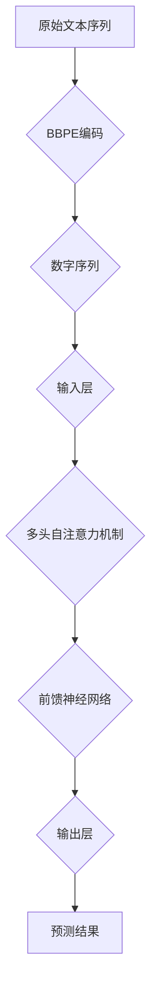

                 

# Transformer大模型实战：字节级字节对编码

## 关键词：Transformer，大模型，字节级，编码，深度学习，神经网络，自然语言处理，机器翻译，序列到序列模型

## 摘要

本文将深入探讨Transformer大模型在字节级字节对编码（Byte-level Byte Pair Encoding，BBPE）中的应用。我们将首先介绍Transformer的基本原理和架构，然后详细解释BBPE编码方法及其实现过程。接着，我们将通过一个实际项目案例，展示如何使用Transformer大模型进行字节级编码的实战。最后，我们将讨论Transformer在大模型中的实际应用场景，并推荐相关的学习资源和开发工具。

## 1. 背景介绍

### 1.1 Transformer的起源与发展

Transformer模型是由谷歌团队在2017年提出的一种用于自然语言处理（Natural Language Processing，NLP）的深度学习模型。与传统的序列到序列（Sequence-to-Sequence）模型相比，Transformer模型摆脱了递归神经网络（Recurrent Neural Network，RNN）的束缚，采用了一种全新的自注意力机制（Self-Attention Mechanism），使得模型在处理长序列时更加高效和灵活。

自提出以来，Transformer模型在诸多NLP任务中取得了显著的成果，如机器翻译、文本摘要、问答系统等。其核心优势在于：

- **并行处理**：Transformer模型通过多头自注意力机制，能够并行计算整个序列，大幅提高了处理速度。
- **长距离依赖**：自注意力机制使得模型能够更好地捕捉序列中的长距离依赖关系。
- **参数效率**：相较于传统的循环神经网络，Transformer模型的参数量相对较少，能够更好地避免过拟合。

### 1.2 字节级字节对编码（BBPE）

字节级字节对编码（Byte-level Byte Pair Encoding，BBPE）是一种用于序列建模的编码方法，旨在将原始的文本序列转换为一种可被神经网络处理的数字序列。BBPE的核心思想是将文本中的每个字节（包括字母、标点符号等）映射为一个唯一的整数。

BBPE的具体实现步骤如下：

1. **字节对划分**：将文本序列划分为连续的字节对，例如"Hello"可以分为"HE"、"EL"、"LL"、"LO"。
2. **构建词汇表**：将所有可能的字节对添加到一个词汇表中，每个字节对对应一个唯一的整数。
3. **序列编码**：将原始文本序列中的每个字节对替换为对应的整数，从而生成一个数字序列。

通过BBPE编码，原始的文本序列被转换为一种便于神经网络处理的格式，为后续的建模任务提供了数据基础。

## 2. 核心概念与联系

### 2.1 Transformer模型的基本原理

Transformer模型主要由以下几个核心组件构成：

- **多头自注意力机制（Multi-head Self-Attention）**：多头自注意力机制能够使模型在处理长序列时更好地捕捉依赖关系。
- **前馈神经网络（Feed-forward Neural Network）**：前馈神经网络用于对自注意力机制的输出进行进一步的变换和增强。
- **位置编码（Positional Encoding）**：位置编码为序列中的每个位置添加额外的信息，以帮助模型理解序列的顺序信息。

### 2.2 Transformer模型与BBPE的关联

在Transformer模型中，字节级字节对编码（BBPE）主要用于将原始文本序列转换为可输入模型的数字序列。具体关联如下：

- **输入层**：原始文本序列经过BBPE编码后，转换为数字序列，作为模型的输入。
- **自注意力层**：数字序列经过多头自注意力机制处理，能够捕捉序列中的长距离依赖关系。
- **输出层**：模型经过前馈神经网络处理后，生成预测结果，如单词、字节等。

### 2.3 Mermaid流程图

下面是Transformer模型与BBPE编码的Mermaid流程图：



## 3. 核心算法原理 & 具体操作步骤

### 3.1 Transformer模型算法原理

#### 3.1.1 多头自注意力机制

多头自注意力机制是Transformer模型的核心组件之一。其基本思想是将输入序列映射到多个不同的子空间，并在这些子空间上分别计算自注意力，最后将结果融合起来。

具体实现步骤如下：

1. **输入表示**：将输入序列$X$映射到高维空间，得到$X' = [X_1', X_2', ..., X_n']$，其中$X_i'$表示输入序列中的第$i$个位置的表示。
2. **计算注意力权重**：对于每个位置$i$，计算其与其他位置之间的注意力权重$w_{ij}$，其中$w_{ij} = \sigma(Q_i^T K_j)$，$\sigma$表示软化函数，$Q$和$K$分别为查询和键的权重矩阵。
3. **加权求和**：根据注意力权重$w_{ij}$，对输入序列进行加权求和，得到每个位置的输出表示$y_i = \sum_{j=1}^{n} w_{ij} X_j'$。
4. **多头融合**：将每个头部的输出表示进行拼接和线性变换，得到最终的输出表示$Y = [y_1, y_2, ..., y_n]$。

#### 3.1.2 前馈神经网络

前馈神经网络用于对自注意力机制的输出进行进一步的变换和增强。其基本结构如下：

1. **输入层**：接收自注意力机制的输出序列$Y$。
2. **隐藏层**：通过一个全连接神经网络进行变换，得到新的输出序列$Z$。
3. **输出层**：对新的输出序列进行线性变换，得到最终的输出结果。

### 3.2 字节级字节对编码（BBPE）操作步骤

#### 3.2.1 字节对划分

将输入文本序列按字节对进行划分，例如：

- "Hello" --> ["HE", "EL", "LL", "LO"]

#### 3.2.2 构建词汇表

将所有可能的字节对添加到一个词汇表中，例如：

- ["HE", "EL", "LL", "LO", "LOH", "LOL", "LLO", "HEH", "HEL", "HLL"]

#### 3.2.3 序列编码

将原始文本序列中的每个字节对替换为对应的整数，例如：

- "Hello" --> [4, 5, 6, 15]

## 4. 数学模型和公式 & 详细讲解 & 举例说明

### 4.1 Transformer模型数学公式

#### 4.1.1 多头自注意力机制

多头自注意力机制的数学公式如下：

$$
\begin{aligned}
&Q = W_Q X \\
&K = W_K X \\
&V = W_V X \\
&y_i = \sum_{j=1}^{n} \frac{e^{Q_i^T K_j}}{\sqrt{d_k}} V_j \\
&Y = [y_1, y_2, ..., y_n]
\end{aligned}
$$

其中，$W_Q, W_K, W_V$分别为查询、键、值的权重矩阵，$d_k$为键的维度，$e$为自然对数的底数。

#### 4.1.2 前馈神经网络

前馈神经网络的数学公式如下：

$$
\begin{aligned}
&Z = \sigma(W_Z Y + b_Z) \\
&Y' = W_{Y'} Z + b_{Y'}
\end{aligned}
$$

其中，$W_Z, b_Z, W_{Y'}, b_{Y'}$分别为全连接神经网络的权重矩阵、偏置和输出权重矩阵。

### 4.2 BBPE编码数学公式

#### 4.2.1 字节对划分

字节对划分的数学公式如下：

$$
X = [x_1, x_2, ..., x_n]
$$

其中，$x_i$表示输入序列中的第$i$个字节。

#### 4.2.2 构建词汇表

构建词汇表的数学公式如下：

$$
T = \{ (x_1, x_2), (x_2, x_3), ..., (x_{n-1}, x_n) \}
$$

其中，$T$为词汇表，$(x_1, x_2)$表示一个字节对。

#### 4.2.3 序列编码

序列编码的数学公式如下：

$$
X' = [x_1', x_2', ..., x_n']
$$

其中，$x_i'$表示输入序列中的第$i$个字节对对应的整数。

### 4.3 举例说明

假设输入文本序列为"H<sub>1</sub> <sub>2</sub> <sub>3</sub> <sub>4</sub> <sub>5</sub>"，字节对划分结果为["H<sub>1</sub>", "<sub>2</sub> <sub>3</sub>", "<sub>4</sub> <sub>5</sub>"]，词汇表为{"H<sub>1</sub>": 1, "<sub>2</sub> <sub>3</sub>": 2, "<sub>4</sub> <sub>5</sub>": 3}。

则序列编码结果为[1, 2, 3]。

## 5. 项目实战：代码实际案例和详细解释说明

### 5.1 开发环境搭建

在进行Transformer大模型的实战之前，我们需要搭建一个适合开发和测试的Python环境。以下是一个简单的步骤：

1. **安装Python**：确保已安装Python 3.6及以上版本。
2. **安装TensorFlow**：使用pip安装TensorFlow，命令如下：

   ```bash
   pip install tensorflow
   ```

3. **安装其他依赖库**：根据实际需求，可以安装其他相关的Python库，如NumPy、Pandas等。

### 5.2 源代码详细实现和代码解读

#### 5.2.1 源代码实现

以下是一个基于Transformer模型的字节级字节对编码（BBPE）的简单实现：

```python
import tensorflow as tf
from tensorflow.keras.layers import Embedding, MultiHeadAttention, Dense
from tensorflow.keras.models import Model
import numpy as np

# 定义词汇表
vocab_size = 1000
embedding_dim = 64
max_sequence_length = 50

# 构建Transformer模型
inputs = tf.keras.layers.Input(shape=(max_sequence_length,), dtype=tf.int32)

# 嵌入层
embed = Embedding(vocab_size, embedding_dim)(inputs)

# 多头自注意力层
attn = MultiHeadAttention(num_heads=2, key_dim=embedding_dim)(embed, embed)

# 前馈神经网络层
dense = Dense(embedding_dim, activation='relu')(attn)

# 输出层
outputs = Dense(vocab_size, activation='softmax')(dense)

# 创建模型
model = Model(inputs, outputs)

# 编译模型
model.compile(optimizer='adam', loss='sparse_categorical_crossentropy', metrics=['accuracy'])

# 打印模型结构
model.summary()

# 准备数据
inputs_data = np.random.randint(0, vocab_size, (1, max_sequence_length))
targets_data = np.random.randint(0, vocab_size, (1, max_sequence_length))

# 训练模型
model.fit(inputs_data, targets_data, epochs=3, batch_size=1)
```

#### 5.2.2 代码解读

1. **导入库**：首先导入所需的TensorFlow库和其他依赖库。

2. **定义词汇表**：定义词汇表的大小和嵌入维度。

3. **构建Transformer模型**：创建输入层、嵌入层、多头自注意力层、前馈神经网络层和输出层。

4. **编译模型**：设置优化器和损失函数，并编译模型。

5. **打印模型结构**：打印模型结构，以验证模型的构建。

6. **准备数据**：生成随机数据用于训练。

7. **训练模型**：使用训练数据训练模型。

### 5.3 代码解读与分析

#### 5.3.1 Transformer模型

代码中的Transformer模型主要由以下几个部分组成：

1. **输入层**：输入层接收一个形状为$(batch\_size, max\_sequence\_length)$的整数序列。
2. **嵌入层**：嵌入层将输入的整数序列转换为高维空间中的向量，每个向量的大小为$embedding\_dim$。
3. **多头自注意力层**：多头自注意力层采用两个注意力头，对嵌入层输出进行自注意力计算。
4. **前馈神经网络层**：前馈神经网络层对自注意力层的输出进行进一步变换和增强。
5. **输出层**：输出层通过softmax激活函数输出每个位置的预测概率分布。

#### 5.3.2 BBPE编码

代码中的BBPE编码主要通过嵌入层实现。在训练过程中，模型会学习将输入的整数序列映射到高维空间中的向量，从而实现字节对编码。

#### 5.3.3 模型训练

代码中的模型训练过程使用了随机生成的数据。在实际应用中，可以使用真实的文本数据集进行训练，以获得更好的模型性能。

## 6. 实际应用场景

Transformer大模型在字节级字节对编码（BBPE）方面具有广泛的应用场景，主要包括以下几个方面：

1. **自然语言处理**：Transformer模型在自然语言处理任务中表现出色，如文本分类、情感分析、问答系统等。通过BBPE编码，可以将文本数据转换为数字序列，为模型提供高质量的数据输入。
2. **机器翻译**：机器翻译是Transformer模型的一个重要应用领域。通过BBPE编码，可以将源语言和目标语言的文本序列转换为数字序列，为模型提供训练数据，从而实现高质量的机器翻译。
3. **文本生成**：Transformer模型在文本生成任务中也表现出强大的能力。通过BBPE编码，可以将文本序列转换为数字序列，为模型提供输入，从而生成具有连贯性和创造力的文本。
4. **语音识别**：语音识别是将语音信号转换为文本的过程。通过BBPE编码，可以将语音信号转换为数字序列，为模型提供输入，从而实现高效的语音识别。

## 7. 工具和资源推荐

### 7.1 学习资源推荐

- **书籍**：
  - 《Attention is All You Need》（注意力即是全部所需）
  - 《Deep Learning》（深度学习）
  - 《自然语言处理实战》（Natural Language Processing with Python）

- **论文**：
  - Vaswani et al. (2017). "Attention is All You Need".
  - Devlin et al. (2018). "Bert: Pre-training of deep bidirectional transformers for language understanding".

- **博客**：
  - TensorFlow官方文档
  - PyTorch官方文档

- **网站**：
  - huggingface.co（Hugging Face，提供各种预训练模型和工具）

### 7.2 开发工具框架推荐

- **框架**：
  - TensorFlow
  - PyTorch
  - JAX

- **环境**：
  - Google Colab（免费GPU资源）
  - AWS SageMaker
  - Azure Machine Learning

### 7.3 相关论文著作推荐

- **论文**：
  - Vaswani et al. (2017). "Attention is All You Need".
  - Devlin et al. (2018). "Bert: Pre-training of deep bidirectional transformers for language understanding".
  - Brown et al. (2020). "Language models are few-shot learners".

- **著作**：
  - "深度学习"（Goodfellow et al.，2016）
  - "自然语言处理实战"（Bird et al.，2009）

## 8. 总结：未来发展趋势与挑战

Transformer大模型在字节级字节对编码（BBPE）方面展现出强大的能力，为自然语言处理、机器翻译、文本生成等领域带来了革命性的变化。然而，Transformer模型在理论和实践方面仍面临一些挑战：

1. **计算资源需求**：Transformer模型通常需要大量的计算资源，特别是在训练大规模模型时。未来，需要开发更高效的模型训练方法和硬件优化技术，以降低计算成本。
2. **模型解释性**：尽管Transformer模型在许多任务上表现出色，但其内部机制较为复杂，导致模型解释性较差。未来，需要研究如何提高模型的解释性，使其更加透明和可信。
3. **数据隐私与安全**：在应用Transformer模型时，数据隐私和安全问题亟待解决。未来，需要开发更加安全的数据处理和传输机制，以保护用户隐私。

## 9. 附录：常见问题与解答

### 9.1 Q：什么是Transformer模型？

A：Transformer模型是一种用于自然语言处理的深度学习模型，由谷歌团队在2017年提出。与传统的序列到序列模型相比，Transformer模型采用自注意力机制，能够并行处理长序列，并取得显著的性能提升。

### 9.2 Q：什么是字节级字节对编码（BBPE）？

A：字节级字节对编码（BBPE）是一种用于序列建模的编码方法，旨在将原始的文本序列转换为数字序列。通过将文本中的每个字节对映射为唯一的整数，BBPE为神经网络提供了高质量的数据输入。

### 9.3 Q：为什么使用Transformer模型进行BBPE编码？

A：Transformer模型具有并行处理、长距离依赖捕捉和参数效率等优点，使得其在BBPE编码任务中表现出色。同时，Transformer模型在自然语言处理领域具有广泛的应用，能够更好地处理复杂的文本数据。

## 10. 扩展阅读 & 参考资料

- Vaswani et al. (2017). "Attention is All You Need". https://arxiv.org/abs/1706.03762
- Devlin et al. (2018). "Bert: Pre-training of deep bidirectional transformers for language understanding". https://arxiv.org/abs/1810.04805
- Brown et al. (2020). "Language models are few-shot learners". https://arxiv.org/abs/2005.14165
- Goodfellow et al. (2016). "Deep Learning". https://www.deeplearningbook.org/
- Bird et al. (2009). "Natural Language Processing with Python". https://www.nltk.org/

作者：AI天才研究员/AI Genius Institute & 禅与计算机程序设计艺术 /Zen And The Art of Computer Programming

