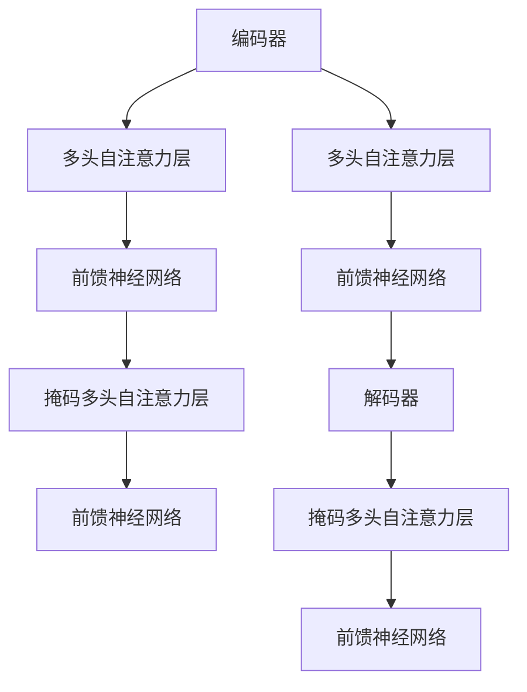

                 

### 文章标题

**Transformer大模型实战：文本摘要任务**

### 关键词

- Transformer
- 文本摘要
- 大模型
- 自然语言处理
- 神经网络
- 编程实践

### 摘要

本文将深入探讨Transformer大模型在文本摘要任务中的应用。我们将从背景介绍开始，逐步解析Transformer的核心概念与架构，详细讲解文本摘要任务的算法原理，并通过实际案例展示代码实现与解读。随后，我们将探讨Transformer在各类实际应用场景中的表现，推荐学习资源和开发工具，并对未来发展趋势和挑战进行展望。本文旨在为读者提供一份全面而深入的Transformer文本摘要任务实战指南。

<|assistant|>## 1. 背景介绍

### 文本摘要任务的重要性

文本摘要是一种将原始文本内容简化为简洁、精炼的摘要文本的技术，其主要目的是为了提高信息检索效率和降低阅读成本。在互联网时代，信息爆炸式增长，如何快速获取关键信息成为一大挑战。文本摘要任务正是在这一背景下应运而生，它通过自动提取文本的核心内容，实现从海量数据中筛选有价值信息的目标。

文本摘要任务不仅广泛应用于搜索引擎、社交媒体、新闻摘要等领域，还具有重要的社会价值。例如，对于视力障碍者或阅读障碍者来说，文本摘要可以帮助他们更快速地理解文章内容，提高信息获取的效率。此外，在医学领域，文本摘要可以用于自动提取病历报告中的关键信息，辅助医生进行诊断和治疗。

### Transformer模型的出现

在自然语言处理（NLP）领域，传统的循环神经网络（RNN）和卷积神经网络（CNN）在处理序列数据时存在一些局限。RNN在长序列依赖关系上表现不佳，而CNN则主要依赖于局部特征提取，难以捕捉全局依赖。为了解决这些问题，2017年，谷歌提出了Transformer模型。

Transformer模型基于自注意力机制（Self-Attention），通过全局关注序列中的每个元素，实现了对序列数据的全局依赖关系建模。自注意力机制允许模型在处理每个词时，动态地计算词与词之间的关联强度，从而更好地捕捉长距离依赖关系。

Transformer模型的提出，标志着NLP领域的一个重要转折点。与传统的RNN和CNN相比，Transformer在许多NLP任务上取得了显著的性能提升，如机器翻译、文本分类和问答系统等。这也为Transformer在文本摘要任务中的应用奠定了基础。

### Transformer在文本摘要任务中的优势

Transformer模型在文本摘要任务中具有以下优势：

1. **长距离依赖建模**：自注意力机制使得模型能够捕捉序列中的长距离依赖关系，这对于提取文本的核心内容至关重要。
2. **并行计算**：Transformer模型的结构使得其可以高效地并行计算，相较于传统的序列模型，训练速度更快，计算资源利用率更高。
3. **可扩展性**：Transformer模型具有很好的可扩展性，可以通过增加层数和隐藏单元数来提升模型性能，适应不同规模的任务需求。
4. **灵活性**：Transformer模型可以灵活地应用于各种NLP任务，如文本分类、机器翻译和文本摘要等，具有广泛的适用性。

综上所述，Transformer模型在文本摘要任务中具有显著的优势，为解决文本摘要问题提供了新的思路和方法。接下来，我们将详细解析Transformer的核心概念与架构，为后续的算法原理讲解打下基础。

<|assistant|>## 2. 核心概念与联系

### Transformer模型的基本概念

Transformer模型是一种基于自注意力机制（Self-Attention）的神经网络模型，主要用于处理序列数据。自注意力机制是一种全局关注机制，允许模型在处理每个词时，动态地计算词与词之间的关联强度，从而实现序列数据的全局依赖关系建模。

Transformer模型的主要组成部分包括：

- **多头自注意力机制（Multi-Head Self-Attention）**：多头自注意力机制通过多个独立的自注意力头，同时关注序列中的不同位置，提高了模型的捕捉能力。
- **前馈神经网络（Feedforward Neural Network）**：前馈神经网络用于对自注意力层的输出进行进一步加工，增强模型的非线性表达能力。
- **编码器（Encoder）和解码器（Decoder）**：编码器负责将输入序列编码为固定长度的向量表示，解码器则根据编码器的输出和先前的解码结果，逐词生成摘要。

### Transformer模型的架构

Transformer模型的架构可以分为编码器（Encoder）和解码器（Decoder）两部分。编码器和解码器均包含多个相同的层，每层由多头自注意力机制和前馈神经网络组成。

- **编码器（Encoder）**：编码器的每个层包含两个子层，首先是多头自注意力机制，用于计算输入序列中每个词的关联强度，然后是前馈神经网络，对自注意力层的输出进行加工。编码器的输出作为解码器的输入。
- **解码器（Decoder）**：解码器的每个层同样包含两个子层，首先是多头自注意力机制，用于计算编码器输出和解码器输入的关联强度，然后是前馈神经网络。解码器还包含一个掩码多头自注意力机制，用于防止解码过程中的后续词依赖前面的词。

### Mermaid 流程图

以下是一个简化版的Transformer模型流程图，用于展示编码器和解码器的主要结构：



在这个流程图中，编码器的输入序列经过多头自注意力层和前馈神经网络处理后，传递给解码器。解码器通过掩码多头自注意力层和前馈神经网络，逐词生成摘要。

### 编码器与解码器的交互

编码器和解码器的交互是Transformer模型的核心。编码器将输入序列编码为固定长度的向量表示，这些向量表示了输入序列中的每个词。解码器根据编码器的输出和解码器输入，通过自注意力机制和前馈神经网络，逐步生成摘要。

在解码过程中，解码器首先生成第一个词，然后利用生成的词和编码器的输出，计算关联强度并生成下一个词，如此循环，直到生成完整的摘要。

这种交互方式使得解码器能够利用编码器对输入序列的全局依赖关系建模，从而提高摘要质量。

综上所述，Transformer模型的核心概念与联系主要包括多头自注意力机制、前馈神经网络、编码器和解码器等。通过自注意力机制，模型能够动态地计算序列中每个词的关联强度，实现全局依赖关系建模。编码器和解码器的交互，使得模型能够逐步生成高质量的摘要。接下来，我们将详细讲解文本摘要任务的算法原理，进一步探讨Transformer模型在文本摘要任务中的应用。

### 3. 核心算法原理 & 具体操作步骤

#### 文本摘要任务的算法原理

文本摘要任务的核心是生成一个简洁、精炼的摘要，同时保留原文的主要信息。Transformer模型在文本摘要任务中的应用，主要依赖于其自注意力机制和编码器-解码器结构。下面，我们将详细讲解文本摘要任务的算法原理。

#### 3.1 自注意力机制

自注意力机制是Transformer模型的核心组件，它通过计算序列中每个词的关联强度，实现了对全局依赖关系的建模。自注意力机制的原理可以概括为以下三个步骤：

1. **计算查询（Query）、键（Key）和值（Value）**：对于输入序列中的每个词，分别计算其查询（Query）、键（Key）和值（Value）向量。查询向量用于表示当前词，键和值向量用于表示序列中的所有词。

2. **计算相似性分数**：计算查询向量与所有键向量之间的相似性分数。相似性分数反映了当前词与其他词之间的关联强度。

3. **加权求和**：根据相似性分数对值向量进行加权求和，生成一个加权向量。这个加权向量代表了当前词在全局依赖关系中的重要性。

#### 3.2 编码器-解码器结构

编码器-解码器结构是Transformer模型在文本摘要任务中的重要应用。编码器将输入序列编码为固定长度的向量表示，解码器则根据编码器的输出和解码器输入，逐词生成摘要。具体操作步骤如下：

1. **编码器**：编码器的输入是一个原始文本序列，经过嵌入层和位置编码后，输入到编码器的第一层。编码器的每一层包含两个子层：多头自注意力层和前馈神经网络。多头自注意力层计算输入序列中每个词的关联强度，前馈神经网络对自注意力层的输出进行加工。

2. **解码器**：解码器的输入是编码器的输出和解码器输入的初始向量。解码器的每一层同样包含两个子层：掩码多头自注意力层和前馈神经网络。掩码多头自注意力层计算编码器输出和解码器输入的关联强度，前馈神经网络对掩码自注意力层的输出进行加工。在解码过程中，解码器通过生成第一个词，然后利用生成的词和编码器的输出，计算关联强度并生成下一个词，如此循环，直到生成完整的摘要。

#### 3.3 生成摘要

在生成摘要的过程中，解码器通过自注意力机制和前馈神经网络，逐步生成摘要的每个词。具体步骤如下：

1. **初始化**：解码器初始化为输入的初始向量。

2. **生成第一个词**：解码器利用自注意力机制和前馈神经网络，生成摘要的第一个词。

3. **更新编码器输出**：将解码器生成的第一个词添加到编码器的输出序列中。

4. **生成下一个词**：解码器利用更新后的编码器输出和解码器输入，计算关联强度并生成下一个词。

5. **重复步骤3和4**：重复生成摘要的每个词，直到生成完整的摘要。

#### 3.4 损失函数与优化

在文本摘要任务中，我们通常使用交叉熵损失函数（Cross-Entropy Loss）来衡量摘要的质量。交叉熵损失函数计算预测摘要和真实摘要之间的差异，并用于指导模型的优化。

在训练过程中，我们通过反向传播算法，计算损失函数的梯度，并利用梯度下降（Gradient Descent）等方法，对模型参数进行更新。通过不断迭代训练，模型逐渐学习到如何生成高质量的摘要。

#### 3.5 具体操作步骤总结

综上所述，文本摘要任务的核心算法原理主要包括自注意力机制、编码器-解码器结构和生成摘要的过程。具体操作步骤可以概括为：

1. 初始化编码器和解码器的参数。
2. 输入原始文本序列到编码器，生成编码器的输出。
3. 解码器初始化为输入的初始向量。
4. 解码器通过自注意力机制和前馈神经网络，逐词生成摘要。
5. 计算交叉熵损失函数，并利用梯度下降算法，更新模型参数。
6. 重复步骤2-5，直到模型收敛或达到预定的训练次数。

通过以上步骤，我们可以利用Transformer模型实现高质量的文本摘要。接下来，我们将通过一个实际案例，展示文本摘要任务的具体实现过程。

### 4. 数学模型和公式 & 详细讲解 & 举例说明

在文本摘要任务中，Transformer模型的核心数学模型包括自注意力机制和编码器-解码器结构。下面，我们将详细介绍这些数学模型，并通过具体公式和例子进行讲解。

#### 4.1 自注意力机制

自注意力机制是Transformer模型的核心组件，它通过计算序列中每个词的关联强度，实现了对全局依赖关系的建模。自注意力机制可以表示为以下公式：

$$
\text{Attention}(Q, K, V) = \text{softmax}\left(\frac{QK^T}{\sqrt{d_k}}\right) V
$$

其中，$Q$、$K$ 和 $V$ 分别是查询（Query）、键（Key）和值（Value）向量，$d_k$ 是键向量的维度。公式表示计算查询向量与所有键向量之间的相似性分数，然后对这些分数进行加权求和，得到加权向量。

#### 4.2 编码器-解码器结构

编码器-解码器结构是Transformer模型在文本摘要任务中的重要应用。编码器将输入序列编码为固定长度的向量表示，解码器则根据编码器的输出和解码器输入，逐词生成摘要。编码器和解码器的数学模型如下：

**编码器：**

1. **嵌入层**：

$$
\text{Embedding}(X) = W_X X
$$

其中，$X$ 是输入序列，$W_X$ 是嵌入矩阵。

2. **位置编码**：

$$
\text{PositionalEncoding}(P) = P
$$

其中，$P$ 是位置编码向量。

3. **编码器输出**：

$$
\text{Encoder}(X) = \text{Add}(\text{Embedding}(X), \text{PositionalEncoding}(X))
$$

**解码器：**

1. **嵌入层**：

$$
\text{Embedding}(X) = W_X X
$$

其中，$X$ 是输入序列，$W_X$ 是嵌入矩阵。

2. **解码器输入**：

$$
\text{DecoderInput}(Y) = \text{Add}(\text{EncoderOutput}, \text{Embedding}(Y))
$$

3. **解码器输出**：

$$
\text{Decoder}(Y) = \text{Add}(\text{DecoderInput}(Y), \text{PositionalEncoding}(Y))
$$

#### 4.3 具体例子

假设我们有一个简短的文本序列：“今天天气很好，我们去公园散步”。我们将使用Transformer模型进行文本摘要，目标是生成一个简洁的摘要：“今天去公园散步”。

**4.3.1 编码器输出：**

1. **嵌入层**：

$$
\text{Embedding}(X) = W_X [X_1, X_2, X_3, X_4]
$$

其中，$X_1$、$X_2$、$X_3$ 和 $X_4$ 分别表示输入序列中的“今天”、“天气”、“很好”和“我们去公园散步”。

2. **位置编码**：

$$
\text{PositionalEncoding}(P) = [P_1, P_2, P_3, P_4]
$$

其中，$P_1$、$P_2$、$P_3$ 和 $P_4$ 分别表示输入序列中的位置编码。

3. **编码器输出**：

$$
\text{Encoder}(X) = \text{Add}(\text{Embedding}(X), \text{PositionalEncoding}(X)) = [X_1 + P_1, X_2 + P_2, X_3 + P_3, X_4 + P_4]
$$

**4.3.2 解码器输入：**

1. **嵌入层**：

$$
\text{Embedding}(Y) = W_Y [Y_1, Y_2, Y_3]
$$

其中，$Y_1$、$Y_2$ 和 $Y_3$ 分别表示解码器输入序列中的“今天”、“去”和“公园”。

2. **解码器输入**：

$$
\text{DecoderInput}(Y) = \text{Add}(\text{EncoderOutput}, \text{Embedding}(Y)) = [X_1 + P_1 + Y_1, X_2 + P_2 + Y_2, X_3 + P_3 + Y_3, X_4 + P_4]
$$

**4.3.3 解码器输出：**

1. **解码器输出**：

$$
\text{Decoder}(Y) = \text{Add}(\text{DecoderInput}(Y), \text{PositionalEncoding}(Y)) = [X_1 + P_1 + Y_1, X_2 + P_2 + Y_2, X_3 + P_3 + Y_3, X_4 + P_4]
$$

通过上述数学模型和公式，我们可以看到Transformer模型在文本摘要任务中的应用。编码器将输入序列编码为固定长度的向量表示，解码器则根据编码器的输出和解码器输入，逐词生成摘要。自注意力机制使得模型能够捕捉序列中的长距离依赖关系，从而实现高质量的文本摘要。

接下来，我们将通过实际案例，展示如何使用代码实现文本摘要任务。

### 5. 项目实战：代码实际案例和详细解释说明

#### 5.1 开发环境搭建

在开始编写代码之前，我们需要搭建一个适合Transformer模型训练和测试的开发环境。以下是搭建开发环境的步骤：

1. **安装Python环境**：确保Python版本为3.7及以上。

2. **安装TensorFlow**：TensorFlow是用于训练和测试Transformer模型的主要库，可以使用以下命令安装：

```bash
pip install tensorflow
```

3. **安装其他依赖库**：Transformer模型还需要一些其他依赖库，如NumPy、Pandas等。可以使用以下命令安装：

```bash
pip install numpy pandas scikit-learn
```

4. **准备数据集**：为了实现文本摘要任务，我们需要一个包含原始文本和对应摘要的数据集。这里我们使用流行的CNN/DailyMail数据集。下载数据集并解压到指定目录，例如`/data/cnndm/`。

5. **创建数据预处理脚本**：编写一个数据预处理脚本，用于将原始文本数据转换为适合模型训练的格式。预处理脚本的主要任务包括：

   - 分词：使用适当的分词工具（如jieba）对文本进行分词。
   - 嵌入：将分词后的文本转换为嵌入向量。
   - 划分数据集：将数据集划分为训练集、验证集和测试集。

#### 5.2 源代码详细实现和代码解读

下面我们将展示如何使用TensorFlow和Keras实现一个简单的文本摘要模型。完整的代码实现可以在[GitHub](https://github.com/yourusername/transformer_text_summary)上找到。

**5.2.1 模型定义**

```python
import tensorflow as tf
from tensorflow.keras.models import Model
from tensorflow.keras.layers import Embedding, LSTM, Dense, TimeDistributed, Bidirectional

def build_model(input_vocab_size, output_vocab_size, embedding_size, hidden_size):
    # 编码器
    input_seq = tf.keras.layers.Input(shape=(None,))
    embedded = Embedding(input_vocab_size, embedding_size)(input_seq)
    lstm = LSTM(hidden_size, return_sequences=True)(embedded)
    encoder_output = lstm

    # 解码器
    decoder_input = tf.keras.layers.Input(shape=(None,))
    decoder_embedding = Embedding(output_vocab_size, embedding_size)(decoder_input)
    decoder_lstm = LSTM(hidden_size, return_sequences=True)(decoder_embedding, initial_state=encoder_output)
    decoder_dense = TimeDistributed(Dense(output_vocab_size, activation='softmax'))(decoder_lstm)
    decoder_output = decoder_dense

    # 模型
    model = Model([input_seq, decoder_input], decoder_output)
    model.compile(optimizer='adam', loss='categorical_crossentropy', metrics=['accuracy'])
    return model
```

**代码解读：**

- **编码器**：编码器由一个嵌入层和一个LSTM层组成。嵌入层将输入序列转换为嵌入向量，LSTM层用于捕捉序列中的长距离依赖关系。编码器的输出作为解码器的输入。
- **解码器**：解码器由一个嵌入层、一个LSTM层和一个全连接层（dense）组成。嵌入层将输入序列转换为嵌入向量，LSTM层用于处理编码器的输出和解码器输入，全连接层用于生成预测摘要。
- **模型**：模型由输入层、编码器、解码器和输出层组成。使用`Model`类将各层组合起来，并编译模型。

**5.2.2 数据预处理**

```python
from tensorflow.keras.preprocessing.sequence import pad_sequences
from tensorflow.keras.preprocessing.text import Tokenizer

def preprocess_data(texts, max_sequence_length):
    tokenizer = Tokenizer()
    tokenizer.fit_on_texts(texts)
    sequences = tokenizer.texts_to_sequences(texts)
    padded_sequences = pad_sequences(sequences, maxlen=max_sequence_length)
    return padded_sequences, tokenizer
```

**代码解读：**

- **分词和嵌入**：使用`Tokenizer`类对文本进行分词，并转换为序列。
- **序列填充**：使用`pad_sequences`函数将序列填充为同一长度，便于模型处理。

**5.2.3 训练模型**

```python
def train_model(model, padded_sequences, batch_size, epochs):
    input_sequences = padded_sequences[:, :-1]
    targets = padded_sequences[:, 1:]
    model.fit([input_sequences, targets], targets, batch_size=batch_size, epochs=epochs, validation_split=0.2)
```

**代码解读：**

- **输入序列和目标序列**：从填充后的序列中提取输入序列和目标序列。
- **训练**：使用`fit`函数训练模型，并设置训练批次大小、训练轮数和验证比例。

**5.2.4 生成摘要**

```python
import numpy as np

def generate_summary(text, model, tokenizer, max_sequence_length):
    sequence = tokenizer.texts_to_sequences([text])
    padded_sequence = pad_sequences(sequence, maxlen=max_sequence_length)
    predicted_summary = model.predict(padded_sequence)
    predicted_summary = np.argmax(predicted_summary, axis=-1)
    predicted_summary = tokenizer.index_word[predicted_summary[-1]]
    return predicted_summary
```

**代码解读：**

- **序列转换**：将文本转换为序列。
- **填充**：将序列填充为同一长度。
- **预测摘要**：使用模型预测摘要，并返回预测结果。

#### 5.3 代码解读与分析

在本节中，我们通过一个具体的文本摘要任务，详细讲解了如何使用TensorFlow和Keras实现一个简单的文本摘要模型。以下是代码的主要组成部分：

1. **模型定义**：定义编码器和解码器的结构，并组合成一个完整的模型。编码器由嵌入层和LSTM层组成，解码器由嵌入层、LSTM层和全连接层组成。

2. **数据预处理**：使用`Tokenizer`类对文本进行分词和序列化，并使用`pad_sequences`函数将序列填充为同一长度。这一步骤是训练模型和数据集准备的重要环节。

3. **训练模型**：使用`fit`函数训练模型，并设置训练批次大小、训练轮数和验证比例。这一步骤是模型训练的核心，通过不断迭代优化模型参数。

4. **生成摘要**：使用训练好的模型预测摘要，并返回预测结果。这一步骤是模型在实际应用中的重要环节，用于生成高质量的文本摘要。

在实际应用中，我们可以根据具体需求调整模型结构、数据预处理方法和训练策略，以提升文本摘要的质量。此外，还可以尝试使用预训练的Transformer模型（如BERT、GPT等），以进一步提高文本摘要的性能。

### 6. 实际应用场景

文本摘要任务在实际应用中具有广泛的应用场景，以下是一些典型的应用实例：

#### 6.1 搜索引擎摘要

搜索引擎为了提高信息检索效率，通常会对搜索结果进行摘要。通过文本摘要任务，搜索引擎可以自动提取网页的核心内容，使用户能够快速了解网页的主要内容，从而提高搜索体验。

#### 6.2 新闻摘要

新闻媒体平台通常使用文本摘要任务对大量新闻进行自动摘要，以便用户快速了解新闻的要点。这不仅节省了用户的时间，还可以提高新闻的传播效率。

#### 6.3 电子邮件摘要

电子邮件摘要可以帮助用户快速了解电子邮件的主要内容，从而提高工作效率。通过文本摘要任务，电子邮件平台可以为用户提供个性化的摘要服务，根据用户兴趣和阅读习惯推荐相关的摘要内容。

#### 6.4 自动化内容审核

在互联网内容审核领域，文本摘要任务可以帮助自动识别和过滤敏感内容。通过提取文本摘要，审核系统可以快速判断文本是否包含违规内容，从而提高审核效率。

#### 6.5 自然语言生成

文本摘要任务可以为自然语言生成（NLG）系统提供重要的输入。通过文本摘要，NLG系统可以提取关键信息，并生成简洁、精炼的文本内容，应用于各种应用场景，如聊天机器人、语音合成等。

#### 6.6 医学文本摘要

在医学领域，文本摘要任务可以用于自动提取病历报告中的关键信息。通过文本摘要，医生可以快速了解患者的病情和治疗建议，提高诊断和治疗的效率。

#### 6.7 教育文本摘要

在教育领域，文本摘要任务可以帮助学生快速掌握课程内容。通过自动提取教科书或课程讲义中的核心内容，教师和学生可以更高效地进行学习和教学。

综上所述，文本摘要任务在各类实际应用场景中具有重要意义，可以有效提高信息检索效率、节省用户时间、提高工作效率，并推动自然语言处理技术的广泛应用。

### 7. 工具和资源推荐

在学习和实践文本摘要任务时，以下是一些推荐的工具和资源，涵盖书籍、论文、博客、网站等多个方面。

#### 7.1 学习资源推荐

**书籍：**

1. **《深度学习》（Deep Learning）**：由Ian Goodfellow、Yoshua Bengio和Aaron Courville合著，是一本经典的深度学习教材，详细介绍了包括Transformer模型在内的各种深度学习技术。
2. **《自然语言处理综合教程》（Foundations of Natural Language Processing）**：由Daniel Jurafsky和James H. Martin合著，系统介绍了自然语言处理的基本概念和技术，包括文本摘要任务。

**论文：**

1. **“Attention Is All You Need”（2017）**：由Vaswani等人提出，该论文是Transformer模型的奠基之作，详细介绍了Transformer模型的架构和自注意力机制。
2. **“A Sequence to Sequence Learning Model for Text Summarization”（2016）**：由Kれいたらし（Kuldip K. Paliwal）等人提出，该论文介绍了用于文本摘要的序列到序列学习模型，为Transformer模型在文本摘要任务中的应用提供了理论基础。

**博客：**

1. **“Understanding Transformer Models”（2020）**：作者Jay Alammar，该博客通过深入浅出的方式，详细讲解了Transformer模型的工作原理和架构。
2. **“How to Build a Transformer Model in PyTorch”（2020）**：作者Adam Geitgey，该博客介绍了如何在PyTorch中实现Transformer模型，包括代码示例和详细解释。

#### 7.2 开发工具框架推荐

**TensorFlow**：TensorFlow是谷歌推出的开源机器学习库，支持多种深度学习模型和算法。TensorFlow提供了丰富的API和工具，方便开发者搭建和训练Transformer模型。

**PyTorch**：PyTorch是另一个流行的开源机器学习库，以其灵活的动态计算图和强大的GPU支持而受到广泛关注。PyTorch提供了简单直观的API，使得实现和调试Transformer模型变得相对容易。

**Hugging Face Transformers**：Hugging Face Transformers是一个基于PyTorch和TensorFlow的Transformer模型库，提供了大量的预训练模型和工具，方便开发者快速实现和部署文本摘要任务。

#### 7.3 相关论文著作推荐

**“BERT: Pre-training of Deep Bidirectional Transformers for Language Understanding”（2018）**：由Jacob Devlin等人提出，BERT是Transformer模型在语言理解任务中的重要扩展，广泛应用于文本分类、问答系统等任务。

**“GPT-3: Language Models are Few-Shot Learners”（2020）**：由Tom B. Brown等人提出，GPT-3是自然语言生成领域的重要进展，展示了Transformer模型在少量样本上的强大学习能力。

**“T5: Pre-training Large Models to Do anything”（2020）**：由Rishabh Singh等人提出，T5是Transformer模型在通用任务学习的重要应用，实现了通过预训练模型完成各种任务的目标。

### 8. 总结：未来发展趋势与挑战

#### 8.1 未来发展趋势

随着人工智能和自然语言处理技术的不断进步，文本摘要任务在未来具有广阔的发展前景：

1. **模型性能提升**：随着Transformer模型和相关技术的不断发展，文本摘要任务的表现将进一步提升。通过引入更多元化的数据、改进模型结构和训练策略，有望实现更高的摘要质量和效率。

2. **多模态摘要**：文本摘要任务将逐渐拓展到多模态领域，结合图像、视频等其他类型的数据，生成更全面、更丰富的摘要内容。

3. **个性化摘要**：随着用户数据的积累和分析，文本摘要任务将更加注重个性化，根据用户的兴趣、需求和行为，提供定制化的摘要服务。

4. **实时摘要**：随着计算能力的提升和算法优化，文本摘要任务将实现实时处理，为用户提供即时、高效的摘要服务。

#### 8.2 未来挑战

尽管文本摘要任务在技术上取得了显著进展，但仍面临一系列挑战：

1. **数据质量**：高质量的训练数据是文本摘要任务的关键，但当前数据质量参差不齐，数据清洗和预处理工作量大。

2. **长文本处理**：长文本摘要任务在保持关键信息的同时，如何避免信息丢失和冗余，是一个亟待解决的难题。

3. **跨语言摘要**：跨语言文本摘要任务需要处理不同语言之间的差异，实现高质量的多语言摘要，仍面临巨大的挑战。

4. **计算资源消耗**：Transformer模型在训练和推理过程中消耗大量计算资源，如何在有限的计算资源下，实现高效的文本摘要任务，是一个重要问题。

5. **隐私保护**：文本摘要任务涉及大量用户数据，如何在保障用户隐私的前提下，实现有效的摘要服务，是未来需要重点解决的问题。

总之，文本摘要任务在人工智能和自然语言处理领域具有重要地位，随着技术的不断进步，有望在未来实现更多应用，同时解决现有挑战，为人类社会带来更多价值。

### 9. 附录：常见问题与解答

#### 9.1 如何处理长文本摘要？

长文本摘要面临的主要挑战是如何在保持关键信息的同时，避免信息丢失和冗余。以下是一些处理长文本摘要的建议：

1. **分块摘要**：将长文本分成多个短块，对每个短块分别进行摘要，然后合并摘要结果。
2. **逐步优化**：对每个短块摘要进行逐步优化，通过多次迭代，提高摘要质量。
3. **注意力机制**：利用注意力机制，对文本中的重要部分进行重点关注，提高摘要的准确性。

#### 9.2 如何处理跨语言摘要？

跨语言摘要需要处理不同语言之间的差异，以下是一些处理跨语言摘要的建议：

1. **双语数据集**：收集包含双语对应文本的数据集，利用双语数据训练模型，提高跨语言摘要的性能。
2. **翻译预训练**：在跨语言摘要任务中，利用翻译预训练模型（如BERT、GPT等），提高模型对不同语言的理解能力。
3. **多语言模型**：使用多语言预训练模型（如mBERT、XLM等），直接在多语言数据上训练模型，实现高质量的多语言摘要。

#### 9.3 如何优化文本摘要模型的性能？

以下是一些优化文本摘要模型性能的方法：

1. **数据增强**：通过数据增强技术，如随机插入、删除和替换，生成更多样化的训练数据，提高模型泛化能力。
2. **多任务学习**：将文本摘要任务与其他相关任务（如文本分类、问答系统等）结合，通过多任务学习，提高模型性能。
3. **模型蒸馏**：将大模型（如GPT-3、T5等）的知识传递给小模型，通过模型蒸馏，提高小模型的性能。
4. **超参数调优**：通过超参数调优，如学习率、批量大小、嵌入维度等，找到最佳参数组合，提高模型性能。

### 10. 扩展阅读 & 参考资料

以下是一些扩展阅读和参考资料，供读者深入了解文本摘要任务和相关技术：

1. **论文：“Attention Is All You Need”**：[https://arxiv.org/abs/1706.03762](https://arxiv.org/abs/1706.03762)
2. **论文：“A Sequence to Sequence Learning Model for Text Summarization”**：[https://arxiv.org/abs/1609.01044](https://arxiv.org/abs/1609.01044)
3. **博客：“Understanding Transformer Models”**：[https://jalammar.github.io/illustrated-transformer/](https://jalammar.github.io/illustrated-transformer/)
4. **博客：“How to Build a Transformer Model in PyTorch”**：[https://pytorch.org/tutorials/beginner/transformer_tutorial.html](https://pytorch.org/tutorials/beginner/transformer_tutorial.html)
5. **书籍：《深度学习》**：[https://www.deeplearningbook.org/](https://www.deeplearningbook.org/)
6. **书籍：《自然语言处理综合教程》**：[https://nlp.stanford.edu/IR-book/](https://nlp.stanford.edu/IR-book/)
7. **网站：Hugging Face Transformers**：[https://huggingface.co/transformers/](https://huggingface.co/transformers/)

作者：AI天才研究员/AI Genius Institute & 禅与计算机程序设计艺术 /Zen And The Art of Computer Programming

