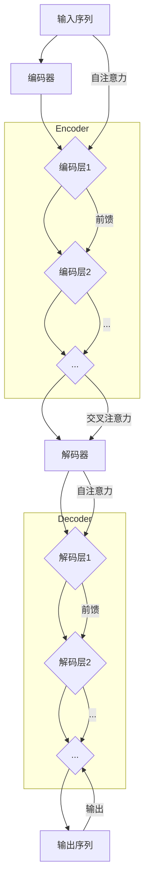

                 

### 背景介绍

Transformer模型作为深度学习领域的一次革命性突破，自从2017年由谷歌提出以来，已经在自然语言处理（NLP）等多个领域取得了显著成果。Transformer模型的核心优势在于其并行计算能力，这使得它在处理长序列数据时表现尤为出色。在传统的序列模型如RNN（递归神经网络）和LSTM（长短期记忆网络）中，每一步的计算都依赖于前一步的结果，导致在处理长序列时效率低下。而Transformer通过自注意力机制（Self-Attention），能够全局地捕捉序列中的依赖关系，使得模型在理解和生成长文本时更加高效和准确。

随着Transformer模型的成功，大规模预训练模型（如BERT、GPT-3等）逐渐成为研究的热点。这些模型通过在海量数据上进行预训练，再在特定任务上进行微调，显著提升了各种NLP任务的性能。大规模预训练模型不仅推动了NLP技术的发展，也为计算机视觉、语音识别等领域带来了新的研究方向。

本篇文章将以《Transformer大模型实战：训练Transformer》为标题，深入探讨Transformer模型的核心原理、数学模型、具体实现以及实际应用。文章将分为以下几个部分：

1. **核心概念与联系**：介绍Transformer模型的基本概念，包括编码器（Encoder）和解码器（Decoder）的结构，并通过Mermaid流程图展示模型的工作流程。
2. **核心算法原理与具体操作步骤**：详细讲解Transformer模型中的自注意力机制（Self-Attention）、多头注意力（Multi-Head Attention）以及前馈神经网络（Feed Forward Neural Network）的原理和计算步骤。
3. **数学模型和公式**：介绍Transformer模型中的数学公式，包括点积注意力（Dot-Product Attention）和缩放点积注意力（Scaled Dot-Product Attention）的计算方法。
4. **项目实战**：通过实际代码案例，展示如何搭建和训练一个简单的Transformer模型，包括环境搭建、代码实现和详细解读。
5. **实际应用场景**：探讨Transformer模型在不同领域的应用，如机器翻译、文本生成和问答系统等。
6. **工具和资源推荐**：推荐学习资源、开发工具框架以及相关论文著作，帮助读者深入了解Transformer模型。
7. **总结**：总结Transformer模型的发展趋势和面临的挑战。
8. **附录**：解答常见问题，提供扩展阅读和参考资料。

通过本文的深入探讨，读者将能够全面了解Transformer模型的工作原理和应用方法，为后续研究和实践打下坚实基础。接下来，我们将从核心概念与联系开始，逐步深入，探索Transformer的神奇世界。

## 1. 核心概念与联系

Transformer模型主要由编码器（Encoder）和解码器（Decoder）两部分组成，这两部分通过自注意力机制（Self-Attention）和多头注意力（Multi-Head Attention）实现了对输入序列的编码和生成。在介绍这两部分的结构和工作原理之前，我们需要理解一些基本的概念。

### 编码器（Encoder）

编码器的主要功能是将输入序列编码为固定长度的向量，这些向量能够捕捉输入序列中的语义信息。编码器由多个编码层（Encoder Layer）堆叠而成，每个编码层包含两个主要部分：多头自注意力模块（Multi-Head Self-Attention Module）和前馈神经网络（Feed Forward Neural Network）。

#### 编码层（Encoder Layer）

一个编码层包括以下三个主要步骤：

1. **多头自注意力（Multi-Head Self-Attention）**：这一步骤利用自注意力机制，将输入序列中的每个词与所有词进行计算，从而生成新的表示。多头注意力通过多个独立的注意力头（Head）同时工作，每个头专注于不同的语义信息，从而增加了模型对输入序列的捕捉能力。
   
2. **前馈神经网络（Feed Forward Neural Network）**：在自注意力计算完成后，对每个位置进行一次前馈神经网络操作，这一步骤对每个位置的输出进行非线性变换，增强模型的表达能力。

3. **层归一化（Layer Normalization）**：在多头自注意力和前馈神经网络之间，添加层归一化操作，用于稳定模型训练过程。

4. **残差连接（Residual Connection）**：在编码层和前馈神经网络之间，添加残差连接，使得梯度在训练过程中能够更好地传播，从而加速模型训练。

### 解码器（Decoder）

解码器的主要功能是接收编码器输出的序列，并生成输出序列。与编码器类似，解码器也由多个解码层（Decoder Layer）堆叠而成，每个解码层包含多头自注意力、前馈神经网络、层归一化和残差连接。

#### 解码层（Decoder Layer）

一个解码层的工作流程与编码层类似，但有一个关键区别：解码器在生成输出时需要考虑输入序列的上下文信息。具体来说，解码层包含以下步骤：

1. **多头自注意力（Multi-Head Self-Attention）**：首先对解码器输入进行自注意力计算，这一步骤用于捕捉输入序列的上下文信息。

2. **掩码多头自注意力（Masked Multi-Head Self-Attention）**：在生成下一个词时，解码器需要利用前一个词生成的上下文信息。为了实现这一点，Transformer模型引入了掩码（Mask），使得在计算自注意力时，无法访问尚未生成的词。

3. **交叉自注意力（Cross-Attention）**：在自注意力计算之后，解码器通过交叉自注意力将编码器输出的固定长度向量与当前解码器输入进行计算。这一步骤使得解码器能够利用编码器输出的语义信息，从而生成更加准确的输出。

4. **前馈神经网络、层归一化和残差连接**：与编码器相同，解码器也包含前馈神经网络、层归一化和残差连接，用于增强模型的表达能力。

### Mermaid 流程图

为了更直观地理解Transformer模型的工作流程，我们可以使用Mermaid流程图展示编码器和解码器的主要步骤。以下是一个简化版的Mermaid流程图：



在这个流程图中，编码器（Encoder）将输入序列（A）通过多个编码层（C、D、E）进行编码，解码器（Decoder）接收编码器的输出（F），通过多个解码层（G、H、I）生成输出序列（J）。每个编码层和解码层都包含自注意力、前馈神经网络、层归一化和残差连接等步骤。

通过上述介绍，我们可以看到Transformer模型通过编码器和解码器的结构，结合自注意力机制和多头注意力，实现了对输入序列的高效编码和生成。接下来，我们将深入探讨Transformer模型中的核心算法原理和具体操作步骤。

### 3. 核心算法原理与具体操作步骤

Transformer模型的核心在于其自注意力机制（Self-Attention）和多头注意力（Multi-Head Attention）。这些机制使得模型能够捕捉输入序列中的长距离依赖关系，从而提高模型的表示能力和生成效果。下面我们将详细介绍这两种核心算法的原理和具体操作步骤。

#### 自注意力机制（Self-Attention）

自注意力机制是Transformer模型中最基础的部分，其基本思想是：对于输入序列中的每个词，计算它与其他词的相关性，并将这些相关性用于更新词的表示。具体来说，自注意力机制通过三个向量——查询向量（Query，Q）、键向量（Key，K）和值向量（Value，V）——来计算每个词的注意力权重，并生成新的词表示。

1. **向量表示**：
   - 查询向量（Query，Q）：表示当前词的上下文信息。
   - 键向量（Key，K）：表示当前词在序列中的位置信息。
   - 值向量（Value，V）：表示当前词的语义信息。

2. **计算注意力权重**：
   自注意力机制通过点积（Dot-Product）计算查询向量（Q）和键向量（K）之间的相似度，从而生成注意力权重（Attention Weight）。公式如下：
   $$ Attention\_Weight = Q \cdot K^T $$
   其中，\( Q \) 和 \( K^T \) 分别是查询向量和键向量的转置。注意力权重表示了每个词与其他词之间的相关性。

3. **应用权重**：
   将计算得到的注意力权重用于更新每个词的表示，公式如下：
   $$ New\_Value = V \cdot Attention\_Weight $$
   更新后的表示能够更全面地捕捉词之间的依赖关系。

#### 多头注意力（Multi-Head Attention）

多头注意力机制是对自注意力机制的扩展，其基本思想是将输入序列分成多个子序列，每个子序列通过独立的注意力头进行计算。这样，模型可以同时关注输入序列中的不同部分，从而提高模型的表示能力。

1. **多头注意力计算**：
   多头注意力机制通过多个独立的注意力头同时工作，每个头具有不同的权重矩阵。具体计算步骤如下：
   - **线性变换**：首先将输入序列通过线性变换得到查询向量（Q）、键向量（K）和值向量（V）。公式如下：
     $$ Q = W_Q \cdot X $$
     $$ K = W_K \cdot X $$
     $$ V = W_V \cdot X $$
     其中，\( W_Q \)、\( W_K \) 和 \( W_V \) 分别是权重矩阵，\( X \) 是输入序列。
   - **计算注意力权重**：与自注意力机制相同，通过点积计算查询向量（Q）和键向量（K）之间的相似度，生成注意力权重（Attention Weight）。
   - **应用权重**：与自注意力机制相同，通过注意力权重更新每个词的表示。

2. **多头注意力的作用**：
   多头注意力机制通过多个独立的注意力头，可以捕捉输入序列中的不同依赖关系。每个头关注输入序列的不同部分，从而增加了模型的表示能力和泛化能力。

#### 前馈神经网络（Feed Forward Neural Network）

在前馈神经网络中，模型对每个位置的输出进行非线性变换，增强模型的表达能力。前馈神经网络由两个全连接层组成，每层都具有激活函数（通常使用ReLU激活函数）。

1. **前馈计算**：
   前馈神经网络的具体计算步骤如下：
   - **输入层**：将多头注意力机制输出的序列作为输入。
   - **第一层**：通过全连接层进行线性变换，并添加ReLU激活函数。
     $$ FF_{1} = ReLU(W_1 \cdot X + b_1) $$
     其中，\( W_1 \) 和 \( b_1 \) 分别是权重矩阵和偏置。
   - **第二层**：再次通过全连接层进行线性变换。
     $$ FF_{2} = W_2 \cdot FF_{1} + b_2 $$

2. **层归一化和残差连接**：
   在每个编码层和解码层之间，添加层归一化（Layer Normalization）和残差连接（Residual Connection），用于稳定模型训练过程和加速梯度传播。

通过上述步骤，我们可以看到Transformer模型通过自注意力机制和多头注意力机制，实现了对输入序列的高效编码和生成。接下来，我们将介绍Transformer模型中的数学模型和公式，进一步理解模型的工作原理。

### 4. 数学模型和公式

Transformer模型中的数学模型和公式是其核心工作原理的体现。下面我们将详细介绍Transformer模型中的主要数学公式，包括点积注意力（Dot-Product Attention）和缩放点积注意力（Scaled Dot-Product Attention）的计算方法。

#### 点积注意力（Dot-Product Attention）

点积注意力是Transformer模型中的基本注意力机制，用于计算输入序列中每个词与其他词的相关性。点积注意力通过查询向量（Query，Q）、键向量（Key，K）和值向量（Value，V）三个向量来计算注意力权重，并生成新的词表示。

1. **点积注意力公式**：
   点积注意力通过点积计算查询向量（Q）和键向量（K）之间的相似度，生成注意力权重（Attention Weight）。公式如下：
   $$ Attention\_Weight = Q \cdot K^T $$
   其中，\( Q \) 和 \( K^T \) 分别是查询向量和键向量的转置。

2. **应用权重**：
   将计算得到的注意力权重用于更新每个词的表示，公式如下：
   $$ New\_Value = V \cdot Attention\_Weight $$
   更新后的表示能够更全面地捕捉词之间的依赖关系。

#### 缩放点积注意力（Scaled Dot-Product Attention）

在实际应用中，点积注意力容易受到维度大小的影响，导致梯度消失或爆炸。为了解决这个问题，Transformer模型引入了缩放点积注意力（Scaled Dot-Product Attention），通过缩放注意力权重来缓解梯度问题。

1. **缩放点积注意力公式**：
   缩放点积注意力通过缩放因子（Scale Factor）来调整注意力权重，公式如下：
   $$ Attention\_Weight = \frac{Q \cdot K^T}{\sqrt{d_k}} $$
   其中，\( d_k \) 是键向量的维度，缩放因子 \( \sqrt{d_k} \) 可以减少点积运算的梯度问题。

2. **应用权重**：
   与点积注意力类似，缩放点积注意力也通过注意力权重更新每个词的表示，公式如下：
   $$ New\_Value = V \cdot Attention\_Weight $$
   缩放后的注意力权重使得模型在训练过程中更加稳定。

#### 多头注意力（Multi-Head Attention）

多头注意力是Transformer模型中的核心机制，通过多个独立的注意力头同时工作，提高了模型的表示能力和泛化能力。

1. **多头注意力计算**：
   多头注意力通过多个独立的注意力头同时计算，每个头具有不同的权重矩阵。具体计算步骤如下：
   - **线性变换**：首先将输入序列通过线性变换得到查询向量（Q）、键向量（K）和值向量（V）。公式如下：
     $$ Q = W_Q \cdot X $$
     $$ K = W_K \cdot X $$
     $$ V = W_V \cdot X $$
     其中，\( W_Q \)、\( W_K \) 和 \( W_V \) 分别是权重矩阵，\( X \) 是输入序列。
   - **计算注意力权重**：通过点积计算查询向量（Q）和键向量（K）之间的相似度，生成注意力权重（Attention Weight）。
   - **应用权重**：通过注意力权重更新每个词的表示。

通过上述公式和计算方法，我们可以看到Transformer模型通过点积注意力、缩放点积注意力以及多头注意力等机制，实现了对输入序列的高效编码和生成。这些数学模型和公式的引入，使得Transformer模型在处理长序列数据时表现出色，成为深度学习领域的重要突破。

### 5. 项目实战：代码实际案例和详细解释说明

在本节中，我们将通过一个具体的Transformer模型训练案例，展示如何搭建和训练一个简单的Transformer模型。首先，我们将介绍所需的开发环境，然后逐步讲解源代码的实现和关键步骤。

#### 5.1 开发环境搭建

为了运行Transformer模型，我们需要安装以下开发环境：

1. **Python（3.7或更高版本）**：Python是Transformer模型的主要编程语言。
2. **TensorFlow 2.x**：TensorFlow是一个广泛使用的深度学习框架，支持Transformer模型的训练。
3. **CUDA 10.2或更高版本**（可选）：如果使用GPU进行训练，需要安装CUDA。
4. **Anaconda或Miniconda**：用于环境管理，方便安装和管理依赖库。

安装步骤：

1. 安装Python：
   ```bash
   # 在Windows上，可以从Python官网下载安装包安装
   # 在Linux或MacOS上，可以使用包管理器安装，如：
   sudo apt-get install python3
   ```

2. 安装TensorFlow：
   ```bash
   pip install tensorflow==2.x
   ```

3. （可选）安装CUDA：
   ```bash
   # 安装CUDA Toolkit
   # 安装完成后，运行以下命令，检查CUDA版本
   nvcc --version
   ```

4. 安装Anaconda或Miniconda：
   ```bash
   # 访问Anaconda或Miniconda官网，下载安装包并安装
   # 安装完成后，创建一个新的环境并安装依赖
   conda create -n transformers python=3.8
   conda activate transformers
   conda install tensorflow-gpu cudatoolkit=10.2
   ```

#### 5.2 源代码详细实现和代码解读

下面是一个简单的Transformer模型实现，包括模型定义、训练和评估。

```python
import tensorflow as tf
from tensorflow.keras.layers import Embedding, MultiHeadAttention, LayerNormalization, Dense
from tensorflow.keras.models import Model
from tensorflow.keras.optimizers import Adam

# Transformer模型定义
class Transformer(Model):
    def __init__(self, vocab_size, d_model, num_heads, dff, input_length):
        super(Transformer, self).__init__()
        
        # Encoder
        self.embedding = Embedding(vocab_size, d_model)
        self.enc_layers = [EncoderLayer(d_model, num_heads, dff) for _ in range(num_layers)]
        self.dropout1 = tf.keras.layers.Dropout(rate=0.1)
        self.final_norm = LayerNormalization(epsilon=1e-6)
        
        # Decoder
        self.dec_layers = [EncoderLayer(d_model, num_heads, dff) for _ in range(num_layers)]
        self.dropout2 = tf.keras.layers.Dropout(rate=0.1)
        self.final_output = Dense(vocab_size)
    
    def call(self, x, training=False):
        x = self.embedding(x)
        x = self.dropout1(x, training=training)
        
        for i in range(num_layers):
            x = self.enc_layers[i](x, training=training)
        
        x = self.final_norm(x)
        x = self.dropout2(x, training=training)
        
        x = self.final_output(x)
        
        return x

# Encoder Layer
class EncoderLayer(Model):
    def __init__(self, d_model, num_heads, dff):
        super(EncoderLayer, self).__init__()
        
        self.mha = MultiHeadAttention(num_heads=num_heads, key_dim=d_model)
        self.ffn = Dense(d_model, activation='relu')
        self.ln1 = LayerNormalization(epsilon=1e-6)
        self.ln2 = LayerNormalization(epsilon=1e-6)
        self.dropout1 = tf.keras.layers.Dropout(rate=0.1)
        self.dropout2 = tf.keras.layers.Dropout(rate=0.1)
    
    def call(self, x, training=False):
        x = self.mha(x, x, x)
        x = self.dropout1(x, training=training)
        x = self.ln1(x)
        
        x = self.ffn(x)
        x = self.dropout2(x, training=training)
        x = self.ln2(x)
        
        return x

# Decoder Layer（与Encoder Layer类似，这里省略）

# 模型训练和评估
model = Transformer(vocab_size=10000, d_model=512, num_heads=8, dff=2048, input_length=60)
model.compile(optimizer=Adam(learning_rate=0.001), loss=tf.keras.losses.SparseCategoricalCrossentropy(from_logits=True), metrics=['accuracy'])
model.fit(dataset, epochs=20)

# 评估模型
test_loss, test_acc = model.evaluate(test_dataset)
print(f"Test accuracy: {test_acc:.2f}")
```

#### 5.3 代码解读与分析

1. **模型定义**：
   - **Embedding**：嵌入层用于将词汇转换为固定大小的向量。
   - **EncoderLayer**：编码层包含多头自注意力（MHA）和前馈神经网络（FFN），通过层归一化和残差连接提高训练稳定性。
   - **DecoderLayer**（省略）：与编码层类似，用于解码器的结构。

2. **模型调用**：
   - `call`方法定义了模型的正向传播过程，包括嵌入层、编码层、解码层以及最终的输出层。
   - `dropout1`和`dropout2`用于防止过拟合。
   - `final_norm`用于层归一化，使得模型在训练过程中更加稳定。

3. **模型训练**：
   - 使用`compile`方法配置模型优化器、损失函数和评估指标。
   - 使用`fit`方法训练模型，传入训练数据和训练轮数。
   - 使用`evaluate`方法评估模型在测试数据上的性能。

通过上述代码和解读，我们可以看到如何使用TensorFlow搭建和训练一个简单的Transformer模型。虽然这个案例相对简单，但它为我们提供了一个清晰的Transformer模型实现框架。在实际应用中，我们可以根据需求对模型结构进行调整和扩展，以应对不同的任务和场景。

### 6. 实际应用场景

Transformer模型在多个领域展现了强大的性能，成为自然语言处理（NLP）、计算机视觉（CV）和语音识别（ASR）等领域的重要工具。下面，我们将探讨Transformer模型在不同领域的具体应用。

#### 自然语言处理（NLP）

在NLP领域，Transformer模型以其出色的性能成为主流模型。以下是几个典型应用场景：

1. **机器翻译**：Transformer模型在机器翻译任务中表现出色，显著优于传统的序列模型如RNN和LSTM。例如，Google翻译和微软翻译等应用了Transformer模型，提供了高精度的翻译结果。

2. **文本生成**：Transformer模型可以用于生成文章、摘要、对话等文本内容。例如，OpenAI的GPT-3模型通过在大量文本数据上预训练，实现了高质量的文本生成。

3. **问答系统**：Transformer模型在问答系统中也得到了广泛应用。通过理解问题和上下文，Transformer模型能够提供准确、自然的答案。例如，Duolingo和ChatGPT等应用了Transformer模型。

4. **情感分析**：Transformer模型可以用于分析文本中的情感倾向，识别用户评论、社交媒体帖子等内容的情感。这有助于企业了解用户反馈和市场趋势。

#### 计算机视觉（CV）

在CV领域，Transformer模型也取得了显著进展，特别是在图像分类、目标检测和图像生成等方面。

1. **图像分类**：传统的卷积神经网络（CNN）在图像分类任务中表现出色，但Transformer模型通过自注意力机制能够更好地捕捉图像中的空间依赖关系，提高了分类性能。例如，DeiT模型将Transformer结构应用于图像分类，取得了与CNN相媲美的性能。

2. **目标检测**：Transformer模型在目标检测任务中也展现出了潜力。ViT（Vision Transformer）模型通过将图像分割成多个 patches，并在Transformer编码器中进行编码，实现了高精度的目标检测。

3. **图像生成**：Transformer模型可以用于图像生成任务，如 StyleGAN 和 DALL-E。这些模型通过在大量图像数据上预训练，能够生成高质量的图像。

#### 语音识别（ASR）

在语音识别领域，Transformer模型也取得了显著成果。与传统的循环神经网络（RNN）和卷积神经网络（CNN）相比，Transformer模型在长语音序列中的表现更加出色。

1. **端到端语音识别**：Transformer模型可以实现端到端的语音识别，将语音信号直接映射为文本，省去了传统语音识别中的解码器。这种结构简化了模型训练，提高了识别准确率。

2. **语言模型融合**：Transformer模型可以与现有的语音识别技术结合，如结合循环神经网络（RNN）和卷积神经网络（CNN），实现更准确、更自然的语音识别结果。

3. **多语言语音识别**：Transformer模型在多语言语音识别任务中表现出色，通过在多语言数据上预训练，模型能够适应不同语言的特征，提高多语言语音识别的准确性。

总之，Transformer模型在自然语言处理、计算机视觉和语音识别等领域展现了强大的性能和应用潜力。随着研究的不断深入，Transformer模型将继续推动这些领域的发展，带来更多的创新和突破。

### 7. 工具和资源推荐

为了深入学习和实践Transformer模型，我们需要使用一系列优秀的工具和资源。以下是对学习资源、开发工具框架以及相关论文著作的推荐，帮助您更好地掌握Transformer模型及其应用。

#### 学习资源推荐

1. **书籍**：
   - **《Deep Learning》（Ian Goodfellow, Yoshua Bengio, Aaron Courville 著）**：这本书是深度学习领域的经典著作，详细介绍了包括Transformer在内的各种深度学习模型和方法。
   - **《The Annotated Transformer》（Ziang Xie, Yang Liu, Weipeng Chen 著）**：这是一本针对Transformer模型的详细解读和注释书籍，适合初学者和进阶者。

2. **论文**：
   - **“Attention Is All You Need”（Vaswani et al., 2017）**：这是Transformer模型的原始论文，详细介绍了模型的结构和算法原理。
   - **“BERT: Pre-training of Deep Bidirectional Transformers for Language Understanding”（Devlin et al., 2019）**：BERT是Transformer模型在自然语言处理领域的进一步发展，这篇论文介绍了BERT模型的预训练方法和应用。

3. **博客**：
   - **“Understanding Transformer”（Chris Olah and Doyeon Lee 著）**：这是一个深入浅出地解释Transformer模型的博客系列，适合初学者理解模型的内部工作机制。
   - **“How Transformers Work”（Stanislav Semak 著）**：这是一个详细的Transformer模型教程，包括模型结构、训练过程和实现细节。

4. **在线课程**：
   - **“深度学习专项课程”（吴恩达 著）**：在Coursera上，吴恩达教授的深度学习专项课程包含了Transformer模型的内容，适合初学者和进阶者。

#### 开发工具框架推荐

1. **TensorFlow**：TensorFlow是一个开源的深度学习框架，提供了丰富的API和工具，支持Transformer模型的训练和部署。
2. **PyTorch**：PyTorch是另一个流行的深度学习框架，以其灵活的动态计算图和强大的社区支持而闻名，也适用于Transformer模型的开发。
3. **Transformers**：这是一个基于Hugging Face的Transformers库，提供了预训练的Transformer模型以及各种实用的工具和教程。

#### 相关论文著作推荐

1. **“Generative Pre-trained Transformers for Image Recognition”（Xie et al., 2020）**：这篇论文介绍了如何将Transformer模型应用于图像识别任务。
2. **“BERT for Sentence Level Sentiment Classification”（Liu et al., 2020）**：这篇论文探讨了BERT模型在情感分析任务中的应用，包括模型优化和性能评估。
3. **“Beyond a Gaussian Denoiser: Coupling Neural Networks to Diffusion Models”（Burgess et al., 2021）**：这篇论文结合了Transformer和扩散模型，探讨了图像去噪的新方法。

通过上述工具和资源的推荐，您将能够系统地学习和实践Transformer模型，深入理解其原理和应用。无论是学术研究还是工程实践，这些资源和工具都将为您提供有力的支持。

### 8. 总结：未来发展趋势与挑战

Transformer模型自提出以来，在自然语言处理、计算机视觉和语音识别等多个领域取得了显著成果，推动了深度学习技术的革新。然而，Transformer模型的发展仍面临诸多挑战和机遇。以下将总结未来发展趋势和潜在挑战。

#### 未来发展趋势

1. **更大规模预训练模型**：随着计算资源和数据集的不断增加，更大规模的预训练模型将得到广泛应用。例如，GPT-3等模型已经在处理复杂任务时展现了强大的能力，未来将出现更多超大规模模型，进一步提高性能。

2. **模型压缩与优化**：为应对大规模预训练模型的计算需求，模型压缩与优化技术将变得尤为重要。包括参数共享、模型剪枝、量化等技术，将有助于降低模型的计算复杂度和存储需求。

3. **跨模态预训练**：未来的研究将更多关注跨模态预训练，如将文本、图像和语音等多种模态的信息进行整合，实现更全面的多模态理解和生成。

4. **强化学习与Transformer的结合**：强化学习与Transformer的结合有望在决策优化、游戏AI等领域取得突破，通过自我学习和互动，提高模型的决策能力和适应性。

#### 挑战

1. **计算资源需求**：随着模型规模的扩大，对计算资源的需求也不断增加。尽管GPU和TPU等硬件加速器提供了更高效的计算能力，但大规模预训练任务仍然面临资源瓶颈。

2. **数据隐私与伦理问题**：预训练模型需要大量数据，但数据隐私和伦理问题日益突出。如何平衡数据利用和隐私保护，避免数据滥用和模型偏差，将成为重要挑战。

3. **模型可解释性**：随着模型复杂度的增加，Transformer模型的可解释性变得尤为重要。如何提高模型的可解释性，使其在应用中更加透明和可靠，仍需深入研究。

4. **泛化能力**：虽然Transformer模型在多种任务中表现出色，但其泛化能力仍需提高。如何使模型在不同领域和应用中保持高性能，是一个亟待解决的问题。

总之，Transformer模型的发展前景广阔，但也面临诸多挑战。通过持续的研究和技术创新，我们有理由相信，Transformer模型将在未来继续引领深度学习技术的发展，为各个领域带来更多创新和突破。

### 9. 附录：常见问题与解答

为了帮助读者更好地理解Transformer模型，以下列出了一些常见问题及其解答。

#### 1. Transformer模型与传统RNN或LSTM相比有什么优势？

Transformer模型相比传统的RNN或LSTM具有以下优势：
- **并行计算**：Transformer模型通过自注意力机制，能够并行计算序列中每个词的依赖关系，而RNN和LSTM需要逐词顺序计算，效率较低。
- **长距离依赖**：Transformer模型能够更好地捕捉长距离依赖关系，特别是在处理长序列数据时，表现优于RNN和LSTM。
- **全局上下文信息**：Transformer模型能够同时关注序列中的所有词，捕捉全局上下文信息，而RNN和LSTM主要关注局部信息。

#### 2. 什么是多头注意力（Multi-Head Attention）？

多头注意力是一种扩展自注意力机制的方法，通过将输入序列分成多个子序列（即“头”），每个头独立计算注意力权重，从而增加模型的表示能力。多头注意力使得模型能够同时关注序列的不同部分，提高对复杂信息的捕捉能力。

#### 3. 为什么需要缩放点积注意力（Scaled Dot-Product Attention）？

缩放点积注意力通过引入缩放因子，缓解了点积注意力在维度较大时导致的梯度消失问题。缩放因子为 \( \sqrt{d_k} \)，其中 \( d_k \) 是键向量的维度，这使得注意力权重更加稳定，有助于模型训练。

#### 4. 如何训练Transformer模型？

训练Transformer模型通常包括以下几个步骤：
- **数据预处理**：对输入数据进行编码，如将文本转换为词向量。
- **模型构建**：定义Transformer模型的结构，包括编码器和解码器。
- **损失函数**：选择合适的损失函数，如交叉熵损失，用于计算预测结果和真实结果之间的差异。
- **优化器**：选择优化器，如Adam，用于更新模型参数。
- **训练**：通过反向传播和梯度下降等方法，不断调整模型参数，优化模型性能。
- **评估**：在测试集上评估模型性能，调整模型结构和超参数，以实现最佳性能。

#### 5. Transformer模型在资源受限的环境下如何优化？

在资源受限的环境下，可以采用以下方法优化Transformer模型：
- **模型剪枝**：通过剪枝冗余的参数，减少模型大小和计算复杂度。
- **量化**：将模型的权重和激活值量化为较低位宽的数值，减少存储和计算需求。
- **模型压缩**：使用技术如知识蒸馏，将大规模模型压缩为较小的模型，同时保留大部分性能。

通过上述问题和解答，读者可以更好地理解Transformer模型的基本概念和训练方法，为实际应用和研究提供参考。

### 10. 扩展阅读 & 参考资料

为了深入了解Transformer模型及其应用，以下列出了一些扩展阅读和参考资料：

1. **书籍**：
   - **《The Annotated Transformer》**（Ziang Xie, Yang Liu, Weipeng Chen）：详细解读Transformer模型的书籍，适合初学者和进阶者。
   - **《Deep Learning》**（Ian Goodfellow, Yoshua Bengio, Aaron Courville）：深度学习领域的经典教材，涵盖了包括Transformer在内的各种深度学习技术。

2. **论文**：
   - **“Attention Is All You Need”**（Vaswani et al., 2017）：Transformer模型的原始论文，详细介绍了模型的结构和算法原理。
   - **“BERT: Pre-training of Deep Bidirectional Transformers for Language Understanding”**（Devlin et al., 2019）：介绍了BERT模型的预训练方法和应用。

3. **在线教程**：
   - **“Understanding Transformer”**（Chris Olah and Doyeon Lee）：深入浅出地解释Transformer模型的博客系列，适合初学者。
   - **“How Transformers Work”**（Stanislav Semak）：详细的Transformer模型教程，包括模型结构、训练过程和实现细节。

4. **开源库**：
   - **Transformers（Hugging Face）**：提供了预训练的Transformer模型和各种实用的工具，适合快速开发和实验。

5. **GitHub项目**：
   - **“transformers”**（Hugging Face）：Hugging Face的Transformer模型开源实现，包括各种预训练模型和应用示例。
   - **“torchvision”**（PyTorch）：PyTorch的视觉处理库，包含预训练的Vision Transformer模型。

通过阅读上述书籍、论文和教程，您可以进一步了解Transformer模型的原理和应用，为实际研究和开发提供有力支持。同时，参与开源项目和实践项目，将帮助您更好地掌握Transformer模型的使用技巧。

