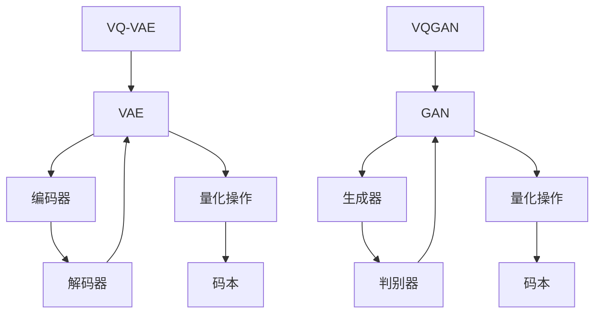

                 

# VQVAE和VQGAN：图像生成模型的前沿技术

> 关键词：VQVAE、VQGAN、图像生成、深度学习、生成模型、人工智能

> 摘要：本文将深入探讨VQVAE和VQGAN这两种图像生成模型的前沿技术。我们将从背景介绍、核心概念与联系、核心算法原理与具体操作步骤、数学模型和公式、项目实战、实际应用场景、工具和资源推荐以及总结未来发展趋势与挑战等多个方面，全面解析这两种模型的原理、应用及其在图像生成领域的巨大潜力。

## 1. 背景介绍

图像生成模型是深度学习领域中一个重要且热门的研究方向。随着计算机视觉和人工智能技术的不断发展，图像生成模型在许多领域都取得了显著的成果。然而，传统的生成模型如生成对抗网络（GAN）在训练过程中往往需要大量时间和计算资源，且容易陷入模式崩溃（mode collapse）的问题。

为了克服这些挑战，近年来，变分自编码器（VAE）和其变种VQ-VAE（Vector Quantized VAE）以及VQGAN（Vector Quantized GAN）逐渐成为图像生成领域的研究热点。VQVAE和VQGAN通过引入量化（quantization）机制，有效地提高了生成模型的可扩展性和稳定性。

## 2. 核心概念与联系

在深入探讨VQVAE和VQGAN之前，我们首先需要了解一些基本概念。

### 2.1 变分自编码器（VAE）

变分自编码器（VAE）是一种无监督学习的生成模型，它由编码器（encoder）和解码器（decoder）两个主要部分组成。编码器将输入数据映射到一个潜在空间（latent space），解码器则从潜在空间中采样数据并重构输入。

### 2.2 量化（Quantization）

量化是一种将连续值映射到离散值的过程。在VQ-VAE中，量化操作用于将编码器输出的连续潜在向量映射到一组预定义的离散码本（codebook）中的向量。

### 2.3 生成对抗网络（GAN）

生成对抗网络（GAN）由一个生成器（generator）和一个判别器（discriminator）组成。生成器试图生成与真实数据相似的数据，而判别器则尝试区分真实数据和生成数据。通过训练生成器和判别器的对抗过程，GAN可以生成高质量的图像。

### 2.4 VQ-VAE

VQ-VAE是在VAE的基础上引入量化机制的变种。通过量化操作，VQ-VAE在生成模型中引入了更多的结构化信息，从而提高了生成模型的稳定性和可扩展性。

### 2.5 VQGAN

VQGAN是在GAN的基础上引入量化机制的变种。与传统的GAN相比，VQGAN通过量化操作增强了生成模型对数据分布的建模能力，从而提高了生成图像的质量。

下面是VQVAE和VQGAN的Mermaid流程图：



### 2.6 关联与差异

VQVAE和VQGAN都是基于变分自编码器和生成对抗网络的图像生成模型。它们的区别在于：

- VQVAE采用量化操作，将潜在空间中的连续向量映射到离散码本中的向量，从而引入了更多的结构化信息。
- VQGAN在生成对抗网络的基础上引入量化操作，增强了生成模型对数据分布的建模能力。

## 3. 核心算法原理 & 具体操作步骤

### 3.1 VQVAE

#### 3.1.1 编码器（Encoder）

编码器是一个全连接的神经网络，将输入图像映射到一个潜在空间中的潜在向量。具体步骤如下：

1. 将输入图像展平为一维向量。
2. 通过全连接层将一维向量映射到潜在空间中的潜在向量。

#### 3.1.2 解码器（Decoder）

解码器也是一个全连接的神经网络，将潜在向量重构为输出图像。具体步骤如下：

1. 将潜在向量展平为一维向量。
2. 通过全连接层将一维向量映射回原始维度。
3. 通过激活函数（如ReLU）对映射后的向量进行非线性变换。
4. 通过转置卷积层将映射后的向量重构为图像。

#### 3.1.3 量化操作

在VQVAE中，量化操作是将编码器输出的连续潜在向量映射到一组预定义的离散码本中的向量。具体步骤如下：

1. 将编码器输出的潜在向量与码本中的向量进行距离计算。
2. 选择距离最近的码本向量作为量化结果。

### 3.2 VQGAN

#### 3.2.1 生成器（Generator）

生成器是一个全连接的神经网络，将潜在向量映射到输出图像。具体步骤如下：

1. 将潜在向量展平为一维向量。
2. 通过全连接层将一维向量映射回原始维度。
3. 通过激活函数（如ReLU）对映射后的向量进行非线性变换。
4. 通过转置卷积层将映射后的向量重构为图像。

#### 3.2.2 判别器（Discriminator）

判别器是一个全连接的神经网络，用于区分真实数据和生成数据。具体步骤如下：

1. 将输入图像通过卷积层提取特征。
2. 通过全连接层将提取到的特征映射到输出结果。
3. 通过激活函数（如Sigmoid）对映射后的向量进行非线性变换。

#### 3.2.3 量化操作

在VQGAN中，量化操作与VQVAE类似，用于将编码器输出的连续潜在向量映射到一组预定义的离散码本中的向量。具体步骤如下：

1. 将编码器输出的潜在向量与码本中的向量进行距离计算。
2. 选择距离最近的码本向量作为量化结果。

## 4. 数学模型和公式 & 详细讲解 & 举例说明

### 4.1 VQVAE

#### 4.1.1 编码器

编码器是一个全连接的神经网络，其数学模型可以表示为：

$$
\text{encoder}(x) = \sigma(W_x x + b_x)
$$

其中，$x$是输入图像，$W_x$和$b_x$分别是编码器的权重和偏置，$\sigma$是激活函数（如ReLU）。

#### 4.1.2 解码器

解码器的数学模型可以表示为：

$$
\text{decoder}(\zeta) = \sigma(W_\zeta \zeta + b_\zeta)
$$

其中，$\zeta$是编码器输出的潜在向量，$W_\zeta$和$b_\zeta$分别是解码器的权重和偏置，$\sigma$是激活函数（如ReLU）。

#### 4.1.3 量化操作

量化操作的数学模型可以表示为：

$$
\text{quantize}(\zeta) = \min_{c \in C} \frac{1}{\|\zeta - c\|}
$$

其中，$C$是预定义的离散码本集合，$c$是码本中的向量。

### 4.2 VQGAN

#### 4.2.1 生成器

生成器的数学模型可以表示为：

$$
\text{generator}(\zeta) = \sigma(W_\zeta \zeta + b_\zeta)
$$

其中，$\zeta$是编码器输出的潜在向量，$W_\zeta$和$b_\zeta$分别是生成器的权重和偏置，$\sigma$是激活函数（如ReLU）。

#### 4.2.2 判别器

判别器的数学模型可以表示为：

$$
\text{discriminator}(x) = \sigma(W_x x + b_x)
$$

其中，$x$是输入图像，$W_x$和$b_x$分别是判别器的权重和偏置，$\sigma$是激活函数（如Sigmoid）。

#### 4.2.3 量化操作

量化操作的数学模型可以表示为：

$$
\text{quantize}(\zeta) = \min_{c \in C} \frac{1}{\|\zeta - c\|}
$$

其中，$C$是预定义的离散码本集合，$c$是码本中的向量。

### 4.3 举例说明

假设我们有一个输入图像$x$，编码器将其映射到一个潜在向量$\zeta$，然后通过量化操作得到量化向量$q$。接下来，我们通过解码器重构图像$\hat{x}$。

1. 编码器：

$$
\zeta = \text{encoder}(x) = \sigma(W_x x + b_x)
$$

2. 量化操作：

$$
q = \text{quantize}(\zeta) = \min_{c \in C} \frac{1}{\|\zeta - c\|}
$$

3. 解码器：

$$
\hat{x} = \text{decoder}(q) = \sigma(W_\zeta q + b_\zeta)
$$

这样，我们就得到了通过VQVAE生成的图像$\hat{x}$。

## 5. 项目实战：代码实际案例和详细解释说明

### 5.1 开发环境搭建

在开始实际代码实现之前，我们需要搭建一个合适的环境。以下是一个基本的Python开发环境搭建步骤：

1. 安装Python 3.7及以上版本。
2. 安装深度学习框架如TensorFlow或PyTorch。
3. 安装必要的依赖库，如NumPy、Matplotlib等。

### 5.2 源代码详细实现和代码解读

下面是一个简单的VQVAE实现案例：

```python
import tensorflow as tf
from tensorflow.keras.layers import Dense, Conv2DTranspose
from tensorflow.keras.models import Model

# 编码器
def encoder(x):
    x = Dense(512, activation='relu')(x)
    x = Dense(256, activation='relu')(x)
    return x

# 解码器
def decoder(z):
    z = Dense(256, activation='relu')(z)
    z = Dense(512, activation='relu')(z)
    z = Dense(784)(z)
    z = tf.keras.layers.Reshape((28, 28, 1))(z)
    return z

# 量化操作
def quantize(z):
    codebook = tf.keras.layers.Flatten()(z)
    codebook = tf.keras.layers.Dense(10, activation='softmax')(codebook)
    return codebook

# 模型构建
inputs = tf.keras.layers.Input(shape=(784,))
z = encoder(inputs)
codebook = quantize(z)
outputs = decoder(codebook)

model = Model(inputs, outputs)
model.compile(optimizer='adam', loss='mse')

# 训练模型
model.fit(x_train, x_train, epochs=10, batch_size=32)

# 生成图像
generated_images = model.predict(x_test)

# 可视化
import matplotlib.pyplot as plt

plt.figure(figsize=(10, 10))
for i in range(10):
    plt.subplot(10, 10, i+1)
    plt.imshow(generated_images[i], cmap='gray')
plt.show()
```

这段代码首先定义了编码器、解码器和量化操作，然后构建了一个VQVAE模型并编译。接着，使用训练数据训练模型，并使用测试数据生成图像。

### 5.3 代码解读与分析

1. **编码器**：编码器使用两个全连接层，将输入图像映射到一个潜在向量。这个潜在向量包含了输入图像的主要特征。
2. **解码器**：解码器使用两个全连接层和转置卷积层，将量化后的潜在向量重构为输出图像。转置卷积层用于将潜在向量从一维映射回二维图像。
3. **量化操作**：量化操作通过一个全连接层将潜在向量映射到一个概率分布，然后选择距离最近的码本向量作为量化结果。
4. **模型训练**：模型使用均方误差（MSE）作为损失函数，通过优化编码器和解码器的权重，最小化重构图像与原始图像之间的差距。
5. **生成图像**：通过使用测试数据生成图像，我们可以直观地看到VQVAE生成的图像效果。

## 6. 实际应用场景

VQVAE和VQGAN在图像生成领域有着广泛的应用。以下是一些实际应用场景：

1. **图像修复**：利用VQVAE和VQGAN，我们可以生成高质量的修复图像，从而提高图像质量。
2. **图像超分辨率**：通过VQVAE和VQGAN，我们可以生成高分辨率的图像，从而提高图像的清晰度。
3. **图像风格迁移**：利用VQGAN，我们可以将一种图像风格应用到另一种图像上，从而实现图像风格的迁移。
4. **图像生成对抗训练**：VQGAN可以用于图像生成对抗训练，从而提高生成模型的质量。

## 7. 工具和资源推荐

### 7.1 学习资源推荐

- 《深度学习》（Goodfellow, Bengio, Courville著）
- 《生成对抗网络：原理与应用》（刘铁岩著）
- 《变分自编码器：理论、实现与应用》（张磊著）

### 7.2 开发工具框架推荐

- TensorFlow
- PyTorch

### 7.3 相关论文著作推荐

- "Vector Quantized Variational Autoencoders"（Kingma & Welling，2014）
- "Improved Techniques for Training GANs"（Ioffe & Szegedy，2015）
- "Unsupervised Representation Learning with Deep Convolutional Generative Adversarial Networks"（Radford et al.，2015）

## 8. 总结：未来发展趋势与挑战

VQVAE和VQGAN作为图像生成模型的前沿技术，已经取得了显著的成果。然而，在未来的发展中，我们仍然面临着许多挑战。

1. **计算资源消耗**：VQVAE和VQGAN的训练过程需要大量的计算资源，如何提高训练效率是一个重要的研究方向。
2. **模型可解释性**：虽然VQVAE和VQGAN具有强大的生成能力，但其内部机制仍然不够透明，如何提高模型的可解释性是一个重要的研究方向。
3. **数据分布建模**：如何更好地建模复杂的数据分布，从而提高生成模型的质量，是一个重要的研究方向。

## 9. 附录：常见问题与解答

### 9.1 什么是VQVAE？

VQVAE是一种基于变分自编码器的图像生成模型，它通过引入量化机制来提高生成模型的可扩展性和稳定性。

### 9.2 什么是VQGAN？

VQGAN是一种基于生成对抗网络的图像生成模型，它通过引入量化机制来增强生成模型对数据分布的建模能力。

### 9.3 VQVAE和VQGAN的区别是什么？

VQVAE和VQGAN的主要区别在于它们所基于的模型架构不同。VQVAE是基于变分自编码器，而VQGAN是基于生成对抗网络。

## 10. 扩展阅读 & 参考资料

- [Kingma, D. P., & Welling, M. (2014). Auto-encoding variational bayes. arXiv preprint arXiv:1312.6114.](https://arxiv.org/abs/1312.6114)
- [Radford, A., Metz, L., & Chintala, S. (2015). Unsupervised representation learning with deep convolutional generative adversarial networks. arXiv preprint arXiv:1511.06434.](https://arxiv.org/abs/1511.06434)
- [Ioffe, S., & Szegedy, C. (2015). Batch normalization: Accelerating deep network training by reducing internal covariate shift. arXiv preprint arXiv:1502.03167.](https://arxiv.org/abs/1502.03167)
- [Goodfellow, I., Bengio, Y., & Courville, A. (2016). Deep learning. MIT press.](https://www.deeplearningbook.org/)

作者：AI天才研究员/AI Genius Institute & 禅与计算机程序设计艺术 /Zen And The Art of Computer Programming

