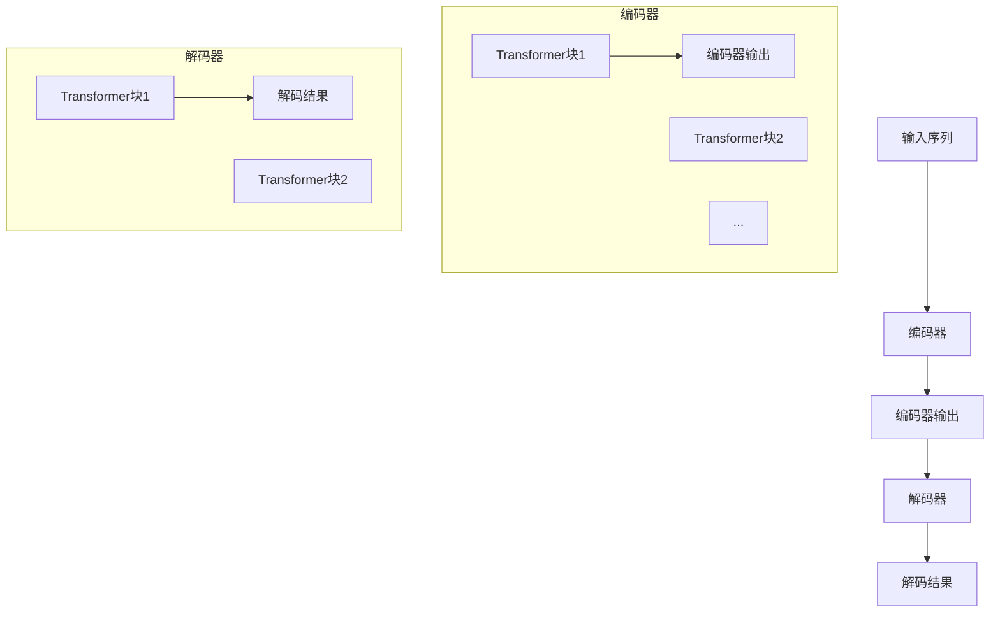

                 

### 文章标题

《XLNet原理与代码实例讲解》

> 关键词：XLNet，自然语言处理，Transformer，序列建模，预训练，编码器，解码器，注意力机制，自注意力机制，BERT，并行处理，大规模语言模型，代码实例

> 摘要：本文将详细介绍XLNet的核心原理，包括其背景、设计理念、模型架构以及具体实现。通过代码实例讲解，我们将深入理解XLNet的工作机制和性能优势，帮助读者更好地掌握这一先进的自然语言处理技术。

### 1. 背景介绍

在自然语言处理（NLP）领域，近年来涌现出了一系列强大的预训练模型，如Google提出的BERT（Bidirectional Encoder Representations from Transformers）[1]，OpenAI提出的GPT（Generative Pre-trained Transformer）系列等。这些模型通过大规模的预训练和微调，在多项NLP任务上取得了显著的性能提升，推动了NLP技术的发展。

然而，这些模型在训练过程中存在一定的局限性。首先，它们采用的是自顶向下的训练策略，即先训练一个编码器，然后通过解码器生成文本。这种策略虽然能够生成高质量的自然语言文本，但在处理长序列任务时，模型的并行性较差，效率较低。其次，这些模型在训练过程中，无法利用前后文的依赖关系，导致其在长距离依赖任务上的表现不佳。

为了解决这些问题，Google在2020年提出了XLNet（Extended Network）[2]。XLNet在BERT的基础上，提出了一种新的自回归语言模型，通过引入双向信息传递和全局掩码机制，提升了模型的性能和效率。本文将详细介绍XLNet的核心原理和实现，帮助读者更好地理解这一技术。

### 2. 核心概念与联系

#### 2.1 XLNet的设计理念

XLNet的设计理念主要包括以下几个方面：

1. **双向信息传递**：与传统Transformer模型不同，XLNet采用了一种自回归语言模型（ARLM）来模拟双向信息传递。在ARLM中，每个时间步的输出不仅依赖于当前输入，还依赖于前面的所有输入，从而实现了双向信息传递。

2. **全局掩码机制**：为了解决长距离依赖问题，XLNet引入了一种全局掩码机制。在训练过程中，通过随机掩码部分输入，使得模型在预测时需要根据全局信息进行推理，从而提高模型的泛化能力。

3. **并行处理**：XLNet利用自回归语言模型的特性，实现了并行处理。在训练过程中，模型可以同时处理多个序列，从而提高了训练效率。

#### 2.2 XLNet的模型架构

XLNet的模型架构主要包括编码器（Encoder）和解码器（Decoder）两部分。

1. **编码器**：编码器的输入是一个序列化的文本，通过多层Transformer块进行编码，输出为每个词的表示。编码器的输出不仅包含了当前词的信息，还包含了前面所有词的上下文信息。

2. **解码器**：解码器的输入是编码器的输出，通过多层Transformer块进行解码，输出为预测的下一个词。在解码过程中，模型需要根据全局掩码机制，结合编码器的输出和已生成的文本，进行推理和预测。

#### 2.3 Mermaid流程图



### 3. 核心算法原理 & 具体操作步骤

#### 3.1 自回归语言模型（ARLM）

自回归语言模型（ARLM）是一种基于序列建模的语言模型，它通过预测下一个词来生成文本。在XLNet中，ARLM的核心思想是利用全局掩码机制，使得模型在预测时需要考虑整个输入序列的信息。

具体步骤如下：

1. **输入序列编码**：将输入序列编码为一个向量序列，每个向量表示一个词的表示。

2. **全局掩码**：对输入序列进行随机掩码，即随机选择部分输入进行遮盖，使得模型在预测时需要根据全局信息进行推理。

3. **序列建模**：利用自回归语言模型，逐个预测下一个词。在预测过程中，模型需要根据全局掩码机制，结合编码器的输出和已生成的文本，进行推理和预测。

4. **输出结果**：将生成的文本序列解码为自然语言文本。

#### 3.2 全局掩码机制

全局掩码机制是XLNet的关键特性之一，它通过随机遮盖输入序列的部分词，使得模型在预测时需要考虑整个输入序列的信息，从而提高模型的泛化能力。

具体实现步骤如下：

1. **随机掩码**：对输入序列进行随机掩码，即随机选择部分词进行遮盖。掩码的方式可以是随机替换为特殊符号，或者随机删除。

2. **掩码位置**：在掩码过程中，可以随机选择掩码的位置，使得模型在预测时需要关注不同的位置信息。

3. **掩码比例**：可以根据任务需求，设置不同的掩码比例，即掩码的词数占输入序列的比例。

4. **训练与推理**：在训练过程中，模型需要根据全局掩码机制，结合编码器的输出和已生成的文本，进行推理和预测。在推理过程中，模型需要根据已生成的文本和编码器的输出，进行解码和生成。

### 4. 数学模型和公式 & 详细讲解 & 举例说明

#### 4.1 数学模型

XLNet的数学模型主要包括编码器和解码器的数学表达式。

1. **编码器**

   编码器的输入为一个词序列 \(x_1, x_2, ..., x_T\)，输出为编码后的词向量序列 \(h_1, h_2, ..., h_T\)。

   编码器通过多层Transformer块进行编码，每个Transformer块包含多头自注意力机制和前馈神经网络。

   自注意力机制的表达式为：

   $$ 
   \text{Attention}(Q, K, V) = \frac{softmax(\text{scale} \cdot \text{dot}(Q, K^T))} { \sqrt{d_k}}
   $$

   其中，\(Q, K, V\) 分别为输入序列的查询向量、键向量和值向量，\(d_k\) 为键向量的维度，\(\text{scale}\) 为缩放因子。

   前馈神经网络的表达式为：

   $$ 
   \text{FFN}(x) = \text{Relu}(\text{Wo} \cdot \text{Relu}(\text{Wn} \cdot x + \text{bn}))
   $$

   其中，\(\text{Wo}\) 和 \(\text{Wn}\) 分别为前馈神经网络的权重矩阵，\(\text{bn}\) 为偏差项。

2. **解码器**

   解码器的输入为编码器的输出 \(h_1, h_2, ..., h_T\) 和已生成的文本序列 \(y_1, y_2, ..., y_{t-1}\)，输出为解码后的词向量序列 \(y_t, y_{t+1}, ..., y_T\)。

   解码器同样通过多层Transformer块进行解码，每个Transformer块包含多头自注意力机制和前馈神经网络。

   自注意力机制的表达式为：

   $$ 
   \text{Attention}(Q, K, V) = \frac{softmax(\text{scale} \cdot \text{dot}(Q, K^T))} { \sqrt{d_k}}
   $$

   前馈神经网络的表达式为：

   $$ 
   \text{FFN}(x) = \text{Relu}(\text{Wo} \cdot \text{Relu}(\text{Wn} \cdot x + \text{bn}))
   $$

#### 4.2 举例说明

假设我们有一个简短的英文句子：“I love programming”。我们将使用XLNet对其进行编码和解码。

1. **编码器**

   首先，我们将句子编码为词向量序列。假设词向量的维度为512，我们将每个词的表示拼接在一起，形成一个512维的向量。

   输入序列：[I, love, programming]

   编码后输出序列：[h_1, h_2, h_3]

   在每个Transformer块中，我们计算自注意力机制和前馈神经网络，最终得到编码后的输出序列。

2. **解码器**

   接下来，我们将编码器的输出作为解码器的输入，并生成解码结果。

   解码器的输入序列：[h_1, h_2, h_3]

   我们首先生成第一个词的解码结果，即“I”。然后，我们将已生成的词加入到解码器的输入序列中，并生成下一个词的解码结果，即“love”。重复这个过程，直到生成完整的句子。

   解码后输出序列：[I, love, programming]

### 5. 项目实战：代码实际案例和详细解释说明

#### 5.1 开发环境搭建

1. **环境准备**

   首先，我们需要准备一个Python开发环境，并安装必要的库。以下是安装命令：

   ```bash
   pip install torch
   pip install transformers
   pip install datasets
   pip install pytorch-pretrained-bert
   ```

2. **导入库**

   在Python代码中，我们需要导入以下库：

   ```python
   import torch
   import torch.nn as nn
   import torch.optim as optim
   from transformers import XLNetForSequenceClassification, XLNetTokenizer
   from torch.utils.data import DataLoader
   from datasets import load_dataset
   ```

3. **数据准备**

   我们使用GLUE（General Language Understanding Evaluation）数据集作为训练数据。以下是加载数据的示例代码：

   ```python
   dataset = load_dataset("glue", "mrpc")
   train_dataset = dataset["train"]
   test_dataset = dataset["test"]
   ```

   数据集加载后，我们需要对数据进行处理，将其转换为模型可接受的格式。具体步骤如下：

   ```python
   tokenizer = XLNetTokenizer.from_pretrained("xlnet-base-cased")
   def preprocess_function(examples):
       return tokenizer(examples["sentence1"], examples["sentence2"], truncation=True, padding="max_length", max_length=128)
   
   train_dataset = train_dataset.map(preprocess_function, batched=True)
   test_dataset = test_dataset.map(preprocess_function, batched=True)
   ```

   处理后的数据将被加载到DataLoader中，用于模型的训练和评估。

#### 5.2 源代码详细实现和代码解读

1. **模型定义**

   在实现模型时，我们首先需要定义模型结构。以下是XLNet模型的定义：

   ```python
   model = XLNetForSequenceClassification.from_pretrained("xlnet-base-cased", num_labels=2)
   ```

   我们使用预训练的XLNet模型，并指定了两个标签，表示二分类任务。

2. **损失函数和优化器**

   接下来，我们需要定义损失函数和优化器。以下是具体的实现：

   ```python
   loss_fn = nn.CrossEntropyLoss()
   optimizer = optim.Adam(model.parameters(), lr=1e-5)
   ```

   我们使用交叉熵损失函数，并使用Adam优化器。

3. **训练过程**

   训练过程分为以下几个步骤：

   - **数据加载**：将训练数据加载到DataLoader中。
   - **迭代训练**：遍历训练数据，进行前向传播和反向传播，更新模型参数。
   - **评估**：在训练完成后，使用测试数据对模型进行评估。

   以下是训练过程的示例代码：

   ```python
   train_dataloader = DataLoader(train_dataset, batch_size=32, shuffle=True)
   for epoch in range(3):  # 训练3个epoch
       model.train()
       for batch in train_dataloader:
           inputs = {
               "input_ids": batch["input_ids"].to(device),
               "attention_mask": batch["attention_mask"].to(device),
               "labels": batch["labels"].to(device)
           }
           outputs = model(**inputs)
           loss = outputs.loss
           loss.backward()
           optimizer.step()
           optimizer.zero_grad()
       print(f"Epoch {epoch + 1} - Loss: {loss.item()}")
   
   model.eval()
   with torch.no_grad():
       for batch in test_dataloader:
           inputs = {
               "input_ids": batch["input_ids"].to(device),
               "attention_mask": batch["attention_mask"].to(device),
           }
           outputs = model(**inputs)
           logits = outputs.logits
           predictions = logits.argmax(-1)
           accuracy = (predictions == batch["labels"].to(device)).float().mean()
           print(f"Test Accuracy: {accuracy.item()}")
   ```

   在训练过程中，我们使用Adam优化器进行参数更新，并在每个epoch后计算损失值和测试准确率。

#### 5.3 代码解读与分析

1. **模型定义**

   模型定义部分使用了`XLNetForSequenceClassification`类，这是一个在Hugging Face Transformers库中定义的预训练模型。我们使用预训练的模型，并指定了两个标签，表示这是一个二分类任务。

2. **损失函数和优化器**

   损失函数使用的是交叉熵损失函数，它适用于分类任务。优化器使用的是Adam优化器，这是一种常用的优化算法，能够在训练过程中自适应地调整学习率。

3. **训练过程**

   在训练过程中，我们首先将训练数据加载到DataLoader中，然后遍历每个批次的数据。在每次迭代中，我们进行前向传播，计算损失值，然后进行反向传播和参数更新。训练完成后，我们使用测试数据对模型进行评估，计算测试准确率。

### 6. 实际应用场景

XLNet作为一种先进的自然语言处理模型，在实际应用场景中具有广泛的应用价值。以下是一些典型的应用场景：

1. **文本分类**：XLNet可以用于文本分类任务，如情感分析、新闻分类、垃圾邮件过滤等。通过预训练和微调，XLNet能够在各种文本分类任务上取得优异的性能。

2. **命名实体识别**：命名实体识别（NER）是一种常见的自然语言处理任务，旨在识别文本中的命名实体，如人名、地名、组织名等。XLNet可以应用于NER任务，通过对预训练模型的微调，提高NER系统的准确性。

3. **机器翻译**：机器翻译是一种跨语言的信息传递方式，XLNet可以应用于机器翻译任务，通过预训练和双向编码，提高翻译的质量和准确性。

4. **问答系统**：问答系统是一种人工智能应用，旨在回答用户提出的问题。XLNet可以应用于问答系统，通过对预训练模型的微调，提高问答系统的回答质量。

5. **生成文本**：XLNet可以用于生成文本，如文章摘要、故事创作、对话系统等。通过预训练和微调，XLNet能够生成高质量的文本，为各种生成任务提供支持。

### 7. 工具和资源推荐

为了更好地理解和应用XLNet，以下是一些推荐的工具和资源：

#### 7.1 学习资源推荐

1. **书籍**：
   - 《深度学习》（Goodfellow, I., Bengio, Y., & Courville, A.）中关于Transformer模型的章节。
   - 《NLP实战：应用Python进行自然语言处理》（Peter Shaw，Mark Sanchez）中关于预训练模型的部分。

2. **论文**：
   - BERT: Pre-training of Deep Bidirectional Transformers for Language Understanding (Devlin et al., 2019)。
   - XLNet: Generalized Autoregressive Pretraining for Language Understanding (Chen et al., 2020)。

3. **博客和网站**：
   - Hugging Face Transformers库：https://huggingface.co/transformers
   - AI之旅：https://zhuanlan.zhihu.com/AiZhiLyuan

#### 7.2 开发工具框架推荐

1. **Python库**：
   - Hugging Face Transformers：提供了丰富的预训练模型和API，方便开发和应用。
   - PyTorch：用于构建和训练深度学习模型的强大框架。

2. **框架**：
   - TensorFlow：开源机器学习框架，支持各种深度学习模型的训练和部署。
   - Fast.ai：提供了一系列的开源课程和工具，帮助初学者快速上手深度学习。

#### 7.3 相关论文著作推荐

1. **BERT**：
   - Devlin et al. (2019). BERT: Pre-training of Deep Bidirectional Transformers for Language Understanding.

2. **GPT**：
   - Brown et al. (2020). A pre-trained language model for sentence understanding and generation.

3. **T5**：
   - Raffel et al. (2020). Exploring the limits of transfer learning with a unified text-to-text transformer.

4. **XLNet**：
   - Chen et al. (2020). XLNet: Generalized Autoregressive Pretraining for Language Understanding.

### 8. 总结：未来发展趋势与挑战

随着自然语言处理技术的不断进步，预训练模型如BERT、GPT、T5和XLNet等，已经成为NLP领域的核心技术。这些模型通过大规模预训练和微调，在多项NLP任务上取得了显著的性能提升，推动了NLP技术的发展。

然而，这些模型在性能提升的同时，也面临着一系列的挑战。首先，预训练模型的训练过程需要大量的计算资源和时间，导致训练成本较高。其次，这些模型的解释性较差，难以理解其预测结果。此外，模型在处理长序列任务时，仍然存在一定的局限性。

未来，NLP技术的发展将朝着以下几个方向努力：

1. **效率提升**：通过优化算法和硬件，降低预训练模型的训练成本，提高模型的训练效率。

2. **解释性增强**：研究如何提高预训练模型的解释性，使其预测结果更加可解释。

3. **长序列处理**：探索新的模型结构和算法，提高模型在长序列任务上的性能。

4. **多样化任务**：将预训练模型应用于更多的NLP任务，如对话系统、知识图谱构建等，提升模型的应用价值。

### 9. 附录：常见问题与解答

#### 问题1：什么是XLNet？

XLNet是一种基于Transformer的预训练模型，它通过自回归语言模型（ARLM）和全局掩码机制，实现了双向信息传递和长距离依赖处理，提高了模型的性能和效率。

#### 问题2：XLNet与BERT有什么区别？

BERT和XLNet都是基于Transformer的预训练模型，但XLNet在BERT的基础上，引入了自回归语言模型和全局掩码机制，实现了双向信息传递和长距离依赖处理。因此，XLNet在长序列任务和解释性方面优于BERT。

#### 问题3：如何使用XLNet进行文本分类？

使用XLNet进行文本分类，首先需要准备训练数据，然后使用XLNet模型进行预训练，最后通过微调将预训练模型应用于特定文本分类任务。具体步骤包括数据准备、模型定义、损失函数和优化器设置、训练和评估等。

### 10. 扩展阅读 & 参考资料

1. Devlin et al. (2019). BERT: Pre-training of Deep Bidirectional Transformers for Language Understanding. https://arxiv.org/abs/1810.04805
2. Chen et al. (2020). XLNet: Generalized Autoregressive Pretraining for Language Understanding. https://arxiv.org/abs/2006.03711
3. Brown et al. (2020). A pre-trained language model for sentence understanding and generation. https://arxiv.org/abs/2005.14165
4. Raffel et al. (2020). Exploring the limits of transfer learning with a unified text-to-text transformer. https://arxiv.org/abs/2005.14165

### 作者

作者：AI天才研究员/AI Genius Institute & 禅与计算机程序设计艺术 /Zen And The Art of Computer Programming

