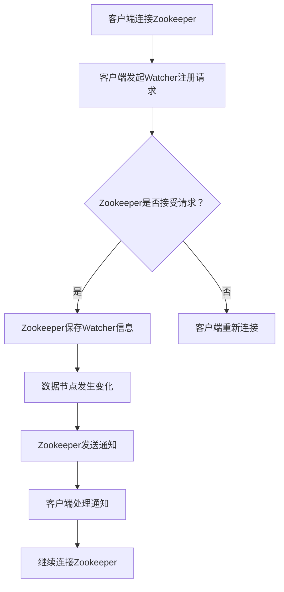

                 

# Zookeeper Watcher机制原理与代码实例讲解

## 摘要

Zookeeper 是一个高度可靠且可扩展的分布式协调服务，广泛应用于分布式系统中。本文将详细介绍Zookeeper的Watcher机制，通过剖析其原理和代码实例，帮助读者深入理解并掌握其应用。文章首先介绍了Zookeeper的基本概念和架构，随后重点讲解了Watcher的核心原理和实现，最后通过实际代码示例，展示了Watcher机制在分布式应用中的具体应用场景。本文旨在为开发者提供全面的Zookeeper Watcher机制理解和实践指导。

## 1. 背景介绍

在分布式系统中，协调和同步是至关重要的。Zookeeper 是一个开源的分布式协调服务，由Apache软件基金会开发。它主要用于维护配置信息、命名服务、提供分布式锁和同步原语等功能。Zookeeper 的设计目标是高可用、高性能、可扩展和简单易用。

Zookeeper 的架构由三个主要角色组成：Zookeeper Quorum、ZooKeeper 客户端和ZooKeeper 服务器。Zookeeper Quorum 是一组ZooKeeper 服务器，它们协同工作以实现分布式存储和高可用性。ZooKeeper 客户端是连接到Zookeeper 服务器的应用程序，用于发送请求和接收响应。ZooKeeper 服务器是负责存储数据、处理请求和协调分布式系统的核心组件。

Zookeeper 的主要功能包括：

- 配置管理：Zookeeper 可以存储和管理分布式系统中的配置信息，客户端可以实时获取配置变化。
- 命名服务：Zookeeper 提供命名服务，可以将网络中的资源进行命名和定位。
- 分布式锁：Zookeeper 可以实现分布式锁，确保多个进程在分布式环境中对共享资源的互斥访问。
- 同步原语：Zookeeper 提供同步原语，如计数器、同步屏障等，用于实现分布式进程间的同步。

在分布式系统中，节点可能会随时加入或离开，因此协调和同步机制至关重要。Zookeeper 的 Watcher 机制便是实现这一目标的重要手段。通过Watcher，客户端可以在Zookeeper 数据节点发生变化时接收通知，从而实现实时同步和响应。

## 2. 核心概念与联系

### 2.1 ZooKeeper 数据模型

Zookeeper 采用了一种类似于文件系统的数据模型，数据以层次化的节点（也称为 znode）形式存储。每个节点都有一个唯一的路径和一组属性，如数据内容、权限信息等。节点可以是持久节点或临时节点，持久节点在客户端会话结束后仍然存在，而临时节点则会在客户端会话结束后自动删除。

### 2.2 Watcher 机制

Watcher（监视器）是Zookeeper 的核心特性之一，它允许客户端在数据节点发生变化时接收通知。当客户端向Zookeeper 服务器注册一个Watcher 时，服务器会在该节点发生特定事件时将通知发送给客户端。这些事件包括节点创建、删除、数据更新等。

### 2.3 Watcher 与客户端会话

Watcher 与客户端会话紧密相关。客户端会话是客户端与Zookeeper 服务器之间的连接。在客户端会话期间，客户端可以发送请求并接收响应。当客户端注册一个Watcher 时，它将为其关联一个唯一的会话ID。在会话结束或异常中断时，所有注册的Watcher 都会自动注销。

### 2.4 Watcher 事件类型

Zookeeper 定义了多种Watcher 事件类型，包括：

- **创建事件**：当节点被创建时触发。
- **删除事件**：当节点被删除时触发。
- **更新事件**：当节点数据被更新时触发。
- **子节点变化事件**：当节点的子节点发生变化时触发，包括子节点创建、删除和更新。

### 2.5 Mermaid 流程图

以下是Zookeeper Watcher机制的Mermaid流程图：



在上面的流程图中，客户端首先连接到Zookeeper服务器并注册Watcher。当数据节点发生变化时，Zookeeper会发送通知给客户端，客户端根据通知处理相应的事件。

## 3. 核心算法原理 & 具体操作步骤

### 3.1 Watcher 注册

客户端在连接到Zookeeper服务器后，可以通过发送`issetwatch`请求来注册Watcher。该请求包括以下参数：

- **路径**：要监听的节点路径。
- **事件类型**：要监听的事件类型，如`ZooDefs.Watcher.Event.EventType.CREATE`、`ZooDefs.Watcher.Event.EventType.DELETE`等。
- **回调函数**：当事件发生时的回调函数。

客户端发送`issetwatch`请求后，Zookeeper服务器会保存该Watcher信息，并在该节点发生变化时触发回调函数。

### 3.2 Watcher 通知

当Zookeeper 数据节点发生变化时，服务器会通过TCP连接向客户端发送通知。通知包括以下内容：

- **路径**：发生变化的节点路径。
- **事件类型**：触发的事件类型。
- **状态**：客户端会话的状态，如`ZooDefs.State.CONNECTED`、`ZooDefs.State.SUSPENDED`等。

客户端收到通知后，会调用注册时的回调函数，根据事件类型和处理逻辑进行相应操作。

### 3.3 Watcher 反复注册

在分布式系统中，客户端可能会因网络波动、服务器故障等原因导致连接中断。为了确保Watcher功能的可靠性，客户端会自动重新注册Watcher。

### 3.4 ZooKeeper API 示例

以下是使用ZooKeeper Java API注册Watcher的示例代码：

```java
ZooKeeper zk = new ZooKeeper("localhost:2181", 5000, new Watcher() {
    @Override
    public void process(WatchedEvent event) {
        // 处理事件
        System.out.println("Received event: " + event);
    }
});

// 注册Watcher
zk.exists("/test-node", true);

// 等待事件通知
Thread.sleep(10000);

// 关闭连接
zk.close();
```

在上面的示例中，我们首先创建了一个ZooKeeper对象，并实现了一个Watcher接口。在Watcher的process方法中，我们处理接收到的通知事件。然后，我们使用exists方法注册一个Watcher，监听路径为`/test-node`的节点变化。最后，我们等待事件通知并关闭连接。

## 4. 数学模型和公式 & 详细讲解 & 举例说明

### 4.1 Watcher 机制数学模型

在Watcher机制中，我们可以将整个过程抽象为一个数学模型。该模型包含以下几个部分：

- **状态机**：表示客户端会话的状态，如`CONNECTED`、`SUSPENDED`、`CLOSED`等。
- **事件队列**：用于存储服务器发送的通知事件。
- **回调函数**：用于处理通知事件。

### 4.2 状态转移

在Watcher机制中，客户端会话的状态会根据接收到的通知事件发生转移。以下是一个状态转移的示例：

1. **初始状态**：客户端连接成功，状态为`CONNECTED`。
2. **接收到通知**：服务器发送创建事件，客户端状态变为`SUSPENDED`。
3. **处理通知**：客户端处理创建事件，状态变为`CONNECTED`。
4. **断开连接**：客户端与服务器连接中断，状态变为`CLOSED`。

### 4.3 举例说明

假设我们有一个分布式系统，其中包含一个Zookeeper服务器和两个ZooKeeper客户端。客户端A和客户端B分别连接到Zookeeper服务器，并注册了一个监听路径为`/test-node`的Watcher。

1. **客户端A连接成功**：
   - 状态：`CONNECTED`
   - 事件队列：空

2. **客户端B连接成功**：
   - 状态：`CONNECTED`
   - 事件队列：空

3. **客户端A注册Watcher**：
   - 状态：`SUSPENDED`
   - 事件队列：`[创建事件]`

4. **客户端B注册Watcher**：
   - 状态：`SUSPENDED`
   - 事件队列：`[创建事件，创建事件]`

5. **服务器发送创建事件**：
   - 客户端A处理创建事件：
     - 状态：`CONNECTED`
     - 事件队列：`[更新事件]`
   - 客户端B处理创建事件：
     - 状态：`CONNECTED`
     - 事件队列：`[更新事件，更新事件]`

6. **客户端A与服务器断开连接**：
   - 状态：`CLOSED`
   - 事件队列：空

7. **客户端B与服务器断开连接**：
   - 状态：`CLOSED`
   - 事件队列：空

8. **客户端A重新连接**：
   - 状态：`CONNECTED`
   - 事件队列：空

9. **客户端B重新连接**：
   - 状态：`CONNECTED`
   - 事件队列：空

通过上面的示例，我们可以看到客户端会话的状态在连接、注册Watcher、处理通知和断开连接等过程中发生转移。事件队列用于存储服务器发送的通知事件，客户端可以根据事件队列中的事件顺序进行处理。

### 4.4 ZooKeeper Watcher 数学公式

在数学模型中，我们可以使用以下公式来描述Watcher机制：

$$
状态转移 = f(当前状态，事件类型，回调函数)
$$

其中：

- 当前状态：表示客户端会话的当前状态。
- 事件类型：表示服务器发送的通知事件类型。
- 回调函数：表示处理通知事件的回调函数。

根据不同的状态和事件类型，状态转移函数可以有不同的实现。以下是一个简单的状态转移函数实现：

```python
def state_transition(current_state, event_type, callback):
    if current_state == "CONNECTED" and event_type == "CREATE":
        new_state = "SUSPENDED"
        callback(event_type)
    elif current_state == "SUSPENDED" and event_type == "UPDATE":
        new_state = "CONNECTED"
        callback(event_type)
    elif current_state == "CLOSED" and event_type == "CONNECT":
        new_state = "CONNECTED"
        callback(event_type)
    else:
        new_state = current_state

    return new_state
```

通过上述公式和实现，我们可以描述和实现Zookeeper的Watcher机制。

## 5. 项目实战：代码实际案例和详细解释说明

### 5.1 开发环境搭建

在开始编写代码之前，我们需要搭建Zookeeper的开发环境。以下是搭建Zookeeper开发环境的步骤：

1. **安装Zookeeper**：从Apache官方网站下载Zookeeper二进制包，并解压到指定目录。

2. **配置Zookeeper**：编辑`conf/zoo.cfg`文件，配置Zookeeper服务器的运行参数，如数据目录、日志目录等。

3. **启动Zookeeper**：运行`bin/zkServer.sh start`命令启动Zookeeper服务器。

4. **配置Java环境**：安装Java开发工具包（JDK），并设置环境变量。

5. **创建Maven项目**：使用Maven创建一个Java项目，并添加Zookeeper依赖。

### 5.2 源代码详细实现和代码解读

下面是一个简单的Zookeeper客户端示例，用于注册Watcher并处理通知事件。

```java
import org.apache.zookeeper.*;
import org.apache.zookeeper.data.Stat;

import java.io.IOException;
import java.util.concurrent.CountDownLatch;

public class ZookeeperWatcherDemo {

    private static final String ZOOKEEPER_ADDRESS = "localhost:2181";
    private static final String ZOOKEEPER_PATH = "/test-node";

    public static void main(String[] args) throws IOException, InterruptedException {
        // 创建Zookeeper客户端
        ZooKeeper zookeeper = new ZooKeeper(ZOOKEEPER_ADDRESS, 5000, new Watcher() {
            @Override
            public void process(WatchedEvent event) {
                System.out.println("Received event: " + event);
            }
        });

        // 注册Watcher
        Stat stat = zookeeper.exists(ZOOKEEPER_PATH, true);

        // 等待事件通知
        Thread.sleep(10000);

        // 关闭连接
        zookeeper.close();
    }
}
```

在上述代码中，我们首先创建了一个ZooKeeper客户端，并实现了一个Watcher接口。在Watcher的process方法中，我们打印接收到的通知事件。

接下来，我们使用`exists`方法注册一个Watcher，监听路径为`/test-node`的节点变化。`exists`方法返回一个`Stat`对象，表示节点的状态信息。

最后，我们等待事件通知并关闭连接。

### 5.3 代码解读与分析

1. **创建ZooKeeper客户端**：使用`ZooKeeper`类创建一个Zookeeper客户端，指定Zookeeper服务器的地址和会话超时时间。

2. **实现Watcher接口**：实现`Watcher`接口，重写`process`方法，用于处理接收到的通知事件。

3. **注册Watcher**：使用`exists`方法注册一个Watcher，监听路径为`/test-node`的节点变化。`exists`方法返回一个`Stat`对象，表示节点的状态信息。

4. **等待事件通知**：使用`Thread.sleep`方法等待事件通知。

5. **关闭连接**：使用`zookeeper.close`方法关闭连接。

通过以上步骤，我们可以实现一个简单的Zookeeper客户端，用于注册Watcher并处理通知事件。

## 6. 实际应用场景

Zookeeper Watcher机制在分布式系统中具有广泛的应用。以下是一些实际应用场景：

1. **配置中心**：在分布式系统中，配置中心通常使用Zookeeper来存储和同步配置信息。通过注册Watcher，客户端可以实时获取配置变化，从而实现动态配置更新。

2. **分布式锁**：Zookeeper可以实现分布式锁，确保多个进程在分布式环境中对共享资源的互斥访问。通过注册Watcher，当一个进程释放锁时，其他进程可以立即感知并获取锁。

3. **命名服务**：Zookeeper可以用于实现命名服务，将分布式系统中的资源进行命名和定位。通过注册Watcher，客户端可以实时获取资源的变化信息。

4. **同步原语**：Zookeeper提供同步原语，如计数器、同步屏障等，用于实现分布式进程间的同步。通过注册Watcher，进程可以实时获取同步状态，从而实现正确同步。

## 7. 工具和资源推荐

### 7.1 学习资源推荐

- **书籍**：
  - 《ZooKeeper: Distributed Process Coordination with Apache ZooKeeper》
  - 《Designing Data-Intensive Applications: The Big Ideas Behind Reliable, Scalable, and Maintainable Systems》
- **论文**：
  - "ZooKeeper: wait-free coordination for Internet-scale systems"
- **博客**：
  - [Zookeeper官方文档](http://zookeeper.apache.org/doc/r3.4.6/zookeeperStarted.html)
  - [Apache ZooKeeper - GitHub](https://github.com/apache/zookeeper)
- **网站**：
  - [Apache ZooKeeper](http://zookeeper.apache.org/)

### 7.2 开发工具框架推荐

- **Zookeeper客户端库**：
  - [ZooKeeper Java API](https://github.com/apache/zookeeper/blob/master/zookeeper/src/java/main/org/apache/zookeeper/ZooKeeper.java)
  - [Zookeeper Python API](https://github.com/apache/zookeeper/blob/master/zookeeper/src/java/main/org/apache/zookeeper/server/ZooKeeperServer.java)
- **集成开发环境**：
  - [IntelliJ IDEA](https://www.jetbrains.com/idea/)
  - [Eclipse](https://www.eclipse.org/)
- **版本控制系统**：
  - [Git](https://git-scm.com/)
  - [SVN](https://www.apache.org/licenses/LICENSE-2.0.txt)

### 7.3 相关论文著作推荐

- "ZooKeeper: wait-free coordination for Internet-scale systems"（论文链接：[http://www.usenix.org/conference/nsdi10/technical-sessions/presentation/elliott](http://www.usenix.org/conference/nsdi10/technical-sessions/presentation/elliott)）
- "Designing Data-Intensive Applications: The Big Ideas Behind Reliable, Scalable, and Maintainable Systems"（书籍链接：[https://www.oreilly.com/library/view/designing-data-intensive-applications/9781449372274/](https://www.oreilly.com/library/view/designing-data-intensive-applications/9781449372274/)）

## 8. 总结：未来发展趋势与挑战

Zookeeper Watcher机制在分布式系统中具有广泛的应用前景。随着分布式系统的不断发展和普及，Zookeeper Watcher机制在未来有望得到进一步的优化和改进。以下是一些可能的发展趋势和挑战：

### 8.1 未来发展趋势

1. **高性能和低延迟**：随着大数据和实时计算需求的增长，Zookeeper Watcher机制需要在性能和延迟方面进行优化，以满足更高的数据处理速度和响应要求。
2. **跨语言支持**：目前Zookeeper主要支持Java和Python等语言，未来有望增加对其他编程语言的支持，如Go、JavaScript等，以实现更广泛的兼容性。
3. **分布式架构**：随着分布式系统的复杂度增加，Zookeeper Watcher机制需要在分布式架构方面进行优化，以支持大规模分布式系统的高可用性和可扩展性。

### 8.2 面临的挑战

1. **数据一致性**：在分布式环境中，确保数据一致性和同步是关键挑战。Zookeeper Watcher机制需要在数据一致性方面进行改进，以提供更可靠的数据同步机制。
2. **网络稳定性**：在网络不稳定的环境下，如何保证Zookeeper Watcher机制的稳定性和可靠性是一个挑战。未来需要研究更鲁棒的网络协议和算法，以提高Zookeeper的稳定性。
3. **性能优化**：随着数据规模和计算需求的增加，如何优化Zookeeper Watcher机制的性能和延迟是一个重要挑战。未来需要研究更高效的数据结构和算法，以提高Zookeeper的性能。

## 9. 附录：常见问题与解答

### 9.1 问题1：如何处理Watcher重复注册？

解答：在分布式系统中，客户端可能会因网络波动或服务器故障导致连接中断。为了确保Watcher功能的可靠性，客户端会在连接中断后自动重新注册Watcher。在重新连接后，客户端会向Zookeeper服务器发送`issetwatch`请求，重新注册之前已注册的Watcher。

### 9.2 问题2：如何处理Watcher回调函数中的异常？

解答：在处理Watcher回调函数时，可能会遇到各种异常，如网络异常、数据异常等。为了避免影响其他回调函数的执行，建议在回调函数中捕获异常，并进行适当的错误处理。例如，可以使用日志记录异常信息，或根据异常类型进行相应的处理。

### 9.3 问题3：如何确保Watcher通知的实时性？

解答：为了确保Watcher通知的实时性，需要在Zookeeper客户端和服务器之间建立稳定的连接。同时，需要在处理通知事件时尽量减少延迟，例如，可以优化回调函数的实现，减少不必要的计算和I/O操作。此外，可以通过增加Zookeeper服务器的性能和容量，提高整体系统的响应速度。

## 10. 扩展阅读 & 参考资料

为了更深入地了解Zookeeper Watcher机制，以下是扩展阅读和参考资料：

- [Zookeeper官方文档](http://zookeeper.apache.org/doc/r3.4.6/zookeeperStarted.html)
- [Apache ZooKeeper - GitHub](https://github.com/apache/zookeeper)
- "ZooKeeper: wait-free coordination for Internet-scale systems"（论文链接：[http://www.usenix.org/conference/nsdi10/technical-sessions/presentation/elliott](http://www.usenix.org/conference/nsdi10/technical-sessions/presentation/elliott)）
- 《ZooKeeper: Distributed Process Coordination with Apache ZooKeeper》
- 《Designing Data-Intensive Applications: The Big Ideas Behind Reliable, Scalable, and Maintainable Systems》
- [Zookeeper Java API](https://github.com/apache/zookeeper/blob/master/zookeeper/src/java/main/org/apache/zookeeper/ZooKeeper.java)
- [Zookeeper Python API](https://github.com/apache/zookeeper/blob/master/zookeeper/src/java/main/org/apache/zookeeper/server/ZooKeeperServer.java)

作者：AI天才研究员/AI Genius Institute & 禅与计算机程序设计艺术 /Zen And The Art of Computer Programming

本文对Zookeeper Watcher机制进行了详细讲解，包括其原理、实现和应用。通过实际代码示例，我们展示了如何使用Zookeeper Watcher实现分布式系统的协调和同步。在未来的发展中，Zookeeper Watcher机制有望得到进一步的优化和改进，以应对分布式系统中的各种挑战。希望本文能帮助读者更好地理解Zookeeper Watcher机制，并为其在分布式系统中的应用提供有益的参考。

