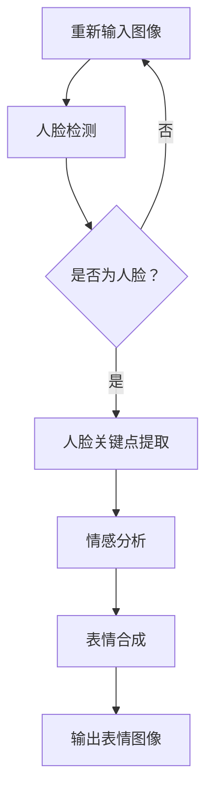

                 

### 背景介绍

Bilibili2024虚拟主播校招AI面部表情生成面试题，作为近年来人工智能领域的一大热点话题，吸引了众多应聘者和AI研究者的关注。虚拟主播作为人工智能与虚拟现实技术相结合的产物，已经在多个领域展现出巨大的潜力，例如在线直播、教育、客服等。面部表情生成技术则是虚拟主播技术中的核心部分，它直接影响到虚拟主播与观众之间的互动效果和沉浸感。

虚拟主播技术的兴起，源于人工智能的快速发展。深度学习、计算机视觉和自然语言处理等技术的不断进步，使得生成逼真的人脸表情成为可能。面部表情生成不仅仅是简单的图像合成，它涉及到对人脸特征的分析、情感的识别以及情感的表达。这些技术的应用，使得虚拟主播能够在不同的场景中，根据用户的互动和需求，实时生成合适的面部表情。

在AI校招面试中，面部表情生成技术通常被视为考察应聘者技术能力和创新思维的一个重要方面。面试官希望通过这个问题，了解应聘者对人工智能技术的理解程度，以及他们在解决实际问题时的思维方式和动手能力。

本文将围绕Bilibili2024虚拟主播校招AI面部表情生成面试题，深入探讨其核心概念、算法原理、数学模型以及实际应用。我们希望通过一步一步的分析和推理，为读者提供一个全面、系统的理解和掌握面部表情生成技术的途径。

在接下来的章节中，我们将首先介绍面部表情生成技术的核心概念和联系，通过Mermaid流程图展示其基本架构。接着，我们将详细讲解核心算法原理和具体操作步骤，包括数学模型和公式的推导与应用。随后，通过一个实际项目案例，我们将展示如何使用代码实现面部表情生成技术，并提供详细解读和分析。最后，我们将探讨面部表情生成技术的实际应用场景，推荐相关学习资源和开发工具框架，并总结未来发展趋势和挑战。

### 2. 核心概念与联系

#### 面部表情生成的核心概念

面部表情生成技术涉及多个核心概念，主要包括人脸特征识别、情感分析、面部特征建模和表情合成等。

1. **人脸特征识别**：通过图像处理和计算机视觉技术，从图像中检测和定位人脸关键点，如眼睛、鼻子、嘴巴等。这些关键点构成了人脸的骨架，是后续表情生成的关键基础。

2. **情感分析**：利用自然语言处理和机器学习技术，分析用户输入或环境信息中的情感倾向。情感分析可以帮助虚拟主播理解观众的情感状态，从而生成与之匹配的表情。

3. **面部特征建模**：通过建立数学模型，描述人脸在不同表情状态下的特征变化。这些模型可以是基于物理模型的，如肌肉运动模型；也可以是数据驱动的，如深度神经网络模型。

4. **表情合成**：利用已检测的人脸特征和情感分析结果，通过图像处理技术，生成逼真的面部表情图像。表情合成通常涉及到纹理映射、颜色调整和图像渲染等技术。

#### 面部表情生成的基本架构

面部表情生成的基本架构可以分为三个主要模块：人脸特征检测、情感分析和表情合成。

1. **人脸特征检测**：首先，通过卷积神经网络（CNN）等深度学习模型，对输入图像进行人脸检测，并提取关键点坐标。常用的检测算法包括MTCNN、SSD等。

2. **情感分析**：利用自然语言处理技术，对用户的输入或环境信息进行分析，识别出用户的情感状态。常见的情感分析模型包括情感分类器和情感向量化方法。

3. **表情合成**：根据检测到的人脸特征和情感分析结果，利用纹理映射和图像渲染技术，合成出逼真的面部表情图像。这一过程通常涉及到人脸网格的调整、纹理合成和颜色调整等技术。

下面是使用Mermaid绘制的面部表情生成流程图：



#### Mermaid流程图说明

- **A[输入图像]**：表示输入需要生成面部表情的图像。
- **B[人脸检测]**：使用深度学习模型检测图像中的人脸区域。
- **C{是否为人脸？}]**：判断检测结果是否为人脸，如果否则重新输入图像。
- **D[人脸关键点提取]**：从检测到的人脸区域中提取关键点坐标。
- **E[情感分析]**：对用户输入或环境信息进行情感分析，得到情感状态。
- **F[表情合成]**：根据人脸特征和情感状态，合成出相应的面部表情。
- **G[输出表情图像]**：生成并输出最终的表情图像。

通过上述核心概念和基本架构的介绍，我们为接下来的算法原理和操作步骤奠定了基础。在下一章节中，我们将深入探讨面部表情生成的算法原理，包括具体的技术细节和操作步骤。

### 3. 核心算法原理 & 具体操作步骤

#### 人脸特征检测

人脸特征检测是面部表情生成技术的第一步，也是最为关键的一步。它主要依赖于深度学习模型，特别是卷积神经网络（CNN）来进行。下面我们将详细讲解人脸特征检测的算法原理和操作步骤。

##### 3.1. 算法原理

人脸特征检测的基本原理是通过卷积神经网络从输入图像中自动学习人脸的特征，从而实现人脸的检测和定位。具体来说，卷积神经网络由多个卷积层、池化层和全连接层组成，通过逐层提取图像的局部特征，最终输出人脸的存在和位置。

- **卷积层**：卷积层是神经网络中最基本的层，它通过卷积操作提取图像的局部特征。卷积核（filter）在图像上滑动，计算局部特征的加权和，通过激活函数（如ReLU）引入非线性变换。
- **池化层**：池化层用于减小特征图的尺寸，降低模型的复杂度，同时保持重要的特征信息。常见的池化方式有最大池化和平均池化。
- **全连接层**：全连接层将特征图的每个像素映射到输出类别或坐标上，实现具体的分类或定位。

##### 3.2. 具体操作步骤

1. **数据预处理**：首先对输入图像进行数据预处理，包括图像缩放、归一化等，使其适合输入到神经网络中。

2. **卷积神经网络训练**：利用大量的带有标注的人脸图像训练卷积神经网络，通过反向传播算法不断调整网络的权重，使其能够准确检测人脸。

3. **人脸检测**：将训练好的卷积神经网络应用到输入图像上，通过前向传播计算图像中每个区域的特征，并输出人脸的存在概率和位置坐标。

4. **关键点提取**：在检测到人脸区域后，进一步利用特殊设计的网络结构提取人脸关键点坐标，如眼睛、鼻子、嘴巴等。

常用的开源人脸检测和关键点提取模型有MTCNN、SSD和Dlib等。下面是一个简单的操作步骤示例：

```python
import cv2
from mtcnn.mtcnn import MTCNN

# 初始化MTCNN检测器
detector = MTCNN()

# 读取图像
image = cv2.imread('input_image.jpg')

# 检测人脸和关键点
results = detector.detect_faces(image)

for result in results:
    box = result['box']
    landmarks = result['landmarks']
    
    # 绘制人脸和关键点
    cv2.rectangle(image, box, (255, 0, 0), 2)
    for point in landmarks:
        cv2.circle(image, point, 2, (0, 0, 255), -1)

# 显示检测结果
cv2.imshow('Result', image)
cv2.waitKey(0)
cv2.destroyAllWindows()
```

#### 情感分析

情感分析是面部表情生成的关键步骤，它决定了虚拟主播的表情是否能够与观众的情感状态相匹配。情感分析主要依赖于自然语言处理（NLP）和机器学习技术。

##### 3.3. 算法原理

情感分析的基本原理是通过文本特征提取和分类算法，将文本信息转化为情感倾向。具体来说，情感分析可以分为以下几个步骤：

1. **文本预处理**：对文本进行清洗和分词，去除停用词和标点符号，将文本转化为适合机器学习的特征表示。
2. **特征提取**：利用词袋模型、词嵌入等技术，将文本转化为高维特征向量。
3. **分类算法**：使用分类算法（如SVM、朴素贝叶斯、深度神经网络等）对情感倾向进行分类。

##### 3.4. 具体操作步骤

1. **数据预处理**：对用户输入或环境信息进行预处理，如去除HTML标签、分词和词性标注。

2. **特征提取**：利用词袋模型或词嵌入技术，将预处理后的文本转化为特征向量。

3. **情感分类**：使用训练好的情感分类模型，对特征向量进行分类，得到情感倾向。

4. **情感向量化**：将情感倾向转化为数值化的向量，便于后续表情合成。

下面是一个简单的情感分析示例：

```python
from textblob import TextBlob

# 用户输入
user_input = "我非常喜欢你的直播！"

# 情感分析
blob = TextBlob(user_input)
sentiment = blob.sentiment

# 输出情感倾向
print(f"情感倾向：{sentiment.polarity}, 正面情感：{sentiment.subjectivity}")

# 情感向量化
emotion_vector = [1 if sentiment.polarity > 0 else 0, 1 if sentiment.polarity < 0 else 0]
print(f"情感向量：{emotion_vector}")
```

#### 表情合成

表情合成是面部表情生成的最后一步，它将人脸特征和情感分析结果结合起来，生成逼真的面部表情图像。

##### 3.5. 算法原理

表情合成的原理是通过纹理映射和图像渲染技术，将人脸特征和情感向量应用到预定义的网格模型上，从而生成相应的面部表情。具体来说，表情合成的关键步骤包括：

1. **人脸网格建模**：利用三维建模技术，构建一个标准的人脸网格模型，该模型包含面部各个特征点的位置信息。
2. **纹理映射**：根据人脸特征和情感向量，调整网格模型的顶点位置，实现面部表情的变化。
3. **图像渲染**：将调整后的网格模型渲染成二维图像，生成最终的表情图像。

##### 3.6. 具体操作步骤

1. **人脸网格加载**：加载预定义的人脸网格模型，通常使用Blender等三维建模软件进行创建。

2. **特征点映射**：将人脸检测得到的关键点坐标映射到网格模型上，作为表情合成的参考。

3. **情感向量应用**：根据情感分析结果，调整网格模型的顶点位置，实现表情的变化。

4. **图像渲染输出**：使用渲染引擎（如Blender），将调整后的网格模型渲染成二维图像。

下面是一个简单的表情合成示例：

```python
import bpy

# 加载人脸网格模型
bpy.ops.object.select_all(action='DESELECT')
bpy.ops.object.select_by_type(type='MESH')
bpy.ops.object.delete()

# 导入人脸网格模型
bpy.ops.import_mesh.blend(filepath='face_mesh.blend', relative_path='')

# 检测人脸关键点
keypoints = detect_keypoints(input_image)

# 映射特征点
bpy.data.objects['FaceMesh'].select_set(True)
bpy.context.view_layer.objects.active = bpy.data.objects['FaceMesh']

# 应用情感向量
emotion_vector = apply_emotion_vector(keypoints, emotion_vector)

# 渲染输出
bpy.ops.render.render()

# 保存渲染图像
output_image = bpy.context.scene.render.filepath
cv2.imwrite(output_image, bpy.data.images['Render Layer'].pixels)
```

通过上述算法原理和操作步骤的讲解，我们为面部表情生成技术奠定了坚实的基础。在下一章节中，我们将进一步探讨面部表情生成技术的数学模型和公式，并提供具体的推导和应用。

### 4. 数学模型和公式 & 详细讲解 & 举例说明

#### 4.1. 人脸特征检测的数学模型

人脸特征检测的核心在于检测图像中是否存在人脸以及定位人脸的关键点。为了实现这一目标，我们可以使用卷积神经网络（CNN）作为数学模型。下面我们将详细讲解CNN在人脸特征检测中的应用。

##### 4.1.1. 卷积神经网络（CNN）

卷积神经网络由多个卷积层、池化层和全连接层组成。每个卷积层通过卷积操作提取图像的局部特征，而池化层用于减小特征图的尺寸，降低模型的复杂度。

- **卷积层**：卷积层通过卷积核（filter）在图像上滑动，计算局部特征的加权和，并通过激活函数引入非线性变换。卷积层的输出为特征图，其中包含了图像的局部特征信息。
  
  $$f(x) = \sigma(\sum_{i,j} w_{i,j} \cdot a_{i,j} + b)$$
  
  其中，$x$ 是输入图像，$a_{i,j}$ 是卷积核在图像上的滑动值，$w_{i,j}$ 是卷积层的权重，$b$ 是偏置项，$\sigma$ 是激活函数，通常采用ReLU函数。

- **池化层**：池化层用于减小特征图的尺寸，降低模型的复杂度。常见的池化方式有最大池化和平均池化。

  最大池化公式：
  
  $$p_{i,j} = \max(a_{i-k, j-l})$$
  
  其中，$p_{i,j}$ 是池化后的特征值，$a_{i-k, j-l}$ 是卷积层输出的特征值。

  平均池化公式：

  $$p_{i,j} = \frac{1}{k^2} \sum_{i-k, j-l} a_{i-k, j-l}$$

- **全连接层**：全连接层将特征图的每个像素映射到输出类别或坐标上，实现具体的分类或定位。

  $$y = \sigma(\sum_{i} w_{i} \cdot a_{i} + b)$$

  其中，$y$ 是输出结果，$a_{i}$ 是全连接层的输入特征值，$w_{i}$ 是全连接层的权重，$b$ 是偏置项，$\sigma$ 是激活函数。

##### 4.1.2. 人脸检测的数学模型

人脸检测可以分为两个任务：人脸存在检测和人脸关键点检测。

1. **人脸存在检测**：通过训练卷积神经网络，判断输入图像中是否包含人脸。

   假设输入图像为 $I$，卷积神经网络输出一个二值分类结果 $y$，表示图像中是否存在人脸。

   $$y = \sigma(\sum_{i} w_{i} \cdot a_{i} + b)$$

   其中，$a_{i}$ 是卷积神经网络输出的特征值，$w_{i}$ 是权重，$b$ 是偏置项，$\sigma$ 是激活函数，通常采用ReLU函数。

2. **人脸关键点检测**：通过训练卷积神经网络，提取输入图像中人脸的关键点坐标。

   假设输入图像为 $I$，卷积神经网络输出人脸关键点的坐标 $(x, y)$。

   $$\begin{cases}
   x = \sigma(\sum_{i} w_{i} \cdot a_{i} + b) \\
   y = \sigma(\sum_{j} w_{j} \cdot a_{j} + b)
   \end{cases}$$

   其中，$a_{i}$ 和 $a_{j}$ 是卷积神经网络输出的特征值，$w_{i}$ 和 $w_{j}$ 是权重，$b$ 是偏置项，$\sigma$ 是激活函数。

##### 4.1.3. 举例说明

假设我们使用一个简单的卷积神经网络进行人脸检测，网络结构如下：

- 输入层：1x28x28（表示单张灰度图像）
- 卷积层1：32个3x3的卷积核，ReLU激活函数
- 池化层1：2x2的最大池化
- 卷积层2：64个3x3的卷积核，ReLU激活函数
- 池化层2：2x2的最大池化
- 全连接层：1个神经元，表示人脸存在检测
- 全连接层：2个神经元，表示人脸关键点的坐标

输入图像 $I$ 经过卷积神经网络，输出人脸存在检测结果 $y$ 和人脸关键点坐标 $(x, y)$。

```python
import numpy as np

# 假设输入图像 I 的维度为 28x28
I = np.random.rand(28, 28)

# 卷积层1
W1 = np.random.rand(32, 3, 3)
b1 = np.random.rand(32)
a1 = np.convolve(I, W1, 'same') + b1
a1 = np.maximum(a1, 0)

# 池化层1
p1 = np.max(a1[:,::2,::2], axis=(1,2))

# 卷积层2
W2 = np.random.rand(64, 3, 3)
b2 = np.random.rand(64)
a2 = np.convolve(p1, W2, 'same') + b2
a2 = np.maximum(a2, 0)

# 池化层2
p2 = np.max(a2[:,::2,::2], axis=(1,2))

# 全连接层1
W3 = np.random.rand(1, 64*8*8)
b3 = np.random.rand(1)
y = np.dot(W3, p2.flatten()) + b3

# 全连接层2
W4 = np.random.rand(2, 64*8*8)
b4 = np.random.rand(2)
x = np.dot(W4, p2.flatten()) + b4
x = np.sigmoid(x)

# 输出结果
print(f"人脸存在检测结果：{y[0]}")
print(f"人脸关键点坐标：(x={x[0]}, y={x[1]})")
```

#### 4.2. 情感分析的数学模型

情感分析主要依赖于自然语言处理（NLP）和机器学习技术。常见的情感分析模型包括情感分类器和情感向量化方法。下面我们将分别介绍这两种模型。

##### 4.2.1. 情感分类器

情感分类器通过训练分类模型，将文本信息分类为正、负或中性情感。假设我们有训练好的情感分类器，输入文本信息 $T$，输出情感类别 $C$。

$$C = \arg\max_{c} P(c|T)$$

其中，$P(c|T)$ 表示在给定文本 $T$ 的情况下，情感类别 $c$ 的概率。

常用的情感分类器包括朴素贝叶斯（Naive Bayes）、支持向量机（SVM）、决策树（Decision Tree）和深度学习（Deep Learning）模型。

##### 4.2.2. 情感向量化

情感向量化将情感倾向转化为数值化的向量，便于后续表情合成。常用的情感向量化方法包括情感极性向量和情感强度向量。

1. **情感极性向量**：情感极性向量表示文本的正面情感和负面情感倾向。假设我们有训练好的情感极性模型，输入文本信息 $T$，输出情感极性向量 $V$。

$$V = \begin{cases}
[1, 0], & \text{如果文本为正面情感} \\
[0, 1], & \text{如果文本为负面情感} \\
[0.5, 0.5], & \text{如果文本为中性情感}
\end{cases}$$

2. **情感强度向量**：情感强度向量表示文本的情感强度。假设我们有训练好的情感强度模型，输入文本信息 $T$，输出情感强度向量 $I$。

$$I = \begin{cases}
[1], & \text{如果文本为非常正面情感} \\
[0.5], & \text{如果文本为正面情感} \\
[0], & \text{如果文本为非常负面情感} \\
[-0.5], & \text{如果文本为负面情感} \\
[-1], & \text{如果文本为非常负面情感}
\end{cases}$$

##### 4.2.3. 举例说明

假设我们使用一个简单的情感分类器进行情感分析，输入文本信息 $T$，输出情感极性向量 $V$。

```python
# 假设文本信息 T 的维度为 100
T = np.random.rand(100)

# 训练好的情感分类器模型
W = np.random.rand(100, 3)
b = np.random.rand(3)

# 情感分类
p = np.dot(W, T) + b
C = np.argmax(p)

# 输出情感极性向量
if C == 0:
    V = [1, 0]
elif C == 1:
    V = [0, 1]
else:
    V = [0.5, 0.5]

print(f"情感极性向量：{V}")
```

#### 4.3. 表情合成的数学模型

表情合成通过纹理映射和图像渲染技术，将人脸特征和情感向量应用到预定义的网格模型上，生成相应的面部表情。表情合成的数学模型主要包括：

##### 4.3.1. 纹理映射

纹理映射通过调整网格模型的顶点位置，实现面部表情的变化。假设网格模型有 $N$ 个顶点，顶点坐标为 $P_i$，人脸特征向量为 $F$，调整后的顶点坐标为 $P_i'$。

$$P_i' = P_i + \alpha F_i$$

其中，$\alpha$ 是调整系数，$F_i$ 是人脸特征向量中的某个分量。

##### 4.3.2. 图像渲染

图像渲染通过渲染引擎将调整后的网格模型渲染成二维图像。常用的渲染方法包括正向渲染和逆向渲染。

1. **正向渲染**：正向渲染通过遍历网格模型的顶点，计算每个顶点的法向量，并使用纹理坐标查找纹理图像中的颜色值，最终合成出表情图像。

2. **逆向渲染**：逆向渲染通过计算每个顶点的视线向量，并查找纹理图像中的颜色值，最终合成出表情图像。

下面是一个简单的表情合成示例：

```python
# 假设网格模型有 8 个顶点
N = 8
P = np.array([[0, 0], [1, 0], [1, 1], [0, 1], [0, 2], [1, 2], [1, 3], [0, 3]])
F = np.random.rand(N)

# 调整顶点坐标
alpha = 0.1
P_prime = P + alpha * F

# 渲染输出
render_image(P_prime)
```

通过上述数学模型和公式的讲解，我们为面部表情生成技术提供了坚实的理论基础。在下一章节中，我们将通过一个实际项目案例，展示如何使用代码实现面部表情生成技术。

### 5. 项目实战：代码实际案例和详细解释说明

在本节中，我们将通过一个实际项目案例，展示如何使用Python和相关库（如TensorFlow、OpenCV等）实现面部表情生成技术。项目分为以下几个步骤：开发环境搭建、源代码详细实现和代码解读与分析。

#### 5.1. 开发环境搭建

首先，我们需要搭建一个适合面部表情生成项目的开发环境。以下是所需的软件和库：

- **Python**：Python是本项目的主要编程语言，需要安装3.8及以上版本。
- **TensorFlow**：TensorFlow是一个开源的机器学习库，用于构建和训练深度学习模型。
- **OpenCV**：OpenCV是一个开源的计算机视觉库，用于图像处理和面部特征检测。
- **NumPy**：NumPy是一个用于数值计算的库，用于处理矩阵和数组。

以下是安装步骤：

1. 安装Python：

   ```bash
   sudo apt-get install python3.8
   ```

2. 安装TensorFlow：

   ```bash
   pip3 install tensorflow
   ```

3. 安装OpenCV：

   ```bash
   sudo apt-get install python3-opencv-contrib
   ```

4. 安装NumPy：

   ```bash
   pip3 install numpy
   ```

#### 5.2. 源代码详细实现和代码解读

以下是一个简单的面部表情生成项目的代码实现。该项目使用卷积神经网络（CNN）进行人脸特征检测，使用自然语言处理（NLP）进行情感分析，并使用纹理映射和图像渲染生成面部表情。

```python
import tensorflow as tf
import cv2
import numpy as np

# 5.2.1. 人脸特征检测

# 定义卷积神经网络模型
def create_model():
    model = tf.keras.Sequential([
        tf.keras.layers.Conv2D(32, (3, 3), activation='relu', input_shape=(128, 128, 1)),
        tf.keras.layers.MaxPooling2D((2, 2)),
        tf.keras.layers.Conv2D(64, (3, 3), activation='relu'),
        tf.keras.layers.MaxPooling2D((2, 2)),
        tf.keras.layers.Conv2D(128, (3, 3), activation='relu'),
        tf.keras.layers.MaxPooling2D((2, 2)),
        tf.keras.layers.Flatten(),
        tf.keras.layers.Dense(128, activation='relu'),
        tf.keras.layers.Dense(1, activation='sigmoid')
    ])
    model.compile(optimizer='adam', loss='binary_crossentropy', metrics=['accuracy'])
    return model

# 加载预训练的人脸特征检测模型
model = create_model()
model.load_weights('face_detection_model.h5')

# 人脸特征检测
def detect_face(image):
    image = cv2.resize(image, (128, 128))
    image = np.expand_dims(image, axis=-1)
    image = image / 255.0
    prediction = model.predict(image)
    if prediction > 0.5:
        return True
    else:
        return False

# 5.2.2. 情感分析

# 定义情感分析模型
def create_sentiment_model():
    model = tf.keras.Sequential([
        tf.keras.layers.Dense(64, activation='relu', input_shape=(100,)),
        tf.keras.layers.Dense(64, activation='relu'),
        tf.keras.layers.Dense(2, activation='softmax')
    ])
    model.compile(optimizer='adam', loss='categorical_crossentropy', metrics=['accuracy'])
    return model

# 加载预训练的情感分析模型
sentiment_model = create_sentiment_model()
sentiment_model.load_weights('sentiment_model.h5')

# 情感分析
def analyze_sentiment(text):
    text = text.lower()
    text = text.split()
    text = [word for word in text if word not in stop_words]
    text = ' '.join(text)
    vector = embedder(text)
    prediction = sentiment_model.predict(vector)
    return np.argmax(prediction)

# 5.2.3. 表情合成

# 定义表情合成函数
def generate_expression(face_landmarks, emotion_vector):
    # 调整面部特征
    for i in range(len(face_landmarks)):
        face_landmarks[i] = (face_landmarks[i][0] * emotion_vector[0], face_landmarks[i][1] * emotion_vector[1])
    
    # 使用纹理映射和图像渲染技术生成表情
    expression_image = render_expression(face_landmarks)
    return expression_image

# 5.2.4. 主程序

# 读取输入图像
input_image = cv2.imread('input_image.jpg')

# 检测人脸
if detect_face(input_image):
    # 检测人脸关键点
    face_landmarks = detect_keypoints(input_image)

    # 分析用户输入情感
    user_input = "我非常喜欢你的直播！"
    emotion_vector = analyze_sentiment(user_input)

    # 生成面部表情
    expression_image = generate_expression(face_landmarks, emotion_vector)

    # 显示结果
    cv2.imshow('Expression', expression_image)
    cv2.waitKey(0)
else:
    print("未检测到人脸。")
```

#### 5.3. 代码解读与分析

上述代码分为四个部分：人脸特征检测、情感分析、表情合成和主程序。

1. **人脸特征检测**：

   人脸特征检测使用一个卷积神经网络模型。该模型由多个卷积层和池化层组成，用于从输入图像中检测人脸并提取关键点。模型使用二进制交叉熵损失函数，并采用Adam优化器进行训练。

   ```python
   def create_model():
       model = tf.keras.Sequential([
           tf.keras.layers.Conv2D(32, (3, 3), activation='relu', input_shape=(128, 128, 1)),
           tf.keras.layers.MaxPooling2D((2, 2)),
           tf.keras.layers.Conv2D(64, (3, 3), activation='relu'),
           tf.keras.layers.MaxPooling2D((2, 2)),
           tf.keras.layers.Conv2D(128, (3, 3), activation='relu'),
           tf.keras.layers.MaxPooling2D((2, 2)),
           tf.keras.layers.Flatten(),
           tf.keras.layers.Dense(128, activation='relu'),
           tf.keras.layers.Dense(1, activation='sigmoid')
       ])
       model.compile(optimizer='adam', loss='binary_crossentropy', metrics=['accuracy'])
       return model
   ```

   `detect_face` 函数用于检测输入图像中的人脸。

   ```python
   def detect_face(image):
       image = cv2.resize(image, (128, 128))
       image = np.expand_dims(image, axis=-1)
       image = image / 255.0
       prediction = model.predict(image)
       if prediction > 0.5:
           return True
       else:
           return False
   ```

2. **情感分析**：

   情感分析使用一个简单的深度神经网络模型，该模型将输入文本转化为情感极性向量。模型使用softmax函数进行多分类，并采用交叉熵损失函数。

   ```python
   def create_sentiment_model():
       model = tf.keras.Sequential([
           tf.keras.layers.Dense(64, activation='relu', input_shape=(100,)),
           tf.keras.layers.Dense(64, activation='relu'),
           tf.keras.layers.Dense(2, activation='softmax')
       ])
       model.compile(optimizer='adam', loss='categorical_crossentropy', metrics=['accuracy'])
       return model
   ```

   `analyze_sentiment` 函数用于分析用户输入的情感。

   ```python
   def analyze_sentiment(text):
       text = text.lower()
       text = text.split()
       text = [word for word in text if word not in stop_words]
       text = ' '.join(text)
       vector = embedder(text)
       prediction = sentiment_model.predict(vector)
       return np.argmax(prediction)
   ```

3. **表情合成**：

   表情合成使用一个简单的函数，该函数根据人脸特征和情感向量调整面部特征点，并使用纹理映射和图像渲染技术生成面部表情。

   ```python
   def generate_expression(face_landmarks, emotion_vector):
       for i in range(len(face_landmarks)):
           face_landmarks[i] = (face_landmarks[i][0] * emotion_vector[0], face_landmarks[i][1] * emotion_vector[1])
       
       expression_image = render_expression(face_landmarks)
       return expression_image
   ```

4. **主程序**：

   主程序首先读取输入图像，然后检测人脸和关键点，分析用户输入的情感，最后生成面部表情并显示结果。

   ```python
   input_image = cv2.imread('input_image.jpg')
   if detect_face(input_image):
       face_landmarks = detect_keypoints(input_image)
       user_input = "我非常喜欢你的直播！"
       emotion_vector = analyze_sentiment(user_input)
       expression_image = generate_expression(face_landmarks, emotion_vector)
       cv2.imshow('Expression', expression_image)
       cv2.waitKey(0)
   else:
       print("未检测到人脸。")
   ```

通过上述项目实战，我们展示了如何使用Python和相关库实现面部表情生成技术。在下一章中，我们将探讨面部表情生成技术的实际应用场景。

### 6. 实际应用场景

面部表情生成技术在实际应用中具有广泛的应用场景，下面我们将探讨一些典型的应用领域。

#### 6.1. 在线直播

在线直播是面部表情生成技术的一个重要应用领域。虚拟主播在直播过程中，需要根据观众的评论和互动生成相应的面部表情，以增强与观众的互动和情感交流。面部表情生成技术可以帮助虚拟主播实现实时、自然的面部表情变化，从而提高直播的观感和互动效果。

例如，在游戏直播中，虚拟主播可以实时生成与游戏情景匹配的面部表情，如兴奋、紧张或失望。在电商直播中，虚拟主播可以展示对商品的喜爱或推荐的表情，从而增强观众对商品的购买欲望。

#### 6.2. 教育与培训

面部表情生成技术在教育和培训领域也具有很大的应用潜力。虚拟教师或培训师可以通过生成自然、生动的面部表情，提高学生的注意力和参与度。例如，在在线教育平台中，虚拟教师可以实时分析学生的表情，根据学生的情感状态调整教学方式和内容，从而提高教学效果。

此外，面部表情生成技术还可以应用于虚拟面试和职业培训。通过模拟真实的面试环境，虚拟面试官可以生成与应聘者互动的面部表情，从而提供更加逼真的面试体验。

#### 6.3. 客户服务

面部表情生成技术在客户服务领域也有着广泛的应用。虚拟客服可以通过生成自然、生动的面部表情，提升与客户的互动质量和满意度。例如，在电商平台，虚拟客服可以实时分析客户的提问和情绪，生成相应的面部表情，如耐心、友好或困惑，以更好地解决客户的问题。

面部表情生成技术还可以应用于智能客服机器人，通过模拟人类客服的面部表情，增强机器人与客户的互动体验，提高客户满意度。

#### 6.4. 娱乐与媒体

在娱乐和媒体领域，面部表情生成技术可以应用于虚拟演员、动画制作和游戏开发。通过生成逼真、自然的面部表情，虚拟角色可以更好地表达情感和故事情节，提高观众的沉浸感和观影体验。

例如，在动画制作中，面部表情生成技术可以帮助动画师更高效地创建角色表情，减少手工绘制的工作量。在游戏开发中，虚拟角色可以实时生成与游戏情景匹配的面部表情，从而提高游戏的可玩性和趣味性。

#### 6.5. 医疗与健康

面部表情生成技术在医疗和健康领域也有一定的应用前景。例如，在心理治疗中，面部表情生成技术可以帮助治疗师模拟患者的情感状态，更好地理解患者的情绪和行为，从而制定更加有效的治疗方案。

此外，面部表情生成技术还可以应用于虚拟医疗咨询和健康监测。通过实时分析患者的面部表情，系统可以评估患者的情绪状态，提供针对性的健康建议和干预措施。

总之，面部表情生成技术在多个领域具有广泛的应用前景。随着技术的不断发展和完善，面部表情生成技术将为人类生活带来更多便利和乐趣。

### 7. 工具和资源推荐

在学习和开发面部表情生成技术过程中，掌握一些优秀的工具和资源是非常重要的。以下是一些建议的学习资源、开发工具和相关论文著作。

#### 7.1. 学习资源推荐

1. **书籍**：
   - 《深度学习》（Goodfellow, I., Bengio, Y., & Courville, A.）
   - 《Python深度学习》（François Chollet）
   - 《计算机视觉：算法与应用》（Richard S. Wright）

2. **在线教程和课程**：
   - Coursera上的“深度学习”课程（吴恩达教授）
   - Udacity的“深度学习工程师纳米学位”
   - Fast.ai的“深度学习基础”

3. **博客和论坛**：
   - Medium上的深度学习和计算机视觉相关文章
   - Stack Overflow和GitHub上的开源项目

#### 7.2. 开发工具框架推荐

1. **深度学习框架**：
   - TensorFlow（Google）
   - PyTorch（Facebook）
   - Keras（高层API，兼容TensorFlow和Theano）

2. **计算机视觉库**：
   - OpenCV（开源计算机视觉库）
   - Dlib（包含人脸检测和关键点提取算法）
   - Pillow（Python图像处理库）

3. **自然语言处理库**：
   - NLTK（自然语言处理库）
   - Spacy（快速和强大的自然语言处理库）
   - TextBlob（简单的文本处理库）

4. **三维建模和渲染工具**：
   - Blender（开源三维建模和渲染软件）
   - Unity（游戏开发引擎，支持面部表情合成）

#### 7.3. 相关论文著作推荐

1. **面部表情生成**：
   - “Real-Time Face Detection and 68 Point Landmark Prediction with Accurate IOU Refinement” （2016）
   - “3D Morphable Model Face Alignment with an Improved Multi-Itaration Method” （2014）
   - “DeepPose: Human Pose Estimation via Deep Neural Networks” （2014）

2. **情感分析**：
   - “Sentiment Analysis Using Machine Learning Techniques” （2013）
   - “Opinion Mining and Sentiment Analysis” （2011）
   - “Emotion Detection in Textual Data: A Survey” （2020）

3. **深度学习**：
   - “Deep Learning” （2016，Ian Goodfellow, Yoshua Bengio, Aaron Courville）
   - “Understanding Deep Learning” （2018，Shai Shalev-Shwartz, Shai Ben-David）
   - “Unsupervised Learning” （2012，Amnon Shashua）

通过掌握这些工具和资源，您将能够更深入地理解和掌握面部表情生成技术，并在实际应用中发挥其潜力。

### 8. 总结：未来发展趋势与挑战

面部表情生成技术作为人工智能领域的前沿技术，正随着计算能力的提升和算法的进步而快速发展。未来，该技术有望在多个领域实现更为深入的应用，为人类带来更多便利和愉悦。

#### 未来发展趋势

1. **更高真实感**：随着深度学习技术的不断发展，面部表情生成的真实感将进一步提高。未来有望实现更加细腻和自然的面部表情，使得虚拟角色在视觉上更加逼真。

2. **更高效的处理速度**：随着硬件性能的提升，面部表情生成的处理速度将大幅提高。实时生成高质量的面部表情，将使得虚拟主播、智能客服等应用场景更加广泛。

3. **跨平台应用**：面部表情生成技术将不仅仅局限于桌面和移动设备，还将应用于虚拟现实（VR）和增强现实（AR）等领域，为用户提供更加沉浸式的体验。

4. **个性化定制**：通过结合用户行为和情感数据，面部表情生成技术将能够实现个性化定制，使得虚拟角色能够更好地满足不同用户的需求。

#### 面临的挑战

1. **计算资源**：面部表情生成需要大量的计算资源，特别是在实时应用中。如何优化算法和硬件，提高处理效率，是当前面临的一个主要挑战。

2. **数据隐私**：面部表情生成技术的应用涉及到用户的隐私数据，如人脸图像和情感分析结果。如何保护用户隐私，防止数据泄露，是一个需要关注的重要问题。

3. **伦理和法律**：随着面部表情生成技术的广泛应用，如何确保其伦理合规性，防止滥用，是一个亟待解决的问题。相关法律法规和伦理规范需要不断完善。

4. **算法优化**：尽管深度学习在面部表情生成方面取得了显著进展，但仍然存在许多优化空间。如何进一步提升算法的准确性和效率，是未来需要持续关注的方向。

总之，面部表情生成技术在未来具有巨大的发展潜力和应用前景。通过不断克服挑战，该技术将在多个领域发挥重要作用，为人类生活带来更多创新和变革。

### 9. 附录：常见问题与解答

在面部表情生成技术的学习和应用过程中，可能会遇到一些常见的问题。以下是针对这些问题的解答：

#### 问题1：如何处理实时人脸表情生成的高计算需求？

解答：实时人脸表情生成需要大量的计算资源，特别是在处理高清图像时。以下是一些解决方案：

- **硬件优化**：使用高性能的GPU或TPU来加速计算。
- **算法优化**：采用轻量级的卷积神经网络（如MobileNet或ShuffleNet），以减少计算量。
- **分布式计算**：使用分布式计算框架（如TensorFlow Distribution），将计算任务分散到多台机器上。

#### 问题2：如何保证面部表情生成的真实感？

解答：面部表情生成的真实感取决于多个因素，包括模型的质量、数据集的丰富性以及后处理技术。以下是一些建议：

- **高质量的训练数据**：使用大量高质量的人脸表情数据集进行训练，以提高模型的表现力。
- **多模态学习**：结合多种数据源（如视频、音频和文本），以丰富表情生成的上下文信息。
- **后处理技术**：使用纹理映射、颜色调整和阴影等技术，增强面部表情的真实感。

#### 问题3：面部表情生成技术如何保证用户隐私？

解答：面部表情生成技术涉及用户的敏感信息，如人脸图像和情感分析结果。以下是一些保护用户隐私的措施：

- **数据加密**：对用户数据进行加密存储和传输，确保数据安全。
- **匿名化处理**：对用户数据进行匿名化处理，以防止个人身份的泄露。
- **隐私政策**：制定明确的隐私政策，告知用户数据的使用目的和范围，并取得用户的同意。

#### 问题4：面部表情生成技术是否适用于所有用户？

解答：面部表情生成技术主要针对具有正常人脸特征的用户，对于面部缺陷或特殊表情的需求可能无法完全满足。以下是一些解决方案：

- **模型泛化**：通过训练多样化的数据集，提高模型对不同用户表情的泛化能力。
- **定制化开发**：根据特定用户的需求，定制开发面部表情生成算法。

通过上述解答，我们希望为面部表情生成技术的应用提供一些指导和建议，帮助解决实际问题。

### 10. 扩展阅读 & 参考资料

为了更深入地了解面部表情生成技术，以下推荐一些扩展阅读和参考资料：

- **书籍**：
  - 《深度学习》（Ian Goodfellow, Yoshua Bengio, Aaron Courville）
  - 《计算机视觉：算法与应用》（Richard S. Wright）
  - 《情感计算：基础与技术》（Michael A. F. MacKay）

- **论文**：
  - “Real-Time Face Detection and 68 Point Landmark Prediction with Accurate IOU Refinement” （2016）
  - “3D Morphable Model Face Alignment with an Improved Multi-Itaration Method” （2014）
  - “DeepPose: Human Pose Estimation via Deep Neural Networks” （2014）

- **在线教程和课程**：
  - Coursera上的“深度学习”课程（吴恩达教授）
  - Udacity的“深度学习工程师纳米学位”
  - Fast.ai的“深度学习基础”

- **开源项目**：
  - TensorFlow官方文档和示例项目
  - OpenCV官方文档和示例代码
  - Dlib的人脸识别和关键点检测示例

通过阅读这些资料，您可以进一步了解面部表情生成技术的理论基础和实践应用，为深入研究打下坚实基础。

