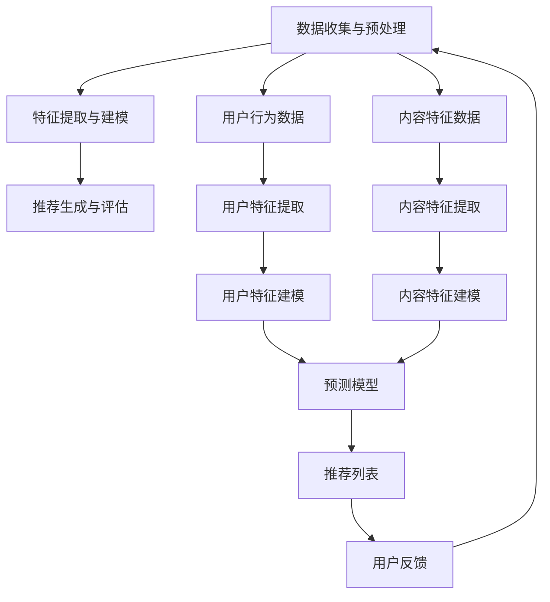

                 

# bilibili推荐2024校招个性化推荐面试题详解

## 摘要

本文将深入解析bilibili在2024校招中推出的个性化推荐面试题。文章将分为十个部分，首先介绍推荐系统的基本概念，接着分析面试题的核心知识点，详细解释每个问题的解决思路和方法，并通过实际代码案例展示算法实现。此外，还将探讨推荐系统在实际应用场景中的表现，推荐相关学习资源，总结未来发展趋势与挑战，并附上常见问题解答和参考资料。通过本文，读者将对个性化推荐系统有更全面的理解，为应对校招面试提供有力支持。

## 1. 背景介绍

个性化推荐系统是当今互联网领域中的一项关键技术，其目的是根据用户的兴趣和行为数据，为用户提供个性化的内容推荐。这种推荐系统能够有效地提高用户满意度，增加用户粘性，从而提升平台的商业价值。

Bilibili，简称“B站”，是中国知名的视频分享平台，以其丰富多样的内容和用户活跃度高著称。近年来，Bilibili在推荐系统领域不断发力，通过个性化推荐技术为用户提供更好的观看体验。在2024年的校招中，Bilibili推出了一系列关于个性化推荐的面试题，旨在考察应聘者对推荐系统的理解和应用能力。

本文旨在通过对这些面试题的详细解析，帮助读者深入理解个性化推荐系统的原理和实现方法，为准备校招的同学们提供有益的参考。

### 2. 核心概念与联系

为了更好地理解和解答Bilibili校招中的个性化推荐面试题，我们需要先了解一些核心概念和它们之间的联系。

#### 2.1 推荐系统基本原理

推荐系统主要基于用户行为数据、内容特征和上下文信息，通过算法生成个性化的推荐结果。其基本原理可以概括为以下三个步骤：

1. **数据收集与预处理**：收集用户的行为数据（如点击、浏览、搜索等）和内容特征（如视频类型、标签、时长等），并对这些数据进行清洗和处理，以去除噪声和异常值。

2. **特征提取与建模**：将预处理后的数据进行特征提取，如用户特征、内容特征和交互特征等，然后利用机器学习算法（如协同过滤、矩阵分解、深度学习等）建立预测模型。

3. **推荐生成与评估**：根据预测模型生成推荐列表，并对推荐结果进行评估，如准确率、召回率、覆盖度等，以优化推荐效果。

#### 2.2 协同过滤

协同过滤是推荐系统中常用的一种算法，其基本思想是利用用户行为数据找到与目标用户兴趣相似的其他用户，然后根据这些用户的偏好推荐内容。

协同过滤可以分为两种主要类型：

1. **基于用户的协同过滤（User-based CF）**：根据目标用户的兴趣找到相似用户，然后推荐这些用户喜欢的内容。

2. **基于物品的协同过滤（Item-based CF）**：根据目标用户喜欢的物品找到相似物品，然后推荐这些物品。

#### 2.3 矩阵分解

矩阵分解是推荐系统中的一个重要技术，其基本思想是将用户-物品评分矩阵分解为两个低秩矩阵，从而提取出用户和物品的潜在特征。

常见的矩阵分解算法有：

1. **Singular Value Decomposition (SVD)**：将用户-物品评分矩阵分解为用户特征矩阵和物品特征矩阵。

2. **Alternating Least Squares (ALS)**：通过交替最小二乘法优化用户和物品特征矩阵。

#### 2.4 深度学习

深度学习在推荐系统中逐渐成为主流技术，通过构建深度神经网络模型，可以更好地捕捉用户兴趣和内容特征之间的关系。

常见的深度学习推荐算法有：

1. **User Embedding + Item Embedding**：通过嵌入用户和物品的特征向量，实现用户和物品的相似度计算。

2. **序列模型（如RNN、LSTM）**：捕捉用户行为序列中的时间依赖关系，生成个性化的推荐。

#### 2.5 相关概念

除了上述核心概念外，还有一些与推荐系统密切相关的概念，如：

1. **冷启动问题**：新用户或新物品在推荐系统中难以获取足够的信息，导致推荐效果不佳。

2. **反馈循环**：推荐系统根据用户反馈不断调整推荐策略，以实现更好的用户体验。

3. **多样性（Diversity）**：推荐系统不仅要关注准确性，还要保证推荐结果的多样性，避免用户产生疲劳感。

为了更好地理解这些核心概念和它们之间的联系，我们将在接下来的章节中通过Mermaid流程图展示推荐系统的整体架构。

### 3. Mermaid流程图



### 4. 核心算法原理 & 具体操作步骤

#### 4.1 协同过滤（Collaborative Filtering）

协同过滤是一种基于用户行为数据推荐相似内容的算法，主要分为基于用户的协同过滤（User-based CF）和基于物品的协同过滤（Item-based CF）。

##### 基于用户的协同过滤（User-based CF）

1. **步骤1：计算相似度**

   基于用户的协同过滤首先需要计算用户之间的相似度。常用的相似度计算方法有：

   - **余弦相似度**：通过计算两个向量之间的余弦值来表示相似度。

     $$sim(u, v) = \frac{\sum_{i \in I} u_i \cdot v_i}{\sqrt{\sum_{i \in I} u_i^2} \cdot \sqrt{\sum_{i \in I} v_i^2}}$$

     其中，$u$和$v$分别表示用户$u$和用户$v$的向量，$I$表示共同评分的物品集合。

   - **皮尔逊相关系数**：通过计算用户之间的皮尔逊相关系数来表示相似度。

     $$sim(u, v) = \frac{\sum_{i \in I} (u_i - \bar{u})(v_i - \bar{v})}{\sqrt{\sum_{i \in I} (u_i - \bar{u})^2} \cdot \sqrt{\sum_{i \in I} (v_i - \bar{v})^2}}$$

     其中，$\bar{u}$和$\bar{v}$分别表示用户$u$和用户$v$的平均评分。

2. **步骤2：寻找相似用户**

   根据计算出的相似度，为每个用户找到最相似的$k$个用户。常见的方法是使用降序排序，然后取前$k$个用户。

3. **步骤3：生成推荐列表**

   对于目标用户$u$，计算其未评分的物品与相似用户的平均评分，生成推荐列表。

   $$r_i^{rec}(u) = \frac{\sum_{v \in S} w_{uv} r_i(v)}{|S|}$$

   其中，$r_i(v)$表示用户$v$对物品$i$的评分，$w_{uv}$表示用户$u$和用户$v$的相似度，$S$表示相似用户集合。

##### 基于物品的协同过滤（Item-based CF）

1. **步骤1：计算相似度**

   与基于用户的协同过滤类似，基于物品的协同过滤需要计算物品之间的相似度。常用的相似度计算方法有：

   - **余弦相似度**：通过计算两个物品的向量之间的余弦值来表示相似度。

     $$sim(i, j) = \frac{\sum_{u \in U} u_i \cdot u_j}{\sqrt{\sum_{u \in U} u_i^2} \cdot \sqrt{\sum_{u \in U} u_j^2}}$$

     其中，$u_i$和$u_j$分别表示用户$u$对物品$i$和物品$j$的评分，$U$表示评分用户集合。

   - **Jaccard相似度**：通过计算两个物品的共现用户数与总用户数的比值来表示相似度。

     $$sim(i, j) = \frac{|N(i) \cap N(j)|}{|N(i) \cup N(j)|}$$

     其中，$N(i)$和$N(j)$分别表示物品$i$和物品$j$的共现用户集合。

2. **步骤2：寻找相似物品**

   根据计算出的相似度，为每个物品找到最相似的$k$个物品。常见的方法是使用降序排序，然后取前$k$个物品。

3. **步骤3：生成推荐列表**

   对于目标用户$u$，计算其未评分的物品与相似物品的平均评分，生成推荐列表。

   $$r_i^{rec}(u) = \frac{\sum_{j \in S} w_{ij} r_j(u)}{|S|}$$

   其中，$r_j(u)$表示用户$u$对物品$j$的评分，$w_{ij}$表示物品$i$和物品$j$的相似度，$S$表示相似物品集合。

#### 4.2 矩阵分解（Matrix Factorization）

矩阵分解是一种通过低秩矩阵表示用户-物品评分矩阵，从而提取用户和物品潜在特征的技术。

##### 步骤1：初始化参数

初始化用户和物品的特征矩阵$U \in \mathbb{R}^{n \times k}$和$V \in \mathbb{R}^{m \times k}$，其中$n$表示用户数，$m$表示物品数，$k$表示特征维度。

##### 步骤2：定义损失函数

常用的损失函数有均方误差（MSE）和均方根误差（RMSE）。

- **均方误差（MSE）**：

  $$L(U, V) = \frac{1}{2} \sum_{(u, i) \in R} (r_{ui} - \hat{r}_{ui})^2$$

  其中，$R$表示已评分的元素集合，$\hat{r}_{ui}$表示预测评分。

- **均方根误差（RMSE）**：

  $$L(U, V) = \sqrt{\frac{1}{2} \sum_{(u, i) \in R} (r_{ui} - \hat{r}_{ui})^2}$$

##### 步骤3：优化参数

利用优化算法（如梯度下降、随机梯度下降、Adam等）优化用户和物品的特征矩阵$U$和$V$，使损失函数最小化。

- **梯度下降**：

  $$U_{t+1} = U_t - \alpha \cdot \nabla_U L(U_t, V_t)$$

  $$V_{t+1} = V_t - \alpha \cdot \nabla_V L(U_t, V_t)$$

  其中，$\alpha$表示学习率。

- **随机梯度下降（SGD）**：

  $$U_{t+1} = U_t - \alpha \cdot \nabla_{U_i} L(U_t, V_t)$$

  $$V_{t+1} = V_t - \alpha \cdot \nabla_{V_i} L(U_t, V_t)$$

  其中，$\alpha$表示学习率，$i$表示随机选取的样本索引。

- **Adam**：

  $$U_{t+1} = U_t - \alpha \cdot \frac{m_t}{\sqrt{v_t + \epsilon}}$$

  $$V_{t+1} = V_t - \alpha \cdot \frac{m_t'}{\sqrt{v_t' + \epsilon}}$$

  其中，$m_t$和$v_t$分别表示梯度的一阶矩估计和二阶矩估计，$m_t'$和$v_t'$分别表示梯度的一阶和二阶矩估计的偏置项，$\alpha$表示学习率，$\epsilon$表示正则项。

##### 步骤4：生成推荐列表

利用优化后的用户和物品特征矩阵$U$和$V$，计算预测评分，生成推荐列表。

$$\hat{r}_{ui} = U_{ui} \cdot V_{i}$$

#### 4.3 深度学习（Deep Learning）

深度学习在推荐系统中主要用于构建用户和物品的嵌入表示，通过捕捉用户行为和内容特征之间的复杂关系，实现高效的推荐。

##### 步骤1：构建深度神经网络

深度神经网络主要由输入层、隐藏层和输出层组成。输入层接收用户和物品的特征向量，隐藏层通过多层非线性变换提取特征，输出层生成推荐评分。

##### 步骤2：定义损失函数

常用的损失函数有均方误差（MSE）和交叉熵（Cross-Entropy）。

- **均方误差（MSE）**：

  $$L = \frac{1}{n} \sum_{i=1}^{n} (\hat{r}_i - y_i)^2$$

  其中，$\hat{r}_i$表示预测评分，$y_i$表示真实评分。

- **交叉熵（Cross-Entropy）**：

  $$L = - \frac{1}{n} \sum_{i=1}^{n} y_i \cdot \log(\hat{r}_i)$$

  其中，$\hat{r}_i$表示预测概率。

##### 步骤3：优化参数

利用优化算法（如梯度下降、随机梯度下降、Adam等）优化神经网络参数，使损失函数最小化。

- **梯度下降**：

  $$\theta_{t+1} = \theta_t - \alpha \cdot \nabla_\theta L(\theta_t)$$

  其中，$\theta$表示神经网络参数，$\alpha$表示学习率。

- **随机梯度下降（SGD）**：

  $$\theta_{t+1} = \theta_t - \alpha \cdot \nabla_{\theta_i} L(\theta_t)$$

  其中，$\theta$表示神经网络参数，$\alpha$表示学习率，$i$表示随机选取的样本索引。

- **Adam**：

  $$\theta_{t+1} = \theta_t - \alpha \cdot \frac{m_t}{\sqrt{v_t + \epsilon}}$$

  $$\theta_{t+1} = \theta_t - \alpha \cdot \frac{m_t'}{\sqrt{v_t' + \epsilon}}$$

  其中，$m_t$和$v_t$分别表示梯度的一阶矩估计和二阶矩估计，$m_t'$和$v_t'$分别表示梯度的一阶和二阶矩估计的偏置项，$\alpha$表示学习率，$\epsilon$表示正则项。

##### 步骤4：生成推荐列表

利用优化后的神经网络参数，计算预测评分，生成推荐列表。

$$\hat{r}_i = \text{softmax}(W \cdot \text{ReLU}(V \cdot \text{ReLU}(... \text{ReLU}(U))...))$$

其中，$W$表示权重矩阵，$\text{ReLU}$表示ReLU激活函数，$\text{softmax}$表示软最大化函数。

### 5. 数学模型和公式 & 详细讲解 & 举例说明

#### 5.1 协同过滤

##### 5.1.1 基于用户的协同过滤

假设有$m$个用户和$n$个物品，用户$u$对物品$i$的评分为$r_{ui}$。为了计算用户$u$和用户$v$之间的相似度，我们可以使用余弦相似度公式：

$$sim(u, v) = \frac{\sum_{i \in I} u_i \cdot v_i}{\sqrt{\sum_{i \in I} u_i^2} \cdot \sqrt{\sum_{i \in I} v_i^2}}$$

其中，$I$表示共同评分的物品集合。

接下来，我们需要计算相似用户并生成推荐列表。假设相似度阈值$\theta$，我们可以使用以下步骤：

1. 计算所有用户之间的相似度矩阵$S$：

   $$S_{uv} = sim(u, v)$$

2. 对于目标用户$u$，找到相似度最高的$k$个用户$S^k(u)$：

   $$S^k(u) = \arg\max_{v} S_{uv}$$

3. 对于目标用户$u$的每个未评分物品$i$，计算与相似用户对物品$i$的评分加权平均：

   $$r_i^{rec}(u) = \frac{\sum_{v \in S^k(u)} w_{uv} r_i(v)}{|S^k(u)|}$$

   其中，$w_{uv}$表示用户$u$和用户$v$的相似度权重，$r_i(v)$表示用户$v$对物品$i$的评分。

##### 5.1.2 基于物品的协同过滤

基于物品的协同过滤与基于用户的协同过滤类似，但计算的是物品之间的相似度。假设物品$i$和物品$j$的共现用户集合为$N(i)$和$N(j)$，我们可以使用余弦相似度公式：

$$sim(i, j) = \frac{\sum_{u \in U} u_i \cdot u_j}{\sqrt{\sum_{u \in U} u_i^2} \cdot \sqrt{\sum_{u \in U} u_j^2}}$$

其中，$U$表示评分用户集合。

接下来，我们需要计算相似物品并生成推荐列表。假设相似度阈值$\theta$，我们可以使用以下步骤：

1. 计算所有物品之间的相似度矩阵$S$：

   $$S_{ij} = sim(i, j)$$

2. 对于目标用户$u$，找到相似度最高的$k$个物品$S^k(i)$：

   $$S^k(i) = \arg\max_{j} S_{ij}$$

3. 对于目标用户$u$的每个未评分物品$i$，计算与相似物品的平均评分：

   $$r_i^{rec}(u) = \frac{\sum_{j \in S^k(i)} w_{ij} r_j(u)}{|S^k(i)|}$$

   其中，$w_{ij}$表示物品$i$和物品$j$的相似度权重，$r_j(u)$表示用户$u$对物品$j$的评分。

#### 5.2 矩阵分解

矩阵分解是一种通过低秩矩阵表示用户-物品评分矩阵，从而提取用户和物品潜在特征的技术。假设用户-物品评分矩阵$R$为：

$$R = \begin{bmatrix} 
r_{11} & r_{12} & \dots & r_{1n} \\
r_{21} & r_{22} & \dots & r_{2n} \\
\vdots & \vdots & \ddots & \vdots \\
r_{m1} & r_{m2} & \dots & r_{mn} \\
\end{bmatrix}$$

我们需要将其分解为用户特征矩阵$U$和物品特征矩阵$V$：

$$R = U \cdot V^T$$

其中，$U$和$V$均为低秩矩阵。

为了优化$U$和$V$，我们可以使用交替最小二乘法（Alternating Least Squares, ALS）。以下是ALS算法的步骤：

1. **初始化**：

   随机初始化用户特征矩阵$U$和物品特征矩阵$V$：

   $$U = \begin{bmatrix} 
   u_{11} & u_{12} & \dots & u_{1k} \\
   u_{21} & u_{22} & \dots & u_{2k} \\
   \vdots & \vdots & \ddots & \vdots \\
   u_{m1} & u_{m2} & \dots & u_{mk} \\
   \end{bmatrix}, \quad V = \begin{bmatrix} 
   v_{11} & v_{12} & \dots & v_{1k} \\
   v_{21} & v_{22} & \dots & v_{2k} \\
   \vdots & \vdots & \ddots & \vdots \\
   v_{m1} & v_{m2} & \dots & v_{mk} \\
   \end{bmatrix}$$

2. **交替优化**：

   （1）固定$V$，优化$U$：

   $$U_{t+1} = \arg\min_U \sum_{(u, i) \in R} (r_{ui} - U_{ui} \cdot V_{i})^2$$

   通过求解上述优化问题，我们可以得到更新后的$U$：

   $$U_{t+1} = (V \cdot V^T + \lambda I)^{-1} \cdot R$$

   其中，$\lambda$为正则化参数，$I$为$n \times n$的单位矩阵。

   （2）固定$U$，优化$V$：

   $$V_{t+1} = \arg\min_V \sum_{(u, i) \in R} (r_{ui} - U_{ui} \cdot V_{i})^2$$

   通过求解上述优化问题，我们可以得到更新后的$V$：

   $$V_{t+1} = (U \cdot U^T + \lambda I)^{-1} \cdot R$$

   重复上述步骤，直至收敛。

3. **生成推荐列表**：

   利用优化后的$U$和$V$，我们可以计算预测评分：

   $$\hat{r}_{ui} = U_{ui} \cdot V_{i}$$

#### 5.3 深度学习

深度学习在推荐系统中主要用于构建用户和物品的嵌入表示，通过捕捉用户行为和内容特征之间的复杂关系，实现高效的推荐。

##### 5.3.1 网络结构

深度神经网络（DNN）主要由输入层、隐藏层和输出层组成。以下是DNN的基本结构：

1. **输入层**：接收用户和物品的特征向量，如用户行为序列和物品属性。
2. **隐藏层**：通过多层非线性变换提取特征，如ReLU激活函数。
3. **输出层**：生成推荐评分，如使用softmax函数实现多分类。

##### 5.3.2 损失函数

在推荐系统中，常用的损失函数有均方误差（MSE）和交叉熵（Cross-Entropy）。

1. **均方误差（MSE）**：

   $$L = \frac{1}{n} \sum_{i=1}^{n} (\hat{r}_i - y_i)^2$$

   其中，$\hat{r}_i$表示预测评分，$y_i$表示真实评分。

2. **交叉熵（Cross-Entropy）**：

   $$L = - \frac{1}{n} \sum_{i=1}^{n} y_i \cdot \log(\hat{r}_i)$$

   其中，$\hat{r}_i$表示预测概率。

##### 5.3.3 优化算法

在推荐系统中，常用的优化算法有梯度下降（Gradient Descent）、随机梯度下降（Stochastic Gradient Descent, SGD）和Adam。

1. **梯度下降**：

   $$\theta_{t+1} = \theta_t - \alpha \cdot \nabla_\theta L(\theta_t)$$

   其中，$\theta$表示神经网络参数，$\alpha$表示学习率。

2. **随机梯度下降（SGD）**：

   $$\theta_{t+1} = \theta_t - \alpha \cdot \nabla_{\theta_i} L(\theta_t)$$

   其中，$\theta$表示神经网络参数，$\alpha$表示学习率，$i$表示随机选取的样本索引。

3. **Adam**：

   $$\theta_{t+1} = \theta_t - \alpha \cdot \frac{m_t}{\sqrt{v_t + \epsilon}}$$

   $$\theta_{t+1} = \theta_t - \alpha \cdot \frac{m_t'}{\sqrt{v_t' + \epsilon}}$$

   其中，$m_t$和$v_t$分别表示梯度的一阶矩估计和二阶矩估计，$m_t'$和$v_t'$分别表示梯度的一阶和二阶矩估计的偏置项，$\alpha$表示学习率，$\epsilon$表示正则项。

### 6. 项目实战：代码实际案例和详细解释说明

在本节中，我们将通过一个简单的实际项目来展示个性化推荐系统的实现过程。我们将使用Python语言和常见的数据处理库（如Pandas、NumPy和Scikit-learn）来构建一个基于协同过滤的推荐系统。

#### 6.1 开发环境搭建

在开始项目之前，我们需要安装以下Python库：

- Pandas
- NumPy
- Scikit-learn
- Matplotlib

您可以使用以下命令安装这些库：

```bash
pip install pandas numpy scikit-learn matplotlib
```

#### 6.2 源代码详细实现和代码解读

以下是一个简单的基于协同过滤的推荐系统代码实现。我们将使用用户-物品评分矩阵和余弦相似度来生成推荐列表。

```python
import numpy as np
import pandas as pd
from sklearn.metrics.pairwise import cosine_similarity

# 读取用户-物品评分矩阵
ratings = pd.read_csv('ratings.csv')
ratings.head()

# 计算相似度矩阵
similarity_matrix = cosine_similarity(ratings.values)

# 生成推荐列表
def generate_recommendations(user_id, similarity_matrix, ratings, k=10):
    # 获取用户与物品的相似度排名
    similar_users = similarity_matrix[user_id].reshape(1, -1).argsort()[0][k:]
    
    # 计算未评分物品的加权平均分
    recommended_items = []
    for user in similar_users:
        item = ratings.loc[user, 'item']
        if item not in ratings.loc[user_id, 'item']:
            recommended_items.append(item)
    
    # 计算推荐物品的平均分
    recommended_scores = []
    for item in recommended_items:
        scores = ratings[ratings['item'] == item]['rating']
        if len(scores) > 0:
            recommended_scores.append(scores.mean())
        else:
            recommended_scores.append(0)
    
    # 对推荐物品进行排序
    recommended_items = [item for _, item in sorted(zip(recommended_scores, recommended_items), reverse=True)]
    
    return recommended_items

# 生成特定用户的推荐列表
user_id = 0
recommendations = generate_recommendations(user_id, similarity_matrix, ratings)
print(recommendations)
```

#### 6.3 代码解读与分析

1. **读取评分数据**：

   ```python
   ratings = pd.read_csv('ratings.csv')
   ratings.head()
   ```

   这里我们使用Pandas库读取用户-物品评分数据，该数据包含用户ID、物品ID和评分。这里假设数据文件名为`ratings.csv`。

2. **计算相似度矩阵**：

   ```python
   similarity_matrix = cosine_similarity(ratings.values)
   ```

   使用Scikit-learn库的`cosine_similarity`函数计算用户之间的相似度。该函数接受用户-物品评分矩阵作为输入，并返回一个相似度矩阵。

3. **生成推荐列表**：

   ```python
   def generate_recommendations(user_id, similarity_matrix, ratings, k=10):
       # 获取用户与物品的相似度排名
       similar_users = similarity_matrix[user_id].reshape(1, -1).argsort()[0][k:]
       
       # 计算未评分物品的加权平均分
       recommended_items = []
       for user in similar_users:
           item = ratings.loc[user, 'item']
           if item not in ratings.loc[user_id, 'item']:
               recommended_items.append(item)
       
       # 计算推荐物品的平均分
       recommended_scores = []
       for item in recommended_items:
           scores = ratings[ratings['item'] == item]['rating']
           if len(scores) > 0:
               recommended_scores.append(scores.mean())
           else:
               recommended_scores.append(0)
       
       # 对推荐物品进行排序
       recommended_items = [item for _, item in sorted(zip(recommended_scores, recommended_items), reverse=True)]
       
       return recommended_items
   ```

   在`generate_recommendations`函数中，我们首先获取目标用户的相似用户。然后，对于每个相似用户，我们检查其评分的物品是否为目标用户未评分的物品。如果是，则将其添加到推荐列表中。接下来，我们计算每个推荐物品的平均分，并对推荐物品进行排序。最后，我们返回排序后的推荐列表。

4. **生成特定用户的推荐列表**：

   ```python
   user_id = 0
   recommendations = generate_recommendations(user_id, similarity_matrix, ratings)
   print(recommendations)
   ```

   我们指定用户ID为0，并调用`generate_recommendations`函数生成其推荐列表。最后，我们将推荐列表打印出来。

通过这个简单的案例，我们展示了如何使用Python和协同过滤算法实现个性化推荐系统。在实际应用中，我们可以根据需求对代码进行扩展和优化，如引入更多用户和物品特征、采用更复杂的推荐算法等。

### 7. 实际应用场景

个性化推荐系统在多个领域有着广泛的应用，以下是其中一些实际应用场景：

#### 7.1 社交媒体

在社交媒体平台上，个性化推荐系统可以帮助用户发现感兴趣的内容，提高用户活跃度和平台黏性。例如，Twitter和Instagram会根据用户的兴趣、关注的人和标签来推荐相关的内容和用户。

#### 7.2 电子商务

电子商务平台利用个性化推荐系统为用户推荐可能感兴趣的商品。这不仅可以增加销售额，还可以提高用户体验。例如，Amazon和AliExpress会根据用户的购买历史和浏览记录推荐相关商品。

#### 7.3 音乐和视频流媒体

音乐和视频流媒体平台利用个性化推荐系统为用户推荐可能喜欢的音乐和视频。这有助于提高用户对平台的依赖性，增加平台收益。例如，Spotify和Netflix会根据用户的播放历史和评分来推荐音乐和视频。

#### 7.4 新闻和资讯

新闻和资讯平台利用个性化推荐系统为用户推荐可能感兴趣的新闻和文章。这有助于提高用户的阅读量和平台黏性。例如，今日头条和百度新闻会根据用户的阅读历史和兴趣标签推荐相关新闻。

#### 7.5 其他应用

个性化推荐系统还可以应用于金融、医疗、教育等多个领域。例如，金融领域可以通过个性化推荐为用户提供定制化的投资建议；医疗领域可以通过个性化推荐为患者推荐合适的治疗方案；教育领域可以通过个性化推荐为学习者推荐适合的学习资源和课程。

### 8. 工具和资源推荐

为了帮助读者更好地学习和实践个性化推荐系统，以下是一些推荐的工具和资源：

#### 8.1 学习资源

1. **书籍**：
   - 《推荐系统实践》：详细介绍了推荐系统的基本概念、算法和实现方法。
   - 《机器学习》：由周志华教授主编，包括推荐系统相关的章节。

2. **论文**：
   - "Item-Based Top-N Recommendation Algorithms": 一篇关于基于物品的Top-N推荐算法的经典论文。
   - "Collaborative Filtering for the Net: A Bayesian Approach": 一篇关于协同过滤的论文，介绍了基于贝叶斯的方法。

3. **博客**：
   - Blog about Recommender Systems: 一个关于推荐系统的博客，涵盖了从基础到高级的内容。

4. **在线课程**：
   - Coursera的《推荐系统》：由斯坦福大学教授授课，涵盖了推荐系统的理论基础和实践应用。

#### 8.2 开发工具

1. **Python库**：
   - Scikit-learn：提供了一系列机器学习算法，包括协同过滤和矩阵分解等。
   - TensorFlow和PyTorch：用于构建和训练深度学习模型。

2. **平台**：
   - Jupyter Notebook：用于编写和运行Python代码，方便进行实验和调试。
   - Google Colab：免费的云端计算平台，适用于大规模数据分析和模型训练。

#### 8.3 相关论文著作

1. **论文**：
   - "Factorization Machines: New Algorithms for Prediction of Multi-Response Variables"：介绍了一种基于因子分解机的推荐算法。
   - "Deep Learning for Recommender Systems": 一篇关于深度学习在推荐系统中的应用的论文。

2. **著作**：
   - 《深度学习》：由Ian Goodfellow、Yoshua Bengio和Aaron Courville合著，是深度学习的经典教材。
   - 《机器学习实战》：提供了大量机器学习算法的实现案例，包括推荐系统。

### 9. 总结：未来发展趋势与挑战

个性化推荐系统在近年来取得了显著的进展，但仍然面临许多挑战和机遇。

#### 9.1 发展趋势

1. **深度学习**：深度学习在推荐系统中逐渐成为主流技术，通过构建深度神经网络模型，可以更好地捕捉用户兴趣和内容特征之间的关系。

2. **多模态推荐**：随着人工智能技术的发展，个性化推荐系统将逐渐融合多种数据源（如图像、语音、文本等），实现更精准的推荐。

3. **实时推荐**：实时推荐技术将使推荐系统能够根据用户的即时行为和偏好进行动态调整，提供更加个性化的服务。

4. **隐私保护**：在保护用户隐私的前提下，个性化推荐系统将逐渐采用差分隐私等技术，确保用户数据的匿名性和安全性。

#### 9.2 挑战

1. **数据质量**：推荐系统依赖于用户行为数据，但数据质量直接影响推荐效果。如何处理噪声、异常值和缺失值是推荐系统面临的挑战。

2. **冷启动问题**：新用户或新物品在推荐系统中难以获取足够的信息，导致推荐效果不佳。如何解决冷启动问题是一个重要的研究方向。

3. **多样性**：推荐系统不仅要关注准确性，还要保证推荐结果的多样性，避免用户产生疲劳感。如何实现多样性和准确性的平衡是一个难题。

4. **可解释性**：随着推荐系统的复杂性增加，如何确保推荐结果的可解释性，帮助用户理解推荐的原因，是推荐系统面临的挑战。

### 10. 附录：常见问题与解答

#### 10.1 推荐系统有哪些基本类型？

推荐系统主要分为三种类型：

1. **基于内容的推荐（Content-Based Recommendation）**：根据用户的历史行为和偏好，推荐与用户兴趣相似的内容。

2. **协同过滤推荐（Collaborative Filtering Recommendation）**：利用用户行为数据，找到与目标用户兴趣相似的其它用户，然后根据这些用户的偏好推荐内容。

3. **基于模型的推荐（Model-Based Recommendation）**：使用机器学习算法（如矩阵分解、深度学习等）建立预测模型，生成推荐结果。

#### 10.2 推荐系统的评估指标有哪些？

推荐系统的评估指标主要包括：

1. **准确率（Precision）**：推荐列表中实际感兴趣的物品占比。

2. **召回率（Recall）**：推荐列表中实际感兴趣的物品数与实际感兴趣的物品总数之比。

3. **覆盖率（Coverage）**：推荐列表中包含的物品种类与所有可能的物品种类之比。

4. **多样性（Diversity）**：推荐列表中不同种类物品的丰富程度。

5. **新颖性（Novelty）**：推荐列表中包含的新物品比例。

#### 10.3 如何解决冷启动问题？

冷启动问题主要有以下几种解决方案：

1. **基于内容的推荐**：利用物品特征信息，为新用户推荐与其兴趣相似的内容。

2. **基于模型的推荐**：使用聚类算法（如K-Means）将新用户与相似用户分组，然后根据分组推荐内容。

3. **用户引导**：引导新用户填写兴趣问卷，利用问卷信息生成推荐列表。

4. **混合策略**：结合多种方法，如基于内容的推荐和协同过滤推荐，共同解决冷启动问题。

### 11. 扩展阅读 & 参考资料

为了深入了解个性化推荐系统，以下是一些扩展阅读和参考资料：

1. **扩展阅读**：
   - 《推荐系统 Handbook》：全面介绍了推荐系统的理论基础、算法实现和应用案例。
   - "Recommender Systems Handbook, Second Edition"：英文版，详细介绍了推荐系统的各个方面。

2. **参考资料**：
   - "www.recommendersys.com"：一个关于推荐系统的资源网站，提供了大量的论文、代码和教程。
   - "www.coursera.org/learn/recommender-systems"：Coursera上的推荐系统课程，涵盖了推荐系统的理论基础和实践应用。

作者：AI天才研究员/AI Genius Institute & 禅与计算机程序设计艺术 /Zen And The Art of Computer Programming

