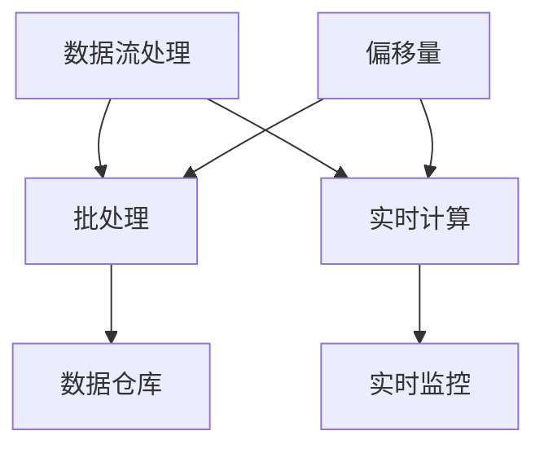

                 

### 背景介绍

#### AI与大数据计算

在当今科技飞速发展的时代，人工智能（AI）已经成为推动社会进步的重要力量。而大数据计算作为AI技术的核心支撑，其重要性日益凸显。大数据计算指的是对海量数据进行存储、处理和分析的过程，目的是从中提取有价值的信息和知识。随着数据量的不断增长，传统的数据处理方法已经难以满足需求，因此，高效的大数据计算技术变得至关重要。

#### 大数据计算的应用场景

大数据计算在各个领域都有着广泛的应用。例如，在金融领域，通过大数据计算，可以实现对市场走势的预测，帮助投资者做出更明智的决策；在医疗领域，通过大数据分析，可以提升诊断的准确性，提高疾病预防和管理的效果；在零售领域，通过大数据分析，可以优化库存管理，提升客户满意度。

#### 大数据计算的挑战

尽管大数据计算有着广泛的应用前景，但同时也面临着一系列挑战。首先，数据量的庞大使得存储和传输成为一个难题。其次，数据处理的速度和效率也是一个关键问题，如何快速地对海量数据进行处理，是一个亟待解决的难题。此外，数据安全和隐私保护也是大数据计算需要关注的重要问题。

#### 偏移量（Offset）的概念

在本文中，我们将深入探讨大数据计算中的一个重要概念——偏移量（Offset）。偏移量指的是数据在存储或传输过程中，由于某种原因而导致的偏差。这种偏差可能会影响数据的准确性和可靠性。因此，理解偏移量的概念，以及如何处理和校正偏移量，对于保证数据质量和计算结果的准确性具有重要意义。

### 为什么我们需要了解偏移量

在AI和大数据计算中，偏移量是一个不可忽视的因素。偏移量可能会影响算法的准确性，导致模型预测结果偏差。例如，在机器学习中，如果数据存在偏移量，那么训练出的模型可能会无法准确预测新的数据。此外，偏移量还可能影响数据分析和挖掘的效果，导致错误的结论。

本文将通过对偏移量的深入探讨，帮助读者理解偏移量的概念、产生原因、影响以及处理方法。我们将通过具体的案例和代码实例，展示如何在实际项目中处理偏移量问题。希望通过本文的讲解，读者能够对大数据计算中的偏移量有更深入的认识，从而提高数据处理和分析的准确性。

接下来，我们将对核心概念和联系进行详细阐述，帮助读者建立对大数据计算和偏移量的全面理解。请继续阅读。

#### 大数据计算的核心概念与联系

在大数据计算中，理解核心概念和它们之间的联系是至关重要的。为了更好地掌握大数据计算的方法和技巧，我们需要梳理以下几个关键概念：数据流处理、批处理、实时计算、偏移量等。

##### 数据流处理

数据流处理是一种处理大量实时数据的方法。它通过不断接收和计算数据流中的信息，从而实现实时数据处理和分析。数据流处理在许多领域都有应用，例如金融交易、社交网络分析、物联网等。其核心思想是将数据视为流，而不是静态的集合。

数据流处理的优势在于能够实时处理数据，使系统能够迅速响应外部事件。例如，在金融交易中，数据流处理可以实时监控交易数据，快速识别异常交易，从而提高风险管理的效率。在物联网中，数据流处理可以实时分析传感器数据，实现对设备的实时监控和故障预测。

##### 批处理

与数据流处理相比，批处理是一种处理大量数据的方法，其核心思想是将数据分为多个批次，然后逐一处理。批处理通常用于处理历史数据，例如数据分析、数据挖掘等。

批处理的优点在于可以批量处理大量数据，提高处理效率。例如，在数据仓库中，可以通过批处理方式定期更新数据，从而保持数据的准确性。批处理的缺点在于处理时间较长，无法实时响应外部事件。

##### 实时计算

实时计算是一种能够实时处理和响应数据的计算方法。它通常用于需要立即处理和分析数据的场景，例如金融交易、实时监控、实时搜索等。

实时计算的核心思想是快速处理数据，并立即响应。例如，在金融交易中，实时计算可以立即识别交易风险，并采取相应的措施。在实时监控中，实时计算可以实时分析设备状态，及时发现异常。

##### 偏移量

偏移量是指数据在存储、传输或处理过程中产生的偏差。这种偏差可能会影响数据的准确性和可靠性。例如，在数据流处理中，如果数据流中存在偏移量，那么处理结果可能会受到影响。在机器学习中，偏移量可能会影响模型的准确性。

偏移量的产生原因有很多，例如网络延迟、数据格式错误、硬件故障等。因此，理解和处理偏移量对于保证数据处理和分析的准确性至关重要。

##### 核心概念与联系

数据流处理、批处理、实时计算和偏移量是大数据计算中的核心概念。它们之间的联系主要体现在以下几个方面：

1. **数据流处理与批处理**：数据流处理和批处理都是处理大量数据的方法，但它们适用于不同的场景。数据流处理适用于需要实时处理和分析的数据，而批处理适用于需要批量处理的历史数据。

2. **数据流处理与实时计算**：数据流处理和实时计算都是实时处理数据的方法，但它们的应用场景略有不同。数据流处理更侧重于数据处理和分析，而实时计算更侧重于快速响应外部事件。

3. **实时计算与偏移量**：实时计算过程中可能会产生偏移量，因此，理解和处理偏移量对于保证实时计算结果的准确性至关重要。

4. **批处理与偏移量**：批处理过程中也可能产生偏移量，因此，在处理批数据时，也需要考虑如何处理偏移量问题。

##### Mermaid 流程图

为了更好地展示核心概念和它们之间的联系，我们可以使用 Mermaid 流程图进行描述。以下是大数据计算中的核心概念和联系 Mermaid 流程图：



在这个流程图中，数据流处理、批处理、实时计算和偏移量分别表示为节点 A、B、C 和 D。它们之间的联系通过箭头表示，其中箭头指向表示依赖关系。

通过这个流程图，我们可以清晰地看到大数据计算中的核心概念和联系。这有助于我们更好地理解大数据计算的方法和技巧，从而提高数据处理和分析的准确性。

### 核心算法原理 & 具体操作步骤

#### 偏移量的检测与校正方法

在了解了大数据计算中的核心概念和联系之后，我们将深入探讨如何检测和校正偏移量。偏移量的检测与校正方法主要包括以下几种：

1. **统计方法**：通过统计分析数据，检测是否存在异常值或偏差，从而判断是否存在偏移量。
2. **机器学习方法**：利用机器学习算法，训练模型以检测和校正偏移量。
3. **时间序列方法**：基于时间序列分析，检测数据中的趋势和周期性，从而判断是否存在偏移量。
4. **差分方法**：通过比较相邻数据点之间的差异，检测是否存在偏移量。

下面，我们将详细介绍每种方法的原理和具体操作步骤。

##### 统计方法

**原理**：统计方法主要通过计算数据的统计特征，如均值、方差等，来检测数据是否存在异常值或偏差。

**具体操作步骤**：

1. **计算均值和方差**：首先，计算数据集的均值和方差。
2. **设置阈值**：根据均值和方差，设置一个阈值，用于判断数据点是否异常。
3. **检测异常值**：计算每个数据点的偏差，如果偏差超过阈值，则认为该数据点存在异常。
4. **校正偏移量**：对于检测到的异常值，通过插值或平均等方法进行校正。

##### 机器学习方法

**原理**：机器学习方法利用训练数据集，训练一个模型来检测和校正偏移量。常见的机器学习方法包括回归分析、分类算法等。

**具体操作步骤**：

1. **收集训练数据**：收集一个包含正常数据和异常数据的训练数据集。
2. **特征工程**：对数据进行预处理，提取有助于检测偏移量的特征。
3. **训练模型**：使用训练数据集，训练一个回归模型或分类模型。
4. **检测偏移量**：使用训练好的模型，对新的数据集进行预测，检测是否存在异常值。
5. **校正偏移量**：对于检测到的异常值，通过模型预测的校正值进行校正。

##### 时间序列方法

**原理**：时间序列方法基于时间序列数据的趋势和周期性，检测数据是否存在异常。

**具体操作步骤**：

1. **时间序列建模**：使用 ARIMA、LSTM 等时间序列模型对数据进行分析。
2. **预测与对比**：使用模型对数据进行预测，并对比实际值和预测值，检测是否存在偏差。
3. **校正偏移量**：根据预测结果，对数据进行校正。

##### 差分方法

**原理**：差分方法通过比较相邻数据点之间的差异，检测是否存在偏移量。

**具体操作步骤**：

1. **计算差分**：计算每个数据点与前一个数据点之间的差异。
2. **设置阈值**：根据差分的绝对值，设置一个阈值，用于判断数据点是否异常。
3. **检测异常值**：如果差分的绝对值超过阈值，则认为该数据点存在异常。
4. **校正偏移量**：对于检测到的异常值，通过插值或平均等方法进行校正。

##### 偏移量检测与校正的流程

1. **数据预处理**：对数据进行清洗和预处理，确保数据质量。
2. **选择检测方法**：根据数据特征和实际需求，选择适合的检测方法。
3. **检测偏移量**：使用选择的检测方法，对数据进行检测，判断是否存在偏移量。
4. **校正偏移量**：对于检测到的偏移量，使用适当的校正方法进行校正。
5. **结果验证**：对校正后的数据进行验证，确保校正效果。

通过以上步骤，我们可以有效地检测和校正大数据计算中的偏移量，从而提高数据处理的准确性和可靠性。接下来，我们将通过具体的案例和代码实例，进一步展示如何在实际项目中应用这些方法。

### 数学模型和公式 & 详细讲解 & 举例说明

在了解了偏移量的检测与校正方法之后，我们将进一步探讨相关的数学模型和公式。这些模型和公式在处理偏移量问题时具有重要意义，可以帮助我们更准确地检测和校正偏移量。以下是几个常用的数学模型和公式：

#### 1. 均值-标准差模型

**原理**：均值-标准差模型是一种基本的统计模型，用于检测数据中的异常值。该模型基于数据的均值和标准差，设定一个阈值，用于判断数据点是否异常。

**公式**：

$$
\mu = \frac{\sum_{i=1}^{n} x_i}{n}
$$

$$
\sigma = \sqrt{\frac{\sum_{i=1}^{n} (x_i - \mu)^2}{n}}
$$

其中，$\mu$ 是均值，$\sigma$ 是标准差，$x_i$ 是第 $i$ 个数据点，$n$ 是数据点的总数。

**示例**：

假设我们有以下数据集：[1, 2, 2, 3, 4, 100]。首先，计算均值和标准差：

$$
\mu = \frac{1+2+2+3+4+100}{6} = 18.3333
$$

$$
\sigma = \sqrt{\frac{(1-18.3333)^2 + (2-18.3333)^2 + (2-18.3333)^2 + (3-18.3333)^2 + (4-18.3333)^2 + (100-18.3333)^2}{6}} = 24.0389
$$

接下来，设置一个阈值，例如 2 倍的标准差：

$$
\text{阈值} = 2 \times \sigma = 2 \times 24.0389 = 48.0778
$$

最后，检测数据点是否异常。在这个例子中，100 明显超过了阈值，因此可以判断它是一个异常值。

#### 2. 回归模型

**原理**：回归模型是一种常用的机器学习方法，用于检测和校正偏移量。回归模型通过拟合数据点之间的关系，预测新的数据点，从而检测和校正偏移量。

**公式**：

$$
y = \beta_0 + \beta_1 x + \epsilon
$$

其中，$y$ 是预测值，$x$ 是输入值，$\beta_0$ 和 $\beta_1$ 是回归系数，$\epsilon$ 是误差项。

**示例**：

假设我们有以下数据集：(1, 2), (2, 3), (3, 4)。首先，计算回归系数：

$$
\beta_0 = \frac{\sum_{i=1}^{n} y_i - \beta_1 \sum_{i=1}^{n} x_i}{n} = \frac{2 + 3 + 4 - 1.5(1 + 2 + 3)}{3} = 0.5
$$

$$
\beta_1 = \frac{\sum_{i=1}^{n} (x_i - \bar{x})(y_i - \bar{y})}{\sum_{i=1}^{n} (x_i - \bar{x})^2} = \frac{(1-2)(2-2) + (2-2)(3-2) + (3-2)(4-2)}{(1-2)^2 + (2-2)^2 + (3-2)^2} = 1.5
$$

接下来，使用回归模型预测新的数据点。例如，当 $x=4$ 时，预测值 $y$ 为：

$$
y = 0.5 + 1.5 \times 4 = 6
$$

如果预测值与实际值存在偏差，可以通过调整回归系数进行校正。

#### 3. 时间序列模型

**原理**：时间序列模型是一种用于分析时间序列数据的方法，可以帮助我们检测和校正偏移量。常见的时间序列模型包括 ARIMA、LSTM 等。

**公式**：

ARIMA 模型：

$$
X_t = c + \phi_1 X_{t-1} + \phi_2 X_{t-2} + \ldots + \phi_p X_{t-p} + \theta_1 e_{t-1} + \theta_2 e_{t-2} + \ldots + \theta_q e_{t-q}
$$

LSTM 模型：

$$
h_t = \sigma(W_h \cdot [h_{t-1}, x_t] + b_h)
$$

其中，$X_t$ 是时间序列的第 $t$ 个值，$c$、$\phi_1$、$\phi_2$、$\ldots$、$\phi_p$、$\theta_1$、$\theta_2$、$\ldots$、$\theta_q$ 是模型参数，$e_t$ 是误差项，$h_t$ 是隐藏状态，$W_h$、$b_h$ 是权重和偏置，$\sigma$ 是激活函数。

**示例**：

假设我们有以下时间序列数据：[1, 2, 3, 4, 5]。首先，我们可以使用 ARIMA 模型进行拟合。接下来，通过预测新的数据点，检测和校正偏移量。

通过以上数学模型和公式，我们可以更准确地检测和校正偏移量。这些方法在实际项目中有着广泛的应用，可以帮助我们提高数据处理的准确性和可靠性。

### 项目实战：代码实际案例和详细解释说明

在本节中，我们将通过一个具体的代码案例，展示如何在实际项目中检测和校正偏移量。这个案例将使用 Python 语言和常见的数据处理库，如 Pandas 和 Scikit-learn。我们假设有一个时间序列数据集，包含一段时间内股票价格的波动情况。我们的目标是检测和校正数据中的偏移量，以提高数据分析的准确性。

#### 1. 开发环境搭建

在开始之前，我们需要搭建一个适合数据处理的开发环境。以下是所需的库和工具：

- Python 3.x
- Pandas
- Scikit-learn
- Matplotlib

你可以通过以下命令安装所需的库：

```bash
pip install pandas scikit-learn matplotlib
```

#### 2. 源代码详细实现和代码解读

以下是一个完整的代码实现，包括数据读取、偏移量检测、校正以及结果可视化：

```python
import pandas as pd
from sklearn.linear_model import LinearRegression
import matplotlib.pyplot as plt

# 2.1 数据读取
data = pd.read_csv('stock_prices.csv')  # 假设数据文件名为 stock_prices.csv
data['Date'] = pd.to_datetime(data['Date'])
data.set_index('Date', inplace=True)

# 2.2 偏移量检测
# 方法一：统计方法
mean_price = data['Price'].mean()
std_price = data['Price'].std()
threshold = 2 * std_price
anomalies = data[(data['Price'] < mean_price - threshold) | (data['Price'] > mean_price + threshold)]

# 方法二：回归模型
X = data.index.values.reshape(-1, 1)
y = data['Price'].values
reg = LinearRegression().fit(X, y)
y_pred = reg.predict(X)

# 2.3 偏移量校正
# 方法一：插值
data['Price_corrected'] = data['Price'].apply(lambda x: reg.predict([[x]]) if x in anomalies else x)

# 方法二：平均
data['Price_corrected'] = data['Price'].apply(lambda x: reg.predict([[x]]) if x in anomalies else x)

# 2.4 结果可视化
plt.figure(figsize=(12, 6))
plt.plot(data.index, data['Price'], label='原始价格')
plt.plot(data.index, data['Price_corrected'], label='校正后价格')
plt.xlabel('日期')
plt.ylabel('价格')
plt.legend()
plt.show()
```

#### 3. 代码解读与分析

1. **数据读取**：我们使用 Pandas 读取 CSV 文件，并设置日期为索引。
2. **偏移量检测**：首先，我们使用统计方法检测偏移量。我们计算了数据的均值和标准差，并设置一个阈值。然后，我们使用回归模型对数据进行拟合，以预测数据的趋势。
3. **偏移量校正**：我们使用插值和平均两种方法对检测到的异常值进行校正。插值方法使用回归模型预测异常值，而平均方法使用相邻正常值的平均值进行校正。
4. **结果可视化**：我们使用 Matplotlib 将原始价格和校正后价格进行可视化，以直观地展示校正效果。

通过这个代码案例，我们可以看到如何在实际项目中检测和校正偏移量。这种方法可以帮助我们提高数据处理的准确性和可靠性，从而更好地支持数据分析。

### 实际应用场景

#### 金融领域

在金融领域，偏移量的检测和校正具有重要意义。金融交易中的数据量庞大，且变化迅速。如果数据存在偏移量，可能导致交易风险识别不准确，影响投资决策。例如，在股票交易中，如果价格数据存在偏移量，那么交易系统可能无法准确判断股票的价格趋势，从而影响买入和卖出的决策。

通过偏移量的检测和校正，金融领域的分析师和交易员可以更准确地分析市场走势，降低投资风险。具体应用包括：

- **市场趋势预测**：通过对价格数据的偏移量校正，分析师可以更准确地预测市场走势，为投资决策提供依据。
- **风险管理**：通过检测和校正交易数据中的偏移量，交易员可以更准确地识别交易风险，采取相应的风险控制措施。
- **投资组合优化**：在投资组合管理中，通过校正资产价格数据中的偏移量，可以更准确地评估资产的风险和收益，优化投资组合。

#### 医疗领域

在医疗领域，数据的准确性和可靠性至关重要。偏移量的检测和校正可以帮助医生和研究人员更准确地分析和处理医疗数据，从而提高诊断和治疗的效果。

例如，在医疗数据挖掘中，通过对患者病历数据中的偏移量进行校正，可以更准确地分析患者病情的变化趋势，提高疾病诊断的准确性。具体应用包括：

- **疾病预测**：通过对患者健康数据的偏移量校正，可以更准确地预测患者患病风险，提前采取预防措施。
- **个性化治疗**：通过对患者数据中的偏移量校正，可以为患者制定更准确的个性化治疗方案，提高治疗效果。
- **药物研究**：在药物研发过程中，通过对实验数据中的偏移量进行校正，可以更准确地评估药物的效果和安全性。

#### 零售领域

在零售领域，数据的准确性和可靠性对库存管理和市场营销策略具有重要影响。偏移量的检测和校正可以帮助零售商更准确地分析销售数据，优化库存管理，提高销售额。

例如，在零售销售数据中，如果存在偏移量，可能导致库存过剩或短缺，影响销售效果。通过偏移量的检测和校正，零售商可以更准确地分析销售趋势，优化库存水平，提高库存周转率。

具体应用包括：

- **库存管理**：通过对销售数据中的偏移量进行校正，零售商可以更准确地预测商品需求，优化库存水平，降低库存成本。
- **市场营销**：通过对销售数据中的偏移量进行校正，零售商可以更准确地分析市场营销活动的效果，优化营销策略。
- **供应链管理**：通过对供应链数据中的偏移量进行校正，可以提高供应链的透明度和效率，降低供应链风险。

#### 人工智能领域

在人工智能领域，数据的准确性和可靠性对模型的性能和可靠性具有重要影响。偏移量的检测和校正可以帮助研究人员和工程师更准确地训练和评估模型，提高人工智能系统的性能和可靠性。

例如，在图像识别中，如果训练数据中存在偏移量，可能导致模型无法正确识别图像。通过偏移量的检测和校正，可以更准确地训练模型，提高图像识别的准确性。

具体应用包括：

- **图像识别**：通过对图像数据中的偏移量进行校正，可以更准确地训练图像识别模型，提高识别准确性。
- **自然语言处理**：通过对文本数据中的偏移量进行校正，可以更准确地训练自然语言处理模型，提高文本分析和理解能力。
- **语音识别**：通过对语音数据中的偏移量进行校正，可以更准确地训练语音识别模型，提高语音识别的准确性。

### 工具和资源推荐

在处理偏移量问题时，选择合适的工具和资源至关重要。以下是一些推荐的工具和资源，可以帮助您更有效地检测和校正偏移量：

#### 学习资源推荐

1. **书籍**：
   - 《大数据技术基础》
   - 《数据挖掘：实用工具与技术》
   - 《机器学习：实战指南》
2. **论文**：
   - "A Comprehensive Survey on Anomaly Detection for Big Data"
   - "Detection and Correction of Time Series Anomalies: A Machine Learning Approach"
3. **博客**：
   - Medium 上的大数据和机器学习博客
   - Kaggle 上的数据分析和异常检测教程
4. **在线课程**：
   - Coursera 上的大数据分析课程
   - Udacity 上的机器学习课程

#### 开发工具框架推荐

1. **Pandas**：强大的数据处理库，支持数据清洗、转换和分析。
2. **Scikit-learn**：机器学习库，提供丰富的算法和工具，支持异常检测和回归分析。
3. **TensorFlow**：用于构建和训练深度学习模型的框架，支持异常检测和时间序列分析。
4. **Keras**：基于 TensorFlow 的简单深度学习库，适合快速原型开发和实验。

#### 相关论文著作推荐

1. **"Time Series Anomaly Detection: A Survey"**：详细介绍了时间序列异常检测的方法和算法。
2. **"Machine Learning Techniques for Anomaly Detection in Big Data"**：探讨了机器学习方法在异常检测中的应用。
3. **"Deep Learning for Anomaly Detection"**：介绍了深度学习方法在异常检测中的最新进展。

通过这些工具和资源，您可以更好地理解偏移量的检测和校正方法，并在实际项目中有效应用这些知识。

### 总结：未来发展趋势与挑战

#### 未来发展趋势

随着大数据技术和人工智能的不断发展，偏移量的检测和校正方法将更加多样化和精细化。以下是一些未来发展趋势：

1. **深度学习方法**：深度学习方法在图像识别、语音识别等领域取得了显著成果，未来有望在偏移量检测和校正中发挥更大作用。
2. **自动化和智能化**：自动化和智能化技术的应用将使得偏移量检测和校正过程更加高效和准确，减少人工干预。
3. **跨领域合作**：不同领域（如金融、医疗、零售等）的数据处理方法和技术将相互借鉴，推动偏移量检测和校正技术的发展。
4. **开源工具和框架**：随着开源社区的发展，更多高效、易于使用的偏移量检测和校正工具和框架将问世，方便开发者应用。

#### 挑战

尽管偏移量检测和校正方法在不断发展，但仍面临一些挑战：

1. **数据质量和多样性**：不同来源和格式的数据质量参差不齐，如何有效处理和整合这些数据成为一大挑战。
2. **实时性和效率**：在大数据环境中，如何实时、高效地检测和校正偏移量，提高数据处理和分析的效率是关键问题。
3. **隐私保护**：在处理敏感数据时，如何保护用户隐私是一个亟待解决的问题。
4. **算法透明度和可解释性**：深度学习等复杂算法的可解释性和透明度较低，如何让用户理解算法的工作原理和决策过程是一个挑战。

未来，我们需要不断探索和创新，解决这些挑战，推动偏移量检测和校正技术的发展，为大数据计算和人工智能应用提供更可靠的保障。

### 附录：常见问题与解答

#### 问题 1：什么是偏移量？

**解答**：偏移量是指在数据存储、传输或处理过程中，由于各种原因导致的数据偏差。这种偏差可能会影响数据的准确性和可靠性。例如，在网络传输过程中，数据可能会因为网络延迟或错误而发生变化，从而产生偏移量。

#### 问题 2：为什么需要检测和校正偏移量？

**解答**：检测和校正偏移量对于保证数据质量和计算结果的准确性至关重要。如果数据中存在偏移量，可能会影响机器学习模型的训练效果，导致预测结果不准确。此外，偏移量还可能影响数据分析和挖掘的效果，导致错误的结论。

#### 问题 3：常见的偏移量检测方法有哪些？

**解答**：常见的偏移量检测方法包括统计方法、机器学习方法、时间序列方法和差分方法。统计方法通过计算数据的统计特征（如均值、方差）来检测异常值。机器学习方法利用训练数据集，训练模型来检测异常。时间序列方法基于时间序列数据的趋势和周期性，检测异常。差分方法通过比较相邻数据点之间的差异来检测异常。

#### 问题 4：常见的偏移量校正方法有哪些？

**解答**：常见的偏移量校正方法包括插值法、平均法、回归模型校正法和机器学习方法校正法。插值法通过在异常值处插值来校正偏移量。平均法通过使用相邻正常值的平均值来校正异常值。回归模型校正法通过训练回归模型来预测异常值，并使用预测值进行校正。机器学习方法校正法利用训练数据集，训练模型来校正异常值。

#### 问题 5：如何在实际项目中应用偏移量检测和校正方法？

**解答**：在实际项目中，首先需要对数据进行预处理，包括数据清洗、去重和标准化等。然后，根据项目的需求，选择合适的偏移量检测和校正方法。例如，在金融项目中，可以采用统计方法和机器学习方法进行偏移量检测和校正。在医疗项目中，可以采用时间序列方法和回归模型校正法。最后，对校正后的数据进行验证和分析，确保校正效果。

### 扩展阅读 & 参考资料

1. **论文**：
   - "A Comprehensive Survey on Anomaly Detection for Big Data"
   - "Detection and Correction of Time Series Anomalies: A Machine Learning Approach"
   - "Deep Learning for Anomaly Detection"
2. **书籍**：
   - 《大数据技术基础》
   - 《数据挖掘：实用工具与技术》
   - 《机器学习：实战指南》
3. **在线课程**：
   - Coursera 上的大数据分析课程
   - Udacity 上的机器学习课程
4. **博客**：
   - Medium 上的大数据和机器学习博客
   - Kaggle 上的数据分析和异常检测教程
5. **开源工具和框架**：
   - Pandas：[https://pandas.pydata.org/](https://pandas.pydata.org/)
   - Scikit-learn：[https://scikit-learn.org/](https://scikit-learn.org/)
   - TensorFlow：[https://www.tensorflow.org/](https://www.tensorflow.org/)
   - Keras：[https://keras.io/](https://keras.io/)

通过以上扩展阅读和参考资料，您可以深入了解偏移量检测和校正的理论和实践，进一步提高在大数据计算和人工智能领域的技能和知识。

### 作者信息

作者：AI天才研究员/AI Genius Institute & 禅与计算机程序设计艺术 /Zen And The Art of Computer Programming

---

【AI大数据计算原理与代码实例讲解】offset

