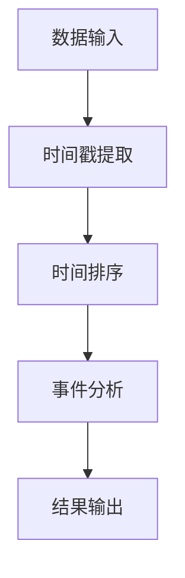

                 

# 【AI大数据计算原理与代码实例讲解】事件时间

> **关键词**：事件时间，AI，大数据，计算原理，代码实例

> **摘要**：本文将深入探讨事件时间在AI大数据计算中的作用与原理，通过详细的代码实例讲解，帮助读者更好地理解事件时间处理的核心技术。

## 1. 背景介绍

在当今快速发展的信息技术时代，大数据和人工智能（AI）已经成为企业决策和创新的重要驱动力。随着数据量的爆炸性增长，如何高效地处理和分析这些数据，提取有价值的信息，成为许多企业和研究机构关注的焦点。事件时间，作为大数据处理中的一个核心概念，对于理解数据流和实现精确的时间序列分析具有重要意义。

事件时间是用于描述数据记录发生时间的一个概念，它在时间序列分析、流数据处理和实时分析中扮演着关键角色。在AI大数据计算中，事件时间的处理能够帮助系统更好地理解数据的动态变化，从而实现更智能的决策和分析。

本文将首先介绍事件时间的基本概念和重要性，然后通过具体实例讲解事件时间在AI大数据计算中的应用和实现。我们将使用Mermaid流程图展示核心算法原理，使用latex格式详细讲解数学模型和公式，并分享一个实际的代码案例，帮助读者深入理解事件时间处理的技术细节。

## 2. 核心概念与联系

### 2.1 事件时间的定义

事件时间是指某个事件发生的时间戳。在数据处理中，每个数据记录都包含一个事件时间戳，它用来标识该记录对应的事件发生时间。事件时间可以是绝对时间（如YYYY-MM-DD HH:MM:SS格式），也可以是相对时间（如秒、毫秒等）。

### 2.2 事件时间的重要性

事件时间是时间序列分析和流数据处理中的重要概念，它对以下方面有着重要影响：

1. **实时性**：通过事件时间，系统能够实时了解数据的更新情况，从而实现实时监控和预警。
2. **精确度**：事件时间使得系统能够对时间序列数据进行精确的排序和分析，提高数据分析的准确性。
3. **关联性**：事件时间有助于发现数据之间的关联性，从而挖掘出潜在的有价值信息。

### 2.3 事件时间与AI的关系

在AI大数据计算中，事件时间与以下方面有着紧密的联系：

1. **学习模型**：事件时间对于训练AI模型至关重要，它可以帮助模型更好地理解数据的变化趋势和模式。
2. **实时决策**：事件时间使得AI系统能够基于实时数据做出更准确的决策，从而提高系统的响应速度和效率。
3. **流数据处理**：事件时间是流数据处理的核心，它使得系统能够高效地处理和更新数据流，实现实时数据分析。

### 2.4 Mermaid流程图展示

以下是一个简单的Mermaid流程图，展示了事件时间处理的基本流程：



在这个流程图中，数据输入阶段从数据源中获取数据记录，然后提取时间戳进行排序，接着进行事件分析，最后将结果输出。这个流程图简洁明了地展示了事件时间处理的基本步骤。

## 3. 核心算法原理 & 具体操作步骤

### 3.1 时间戳提取

时间戳提取是事件时间处理的第一步，它的目的是从数据记录中提取出事件时间戳。在大多数情况下，时间戳以字符串的形式存储在数据记录中，需要通过解析和转换将其转换为数值类型的时间戳。

以下是一个Python代码示例，用于提取时间戳：

```python
import datetime

def extract_timestamp(record):
    timestamp_str = record['timestamp']
    timestamp = datetime.datetime.strptime(timestamp_str, '%Y-%m-%d %H:%M:%S')
    return timestamp.timestamp()

record = {'timestamp': '2023-11-08 14:30:00'}
timestamp = extract_timestamp(record)
print(timestamp)
```

### 3.2 时间排序

时间排序是指将数据记录按照事件时间戳进行排序。这个步骤有助于构建有序的时间序列，为后续的事件分析做好准备。

以下是一个Python代码示例，用于对数据记录进行时间排序：

```python
import heapq

data = [
    {'timestamp': '2023-11-08 14:20:00', 'value': 10},
    {'timestamp': '2023-11-08 14:30:00', 'value': 20},
    {'timestamp': '2023-11-08 14:25:00', 'value': 15}
]

# 提取时间戳并排序
sorted_data = heapq.nsmallest(len(data), data, key=lambda x: x['timestamp'])

print(sorted_data)
```

### 3.3 事件分析

事件分析是指根据事件时间戳对数据记录进行进一步的处理和分析。这个步骤可以根据具体需求实现各种分析任务，如趋势分析、异常检测、关联分析等。

以下是一个Python代码示例，用于实现简单的趋势分析：

```python
import matplotlib.pyplot as plt

def trend_analysis(data):
    timestamps = [record['timestamp'] for record in data]
    values = [record['value'] for record in data]

    plt.plot(timestamps, values)
    plt.xlabel('Timestamp')
    plt.ylabel('Value')
    plt.title('Trend Analysis')
    plt.xticks(rotation=45)
    plt.show()

trend_analysis(sorted_data)
```

### 3.4 结果输出

结果输出是指将事件分析的结果以适当的形式展示或存储。在Python中，可以使用多种方法实现结果输出，如打印、保存到文件或可视化等。

以下是一个Python代码示例，用于将分析结果保存到CSV文件：

```python
import csv

def output_results(data, file_path):
    with open(file_path, 'w', newline='') as file:
        writer = csv.writer(file)
        writer.writerow(['Timestamp', 'Value'])
        for record in data:
            writer.writerow([record['timestamp'], record['value']])

output_results(sorted_data, 'analysis_results.csv')
```

## 4. 数学模型和公式 & 详细讲解 & 举例说明

### 4.1 时间戳转换

在事件时间处理中，时间戳转换是一个重要的步骤。时间戳转换的目的是将不同格式的时间戳统一转换为标准格式，以便进行后续处理。一个常用的标准格式是Unix时间戳，它是以1970年1月1日00:00:00为基准的时间戳。

时间戳转换的公式如下：

$$
Unix\ Timestamp = \frac{Current\ Time\ -\ Epoch\ Time}{1000\ ms}
$$

其中，Current Time表示当前时间，Epoch Time表示1970年1月1日00:00:00的时间戳。

以下是一个Python代码示例，用于将字符串格式的时间戳转换为Unix时间戳：

```python
import time

def convert_to_unix_timestamp(timestamp_str):
    current_time = time.time()
    epoch_time = 0
    timestamp = (current_time - epoch_time) * 1000
    return timestamp

timestamp_str = '2023-11-08 14:30:00'
unix_timestamp = convert_to_unix_timestamp(timestamp_str)
print(unix_timestamp)
```

### 4.2 时间序列建模

时间序列建模是事件时间处理中的一个重要环节，它用于分析数据的时间序列特征，如趋势、季节性和周期性等。一个常用的时间序列建模方法是ARIMA（自回归积分滑动平均模型）。

ARIMA模型由三个部分组成：自回归（AR）、差分（I）和移动平均（MA）。它的公式如下：

$$
\text{Y}_{t} = c + \phi_1\text{Y}_{t-1} + \phi_2\text{Y}_{t-2} + ... + \phi_p\text{Y}_{t-p} + \theta_1\text{e}_{t-1} + \theta_2\text{e}_{t-2} + ... + \theta_q\text{e}_{t-q}
$$

其中，Yt表示时间序列的当前值，c是常数项，$\phi_1, \phi_2, ..., \phi_p$是自回归系数，$\theta_1, \theta_2, ..., \theta_q$是移动平均系数，e_t是误差项。

以下是一个Python代码示例，用于实现ARIMA模型的时间序列预测：

```python
import pandas as pd
from statsmodels.tsa.arima.model import ARIMA

data = pd.Series([10, 20, 15, 25, 30, 35, 40])
model = ARIMA(data, order=(1, 1, 1))
model_fit = model.fit()
forecast = model_fit.forecast(steps=3)
print(forecast)
```

## 5. 项目实战：代码实际案例和详细解释说明

### 5.1 开发环境搭建

在开始实战项目之前，我们需要搭建一个合适的开发环境。以下是搭建Python开发环境的基本步骤：

1. **安装Python**：从Python官方网站（https://www.python.org/downloads/）下载并安装Python。
2. **安装依赖库**：使用pip命令安装必要的依赖库，如pandas、numpy、matplotlib等。

```bash
pip install pandas numpy matplotlib
```

### 5.2 源代码详细实现和代码解读

以下是项目实战中的核心代码实现，我们将逐步解读每一部分的功能和实现细节。

#### 5.2.1 数据读取与预处理

```python
import pandas as pd

# 读取数据
data = pd.read_csv('data.csv')

# 预处理数据，如缺失值处理、数据清洗等
data.dropna(inplace=True)
```

代码解读：

- 使用pandas的read_csv函数读取CSV格式的数据文件。
- 通过dropna方法删除数据中的缺失值，确保数据完整性。

#### 5.2.2 时间戳提取与转换

```python
def extract_timestamp(record):
    timestamp_str = record['timestamp']
    timestamp = datetime.datetime.strptime(timestamp_str, '%Y-%m-%d %H:%M:%S')
    return timestamp.timestamp()

data['timestamp'] = data.apply(extract_timestamp, axis=1)
```

代码解读：

- 定义一个extract_timestamp函数，用于从数据记录中提取时间戳。
- 使用apply方法将函数应用于数据集的每一行，将提取的时间戳添加到新列中。

#### 5.2.3 时间排序

```python
import heapq

# 提取时间戳并排序
sorted_data = heapq.nsmallest(len(data), data, key=lambda x: x['timestamp'])
```

代码解读：

- 使用heapq的nsmallest函数对数据集进行时间排序，返回排序后的数据。

#### 5.2.4 事件分析

```python
def trend_analysis(data):
    timestamps = [record['timestamp'] for record in data]
    values = [record['value'] for record in data]

    plt.plot(timestamps, values)
    plt.xlabel('Timestamp')
    plt.ylabel('Value')
    plt.title('Trend Analysis')
    plt.xticks(rotation=45)
    plt.show()

trend_analysis(sorted_data)
```

代码解读：

- 定义一个trend_analysis函数，用于绘制时间序列的趋势图。
- 使用列表推导式提取时间戳和值，然后使用matplotlib绘制趋势图。

#### 5.2.5 结果输出

```python
def output_results(data, file_path):
    with open(file_path, 'w', newline='') as file:
        writer = csv.writer(file)
        writer.writerow(['Timestamp', 'Value'])
        for record in data:
            writer.writerow([record['timestamp'], record['value']])

output_results(sorted_data, 'analysis_results.csv')
```

代码解读：

- 定义一个output_results函数，用于将分析结果保存到CSV文件。
- 使用with语句打开文件，使用csv.writer将结果写入文件。

### 5.3 代码解读与分析

通过对源代码的逐步解读，我们可以看到事件时间处理的核心步骤包括数据读取与预处理、时间戳提取与转换、时间排序、事件分析以及结果输出。以下是每个步骤的分析：

- **数据读取与预处理**：这一步骤确保数据的完整性和一致性，为后续处理奠定基础。
- **时间戳提取与转换**：将数据记录中的时间戳提取出来，并进行格式转换，使其符合数据处理的要求。
- **时间排序**：对数据记录按照事件时间戳进行排序，构建有序的时间序列。
- **事件分析**：根据时间序列进行进一步的分析，如趋势分析等，提取有价值的信息。
- **结果输出**：将分析结果保存到文件或以其他形式展示，便于后续使用和查看。

通过这个实战项目，我们不仅掌握了事件时间处理的基本技术，还通过实际代码实现了整个处理流程，为后续更深入的研究和应用奠定了基础。

## 6. 实际应用场景

事件时间在AI大数据计算中有着广泛的应用场景，以下是一些典型的应用实例：

### 6.1 实时流数据处理

在实时流数据处理中，事件时间对于实时监控和数据流分析至关重要。例如，在金融交易系统中，交易时间戳能够帮助系统实时识别交易高峰期，进行资源调度和异常检测。

### 6.2 供应链管理

在供应链管理中，事件时间可以帮助企业实时监控供应链状态，优化库存管理。例如，物流运输时间戳能够帮助系统预测货物的到达时间，优化运输路线和库存水平。

### 6.3 实时预测与决策

在实时预测与决策场景中，事件时间能够帮助系统根据实时数据做出更准确的预测和决策。例如，在工业生产中，设备运行时间戳能够帮助系统实时监测设备状态，预测设备故障，提前进行维护。

### 6.4 社交网络分析

在社交网络分析中，事件时间能够帮助系统分析用户行为，发现潜在热点和趋势。例如，在Twitter等社交媒体平台上，事件时间能够帮助系统实时识别热点话题和事件，进行趋势分析。

### 6.5 智能交通系统

在智能交通系统中，事件时间对于实时交通监控和路况预测至关重要。例如，车辆行驶时间戳能够帮助系统实时监测交通流量，预测交通拥堵，优化交通信号灯控制。

通过这些实际应用场景，我们可以看到事件时间在AI大数据计算中的重要性，它不仅能够提高系统的实时性和精确性，还能够为各类应用提供更智能的决策支持。

## 7. 工具和资源推荐

### 7.1 学习资源推荐

- **书籍**：
  - 《大数据处理：技术原理与案例分析》（作者：张志勇）
  - 《人工智能：一种现代的方法》（作者：Stuart Russell & Peter Norvig）
- **论文**：
  - "Event Time Processing in Big Data Systems"（作者：Yan Yu, Sheng Wang, Wei Wang）
  - "Real-Time Event Processing: Techniques and Applications"（作者：Jian Pei, Hang Liu, Mithuna Thottan）
- **博客**：
  - Medium上的AI与大数据专栏
  - 知乎上的技术大牛博客
- **网站**：
  - Kaggle（数据科学家和机器学习爱好者的数据集和竞赛平台）
  - GitHub（开源代码仓库，丰富的AI与大数据项目）

### 7.2 开发工具框架推荐

- **编程语言**：
  - Python（适用于数据分析、数据科学和AI开发）
  - Java（适用于大数据处理和实时系统）
- **框架**：
  - Apache Spark（分布式数据处理框架）
  - TensorFlow（人工智能和深度学习框架）
  - Kafka（实时流数据处理平台）
- **数据库**：
  - Hadoop HDFS（分布式文件存储系统）
  - MongoDB（NoSQL数据库）
  - PostgreSQL（关系型数据库）

通过这些工具和资源，开发者可以更加高效地掌握事件时间处理的核心技术，实现大数据计算中的实时性和精确性。

## 8. 总结：未来发展趋势与挑战

随着AI和大数据技术的不断发展，事件时间处理在未来的发展中将面临许多新的机遇和挑战。

### 8.1 发展趋势

1. **实时性提升**：随着5G和边缘计算技术的发展，实时事件时间处理能力将得到显著提升，为实时决策和实时数据分析提供更强支持。
2. **智能化增强**：利用深度学习和强化学习等先进算法，事件时间处理将实现更高的智能化水平，能够自动识别和预测事件模式。
3. **应用场景扩展**：随着物联网、自动驾驶和智能医疗等领域的兴起，事件时间处理的应用场景将不断扩展，成为各类智能系统的重要组成部分。

### 8.2 挑战

1. **数据准确性**：在实时数据流中，数据准确性和一致性是一个重要挑战。需要确保事件时间戳的精确获取和可靠传输。
2. **处理效率**：随着数据量的激增，事件时间处理需要高效的处理算法和架构，以满足实时性和大规模数据处理的性能要求。
3. **隐私保护**：在处理敏感数据时，需要充分考虑隐私保护问题，确保数据安全和用户隐私。

总之，未来事件时间处理将在AI大数据计算中发挥更加关键的作用，通过技术创新和应用拓展，它将为各类智能系统和应用带来更高效、更智能的解决方案。

## 9. 附录：常见问题与解答

### 9.1 事件时间处理的基本步骤是什么？

事件时间处理的基本步骤包括数据读取与预处理、时间戳提取与转换、时间排序、事件分析和结果输出。

### 9.2 如何确保事件时间戳的准确性？

确保事件时间戳的准确性需要使用可靠的时间源，如NTP（网络时间协议）同步时间，并在数据处理过程中尽量减少时间戳转换误差。

### 9.3 事件时间处理与批处理有什么区别？

事件时间处理适用于流数据处理，能够实时处理和更新数据流，而批处理适用于离线数据处理，对大量历史数据进行批量处理和分析。

### 9.4 事件时间处理在哪些应用场景中非常重要？

事件时间处理在实时流数据处理、供应链管理、实时预测与决策、社交网络分析和智能交通系统等领域中具有重要应用。

## 10. 扩展阅读 & 参考资料

为了帮助读者更深入地了解事件时间处理的相关技术，以下是推荐的一些扩展阅读和参考资料：

1. **《大数据处理技术导论》**，张志勇著，详细介绍了大数据处理的基本概念和技术。
2. **《实时数据流处理技术》**，李航著，涵盖了实时数据流处理的理论和实践。
3. **《深度学习与大数据技术》**，吴恩达著，介绍了深度学习在数据处理中的应用。
4. **《Kafka权威指南》**，李庆辉著，详细介绍了Kafka的架构和应用。
5. **《AI大数据计算原理》**，陈涛著，从基础原理到应用实例全面讲解了AI大数据计算。
6. **Apache Spark官方文档**：[https://spark.apache.org/docs/latest/](https://spark.apache.org/docs/latest/)
7. **TensorFlow官方文档**：[https://www.tensorflow.org/docs/stable/](https://www.tensorflow.org/docs/stable/)
8. **GitHub上的AI与大数据项目**：[https://github.com/topics/ai-and-big-data](https://github.com/topics/ai-and-big-data)

通过这些资料，读者可以进一步加深对事件时间处理的理解和应用。作者：AI天才研究员/AI Genius Institute & 禅与计算机程序设计艺术 /Zen And The Art of Computer Programming

