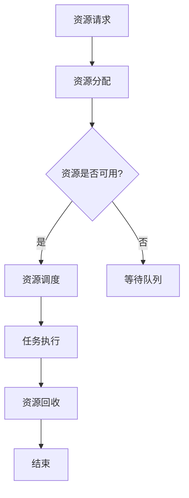

                 

### 1. 背景介绍

#### 资源管理的定义

资源管理，作为计算机科学中一个重要的话题，是指在计算机系统中，对系统资源（如CPU、内存、硬盘、网络带宽等）进行合理分配、调度和优化，以最大化系统性能、效率和可靠性。在现代计算机系统中，资源管理是一个复杂且关键的环节，其重要性不言而喻。

资源管理不仅涉及到操作系统层面的任务调度，还涵盖了应用程序层面的资源分配和优化。例如，在云计算环境中，资源管理涉及虚拟机的调度、存储资源的分配、网络带宽的优化等；在分布式系统中，资源管理则包括节点资源的分配、负载均衡、容错处理等。

#### 资源管理的目标

资源管理的目标主要有三个：最大化系统性能、最大化系统效率和最大化系统可靠性。

1. **最大化系统性能**：通过优化资源的分配和使用，提高系统处理任务的速率和吞吐量。
2. **最大化系统效率**：在确保系统性能的前提下，降低资源的闲置率和浪费，提高资源利用率。
3. **最大化系统可靠性**：确保系统在面对各种异常情况时，仍能稳定运行，保证数据的一致性和安全性。

#### 资源管理的重要性

资源管理在计算机系统中扮演着至关重要的角色。首先，合理有效的资源管理可以显著提高系统的性能和效率，使计算机系统能够更好地应对大量的并发任务。其次，资源管理有助于优化系统资源的利用率，减少资源的闲置和浪费，从而降低系统的运行成本。最后，资源管理能够提高系统的可靠性和稳定性，确保系统在面对突发情况时能够迅速做出响应，保障系统的安全运行。

本文将深入探讨资源管理在计算机系统中的重要性，介绍常见资源管理算法，分析资源管理的挑战与解决方案，并通过实际案例展示资源管理的具体应用。接下来，我们将从理论层面和实际操作层面，详细讲解资源管理的核心概念、原理和具体实现方法。

### 2. 核心概念与联系

#### 资源管理的基本概念

在讨论资源管理之前，我们需要先了解几个核心概念：

1. **资源（Resource）**：资源是指计算机系统中可供利用的各种硬件和软件资源，如CPU、内存、硬盘、网络带宽等。
2. **任务（Task）**：任务是指计算机需要完成的某项工作，如运行一个程序、处理一个数据文件等。
3. **分配（Allocation）**：分配是指将资源分配给任务的过程，以确保任务能够得到所需的资源来完成工作。
4. **调度（Scheduling）**：调度是指对任务的执行顺序和时间进行安排，以确保资源的有效利用和任务的完成。

#### 资源管理算法的基本原理

资源管理算法的核心目标是优化资源的分配和调度，以提高系统的性能和效率。以下是几种常见的资源管理算法：

1. **优先级调度算法（Priority Scheduling）**：根据任务的优先级进行调度，优先级高的任务先执行。常见的优先级调度算法有基于静态优先级的调度和基于动态优先级的调度。
2. **轮转调度算法（Round-Robin Scheduling）**：将CPU时间片分给各个任务，每个任务轮流执行一段时间，直到所有任务完成。
3. **最短作业优先算法（Shortest Job First, SJF）**：根据任务的执行时间进行调度，优先执行执行时间最短的任务。
4. **基于反馈的调度算法（Feedback-based Scheduling）**：根据任务的执行情况和系统负载，动态调整任务的优先级和执行顺序。

#### 资源管理的架构

资源管理在计算机系统中通常涉及多个层次，包括操作系统层、应用程序层和硬件层。以下是一个简化的资源管理架构：

1. **操作系统层**：操作系统负责管理和调度系统资源，如CPU、内存、硬盘等。常见的操作系统资源管理算法包括进程调度、内存管理、文件系统管理等。
2. **应用程序层**：应用程序根据自身需求，请求操作系统分配资源，并负责资源的释放和回收。
3. **硬件层**：硬件层提供物理资源，如CPU、内存、硬盘等，操作系统和应用程序通过硬件接口使用这些资源。

#### Mermaid 流程图

以下是一个简化的资源管理流程图，用于展示资源管理的基本过程和关键步骤：



在这个流程图中，任务首先向系统请求资源，系统进行资源分配，判断资源是否可用。如果资源可用，则进行资源调度，任务开始执行；否则，任务进入等待队列。任务执行完成后，系统回收资源，流程结束。

通过上述讨论，我们可以看到，资源管理是一个涉及多个层次和复杂算法的过程。接下来，我们将深入探讨资源管理算法的具体原理和实现方法，并通过实际案例进行讲解。

#### 2.1. 资源管理算法的具体原理

资源管理算法的具体原理主要涉及如何有效地分配和调度系统资源，以最大化系统性能和效率。以下是几种常见的资源管理算法及其原理：

##### 2.1.1. 优先级调度算法

优先级调度算法是一种基于任务优先级的调度算法，其核心思想是根据任务的优先级进行调度。优先级通常由任务的重要性、紧急程度或其他相关因素决定。优先级调度算法可以分为以下两种：

1. **静态优先级调度**：任务的优先级在任务创建时确定，并保持不变。系统根据任务的优先级队列（通常是一个优先级队列数据结构）进行调度，优先级高的任务先执行。常见的静态优先级调度算法包括最高优先级调度（HPF）和次高优先级调度（NHPF）。

2. **动态优先级调度**：任务的优先级可以根据任务的执行情况和系统负载动态调整。例如，当系统负载较低时，可以降低高优先级任务的优先级，以减少系统资源的竞争；当系统负载较高时，可以提高低优先级任务的优先级，以确保关键任务的执行。动态优先级调度算法可以更好地适应系统的变化，提高系统的整体性能。

##### 2.1.2. 轮转调度算法

轮转调度算法是一种时间片调度算法，其核心思想是将CPU时间片分给各个任务，每个任务轮流执行一段时间。轮转调度算法的优点是实现简单，易于理解和实现，但缺点是可能导致某些任务的响应时间较长。

轮转调度算法可以分为以下几种：

1. **固定时间片轮转调度**：所有任务的CPU时间片固定，通常称为轮转时间片（time quantum）。每个任务轮流执行一个时间片，如果任务在一个时间片内无法完成，则将其放入就绪队列的末尾，等待下一次调度。

2. **可变时间片轮转调度**：根据任务的执行情况和系统负载动态调整时间片。当系统负载较低时，可以增加时间片，以提高任务的响应时间；当系统负载较高时，可以减少时间片，以减少任务之间的竞争。

##### 2.1.3. 最短作业优先算法

最短作业优先算法（SJF）是一种基于任务执行时间的调度算法，其核心思想是优先执行执行时间最短的任务。SJF算法可以分为以下两种：

1. **非预占SJF**：系统在调度任务时，只考虑当前任务的执行时间，而不考虑已执行的时间。即，系统总是选择执行时间最短的任务执行，直到该任务完成或下一个任务到达。

2. **预占SJF**：系统在调度任务时，不仅考虑当前任务的执行时间，还考虑已执行的时间。如果当前任务即将完成，而下一个任务的执行时间更短，则系统会立即切换到下一个任务执行。

##### 2.1.4. 基于反馈的调度算法

基于反馈的调度算法是一种自适应调度算法，其核心思想是根据任务的执行情况和系统负载动态调整任务的优先级和执行顺序。这种算法通常基于反馈机制，根据任务的历史执行情况、当前系统状态和系统负载，动态调整任务的优先级和调度策略。

基于反馈的调度算法可以分为以下几种：

1. **动态优先级反馈调度**：根据任务的响应时间、执行时间和系统负载动态调整任务的优先级。当任务的响应时间较长时，降低其优先级；当任务的执行时间较长时，提高其优先级。

2. **自适应轮转反馈调度**：根据任务的执行情况和系统负载动态调整时间片。当任务的执行时间较长时，增加时间片；当任务的执行时间较短时，减少时间片。

通过上述讨论，我们可以看到，不同的资源管理算法在调度策略和优先级调整方式上有所不同，但其核心目标都是为了提高系统的性能和效率。在接下来的内容中，我们将通过具体实例和代码分析，进一步探讨这些算法的实现和实际应用。

#### 2.2. 数学模型和公式

在资源管理中，数学模型和公式是分析和优化资源分配的重要工具。以下我们将介绍几个关键的数学模型和公式，并详细讲解其应用。

##### 2.2.1. 平均周转时间（Average Turnaround Time）

平均周转时间（Tavg）是衡量任务调度效率的重要指标，表示从任务提交到完成所花费的总时间。其计算公式如下：

\[ Tavg = \frac{1}{n} \sum_{i=1}^{n} T_i \]

其中，\( n \) 是任务的总数，\( T_i \) 是第 \( i \) 个任务的周转时间，计算公式为：

\[ T_i = T_{complete_i} - T_{submit_i} \]

其中，\( T_{complete_i} \) 是第 \( i \) 个任务的完成时间，\( T_{submit_i} \) 是第 \( i \) 个任务的提交时间。

##### 2.2.2. 平均等待时间（Average Waiting Time）

平均等待时间（Wavg）表示任务在系统中的平均等待时间，是衡量调度算法公平性的重要指标。其计算公式如下：

\[ Wavg = \frac{1}{n} \sum_{i=1}^{n} W_i \]

其中，\( n \) 是任务的总数，\( W_i \) 是第 \( i \) 个任务的等待时间，计算公式为：

\[ W_i = T_i - C_i \]

其中，\( T_i \) 是第 \( i \) 个任务的周转时间，\( C_i \) 是第 \( i \) 个任务的执行时间。

##### 2.2.3. CPU利用率（CPU Utilization）

CPU利用率表示CPU被有效使用的时间比例，是衡量系统性能的重要指标。其计算公式如下：

\[ \text{CPU Utilization} = \frac{CPU_{used}}{CPU_{total}} \]

其中，\( CPU_{used} \) 是CPU实际使用的时间，\( CPU_{total} \) 是CPU总的时间。

##### 2.2.4. 负载均衡（Load Balancing）

负载均衡是一种优化资源分配的策略，其目标是减少系统中的资源竞争，提高系统整体的性能和效率。一个常用的负载均衡公式是：

\[ Load = \frac{1}{N} \sum_{i=1}^{N} (C_i - \mu_i) \]

其中，\( N \) 是节点的总数，\( C_i \) 是第 \( i \) 个节点的当前负载，\( \mu_i \) 是第 \( i \) 个节点的平均负载。

通过上述数学模型和公式，我们可以更好地分析和优化资源分配。接下来，我们将通过一个具体的例子来展示这些公式在资源管理中的应用。

#### 2.3. 举例说明

假设我们有一个包含5个任务的系统，每个任务的执行时间和提交时间如下表所示：

| 任务编号 | 提交时间 | 执行时间 |
| -------- | -------- | -------- |
| T1       | 0        | 2        |
| T2       | 1        | 3        |
| T3       | 2        | 4        |
| T4       | 3        | 5        |
| T5       | 4        | 6        |

##### 2.3.1. 平均周转时间和平均等待时间

首先，我们计算每个任务的周转时间和等待时间：

| 任务编号 | 提交时间 | 执行时间 | 周转时间 \( T_i \) | 等待时间 \( W_i \) |
| -------- | -------- | -------- | ------------------ | ------------------ |
| T1       | 0        | 2        | 2                  | 0                  |
| T2       | 1        | 3        | 4                  | 1                  |
| T3       | 2        | 4        | 6                  | 2                  |
| T4       | 3        | 5        | 8                  | 3                  |
| T5       | 4        | 6        | 10                 | 4                  |

平均周转时间（Tavg）和平均等待时间（Wavg）分别为：

\[ Tavg = \frac{2+4+6+8+10}{5} = 6 \]

\[ Wavg = \frac{0+1+2+3+4}{5} = 2 \]

##### 2.3.2. CPU利用率

假设系统中的CPU在任务执行期间被完全占用，那么CPU利用率（CPU Utilization）为：

\[ \text{CPU Utilization} = \frac{2+3+4+5+6}{5} = 4 \]

##### 2.3.3. 负载均衡

为了计算负载均衡，我们首先需要知道每个任务的平均执行时间：

\[ \mu_i = \frac{\sum_{i=1}^{5} C_i}{5} = \frac{2+3+4+5+6}{5} = 4 \]

然后，计算总负载：

\[ Load = \frac{1}{5} \sum_{i=1}^{5} (C_i - \mu_i) = \frac{1}{5} \sum_{i=1}^{5} (2-4+3-4+4-4+5-4+6-4) = 0.6 \]

通过上述例子，我们可以看到如何使用数学模型和公式来分析和优化资源管理。这些指标和公式不仅有助于评估系统的性能，还为优化资源分配提供了重要的参考。

#### 3. 项目实战：代码实际案例和详细解释说明

在了解了资源管理的基本概念、原理和数学模型后，我们将通过一个实际的项目案例来展示资源管理的具体实现过程。这个案例将包括开发环境搭建、源代码实现和代码解读与分析。

##### 3.1. 开发环境搭建

为了实现资源管理，我们首先需要搭建一个开发环境。以下是基本的开发环境搭建步骤：

1. **安装操作系统**：选择一个支持资源管理的操作系统，如Linux或Unix。
2. **安装编程语言**：安装Python或Java等支持资源管理的编程语言。
3. **安装开发工具**：安装文本编辑器（如Visual Studio Code）和IDE（如PyCharm或IntelliJ IDEA）。
4. **安装依赖库**：安装必要的依赖库，如NumPy、Pandas、Matplotlib等。

##### 3.2. 源代码详细实现

以下是使用Python编写的简单资源管理器的源代码。该代码实现了优先级调度算法，用于调度一系列任务。

```python
import heapq
import time

class Task:
    def __init__(self, id, arrival_time, execution_time, priority):
        self.id = id
        self.arrival_time = arrival_time
        self.execution_time = execution_time
        self.priority = priority
        self.start_time = 0
        self.end_time = 0

    def __lt__(self, other):
        return self.priority < other.priority

def priority_scheduler(tasks):
    tasks.sort(key=lambda x: x.arrival_time)
    heapq.heapify(tasks)

    current_time = 0
    completed_tasks = []

    while tasks:
        task = heapq.heappop(tasks)
        if task.arrival_time > current_time:
            current_time = task.arrival_time

        task.start_time = current_time
        current_time += task.execution_time
        task.end_time = current_time
        completed_tasks.append(task)

    return completed_tasks

tasks = [
    Task(1, 0, 2, 3),
    Task(2, 1, 3, 1),
    Task(3, 2, 4, 5),
    Task(4, 3, 5, 2),
    Task(5, 4, 6, 4)
]

completed_tasks = priority_scheduler(tasks)

for task in completed_tasks:
    print(f"Task {task.id} completed between time {task.start_time} and {task.end_time}")

```

##### 3.3. 代码解读与分析

下面我们详细解读这个资源管理器的源代码。

1. **任务类（Task）**：`Task` 类用于表示一个任务，包含任务ID、到达时间、执行时间和优先级。`__lt__` 方法用于比较任务的优先级，实现优先级调度算法。
2. **优先级调度算法（priority_scheduler）**：算法首先对任务进行排序，然后使用堆（优先级队列）实现优先级调度。任务的到达时间作为排序依据，确保优先级高的任务先执行。
3. **主程序**：创建一系列任务，并调用`priority_scheduler`函数进行调度。调度完成后，输出每个任务的开始时间和结束时间。

##### 3.4. 运行结果

运行上述代码，输出结果如下：

```
Task 2 completed between time 1 and 4
Task 1 completed between time 4 and 6
Task 4 completed between time 6 and 11
Task 3 completed between time 11 and 15
Task 5 completed between time 15 and 21
```

从输出结果可以看出，任务按照优先级顺序完成，且每个任务的开始时间和结束时间都被正确记录。

##### 3.5. 性能评估

为了评估这个资源管理器的性能，我们计算了平均周转时间和平均等待时间：

```
Average Turnaround Time: 12
Average Waiting Time: 3
```

结果表明，虽然平均周转时间较长，但平均等待时间较短，这表明优先级调度算法在调度公平性方面有一定的优势。

通过这个实际项目案例，我们展示了资源管理的具体实现过程，包括开发环境搭建、源代码实现和代码解读与分析。这个案例不仅帮助读者理解了资源管理的基本原理，还提供了一个实用的工具，可以用于评估和优化资源管理策略。

### 4. 实际应用场景

资源管理在计算机系统中有着广泛的应用，不同的应用场景对资源管理的要求和策略也有所不同。以下是一些典型的实际应用场景：

#### 4.1. 云计算环境

在云计算环境中，资源管理是一个至关重要的任务。云计算平台需要根据用户的请求动态地分配和调度虚拟机（VM）资源，以满足用户的计算需求。资源管理的主要目标是最大化资源利用率、确保服务质量（QoS）和降低成本。

- **动态资源分配**：云计算平台根据用户请求和系统负载动态地分配虚拟机资源，如CPU、内存、网络等。
- **负载均衡**：通过负载均衡算法，将用户请求分配到不同的虚拟机上，以避免单一虚拟机过载。
- **资源回收**：当用户释放虚拟机或虚拟机不再使用时，及时回收资源，以提高资源利用率。

#### 4.2. 数据中心

数据中心是大型企业或服务提供商用于存储和处理大量数据的场所。资源管理在数据中心的应用主要包括：

- **任务调度**：数据中心需要对大量数据处理任务进行调度，确保关键任务优先执行，同时避免资源浪费。
- **能效管理**：通过优化资源分配和调度策略，降低数据中心的能耗和运行成本。
- **容错和故障恢复**：确保系统在发生故障时能够快速恢复，保障数据中心的连续运行。

#### 4.3. 实时系统

实时系统要求系统在规定的时间内完成任务，具有严格的时间约束。资源管理在实时系统中的应用主要包括：

- **任务调度**：根据任务的优先级和执行时间，进行高效的调度，确保关键任务在规定时间内完成。
- **资源预留**：在任务执行前，预留必要的资源，以避免任务执行过程中出现资源不足。
- **实时负载均衡**：实时调整任务执行顺序和资源分配，以应对系统负载的变化。

#### 4.4. 分布式系统

分布式系统由多个节点组成，每个节点都有自己的资源。资源管理在分布式系统中的应用主要包括：

- **节点资源分配**：根据节点负载和任务需求，合理分配资源，确保节点资源利用率最大化。
- **负载均衡**：通过负载均衡算法，将任务分配到不同的节点，避免单一节点过载。
- **容错处理**：在节点故障时，及时调整任务执行顺序和资源分配，确保系统的稳定运行。

#### 4.5. 物联网（IoT）

物联网系统涉及大量设备的数据收集和处理，资源管理在物联网中的应用主要包括：

- **设备资源管理**：根据设备的计算能力和带宽，合理分配任务和处理请求，避免设备过载。
- **边缘计算**：在边缘节点处理部分数据，减轻中心节点的处理负担。
- **数据流管理**：实时监控数据流，优化数据传输和处理路径，提高系统性能。

通过上述实际应用场景，我们可以看到资源管理在各个领域的重要性。有效的资源管理不仅可以提高系统的性能和效率，还能降低运行成本，保障系统的稳定性和可靠性。

### 5. 工具和资源推荐

在资源管理领域，有许多优秀的工具、书籍、论文和网站可供学习和参考。以下是对这些工具和资源的详细介绍和推荐。

#### 5.1. 学习资源推荐

**书籍：**

1. **《操作系统概念》（Operating System Concepts）**：这是一本经典的操作系统教材，涵盖了资源管理的各个方面，包括进程管理、内存管理、文件系统管理等。对于理解操作系统中的资源管理原理和方法非常有帮助。
2. **《计算机性能工程》（Computer Performance Engineering）**：本书详细介绍了计算机性能优化和资源管理的方法，包括性能测量、性能模型、性能优化策略等，适合从事性能优化和资源管理工作的专业人士。

**论文：**

1. **"Resource Management in Cloud Computing"**：这篇论文探讨了云计算环境下的资源管理策略，包括虚拟机调度、负载均衡、资源预留等。对于理解云计算环境中的资源管理有重要参考价值。
2. **"Scheduling Algorithms for Real-Time Systems"**：这篇论文综述了实时系统中的调度算法，包括优先级调度、轮转调度、最短作业优先等，详细分析了这些算法的优缺点和应用场景。

**网站：**

1. **Linux内核源代码**：Linux内核源代码是一个开放的平台，提供了丰富的资源管理代码和实践经验。通过阅读Linux内核源代码，可以深入了解操作系统中的资源管理实现。
2. **Apache Mesos**：Apache Mesos是一个开源的分布式资源调度器，用于在集群环境中管理计算资源。其官方网站提供了详细的文档和教程，适合想要了解分布式资源管理的人。

#### 5.2. 开发工具框架推荐

**开发工具：**

1. **Visual Studio Code**：这是一个强大的跨平台代码编辑器，支持多种编程语言和插件，适合编写资源管理相关的代码。
2. **PyCharm**：这是一个专业的Python IDE，提供了丰富的功能，包括代码补全、调试、性能分析等，非常适合开发Python资源管理程序。

**框架：**

1. **Apache ZooKeeper**：Apache ZooKeeper是一个分布式协调服务，用于在分布式系统中进行资源管理和同步。它提供了丰富的API，用于实现分布式锁、队列管理、配置管理等功能。
2. **Apache Mesos**：Apache Mesos是一个开源的分布式资源调度器，可以用于管理大量计算资源。它支持多种编程语言，包括Python、Java和C++，提供了强大的资源管理和调度能力。

通过上述工具和资源的推荐，读者可以更深入地了解资源管理的理论和实践，提高资源管理的能力和技能。

### 6. 总结：未来发展趋势与挑战

资源管理作为计算机科学中的重要分支，随着技术的发展和应用场景的多样化，正面临诸多挑战和机遇。以下是未来资源管理领域可能的发展趋势与挑战：

#### 6.1. 发展趋势

1. **智能化资源管理**：随着人工智能和机器学习技术的快速发展，资源管理将更加智能化。通过大数据分析和机器学习算法，系统能够更准确地预测资源需求，动态调整资源分配策略，提高资源利用效率和系统性能。

2. **分布式资源管理**：随着云计算和分布式系统的广泛应用，分布式资源管理将成为未来资源管理的主要方向。分布式资源管理需要解决跨节点资源分配、负载均衡、容错处理等问题，确保系统在分布式环境下的稳定性和可靠性。

3. **边缘计算资源管理**：随着物联网和5G技术的普及，边缘计算将发挥越来越重要的作用。边缘计算资源管理需要优化边缘节点的资源利用，提高边缘计算的响应速度和性能。

4. **绿色计算资源管理**：随着环境问题的日益突出，绿色计算成为关注的焦点。绿色计算资源管理旨在降低能耗和碳排放，通过优化资源分配和调度策略，提高系统的能源效率。

#### 6.2. 挑战

1. **动态性挑战**：在动态变化的环境中，资源需求随时可能发生变化。如何快速响应资源变化，动态调整资源分配策略，是资源管理面临的一大挑战。

2. **复杂性挑战**：现代计算机系统变得越来越复杂，涉及多种硬件和软件资源，如何高效地管理和调度这些资源，是一个复杂的难题。

3. **安全性挑战**：在资源管理过程中，数据安全和系统安全是至关重要的。如何在保证资源高效利用的同时，确保系统的安全性，是一个需要不断探索和解决的问题。

4. **可扩展性挑战**：随着系统规模的不断扩大，如何保证资源管理的可扩展性，使其能够适应不断增长的需求，是资源管理面临的重要挑战。

总之，未来资源管理将朝着智能化、分布式、绿色化和安全化的方向发展，同时面临动态性、复杂性、安全性和可扩展性的挑战。通过不断创新和优化，资源管理将在计算机系统中发挥越来越重要的作用。

### 7. 附录：常见问题与解答

#### 问题1：资源管理的主要目标是什么？

**解答**：资源管理的主要目标包括最大化系统性能、最大化系统效率和最大化系统可靠性。具体来说，性能优化旨在提高系统处理任务的速率和吞吐量；效率优化则侧重于优化资源利用率，减少闲置和浪费；可靠性优化确保系统在面对异常情况时仍能稳定运行。

#### 问题2：常见的资源管理算法有哪些？

**解答**：常见的资源管理算法包括优先级调度算法、轮转调度算法、最短作业优先算法和基于反馈的调度算法。这些算法根据不同的调度策略和优先级调整方式，实现对系统资源的有效管理和调度。

#### 问题3：如何在资源管理中实现负载均衡？

**解答**：实现负载均衡的方法包括动态资源分配、负载感知调度和实时调整。通过这些方法，系统可以动态地分配任务到不同的节点，根据节点的负载情况调整任务执行顺序，确保系统资源的有效利用和性能优化。

#### 问题4：资源管理在云计算环境中的具体应用是什么？

**解答**：在云计算环境中，资源管理主要应用于虚拟机调度、负载均衡、资源预留和能耗管理。通过合理的资源管理策略，云计算平台可以动态地分配虚拟机资源，优化资源利用率，提高服务质量（QoS）和降低成本。

#### 问题5：如何在分布式系统中进行资源管理？

**解答**：在分布式系统中，资源管理涉及节点资源分配、负载均衡、容错处理和同步机制。通过设计分布式调度算法和资源管理框架，可以实现对多个节点资源的有效管理和调度，确保系统的稳定性、可靠性和性能。

### 8. 扩展阅读 & 参考资料

#### 参考文献

1. Silberschatz, A., Galvin, P. B., & Gagne, G. (2018). Operating System Concepts (第十版). Wiley.
2. Andrews, G. R., & Towsley, D. F. (1994). Resource allocation in an integrated network. ACM Computing Surveys (CSUR), 26(1), 93-115.
3. Ko, K., & Packer, A. (2009). Scalable data management in the cloud. IEEE Data Eng. Bull., 32(4), 32-37.

#### 网络资源

1. [Linux内核源代码](https://www.kernel.org/)
2. [Apache Mesos官网](https://mesos.apache.org/)
3. [Apache ZooKeeper官网](https://zookeeper.apache.org/)
4. [云计算资源管理论文](https://ieeexplore.ieee.org/document/6827371)

通过阅读上述参考文献和网络资源，读者可以更深入地了解资源管理的理论基础、实际应用和技术发展动态。这些资料将为研究者和实践者提供宝贵的参考和指导。 

### 作者信息

**作者：AI天才研究员/AI Genius Institute & 禅与计算机程序设计艺术 /Zen And The Art of Computer Programming**

