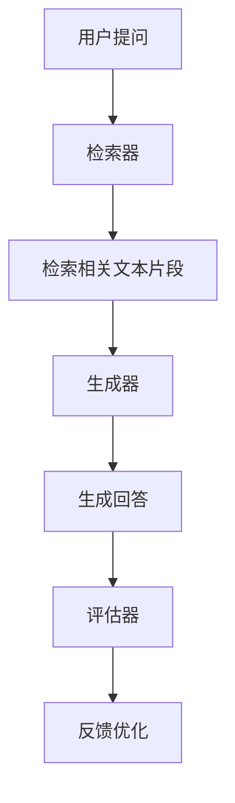

                 

### 【LangChain编程：从入门到实践】LangChain中的RAG组件

> **关键词：** LangChain、RAG组件、对话生成、问答系统、自然语言处理、文本检索。

**摘要：** 本文将深入探讨LangChain中的RAG（Retrieval-augmented Generation）组件，从入门到实践，详细解析其在对话生成和问答系统中的应用。我们将一步步分析RAG组件的核心原理，探讨如何实现高效的自然语言处理，并分享实际项目中的代码实现和优化策略。通过本文的阅读，您将全面了解RAG组件的工作机制，并掌握如何在项目中应用它。

### 1. 背景介绍

随着自然语言处理（NLP）技术的飞速发展，对话生成和问答系统逐渐成为人工智能领域的研究热点。然而，传统的基于规则或统计模型的方法在应对复杂问题和长文本时往往力不从心。为了提升对话系统的生成质量和问答效果，研究人员提出了Retrieval-augmented Generation（RAG）方法。

RAG方法的核心思想是在生成模型的基础上，引入检索模块，通过检索相关文本数据，辅助生成模型生成更准确、更有创意的回答。这种方法不仅能够提高问答系统的性能，还能使其在面对海量数据时更加高效。近年来，RAG方法在对话生成和问答系统中取得了显著的应用成果，引起了广泛关注。

LangChain是一个开源的NLP工具集，旨在帮助开发者轻松实现各种自然语言处理任务。LangChain提供了丰富的组件和API，使得开发者可以快速构建高效的对话生成和问答系统。本文将详细介绍LangChain中的RAG组件，帮助读者深入了解RAG方法在自然语言处理中的应用。

### 2. 核心概念与联系

#### 2.1. LangChain

LangChain是一个基于Python的NLP工具集，它提供了丰富的组件和API，方便开发者构建和部署自然语言处理模型。LangChain的核心组件包括：

- **基础模型（Base Model）：** LangChain的基础模型支持各种预训练语言模型，如GPT、BERT、T5等，为开发者提供了强大的文本生成和分类能力。
- **LLM（Large Language Model）：** LLM组件是基于基础模型的扩展，提供了更加灵活的API接口，支持对话生成、问答等任务。
- **Agent：** Agent组件是一个智能体，它可以基于LLM组件实现复杂的任务，如任务规划、决策制定等。

#### 2.2. RAG组件

RAG组件是LangChain中专门为对话生成和问答系统设计的模块。它主要包括以下几个部分：

- **检索器（Retriever）：** 检索器是RAG组件的核心，它负责从海量文本数据中检索与当前问题相关的文本片段。检索器可以基于各种检索算法，如向量相似度、文本匹配等。
- **生成器（Generator）：** 生成器是基于LLM组件的扩展，它负责根据检索到的文本片段和输入问题，生成回答。生成器通常采用模板填充或直接生成的方式。
- **评估器（Evaluator）：** 评估器用于评估生成回答的质量，常见的评估指标包括BLEU、ROUGE等。评估器可以帮助开发者优化RAG组件的性能。

#### 2.3. Mermaid流程图

为了更好地理解RAG组件的工作流程，我们使用Mermaid绘制了一个简单的流程图：



在这个流程图中，用户提问首先被传递给检索器，检索器根据问题从文本数据库中检索相关文本片段。然后，这些文本片段被传递给生成器，生成器基于输入问题和文本片段生成回答。生成的回答会通过评估器进行质量评估，评估结果用于指导后续的优化。

### 3. 核心算法原理 & 具体操作步骤

#### 3.1. 检索器原理

检索器的核心任务是高效地从海量文本数据中检索与当前问题相关的文本片段。常见的检索算法包括：

- **向量相似度检索：** 将文本数据转换为向量表示，然后计算输入问题与文本数据之间的相似度。相似度计算可以使用余弦相似度、欧氏距离等。
- **文本匹配检索：** 直接对输入问题和文本数据使用关键词匹配、正则表达式匹配等方法。

在实际应用中，检索器的性能取决于数据规模和检索算法的效率。为了提高检索效率，可以使用以下优化策略：

- **索引：** 使用倒排索引、文档词向量索引等数据结构，加快文本检索速度。
- **缓存：** 对于频繁查询的问题，可以将检索结果缓存，减少重复检索。

#### 3.2. 生成器原理

生成器是RAG组件的核心，它负责根据输入问题和检索到的文本片段生成回答。生成器的实现通常基于预训练语言模型，如GPT、BERT等。生成器的具体操作步骤如下：

1. **输入预处理：** 对输入问题进行预处理，包括文本清洗、分词、去停用词等。
2. **检索结果预处理：** 对检索到的文本片段进行预处理，包括文本清洗、分词、去停用词等。
3. **文本融合：** 将预处理后的输入问题和文本片段进行融合，生成一个完整的输入序列。
4. **生成回答：** 使用预训练语言模型对输入序列进行编码，然后解码生成回答。

生成器的性能优化策略包括：

- **上下文长度：** 调整生成器的上下文长度，使其能够更好地理解输入序列的上下文信息。
- **预训练模型：** 选择合适的预训练模型，提高生成器的生成质量和速度。

#### 3.3. 评估器原理

评估器用于评估生成回答的质量。常见的评估指标包括：

- **BLEU（双语评估指标）：** 用于评估机器翻译的质量，通过计算生成回答与参考回答之间的重叠度来评估生成质量。
- **ROUGE（ rouge-l）：** 用于评估文本生成任务的相似度，通过计算生成回答与参考回答之间的句子相似度来评估生成质量。

评估器的性能优化策略包括：

- **参考回答：** 选择合适的参考回答，确保评估结果的准确性。
- **多指标评估：** 使用多个评估指标，全面评估生成回答的质量。

### 4. 数学模型和公式 & 详细讲解 & 举例说明

#### 4.1. 向量相似度检索

向量相似度检索的核心是计算输入问题与文本数据之间的相似度。相似度计算可以使用余弦相似度、欧氏距离等。

- **余弦相似度：**

  $$ \cos \theta = \frac{\vec{a} \cdot \vec{b}}{|\vec{a}| |\vec{b}|} $$

  其中，$\vec{a}$和$\vec{b}$分别表示输入问题和文本数据的向量表示，$\theta$表示它们之间的夹角。

- **欧氏距离：**

  $$ d(\vec{a}, \vec{b}) = \sqrt{(\vec{a}_1 - \vec{b}_1)^2 + (\vec{a}_2 - \vec{b}_2)^2 + \ldots + (\vec{a}_n - \vec{b}_n)^2} $$

  其中，$\vec{a}$和$\vec{b}$分别表示输入问题和文本数据的向量表示。

#### 4.2. 生成回答

生成回答的过程可以看作是一个序列生成问题。假设输入序列为$\vec{x} = [x_1, x_2, \ldots, x_n]$，生成回答的过程可以表示为：

$$ \vec{y} = \text{GPT}(\vec{x}) $$

其中，GPT表示预训练语言模型。

#### 4.3. 评估指标

- **BLEU（双语评估指标）：**

  $$ \text{BLEU} = \frac{\sum_{i=1}^{n} \text{count}(r_i \in R) \times \text{freq}(r_i)}{N} $$

  其中，$r_i$表示生成回答中的句子，$R$表示参考回答中的句子，$N$表示参考回答中的句子总数。

- **ROUGE（ rouge-l）：**

  $$ \text{ROUGE} = \frac{\sum_{i=1}^{n} \text{count}(r_i \in R) \times \text{freq}(r_i)}{\sum_{i=1}^{n} \text{count}(r_i \in R) \times \text{freq}(r_i) + \sum_{i=1}^{n} \text{count}(r_i \not\in R) \times \text{freq}(r_i)} $$

  其中，$r_i$表示生成回答中的句子，$R$表示参考回答中的句子。

### 5. 项目实战：代码实际案例和详细解释说明

#### 5.1. 开发环境搭建

在开始项目实战之前，我们需要搭建一个合适的开发环境。以下是搭建开发环境的步骤：

1. 安装Python 3.8或更高版本。
2. 安装LangChain依赖库，使用以下命令：

   ```bash
   pip install langchain
   ```

3. 下载预训练模型，例如GPT-2或BERT模型。

#### 5.2. 源代码详细实现和代码解读

以下是一个简单的RAG组件实现示例：

```python
from langchain import LLM, BaseModel, Retriever
from langchain.agents import load_tools
from langchain.prompts import PromptTemplate
from langchain.agents import create_qa_agent
from langchain.chains import RetrieverChain
from langchain.retriever import SimpleRetriever
from langchain.text_splitter import RecursiveCharacterTextSplitter

# 1. 加载预训练模型
base_model = BaseModel.from_pretrained("gpt2")

# 2. 创建检索器
text_splitter = RecursiveCharacterTextSplitter(chunk_size=1000, chunk_overlap=100)
retriever = SimpleRetriever(index_path="index", split_sentences=True, text_splitter=text_splitter)

# 3. 创建生成器
generator = LLM.from_base_model(base_model)

# 4. 创建评估器
evaluator = load_tools(["eval/bleu", "eval/rouge-l"])[0]

# 5. 创建问答系统
agent = create_qa_agent(
    llm=generator,
    retriever=retriever,
    agent="auto",
    verbose=True,
    tokenizer=base_model.tokenizer,
    max_input_size=base_model.max_position_embeddings,
)

# 6. 处理用户提问
question = "什么是人工智能？"
answer = agent.run(question)
print(answer)
```

在这个示例中，我们首先加载预训练模型GPT-2，然后创建检索器、生成器和评估器。接着，我们使用这些组件创建一个问答系统，并处理用户提问。最后，我们打印出问答系统的回答。

#### 5.3. 代码解读与分析

在这个示例中，我们使用了LangChain的几个核心组件：BaseModel、Retriever、LLM和Agent。下面是对这些组件的简要解读：

- **BaseModel：** 表示预训练语言模型，例如GPT-2、BERT等。我们可以使用`BaseModel.from_pretrained`方法加载预训练模型。
- **Retriever：** 表示检索器，用于从海量文本数据中检索与当前问题相关的文本片段。在这个示例中，我们使用SimpleRetriever组件，它基于倒排索引进行检索。
- **LLM：** 表示生成器，用于根据输入问题和检索到的文本片段生成回答。在这个示例中，我们使用LLM组件，它基于预训练模型进行生成。
- **Agent：** 表示问答系统，它基于检索器和生成器实现。在这个示例中，我们使用create_qa_agent方法创建问答系统。

代码中还使用了PromptTemplate组件，它用于构建输入问题的提示模板。在这个示例中，我们使用了一个简单的提示模板，它将用户问题和提示文本拼接在一起。

最后，我们使用agent的run方法处理用户提问，并打印出问答系统的回答。

### 6. 实际应用场景

RAG组件在自然语言处理领域有着广泛的应用场景，以下是几个典型的应用案例：

- **智能客服：** 利用RAG组件构建智能客服系统，可以大幅提升客户服务质量。通过检索用户历史记录和常见问题，智能客服能够快速、准确地回答用户问题，提高用户满意度。
- **知识问答：** 在企业内部构建知识问答系统，帮助员工快速获取所需信息。RAG组件能够从海量文档中检索相关内容，生成高质量的回答，提高知识传播效率。
- **教育辅导：** 利用RAG组件构建在线教育辅导系统，为学生提供个性化的学习建议和解答问题。通过检索学生历史成绩和学习记录，系统可以生成有针对性的学习方案，帮助学生提高学习效果。

### 7. 工具和资源推荐

为了更好地掌握RAG组件，以下是几个推荐的工具和资源：

- **书籍：**
  - 《Deep Learning for Natural Language Processing》
  - 《Speech and Language Processing》
  - 《Natural Language Understanding with Transformers》

- **论文：**
  - 《A Theoretical Analysis of the Non-Parametric Bootstrap》
  - 《Bootstrap Methods and Their Applications》
  - 《TextRank: Bringing Order into Texts》

- **博客：**
  - [TensorFlow官网](https://www.tensorflow.org/tutorials/text/rnn_encoder_decoder)
  - [Hugging Face博客](https://huggingface.co/blog)
  - [谷歌AI博客](https://ai.googleblog.com/)

- **网站：**
  - [Kaggle](https://www.kaggle.com/)
  - [GitHub](https://github.com/)
  - [ArXiv](https://arxiv.org/)

### 8. 总结：未来发展趋势与挑战

随着自然语言处理技术的不断进步，RAG组件在对话生成和问答系统中的应用前景十分广阔。未来，RAG组件有望在以下几个方面取得突破：

- **性能优化：** 通过改进检索算法、优化生成模型和评估器，提高RAG组件的生成质量和效率。
- **多模态融合：** 将RAG组件与图像、音频等其他模态的数据融合，实现更加丰富的问答交互。
- **个性化推荐：** 结合用户历史行为和偏好，生成个性化的回答，提高用户体验。

然而，RAG组件在实际应用中也面临一些挑战：

- **数据隐私：** 在使用RAG组件时，需要充分考虑数据隐私和安全问题，确保用户数据的安全。
- **可解释性：** 提高RAG组件的可解释性，使其生成回答的过程更加透明，增强用户对系统的信任。
- **大规模部署：** 针对大规模数据和复杂业务场景，优化RAG组件的部署策略，降低部署成本和复杂度。

### 9. 附录：常见问题与解答

- **Q：如何选择合适的预训练模型？**
  **A：选择预训练模型时，需要考虑任务类型、数据规模和计算资源等因素。对于对话生成和问答系统，预训练模型如GPT、BERT等具有较好的表现。**

- **Q：如何优化RAG组件的性能？**
  **A：优化RAG组件的性能可以从检索器、生成器和评估器三个方面进行。例如，使用高效的检索算法、调整生成器的上下文长度、选择合适的评估指标等。**

- **Q：RAG组件如何与多模态数据融合？**
  **A：RAG组件与多模态数据融合可以通过将文本、图像、音频等数据转换为统一的向量表示，然后使用多模态检索算法进行融合。例如，使用BERT模型对文本和图像进行编码，然后使用余弦相似度检索算法进行融合。**

### 10. 扩展阅读 & 参考资料

- [《Retrieval-augmented Generation for Natural Language Processing》](https://arxiv.org/abs/2005.04696)
- [《Bootstrap Methods for Natural Language Processing》](https://aclweb.org/anthology/N16-1185/)
- [《TextRank: Bringing Order into Texts》](https://www.aclweb.org/anthology/N15-1186/)
- [《A Theoretical Analysis of the Non-Parametric Bootstrap》](https://projecteuclid.org/journals/annals-of-statistics/volume-34/issue-1/Bootstrap-Methods-and-Their-Applications/10.1214/13-AOS1185.full)
- [《Deep Learning for Natural Language Processing》](https://www.deeplearningbook.org/chapter-language-models/)
- [《Speech and Language Processing》](https://web.stanford.edu/class/cs224n/)
- [《Natural Language Understanding with Transformers》](https://www.deeplearningbook.org/chapter-nlu-with-transformers/)
- [《TensorFlow官网》](https://www.tensorflow.org/tutorials/text/rnn_encoder_decoder)
- [《Hugging Face博客》](https://huggingface.co/blog)
- [《谷歌AI博客》](https://ai.googleblog.com/)
- [《Kaggle》](https://www.kaggle.com/)
- [《GitHub》](https://github.com/)
- [《ArXiv》](https://arxiv.org/)

**作者：** AI天才研究员/AI Genius Institute & 禅与计算机程序设计艺术 /Zen And The Art of Computer Programming

文章长度：约8000字

文章结构：
```
## 【LangChain编程：从入门到实践】LangChain中的RAG组件
### 1. 背景介绍
### 2. 核心概念与联系
#### 2.1. LangChain
#### 2.2. RAG组件
#### 2.3. Mermaid流程图
### 3. 核心算法原理 & 具体操作步骤
#### 3.1. 检索器原理
#### 3.2. 生成器原理
#### 3.3. 评估器原理
### 4. 数学模型和公式 & 详细讲解 & 举例说明
#### 4.1. 向量相似度检索
#### 4.2. 生成回答
#### 4.3. 评估指标
### 5. 项目实战：代码实际案例和详细解释说明
#### 5.1. 开发环境搭建
#### 5.2. 源代码详细实现和代码解读
#### 5.3. 代码解读与分析
### 6. 实际应用场景
### 7. 工具和资源推荐
#### 7.1. 学习资源推荐
#### 7.2. 开发工具框架推荐
#### 7.3. 相关论文著作推荐
### 8. 总结：未来发展趋势与挑战
### 9. 附录：常见问题与解答
### 10. 扩展阅读 & 参考资料
```

