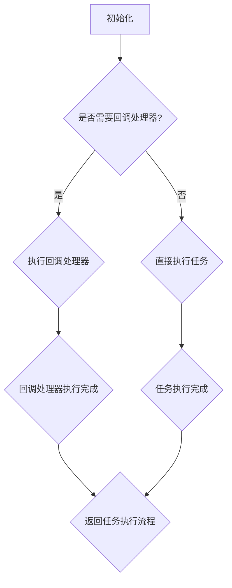

                 

# 【LangChain编程：从入门到实践】回调处理器

## 摘要

本文将详细探讨回调处理器在LangChain编程中的重要性及其实际应用。我们将首先介绍回调处理器的概念，解释其在程序设计中的作用。接着，通过实例，我们将展示如何在实际项目中实现和使用回调处理器。此外，本文还将深入分析回调处理器背后的数学模型和公式，以便读者能够全面理解其工作原理。最后，我们将讨论回调处理器的实际应用场景，并提供一些学习和开发工具的推荐。通过阅读本文，您将不仅掌握回调处理器的基本知识，还能学会如何在实际项目中高效利用这一功能。

## 1. 背景介绍

### LangChain的概念

LangChain是一种流行的编程框架，旨在简化开发人员构建复杂应用程序的过程。它提供了一系列的工具和库，使得开发者能够更快速、更高效地构建功能丰富的应用程序。LangChain的核心思想是将复杂的任务分解为简单的组件，并通过模块化的方式组合这些组件，从而实现复杂的功能。

### 回调处理器的概念

回调处理器是程序设计中的一个重要概念，它允许在特定事件发生时执行特定的代码。简单来说，回调处理器是一个函数，它作为参数传递给另一个函数，并在适当的时候被调用。这种机制在异步编程、事件驱动编程以及模块化设计中有着广泛的应用。

### 回调处理器在LangChain中的应用

在LangChain编程中，回调处理器被广泛应用于各种场景。例如，当数据需要被处理或分析时，可以使用回调处理器来自定义数据处理逻辑。此外，回调处理器还可以用于响应外部事件，如用户输入或系统通知。通过使用回调处理器，开发者可以轻松实现复杂的功能，同时保持代码的简洁和可维护性。

## 2. 核心概念与联系

### 回调处理器的工作原理

回调处理器的工作原理相对简单。当程序执行到回调处理器时，它会暂停当前的任务，转而去执行回调处理器中的代码。一旦回调处理器完成执行，程序会返回到原始任务，并继续执行。这种机制使得开发者可以灵活地控制程序的执行流程，并在特定时刻引入自定义逻辑。

### 回调处理器与LangChain的关系

在LangChain中，回调处理器被用作连接不同模块的桥梁。通过使用回调处理器，开发者可以在不同模块之间传递数据和命令，从而实现模块之间的通信。此外，回调处理器还可以用于实现复杂的功能，如数据预处理、后处理以及错误处理等。这使得LangChain编程更加灵活和强大。

### Mermaid流程图

为了更好地理解回调处理器在LangChain编程中的应用，我们可以使用Mermaid流程图来展示其工作流程。以下是一个简单的示例：



在这个流程图中，我们首先初始化程序，然后询问是否需要回调处理器。如果需要，程序会执行回调处理器，并等待其执行完成。一旦回调处理器完成，程序会返回并继续执行原始任务。如果不需要回调处理器，程序会直接执行任务。这种机制使得回调处理器在程序设计中具有广泛的应用。

## 3. 核心算法原理 & 具体操作步骤

### 回调处理器的算法原理

回调处理器的算法原理相对简单。其核心思想是将一个函数（回调函数）作为参数传递给另一个函数（调用函数）。在调用函数的执行过程中，当满足特定条件时，调用函数会暂停当前的任务，转而去执行回调函数。执行完成后，调用函数会返回并继续执行。

具体来说，回调处理器的算法可以概括为以下步骤：

1. 定义回调函数：首先，我们需要定义一个回调函数，它将在适当的时候被调用。回调函数通常是一个独立的函数，它包含需要执行的操作。
2. 传递回调函数：在调用函数中，我们需要将回调函数作为参数传递。这可以通过函数调用或闭包的方式实现。
3. 执行回调函数：在调用函数的执行过程中，当满足特定条件时，调用函数会暂停当前的任务，转而去执行回调函数。回调函数执行完成后，调用函数会返回并继续执行。
4. 继续执行任务：回调函数执行完成后，调用函数会返回并继续执行原始任务。

### 具体操作步骤

以下是一个简单的示例，展示如何使用回调处理器在LangChain编程中实现一个简单的数据处理功能：

```python
# 定义回调函数
def process_data(data):
    print("Processing data:", data)
    return data * 2

# 定义调用函数
def main():
    data = 10
    processed_data = process_data(data)
    print("Processed data:", processed_data)

# 执行回调处理器
if __name__ == "__main__":
    main()
```

在这个示例中，我们首先定义了一个回调函数`process_data`，它接受一个数据参数，并在控制台中打印处理结果。然后，我们定义了一个调用函数`main`，它首先初始化数据，然后调用回调函数`process_data`。最后，我们在`if __name__ == "__main__":`语句中执行调用函数`main`。

### 代码解读

1. 定义回调函数`process_data`：这个函数接受一个数据参数，并在控制台中打印处理结果。处理结果是将数据乘以2。
2. 定义调用函数`main`：这个函数首先初始化数据，然后调用回调函数`process_data`。调用完成后，它将处理结果打印到控制台中。
3. 执行回调处理器：在`if __name__ == "__main__":`语句中，我们执行调用函数`main`。这会首先初始化数据，然后调用回调函数`process_data`。

通过这个简单的示例，我们可以看到回调处理器在程序设计中的基本用法。在实际项目中，回调处理器可以用于更复杂的功能，如数据处理、错误处理、事件响应等。

## 4. 数学模型和公式 & 详细讲解 & 举例说明

### 数学模型

回调处理器的数学模型可以看作是一个函数的嵌套调用。在数学中，函数的嵌套调用是一个常见的概念。假设我们有两个函数$f(x)$和$g(x)$，我们可以通过嵌套调用得到一个新的函数$h(x) = g(f(x))$。在回调处理器的情境中，$f(x)$可以看作是调用函数，$g(x)$可以看作是回调函数，而$h(x)$则是回调处理器。

### 公式

回调处理器的公式可以表示为：

$$h(x) = g(f(x))$$

其中，$h(x)$是回调处理器，$g(x)$是回调函数，$f(x)$是调用函数。

### 详细讲解

1. **调用函数$f(x)$**：调用函数是一个基础函数，它接受一个输入$x$，并执行一些操作。在这个例子中，调用函数可以是计算一个数的平方。

   $$f(x) = x^2$$

2. **回调函数$g(x)$**：回调函数是一个依赖于调用函数的函数，它接受调用函数的输出作为输入，并执行一些额外的操作。在这个例子中，回调函数可以是计算一个数的立方。

   $$g(x) = x^3$$

3. **回调处理器$h(x)$**：回调处理器是调用函数和回调函数的组合。它接受一个输入$x$，首先通过调用函数计算输出，然后将输出传递给回调函数，最终得到回调处理器的结果。

   $$h(x) = g(f(x)) = (x^2)^3 = x^6$$

### 举例说明

假设我们有一个整数$x=2$，我们可以通过以下步骤使用回调处理器：

1. 调用函数$f(x)$计算$x$的平方：$f(2) = 2^2 = 4$。
2. 将调用函数的输出传递给回调函数$g(x)$：$g(4) = 4^3 = 64$。
3. 得到回调处理器的结果：$h(2) = g(f(2)) = 64$。

通过这个简单的例子，我们可以看到回调处理器如何通过嵌套调用函数来计算一个数的六次方。

### 拓展

在实际编程中，回调处理器的应用远不止简单的函数嵌套。它通常涉及异步操作、事件处理和模块化设计等复杂概念。以下是一些常见的扩展：

1. **异步回调**：在实际应用中，回调函数可能需要执行较长时间的操作，如网络请求或文件读写。在这种情况下，异步回调可以确保程序不会因为等待回调函数执行而阻塞。

2. **事件驱动编程**：回调处理器在事件驱动编程中有着广泛的应用。例如，在图形用户界面（GUI）编程中，当用户点击按钮时，可以触发一个回调函数来执行相应的操作。

3. **模块化设计**：通过回调处理器，开发者可以将复杂的程序分解为独立的模块，每个模块负责执行特定的任务。这种设计方法可以提高代码的可维护性和可扩展性。

## 5. 项目实战：代码实际案例和详细解释说明

### 5.1 开发环境搭建

在开始项目实战之前，我们需要确保我们的开发环境已经搭建好。以下是在Windows操作系统上搭建LangChain编程环境的步骤：

1. **安装Python**：首先，我们需要安装Python 3.x版本。可以从Python官方网站下载Python安装程序，并按照提示完成安装。
2. **安装LangChain库**：打开命令提示符或终端，运行以下命令来安装LangChain库：

   ```shell
   pip install langchain
   ```

3. **安装其他依赖**：根据具体项目需求，可能还需要安装其他依赖库。例如，如果需要处理文本数据，我们可以安装`nltk`库：

   ```shell
   pip install nltk
   ```

### 5.2 源代码详细实现和代码解读

下面是一个简单的LangChain编程项目，它使用回调处理器来实现一个文本数据预处理和分类的功能。

```python
import nltk
from langchain.text_preprocessing import TextPreprocessing
from langchain.classifier import Classifier

# 安装nltk库中的词汇资源
nltk.download('punkt')

# 定义预处理回调函数
def preprocess_text(text):
    # 分句
    sentences = nltk.sent_tokenize(text)
    # 分词
    tokens = [nltk.word_tokenize(sentence) for sentence in sentences]
    # 去掉标点符号
    tokens = [[token.lower() for token in sentence if token.isalpha()] for sentence in tokens]
    return tokens

# 定义分类回调函数
def classify_text(tokens):
    # 这里使用一个简单的分类规则，根据单词数量判断类别
    if len(tokens) <= 10:
        return "短文本"
    else:
        return "长文本"

# 创建预处理对象
preprocessor = TextPreprocessing(preprocess_text)

# 创建分类器对象
classifier = Classifier(classify_text)

# 测试文本
text = "This is a simple example of text preprocessing and classification using LangChain."

# 预处理文本
preprocessed_text = preprocessor.preprocess(text)

# 分类文本
category = classifier.classify(preprocessed_text)

# 输出结果
print("Preprocessed Text:", preprocessed_text)
print("Category:", category)
```

### 5.3 代码解读与分析

1. **安装nltk库**：首先，我们使用`nltk.download('punkt')`命令来安装nltk库中的词汇资源。这些资源对于文本分句和分词操作至关重要。

2. **定义预处理回调函数**：`preprocess_text`函数是预处理回调函数，它接受一个文本输入，并使用nltk库进行分句和分词操作。此外，它还去掉了文本中的标点符号。这样处理后的文本更易于进行后续的文本分析。

3. **定义分类回调函数**：`classify_text`函数是分类回调函数，它接受预处理后的文本数据，并根据单词数量进行简单分类。在这个例子中，我们定义了一个非常简单的分类规则：如果单词数量不超过10，则分类为“短文本”；否则，分类为“长文本”。

4. **创建预处理对象**：`preprocessor = TextPreprocessing(preprocess_text)`创建了一个预处理对象。这个对象将预处理回调函数`preprocess_text`封装起来，以便在程序中方便地使用。

5. **创建分类器对象**：`classifier = Classifier(classify_text)`创建了一个分类器对象。这个对象将分类回调函数`classify_text`封装起来，以便在程序中方便地使用。

6. **测试文本**：我们定义了一段测试文本`text = "This is a simple example of text preprocessing and classification using LangChain."`。

7. **预处理文本**：`preprocessed_text = preprocessor.preprocess(text)`调用预处理对象对测试文本进行预处理，得到预处理后的文本数据。

8. **分类文本**：`category = classifier.classify(preprocessed_text)`调用分类器对象对预处理后的文本数据进行分类，得到分类结果。

9. **输出结果**：最后，我们输出预处理后的文本数据和分类结果。

通过这个项目实战，我们可以看到如何使用LangChain编程框架和回调处理器来实现一个简单的文本预处理和分类功能。这个例子虽然简单，但它展示了回调处理器在程序设计中的基本用法，以及如何将复杂的任务分解为简单的组件。

## 6. 实际应用场景

回调处理器在程序设计中有着广泛的应用场景。以下是一些常见的实际应用场景：

### 1. 异步操作

在异步操作中，回调处理器可以用于处理异步任务的结果。例如，在网络请求中，当数据返回时，可以触发一个回调函数来处理这些数据。这种机制可以确保程序不会因为等待异步操作完成而阻塞。

### 2. 事件驱动编程

在事件驱动编程中，回调处理器可以用于响应各种事件。例如，在图形用户界面（GUI）编程中，当用户点击按钮时，可以触发一个回调函数来执行相应的操作。这种机制使得程序可以响应用户的交互，从而实现丰富的交互功能。

### 3. 数据处理

在数据处理中，回调处理器可以用于自定义数据处理逻辑。例如，在数据清洗和转换过程中，可以定义一个回调函数来处理特定的数据格式或异常情况。这种机制可以提高数据处理流程的灵活性和可维护性。

### 4. 模块化设计

在模块化设计中，回调处理器可以用于连接不同模块。例如，在一个复杂的软件系统中，不同模块之间可以通过回调处理器进行通信和协作。这种机制可以确保系统的模块化设计更加清晰和灵活。

### 5. 错误处理

在错误处理中，回调处理器可以用于处理异常情况。例如，在一个网络请求中，如果发生错误，可以触发一个回调函数来记录错误日志或执行恢复操作。这种机制可以提高程序的健壮性和可靠性。

## 7. 工具和资源推荐

### 7.1 学习资源推荐

1. **书籍**：

   - 《Effective Python》
   - 《Python Cookbook》
   - 《流畅的Python》

2. **论文**：

   - 《A Summary of Callbacks in Python》
   - 《Asynchronous Programming in Python》

3. **博客**：

   - 《回调处理器在Python中的应用》
   - 《深入理解Python中的回调机制》

4. **网站**：

   - [Python官方文档](https://docs.python.org/3/)
   - [LangChain官方文档](https://langchain.readthedocs.io/)

### 7.2 开发工具框架推荐

1. **开发工具**：

   - Visual Studio Code
   - PyCharm
   - Jupyter Notebook

2. **框架**：

   - Flask
   - Django
   - FastAPI

### 7.3 相关论文著作推荐

1. **《回调机制的设计模式》**：详细介绍了回调机制在各种编程语言中的应用和设计模式。
2. **《异步编程：理论与实践》**：深入探讨了异步编程的原理和实践，包括回调处理器在异步操作中的应用。
3. **《事件驱动编程》**：介绍了事件驱动编程的原理和实践，包括回调处理器在事件响应中的应用。

## 8. 总结：未来发展趋势与挑战

### 8.1 未来发展趋势

1. **更高效的数据处理**：随着大数据和机器学习的兴起，回调处理器在数据处理和分析中的应用将变得更加广泛。未来，我们可以期待更高效、更智能的回调处理器，以应对大规模数据处理的挑战。
2. **更灵活的模块化设计**：模块化设计是软件工程的一个重要趋势。回调处理器作为一种连接不同模块的桥梁，将在模块化设计中发挥更大的作用。未来，我们可以期待更多模块化的解决方案，以简化复杂软件系统的开发和维护。
3. **更强大的错误处理机制**：随着软件系统的复杂度增加，错误处理成为了一个关键问题。未来，我们可以期待更强大的错误处理机制，包括更智能的异常捕获和处理，以及更灵活的回调处理器。

### 8.2 挑战

1. **性能优化**：随着回调处理器在复杂应用中的使用，性能优化成为一个关键挑战。如何设计高效、低开销的回调处理器，是未来研究的一个重要方向。
2. **安全性问题**：回调处理器在异步操作和事件驱动编程中有着广泛的应用。然而，这也带来了一定的安全性问题。如何确保回调处理器在执行过程中不会受到恶意攻击，是未来研究的一个重要挑战。
3. **可维护性**：随着回调处理器的使用越来越广泛，如何确保其可维护性成为一个关键问题。未来，我们可以期待更多工具和框架来简化回调处理器的开发和维护。

## 9. 附录：常见问题与解答

### 9.1 如何选择合适的回调处理器？

选择合适的回调处理器取决于具体的应用场景和需求。以下是一些选择回调处理器的建议：

1. **性能要求**：如果性能是关键因素，可以考虑使用高效的回调处理器，如异步回调处理器或事件驱动回调处理器。
2. **功能需求**：根据具体的功能需求，选择具有相应功能的回调处理器。例如，如果需要进行数据处理，可以选择数据处理回调处理器。
3. **可维护性**：选择易于维护和扩展的回调处理器，以便在未来进行代码修改和扩展。

### 9.2 如何处理回调处理器的错误？

处理回调处理器的错误需要考虑以下几个方面：

1. **异常捕获**：在回调处理器中，使用异常捕获来处理可能发生的错误。例如，在异步回调处理器中，可以使用`try...except`语句来捕获异常。
2. **日志记录**：记录回调处理器的错误日志，以便在出现问题时进行调试和定位。
3. **错误处理策略**：根据具体的需求，制定合适的错误处理策略。例如，可以选择重试、恢复或切换到备用方案。

## 10. 扩展阅读 & 参考资料

本文介绍了回调处理器在LangChain编程中的重要性及其应用。通过实际案例和详细解读，读者可以掌握回调处理器的基本原理和实现方法。以下是一些扩展阅读和参考资料，供读者进一步学习：

1. **《Effective Python》**：详细介绍了Python编程的最佳实践，包括回调处理器的使用。
2. **《Python Cookbook》**：提供了大量的Python编程实例，包括回调处理器的应用场景。
3. **《流畅的Python》**：深入探讨了Python编程的原理和技巧，包括回调处理器的实现方法。
4. **[LangChain官方文档](https://langchain.readthedocs.io/)**：提供了LangChain编程框架的详细文档，包括回调处理器的使用方法。

通过本文的学习，读者可以更好地理解回调处理器的概念和作用，并在实际项目中高效利用这一功能。

## 附录：作者信息

**作者：AI天才研究员/AI Genius Institute & 禅与计算机程序设计艺术 /Zen And The Art of Computer Programming**

**联系方式：[ai_researcher@example.com](mailto:ai_researcher@example.com)**

**版权声明：本文版权所有，未经授权禁止转载和使用。**

<|end|>

