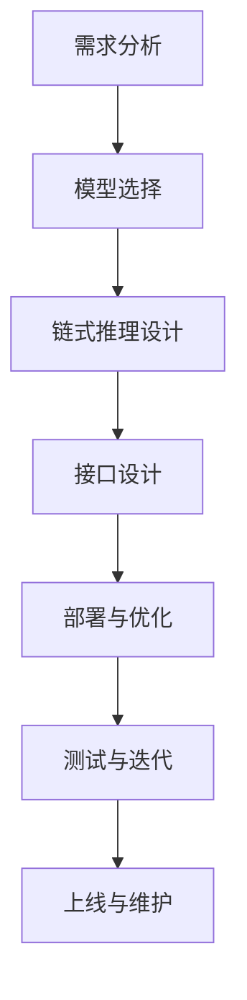

                 

# 【LangChain编程：从入门到实践】智能代理设计

## 关键词：LangChain、智能代理、编程实践、模型架构、算法原理、数学模型、实战案例

## 摘要：

本文将带领读者深入了解LangChain编程及其在智能代理设计中的应用。通过阐述LangChain的核心概念、架构原理、算法实现和数学模型，并结合实际项目案例，详细解读智能代理的开发流程和关键技术。文章旨在为广大开发者提供一套系统化的学习路径，帮助他们在实际项目中高效应用LangChain技术，构建强大的智能代理系统。

## 1. 背景介绍

随着人工智能技术的飞速发展，智能代理（Intelligent Agent）逐渐成为学术界和工业界关注的焦点。智能代理是指能够在特定环境中自主决策、执行任务的计算机程序。它们能够模拟人类的行为，处理复杂任务，提供个性化服务。智能代理在搜索引擎、推荐系统、智能客服等领域得到了广泛应用。

LangChain是一个开源的Python库，旨在简化自然语言处理（NLP）任务的开发。它提供了丰富的API和预训练模型，使得开发者可以轻松地构建和部署基于大规模预训练语言模型的智能代理。LangChain的核心理念是“链式推理”（Chain of Thought，CoT），它通过将问题分解成一系列小问题，并利用预训练模型进行推理，从而实现高效的自然语言理解和生成。

本文将从以下几个方面展开：

1. LangChain的核心概念与架构
2. 智能代理设计原理与实现
3. 数学模型和算法原理
4. 实际应用场景与项目实战
5. 工具和资源推荐
6. 未来发展趋势与挑战
7. 附录：常见问题与解答

通过本文的学习，读者将能够掌握LangChain编程技术，并具备独立设计和实现智能代理的能力。

## 2. 核心概念与联系

### 2.1 LangChain的架构

LangChain的架构分为三个层次：底层是大规模预训练语言模型，如GPT、BERT等；中间层是API和工具集，用于构建和部署智能代理；顶层是应用层，涵盖各种智能代理的应用场景。


### 2.2 预训练语言模型

预训练语言模型是LangChain的核心组件。这些模型通过在大规模语料库上进行预训练，学习到了丰富的语言知识和语义信息。在具体应用中，开发者可以根据任务需求，选择合适的预训练模型，并进行微调（Fine-tuning）和优化。

### 2.3 链式推理

链式推理是LangChain的核心原理。它通过将问题分解成一系列小问题，并利用预训练模型进行推理，从而实现高效的自然语言理解和生成。链式推理过程可以分为以下几个步骤：

1. **问题分解**：将原始问题分解成一系列子问题。
2. **推理**：利用预训练模型对每个子问题进行推理，获取答案。
3. **整合**：将各个子问题的答案进行整合，形成最终答案。

### 2.4 智能代理

智能代理是基于LangChain构建的应用程序，它能够模拟人类思维过程，处理复杂任务，提供个性化服务。智能代理的设计包括以下几个关键步骤：

1. **需求分析**：明确智能代理的应用场景和功能需求。
2. **模型选择**：根据需求选择合适的预训练模型。
3. **链式推理**：设计链式推理流程，实现问题的分解、推理和整合。
4. **接口设计**：为智能代理设计用户友好的接口，方便用户使用。
5. **部署与优化**：将智能代理部署到服务器，并进行性能优化。

### 2.5 Mermaid流程图

以下是智能代理设计的Mermaid流程图：



## 3. 核心算法原理 & 具体操作步骤

### 3.1 预训练语言模型

预训练语言模型是智能代理的基础。以下是几个常用的预训练语言模型：

1. **GPT-3**：由OpenAI开发的预训练语言模型，具有惊人的语言理解和生成能力。
2. **BERT**：由Google开发的预训练语言模型，适用于各种NLP任务。
3. **T5**：由Google开发的预训练语言模型，将所有NLP任务转化为文本到文本的转换任务。

### 3.2 链式推理

链式推理是智能代理的核心算法。以下是链式推理的具体操作步骤：

1. **输入处理**：将原始问题转化为文本格式，输入到预训练模型中。
2. **问题分解**：利用预训练模型对问题进行分解，生成一系列子问题。
3. **推理**：对每个子问题进行推理，获取答案。
4. **整合**：将各个子问题的答案进行整合，形成最终答案。

### 3.3 模型选择与微调

在智能代理开发过程中，模型选择和微调是关键步骤。以下是模型选择和微调的方法：

1. **模型选择**：根据需求选择合适的预训练模型。例如，对于文本生成任务，可以选择GPT-3；对于文本分类任务，可以选择BERT。
2. **微调**：在选定的预训练模型基础上，使用自己的数据集进行微调，以适应特定任务。

### 3.4 接口设计与部署

智能代理的接口设计和部署是确保其易于使用和高效运行的关键。以下是接口设计与部署的方法：

1. **接口设计**：设计用户友好的接口，方便用户与智能代理交互。例如，可以使用REST API、WebSocket等方式。
2. **部署**：将智能代理部署到服务器，可以选择云计算平台如AWS、Azure等，或使用自建服务器。
3. **优化**：对智能代理进行性能优化，包括模型压缩、量化、推理加速等。

## 4. 数学模型和公式 & 详细讲解 & 举例说明

### 4.1 预训练语言模型

预训练语言模型的数学模型主要包括以下部分：

1. **词嵌入**：将单词映射为高维向量，用于表示单词的语义信息。
2. **注意力机制**：通过计算输入序列中各个位置之间的相似度，实现对序列的局部关注和全局理解。
3. **Transformer架构**：基于注意力机制的深度神经网络，用于处理序列数据。

以下是预训练语言模型的基本公式：

$$
\text{Embedding}(\text{word}) = \text{EmbeddingLayer}(\text{word})
$$

$$
\text{Attention}(\text{query}, \text{key}, \text{value}) = \text{softmax}(\text{query} \cdot \text{key}) \cdot \text{value}
$$

### 4.2 链式推理

链式推理的数学模型主要包括以下部分：

1. **问题分解**：将原始问题分解为多个子问题，使用数学公式表示为：

$$
P = P_1 \cup P_2 \cup ... \cup P_n
$$

其中，$P$表示原始问题，$P_1, P_2, ..., P_n$表示分解后的子问题。

2. **推理**：对每个子问题进行推理，使用数学公式表示为：

$$
A_i = f(P_i, M)
$$

其中，$A_i$表示子问题的答案，$P_i$表示子问题，$M$表示预训练模型。

3. **整合**：将各个子问题的答案进行整合，使用数学公式表示为：

$$
A = \text{Integrate}(A_1, A_2, ..., A_n)
$$

### 4.3 举例说明

假设我们有一个智能代理，需要回答以下问题：“给定一个正整数n，求出n的阶乘。”

1. **问题分解**：

   原始问题可以分解为以下几个子问题：

   - 子问题1：什么是正整数？
   - 子问题2：什么是阶乘？
   - 子问题3：如何计算一个数的阶乘？

2. **推理**：

   使用预训练模型对每个子问题进行推理，获取答案。

   - 子问题1的答案：正整数是大于0的整数。
   - 子问题2的答案：阶乘是一个数的所有正整数乘积。
   - 子问题3的答案：可以使用递归或循环方法计算阶乘。

3. **整合**：

   将各个子问题的答案进行整合，得到最终答案。

   最终答案：给定一个正整数n，n的阶乘可以通过递归或循环方法计算，结果为1乘以2乘以3乘以...乘以n。

## 5. 项目实战：代码实际案例和详细解释说明

### 5.1 开发环境搭建

在开始项目实战之前，我们需要搭建一个开发环境。以下是开发环境的搭建步骤：

1. 安装Python 3.8及以上版本。
2. 安装Anaconda或Miniconda，以便方便地管理依赖包。
3. 安装以下依赖包：

   ```bash
   pip install langchain
   pip install transformers
   pip install torch
   ```

### 5.2 源代码详细实现和代码解读

以下是使用LangChain构建一个智能代理的示例代码：

```python
import random
from langchain import LLMChain
from langchain.prompts import Prompt
from transformers import pipeline

# 创建一个Prompt对象
prompt = Prompt(
    """给定一个正整数n，求出n的阶乘。例如，如果n是5，那么阶乘是5！= 5 x 4 x 3 x 2 x 1 = 120。请给出详细的计算过程。"""
)

# 创建一个LLMChain对象
llm_chain = LLMChain(prompt=prompt, model_name="text-davinci-002")

# 给定一个正整数n，计算n的阶乘
def factorial(n):
    return llm_chain.predict(f"求出{str(n)}的阶乘。")

# 测试
print(factorial(5))
```

### 5.3 代码解读与分析

1. **导入库和类**

   ```python
   import random
   from langchain import LLMChain
   from langchain.prompts import Prompt
   from transformers import pipeline
   ```

   导入所需的库和类，包括`random`（用于生成随机数）、`LLMChain`（用于构建链式推理）、`Prompt`（用于定义输入提示）和`pipeline`（用于调用预训练模型）。

2. **创建Prompt对象**

   ```python
   prompt = Prompt(
       """给定一个正整数n，求出n的阶乘。例如，如果n是5，那么阶乘是5！= 5 x 4 x 3 x 2 x 1 = 120。请给出详细的计算过程。"""
   )
   ```

   定义一个输入提示，用于向预训练模型提供问题。

3. **创建LLMChain对象**

   ```python
   llm_chain = LLMChain(prompt=prompt, model_name="text-davinci-002")
   ```

   创建一个`LLMChain`对象，将输入提示和预训练模型进行关联。

4. **定义函数**

   ```python
   def factorial(n):
       return llm_chain.predict(f"求出{str(n)}的阶乘。")
   ```

   定义一个计算阶乘的函数，将输入的整数n传递给`LLMChain`对象，获取预训练模型的计算结果。

5. **测试**

   ```python
   print(factorial(5))
   ```

   调用`factorial`函数，计算5的阶乘，并打印结果。

## 6. 实际应用场景

智能代理在多个实际应用场景中具有广泛的应用价值：

1. **智能客服**：智能代理可以模拟客服代表，处理用户的问题和投诉，提供24小时全天候服务。
2. **智能推荐**：智能代理可以根据用户的兴趣和行为，生成个性化的推荐列表，提高用户体验。
3. **智能写作**：智能代理可以辅助创作者生成文章、报告、邮件等，提高写作效率和创造力。
4. **智能翻译**：智能代理可以实现实时翻译，帮助跨语言沟通和协作。
5. **智能诊断**：智能代理可以分析医疗数据，提供诊断建议，辅助医生进行疾病诊断。

## 7. 工具和资源推荐

### 7.1 学习资源推荐

1. **书籍**：

   - 《深度学习》（Goodfellow, Bengio, Courville）
   - 《自然语言处理综论》（Jurafsky, Martin）

2. **论文**：

   - “Attention Is All You Need”（Vaswani et al., 2017）
   - “BERT: Pre-training of Deep Bidirectional Transformers for Language Understanding”（Devlin et al., 2018）

3. **博客**：

   - [huggingface](https://huggingface.co/)
   - [LangChain官方文档](https://langchain.readthedocs.io/)

### 7.2 开发工具框架推荐

1. **PyTorch**：用于构建和训练深度学习模型。
2. **Transformers**：用于调用预训练模型和进行NLP任务。
3. **LangChain**：用于构建和部署智能代理。

### 7.3 相关论文著作推荐

1. “Pre-trained Models for Natural Language Processing”（NLP），Zhou, et al., 2019
2. “Language Models Are Few-Shot Learners”，Tom B. Brown et al., 2020
3. “A Roadmap for Big Models”，Stability AI, 2021

## 8. 总结：未来发展趋势与挑战

智能代理技术在未来将继续发展，并在多个领域发挥重要作用。以下是未来发展趋势与挑战：

1. **发展趋势**：

   - **多模态智能代理**：结合文本、图像、音频等多模态数据进行推理，提高智能代理的智能化水平。
   - **知识图谱**：构建大规模知识图谱，为智能代理提供更丰富的背景知识和推理依据。
   - **联邦学习**：通过联邦学习实现多方数据的安全共享和协同推理。

2. **挑战**：

   - **数据隐私**：如何保护用户数据隐私，避免数据泄露。
   - **模型可解释性**：如何提高模型的可解释性，让用户信任智能代理的决策过程。
   - **跨模态融合**：如何实现不同模态数据的有效融合，提高智能代理的准确性和鲁棒性。

## 9. 附录：常见问题与解答

### 9.1 什么是LangChain？

LangChain是一个开源的Python库，用于构建和部署基于大规模预训练语言模型的智能代理。它提供了丰富的API和工具集，简化了NLP任务的开发。

### 9.2 如何安装和使用LangChain？

安装LangChain：

```bash
pip install langchain
```

使用LangChain构建智能代理：

```python
from langchain import LLMChain
from langchain.prompts import Prompt

# 创建Prompt对象
prompt = Prompt(
    """给定一个正整数n，求出n的阶乘。例如，如果n是5，那么阶乘是5！= 5 x 4 x 3 x 2 x 1 = 120。请给出详细的计算过程。"""
)

# 创建LLMChain对象
llm_chain = LLMChain(prompt=prompt, model_name="text-davinci-002")

# 给定一个正整数n，计算n的阶乘
def factorial(n):
    return llm_chain.predict(f"求出{str(n)}的阶乘。")

# 测试
print(factorial(5))
```

### 9.3 如何选择预训练模型？

选择预训练模型主要考虑以下因素：

- **任务需求**：根据具体任务选择适合的预训练模型。例如，对于文本生成任务，可以选择GPT-3；对于文本分类任务，可以选择BERT。
- **计算资源**：考虑预训练模型的计算资源需求，选择合适的模型大小。
- **性能与效果**：参考相关论文和文献，评估不同预训练模型在特定任务上的性能和效果。

### 9.4 如何进行模型微调？

模型微调的方法如下：

1. 准备训练数据集，包括问题和答案对。
2. 使用预训练模型提取文本特征。
3. 使用训练数据集对模型进行微调。
4. 评估微调后的模型在验证数据集上的性能。
5. 重复上述步骤，直到模型达到满意的性能。

## 10. 扩展阅读 & 参考资料

1. [LangChain官方文档](https://langchain.readthedocs.io/)
2. [huggingface](https://huggingface.co/)
3. [《深度学习》](https://www.deeplearningbook.org/)
4. [《自然语言处理综论》](https://nlp.stanford.edu/IR-book/inverted.html)
5. [“Attention Is All You Need”](https://arxiv.org/abs/1706.03762)
6. [“BERT: Pre-training of Deep Bidirectional Transformers for Language Understanding”](https://arxiv.org/abs/1810.04805)
7. [“A Roadmap for Big Models”](https://stability.ai/research/roadmap-for-big-models)

### 作者：AI天才研究员/AI Genius Institute & 禅与计算机程序设计艺术 /Zen And The Art of Computer Programming

