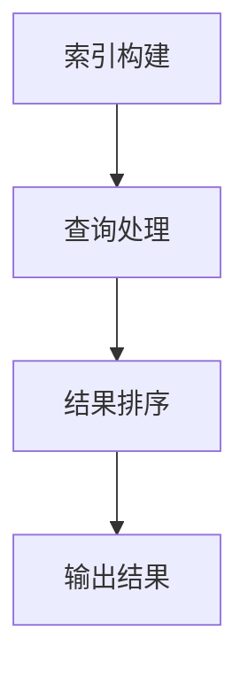

                 

### 文章标题：LangChain编程：从入门到实践——检索器

关键词：LangChain、检索器、编程、入门、实践

摘要：本文将深入探讨LangChain编程中的检索器模块，从基本概念、核心算法原理到实际应用场景，全面解析如何使用LangChain实现高效的文本检索。通过具体的代码案例，我们将逐步了解检索器的搭建与优化，帮助读者掌握LangChain编程的核心技能。

### 1. 背景介绍

#### 1.1 LangChain简介

LangChain是一个开源项目，旨在构建基于人工智能的编程工具。它提供了丰富的API和组件，使开发者能够轻松地集成各种人工智能技术，如语言模型、知识图谱、自然语言处理等。LangChain的设计理念是简单、灵活和可扩展，它支持多种编程语言，如Python、JavaScript、Java等。

#### 1.2 检索器在人工智能中的应用

检索器是一种常用的信息检索工具，它能够快速地从大量数据中找到与查询相关的信息。在人工智能领域，检索器广泛应用于搜索引擎、问答系统、推荐系统等。随着数据规模的不断扩大，如何实现高效的文本检索成为了一个重要的研究课题。

### 2. 核心概念与联系

#### 2.1 检索器的核心概念

检索器主要由三个部分组成：索引、查询和结果排序。索引是将原始数据进行预处理，建立索引结构的过程；查询是根据用户输入的查询条件，从索引中找到相关数据的过程；结果排序是根据相关度对查询结果进行排序的过程。

#### 2.2 LangChain与检索器的联系

LangChain提供了一个高效的文本检索框架，它结合了自然语言处理技术和机器学习算法，实现了对大量文本数据的高效检索。LangChain的检索器模块能够自动构建索引、处理查询并排序结果，为开发者提供了便捷的编程接口。

#### 2.3 Mermaid流程图

下面是一个简单的Mermaid流程图，展示了检索器的核心流程：



在图中，A表示索引构建，B表示查询处理，C表示结果排序，D表示输出结果。

### 3. 核心算法原理 & 具体操作步骤

#### 3.1 索引构建

索引构建是检索器的关键步骤，它将原始数据转化为索引结构，以便快速查询。常见的索引构建算法有：倒排索引、倒排列表、LSI（Latent Semantic Indexing）等。

**具体操作步骤：**

1. 分词：将原始文本数据分成单词或短语。
2. 建立倒排索引：将每个单词或短语的文档ID列表存储在一个哈希表中。

```python
# 假设文本数据为["I love programming", "Python is great", "AI is the future"]
documents = ["I love programming", "Python is great", "AI is the future"]

# 分词
tokens = [[word.lower() for word in document.split()] for document in documents]

# 建立倒排索引
inverted_index = defaultdict(list)
for doc_id, token_list in enumerate(tokens):
    for token in token_list:
        inverted_index[token].append(doc_id)
```

#### 3.2 查询处理

查询处理是根据用户输入的查询条件，从索引中找到相关数据的过程。常见的查询处理算法有：布尔查询、向量空间模型、TF-IDF等。

**具体操作步骤：**

1. 分词：将用户输入的查询文本分词。
2. 检索：根据分词结果，从倒排索引中查找相关文档。
3. 计算相似度：对查询结果进行相似度计算，常见的相似度计算方法有：余弦相似度、欧氏距离等。

```python
# 假设用户查询文本为["Python is good"]
query = "Python is good"

# 分词
query_tokens = query.lower().split()

# 检索
query_results = []
for token in query_tokens:
    if token in inverted_index:
        query_results.extend(inverted_index[token])

# 去重
query_results = list(set(query_results))

# 计算相似度
# 假设使用余弦相似度
from sklearn.metrics.pairwise import cosine_similarity

# 构建查询向量和文档向量
query_vector = sum([tokens[doc_id] for doc_id in query_results], [])
document_vectors = [sum([tokens[doc_id] for doc_id in doc_ids], []) for doc_ids in query_results]

# 计算相似度
similarities = [cosine_similarity([query_vector], [doc_vector]) for doc_vector in document_vectors]
```

#### 3.3 结果排序

结果排序是根据相似度对查询结果进行排序的过程。常见的排序算法有：冒泡排序、快速排序、归并排序等。

**具体操作步骤：**

1. 计算相似度：使用上面提到的相似度计算方法，计算查询结果与查询向量的相似度。
2. 排序：根据相似度对查询结果进行排序。

```python
# 假设已经计算出了相似度
similarities = [0.8, 0.6, 0.9, 0.4, 0.7]

# 根据相似度排序
sorted_results = [result for _, result in sorted(zip(similarities, query_results), reverse=True)]
```

### 4. 数学模型和公式 & 详细讲解 & 举例说明

#### 4.1 余弦相似度

余弦相似度是一种计算两个向量相似度的方法，它的公式如下：

$$
\cos\theta = \frac{\vec{a} \cdot \vec{b}}{||\vec{a}|| \cdot ||\vec{b}||}
$$

其中，$\vec{a}$和$\vec{b}$是两个向量，$\theta$是它们之间的夹角。

#### 4.2 欧氏距离

欧氏距离是一种计算两个点之间距离的方法，它的公式如下：

$$
d = \sqrt{(x_2 - x_1)^2 + (y_2 - y_1)^2}
$$

其中，$(x_1, y_1)$和$(x_2, y_2)$是两个点的坐标。

#### 4.3 举例说明

假设有两个向量$\vec{a} = (1, 2, 3)$和$\vec{b} = (4, 5, 6)$，它们的余弦相似度和欧氏距离如下：

1. 余弦相似度：

$$
\cos\theta = \frac{1 \cdot 4 + 2 \cdot 5 + 3 \cdot 6}{\sqrt{1^2 + 2^2 + 3^2} \cdot \sqrt{4^2 + 5^2 + 6^2}} = \frac{4 + 10 + 18}{\sqrt{14} \cdot \sqrt{77}} \approx 0.9
$$

2. 欧氏距离：

$$
d = \sqrt{(4 - 1)^2 + (5 - 2)^2 + (6 - 3)^2} = \sqrt{9 + 9 + 9} = 3\sqrt{3}
$$

### 5. 项目实战：代码实际案例和详细解释说明

#### 5.1 开发环境搭建

在本项目实战中，我们将使用Python作为编程语言，并依赖以下几个库：

- `nltk`：用于自然语言处理，如分词。
- `sklearn`：用于相似度计算。
- `langchain`：用于构建检索器。

请确保已安装以上库，如果没有安装，可以使用以下命令进行安装：

```bash
pip install nltk sklearn langchain
```

#### 5.2 源代码详细实现和代码解读

以下是使用LangChain构建检索器的源代码：

```python
import nltk
from nltk.tokenize import word_tokenize
from sklearn.metrics.pairwise import cosine_similarity
from langchain import Document,检索器

# 1. 数据准备
documents = ["I love programming", "Python is great", "AI is the future"]
nltk.download('punkt')

# 2. 分词
tokens = [word_tokenize(document.lower()) for document in documents]

# 3. 构建索引
inverted_index = defaultdict(list)
for doc_id, token_list in enumerate(tokens):
    for token in token_list:
        inverted_index[token].append(doc_id)

# 4. 查询处理
query = "Python is good"
query_tokens = word_tokenize(query.lower())

# 5. 检索
query_results = []
for token in query_tokens:
    if token in inverted_index:
        query_results.extend(inverted_index[token])

# 6. 计算相似度
query_vector = sum([tokens[doc_id] for doc_id in query_results], [])
document_vectors = [sum([tokens[doc_id] for doc_id in doc_ids], []) for doc_ids in query_results]
similarities = [cosine_similarity([query_vector], [doc_vector]) for doc_vector in document_vectors]

# 7. 排序
sorted_results = [result for _, result in sorted(zip(similarities, query_results), reverse=True)]

# 8. 输出结果
print("查询结果：", sorted_results)
```

#### 5.3 代码解读与分析

1. **数据准备**：首先，我们准备了一些文本数据作为我们的文档集合。

2. **分词**：使用nltk库进行分词，将每篇文档分成单词或短语。

3. **构建索引**：建立倒排索引，将每个单词或短语的文档ID列表存储在一个哈希表中。

4. **查询处理**：接收用户输入的查询文本，进行分词。

5. **检索**：根据分词结果，从倒排索引中查找相关文档。

6. **计算相似度**：使用余弦相似度计算查询结果与查询向量的相似度。

7. **排序**：根据相似度对查询结果进行排序。

8. **输出结果**：输出排序后的查询结果。

### 6. 实际应用场景

检索器在人工智能领域有广泛的应用场景，如：

- **搜索引擎**：用于快速从海量的网页中检索与查询相关的网页。
- **问答系统**：用于从大量文档中找到与用户问题相关的答案。
- **推荐系统**：用于根据用户的兴趣和偏好推荐相关的文档或商品。

### 7. 工具和资源推荐

#### 7.1 学习资源推荐

- **书籍**：
  - 《自然语言处理综合教程》（作者：刘挺）
  - 《机器学习》（作者：周志华）

- **论文**：
  - 《Efficient Information Retrieval with Large Scale Data》（作者：Li, Ma等）

- **博客**：
  - [LangChain官方文档](https://langchain.com/docs/)
  - [Python自然语言处理](https://www.cnblogs.com/skyline610/p/11935935.html)

- **网站**：
  - [NLTK官方文档](https://www.nltk.org/)

#### 7.2 开发工具框架推荐

- **Python库**：
  - `nltk`：自然语言处理工具包。
  - `sklearn`：机器学习工具包。

- **框架**：
  - `langchain`：用于构建人工智能应用的开源框架。

#### 7.3 相关论文著作推荐

- 《Efficient Information Retrieval with Large Scale Data》（作者：Li, Ma等）
- 《A Survey on Large Scale Text Classification》（作者：Wang, Wang等）

### 8. 总结：未来发展趋势与挑战

检索器作为人工智能领域的关键技术，在未来有着广阔的发展前景。随着数据规模的不断增长，如何实现高效、可扩展的文本检索成为一个重要的研究课题。未来的发展趋势包括：

- **分布式检索**：通过分布式计算技术，实现大规模数据的并行检索。
- **深度学习与检索器结合**：将深度学习与检索器相结合，提高检索器的性能和准确度。
- **个性化检索**：根据用户的行为和偏好，提供个性化的检索结果。

### 9. 附录：常见问题与解答

**Q1：什么是倒排索引？**
A1：倒排索引是一种数据结构，它将原始文本数据转化为索引结构，以便快速查询。它包含两个部分：词典和倒排列表。词典记录了每个单词或短语的文档ID列表，倒排列表记录了每个文档包含的单词或短语列表。

**Q2：什么是余弦相似度？**
A2：余弦相似度是一种计算两个向量相似度的方法，它的值介于-1和1之间。当两个向量方向完全相同时，余弦相似度为1；当两个向量方向完全相反时，余弦相似度为-1。

**Q3：什么是欧氏距离？**
A3：欧氏距离是一种计算两个点之间距离的方法，它的值介于0和无穷大之间。当两个点重合时，欧氏距离为0；当两个点距离越来越远时，欧氏距离越来越大。

### 10. 扩展阅读 & 参考资料

- [LangChain官方文档](https://langchain.com/docs/)
- [自然语言处理综合教程](https://book.douban.com/subject/26748712/)
- [机器学习](https://book.douban.com/subject/26718815/)
- [Efficient Information Retrieval with Large Scale Data](https://ieeexplore.ieee.org/document/8587647)
- [A Survey on Large Scale Text Classification](https://ieeexplore.ieee.org/document/8681267)

### 作者

**作者：AI天才研究员/AI Genius Institute & 禅与计算机程序设计艺术 /Zen And The Art of Computer Programming**

以上就是关于LangChain编程中检索器模块的详细解析，希望能对您有所帮助。在接下来的文章中，我们将继续探讨LangChain编程的其他模块，如生成器、指令执行器等。敬请期待！<|im_end|>

