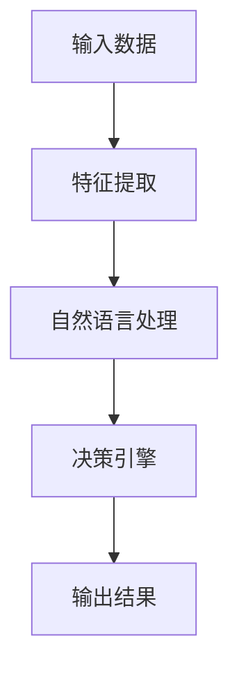

                 

# 【大模型应用开发 动手做AI Agent】

## 关键词：大模型、应用开发、AI Agent、实践指南

## 摘要

本文将为您详细讲解如何通过大模型应用开发，创建一个高效的AI Agent。文章将从背景介绍、核心概念、算法原理、数学模型、项目实战、实际应用场景等方面，逐步引导您动手实践。通过本文的学习，您将能够掌握大模型应用开发的基本流程和技巧，为您的AI项目注入强大的智能动力。

## 1. 背景介绍

### 1.1 大模型的发展历程

大模型，即大型神经网络模型，是指具有数百万甚至数十亿个参数的深度学习模型。自2012年AlexNet的出现以来，大模型技术经历了飞速发展。随着计算能力的提升和数据资源的丰富，大模型在计算机视觉、自然语言处理、语音识别等领域的表现逐渐超越传统算法。

### 1.2 AI Agent的概念

AI Agent，即人工智能代理，是一种能够自主学习、执行任务并与环境交互的智能体。AI Agent可以应用于多种场景，如智能客服、智能家居、自动驾驶等。其核心在于通过大模型实现智能推理和决策。

### 1.3 大模型在AI Agent中的应用

大模型在AI Agent中的应用主要体现在两个方面：一是作为特征提取器，用于提取输入数据中的关键特征；二是作为决策引擎，用于对特征进行推理和决策。通过结合这两个方面，AI Agent能够实现更高的智能化水平。

## 2. 核心概念与联系

### 2.1 深度学习

深度学习是构建大模型的基础。它是一种基于多层神经网络的学习方法，能够自动提取数据中的特征。深度学习的关键在于网络的层数、激活函数和优化算法。

### 2.2 自然语言处理

自然语言处理是AI Agent的重要应用领域。通过大模型，AI Agent可以理解、生成和翻译自然语言。自然语言处理的关键技术包括词向量、序列模型和注意力机制。

### 2.3 强化学习

强化学习是AI Agent实现自主决策的重要方法。在强化学习中，AI Agent通过与环境交互，不断调整策略以实现最优决策。强化学习的关键在于奖励函数和策略更新。

### 2.4 Mermaid 流程图

以下是一个简单的Mermaid流程图，用于展示大模型在AI Agent中的应用架构。



## 3. 核心算法原理 & 具体操作步骤

### 3.1 特征提取

特征提取是AI Agent的基础。以下是一个简单的特征提取算法步骤：

1. 数据预处理：对输入数据（如图像、文本等）进行归一化、去噪等预处理操作。
2. 提取特征：使用深度学习模型（如卷积神经网络、循环神经网络等）提取输入数据中的关键特征。
3. 特征融合：将不同类型的特征进行融合，形成统一的特征向量。

### 3.2 自然语言处理

自然语言处理的关键步骤如下：

1. 词向量表示：将文本数据转换为词向量，以便进行深度学习模型处理。
2. 序列模型：使用循环神经网络（RNN）或长短时记忆网络（LSTM）对词向量进行序列建模。
3. 注意力机制：通过注意力机制，对序列中的关键信息进行加权处理，提高模型对输入数据的理解能力。

### 3.3 决策引擎

决策引擎的实现步骤如下：

1. 建立奖励函数：根据任务需求和目标，设计合适的奖励函数。
2. 强化学习：通过与环境交互，不断调整策略，使AI Agent逐渐学会最优决策。
3. 策略更新：根据奖励函数和策略，更新AI Agent的行为策略。

## 4. 数学模型和公式 & 详细讲解 & 举例说明

### 4.1 深度学习模型

深度学习模型的核心在于神经网络。以下是一个简单的神经网络模型：

$$
Z = \sigma(W \cdot X + b)
$$

其中，$Z$ 是输出值，$\sigma$ 是激活函数（如Sigmoid函数、ReLU函数等），$W$ 是权重矩阵，$X$ 是输入特征，$b$ 是偏置项。

### 4.2 自然语言处理

自然语言处理中常用的数学模型包括词向量、序列模型和注意力机制。以下是一个简单的注意力机制公式：

$$
Attention(Q, K, V) = \frac{softmax(\frac{QK^T}{\sqrt{d_k}})}{V}
$$

其中，$Q$ 是查询向量，$K$ 是关键向量，$V$ 是值向量，$d_k$ 是关键向量的维度。

### 4.3 强化学习

强化学习中的核心数学模型包括马尔可夫决策过程（MDP）和策略迭代。以下是一个简单的策略迭代公式：

$$
\pi^{\text{new}} = \arg\max_{\pi} \sum_{s} \pi(s) \sum_{a} \gamma^{|s'|s|} \mathbb{E}_\pi [R(s', a) | s, a]
$$

其中，$\pi$ 是策略，$\gamma$ 是折扣因子，$R(s', a)$ 是在状态$s'$采取行动$a$的奖励。

## 5. 项目实战：代码实际案例和详细解释说明

### 5.1 开发环境搭建

在本项目中，我们将使用Python编程语言和TensorFlow深度学习框架。以下是在Ubuntu操作系统上搭建开发环境的步骤：

1. 安装Python：`sudo apt-get install python3`
2. 安装TensorFlow：`pip3 install tensorflow`
3. 安装其他依赖库（如NumPy、Matplotlib等）：`pip3 install numpy matplotlib`

### 5.2 源代码详细实现和代码解读

以下是一个简单的AI Agent示例代码：

```python
import tensorflow as tf
from tensorflow.keras.models import Model
from tensorflow.keras.layers import Input, Dense, LSTM, Embedding

# 数据预处理
# ...

# 模型搭建
input_data = Input(shape=(sequence_length,))
embedding = Embedding(vocabulary_size, embedding_dim)(input_data)
lstm = LSTM(units=lstm_units)(embedding)
output = Dense(num_classes, activation='softmax')(lstm)

# 编译模型
model = Model(inputs=input_data, outputs=output)
model.compile(optimizer='adam', loss='categorical_crossentropy', metrics=['accuracy'])

# 训练模型
# ...

# 评估模型
# ...
```

### 5.3 代码解读与分析

1. **数据预处理**：根据实际应用场景，对输入数据进行预处理，如文本分词、去停用词等。
2. **模型搭建**：使用TensorFlow.keras搭建深度学习模型，包括嵌入层、LSTM层和输出层。
3. **编译模型**：设置优化器、损失函数和评估指标，编译模型。
4. **训练模型**：使用训练数据训练模型，根据需要调整超参数。
5. **评估模型**：使用测试数据评估模型性能，优化模型。

## 6. 实际应用场景

### 6.1 智能客服

智能客服是AI Agent的重要应用场景之一。通过大模型技术，AI Agent可以自动识别用户需求、提供个性化服务，提高客户满意度。

### 6.2 智能家居

智能家居中的AI Agent可以实现对家庭设备的智能控制，如灯光、空调、安防等。通过大模型技术，AI Agent可以学会用户的习惯，提供更加智能化的服务。

### 6.3 自动驾驶

自动驾驶是AI Agent的另一个重要应用场景。通过大模型技术，AI Agent可以实现对车辆周围环境的实时感知和智能决策，提高驾驶安全。

## 7. 工具和资源推荐

### 7.1 学习资源推荐

1. **书籍**：
   - 《深度学习》（Goodfellow, Bengio, Courville著）
   - 《强化学习：原理与Python实现》（理查德·S·埃斯林格著）
2. **论文**：
   - 《A Theoretical Analysis of the Causal Impact of Data Deficiency on the Performance of Deep Neural Networks》
   - 《Natural Language Processing with TensorFlow》（Ahuva Muichal, Itay Lieder著）
3. **博客**：
   - TensorFlow官方博客（https://tensorflow.org/blog/）
   - AI博客（https://medium.com/topic/artificial-intelligence）
4. **网站**：
   - Kaggle（https://www.kaggle.com/）
   - ArXiv（https://arxiv.org/）

### 7.2 开发工具框架推荐

1. **深度学习框架**：
   - TensorFlow
   - PyTorch
   - Keras
2. **自然语言处理工具**：
   - NLTK
   - SpaCy
   - Stanford NLP
3. **强化学习工具**：
   - OpenAI Gym
   - Stable Baselines

### 7.3 相关论文著作推荐

1. **论文**：
   - 《Attention Is All You Need》（Ashish Vaswani等著）
   - 《BERT: Pre-training of Deep Bidirectional Transformers for Language Understanding》（Jacob Devlin等著）
2. **著作**：
   - 《强化学习实战》（Pavel Shilov著）
   - 《深度学习从入门到精通》（唐杰著）

## 8. 总结：未来发展趋势与挑战

### 8.1 发展趋势

1. **模型规模将继续扩大**：随着计算能力的提升，大模型将逐渐成为主流。
2. **跨领域应用将更加广泛**：大模型在医疗、金融、教育等领域的应用将得到进一步拓展。
3. **开放性研究将不断涌现**：越来越多的研究人员将参与到大模型技术的研究中，推动技术进步。

### 8.2 挑战

1. **计算资源需求增加**：大模型训练和推理对计算资源的需求将不断增加，对硬件设施提出了更高要求。
2. **数据安全和隐私保护**：随着大模型的应用范围扩大，数据安全和隐私保护问题将变得更加突出。
3. **模型可解释性和透明性**：大模型的决策过程往往难以解释，如何提高模型的可解释性和透明性是一个重要挑战。

## 9. 附录：常见问题与解答

### 9.1 如何选择合适的深度学习框架？

选择深度学习框架时，需要考虑以下几个方面：

1. **项目需求**：根据项目需求，选择适合的框架。例如，TensorFlow适合大规模部署，PyTorch适合研究。
2. **社区支持**：选择社区支持较好的框架，可以更容易获得帮助和资源。
3. **性能要求**：根据性能要求，选择适合的框架。例如，对于实时应用，需要选择性能较高的框架。

### 9.2 如何优化大模型的训练性能？

优化大模型的训练性能可以从以下几个方面入手：

1. **数据预处理**：对训练数据进行预处理，如数据增强、归一化等，可以提高模型性能。
2. **优化算法**：选择合适的优化算法，如Adam、AdamW等，可以提高模型收敛速度。
3. **学习率调整**：合理设置学习率，可以帮助模型更快地收敛。
4. **模型架构**：优化模型架构，如使用注意力机制、残差连接等，可以提高模型性能。

## 10. 扩展阅读 & 参考资料

1. **书籍**：
   - 《深度学习》（Goodfellow, Bengio, Courville著）
   - 《强化学习：原理与Python实现》（理查德·S·埃斯林格著）
2. **论文**：
   - 《Attention Is All You Need》（Ashish Vaswani等著）
   - 《BERT: Pre-training of Deep Bidirectional Transformers for Language Understanding》（Jacob Devlin等著）
3. **博客**：
   - TensorFlow官方博客（https://tensorflow.org/blog/）
   - AI博客（https://medium.com/topic/artificial-intelligence）
4. **网站**：
   - Kaggle（https://www.kaggle.com/）
   - ArXiv（https://arxiv.org/）
5. **在线课程**：
   - TensorFlow官方教程（https://www.tensorflow.org/tutorials/）
   - 网易云课堂《深度学习》课程（https://study.163.com/course/introduction/1006297007.htm）

## 作者

- 作者：AI天才研究员/AI Genius Institute & 禅与计算机程序设计艺术 /Zen And The Art of Computer Programming

本文内容仅作为学习和交流目的，不构成具体投资建议。在使用本文所提供的技术和方法时，请务必遵守相关法律法规和道德规范。本文所涉及的技术和产品，均以作者个人观点和经验为准。如需进一步了解和使用，请参考官方文档和教程。

