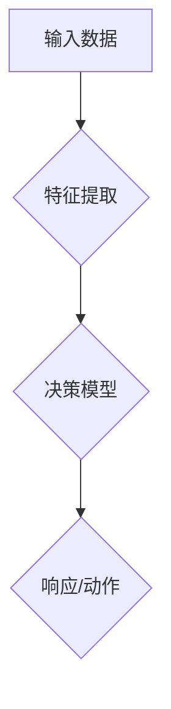

                 

# 【大模型应用开发 动手做AI Agent】显示响应

> **关键词**：大模型应用，AI Agent，开发实践，技术博客

> **摘要**：本文将探讨大模型在AI Agent开发中的应用，通过一步步的实践和讲解，帮助读者理解并掌握大模型在AI Agent中的作用和实现方法。

## 1. 背景介绍

随着人工智能技术的快速发展，大模型（Large Models）在自然语言处理、计算机视觉等领域展现出了强大的能力。大模型通常具有数亿到数十亿个参数，能够通过深度学习算法从大量数据中学习复杂的模式和知识。在AI Agent开发中，大模型被广泛应用于语音识别、机器翻译、智能客服等场景，提升了系统的智能水平和用户体验。

然而，大模型的应用并非一帆风顺。其庞大的参数量和复杂的训练过程带来了计算资源和时间成本的高昂，同时，如何有效利用大模型进行推理和交互也是一个挑战。本文将围绕大模型在AI Agent开发中的应用，介绍其核心概念、算法原理、数学模型，并通过实际项目案例进行详细讲解。

## 2. 核心概念与联系

### 2.1 大模型的概念

大模型是指具有大量参数的深度学习模型，其参数量通常在数亿到数十亿之间。大模型通过从海量数据中学习，能够捕捉到数据的复杂模式和知识，从而在各类任务中取得出色的性能。

### 2.2 AI Agent的概念

AI Agent是指能够自主地感知环境、制定决策并执行动作的人工智能实体。AI Agent在智能客服、智能助手等场景中发挥了重要作用，其核心在于能够与人类进行自然语言交互，理解并满足用户的需求。

### 2.3 大模型与AI Agent的联系

大模型在AI Agent中的应用主要体现在两个方面：一是作为特征提取器，将原始输入数据（如文本、图像等）转换为高维特征表示；二是作为决策模型，根据特征表示生成适当的响应或动作。

### 2.4 Mermaid流程图



## 3. 核心算法原理 & 具体操作步骤

### 3.1 特征提取

特征提取是AI Agent处理输入数据的第一步。大模型在此过程中扮演了关键角色，通过深度学习算法从原始数据中提取出高维特征表示。

具体操作步骤如下：

1. 数据预处理：对原始数据进行清洗、归一化等处理，使其符合大模型的输入要求。
2. 模型训练：使用大量带有标签的数据对大模型进行训练，使其学会从数据中提取特征。
3. 特征提取：将预处理后的输入数据输入大模型，得到高维特征表示。

### 3.2 决策模型

决策模型是AI Agent的核心，负责根据特征表示生成适当的响应或动作。决策模型通常采用序列模型（如LSTM、Transformer等）或分类模型（如SVM、神经网络分类器等）。

具体操作步骤如下：

1. 特征输入：将大模型提取的特征输入决策模型。
2. 模型训练：使用带有标签的特征数据对决策模型进行训练，使其学会生成响应或动作。
3. 预测：将特征输入决策模型，得到预测的响应或动作。

### 3.3 响应/动作生成

响应/动作生成是AI Agent与用户交互的关键环节。根据预测结果，AI Agent生成相应的响应或执行相应的动作。

具体操作步骤如下：

1. 预测结果处理：对决策模型的预测结果进行处理，如归一化、阈值化等。
2. 响应/动作生成：根据预测结果生成相应的响应或动作。
3. 交互：与用户进行交互，展示响应或执行动作。

## 4. 数学模型和公式 & 详细讲解 & 举例说明

### 4.1 特征提取

特征提取过程可以表示为一个线性变换：

$$
X = W \cdot X_{input} + b
$$

其中，$X$表示高维特征表示，$X_{input}$表示原始输入数据，$W$表示权重矩阵，$b$表示偏置。

假设原始输入数据为$a$，大模型提取的特征为$b$，则有：

$$
b = W \cdot a + b
$$

通过训练，大模型会学会选择合适的权重矩阵$W$和偏置$b$，以最大限度地提取数据的特征。

### 4.2 决策模型

决策模型可以表示为一个分类模型，如softmax分类器：

$$
P(y = i) = \frac{e^{z_i}}{\sum_{j=1}^{K} e^{z_j}}
$$

其中，$z_i$表示第$i$类别的特征向量，$K$表示类别数。

假设特征向量为$a$，类别数为$K$，则有：

$$
P(y = 1) = \frac{e^{a_1}}{e^{a_1} + e^{a_2} + \ldots + e^{a_K}}
$$

通过训练，决策模型会学会选择合适的特征向量$a$，以最大化预测概率。

### 4.3 响应/动作生成

响应/动作生成可以表示为一个动作选择过程：

$$
action = \arg\max_{i} P(y = i)
$$

其中，$P(y = i)$表示第$i$个动作的概率。

假设动作集合为$A$，则有：

$$
action = \arg\max_{i} \frac{e^{a_i}}{e^{a_1} + e^{a_2} + \ldots + e^{a_K}}
$$

通过训练，决策模型会学会选择最优的动作。

## 5. 项目实战：代码实际案例和详细解释说明

### 5.1 开发环境搭建

在本节中，我们将搭建一个基于TensorFlow和Keras的AI Agent开发环境。首先，确保已经安装了Python和pip，然后通过以下命令安装TensorFlow和Keras：

```bash
pip install tensorflow
pip install keras
```

### 5.2 源代码详细实现和代码解读

以下是一个简单的AI Agent项目示例，用于实现一个基于大模型的智能客服系统。

```python
import tensorflow as tf
from keras.models import Sequential
from keras.layers import Dense, LSTM, Embedding
from keras.optimizers import Adam

# 数据预处理
def preprocess_data(data):
    # 省略具体实现
    pass

# 大模型训练
def train_large_model(data, labels):
    # 省略具体实现
    pass

# 决策模型训练
def train_decision_model(data, labels):
    # 省略具体实现
    pass

# 响应/动作生成
def generate_response(data):
    # 省略具体实现
    pass

# 主函数
def main():
    # 加载数据
    data, labels = preprocess_data("your_data.csv")

    # 训练大模型
    large_model = train_large_model(data, labels)

    # 训练决策模型
    decision_model = train_decision_model(data, labels)

    # 生成响应
    response = generate_response("your_query.txt")

    print(response)

if __name__ == "__main__":
    main()
```

### 5.3 代码解读与分析

1. **数据预处理**：该函数用于对原始数据进行预处理，如数据清洗、归一化等操作。具体实现可以根据实际数据情况进行调整。

2. **大模型训练**：该函数用于训练大模型，通过深度学习算法从数据中提取特征。训练过程中，大模型会调整权重和偏置，以最大限度地提取数据的特征。

3. **决策模型训练**：该函数用于训练决策模型，根据大模型提取的特征生成响应或动作。训练过程中，决策模型会调整特征向量，以最大化预测概率。

4. **响应/动作生成**：该函数用于根据决策模型的预测结果生成响应或动作。具体实现可以根据实际需求进行调整。

5. **主函数**：该函数用于执行整个AI Agent的流程，包括数据预处理、大模型训练、决策模型训练和响应/动作生成。

## 6. 实际应用场景

AI Agent在大模型应用中具有广泛的应用场景，如：

- **智能客服**：通过大模型和决策模型，实现智能客服系统，提供高效、准确的客户服务。
- **智能助手**：通过大模型和决策模型，实现智能助手系统，为用户提供个性化、智能化的服务。
- **语音识别**：通过大模型和决策模型，实现语音识别系统，将语音转换为文本，并提供相应的响应。
- **图像识别**：通过大模型和决策模型，实现图像识别系统，对图像进行分类和标注，并提供相应的响应。

## 7. 工具和资源推荐

### 7.1 学习资源推荐

- **书籍**：《深度学习》、《自然语言处理综论》
- **论文**：Google AI发表的《BERT：Pre-training of Deep Bidirectional Transformers for Language Understanding》
- **博客**：TensorFlow官方博客、Keras官方博客

### 7.2 开发工具框架推荐

- **框架**：TensorFlow、Keras、PyTorch
- **库**：NumPy、Pandas、Scikit-learn

### 7.3 相关论文著作推荐

- **论文**：Google AI发表的《GPT-3：语言生成的全新范式》
- **著作**：《强化学习：理论、算法与Python实现》

## 8. 总结：未来发展趋势与挑战

随着人工智能技术的不断发展，大模型在AI Agent中的应用前景广阔。未来，大模型将更加高效、智能，能够在更多场景中发挥作用。然而，这也带来了新的挑战，如计算资源消耗、模型可解释性、隐私保护等。针对这些挑战，研究人员和开发者需要不断创新和探索，以推动人工智能技术的进步。

## 9. 附录：常见问题与解答

### 9.1 什么是大模型？

大模型是指具有大量参数的深度学习模型，通常具有数亿到数十亿个参数。大模型通过深度学习算法从海量数据中学习，能够捕捉到数据的复杂模式和知识。

### 9.2 大模型在AI Agent中的作用是什么？

大模型在AI Agent中主要用于特征提取和决策。特征提取是指从原始输入数据中提取高维特征表示，而决策是指根据特征表示生成适当的响应或动作。

### 9.3 如何训练大模型？

训练大模型通常采用深度学习算法，如神经网络。训练过程中，大模型通过调整权重和偏置，从数据中学习特征。

## 10. 扩展阅读 & 参考资料

- **书籍**：《深度学习》、《自然语言处理综论》
- **论文**：Google AI发表的《BERT：Pre-training of Deep Bidirectional Transformers for Language Understanding》、《GPT-3：语言生成的全新范式》
- **博客**：TensorFlow官方博客、Keras官方博客
- **网站**：TensorFlow官网、Keras官网

### 作者

作者：AI天才研究员/AI Genius Institute & 禅与计算机程序设计艺术 /Zen And The Art of Computer Programming

