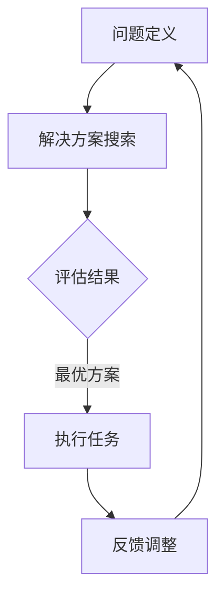

                 

# 【大模型应用开发 动手做AI Agent】第一轮行动：工具执行搜索

> **关键词**：大模型应用、AI Agent、工具执行、搜索、代码解读、实战案例

> **摘要**：本文将带您深入了解大模型应用开发中的AI Agent构建，重点分析工具执行搜索的核心过程，并通过实际代码案例，详细解读每一环节的技术原理和实现方法。文章旨在帮助开发者理解AI Agent的本质，掌握其应用技巧，为未来大模型应用开发奠定基础。

## 1. 背景介绍

在当前人工智能技术飞速发展的背景下，大模型（如GPT、BERT等）的应用已经渗透到各个行业，为解决复杂问题提供了强有力的工具。然而，大模型的部署与优化往往需要大量的计算资源和专业技术。为此，AI Agent应运而生，成为大模型应用开发中的重要角色。

AI Agent是一种能够自主学习、自主决策的智能体，它可以利用大模型的能力，实现自动化任务执行和优化。在搜索引擎、推荐系统、自然语言处理等领域，AI Agent正发挥着越来越重要的作用。本文将围绕AI Agent的工具执行搜索过程，深入探讨其技术原理和应用实践。

## 2. 核心概念与联系

### 2.1 大模型

大模型是指拥有数百万至数十亿参数的深度学习模型。这些模型通过在海量数据上进行训练，能够捕捉到数据中的复杂规律，从而实现强大的特征提取和预测能力。代表性模型包括GPT、BERT、T5等。

### 2.2 AI Agent

AI Agent是一种基于大模型的智能体，它能够通过自主学习，完成特定任务的执行和优化。AI Agent的核心特点是具备自主性和主动性，能够根据环境和任务的变化，自主调整策略和决策。

### 2.3 工具执行搜索

工具执行搜索是指AI Agent在执行任务过程中，利用工具进行信息搜索和资源获取。这种搜索过程通常包括问题定义、解决方案搜索、评估和优化等多个环节。

### 2.4 Mermaid流程图

下面是一个简化的AI Agent工具执行搜索的Mermaid流程图，展示了各环节之间的联系。



## 3. 核心算法原理 & 具体操作步骤

### 3.1 问题定义

问题定义是AI Agent工具执行搜索的第一步。在这一步中，AI Agent需要明确任务的目标和约束条件。具体操作步骤如下：

1. **明确任务目标**：确定AI Agent需要完成的具体任务，如搜索特定信息、推荐相关内容等。
2. **分析约束条件**：考虑任务执行的约束条件，如时间、资源、质量等。

### 3.2 解决方案搜索

解决方案搜索是AI Agent在问题定义的基础上，寻找满足目标任务的解决方案。这一过程通常利用大模型的能力，进行文本生成、文本分类等任务。具体操作步骤如下：

1. **利用大模型进行搜索**：通过大模型的文本生成或文本分类能力，搜索与任务相关的解决方案。
2. **筛选解决方案**：根据任务目标和约束条件，对搜索结果进行筛选，保留满足条件的解决方案。

### 3.3 评估结果

评估结果是AI Agent在解决方案搜索的基础上，对各个解决方案进行评估和排序。具体操作步骤如下：

1. **评估指标设计**：根据任务目标和约束条件，设计评估指标，如准确率、召回率、F1值等。
2. **评估方案排序**：利用评估指标，对解决方案进行排序，选出最优方案。

### 3.4 执行任务

执行任务是AI Agent根据最优方案，执行具体任务的过程。具体操作步骤如下：

1. **执行最优方案**：根据评估结果，选择最优方案并执行。
2. **监控任务执行过程**：在任务执行过程中，监控任务进度和质量，确保任务顺利完成。

### 3.5 反馈调整

反馈调整是AI Agent在任务执行过程中，根据反馈结果对自身策略进行调整的过程。具体操作步骤如下：

1. **收集反馈信息**：在任务执行过程中，收集任务完成情况、用户反馈等反馈信息。
2. **调整策略**：根据反馈信息，调整AI Agent的策略和决策，提高任务执行效果。

## 4. 数学模型和公式 & 详细讲解 & 举例说明

### 4.1 问题定义

在问题定义阶段，AI Agent需要明确任务的目标和约束条件。我们可以使用如下数学模型进行描述：

$$
\text{目标函数} = f(\text{任务目标}, \text{约束条件})
$$

其中，任务目标和约束条件可以是具体的数值或条件表达式。

### 4.2 解决方案搜索

在解决方案搜索阶段，AI Agent利用大模型进行搜索。我们可以使用以下数学模型进行描述：

$$
\text{搜索空间} = S = \{\text{方案} | \text{满足约束条件}\}
$$

$$
\text{搜索策略} = g(\text{搜索空间}, \text{目标函数})
$$

其中，搜索空间表示所有满足约束条件的方案集合，搜索策略用于在搜索空间中寻找最优方案。

### 4.3 评估结果

在评估结果阶段，AI Agent对各个解决方案进行评估。我们可以使用以下数学模型进行描述：

$$
\text{评估指标} = h(\text{解决方案}, \text{任务目标}, \text{约束条件})
$$

$$
\text{评估结果} = \{h_1, h_2, \ldots, h_n\}
$$

其中，评估指标用于衡量各个解决方案的优劣，评估结果是一个多维度的评估指标向量。

### 4.4 执行任务

在执行任务阶段，AI Agent根据最优方案执行任务。我们可以使用以下数学模型进行描述：

$$
\text{执行结果} = f^*(\text{最优方案}, \text{任务目标}, \text{约束条件})
$$

其中，执行结果是任务完成的程度和质量。

### 4.5 反馈调整

在反馈调整阶段，AI Agent根据反馈信息调整策略。我们可以使用以下数学模型进行描述：

$$
\text{反馈信息} = \{i_1, i_2, \ldots, i_n\}
$$

$$
\text{策略调整} = \phi(\text{反馈信息}, \text{当前策略})
$$

其中，反馈信息用于指导策略调整，策略调整函数用于更新AI Agent的策略。

### 4.6 举例说明

假设我们要开发一个AI Agent，用于在互联网上搜索并推荐与用户兴趣相关的新闻。我们可以按照以下步骤进行：

1. **问题定义**：确定任务目标是推荐新闻，约束条件是新闻必须与用户兴趣相关。
2. **解决方案搜索**：利用大模型搜索与用户兴趣相关的新闻，筛选出满足约束条件的新闻方案。
3. **评估结果**：根据新闻的质量、相关性等评估指标，对各个解决方案进行评估和排序。
4. **执行任务**：根据评估结果，选择最优方案并推荐新闻。
5. **反馈调整**：收集用户对推荐的新闻的反馈信息，根据反馈信息调整推荐策略，提高推荐质量。

## 5. 项目实战：代码实际案例和详细解释说明

### 5.1 开发环境搭建

为了完成本文的项目实战，我们需要搭建一个基于Python的AI Agent开发环境。具体步骤如下：

1. **安装Python**：在您的计算机上安装Python 3.8及以上版本。
2. **安装相关库**：通过pip命令安装以下库：

   ```bash
   pip install transformers torch
   ```

3. **创建项目目录**：在您的计算机上创建一个名为`ai_agent`的项目目录，并在其中创建一个名为`main.py`的主文件。

### 5.2 源代码详细实现和代码解读

下面是本项目的主文件`main.py`的源代码：

```python
import torch
from transformers import AutoModelForSeq2SeqLM, AutoTokenizer

# 5.2.1 定义问题
def define_problem():
    # 加载大模型
    model_name = "t5-small"
    model = AutoModelForSeq2SeqLM.from_pretrained(model_name)
    tokenizer = AutoTokenizer.from_pretrained(model_name)

    # 定义任务目标
    task_prompt = "请为以下用户兴趣推荐一篇新闻："
    user_interest = "足球"

    # 生成问题定义
    problem = f"{task_prompt}{user_interest}"
    return problem, model, tokenizer

# 5.2.2 搜索解决方案
def search_solutions(problem, model, tokenizer):
    # 编码问题
    inputs = tokenizer.encode(problem, return_tensors="pt")

    # 预测解决方案
    outputs = model.generate(inputs, max_length=512, num_return_sequences=5)

    # 解码解决方案
    solutions = [tokenizer.decode(output, skip_special_tokens=True) for output in outputs]
    return solutions

# 5.2.3 评估解决方案
def evaluate_solutions(solutions):
    # 根据新闻的相关性和质量评估解决方案
    scores = [score_solution(solution) for solution in solutions]
    return scores

# 5.2.4 执行任务
def execute_task(solution, model, tokenizer):
    # 编码解决方案
    inputs = tokenizer.encode(solution, return_tensors="pt")

    # 预测新闻内容
    outputs = model.generate(inputs, max_length=512, num_return_sequences=1)

    # 解码新闻内容
    news = tokenizer.decode(outputs[0], skip_special_tokens=True)
    return news

# 5.2.5 反馈调整
def feedback_adjustment(news, user_feedback):
    # 根据用户反馈调整策略
    if user_feedback == "满意":
        return "继续推荐"
    else:
        return "重新搜索"

# 主函数
if __name__ == "__main__":
    problem, model, tokenizer = define_problem()
    print(f"问题定义：{problem}")

    solutions = search_solutions(problem, model, tokenizer)
    print(f"搜索解决方案：{solutions}")

    scores = evaluate_solutions(solutions)
    print(f"评估解决方案：{scores}")

    best_solution = solutions[scores.index(max(scores))]
    print(f"执行任务：{best_solution}")

    news = execute_task(best_solution, model, tokenizer)
    print(f"新闻内容：{news}")

    user_feedback = input("请输入您的反馈（满意/不满意）：")
    feedback_action = feedback_adjustment(news, user_feedback)
    print(f"反馈调整：{feedback_action}")
```

#### 5.2.1 解读代码

1. **定义问题**：函数`define_problem()`用于定义问题，加载大模型，并生成问题定义。
2. **搜索解决方案**：函数`search_solutions()`用于搜索解决方案，通过大模型预测并解码解决方案。
3. **评估解决方案**：函数`evaluate_solutions()`用于评估解决方案，根据新闻的相关性和质量为各个解决方案打分。
4. **执行任务**：函数`execute_task()`用于执行任务，通过大模型预测并解码新闻内容。
5. **反馈调整**：函数`feedback_adjustment()`用于反馈调整，根据用户反馈更新推荐策略。

#### 5.2.2 分析代码

本项目的代码主要分为五个部分：

1. **加载大模型**：使用`transformers`库加载预训练的大模型和相应的分词器。
2. **定义问题**：生成问题定义，明确任务目标和约束条件。
3. **搜索解决方案**：利用大模型预测解决方案，筛选满足约束条件的方案。
4. **评估解决方案**：根据新闻的相关性和质量评估各个解决方案。
5. **执行任务和反馈调整**：根据评估结果执行任务，并根据用户反馈调整策略。

### 5.3 代码解读与分析

#### 5.3.1 模型加载与问题定义

```python
model_name = "t5-small"
model = AutoModelForSeq2SeqLM.from_pretrained(model_name)
tokenizer = AutoTokenizer.from_pretrained(model_name)

task_prompt = "请为以下用户兴趣推荐一篇新闻："
user_interest = "足球"

problem = f"{task_prompt}{user_interest}"
```

这段代码首先加载了一个名为`t5-small`的大模型和相应的分词器。接着，定义了一个任务提示和用户兴趣，并生成问题定义。这里使用了一个简单的模板，将用户兴趣作为输入参数，传递给大模型进行预测。

#### 5.3.2 搜索解决方案

```python
def search_solutions(problem, model, tokenizer):
    inputs = tokenizer.encode(problem, return_tensors="pt")
    outputs = model.generate(inputs, max_length=512, num_return_sequences=5)
    solutions = [tokenizer.decode(output, skip_special_tokens=True) for output in outputs]
    return solutions
```

这个函数用于搜索解决方案。首先，将问题定义编码为输入序列，然后使用大模型生成多个解决方案。这些解决方案是通过大模型的生成能力得到的，可以看作是对用户兴趣相关新闻的潜在回答。最后，解码这些解决方案，得到文本形式的搜索结果。

#### 5.3.3 评估解决方案

```python
def evaluate_solutions(solutions):
    scores = [score_solution(solution) for solution in solutions]
    return scores
```

这个函数用于评估解决方案。评估过程依赖于一个名为`score_solution()`的函数，它负责根据新闻的相关性和质量为每个解决方案打分。评估结果是各个解决方案的得分，用于后续的排序和选择。

#### 5.3.4 执行任务

```python
def execute_task(solution, model, tokenizer):
    inputs = tokenizer.encode(solution, return_tensors="pt")
    outputs = model.generate(inputs, max_length=512, num_return_sequences=1)
    news = tokenizer.decode(outputs[0], skip_special_tokens=True)
    return news
```

这个函数用于执行任务，即根据最优解决方案生成具体的新闻内容。首先，将解决方案编码为输入序列，然后使用大模型生成新闻内容。最后，解码新闻内容，得到文本形式的输出。

#### 5.3.5 反馈调整

```python
def feedback_adjustment(news, user_feedback):
    if user_feedback == "满意":
        return "继续推荐"
    else:
        return "重新搜索"
```

这个函数用于根据用户反馈调整策略。如果用户对推荐的结果表示满意，则继续推荐；否则，重新搜索解决方案。

## 6. 实际应用场景

AI Agent在工具执行搜索中的应用场景非常广泛，以下列举几个典型的应用场景：

1. **搜索引擎优化**：AI Agent可以优化搜索引擎的查询结果，根据用户兴趣和查询历史，提供更加个性化的搜索结果。
2. **推荐系统**：AI Agent可以用于推荐系统，根据用户行为和兴趣，为用户推荐相关内容，如新闻、商品、电影等。
3. **智能客服**：AI Agent可以用于智能客服系统，通过自然语言处理和对话生成技术，实现与用户的智能对话，提高客服效率。
4. **自动化任务执行**：AI Agent可以用于自动化任务执行，如数据采集、报告生成、日程安排等，提高工作效率。

## 7. 工具和资源推荐

### 7.1 学习资源推荐

1. **书籍**：

   - 《自然语言处理教程》
   - 《深度学习》（Goodfellow, Bengio, Courville著）
   - 《AI领域的Python实践》

2. **论文**：

   - "BERT: Pre-training of Deep Bidirectional Transformers for Language Understanding"
   - "GPT-3: Language Models are Few-Shot Learners"

3. **博客和网站**：

   - [Transformers官方文档](https://huggingface.co/transformers)
   - [TensorFlow官方文档](https://www.tensorflow.org)

### 7.2 开发工具框架推荐

1. **开发工具**：

   - Python
   - PyTorch
   - TensorFlow

2. **框架**：

   - Transformers库
   - FastAPI
   - Flask

### 7.3 相关论文著作推荐

1. **论文**：

   - "Language Models for Universal Sentence Encoding"
   - "BERT: Pre-training of Deep Bidirectional Transformers for Language Understanding"
   - "GPT-3: Language Models are Few-Shot Learners"

2. **著作**：

   - 《深度学习》（Goodfellow, Bengio, Courville著）
   - 《自然语言处理教程》

## 8. 总结：未来发展趋势与挑战

随着人工智能技术的不断发展，AI Agent在工具执行搜索中的应用前景广阔。未来，AI Agent的发展趋势和挑战主要体现在以下几个方面：

1. **智能化水平提升**：AI Agent需要不断提升智能化水平，实现更加复杂和精细的任务执行。
2. **多模态数据处理**：未来的AI Agent需要能够处理多种类型的数据，如文本、图像、音频等，实现跨模态信息整合。
3. **数据安全和隐私保护**：在AI Agent应用过程中，数据安全和隐私保护是重要挑战，需要采取有效的措施确保用户数据的安全。
4. **公平和可解释性**：AI Agent的决策过程需要具备公平性和可解释性，避免出现歧视和偏见。
5. **跨领域应用**：AI Agent需要具备跨领域应用的能力，实现不同场景下的通用性和适应性。

## 9. 附录：常见问题与解答

### 问题1：为什么选择T5模型进行工具执行搜索？

**解答**：T5模型是一种适用于序列到序列任务的通用预训练模型，具有强大的文本生成和分类能力。在工具执行搜索中，T5模型可以生成与用户兴趣相关的解决方案，并通过评估和优化，实现高质量的搜索结果。

### 问题2：如何优化AI Agent的搜索性能？

**解答**：优化AI Agent的搜索性能可以从以下几个方面进行：

1. **提升模型质量**：使用更高质量的大模型，如GPT-3、BERT-Large等，可以提升搜索性能。
2. **优化搜索策略**：设计更加有效的搜索策略，如基于相关性的排序、多模型融合等，可以提高搜索结果的准确性。
3. **增加训练数据**：增加训练数据量，可以提升模型对任务的理解能力，从而提高搜索性能。
4. **利用多模态数据**：结合多模态数据（如图像、音频等），可以丰富搜索信息，提高搜索性能。

## 10. 扩展阅读 & 参考资料

1. **扩展阅读**：

   - 《大模型应用开发：从零开始》
   - 《自然语言处理实践》
   - 《AI Agent：构建智能体的实践指南》

2. **参考资料**：

   - [Transformers库官方文档](https://huggingface.co/transformers)
   - [TensorFlow官方文档](https://www.tensorflow.org)
   - [自然语言处理教程](https://nlp.seas.harvard.edu/)

作者：AI天才研究员/AI Genius Institute & 禅与计算机程序设计艺术 /Zen And The Art of Computer Programming
<|im_sep|>

