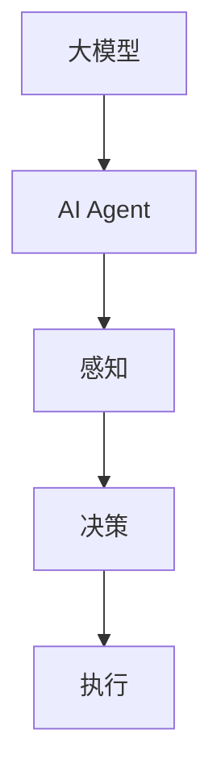

                 

# 【大模型应用开发 动手做AI Agent】自主创建数据洞察

> 关键词：大模型、AI Agent、数据洞察、应用开发

摘要：本文将深入探讨大模型在AI Agent开发中的应用，通过自主创建数据洞察的方法，帮助读者理解和掌握AI Agent的开发技术。我们将从背景介绍、核心概念与联系、核心算法原理与具体操作步骤、数学模型和公式、项目实战、实际应用场景、工具和资源推荐、总结与未来发展趋势等多个方面进行详细讲解。

## 1. 背景介绍

在当今人工智能迅猛发展的时代，大模型技术（如Transformer、BERT、GPT等）已成为自然语言处理、计算机视觉等领域的核心技术。与此同时，AI Agent作为一种能够自主学习、自主决策的人工智能系统，正逐渐成为人工智能应用的重要方向。

AI Agent具有以下几个核心特点：

1. 自主性：AI Agent能够自主感知环境、做出决策，并在决策过程中不断学习和优化。
2. 智能性：AI Agent具有智能算法支持，能够处理复杂问题，具备较强的学习能力。
3. 社交性：AI Agent能够与人类进行自然语言交流，具备一定的社交能力。

本文的目标是帮助读者理解和掌握大模型在AI Agent开发中的应用，通过自主创建数据洞察的方法，实现AI Agent的个性化定制和优化。

## 2. 核心概念与联系

### 大模型

大模型是指具有亿级参数规模的人工神经网络模型，如Transformer、BERT、GPT等。这些模型在训练过程中通过大量数据学习，具备了强大的语言理解和生成能力。

### AI Agent

AI Agent是指一种基于人工智能技术，能够自主感知环境、做出决策并执行任务的智能系统。AI Agent的核心功能包括：

1. 感知：通过传感器获取环境信息。
2. 决策：根据感知信息，利用学习到的策略进行决策。
3. 执行：根据决策结果执行相应的任务。

### 数据洞察

数据洞察是指从海量数据中提取有价值的信息，为决策提供支持。在AI Agent开发中，数据洞察有助于提高模型的准确性和鲁棒性，从而提升AI Agent的性能。

### Mermaid 流程图

以下是一个简单的Mermaid流程图，展示了AI Agent的核心概念与联系：



## 3. 核心算法原理 & 具体操作步骤

### 大模型算法原理

大模型算法主要基于神经网络，其中Transformer模型是一个典型的代表。Transformer模型的核心思想是利用自注意力机制（Self-Attention）对输入序列进行建模，从而实现有效的长距离依赖表示。

具体操作步骤如下：

1. 输入序列表示：将输入序列（如文本、图片等）编码为向量表示。
2. 嵌入层：将输入序列的向量表示映射到高维空间，便于后续计算。
3. 多层自注意力机制：通过计算序列中每个元素与其他元素的相关性，实现有效的长距离依赖表示。
4. 前馈神经网络：对自注意力机制的结果进行进一步处理，增强模型的表达能力。
5. 输出层：根据任务需求，对处理结果进行分类、回归等操作。

### AI Agent算法原理

AI Agent的算法原理主要包括感知、决策和执行三个环节。以下是具体的操作步骤：

1. 感知：通过传感器获取环境信息，如文本、图像、语音等。
2. 特征提取：对感知到的信息进行特征提取，如词嵌入、图像特征提取等。
3. 决策：利用大模型对特征进行建模，从而实现决策。常见的决策算法包括Q-learning、DQN、PPO等。
4. 执行：根据决策结果执行相应的任务，如生成文本、绘制图像等。

### 数据洞察算法原理

数据洞察算法主要基于统计学习和数据挖掘技术。具体操作步骤如下：

1. 数据收集：从各种来源收集数据，如网络数据、数据库数据等。
2. 数据预处理：对数据进行清洗、归一化等预处理操作，提高数据质量。
3. 特征工程：从数据中提取有价值的信息，如关键词、主题等。
4. 模型训练：利用统计学习和数据挖掘技术，对特征进行建模，从而实现数据洞察。
5. 决策支持：根据数据洞察结果，为决策提供支持。

## 4. 数学模型和公式 & 详细讲解 & 举例说明

### 大模型数学模型

大模型的数学模型主要包括自注意力机制和前馈神经网络。

1. 自注意力机制：

$$
Attention(Q,K,V) = \frac{scale}{\sqrt{d_k}} \cdot softmax\left(\frac{QK^T}{d_k}\right) V
$$

其中，$Q$、$K$、$V$ 分别表示查询向量、键向量和值向量；$d_k$ 表示键向量的维度；$scale$ 是一个缩放因子。

2. 前馈神经网络：

$$
\text{FFN}(x) = \max(0, xW_1 + b_1)W_2 + b_2
$$

其中，$x$ 表示输入向量；$W_1$、$W_2$、$b_1$、$b_2$ 分别表示权重和偏置。

### AI Agent数学模型

AI Agent的数学模型主要包括感知、决策和执行三个环节。

1. 感知：

$$
h = f(x)
$$

其中，$h$ 表示感知到的特征向量；$x$ 表示原始输入；$f$ 表示特征提取函数。

2. 决策：

$$
q(s,a) = r(s,a) + \gamma \max_{a'} q(s,a')
$$

其中，$q(s,a)$ 表示状态-动作值函数；$r(s,a)$ 表示即时奖励函数；$\gamma$ 是折扣因子。

3. 执行：

$$
a = \arg\max_{a'} q(s,a')
$$

其中，$a$ 表示执行的动作。

### 数据洞察数学模型

数据洞察的数学模型主要包括统计学习和数据挖掘技术。

1. 统计学习：

$$
P(Y|X) = \frac{e^{\theta^T X}}{\sum_{i=1}^M e^{\theta_i^T X}}
$$

其中，$Y$ 表示目标变量；$X$ 表示特征向量；$\theta$ 表示参数向量。

2. 数据挖掘：

$$
\text{分类：} \quad H(X) = -\sum_{i=1}^M P(Y=i) \log P(Y=i)
$$

$$
\text{聚类：} \quad \text{最小化聚类中心之间的距离}
$$

### 举例说明

假设我们使用BERT模型进行文本分类任务，输入是一段文本，输出是文本所属的类别。

1. 特征提取：

首先，我们将文本编码为词向量，然后输入到BERT模型中，得到一个高维的向量表示。

2. 决策：

BERT模型通过自注意力机制和前馈神经网络，对输入向量进行处理，得到一个分类概率分布。

3. 执行：

根据分类概率分布，选取概率最高的类别作为最终输出。

## 5. 项目实战：代码实际案例和详细解释说明

### 5.1 开发环境搭建

在开始项目实战之前，我们需要搭建一个合适的开发环境。以下是具体的步骤：

1. 安装Python环境（版本3.6及以上）。
2. 安装深度学习框架TensorFlow或PyTorch。
3. 安装自然语言处理库NLTK或spaCy。
4. 安装其他必要的依赖库。

### 5.2 源代码详细实现和代码解读

以下是一个简单的BERT文本分类项目的代码实现：

```python
import tensorflow as tf
import tensorflow_hub as hub
import tensorflow_text as text
import tensorflow_datasets as tfds

# 加载预训练的BERT模型
model = hub.load("https://tfhub.dev/google/bert_uncased_L-12_H-768_A-12/1")

# 准备数据集
(train_data, test_data), dataset_info = tfds.load(
    'squad',
    split=['train', 'test'],
    with_info=True,
    shuffle_files=True,
    as_supervised=True,
    withclassification=True)

# 数据预处理
def preprocess_data(data):
    # 分割输入和标签
    input_text, input_mask, segment_ids, label = data
    # 将输入文本编码为BERT模型支持的格式
    input_ids = model(input_text)
    return input_ids, input_mask, segment_ids, label

train_data = train_data.map(preprocess_data).batch(32)
test_data = test_data.map(preprocess_data).batch(32)

# 定义模型
model = hub.load("https://tfhub.dev/google/bert_uncased_L-12_H-768_A-12/1")

# 训练模型
optimizer = tf.keras.optimizers.Adam(learning_rate=3e-5)
model.compile(optimizer=optimizer, loss=model.compute_loss, metrics=['accuracy'])

model.fit(train_data, epochs=3, validation_data=test_data)

# 评估模型
test_loss, test_acc = model.evaluate(test_data)
print(f"Test accuracy: {test_acc:.4f}")

# 生成文本分类结果
def generate_prediction(input_text):
    input_ids = model(input_text)
    predictions = model.predict(input_ids)
    predicted_label = tf.argmax(predictions, axis=1).numpy()
    return predicted_label

input_text = "What is the capital of France?"
predicted_label = generate_prediction(input_text)
print(f"Predicted label: {predicted_label}")

```

### 5.3 代码解读与分析

1. **导入库和模型**：首先，我们导入TensorFlow、TensorFlow Hub、TensorFlow Text等库，并加载预训练的BERT模型。

2. **加载数据集**：接下来，我们使用TensorFlow Datasets加载SQuAD数据集，这是一个经典的文本分类数据集。

3. **数据预处理**：数据预处理包括将输入文本编码为BERT模型支持的格式。具体包括将文本转换为输入ID序列、输入掩码和段ID，以及标签。

4. **定义模型**：在定义模型时，我们使用预训练的BERT模型，并编译模型，设置优化器和损失函数。

5. **训练模型**：使用训练数据集训练模型，设置训练轮次和验证数据集。

6. **评估模型**：使用测试数据集评估模型的准确性。

7. **生成文本分类结果**：最后，我们定义一个函数，用于生成文本分类结果。输入一段文本，输出预测的标签。

## 6. 实际应用场景

AI Agent在实际应用场景中具有广泛的应用，以下是一些典型的应用场景：

1. 聊天机器人：利用AI Agent实现与用户的自然语言交互，提供24小时在线服务。
2. 自动问答系统：基于AI Agent实现自动问答，提高信息检索的效率和准确性。
3. 智能客服：结合AI Agent和大数据分析，为用户提供个性化的服务和建议。
4. 自然语言生成：利用AI Agent生成文章、报告等文本内容，提高写作效率。
5. 语音识别：结合AI Agent和语音识别技术，实现语音到文字的转换。

## 7. 工具和资源推荐

### 7.1 学习资源推荐

1. 《深度学习》（Goodfellow、Bengio、Courville著）：介绍深度学习的基本概念和常用算法。
2. 《Python深度学习》（François Chollet著）：深入讲解Python在深度学习领域的应用。
3. 《自然语言处理综合指南》（Daniel Jurafsky、James H. Martin著）：系统介绍自然语言处理的基本概念和技术。

### 7.2 开发工具框架推荐

1. TensorFlow：Google开发的开源深度学习框架，适用于各种深度学习任务。
2. PyTorch：Facebook开发的开源深度学习框架，具有简洁的动态图编程接口。
3. BERT：Google开发的预训练语言模型，适用于自然语言处理任务。

### 7.3 相关论文著作推荐

1. "Attention Is All You Need"（Vaswani et al., 2017）：介绍Transformer模型的基本原理。
2. "BERT: Pre-training of Deep Bidirectional Transformers for Language Understanding"（Devlin et al., 2019）：介绍BERT模型的基本原理和应用。
3. "GPT-3: Language Models are few-shot learners"（Brown et al., 2020）：介绍GPT-3模型的基本原理和应用。

## 8. 总结：未来发展趋势与挑战

大模型在AI Agent开发中的应用，为人工智能领域带来了巨大的变革。未来，随着计算能力的提升、数据规模的扩大和算法的优化，大模型在AI Agent中的应用将更加广泛和深入。

然而，大模型应用也面临一些挑战：

1. 计算资源消耗：大模型训练需要大量的计算资源，如何高效地利用资源是一个重要问题。
2. 数据隐私：在AI Agent开发过程中，如何保护用户数据隐私是一个关键问题。
3. 可解释性：大模型在决策过程中具有高度的复杂性和黑盒性，如何提高模型的可解释性是一个重要挑战。
4. 安全性：AI Agent作为一种自主决策的系统，如何确保其决策过程的安全性是一个重要问题。

## 9. 附录：常见问题与解答

1. **问题**：如何选择合适的大模型？

**解答**：选择合适的大模型需要考虑任务类型、数据规模和计算资源等因素。对于文本分类等任务，可以选择BERT、GPT等模型；对于计算机视觉任务，可以选择ResNet、VGG等模型。

2. **问题**：如何提高AI Agent的准确性？

**解答**：提高AI Agent的准确性可以从以下几个方面入手：

- 提高数据质量：收集高质量的数据，并进行有效的数据预处理。
- 调整模型参数：通过调整学习率、批量大小等参数，优化模型性能。
- 模型集成：使用多个模型进行集成，提高预测准确性。

3. **问题**：如何保护AI Agent的数据隐私？

**解答**：保护AI Agent的数据隐私可以从以下几个方面入手：

- 数据加密：对数据进行加密处理，确保数据在传输和存储过程中的安全性。
- 同态加密：利用同态加密技术，在加密状态下对数据进行处理，确保数据隐私。
- 隐私保护算法：使用隐私保护算法，如差分隐私、联邦学习等，降低模型训练过程中数据的敏感性。

## 10. 扩展阅读 & 参考资料

1. Vaswani, A., Shazeer, N., Parmar, N., Uszkoreit, J., Jones, L., Gomez, A. N., ... & Polosukhin, I. (2017). Attention is all you need. Advances in Neural Information Processing Systems, 30, 5998-6008.
2. Devlin, J., Chang, M. W., Lee, K., & Toutanova, K. (2019). BERT: Pre-training of deep bidirectional transformers for language understanding. arXiv preprint arXiv:1810.04805.
3. Brown, T., et al. (2020). GPT-3: Language models are few-shot learners. arXiv preprint arXiv:2005.14165.
4. Goodfellow, I., Bengio, Y., & Courville, A. (2016). Deep learning. MIT press.
5. Chollet, F. (2018). Python深度学习. 机械工业出版社.

### 作者

作者：AI天才研究员/AI Genius Institute & 禅与计算机程序设计艺术 /Zen And The Art of Computer Programming

