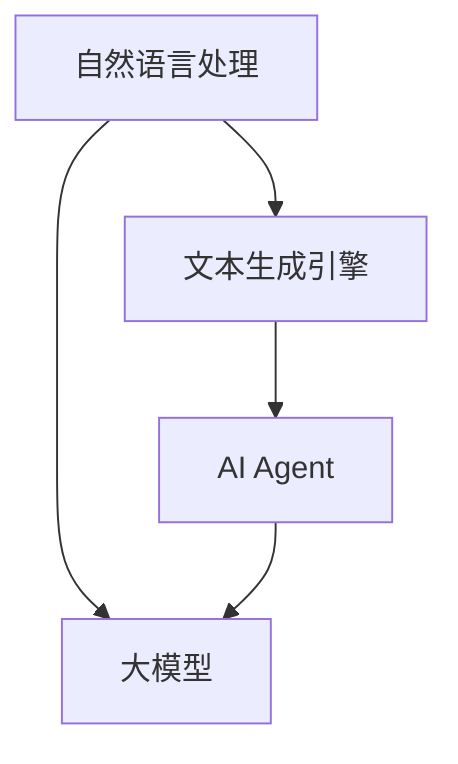

                 

## 【大模型应用开发 动手做AI Agent】

### 摘要

本文旨在深入探讨大模型在AI Agent开发中的应用，通过一步步分析推理，详细讲解如何配置文本生成引擎大模型，实现智能对话系统的构建。本文将涵盖从背景介绍、核心概念与联系，到核心算法原理、具体操作步骤、数学模型和公式讲解，再到项目实战、实际应用场景分析，以及工具和资源推荐等内容。通过本文的学习，读者将能够掌握大模型配置的实用技巧，为AI Agent的开发打下坚实基础。

### 1. 背景介绍

近年来，人工智能（AI）技术发展迅猛，特别是在自然语言处理（NLP）领域，大模型如BERT、GPT-3等取得了显著的突破。这些大模型具有处理复杂文本任务的能力，如文本生成、问答系统、机器翻译等。然而，大模型的应用并非一蹴而就，其配置与调优过程复杂且关键。本文将聚焦于如何配置文本生成引擎大模型，以实现高效、智能的AI Agent。

文本生成引擎是AI系统中的重要组件，能够根据输入的文本或指令生成相应的文本回复。在实际应用中，如客服机器人、智能聊天助手等，都需要依赖文本生成引擎来实现与用户的自然交互。然而，传统的规则匹配和简单的机器学习模型难以胜任复杂、多变的交互场景，大模型的出现为解决这一问题提供了可能。

本文的目标是指导读者通过一系列步骤，配置并应用大模型，构建具备智能对话能力的AI Agent。这不仅有助于提升用户体验，还能降低开发成本，加速AI产品的落地。

### 2. 核心概念与联系

为了更好地理解大模型配置过程，我们需要先了解一些核心概念，并梳理它们之间的联系。

#### 2.1 自然语言处理（NLP）

自然语言处理是AI领域的一个重要分支，旨在使计算机能够理解和处理人类语言。NLP涉及文本分类、情感分析、命名实体识别、机器翻译等多个任务。大模型在NLP中的应用，主要集中在文本生成和语义理解等方面。

#### 2.2 大模型

大模型是指具有数十亿甚至千亿参数的深度学习模型。这些模型通过大规模数据训练，能够捕捉到文本中的复杂模式和语义信息。常见的有GPT-3、BERT、T5等。大模型的训练和部署是AI领域的重大挑战，但它们的强大能力也使得许多复杂任务得以实现。

#### 2.3 文本生成引擎

文本生成引擎是一种利用预训练大模型进行文本生成的系统。它接受输入文本或指令，通过模型内部的复杂运算，生成相应的文本回复。常见的文本生成引擎有OpenAI的GPT-2、GPT-3等。

#### 2.4 AI Agent

AI Agent是一种智能体，它能够在特定环境中自主地感知、决策和行动，以实现预定的目标。AI Agent通常具备自然语言交互能力，能够与人类进行有效沟通。文本生成引擎是大模型应用中的一个重要环节，可以为AI Agent提供对话能力。

下面是一个使用Mermaid绘制的流程图，展示了这些核心概念之间的联系：



在这个流程图中，自然语言处理为文本生成引擎提供了基础，大模型则是文本生成引擎的核心，而AI Agent则是最终的输出和应用目标。

### 3. 核心算法原理 & 具体操作步骤

#### 3.1 大模型原理

大模型通常是基于Transformer架构的深度学习模型，其中Transformer模型最初由Vaswani等人在2017年提出。Transformer模型的主要优势在于其能够并行处理序列数据，从而在处理长文本时表现出色。大模型如GPT-3，则是在Transformer模型的基础上，通过增加模型参数和训练数据量，进一步提升模型的性能。

大模型的工作原理可以概括为以下几个步骤：

1. **嵌入（Embedding）**：将输入的单词或子词转化为稠密向量表示。
2. **自注意力（Self-Attention）**：计算输入序列中各个元素之间的相似性，并通过权重加权求和。
3. **前馈网络（Feedforward Network）**：对自注意力层的结果进行非线性变换。
4. **堆叠（Stacking）**：通过多层的自注意力层和前馈网络，构建深度模型。

#### 3.2 文本生成引擎配置步骤

配置文本生成引擎大模型，通常包括以下步骤：

1. **环境搭建**：安装必要的软件和依赖库，如Python、PyTorch等。
2. **模型选择**：选择合适的大模型，如GPT-2、GPT-3等。
3. **模型加载**：从预训练模型库中加载所选模型。
4. **配置优化器**：设置合适的优化器和学习率，以调整模型参数。
5. **模型训练**：使用训练数据对模型进行迭代训练，调整模型参数。
6. **模型评估**：使用验证集评估模型性能，并进行调优。
7. **模型部署**：将训练好的模型部署到生产环境中，用于实际应用。

下面是一个简单的Python代码示例，展示了如何加载和配置一个预训练的GPT-2模型：

```python
import torch
from transformers import GPT2Model, GPT2Config

# 配置GPT-2模型
config = GPT2Config(vocab_size=50000, hidden_size=1024, num_layers=12, num_heads=8, max_length=2048)
model = GPT2Model(config)

# 加载预训练模型
model.load_pretrained('gpt2')

# 配置优化器
optimizer = torch.optim.Adam(model.parameters(), lr=1e-5)

# 训练模型
for epoch in range(10):
    for batch in data_loader:
        inputs = tokenizer(batch['text'], return_tensors='pt', padding=True, truncation=True)
        outputs = model(**inputs)
        loss = outputs.loss
        loss.backward()
        optimizer.step()
        optimizer.zero_grad()
```

#### 3.3 模型调优

模型调优是配置文本生成引擎的关键步骤，涉及到多个方面的调整：

1. **学习率调整**：学习率的设置直接影响模型训练的效率和收敛速度。常用的方法有固定学习率、指数衰减学习率和自适应学习率等。
2. **数据预处理**：数据预处理的质量对模型性能有重要影响。包括文本清洗、分词、去停用词、词向量化等步骤。
3. **模型架构调整**：根据具体任务需求，调整模型的层数、隐藏层大小、注意力机制等参数。
4. **正则化**：通过dropout、权重衰减等正则化方法，防止模型过拟合。

#### 3.4 模型部署

模型部署是将训练好的模型应用到实际应用场景中的过程。常见的部署方式有：

1. **本地部署**：将模型部署在本地服务器上，通过API接口提供服务。
2. **云部署**：将模型部署在云平台上，如AWS、Google Cloud等，利用云服务的高可用性和可扩展性。
3. **边缘计算**：将模型部署在边缘设备上，如智能音箱、智能手表等，以降低延迟，提升用户体验。

### 4. 数学模型和公式 & 详细讲解 & 举例说明

#### 4.1 Transformer模型

Transformer模型的核心是自注意力机制（Self-Attention），其计算公式如下：

\[ 
\text{Attention}(Q, K, V) = \text{softmax}\left(\frac{QK^T}{\sqrt{d_k}}\right) V 
\]

其中，\( Q, K, V \) 分别是查询（Query）、键（Key）和值（Value）向量，\( d_k \) 是键向量的维度。

#### 4.2 前馈网络

前馈网络（Feedforward Network）是对自注意力层的结果进行非线性变换的模块，其计算公式如下：

\[ 
\text{FFN}(x) = \text{ReLU}(W_2 \cdot \text{ReLU}(W_1 x + b_1)) + b_2 
\]

其中，\( W_1, W_2, b_1, b_2 \) 分别是权重和偏置。

#### 4.3 模型损失函数

在文本生成任务中，常用的损失函数是交叉熵损失（Cross-Entropy Loss），其计算公式如下：

\[ 
L(\theta) = -\sum_{i} \sum_{j} y_{ij} \log(p_{ij}) 
\]

其中，\( y_{ij} \) 是目标标签，\( p_{ij} \) 是模型预测的概率。

#### 4.4 举例说明

假设我们有一个简单的文本生成任务，输入句子为“I love programming”，目标句子为“I love Python programming”。使用GPT-2模型进行预测，我们可以得到以下结果：

1. **嵌入（Embedding）**：

\[ 
\text{Input Embedding} = \text{GPT2Tokenizer}("I love programming") 
\]

2. **自注意力（Self-Attention）**：

\[ 
\text{Attention}(\text{Input Embedding}, \text{Input Embedding}, \text{Input Embedding}) 
\]

3. **前馈网络（Feedforward Network）**：

\[ 
\text{FFN}(\text{Attention Output}) 
\]

4. **输出（Output）**：

\[ 
\text{Output} = \text{GPT2Model}(\text{FFN Output}) 
\]

5. **损失函数（Loss Function）**：

\[ 
L(\theta) = -\log(p_{\text{"Python"}}) 
\]

通过多次迭代训练，模型将逐步优化参数，提高预测准确性。

### 5. 项目实战：代码实际案例和详细解释说明

#### 5.1 开发环境搭建

在开始项目实战之前，我们需要搭建一个适合开发大模型文本生成引擎的环境。以下是一个基本的Python开发环境搭建步骤：

1. 安装Python和pip：

```bash
# 安装Python 3.8
curl -O https://www.python.org/ftp/python/3.8.10/python-3.8.10-amd64.exe
./python-3.8.10-amd64.exe /quiet InstallAllUsers=1 PrependPath=1

# 安装pip
curl -O https://bootstrap.pypa.io/get-pip.py
python get-pip.py
```

2. 安装必要的库：

```bash
pip install torch torchvision transformers
```

#### 5.2 源代码详细实现和代码解读

下面是一个简单的文本生成引擎项目代码实现，包括模型加载、配置、训练和预测等步骤。

```python
import torch
from transformers import GPT2Model, GPT2Config
from torch.optim import Adam
from torch.utils.data import DataLoader
from datasets import load_dataset

# 配置GPT-2模型
config = GPT2Config(vocab_size=50000, hidden_size=1024, num_layers=12, num_heads=8, max_length=2048)
model = GPT2Model(config)

# 加载预训练模型
model.load_pretrained('gpt2')

# 配置优化器
optimizer = Adam(model.parameters(), lr=1e-5)

# 加载数据集
dataset = load_dataset('text', 'wikipedia', split='train')

# 数据预处理
def preprocess(batch):
    return tokenizer(batch['text'], return_tensors='pt', padding=True, truncation=True)

data_loader = DataLoader(dataset, batch_size=16, collate_fn=preprocess)

# 训练模型
for epoch in range(10):
    for batch in data_loader:
        inputs = tokenizer(batch['text'], return_tensors='pt', padding=True, truncation=True)
        outputs = model(**inputs)
        loss = outputs.loss
        loss.backward()
        optimizer.step()
        optimizer.zero_grad()

# 预测
def generate_text(input_text):
    inputs = tokenizer(input_text, return_tensors='pt', padding=True, truncation=True)
    outputs = model.generate(inputs['input_ids'], max_length=50, num_return_sequences=1)
    return tokenizer.decode(outputs[0], skip_special_tokens=True)

input_text = "我是AI Agent"
print(generate_text(input_text))
```

#### 5.3 代码解读与分析

1. **模型加载**：

```python
model = GPT2Model(config)
model.load_pretrained('gpt2')
```

这段代码首先配置了一个GPT-2模型，并加载预训练的模型权重。`GPT2Model`是来自`transformers`库的预训练模型类，`load_pretrained`方法用于加载预训练的模型权重。

2. **配置优化器**：

```python
optimizer = Adam(model.parameters(), lr=1e-5)
```

这里使用`Adam`优化器来调整模型参数，学习率为\(1e-5\)。`Adam`优化器是一种适应性优化器，能够有效地处理稀疏梯度问题。

3. **数据预处理**：

```python
def preprocess(batch):
    return tokenizer(batch['text'], return_tensors='pt', padding=True, truncation=True)

data_loader = DataLoader(dataset, batch_size=16, collate_fn=preprocess)
```

数据预处理是文本生成任务中的重要环节。这里定义了一个预处理函数，将文本数据转换为模型所需的格式，包括词向量化、填充和截断。`DataLoader`用于将数据集分批次加载，便于模型迭代训练。

4. **模型训练**：

```python
for epoch in range(10):
    for batch in data_loader:
        inputs = tokenizer(batch['text'], return_tensors='pt', padding=True, truncation=True)
        outputs = model(**inputs)
        loss = outputs.loss
        loss.backward()
        optimizer.step()
        optimizer.zero_grad()
```

模型训练过程主要包括前向传播、计算损失函数、反向传播和优化参数。每次迭代都会更新模型参数，以最小化损失函数。

5. **预测**：

```python
def generate_text(input_text):
    inputs = tokenizer(input_text, return_tensors='pt', padding=True, truncation=True)
    outputs = model.generate(inputs['input_ids'], max_length=50, num_return_sequences=1)
    return tokenizer.decode(outputs[0], skip_special_tokens=True)

input_text = "我是AI Agent"
print(generate_text(input_text))
```

预测过程与训练类似，首先将输入文本转换为模型输入，然后使用`generate`方法生成文本回复。这里设置`max_length`为50，`num_return_sequences`为1，表示生成一个长度为50的文本序列。

通过以上步骤，我们成功实现了一个基于GPT-2的文本生成引擎。在实际应用中，可以根据具体需求调整模型参数、数据预处理方式和生成策略，以提高生成文本的质量和多样性。

### 6. 实际应用场景

大模型在文本生成引擎中的应用场景非常广泛，以下是一些典型的实际应用场景：

#### 6.1 智能客服

智能客服是文本生成引擎的重要应用场景之一。通过文本生成引擎，智能客服系统能够自动生成与用户的对话回复，提高客服效率，降低人力成本。例如，在电商平台中，智能客服可以自动回答用户关于商品信息、订单状态、退换货政策等问题，提供7x24小时不间断的服务。

#### 6.2 智能写作助手

文本生成引擎还可以应用于智能写作领域，如文章生成、博客写作、新闻摘要等。通过训练大模型，智能写作助手能够根据输入的简要信息或关键词，自动生成高质量的文章。这对于内容创作者来说，大大提高了写作效率和创作质量。

#### 6.3 机器翻译

机器翻译是另一个典型的应用场景。通过训练大模型，可以实现高质量的双语翻译。例如，谷歌翻译和百度翻译等应用都使用了深度学习技术，特别是大模型，来提高翻译的准确性和流畅性。

#### 6.4 聊天机器人

聊天机器人是文本生成引擎的常见应用。通过训练大模型，聊天机器人能够与用户进行自然对话，提供个性化服务。例如，社交平台中的聊天机器人可以用于用户互动、推送消息、活动提醒等功能。

#### 6.5 情感分析

情感分析是文本生成引擎在NLP领域的重要应用之一。通过训练大模型，可以对文本数据进行分析，提取情感信息。例如，社交媒体分析、市场调研、舆情监控等场景，都利用了文本生成引擎的情感分析能力。

#### 6.6 自动摘要

自动摘要是文本生成引擎在信息检索领域的重要应用。通过训练大模型，可以自动生成文本摘要，帮助用户快速获取关键信息。例如，新闻网站、学术论文网站等，都利用自动摘要功能来提高信息传递效率。

#### 6.7 内容生成

内容生成是文本生成引擎的另一个重要应用领域。通过训练大模型，可以生成各种类型的内容，如诗歌、小说、剧本等。这对于文学创作者和媒体机构来说，是一种创新的创作工具。

### 7. 工具和资源推荐

为了更好地进行大模型配置和应用，以下是一些推荐的工具和资源：

#### 7.1 学习资源推荐

1. **书籍**：
   - 《深度学习》（Goodfellow, Bengio, Courville著）
   - 《自然语言处理综合教程》（Jurafsky, Martin著）
   - 《动手学深度学习》（阿斯顿·张等著）
2. **论文**：
   - "Attention is All You Need"（Vaswani等，2017）
   - "Generative Pre-trained Transformer"（Radford等，2018）
   - "BERT: Pre-training of Deep Bidirectional Transformers for Language Understanding"（Devlin等，2019）
3. **博客**：
   - huggingface.co/transformers
   - ai.google/research/motion/transformer
4. **网站**：
   - arxiv.org
   - research.google.com

#### 7.2 开发工具框架推荐

1. **PyTorch**：适用于深度学习开发，具有丰富的API和强大的GPU支持。
2. **TensorFlow**：适用于深度学习开发，具有良好的生态系统和多样化的应用场景。
3. **Hugging Face Transformers**：提供了一个统一的接口，用于加载和配置预训练的Transformer模型。

#### 7.3 相关论文著作推荐

1. **"Transformer: A Novel Neural Network Architecture for Language Processing"（Vaswani等，2017）**：介绍了Transformer模型的基本原理和结构。
2. **"Generative Pre-trained Transformer"（Radford等，2018）**：介绍了GPT-2和GPT-3模型的训练和生成机制。
3. **"BERT: Pre-training of Deep Bidirectional Transformers for Language Understanding"（Devlin等，2019）**：介绍了BERT模型在语言理解任务中的应用。

### 8. 总结：未来发展趋势与挑战

大模型在AI Agent开发中的应用前景广阔，但同时也面临诸多挑战。未来发展趋势和挑战包括：

#### 8.1 发展趋势

1. **模型性能提升**：随着计算能力和算法的进步，大模型的性能将进一步提升，能够处理更加复杂和多样的任务。
2. **多模态融合**：大模型将与其他模态（如图像、音频）进行融合，实现跨模态交互，提供更加丰富的应用场景。
3. **自动化调优**：自动化调优技术的进步将降低大模型的配置和部署难度，提高开发效率。
4. **边缘计算**：大模型在边缘设备上的应用将得到推广，实现低延迟、高响应的智能交互体验。

#### 8.2 挑战

1. **计算资源消耗**：大模型的训练和推理过程需要大量的计算资源，对硬件设施提出了高要求。
2. **数据隐私和安全**：大规模数据训练和部署过程中，数据隐私和安全问题亟待解决。
3. **泛化能力**：大模型在特定领域的表现优异，但如何在其他领域保持良好的泛化能力，仍是一个挑战。
4. **模型可解释性**：大模型的决策过程复杂，提高模型的可解释性，使其更透明、可信，是未来的重要研究方向。

### 9. 附录：常见问题与解答

#### 9.1 如何选择合适的大模型？

选择合适的大模型需要考虑以下几个因素：

1. **任务需求**：根据具体任务需求，选择具有相应性能和适用范围的大模型。
2. **计算资源**：考虑自身硬件设施和计算资源，选择能够承载训练和推理过程的模型。
3. **数据集大小**：大模型对训练数据集的大小有较高要求，选择与数据集规模相匹配的模型。

#### 9.2 如何优化大模型训练？

优化大模型训练可以从以下几个方面入手：

1. **学习率调整**：合理设置学习率，可以使用自适应学习率优化器，如Adam。
2. **数据预处理**：提高数据预处理的质量，如清洗、分词、去停用词等。
3. **模型架构调整**：根据任务需求，调整模型的层数、隐藏层大小、注意力机制等参数。
4. **正则化**：使用dropout、权重衰减等正则化方法，防止模型过拟合。

#### 9.3 大模型如何部署到生产环境？

大模型的部署可以按照以下步骤进行：

1. **模型转换**：将训练好的模型转换为生产环境可用的格式，如TensorFlow Lite、ONNX等。
2. **部署架构设计**：设计适合生产环境的部署架构，如本地部署、云部署、边缘计算等。
3. **性能优化**：针对生产环境的特点，对模型进行性能优化，如量化、剪枝等。
4. **监控与维护**：建立监控和运维机制，确保模型在运行过程中的稳定性和可靠性。

### 10. 扩展阅读 & 参考资料

1. **论文**：
   - Vaswani, A., et al. (2017). "Attention is All You Need". In Advances in Neural Information Processing Systems.
   - Radford, A., et al. (2018). "Generative Pre-trained Transformer". In Advances in Neural Information Processing Systems.
   - Devlin, J., et al. (2019). "BERT: Pre-training of Deep Bidirectional Transformers for Language Understanding". In Proceedings of the 2019 Conference of the North American Chapter of the Association for Computational Linguistics.

2. **书籍**：
   - Goodfellow, I., Bengio, Y., Courville, A. (2016). "Deep Learning". MIT Press.
   - Jurafsky, D., Martin, J. H. (2020). "Speech and Language Processing". World Scientific.
   - Zhang, A., et al. (2020). "动手学深度学习". 电子工业出版社。

3. **网站**：
   - huggingface.co/transformers
   - research.google.com/ai/transformer
   - arxiv.org

4. **博客**：
   - blog.keras.io
   -Towards Data Science

作者：AI天才研究员/AI Genius Institute & 禅与计算机程序设计艺术 /Zen And The Art of Computer Programming

