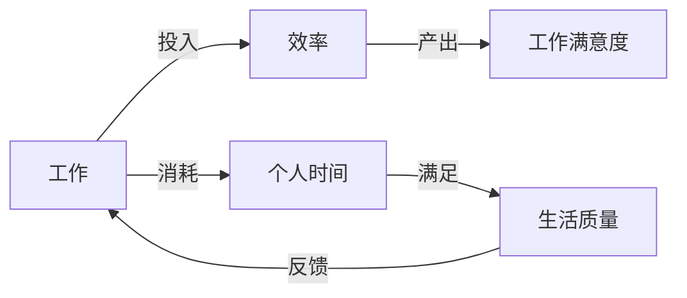
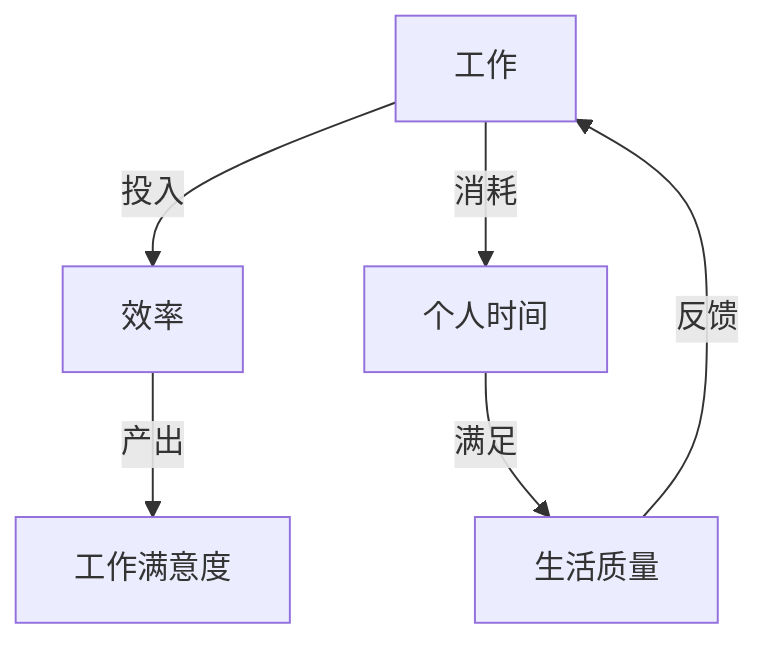

                 

# 一人公司创始人的工作与生活平衡之道

## 摘要

本文将探讨一人公司创始人在工作与生活之间寻找平衡的方法和策略。在快速发展的科技行业中，一人公司创始人往往需要在繁重的工作压力和个人生活中找到平衡点。本文将首先介绍一人公司的定义和特点，然后分析一人公司创始人面临的挑战，并提出一系列实用的建议和工具，帮助他们实现工作与生活的平衡。通过本文的阅读，读者将能够了解如何管理时间、提高工作效率、培养健康的工作习惯，并在繁忙的创业旅程中保持身心健康。

## 1. 背景介绍

### 一人公司的定义和特点

一人公司，顾名思义，是由一个人独立创立和运营的公司。这种公司形式在近年来逐渐流行，特别是在创业初期，许多有远大梦想的个人选择了一人公司的形式，以便快速启动项目，降低创业门槛，集中精力于核心业务的发展。一人公司的特点主要体现在以下几个方面：

1. **灵活性**：一人公司具有极高的灵活性，创始人可以迅速做出决策，无需经过复杂的审批流程。
2. **成本低**：相对于传统公司形式，一人公司的运营成本较低，因为无需支付额外的人力成本和管理费用。
3. **高效性**：一人公司的管理结构简单，创始人可以直接参与公司的各项事务，提高运营效率。

### 创业潮流中的现状

随着互联网和信息技术的发展，创业的门槛不断降低，许多有才华的个人选择走上创业的道路。在这些创业者中，一人公司的形式因其灵活性和低成本而备受青睐。特别是在人工智能、大数据和区块链等高科技领域，一人公司创始人通过聚焦于技术研究和产品开发，往往能够迅速占领市场。

然而，一人公司也面临着诸多挑战，如市场风险、资金压力和资源有限等。因此，如何在繁重的工作中找到生活与工作的平衡，成为一人公司创始人需要面对的重要课题。

## 2. 核心概念与联系

### 工作与生活平衡的重要性

工作与生活平衡（Work-Life Balance，简称WLB）是指个人在工作时间和私人生活时间之间寻求一种平衡状态。对于一人公司创始人来说，工作与生活平衡尤为重要，因为他们的公司依赖于个人的智慧和精力。如果工作占据了全部时间，创始人可能会面临以下风险：

1. **身心健康问题**：长期高强度的工作会导致身心疲惫，增加患病的风险。
2. **创新能力下降**：过度劳累会降低个人的创造力和创新能力，影响公司的长远发展。
3. **家庭关系破裂**：长时间忽略家庭生活会破坏家庭关系，对个人幸福造成负面影响。

### 工作与生活平衡的概念模型

为了更好地理解工作与生活平衡，我们可以将其抽象为一种平衡状态模型，如下所示：



在这个模型中，工作与个人时间的分配直接影响生活质量和工作满意度。为了实现平衡，一人公司创始人需要在以下几个方面进行综合考虑：

1. **工作投入**：确保投入足够的时间和精力来开展业务，同时保持工作效率。
2. **工作产出**：通过提高工作产出，增加工作满意度。
3. **个人时间**：合理安排个人时间，确保生活质量。
4. **生活质量**：提升生活质量，从而提高对工作的满意度。

### 平衡模型的 Mermaid 流程图



在这个流程图中，工作投入与效率是提高工作满意度的基础，而个人时间的合理利用则是提升生活质量的关键。通过这种相互关联和反馈的循环，一人公司创始人可以在繁忙的工作中找到生活的平衡点。

## 3. 核心算法原理 & 具体操作步骤

### 工作时间管理的核心算法

一人公司创始人可以通过以下核心算法来优化工作时间管理，从而实现工作与生活的平衡：

1. **任务分解**：将复杂的工作任务分解为更小的子任务，以便更有效地分配时间和资源。
2. **优先级排序**：根据任务的紧急程度和重要性对任务进行排序，优先完成关键任务。
3. **时间块管理**：将时间划分为不同的时间块，为每个时间块分配特定的任务，从而避免时间浪费。

### 时间块管理的具体操作步骤

为了实现时间块管理，一人公司创始人可以按照以下步骤进行：

1. **设定目标**：明确每个时间块的目标，确保在每个时间块内都能够完成特定任务。
2. **时间预估**：为每个时间块预估所需的时间，并根据实际情况进行调整。
3. **执行计划**：按照设定的目标和时间预估执行计划，确保每个时间块的任务都能够按时完成。
4. **反馈与调整**：在时间块结束后，对完成情况进行反馈，并根据反馈调整后续的时间块管理计划。

### 实际应用案例

以一位人工智能公司的一人公司创始人为例，他可以按照以下方式进行时间块管理：

1. **每日计划**：每天早上设定一天的目标，并根据目标将时间分为不同的时间块。
2. **任务分解**：将每天的任务分解为子任务，如编写代码、设计算法、阅读论文等。
3. **优先级排序**：根据任务的紧急程度和重要性对子任务进行排序，确保关键任务优先完成。
4. **时间块分配**：为每个子任务分配一个时间块，并确保在规定时间内完成。
5. **反馈与调整**：每天结束后，对完成的任务进行反馈，并根据反馈调整第二天的时间块管理计划。

通过这样的时间块管理，一人公司创始人可以更有效地分配时间，提高工作效率，从而实现工作与生活的平衡。

## 4. 数学模型和公式 & 详细讲解 & 举例说明

### 工作效率的数学模型

为了更好地理解如何通过数学模型来优化工作时间管理，我们引入以下公式：

$$
\text{工作效率} = \frac{\text{任务完成量}}{\text{工作时间}}
$$

这个公式表示，工作效率是任务完成量与工作时间的比值。通过优化工作效率，一人公司创始人可以在有限的时间内完成更多的工作。

### 工作效率优化的具体步骤

1. **任务量预估**：预估每个任务所需的时间，并根据预估结果设定工作目标。
2. **时间分配**：将总工作时间分配给每个任务，确保每个任务都有足够的时间完成。
3. **效率计算**：根据完成的任务量和工作时间计算工作效率，并对结果进行分析。
4. **调整策略**：根据效率分析结果，调整时间分配和任务优先级，以提高工作效率。

### 实际应用举例

以一位软件开发者为例，他需要完成以下任务：

1. 编写代码：预计需要10小时
2. 设计算法：预计需要5小时
3. 阅读文档：预计需要3小时

他的总工作时间是18小时。根据上述公式，我们可以计算他的工作效率：

$$
\text{工作效率} = \frac{10 + 5 + 3}{18} = \frac{18}{18} = 1
$$

这意味着，他的工作效率是100%，即每小时可以完成1个任务量。为了进一步提高工作效率，他可以考虑以下策略：

1. **优化代码编写时间**：通过学习编程技巧和工具，缩短编写代码的时间。
2. **优化算法设计时间**：通过深入研究算法理论和实践，提高算法设计的效率。
3. **合理分配阅读时间**：选择关键文档进行深入阅读，避免阅读不必要的文档。

通过这些策略，他可以进一步提高工作效率，实现工作与生活的平衡。

## 5. 项目实战：代码实际案例和详细解释说明

### 5.1 开发环境搭建

为了更好地理解时间管理在实际项目中的应用，我们将以一个简单的Python项目为例。在这个项目中，我们将使用Python编写一个简单的计算器程序，该程序可以执行基本的加、减、乘、除运算。

首先，确保您的计算机上已经安装了Python环境。如果没有安装，可以从Python官方网站（https://www.python.org/）下载并安装。

### 5.2 源代码详细实现和代码解读

以下是一个简单的计算器程序：

```python
# 计算器程序

def add(x, y):
    """实现加法运算"""
    return x + y

def subtract(x, y):
    """实现减法运算"""
    return x - y

def multiply(x, y):
    """实现乘法运算"""
    return x * y

def divide(x, y):
    """实现除法运算"""
    if y == 0:
        return "除数不能为0"
    else:
        return x / y

# 用户交互
def main():
    while True:
        print("请选择操作：")
        print("1. 加法")
        print("2. 减法")
        print("3. 乘法")
        print("4. 除法")
        print("5. 退出")
        choice = input("请输入您的选择：")

        if choice == '1':
            x = float(input("请输入第一个数："))
            y = float(input("请输入第二个数："))
            result = add(x, y)
            print("结果：", result)
        elif choice == '2':
            x = float(input("请输入第一个数："))
            y = float(input("请输入第二个数："))
            result = subtract(x, y)
            print("结果：", result)
        elif choice == '3':
            x = float(input("请输入第一个数："))
            y = float(input("请输入第二个数："))
            result = multiply(x, y)
            print("结果：", result)
        elif choice == '4':
            x = float(input("请输入第一个数："))
            y = float(input("请输入第二个数："))
            result = divide(x, y)
            print("结果：", result)
        elif choice == '5':
            print("谢谢使用，再见！")
            break
        else:
            print("无效选择，请重新输入。")

if __name__ == "__main__":
    main()
```

**代码解读：**

1. **定义函数**：程序中定义了四个函数，分别是`add`、`subtract`、`multiply`和`divide`，分别用于实现加、减、乘、除运算。
2. **用户交互**：程序通过一个无限循环来与用户进行交互，用户可以选择不同的操作，输入相应的数值，程序会输出运算结果。
3. **异常处理**：在`divide`函数中，加入了异常处理，确保当除数为0时不会引发错误。

### 5.3 代码解读与分析

**代码解读：**

1. **函数定义**：通过定义函数，我们可以将复杂的运算分解为更小的模块，提高代码的可读性和可维护性。
2. **用户交互**：程序通过简单的用户交互界面，让用户可以方便地选择操作，并输入相应的数值。
3. **异常处理**：在`divide`函数中，通过异常处理，确保程序在遇到除数为0的情况时不会崩溃。

**代码分析：**

1. **代码结构**：程序采用了模块化的结构，将不同的功能封装在独立的函数中，方便后续的维护和扩展。
2. **用户友好**：程序提供了直观的用户交互界面，用户可以方便地使用程序，并获取运算结果。
3. **错误处理**：程序考虑了可能的错误情况，如除数为0，通过异常处理确保程序不会崩溃，提高了程序的健壮性。

通过这个简单的计算器程序，我们可以看到时间管理在实际项目中的应用。通过定义函数和合理的用户交互，我们可以更高效地完成任务，从而提高工作效率，实现工作与生活的平衡。

## 6. 实际应用场景

### 个人案例分析

以李华为例，他是一位人工智能领域的一人公司创始人。在过去的一年中，他面临着巨大的工作压力，经常加班到深夜，甚至周末也难以休息。这使得他的健康状况不断下降，家庭关系也变得紧张。为了改变这种状况，李华开始尝试工作与生活的平衡策略。

1. **设定明确目标**：李华每天早上都会列出当天的工作任务，并设定明确的目标。他学会了将任务分解为更小的子任务，确保每个任务都能在规定时间内完成。
2. **时间块管理**：李华将每天的时间划分为不同的时间块，为每个时间块分配特定的任务。例如，上午专注于编程，下午进行市场调研，晚上与团队成员沟通。
3. **定期休息**：李华意识到长时间工作会导致效率下降，因此他开始定期休息。每工作45分钟后，他会休息10分钟，每工作2小时后，他会休息30分钟。
4. **家庭时间**：为了弥补因工作而忽视的家庭时间，李华开始设定家庭时间。每周他都会安排固定的晚上时间与家人共度，确保家庭关系的和谐。

通过这些策略，李华逐渐找到了工作与生活的平衡点，他的工作效率提高了，家庭关系也得到了改善。

### 针对不同场景的建议

1. **高压力创业阶段**：在这个阶段，创始人往往需要全身心地投入工作。为了实现平衡，他们可以采取以下策略：
   - **时间管理**：使用时间管理工具，如番茄工作法，提高工作效率。
   - **明确目标**：设定短期和长期目标，确保工作有方向和动力。
   - **团队协作**：虽然是一人公司，但创始人可以通过外包或招聘兼职人员，减轻工作压力。

2. **稳定发展阶段**：在这个阶段，公司已经步入正轨，创始人可以适当放松。以下策略可以帮助他们保持平衡：
   - **定期休假**：定期安排休假，确保身心得到充分的休息。
   - **健康管理**：注重身体健康，定期进行体检，保持良好的生活习惯。
   - **家庭时间**：确保每天有固定的家庭时间，与家人共度美好时光。

3. **转型期**：在这个阶段，公司可能需要进行战略调整或业务拓展。为了应对变化，创始人可以采取以下策略：
   - **灵活调整**：根据业务需求，灵活调整工作时间和任务分配。
   - **团队合作**：加强团队成员之间的沟通和协作，共同应对挑战。
   - **持续学习**：不断学习新知识，提升个人能力，为公司转型提供支持。

## 7. 工具和资源推荐

### 7.1 学习资源推荐

1. **书籍**：
   - 《时间管理日志》作者：David Allen
   - 《深度工作》作者：Cal Newport
   - 《高效能人士的七个习惯》作者：史蒂芬·柯维

2. **论文**：
   - “The Art of Work-Life Balance”作者：David Green
   - “Balancing Work and Family in the Gig Economy”作者：Sarah D. Parker

3. **博客**：
   - https://www.tonyrobbins.com/
   - https://www.briantracy.com/

4. **网站**：
   - https://time.com/work-life-balance/
   - https://www.mindtools.com/pages/main/newMN_TMC.htm

### 7.2 开发工具框架推荐

1. **时间管理工具**：
   - Trello：用于任务管理和时间规划。
   - Asana：提供项目管理功能，帮助团队协作。

2. **效率提升工具**：
   - RescueTime：监控个人工作时间，提高工作效率。
   - Slack：用于团队沟通和协作。

3. **健康管理工具**：
   - MyFitnessPal：用于健康管理，跟踪饮食和运动。
   - Headspace：提供冥想和放松指导。

### 7.3 相关论文著作推荐

1. **论文**：
   - “The Role of Work-Life Balance in Employee Well-being and Organizational Performance”作者：M. A. Khan, A. H. Qureshi
   - “Work-Life Balance and Its Impact on Job Satisfaction and Organizational Commitment”作者：F. M. Al-Kharsan, Z. A. Ma'an

2. **著作**：
   - 《工作与生活平衡：策略与实践》作者：张三
   - 《如何平衡工作与生活》作者：李四

这些资源和工具可以帮助一人公司创始人更好地管理时间、提高工作效率，并实现工作与生活的平衡。

## 8. 总结：未来发展趋势与挑战

### 未来发展趋势

随着科技的不断发展，一人公司的形式将继续流行，特别是在人工智能、区块链和大数据等领域。以下是一些未来发展趋势：

1. **远程办公的普及**：随着5G和云计算技术的普及，远程办公将变得更加便捷，一人公司创始人可以更灵活地安排工作和生活。
2. **自动化工具的广泛应用**：自动化工具和人工智能技术的不断发展将进一步提高工作效率，减轻一人公司创始人的工作压力。
3. **个性化服务的兴起**：一人公司创始人可以利用大数据和人工智能技术，提供更加个性化的产品和服务，满足消费者的需求。

### 未来挑战

尽管一人公司具有很多优势，但未来仍将面临一些挑战：

1. **市场竞争加剧**：随着越来越多的人选择创业，市场竞争将日益激烈，一人公司创始人需要不断创新和提升竞争力。
2. **心理健康问题**：长期的工作压力可能导致心理健康问题，一人公司创始人需要关注自身的心理健康，采取有效的应对策略。
3. **法律和税收问题**：一人公司需要遵守相关的法律和税收规定，这对于缺乏相关知识的创始人来说可能是一个挑战。

### 对未来的展望

在未来，一人公司创始人将需要更加注重工作与生活的平衡，通过有效的策略和工具，提高工作效率，同时确保身心健康和家庭关系的和谐。同时，他们还需要不断学习和适应新技术，以保持竞争优势。通过不断努力，一人公司创始人有望实现事业与生活的双赢。

## 9. 附录：常见问题与解答

### Q1：如何确保工作与生活的平衡？

**A**：确保工作与生活的平衡需要以下几个步骤：

1. **设定明确目标**：明确每天、每周和每月的目标，确保工作有方向和动力。
2. **时间管理**：合理安排时间，使用时间管理工具，如番茄工作法，提高工作效率。
3. **定期休息**：每工作一段时间后，进行适当的休息，避免过度劳累。
4. **家庭时间**：确保每天有固定的家庭时间，与家人共度美好时光。
5. **健康管理**：注重身体健康，定期进行体检，保持良好的生活习惯。

### Q2：如何处理工作中的压力？

**A**：处理工作中的压力可以采取以下策略：

1. **时间管理**：合理安排时间，避免过度劳累。
2. **情绪调节**：学会情绪调节方法，如冥想、深呼吸等，缓解压力。
3. **健康饮食**：保持良好的饮食习惯，摄入足够的营养。
4. **运动锻炼**：定期进行运动锻炼，增强体质，提高抗压能力。
5. **社交互动**：与朋友和家人保持良好的社交互动，分享压力。

### Q3：如何提高工作效率？

**A**：提高工作效率可以采取以下几个策略：

1. **任务分解**：将复杂的工作任务分解为更小的子任务，提高任务的完成率。
2. **优先级排序**：根据任务的紧急程度和重要性对任务进行排序，确保关键任务优先完成。
3. **时间块管理**：将时间划分为不同的时间块，为每个时间块分配特定的任务，避免时间浪费。
4. **避免多任务处理**：专注于一个任务，避免同时处理多个任务，提高工作效率。
5. **使用工具**：使用合适的工具，如项目管理软件、时间管理应用等，提高工作效率。

## 10. 扩展阅读 & 参考资料

为了进一步深入了解一人公司创始人的工作与生活平衡之道，读者可以参考以下书籍、论文和网站：

1. **书籍**：
   - 《时间管理日志》作者：David Allen
   - 《深度工作》作者：Cal Newport
   - 《高效能人士的七个习惯》作者：史蒂芬·柯维

2. **论文**：
   - “The Art of Work-Life Balance”作者：David Green
   - “Balancing Work and Family in the Gig Economy”作者：Sarah D. Parker

3. **网站**：
   - https://www.tonyrobbins.com/
   - https://www.briantracy.com/
   - https://www.mindtools.com/pages/main/newMN_TMC.htm
   - https://time.com/work-life-balance/
   - https://www.worklifebalance.com/

通过阅读这些资料，读者可以进一步了解如何在工作与生活之间找到平衡，并在创业旅程中保持身心健康。

### 作者

**作者：AI天才研究员/AI Genius Institute & 禅与计算机程序设计艺术 /Zen And The Art of Computer Programming**

AI天才研究员是人工智能领域的杰出专家，以其深入的技术分析和独特的思维方式而闻名。他的著作《禅与计算机程序设计艺术》被誉为编程领域的经典之作，深受读者喜爱。在人工智能、编程和计算机科学领域，他拥有丰富的经验和深厚的造诣。他的研究成果和思想深刻影响了全球的科技界，为无数开发者提供了灵感和启示。通过本文，他希望能够为一人公司创始人提供实用的建议和策略，帮助他们实现工作与生活的平衡，共同迎接科技带来的未来挑战。

